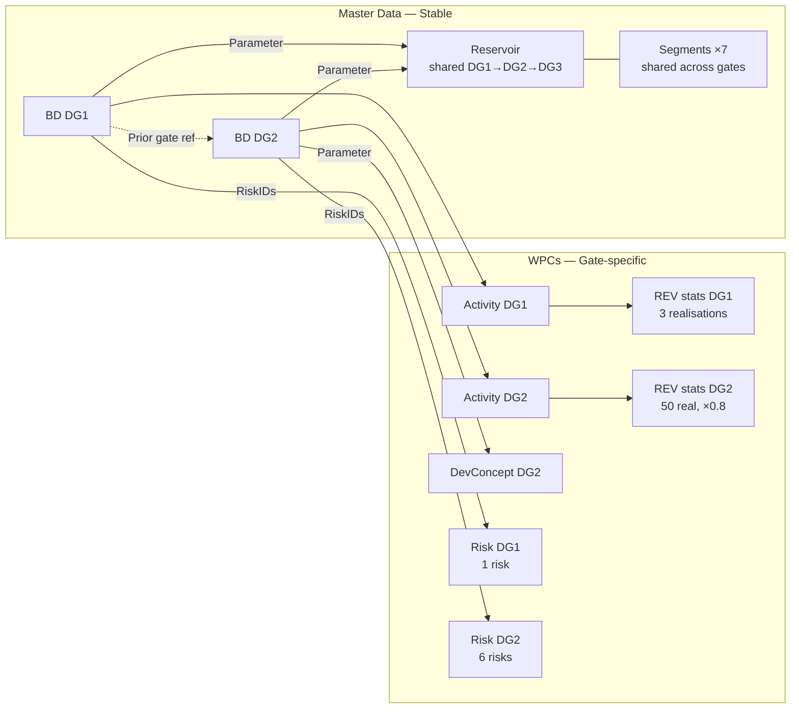
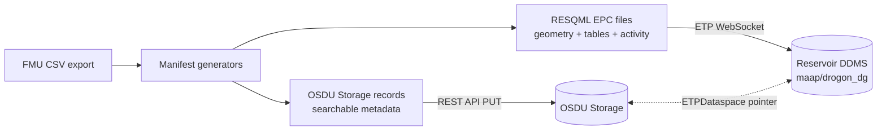
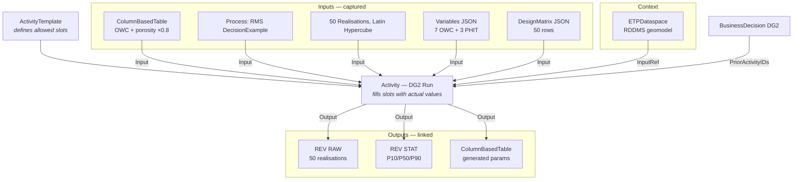

# Drogon DG2 — BusinessDecision Demo Documentation

> **Scope:** This document summarises the **Drogon DG2 (Decision Gate 2 — Concept Select)** demo built for the ORES project. It covers the OSDU data model, schemas, metadata, relationships, the analysis UI, geomodel data residency, and activity-based workflow provenance. The demo illustrates how **BusinessDecision** records can serve as the backbone of subsurface uncertainty, risk, and performance tracking across decision gates.

---

## 1. Schemas Used — Kinds and Relationships

The DG2 demo ingests **~25 records** spanning master-data, reference-data, work-product-components, datasets, and a custom schema. Each kind is listed below with its OSDU kind identifier.

### 1.1 OSDU Canonical Schemas (WKS)

| # | Category | OSDU Kind | Purpose in Demo |
|---|----------|-----------|-----------------|
| 1 | Master-data | `osdu:wks:master-data--BusinessDecision:1.0.0` | The DG2 decision record — the central hub linking all evidence |
| 2 | Master-data | `osdu:wks:master-data--Reservoir:2.0.0` | Drogon reservoir (shared with DG1) |
| 3 | Master-data | `osdu:wks:master-data--ReservoirSegment:2.0.0` | 7 segments: NorthSea, NorthHorst, CentralHorst, CentralFlanks, CentralSouth, SouthWing, EastLobe |
| 4 | Master-data | `osdu:wks:master-data--Risk:1.2.0` | 6 DG2 risks (porosity, fault, HSE, schedule, OWC, recovery factor) |
| 5 | WPC | `osdu:wks:work-product-component--ReservoirEstimatedVolumes:1.1.0` | Raw per-realisation volumes (50 realisations) |
| 6 | WPC | `osdu:wks:work-product-component--ReservoirEstimatedVolumes:1.1.0` | Aggregated statistics (P10/P50/P90 per segment) |
| 7 | WPC | `osdu:wks:work-product-component--ColumnBasedTable:1.3.0` | Input parameters (OWC depths + revised porosity ×0.8) |
| 8 | WPC | `osdu:wks:work-product-component--ColumnBasedTable:1.3.0` | Production forecast (20-year oil/gas/water profile) |
| 9 | WPC | `osdu:wks:work-product-component--Activity:1.0.0` | DG2 volumetrics workflow run |
| 10 | WPC | `osdu:wks:work-product-component--ActivityTemplate:1.0.0` | Workflow template (3-step: params → RMS → aggregate) |
| 11 | WPC | `osdu:wks:work-product-component--Document:1.2.0` | SRA, CRA, PDO (draft), PTR — 4 documents |
| 12 | WPC | `osdu:wks:work-product-component--GeoLabelSet:1.0.0` | Headline P10/P50/P90 volumes per segment for dashboards |
| 13 | Dataset | `osdu:wks:dataset--ETPDataspace:1.0.0` | RDDMS dataspace pointer for geomodel EPC files |
| 14 | Reference-data | `osdu:wks:reference-data--DecisionLevel:1.0.0` | DG2 |
| 15 | Reference-data | `osdu:wks:reference-data--DecisionApprovalStatus:1.0.0` | Pending / Approved |
| 16 | Reference-data | `osdu:wks:reference-data--RiskCategory:1.0.0` | Equinor LOCAL: Subsurface-Static, Subsurface-Dynamic, HSE, Schedule |
| 17 | Reference-data | `osdu:wks:reference-data--RiskSeverityScale:1.0.0` | Equinor 5×5 (S1–S5) |
| 18 | Reference-data | `osdu:wks:reference-data--RiskProbabilityScale:1.0.0` | Equinor 5×5 (P1–P5) |
| 19 | Reference-data | `osdu:wks:reference-data--RiskAcceptanceCriteria:1.0.0` | RAC-2025-01 (Z-013 aligned) |
| 20 | Reference-data | Facet roles, property types, UoM | Statistics (P10/P50/P90/Mean/Min/Max/StdDev), volume property types (Bulk, Net, Pore, HydrocarbonPore, Oil, AssociatedGas), units (m³) |

### 1.2 Custom Schema — DevelopmentConcept WPC

The demo introduces a **custom (LOCAL) schema** registered under the `dev` authority:

- **Kind:** `dev:wks:work-product-component--DevelopmentConcept:1.0.0`
- **Purpose:** Captures the selected development concept with structured fields that survive ingestion (unlike ad-hoc ext keys).
- **Registration:** Via `register_schema_devconcept.py` → OSDU Schema Service
- **Schema file:** `demo/drogon/schema_devconcept.json`

**Key DevelopmentConcept fields:**

| Field | Type | DG2 Value |
|-------|------|-----------|
| `Summary` | string | Subsea development with 2×4-slot templates, tie-back to FPSO |
| `WellCount` | integer | 12 |
| `ContingentWells` | integer | 2 |
| `TemplateSlots` | integer | 10 |
| `DrillingCentres` | integer | 2 |
| `ReservoirFormation` | string | Valysar |
| `WaterDepth_m` | number | 108 |
| `DistanceToHost_km` | number | 8 |
| `HostFacility` | string | Drogon FPSO (converted) |
| `TargetStartUp` | string | 2028-H1 |
| `FlowlineSpec` | string | 2×10" production + 6" gas lift |
| `SubseaBoostingPump` | boolean | true |
| `InjectionStrategy` | string | Water injection for pressure support (Phase 2) |
| `WellPlan` | object | Producers: 12, Injectors_Phase2: 4, AvgWellDepth: 3200 mMD, CompletionType: Frac-pack + ICD |

> **Why a custom schema?** OSDU has no canonical `DevelopmentConcept` WPC. By registering a LOCAL schema, the fields survive OSDU ingestion and can be validated, searched, and evolved independently. This complements the `ext.equinor` extension on BusinessDecision (which only preserves 7 registered keys).

### 1.3 Entity Relationship Diagram

```mermaid
graph TD
    subgraph "Master Data"
        RES["Reservoir<br/><i>Drogon</i>"]
        SEG["ReservoirSegment ×7<br/><i>NorthSea … EastLobe</i>"]
        RISK["Risk ×6<br/><i>Porosity, Fault, HSE, Schedule, OWC, RF</i>"]
        BD["BusinessDecision<br/><i>DG2 Concept Select</i>"]
        BD_DG1["BusinessDecision<br/><i>DG1 Identify</i>"]
    end

    subgraph "Work Product Components"
        REV_RAW["REV — RAW<br/><i>50 realisations</i>"]
        REV_STAT["REV — Statistics<br/><i>P10/P50/P90</i>"]
        PARAMS["ColumnBasedTable<br/><i>Input Parameters ×0.8</i>"]
        PP["ColumnBasedTable<br/><i>Production Forecast 20yr</i>"]
        GLS["GeoLabelSet<br/><i>Headline volumes</i>"]
        DEV["DevelopmentConcept<br/><i>custom schema</i>"]
        ACT["Activity<br/><i>DG2 Workflow Run</i>"]
        TMPL["ActivityTemplate<br/><i>Volumetrics Template</i>"]
        SRA["Document — SRA"]
        CRA["Document — CRA"]
        PDO["Document — PDO"]
        PTR["Document — PTR"]
    end

    subgraph "Datasets"
        ETP["ETPDataspace<br/><i>RDDMS geomodel</i>"]
    end

    subgraph "Reference Data"
        DL["DecisionLevel DG2"]
        AS["ApprovalStatus"]
        RC["RiskCategory"]
        SS["RiskSeverityScale"]
        PS["RiskProbabilityScale"]
        RAC["RiskAcceptanceCriteria"]
    end

    %% BD relationships
    BD -->|DecisionLevelID| DL
    BD -->|ApprovalStatusID| AS
    BD -->|RiskIDs| RISK
    BD -->|RiskAssessmentDocument| SRA
    BD -->|PriorActivityIDs| ACT
    BD -->|Parameter Input| REV_RAW
    BD -->|Parameter Input| REV_STAT
    BD -->|Parameter Input| PARAMS
    BD -->|Parameter Input| PP
    BD -->|Parameter Input| DEV
    BD -->|Parameter Input| GLS
    BD -->|Parameter InputRef| RES
    BD -->|Parameter InputRef| ETP
    BD -->|Parameter InputRef| BD_DG1
    BD -->|Parameter InputRef| SRA
    BD -->|Parameter InputRef| CRA
    BD -->|Parameter InputRef| PDO
    BD -->|Parameter InputRef| PTR

    %% Activity provenance
    ACT -->|ActivityTemplateID| TMPL
    ACT -->|Input| PARAMS
    ACT -->|Output| REV_RAW
    ACT -->|Output| REV_STAT
    ACT -->|InputRef| ETP

    %% Master data linkage
    RES -->|ancestry.child| SEG
    REV_RAW -->|ParentObjectID| RES
    REV_STAT -->|ParentObjectID| RES
    DEV -->|ParentObjectID| RES

    %% Risk catalogs
    RISK -->|CategoryID| RC
    RISK -->|SeverityScaleID| SS
    RISK -->|ProbabilityScaleID| PS
    RISK -->|RiskAcceptanceCriteriaID| RAC

    classDef master fill:#cfe2ff,stroke:#084298,color:#222
    classDef wpc fill:#d4edda,stroke:#155724,color:#222
    classDef dataset fill:#fff3cd,stroke:#d39e00,color:#222
    classDef ref fill:#e9ecef,stroke:#6c757d,color:#222
    classDef bd fill:#e2d9f3,stroke:#5a3e85,color:#222
    classDef risk fill:#f5c6cb,stroke:#721c24,color:#222
    classDef custom fill:#fce4ec,stroke:#c62828,color:#222

    class RES,SEG master
    class BD,BD_DG1 bd
    class RISK risk
    class REV_RAW,REV_STAT,PARAMS,PP,GLS,ACT,TMPL,SRA,CRA,PDO,PTR wpc
    class DEV custom
    class ETP dataset
    class DL,AS,RC,SS,PS,RAC ref
```



---

## 2. BusinessDecision Metadata — Key Fields (Illustrative)

The DG2 `BusinessDecision` record carries rich metadata across canonical fields, inherited activity semantics, and Equinor extensions. Below is an illustrative inventory of the key data fields and their DG2 values.

### 2.1 Canonical Identity & Decision Fields

| Key Name | Value (DG2) |
|----------|-------------|
| `Name` | Drogon — Decision Gate 2 DG2 Concept Select |
| `ProjectName` | Drogon Field Development |
| `DecisionLevelID` | `dev:ref…DecisionLevel:DG2:1` |
| `ApprovalStatusID` | `dev:ref…DecisionApprovalStatus:Pending:1` |
| `DecisionDueDate` | 2026-06-30 |
| `DecisionSummary` | Approve subsea tie-back concept. 12 wells, 7 segments. STOIIP P50 45.4 MSm³ (×0.8). Recoverable P50 14.8 MSm³ (RF 32.5%). First oil 2028-H1. |
| `RiskAssessmentDocument` | `dev:wpc…Document:Drogon-SRA-DG2-Report:1` |
| `RiskIDs` | 6 risk IDs (porosity, fault, HSE, schedule, OWC, RF) |
| `PriorActivityIDs` | `dev:wpc…Activity:f7b43d02-…:1` (the DG2 workflow run) |

### 2.2 Personnel & Governance

| Key Name | Content |
|----------|---------|
| `Personnel[]` | 6 persons: GeoscienceLead, ReservoirEngineer, Petrophysicist, FMULead, FacilitiesEngineer, DrillingWellsLead |
| `DecisionOwners[]` | Kristin Haugen (Subsurface Lead) |
| `DecisionMakers[]` | Lars Kongsvik (Project Director) |
| `Contributors[]` | Geomodelling, Subsurface QA, QRM Manager |
| `Remarks[]` | 7 DG2 recommendations (FEED, drydock slot, appraisal sidetrack, well locations, EIA, FMU 100+ realisations, PDO draft) |

### 2.3 ProjectSpecifications (Economics)

| ParameterType | Value | Unit |
|---------------|-------|------|
| NPV @10% | 520 | MUSD |
| IRR | 17 | % |
| CAPEX | 8,500 | MNOK |
| OPEX p.a. | 420 | MNOK |
| Breakeven oil price | 42 | USD/bbl |
| Payback period | 7.0 | years |

### 2.4 ActivityStates (Schedule Milestones)

| Date | Status | Milestone |
|------|--------|-----------|
| 2026-02-28 | Completed | DG2 Concept Select |
| 2027-01-01 | Planned | DG3 FEED |
| 2027-07-01 | Planned | FID / DG4 |
| 2027-10-01 | Planned | FPSO Drydock Start |
| 2028-01-01 | Planned | Subsea Installation |
| 2028-06-01 | Planned | First Oil |
| 2029-01-01 | Planned | Plateau Production |

### 2.5 Parameters[] — Typed Evidence Links

Each parameter carries `ParameterKindID`, `ParameterRoleID`, and `DataObjectParameter`:

| Title | Role | Referenced Record |
|-------|------|-------------------|
| Raw volumes (per realisation) | Input | REV RAW WPC |
| Statistical volumes (P10/P50/P90) | Input | REV STAT WPC |
| Valysar parameters (OWC, porosity) | Input | ColumnBasedTable WPC |
| Production Forecast (20-year) | Input | ColumnBasedTable WPC |
| Development Concept | Input | DevelopmentConcept WPC (custom) |
| GeoLabelSet (headline volumes) | Input | GeoLabelSet WPC |
| Reservoir scope | InputReference | master-data--Reservoir |
| GeoModelDataspace | InputReference | dataset--ETPDataspace |
| Prior gate (DG1) | InputReference | master-data--BusinessDecision DG1 |
| SRA report | InputReference | Document WPC |
| CRA report | InputReference | Document WPC |
| PDO (draft) | InputReference | Document WPC |
| Petroleum Technology Report | InputReference | Document WPC |

### 2.6 ext.equinor — Enrichment Payload

These are the registered extension keys that survive OSDU ingestion:

| Key | DG2 Content |
|-----|-------------|
| `Alternatives` | 3 concepts ranked: (A) Full subsea tie-back — Approve; (B) Reduced scope — Consider; (C) Defer — Fallback. Per-alternative NPV/CAPEX/IRR. |
| `UncertaintySummary` | 50 realisations, selected P90/P50/P10 realisations, StaticInPlace (33.8/45.4/59.4 MSm³), Recoverable (10.0/14.8/20.6 MSm³), RF (28/32.5/37 %) |

---

## 3. Master-Data vs WPC Relationships and Querying

Understanding the separation between **master-data** (long-lived anchors) and **work-product-components** (versioned content artefacts) is central to the demo's data architecture.

### 3.1 Master-Data: Stable Anchors

Master-data records are the **identity layer** that rarely change:

- **Reservoir** — the field entity. Created once at DG1, shared across all gate iterations.
- **ReservoirSegment** — compartments/zones. Also shared across gates.
- **Risk** — formal risk records. New versions per gate (DG1 risks evolve into DG2 risks with updated severity/probability).
- **BusinessDecision** — one per decision gate. The decision record itself is master-data because it represents a business event.

### 3.2 WPCs: Versioned Evidence

WPCs hold the **analytical content** that changes between gates:

- **ReservoirEstimatedVolumes** — per-gate volumes (DG1 had 3 realisations; DG2 has 50 with revised porosity ×0.8).
- **ColumnBasedTable** — input parameters, production forecasts.
- **DevelopmentConcept** — structured concept data (custom schema).
- **Document** — SRA, CRA, PDO, PTR reports.
- **GeoLabelSet** — dashboard-ready headline values.
- **Activity / ActivityTemplate** — workflow provenance.

### 3.3 Relationship Diagram — Master vs WPC



### 3.4 Query Patterns

#### Find all decisions for a reservoir
```
POST /api/search/v2/query
{
  "kind": "osdu:wks:master-data--BusinessDecision:1.0.0",
  "query": "\"<reservoir-uuid>\"",
  "returnedFields": ["id", "data.Name", "data.DecisionLevelID", "data.DecisionDueDate"]
}
```
Then post-filter by checking `Parameters[].DataObjectParameter` contains the reservoir ID.

#### Retrieve the evidence package for a gate
Follow two hops from the BD:
1. `PriorActivityIDs` → fetch the Activity record
2. Activity `Parameters[]` with `ParameterRoleID = Output` → fetch REV RAW, REV STAT, ColumnBasedTable

Or directly from BD `Parameters[]` → fetch each `DataObjectParameter`.

#### Compare volumes across gates
For each BusinessDecision (DG1, DG2, …):
1. Locate the REV stats WPC referenced in `Parameters[]` (key: `REV-stats`)
2. Extract `Volumes.ColumnValues` for P10/P50/P90 Oil totals
3. Compute deltas (absolute and percentage) between consecutive gates

#### Query risks by gate
```
GET /api/storage/v2/records/<risk-id>
```
For each `RiskIDs[]` entry on the BusinessDecision, fetch the Risk record and extract `ext.equinor.InherentSeverity`, `ResidualSeverity`, `Status`.

---

## 4. The Analysis Page — Capabilities and Possibilities

The **Analyse** page (`/analyse`) in the ORES web client provides a multi-gate comparison dashboard for a selected reservoir.

### 4.1 Current Capabilities

1. **Reservoir selection** — dropdown of all `master-data--Reservoir` records in the partition
2. **Auto-discovery of BDs** — searches for all `BusinessDecision` records that reference the selected reservoir via `Parameters[].DataObjectParameter`
3. **Gate-by-gate comparison** — sorts BDs by DecisionLevel (DG1 → DG2 → DG3 → …) and renders side-by-side cards
4. **Metric extraction and deltas** — for consecutive gates, computes absolute and percentage changes in:
   - STOIIP P90/P50/P10
   - Recoverable P90/P50/P10
   - Recovery factor P90/P50/P10
   - NPV, CAPEX, OPEX, IRR, breakeven, wells
5. **GeoLabelSet enrichment** — fetches headline volumes per segment from GeoLabelSet for dashboard rendering
6. **Risk tracking** — fetches Risk records, displays severity/probability ratings, tracks risk evolution (added/removed/changed severity between gates)
7. **Property delta computation** — compares reservoir properties (porosity, NTG, etc.) between gates

### 4.2 What Can Be Shown — Expanded Vision

The analysis page architecture supports several extensions that would make it a powerful decision-support tool:

#### Volume evolution across gates
- **Tornado/waterfall charts** showing what drove the DG1→DG2 volume change (e.g., porosity revision ×0.8 → −20% STOIIP, expanded ensemble → tighter uncertainty range).
- **Box-plot overlays** of raw realisations per gate, showing how the distribution shape narrows with better data.
- **Segment-level drill-down** — compare P50 Oil per segment between DG1 and DG2, identifying which segments improved or degraded.

#### Risk evolution dashboard
- **Risk matrix heat-map** comparing inherent vs residual severity×probability across gates.
- **Risk closure tracking** — visualise which DG1 risks were mitigated, which escalated, and which new risks emerged at DG2.
- **Mitigation action timeline** — link Document WPCs (mitigation evidence) to risk records and show closure status.

#### Queries to improve input quality
- **Parameter sensitivity** — join the DesignMatrix (ColumnBasedTable) with raw REV volumes to identify which input parameters drive the most volume variance (tornado plot).
- **Facies contribution** — break down STOIIP by facies type (Channel/Crevasse/Floodplain) per segment to guide appraisal focus.
- **OWC sensitivity** — plot Oil volume vs OWC contact depth across realisations per segment.

#### Production and economics tracking
- **Production forecast comparison** — overlay 20-year profiles from DG1 and DG2, highlighting plateau rate changes and first-oil timing.
- **Economics sensitivity** — show how NPV/IRR change across the P10/P50/P90 volume range.
- **Alternative comparison** — render the 3 development alternatives (A: Full scope, B: Reduced, C: Defer) with their economics side by side.

#### Schedule and milestone tracking
- **Gantt-style milestone view** from ActivityStates, comparing planned dates at each gate.
- **Schedule risk overlay** — integrate SRA Monte Carlo results (P50/P90 first-oil dates).

### 4.3 Example Queries for Enhanced Analytics

**Volume variance attribution (DG1→DG2):**
```sql
-- Pseudo-query: join BD parameters to REV stats
SELECT dg, segment, Oil_P50
FROM rev_stats
JOIN bd ON bd.parameters CONTAINS rev_stats.id
WHERE segment != 'Total'
ORDER BY dg, segment
```

**Risk evolution between gates:**
```
For each BD gate:
  1. Fetch RiskIDs[] → Risk records
  2. Match risks by topic name (strip "Drogon DGx —" prefix)
  3. Compare residual_severity + residual_probability
  4. Flag: reduced, increased, mitigated, new, removed
```

**Production forecast overlay:**
```
For each BD gate with a ProductionForecast parameter:
  1. Fetch the ColumnBasedTable WPC
  2. Extract Year, OilRate_Sm3d, GasRate_Sm3d, WaterRate_Sm3d, CumOil_MSm3
  3. Plot time series per gate
```

---

## 5. Geomodel Data Residency — RDDMS and Beyond

### 5.1 Where the Actual Geomodel Data Resides

The geometrical/gridded reservoir model data does **not** live in OSDU Storage records. Instead:

- **RDDMS (Reservoir Data Domain Management Service)** hosts the actual geomodel data in an **ETP dataspace**: `eml:///dataspace(maap/drogon_dg)`.
- The EPC files (`drogon_activity.epc`, `drogon_tables.epc`) contain RESQML 2.0.1 objects: `Grid2dRepresentation` (for parameters, raw volumes, stat volumes), `ActivityTemplate`, and `Activity`.
- OSDU Storage holds a **pointer** to this dataspace via `dataset--ETPDataspace:maap-drogon_dg:1`.
- The BusinessDecision links to this dataspace as a parameter (`GeoModelDataspace`) with `ParameterRoleID = InputReference`.
- The Activity WPC also references the same ETPDataspace.

**Access path:**
```
BusinessDecision
  └─ Parameters[] → "GeoModelDataspace" → dataset--ETPDataspace
       └─ DatasetProperties.URI = "eml:///dataspace(maap/drogon_dg)"
       └─ DatasetProperties.ServerURL = "wss://…/api/reservoir-ddms-etp/v2/"
```

### 5.2 Dual Ingestion Pattern



### 5.3 What Could Be Added

In a complete OSDU deployment, additional data streams complement the static volumes demonstrated here:

| Data Domain | OSDU Service / Schema | Content |
|-------------|----------------------|---------|
| **Dynamic simulation decks** | Reservoir DDMS / RESQML | Simulation grids (IjkGridRepresentation), SCHEDULE files, PVT data, relative permeability curves |
| **Production data** | `work-product-component--ProductionValues:1.0.0` | Observed and forecast production time series (oil/gas/water rates, cumulative, GOR, water cut) |
| **Well data** | Well DDMS, `master-data--Wellbore`, `WellboreTrajectory` | Planned and drilled well paths, completions, logs |
| **Seismic** | Seismic DDMS, `GenericRepresentation` | Time/depth grids, velocity models |
| **Geobody/fault models** | Reservoir DDMS / RESQML | Fault surfaces, horizon interpretations, geobody boundaries |
| **FMU ensemble metadata** | `CollaborationProjectCollection` or `WorkProduct` | Case packaging per scenario with design matrix + static bundle + outputs |

> **Key point:** OSDU separates **data management** (searchable metadata in OSDU Storage with kind-typed records, ancestry, legal, ACL) from **reservoir data** (gridded/array data in domain-specific services via ETP/RDDMS). The BusinessDecision ties these two worlds together through `Parameters[]` references.

---

## 6. Activity Records — Workflow Provenance and Reproducibility

### 6.1 Purpose: The "Macro" for BD Workflows

The `Activity` + `ActivityTemplate` pattern in OSDU serves as a **workflow macro** — a machine-readable, reproducible record of what was done, with what inputs, producing what outputs.

For the DG2 demo:

- **ActivityTemplate** defines the 10 parameter slots (3 inputs, 7 outputs/metadata) for the volumetrics workflow.
- **Activity** is the concrete execution record that fills each slot with actual values/references.

### 6.2 ActivityTemplate — Parameter Slots

| Slot | Direction | Kind | Description |
|------|-----------|------|-------------|
| `InputParameters` | Input | DataObject | ColumnBasedTable WPC with revised porosity ×0.8 |
| `Process` | Input | String | `"RMS DecisionExample — Drogon Valysar (DG2, revised PHIT)"` |
| `NumberOfRealizations` | Input | Integer | `50` |
| `Workflow` | Input | String | `"DecisionExample"` |
| `Method` | Input | String | `"Latin_Hypercube"` |
| `Variables` | Input | String | JSON: 7 OWC contacts + 3 PHIT per facies (revised ×0.8) |
| `DesignMatrix` | Input | String | JSON: 50 realisations (3 anchored + 47 LH draws) |
| `OutputParameters` | Output | DataObject | Generated ColumnBasedTable (same as input — round-trip) |
| `OutputVolumes` | Output | DataObject | RAW REV WPC |
| `ReportTable` | Output | DataObject | STAT REV WPC (P10/P50/P90) |

### 6.3 How Activity Enables Reproducibility



**What this gives us:**

1. **Full input capture** — every parameter (OWC contacts, porosity values, number of realisations, sampling method, design matrix) is stored in the Activity record. Anyone can inspect what went into the DG2 volumetrics.
2. **Output linkage** — the Activity's output parameters point to the exact REV and ColumnBasedTable WPCs that were produced. No ambiguity about which volumes came from which run.
3. **Reproducibility** — given the same inputs (Activity parameters), the same RMS workflow should produce equivalent results.
4. **Comparison across gates** — DG1 Activity used 3 User_Defined realisations with original porosity; DG2 Activity used 50 Latin_Hypercube realisations with ×0.8 porosity. The difference is explicit in the parameter values.
5. **Chain to BusinessDecision** — the BD's `PriorActivityIDs` points to the Activity, creating a clear provenance chain: Decision → Activity → Evidence.

### 6.4 Evolution from DG1 to DG2

| Aspect | DG1 Activity | DG2 Activity |
|--------|-------------|-------------|
| Method | User_Defined | Latin_Hypercube |
| Realisations | 3 (Base/Low/High) | 50 (3 anchored + 47 LH) |
| Porosity | Original | ×0.8 (revised from core data) |
| PHIT Channel | 0.2653–0.2853 | 0.2123–0.2283 |
| PHIT Crevasse | 0.1987–0.2187 | 0.1590–0.1750 |
| PHIT Floodplain | 0.0900–0.1130 | 0.0720–0.0904 |
| OWC contacts | Same 7-segment ranges | Same (unchanged structural model) |
| Output STOIIP P50 | 56.8 MSm³ | 45.4 MSm³ (−20%) |

---

## 7. Risk and Uncertainty Tracking Across Decision Gates

### 7.1 Risk Register at DG2

The DG2 demo registers 6 formal risks, each as a canonical `master-data--Risk:1.2.0` record with Equinor extensions:

| Risk | Category | Inherent S/P | Residual S/P | Status |
|------|----------|-------------|-------------|--------|
| Porosity and cementation | Subsurface-Static | S2/P3 | S2/P2 | Mitigated |
| Fault compartmentalisation | Subsurface-Dynamic | S3/P3 | S2/P2 | Mitigated |
| HSE and environmental impact | HSE | S4/P2 | S3/P1 | Mitigated |
| Schedule (FPSO + long-lead) | Schedule | S3/P3 | S2/P2 | Open |
| OWC depth and aquifer support | Subsurface-Static | S2/P3 | S2/P2 | Mitigated |
| Recovery factor uncertainty | Subsurface-Dynamic | S3/P3 | S2/P2 | Open |

### 7.2 DG1 → DG2 Risk Evolution

The analysis page tracks how risks change between gates:

- **DG1** had 1 risk (Porosity & Cementation, S3/P3 inherent)
- **DG2** has 6 risks — the original was **updated** (severity reduced from S3 to S2 based on core data) and 5 new risks were **added** (fault, HSE, schedule, OWC, RF)
- The analysis page computes: added(5), reduced_severity(1), new_risks(5)

### 7.3 Uncertainty Summary Tracking

Each BusinessDecision carries an `ext.equinor.UncertaintySummary` that captures the volumetric uncertainty range. Comparing across gates:

| Metric | DG1 | DG2 | Delta |
|--------|-----|-----|-------|
| STOIIP P90 (MSm³) | 42.3 | 33.8 | −20.1% |
| STOIIP P50 (MSm³) | 56.8 | 45.4 | −20.1% |
| STOIIP P10 (MSm³) | 74.2 | 59.4 | −19.9% |
| Recoverable P50 (MSm³) | — | 14.8 | new at DG2 |
| Recovery Factor P50 (%) | — | 32.5 | new at DG2 |
| Realisations | 3 | 50 | +47 |
| Uncertainty width (P10−P90) | 31.9 | 25.6 | −19.7% |

> The reduced uncertainty width despite the volume reduction demonstrates that **better data** (50 realisations, core-calibrated porosity) narrows the range even as the central estimate drops.

---

## 8. Pipeline Execution Summary

The DG2 pipeline runs as a sequence of Python generators, building on the shared DG1 master data:

```mermaid
flowchart LR
    subgraph "Pre-requisite: DG1"
        M1["manifest_masterwp_drogon.json<br/>(Reservoir + 7 Segments)"]
    end

    subgraph "DG2 Pipeline Steps"
        S1["Step 1: genparamsmanifest_dg2.py<br/>porosity ×0.8"]
        S2["Step 2: genrawmanifest_dg2.py<br/>50 realisation volumes"]
        S3["Step 3: genstatmanifest_dg2.py<br/>P10/P50/P90 statistics"]
        S4["Step 4: gen_activity_dg2.py<br/>Activity + Template"]
        S5["Step 5: gen_risk_dg2.py<br/>6 risk records"]
        S6["Step 6: gen_documents_dg2.py<br/>SRA + CRA + PDO + PTR"]
        S6b["Step 6b: gen_devconcept_dg2.py<br/>DevelopmentConcept WPC"]
        S7["Step 7: gen_businessdecision_dg2.py<br/>BusinessDecision DG2"]
        S8["Step 8: manifest2records_dg2.py<br/>split to individual files"]
        S9["Step 9: ingest_records_batch.py<br/>OSDU Storage PUT"]
    end

    M1 --> S1 --> S2 --> S3 --> S4
    S4 --> S5 --> S6 --> S6b --> S7 --> S8 --> S9
```



**Run command:**
```powershell
# Full pipeline
.\demo\drogon_dg2\run_pipeline_dg2.ps1

# Generate only (no ingestion)
.\demo\drogon_dg2\run_pipeline_dg2.ps1 -SkipIngest
```

---

## 9. Broader Context — BD-Driven Uncertainty, Risk and Performance Tracking

### 9.1 The OSDU Strategy for Decision Gates

This demo is part of a broader effort to standardize subsurface decision-gate workflows in OSDU. The key principles (from the project's Digest and supporting documentation):

1. **One BusinessDecision per gate** — the decision record is the spine of the workflow, linking all evidence through `Parameters[]`.
2. **Lossless traceability** — every input, output, and context reference is preserved in typed parameters with role semantics (`Input`, `Output`, `InputReference`).
3. **Risk evolution is explicit** — risk records are canonical master-data with Equinor severity/probability ratings; the analysis page tracks how they change gate-to-gate.
4. **Volumes are authoritative** — `ReservoirEstimatedVolumes` is the domain WPC for in-place volumes; `GeoLabelSet` publishes headlines for dashboards.
5. **Activity provides reproducibility** — the Activity record captures the full workflow configuration (method, realisations, variable definitions, design matrix) so results can be verified or re-run.

### 9.2 What We Demonstrated

| Aspect | DG1 (Identify & Assess) | DG2 (Concept Select) |
|--------|--------------------------|----------------------|
| Records | 17 | ~25 |
| Realisations | 3 (User_Defined) | 50 (Latin Hypercube) |
| Risks | 1 | 6 |
| Documents | 0 | 4 (SRA, CRA, PDO, PTR) |
| Custom schemas | 0 | 1 (DevelopmentConcept) |
| Economics | Placeholder | Full (NPV, CAPEX, OPEX, IRR, breakeven, payback) |
| Alternatives | 3 (Pursue/Monitor/Reject) | 3 (Approve/Consider/Fallback) with per-alt economics |
| Schedule | None | 7 milestones |
| Production forecast | None | 20-year profile |
| Recoverable volumes | None | P10/P50/P90 with RF |

### 9.3 Potential Extensions Toward DG3/DG4

- **Dynamic simulation integration** — link simulation deck records from RDDMS, including SCHEDULE files, PVT data, and relative permeability curves, as Activity inputs.
- **Well planning** — reference `WellboreTrajectory` WPCs for planned well paths and link them to the DevelopmentConcept.
- **Production history matching** (DG4) — compare forecast vs actual production using `ProductionValues` WPCs.
- **Risk closure verification** — automate checks that all "Open" risks from DG2 have been addressed by DG3 (closed or accepted with rationale).
- **Multi-field portfolio view** — aggregate BusinessDecisions across fields for portfolio-level decision support.
- **FMU ensemble packaging** — use `WorkProduct` or `CollaborationProjectCollection` to bundle the full design matrix + static model + outputs per scenario as a reusable case package.
- **Automated quality gates** — validate that prerequisite data (volumes, risks, documents) exist before allowing a BD to transition to "Approved".

### 9.4 Key Design Documents

The following guides in the `demo/md/` catalogue provide detailed technical background:

| Document | Focus |
|----------|-------|
| `BusinessDecision.md` | Comprehensive BD implementation guide: linking patterns, Parameters[], payloads |
| `Risk.md` | Equinor risk taxonomy, canonical Risk records, DG2 integration |
| `Uncertainty.md` | FMU ensemble persistence: design matrix, raw/stat REV, Activity semantics |
| `Volumes.md` | ReservoirEstimatedVolumes: raw vs aggregated, facets, alternatives |
| `GeoLabelSet.md` | Dashboard-friendly labels: GeoLabelType, statistics facets, spatial context |
| `Digest.md` | Executive summary of the full BD + uncertainty + risk approach |
| `PipelineGuide.md` | Step-by-step guide for adding a new field or decision gate |
| `ProductionForecast_and_ExtEquinor_Report.md` | Canonical vs ext mapping for production, economics, and enrichment |
| `StratigraphicColumnHandler.md` | Stratigraphy round-tripping (SMDA ↔ OW ↔ RESQML ↔ OSDU) |

---

## 10. Summary

The Drogon DG2 demo proves that OSDU's canonical schemas — augmented with a single custom `DevelopmentConcept` WPC and Equinor risk extensions — can capture a complete decision-gate package: volumes with uncertainty quantification, formal risk records, governance documents, development concept, economics, schedule milestones, production forecasts, and full workflow provenance. The `BusinessDecision.Parameters[]` mechanism provides the "glue" that connects all artefacts with typed roles, enabling the analysis page to discover, compare, and track evolution across DG1 → DG2 → DG3 automatically. The Activity record acts as a reproducible macro, capturing every input assumption and linking it to the evidence outputs. Together, this forms the foundation for traceable, auditable subsurface decision-making in OSDU.
