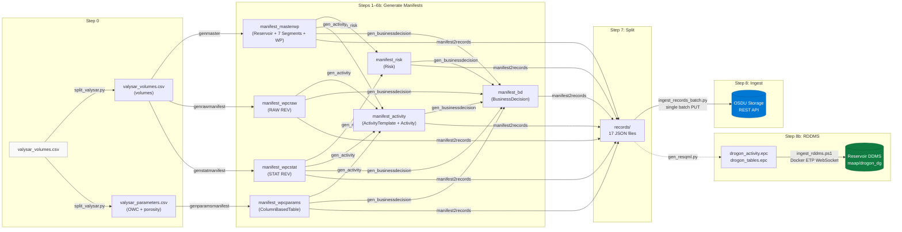

# Drogon - OSDU Data Model & Pipeline

## Overview

The Drogon use case demonstrates a complete **FMU-to-OSDU** pipeline for
static in-place reservoir volumes. Starting from a single FMU export CSV
(`valysar_volumes.csv`), the pipeline generates OSDU-compliant records
covering master data, work products, volume tables, input parameters,
activity provenance, risk assessment, and a decision gate - all linked
through typed references and ancestry.

The result is **17 records** in OSDU Storage that form a self-contained,
navigable data graph. The same workflow execution is also represented as
RESQML 2.0.1 EPC objects ingested into the **Reservoir DDMS** via ETP/WebSocket.

---

## Conceptual Data Model

```mermaid
graph TD
    subgraph "Master Data"
        RES["Reservoir<br/><i>Drogon</i>"]
        SEG1["ReservoirSegment<br/><i>West Lowland</i>"]
        SEG2["ReservoirSegment<br/><i>Central South</i>"]
        SEG3["ReservoirSegment<br/><i>Central North</i>"]
        SEG4["ReservoirSegment<br/><i>North Horst</i>"]
        SEG5["ReservoirSegment<br/><i>Central Ramp</i>"]
        SEG6["ReservoirSegment<br/><i>Central Horst</i>"]
        SEG7["ReservoirSegment<br/><i>East Lowland</i>"]
    end

    subgraph "Work Product Bundle"
        WP["WorkProduct<br/><i>Drogon Reservoir Study</i>"]
        RAW["REV - RAW<br/><i>per realisation</i>"]
        STAT["REV - Statistics<br/><i>P10 / P50 / P90</i>"]
        PARAMS["ColumnBasedTable<br/><i>Input Parameters</i>"]
    end

    subgraph "Activity Provenance"
        TMPL["ActivityTemplate<br/><i>Volumetrics Workflow Template</i>"]
        ACT["Activity<br/><i>DG1 Volumetrics Workflow Run</i>"]
    end

    subgraph "Decision Support"
        RISK["Risk<br/><i>Porosity &amp; Cementation</i>"]
        BD["BusinessDecision<br/><i>DG1 Identify &amp; Assess</i>"]
    end

    subgraph "Reference Data"
        REFTYPE["PropertyType<br/><i>AssociatedLiquid</i>"]
    end

    %% Ancestry: Reservoir → Segments
    RES -->|ancestry.child| SEG1
    RES -->|ancestry.child| SEG2
    RES -->|ancestry.child| SEG3
    RES -->|ancestry.child| SEG4
    RES -->|ancestry.child| SEG5
    RES -->|ancestry.child| SEG6
    RES -->|ancestry.child| SEG7

    %% WPC → WorkProduct
    RAW -->|ParentWorkProductID| WP
    STAT -->|ParentWorkProductID| WP
    PARAMS -->|ParentWorkProductID| WP

    %% WPC → Reservoir (ParentObjectID)
    RAW -->|ParentObjectID| RES
    STAT -->|ParentObjectID| RES
    PARAMS -->|ParentObjectID| RES

    %% Activity provenance chain
    ACT -->|ActivityTemplateID| TMPL
    ACT -->|Input: InputParameters| PARAMS
    ACT -->|Output: OutputParameters| PARAMS
    ACT -->|Output: OutputVolumes| RAW
    ACT -->|Output: ReportTable| STAT
    ACT -->|ancestry.parent| RES

    %% BusinessDecision → Activity, risk, reservoir
    BD -->|PriorActivityIDs| ACT
    BD -->|Parameter| RES
    BD -->|RiskID| RISK

    %% REV uses RefType
    RAW -.->|PropertyType| REFTYPE
    STAT -.->|PropertyType| REFTYPE

    %% Styling
    classDef master fill:#cfe2ff,stroke:#084298,color:#222
    classDef wpc fill:#d4edda,stroke:#155724,color:#222
    classDef wp fill:#fff3cd,stroke:#d39e00,color:#222
    classDef activity fill:#fde8d8,stroke:#c25d00,color:#222
    classDef risk fill:#f5c6cb,stroke:#721c24,color:#222
    classDef bd fill:#e2d9f3,stroke:#5a3e85,color:#222
    classDef ref fill:#e9ecef,stroke:#6c757d,color:#222

    class RES,SEG1,SEG2,SEG3,SEG4,SEG5,SEG6,SEG7 master
    class RAW,STAT,PARAMS wpc
    class WP wp
    class TMPL,ACT activity
    class RISK risk
    class BD bd
    class REFTYPE ref
```



### Record Inventory (17 records)

| # | Kind | Name | OSDU ID suffix |
|---|------|------|----------------|
| 0 | `reference-data--ReservoirEstimatedVolumePropertyType` | AssociatedLiquid | `AssociatedLiquid_` |
| 1 | `master-data--Reservoir` | Drogon | `5b8dc759…` |
| 2–8 | `master-data--ReservoirSegment` | West Lowland, Central South, Central North, North Horst, Central Ramp, Central Horst, East Lowland | 7 UUIDs |
| 9 | `work-product` | Drogon Reservoir Study | `37dcb76b…` |
| 10 | `work-product-component--ReservoirEstimatedVolumes` | RAW (per realisation) | `68f57fdc…` |
| 11 | `work-product-component--ReservoirEstimatedVolumes` | Statistics (P10/P50/P90) | `0ed7364d…` |
| 12 | `work-product-component--ColumnBasedTable` | Input Parameters | `d8e4e9ba…` |
| 13 | `work-product-component--ActivityTemplate` | Volumetrics Workflow Template | `aa2791c8…` |
| 14 | `work-product-component--Activity` | DG1 Volumetrics Workflow Run | `ead6e342…` |
| 15 | `master-data--Risk` | Porosity & Cementation | `Drogon-PorosityAndCementation` |
| 16 | `master-data--BusinessDecision` | DG1 Identify & Assess | `Drogon-DG1-Identify` |

### BusinessDecision enrichment (ext.equinor)

The Drogon BD manifest (`manifest_bd_drogon.json`) carries the following `ext.equinor` sections for rich UI rendering:

- **Authors / ReviewTeam** - names and roles
- **Alternatives** - 3 development concepts with rank, action (Pursue/Monitor/Reject)
- **DevelopmentConcept** - Subsea tieback, 4 production wells, 2 injectors, FPSO host
- **ReservoirProperties** - depth, temperature, pressure, porosity, permeability
- **KeyUncertainties** - reservoir connectivity, OWC depth, aquifer support (with impact ratings)
- **UncertaintySummary** - P10/P50/P90 STOIIP range, Monte Carlo method
- **Recommendations** - next-gate action items (generic, not DG-specific)
- **KeyEconomics** - placeholder (DG1 economics not yet finalised)

> **Note:** OSDU only persists 7 registered ext.equinor keys (see `demo/md/BusinessDecision.md` Appendix A). The remaining keys are restored at runtime by the local enrichment overlay in `app/main.py`.

---

## Relationship Patterns

### Ancestry (parent ↔ child)

Ancestry is stored in `data.ancestry` and expresses containment:

- **Reservoir** → 7 **ReservoirSegments** (`ancestry.children`)
- Each Segment → Reservoir (`ancestry.parents`)
- **Activity** → Reservoir (`ancestry.parents`); ColumnBasedTable + RAW REV + STAT REV (`ancestry.children`)

The OSDU indexer mirrors `data.ancestry.*` into the top-level `ancestry.*`
search index automatically.

### WorkProduct → WorkProductComponent

The three WPCs (RAW volumes, STAT volumes, parameters) share a common
**WorkProduct** container. Each WPC references:

- `ParentWorkProductID` → WorkProduct
- `ParentObjectID` → Reservoir (the master-data context)

### Activity Provenance

The `ActivityTemplate` declares all parameter slots for the workflow. The
`Activity` instance is the concrete execution record. It captures:

| Parameter | Role | Value |
|-----------|------|-------|
| `InputParameters` | Input (DataObject) | ColumnBasedTable WPC (`d8e4e9ba…`) |
| `Process` | Input (String) | `"RMS DecisionExample - Drogon Valysar"` |
| `NumberOfRealizations` | Input (Integer) | `3` |
| `Workflow` | Input (String) | `"DecisionExample"` |
| `Method` | Input (String) | `"User_Defined"` |
| `ReportTableName` | Input (String) | `"DecisionExample_report"` |
| `Variables` | Input (String) | JSON - 7 OWC contacts + 3 PHIT facies (Low/Base/High) |
| `DesignMatrix` | Input (String) | JSON - 3 realisations (Base / Low / High, all correlated) |
| `OutputParameters` | Output (DataObject) | ColumnBasedTable WPC (`d8e4e9ba…`) |
| `OutputVolumes` | Output (DataObject) | RAW REV WPC (`68f57fdc…`) |
| `ReportTable` | Output (DataObject) | STAT REV WPC (`0ed7364d…`) |

> The `Variables` and `DesignMatrix` values are taken verbatim from
> `resqml/obj_Activity_MISSING.xml` - the original RESQML activity descriptor
> provided by the RMS workflow.

**Design rationale - one Activity, not three:**
One `ActivityTemplate` + one `Activity` is the correct OSDU pattern for an
atomic workflow execution. The three *logical* steps (generate parameters →
run RMS → aggregate statistics) belong in the activity *description*, not
in three separate Activity records. Three records would only be appropriate
if each step were independently re-runnable and separately provenance-tracked.

### BusinessDecision → Activity → Evidence

The BD record is the decision-support hub:

- `PriorActivityIDs` → **Activity** record (which in turn points to all evidence via its output parameters and `ancestry.children`)
- `Parameters[].DataObjectParameter` → each WPC + the Reservoir
- `RiskIDs` → Risk record(s)

Previously `PriorActivityIDs` pointed directly to the three WPCs. It now
points to the Activity, which is the correct OSDU intent - the BD cites *the
activity that produced the evidence*, not the evidence artefacts directly.

### Volume Table Structure

Both REV records and the ColumnBasedTable use the OSDU **ColumnBasedTable**
pattern (`data.Volumes` or `data.Table`):

```
KeyColumns:    [{ ColumnName, ColumnRole:"key", ValueType }]
Columns:       [{ ColumnName, ColumnRole:"value", ValueType, UnitOfMeasure }]
ColumnValues:  { "<ColumnName>": [v0, v1, …], … }
```

| WPC | Key Columns | Value Columns | Rows |
|-----|-------------|---------------|------|
| RAW REV | Realisation, Zone, SegmentID, Facies | BulkVolume, NetVolume, PoreVolume, HydrocarbonPoreVolume, … | 588 |
| STAT REV | Statistic, Zone, SegmentID, Facies | BulkVolume, NetVolume, PoreVolume, HydrocarbonPoreVolume, … | 588 |
| Parameters | Realisation, Zone, SegmentID, Facies | OWC_Depth (7 cols, m), Porosity (3 cols, Euc) | 84 |

---

## Pipeline Workflow



### Pipeline Steps

| Step | Script | Input | Output |
|------|--------|-------|--------|
| 0 | `split_valysar.py` | `valysar_volumes.csv` (raw FMU export) | `valysar_volumes.csv` + `valysar_parameters.csv` |
| 1 | `genmaster_drogon.py` | volumes CSV | `manifest_masterwp_drogon.json` (1 Reservoir, 7 Segments, 1 WorkProduct) |
| 2 | `genrawmanifest_drogon.py` | volumes CSV + master manifest | `manifest_wpcraw_drogon.json` (raw REV WPC) |
| 3 | `genstatmanifest_drogon.py` | volumes CSV + master manifest | `manifest_wpcstat_drogon.json` (statistical REV WPC) |
| 4 | `genparamsmanifest_drogon.py` | parameters CSV + master manifest | `manifest_wpcparams_drogon.json` (ColumnBasedTable WPC) |
| 5 | `gen_risk_drogon.py` | master + stat manifests | `manifest_risk_drogon.json` (Risk) |
| 5b | `gen_activity_drogon.py` | master + raw + stat + params manifests | `manifest_activity_drogon.json` (ActivityTemplate + Activity) |
| 6 | `gen_businessdecision_drogon.py` | all prior manifests incl. activity | `manifest_bd_drogon.json` (BusinessDecision) |
| 7 | `manifest2records_drogon.py` | 7 manifests + 1 reftype | `records/` - 17 individual JSON files |
| 8 | `ingest_records_batch.py` | `records/*.json` + `.env` | Single batch PUT to OSDU Storage API (auto-fallback to sequential on failure) |
| 8b | `gen_resqml.py` + `ingest_rddms.ps1` | `records/*.json` | RESQML EPC → Reservoir DDMS via Docker ETP |

### Running the Pipeline

```powershell
# Full pipeline (default)
.\demo\drogon\run_pipeline.ps1

# Generate only, no ingestion
.\demo\drogon\run_pipeline.ps1 -SkipIngest

# Re-ingest single record (e.g. after editing BD)
py demo/drogon/ingest_records_batch.py --start 14 --delay 0

# RDDMS ingestion (requires Docker + open-etp-sslclient image)
pwsh demo/drogon/resqml/ingest_rddms.ps1
pwsh demo/drogon/resqml/ingest_rddms.ps1 -SkipCreate   # reuse existing dataspace
```

---

## RESQML / Reservoir DDMS

The workflow is also represented as RESQML 2.0.1 EPC objects ingested into the
**Reservoir DDMS** dataspace `maap/drogon_dg` via the ETP WebSocket API using
the `open-etp-sslclient` Docker image.

### EPC files

| File | Contents |
|------|----------|
| `resqml/drogon_tables.epc` | 3 × `obj_Grid2dRepresentation` (params, RAW volumes, STAT volumes) + `StringTableLookup` objects for column names/UoMs |
| `resqml/drogon_activity.epc` | 1 × `obj_ActivityTemplate` + 1 × `obj_Activity` (merged, matching OSDU record UUIDs) |

### RESQML Activity - merged single Activity

The EPC carries **one** `obj_ActivityTemplate` and **one** `obj_Activity`
(same design rationale as the OSDU record - one atomic workflow execution).

The Activity parameters mirror the OSDU record exactly, with data-object
references pointing to the `Grid2dRepresentation` UUIDs in `drogon_tables.epc`:

| Parameter | RESQML type | Value / UUID |
|-----------|-------------|--------------|
| `InputParameters` | `DataObjectParameter` | params `Grid2dRepresentation` (`38458cd4…`) |
| `Process` | `StringParameter` | `"RMS DecisionExample - Drogon Valysar"` |
| `NumberOfRealizations` | `IntegerQuantityParameter` | `3` |
| `Workflow` | `StringParameter` | `"DecisionExample"` |
| `ReportTableName` | `StringParameter` | `"DecisionExample_report"` |
| `Method` | `StringParameter` | `"User_Defined"` |
| `Variables` | `StringParameter` | JSON (10 OWC/PHIT variables, verbatim from `obj_Activity_MISSING.xml`) |
| `DesignMatrix` | `StringParameter` | JSON (3 realisations B/L/H) |
| `OutputParameters` | `DataObjectParameter` | params `Grid2dRepresentation` (`38458cd4…`) |
| `OutputVolumes` | `DataObjectParameter` | RAW volumes `Grid2dRepresentation` (`d0f6d781…`) |
| `ReportTable` | `DataObjectParameter` | STAT volumes `Grid2dRepresentation` (`fde25126…`) |

> `obj_Activity_MISSING.xml` in `resqml/` is the original RESQML Activity
> descriptor exported from RMS. Its `MISSING` UUIDs and template reference
> were filled in and incorporated into `gen_resqml.py` and `gen_activity_drogon.py`.

### UUID alignment

The `obj_ActivityTemplate` UUID in the EPC (`b727ee57…`) and the `obj_Activity`
UUID (`aea6e528…`) are generated deterministically by `gen_resqml.py`. The
corresponding OSDU WPC IDs (`aa2791c8…` template, `ead6e342…` activity) are
generated by `gen_activity_drogon.py` from the same namespace seeds - ensuring
cross-system traceability.

---

## OSDU Design Decisions

| Decision | Rationale |
|----------|-----------|
| **Ancestry in `data.ancestry`** | Top-level `ancestry` requires numeric timestamp versions (unavailable at generation time). The indexer mirrors `data.ancestry` → `ancestry.*` automatically. |
| **Single batch PUT for all 17 records** | The OSDU Storage API accepts up to 500 records in one PUT. A single call is far faster than sequential; the script auto-falls back to sequential-with-retry if the batch call fails. |
| **Two REV WPCs** (raw + stats) | Separates per-realisation detail from P10/P50/P90 summary. Both share the same WorkProduct container and Reservoir context. |
| **ColumnBasedTable for parameters** | OWC depths and porosity values are per-segment, per-facies, per-realisation - fits the ColumnBasedTable schema (key/value columns with UoM). |
| **One Activity, not three** | One `ActivityTemplate` + one `Activity` is the correct OSDU pattern for an atomic workflow execution. The three logical steps belong in the description, not in three records. |
| **BD.PriorActivityIDs → Activity** | The BD cites the *activity that produced the evidence*, not the artefacts directly. The Activity in turn links to all evidence via its output parameters and `ancestry.children`. |
| **`ReportTableName` vs `ReportTable`** | `ReportTable` as a title was used twice - once for the input string name and once for the output DataObject. Renamed the input slot to `ReportTableName` to avoid the collision. |
| **Human-readable IDs for singletons** | Risk (`Drogon-PorosityAndCementation`) and BD (`Drogon-DG1-Identify`) use descriptive IDs instead of UUIDs since there's one of each. |
| **Dual ingestion (REST + RDDMS)** | OSDU Storage REST API holds the searchable WPC metadata; Reservoir DDMS holds the RESQML EPC (geometry + tabular data + activity chain) for interoperability with subsurface tools. |

---

## Explorer UI

The Record Explorer (`/strat`) provides:

- **Type dropdown** - prepopulated with all Drogon record types
- **Mermaid relationship graph** - ancestry + data references, colored by type, using Names
- **Metadata cards** - grouped into Identity, Details, References, Extensions
- **Table viewer** - renders both `Volumes` and `Table` ColumnBasedTable data with key highlighting and UoM
- **Clickable links** - OSDU ID references navigate to the linked record
