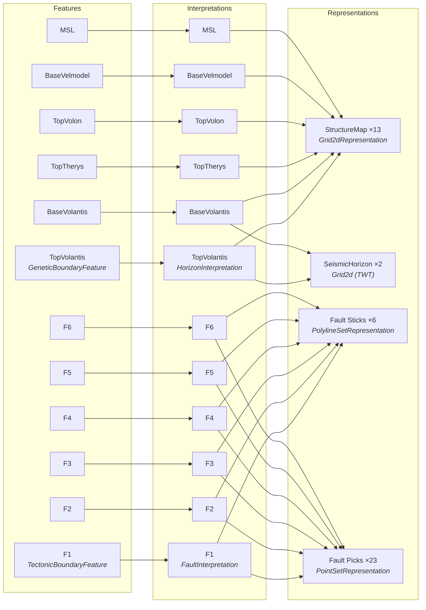
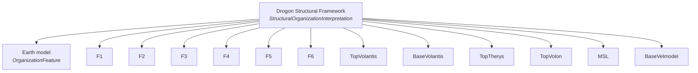
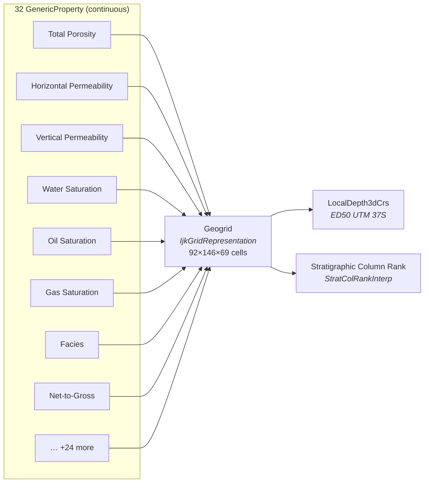
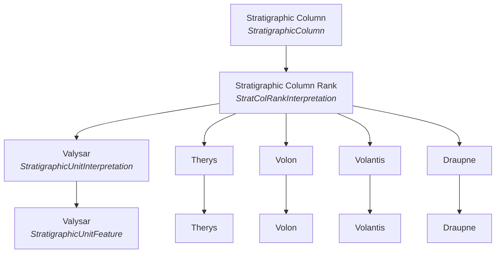
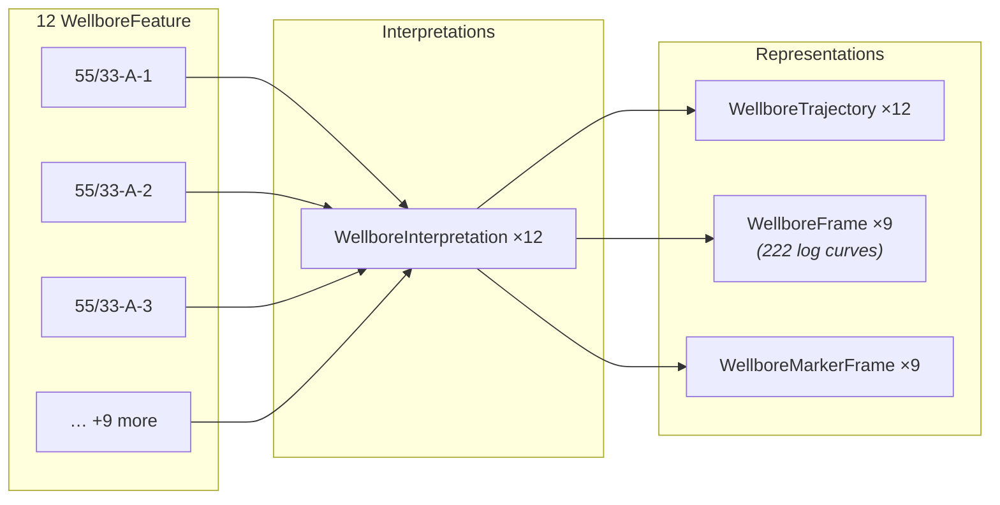
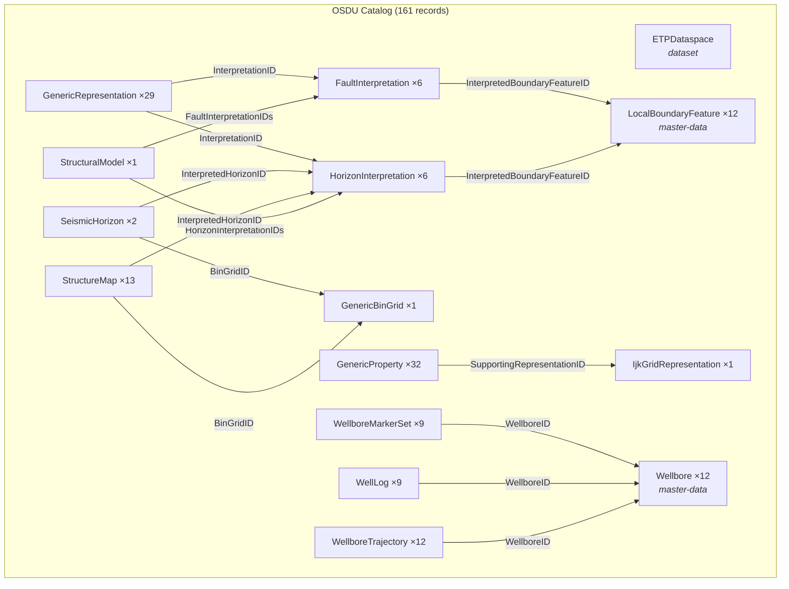

# Drogon OSDU Demo Dataset

Curated RESQML dataset for testing OSDU Reservoir-DDMS integration.  
Contains a complete structural interpretation, reservoir grid, wells, and stratigraphic framework.

**Dataspace:** `maap/drogon`  
**Files:** `drogon_demo.epc` + `drogon_demo.h5` (RDDMS), `manifest_full_opendes.json` (OSDU catalog)

---

## 1. Dataset Summary

| Component | RDDMS (EPC) | Catalog (Manifest) |
|---|---|---|
| Total objects/records | 420 | 161 |
| RESQML types | 28 | 18 WPC kinds + 2 MasterData + 1 Dataset |
| Grid | 1 IjkGrid (92×146×69 = 925,668 cells) | 1 IjkGridRepresentation |
| Grid properties | 189 Continuous + 65 Discrete = 254 | 32 GenericProperty |
| Surfaces | 15 Grid2d | 13 StructureMap + 2 SeismicHorizon |
| Wells | 12 | 12 Wellbore + 12 WellboreTrajectory |
| Well logs | 9 frames (222 curves) | 9 WellLog |
| Horizons | 6 features + 6 interpretations | 6 LocalBoundaryFeature + 6 HorizonInterpretation |
| Faults | 6 features + 6 interpretations | 6 LocalBoundaryFeature + 6 FaultInterpretation |
| Structural model | 1 StructuralOrganizationInterpretation | 1 StructuralModel |
| Stratigraphy | 1 Column + 1 Rank + 5 Units | 1 StratigraphicColumn + 1 Rank + 5 Units |

### Why 420 objects → 161 records?

RESQML objects don't map 1:1 to OSDU catalog records. Three rules govern the compression:

**1. Multiple types collapse into one kind:**

| RESQML types | OSDU kind | Rule |
|---|---|---|
| ContinuousProperty + DiscreteProperty | GenericProperty | Both are "property on a topology" |
| GeneticBoundaryFeature + TectonicBoundaryFeature | LocalBoundaryFeature | Both are boundary features (distinguished by `BoundaryType`) |
| WellboreFeature + WellboreInterpretation | Wellbore (master-data) | Feature+Interp merge into one catalog entity |
| DeviationSurveyRepresentation + WellboreTrajectoryRepresentation | WellboreTrajectory | Survey is the data backing a trajectory |

**2. Some types become metadata, not records:**

| RESQML type | Count | Becomes |
|---|---|---|
| LocalCrs | 2 | `LocalModelCompoundCrsID` field on representations |
| MdDatum | 12 | Referenced within WellboreTrajectory records |
| PropertyKind | 21 | `PropertyKindID` reference-data link |
| TimeSeries | 1 | Referenced by time-indexed properties |
| EpcExternalPartReference | 1 | The HDF5 backing store (implicit in Dataset) |

**3. Well-log curves group into parent WellLog:**

The 254 grid/well properties break down as:

| Attached to | Count | Catalog mapping |
|---|---|---|
| IjkGridRepresentation | 27 Continuous + 5 Discrete = 32 | → 32 GenericProperty (1:1) |
| WellboreFrameRepresentation | 162 Continuous + 60 Discrete = 222 | → 9 WellLog (curves are nested metadata) |

Each WellLog record contains its curves as a list (name, UoM, property kind, min/max) rather than 222 individual catalog entries.

---

## 2. FIRP Data Model

The OSDU subsurface model uses **Feature → Interpretation → Representation → Property** (FIRP).

### 2.1 Structural Framework



### 2.2 Structural Organization



### 2.3 Reservoir Grid & Properties



### 2.4 Stratigraphic Column



### 2.5 Wells



---

## 3. RDDMS Object Inventory (EPC)

420 objects across 28 RESQML 2.0 types:

| Type | Count | Description |
|---|---|---|
| ContinuousProperty | 189 | Grid cell + well log float arrays |
| DiscreteProperty | 65 | Facies, zone, region indices |
| PointSetRepresentation | 23 | Horizon/fault picks (depth + time) |
| Grid2dRepresentation | 15 | Depth + time surfaces |
| WellboreFeature | 12 | Well identities |
| WellboreInterpretation | 12 | Well geologic interpretations |
| WellboreTrajectoryRepresentation | 12 | XYZ well paths |
| DeviationSurveyRepresentation | 12 | MD/inclination/azimuth surveys |
| MdDatum | 12 | Measured-depth datum per well |
| WellboreFrameRepresentation | 9 | Log sampling frames |
| WellboreMarkerFrameRepresentation | 9 | Stratigraphic pick frames |
| GeneticBoundaryFeature | 6 | Horizon features |
| TectonicBoundaryFeature | 6 | Fault features |
| HorizonInterpretation | 6 | Horizon geologic meanings |
| FaultInterpretation | 6 | Fault geologic meanings |
| PolylineSetRepresentation | 6 | Fault sticks (TWT) |
| StratigraphicUnitFeature | 5 | Formation features |
| StratigraphicUnitInterpretation | 5 | Formation meanings |
| IjkGridRepresentation | 1 | Geogrid (92×146×69) |
| StructuralOrganizationInterpretation | 1 | Structural framework |
| StratigraphicColumn | 1 | Vertical succession |
| StratigraphicColumnRankInterpretation | 1 | 5-unit rank |
| OrganizationFeature | 1 | Earth model feature |
| LocalDepth3dCrs | 1 | ED50 UTM 37S, depth |
| LocalTime3dCrs | 1 | ED50 UTM 37S, TWT |
| Activity | 1 | Provenance record |
| ActivityTemplate | 1 | Provenance template |
| EpcExternalPartReference | 1 | HDF5 link |

---

## 4. OSDU Catalog Manifest

161 records for ingestion via OSDU Workflow API (`manifest_full_opendes.json`):

### 4.1 Datasets (1)

| Kind | Name |
|---|---|
| `dataset--ETPDataspace:1.0.1` | maap/drogon |

### 4.2 Master Data (24)

| Kind | Count | Records |
|---|---|---|
| `master-data--LocalBoundaryFeature:1.1.0` | 12 | 6 horizons + 6 faults |
| `master-data--Wellbore:1.3.0` | 12 | 55/33-1, -2, -3, A-1…A-6, OP5_Y1, OP5_Y2, OP6 |

### 4.3 Work Product Components (136)

| Kind | Count | Description |
|---|---|---|
| `GenericProperty:1.2.0` | 32 | Grid cell properties (porosity, perm, sat) |
| `GenericRepresentation:1.2.0` | 29 | Fault sticks + horizon/fault picks |
| `StructureMap:1.0.0` | 13 | Depth surfaces (Grid2d on LocalDepth3dCrs) |
| `WellboreTrajectory:1.3.0` | 12 | Well paths |
| `WellLog:1.2.0` | 9 | Log frames (222 curves) |
| `WellboreMarkerSet:1.2.0` | 9 | Stratigraphic markers per well |
| `HorizonInterpretation:1.2.0` | 6 | Horizon meanings (DomainType: Mixed) |
| `FaultInterpretation:1.3.0` | 6 | Fault meanings |
| `LocalRockVolumeFeature:1.2.0` | 5 | Stratigraphic unit features |
| `StratigraphicUnitInterpretation:1.3.0` | 5 | Formation interpretations |
| `SeismicHorizon:2.1.0` | 2 | TWT surfaces |
| `LocalModelCompoundCrs:1.2.0` | 2 | Depth CRS + Time CRS |
| `GenericBinGrid:1.0.0` | 1 | Shared 280×440 lattice (25m spacing) |
| `StructuralModel:1.0.0` | 1 | Structural framework (6F + 6H) |
| `IjkGridRepresentation:1.1.0` | 1 | Geogrid |
| `StratigraphicColumn:1.2.0` | 1 | Vertical succession |
| `StratigraphicColumnRankInterpretation:1.3.0` | 1 | 5-unit rank |
| `LocalModelFeature:1.2.0` | 1 | Earth model feature |

### 4.4 Catalog Cross-References



| From Kind | Field | To Kind | Count |
|---|---|---|---|
| HorizonInterpretation | `InterpretedBoundaryFeatureID` | LocalBoundaryFeature | 6 |
| FaultInterpretation | `InterpretedBoundaryFeatureID` | LocalBoundaryFeature | 6 |
| StructuralModel | `FaultInterpretationIDs[]` | FaultInterpretation | 6 |
| StructuralModel | `HorizonInterpretationIDs[]` | HorizonInterpretation | 6 |
| StructureMap | `InterpretedHorizonID` | HorizonInterpretation | 13 |
| StructureMap / SeismicHorizon | `BinGridID` | GenericBinGrid | 15 |
| SeismicHorizon | `InterpretedHorizonID` | HorizonInterpretation | 2 |
| GenericRepresentation | `InterpretationID` | Fault/HorizonInterpretation | 29 |
| GenericProperty | `SupportingRepresentationID` | IjkGridRepresentation | 32 |
| WellboreTrajectory | `WellboreID` | Wellbore | 12 |
| WellLog | `WellboreID` | Wellbore | 9 |
| WellboreMarkerSet | `WellboreID` | Wellbore | 9 |
| All WPCs | `DatasetIDs[]` | ETPDataspace | 136 |

---

## 5. Horizons & Faults

### 5.1 Horizons (6)

| Feature | Interpretation | StructureMap (depth) | SeismicHorizon (time) | Picks |
|---|---|---|---|---|
| TopVolantis | TopVolantis | ✓ Interpreted | ✓ Interpreted | ✓ Depth + Time |
| BaseVolantis | BaseVolantis | ✓ Interpreted + VelModel | ✓ Interpreted | ✓ Depth + Time |
| TopTherys | TopTherys | ✓ Interpreted + VelModel | — | ✓ Depth + Time |
| TopVolon | TopVolon | ✓ Interpreted | — | ✓ Depth + Time |
| BaseVelmodel | BaseVelmodel | ✓ Interpreted | — | ✓ Depth + Time |
| MSL | MSL | ✓ Interpreted | — | ✓ Depth |

### 5.2 Faults (6)

| Feature | Interpretation | Fault Sticks (PolylineSet) | Fault Picks (PointSet) |
|---|---|---|---|
| F1 | F1 | ✓ TWT sticks | ✓ Depth + Time picks |
| F2 | F2 | ✓ TWT sticks | ✓ Depth + Time picks |
| F3 | F3 | ✓ TWT sticks | ✓ Depth + Time picks |
| F4 | F4 | ✓ TWT sticks | ✓ Depth + Time picks |
| F5 | F5 | ✓ TWT sticks | ✓ Depth + Time picks |
| F6 | F6 | ✓ TWT sticks | ✓ Depth + Time picks |

---

## 6. Grid Properties (32 in catalog, 254 in RDDMS)

The OSDU catalog exposes 32 canonical properties (1 per physical quantity).
The RDDMS stores 254 individual property arrays (multiple realizations, variants).

| Property | UoM | Category |
|---|---|---|
| Total Porosity | v/v | Geo-model |
| Horizontal Permeability | mD | Geo-model |
| Vertical Permeability | mD | Geo-model |
| Phyllosilicate Volume Fraction | v/v | Geo-model |
| Shale Volume | v/v | Geo-model |
| Net Sand Fraction | v/v | Geo-model |
| Facies (discrete) | - | Geo-model |
| Oil/Water/Gas Saturation | v/v | Simulation |
| Pore/Bulk Volume | m³ | Simulation |
| Temperature | °C | Simulation |
| Net-to-Gross Ratio | v/v | Petro-elastic |
| Fault Block Index | - | Structure |
| Free Water Level / GOC Depth | m | Contacts |
| Region / Saturation Number | - | Simulation |

---

## 7. Wells (12)

| Well | Trajectories | Log Curves | Markers |
|---|---|---|---|
| 55/33-1, -2, -3 | ✓ | — | — |
| 55/33-A-1 to A-6 | ✓ | ✓ (~24 curves each) | ✓ |
| OP5_Y1, OP5_Y2, OP6 | ✓ | — | — |

Well log curves include: Total Porosity, Horizontal Permeability, Acoustic/Shear Impedance, Vp/Vs, Bulk Density, Seismic Amplitude, Facies, Shale Volume, Water Saturation, Zone Index.

---

## 8. CRS

| Record | Projected CRS | Vertical | Z Direction | Domain |
|---|---|---|---|---|
| LocalDepth3dCrs | ED50 / UTM zone 37S | MSL (m) | Z increasing down | depth |
| LocalTime3dCrs | ED50 / UTM zone 37S | TWT (ms) | Z increasing down | time |

---

## 9. How to Ingest

### RDDMS (ETP import)

```bash
# Import EPC+H5 into any ETP-compatible RDDMS
docker run --rm --network=host \
  -v $PWD:/data \
  --entrypoint=/bin/openETPServer \
  osdu-etp-sslclient:latest \
  space --import-epc /data/drogon_demo.epc \
  -S ws://<etp-host>:9002 \
  --auth <token|none> \
  --space-path maap/drogon -j
```

### OSDU Catalog (Workflow API)

```bash
# Push manifest via OSDU ingestion workflow
curl -X POST "https://<host>/api/workflow/v1/workflow/Osdu_ingest/workflowRun" \
  -H "Authorization: Bearer $TOKEN" \
  -H "data-partition-id: opendes" \
  -H "Content-Type: application/json" \
  -d @manifest_full_opendes.json
```

---

## 10. Verified Query Coverage

All 42 GraphQL presets in ORES have been verified against this dataset:

| Category | Presets | Status |
|---|---|---|
| Explore (status, types, browse) | 5 | ✓ All return data |
| Relationships (graph traversal) | 3 | ✓ Grid→34 rels, Well→chain |
| Deep Search (property filters) | 9 | ✓ Porosity/perm/sw filters match |
| Federated (catalog + RDDMS) | 8 | ✓ UUID merge working |
| Cross-reference (FIRP joins) | 6 | ✓ Horizon→surfaces, grid→props |
| Structural (org model, faults) | 8 | ✓ All FIRP paths return objects |
| Array statistics | 3 | ✓ Min/max/mean computed |
