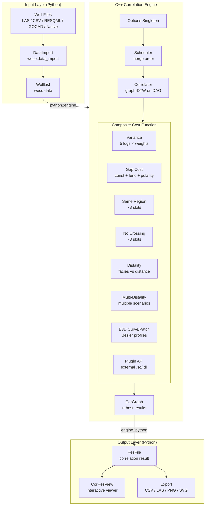
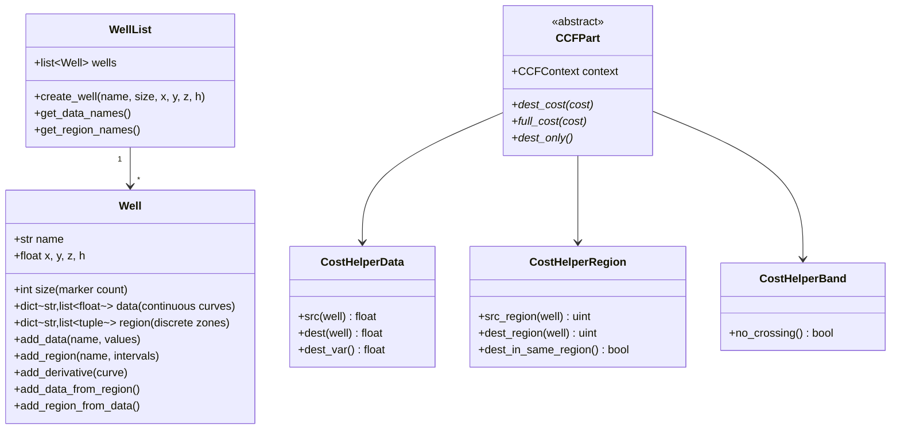
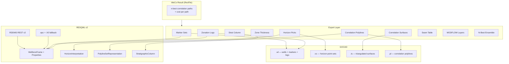
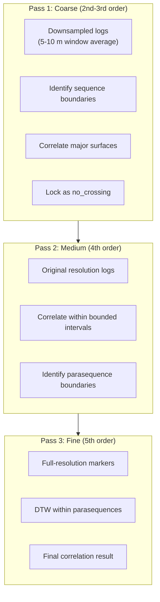

# WeCo Architecture

## System Overview

## Data Model

## Complexity

| Scenario | Wells | Markers | k | Time |
|----------|------:|--------:|--:|-----:|
| Small pair | 2 | 26 | 50 | 3 ms |
| Medium set | 3 | 100 | 50 | 76 ms |
| Large k | 3 | 100 | 200 | 389 ms |

**Per-merge:** $O(N_1 \cdot N_2 \cdot T_1 \cdot T_2 \cdot k)$
**Total:** $O(m \cdot n^2 \cdot k^3)$ for $m$ wells, $n$ markers, $k$ = max_cor

## Performance Options

| Option | Description | Expected Speedup |
|--------|-------------|:----------------:|
| `band-width` | Sakoe-Chiba band constraint on graph-DTW | 3-10× |
| `beam-width` | Beam search — top-B nodes per column | 5-20× |
| `cost-floor` | Minimum cost per transition (noise suppression) | — |

Implementation: `include/weco.h` (`Correlator::run`, `run_wavefront`, `run_dest_only`, `run_dest_opt`), `src/correlator.cpp` (`finish_path` beam pruning), `src/corgraph.cpp` (`CorGraph::compact()`).

## Format Support

| Format | Read | Write | Notes |
|--------|:----:|:-----:|-------|
| WeCo native | ✓ | ✓ | |
| LAS 2.0 / 3.0 | ✓ | ✓ | |
| RESQML v2 — RDDMS REST | ✓ | ✓ | via `weco/rddms.py` |
| RESQML v2 — EPC file | ✓ | ✓ | offline fallback |
| CSV | ✓ | ✓ | |
| GOCAD .wl / .vs / .ts / .pl | ✓ | ✓ | via `resqml.gocad_io` |
| DLIS / WITSML | ✓ | — | |
| RMS ASCII | — | ✓ | picks, points, code tables |

## Output Artifacts

| Artifact | GOCAD | RESQML | RMS | CSV/LAS/JSON |
|----------|:-----:|:------:|:---:|:------------:|
| Marker sets | `.wl` MRKR | WellboreMarkerFrame | well_picks.txt | CSV, JSON |
| Zonation logs | `.wl` LOG | DiscreteProperty | discrete LAS | LAS 2.0 |
| Horizon picks | `.vs` | HorizonInterpretation | IRAP points | CSV, JSON |
| Zone thickness | — | — | zone_picks.txt | CSV |
| Correlation polylines | `.pl` | PolylineSetRepresentation | — | — |
| Correlation surfaces | `.ts` | Grid2dRepresentation | IRAP surface | — |
| Stratigraphic column | `.wl` header | StratigraphicColumn | code table | JSON |
| Seam table (coal) | `.wl` MRKR | — | — | CSV |
| MODFLOW layers | — | — | — | CSV (FloPy) |
| N-best ensemble | N × `.wl` | N × Property sets | N × pick files | N × CSV |

## Output Flow

## Hierarchical Correlation

Multi-scale cascade inspired by sequence stratigraphy — correlate large-scale
boundaries first, then refine within those bounds.

| Order | Surface Type | Typical Spacing | WeCo Mapping |
|-------|-------------|-----------------|-------------|
| **2nd order** | Sequence boundaries (SB) | 10–100 m | `no_crossing` hard boundaries |
| **3rd order** | MFS, transgressive surfaces | 5–30 m | `no_crossing` or `same_region` |
| **4th order** | Parasequence boundaries | 1–10 m | Soft guide via `same_region` |
| **5th order** | Bedsets, lamina packages | 0.1–1 m | Marker-level DTW (current) |

Implementation: `weco/multiscale.py` (orchestrator), `weco/sequence_strat.py` (MFS/SB detection + systems tract assignment).

## Noise Suppression Strategies

| Strategy | Mechanism | Implementation |
|----------|-----------|----------------|
| Pre-smoothing | Low-pass filter on logs | `preprocessing.py`: `smooth_log()` |
| Multi-resolution cascade | Coarse → lock → refine | `weco/multiscale.py` |
| Minimum bed thickness | Reject thin intervals | `min_bed_thickness` option |
| Cost floor | Suppress noise preference | `cost-floor` engine option |
| Variance window | Sliding-window variance | `var_window_size` option |

## Round-Trip Validation

```mermaid
flowchart LR
    subgraph Build["1. Build Truth Model"]
        T1["Define depositional model"]
        T2["Place N wells"]
        T3["Sample → synthetic logs"]
        T4["Record ground-truth ties"]
    end

    subgraph Run["2. Run WeCo"]
        R1["Load synthetic wells"]
        R2["Configure options"]
        R3["Run engine (n-best)"]
    end

    subgraph Eval["3. Evaluate"]
        E1["Compare vs ground truth"]
        E2["Rank truth in n-best"]
        E3["Compute metrics"]
    end

    Build --> Run --> Eval
```

| Metric | Definition | Target |
|--------|-----------|--------|
| Truth rank | Position in n-best | ≤ 5 |
| Top-1 match | Best path = truth? | >80% for simple models |
| Marker MAE | Mean marker offset | < 2 markers |
| Recall@k | True lines in top-k | >90% for k=10 |

Synthetic generators: parallel layers, clinoform wedge, prograding delta, quaternary glacial, coal cyclothems, shallow marine, fluvial channels, carbonate platform.

## Domain Use Cases

| Domain | Wells | Markers | Key Strategy | Output |
|--------|------:|--------:|-------------|--------|
| Quaternary hydrogeology | 20–100 | 20–60 | Aquifer tops `no_crossing`, GR+RT variance | MODFLOW layers |
| Coal seam correlation | 20–50 | 40–150 | Marine bands `no_crossing`, GR+DEN variance | Seam table |
| Oil reservoir (shallow marine) | 5–15 | 50–200 | Biozones `no_crossing`, distality+B3D costs | RESQML zonation |

## Reference Documents

| Category | Documents | Key Insights |
|----------|-----------|-------------|
| Core Theory | Baville PhD Thesis (234p) | Distality cost, B3D, facies clustering, well order sensitivity |
| Planning | Phase II proposal, PoC proposal | Thickness constraint, dip regions, ground-truthing |
| RING Papers | Lallier, Edwards, Caumon, Julio | DTW foundations, hierarchical correlation, uncertainty |
| Sedimentology | Ainsworth, Aschoff, Boyd, Catuneanu, Kieft | Facies models, depositional environments |
| Field Data | Gudrun/Sigrun reports | Hugin Fm, shallow marine deltaic |
