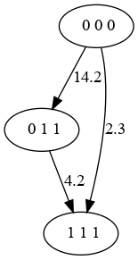

Files Descriptions
==================

Well list File
---------------
Contains wells info and data. It's a text file with space,tab,cr as separators.

The strings can't contain space. FF

The associated C++ class or method is enclosed in square brackets.

Fill Content [ C++ : WellList ]:
    * WeCo header (string) : WeCo
    * WellList header (string) : WellList
    * Version (int) : 2
    * NbrWell (int) [ nbr_wells() ] : number of wells
    * NbrWell * **WellInfo**
    * EndToken (string) : END

WellInfo [ Well ]:
    * WellName (string) [ well_name() ] : well name
    * WellSize (int) [ well_size() ] : well size (number of nodes for DTW)
    * X (float) [ x() ] : x position
    * Y (float) [ y() ] : y position
    * Z (float) : z position
    * H (float) : well height
    * NbrData (int) [ DataStore::store_size() ] : Number of Data arrays
    * NbrData * **DataArray**
    * NbrRegion (int) [ nbr_region_list() ] : Number of Region List
    * NbrRegion * **RegionList**

DataArray [ DataStore::Data ] :
    * DataName (string) [ name() ] : data name
    * DataSize (int) [ size() ] : data size
    * DataSize * data (DataSize float) : data array

    .. note::

        There is no restrictions about the data size.

RegionList [ RegionList ] :
    * RegionListName (string) [ name() ] : name
    * RLSize (int) : number of regions
    * RLSize *
        * RegionId (int >=0) : region id
        * RegionStart (0 <= int ) : Region Start
        * RegionLength ( int >=0 ) : Region Length

    .. note::

        There is no restrictions about regions in a RegionList:
            * 2 regions can have the same id
            * 2 regions can intersect

Example::

    WeCo WellList 2  # well list header version 2
    2                # NbrWell : 2 wells
    well1            # WellName  : well 1 name
    5                # WellSize : 5
    .1 0. 3. 12.     # X,Y,Z,H
    2                # NbrData = 2
    data1 3          # DataName DataSize for first data
    5.1              # data aray
    12.4
    4.1
    data2 1          # DataName DataSize for second data
    5.1
    1                # NbrRegionList
    reg1 3           # RegionListName RLSize
    1 2 3            # RegionId = 1, RegionStart = 2, RegionLength = 3
    4 2 1            # RegionId = 4, RegionStart = 2, RegionLength = 1
    1 3 2            # RegionId = 1, RegionStart = 3, RegionLength = 2
    well2            # WellName  : well 2 name
    3                # WellSize : 3
    .1 0. 3. 12.     # X,Y,Z,H
    0                # NbrData = 0 (No data)
    O                # NbrRegionList (None)
    END              # End Token

Result File
-----------
The result file contains an oriented graph.

The nodes contains the state (position in well) for each well.

The edges have a cost value.

The first line give the well ids (well index in well list file) list.
Then there will be each nodes with there edges.

Example::

    WellIds: 4 0 1
    Node  0 (0 0 0)
    Node  1 (0 1 1)
       -> 0 (14.2)
    Node 2 (1 1 1)
        -> 0 (2.3)
        -> 1 (4.2)

A dot file from `graphviz <https://graphviz.org/>`_ will be::

    digraph test {
    n0 [ label = " 0 0 0" ];
    n1 [ label = " 0 1 1" ];
    n0 -> n1 [ label = "14.2" ]
    n2 [ label = " 1 1 1" ];
    n0 -> n2 [ label = "2.3" ]
    n1 -> n2 [ label = "4.2" ]
    }

There is 3 nodes.

The Node 1 is for well[4] at position 0, well[0] at position 1 and well[1]
at position 1.

There is 3 edges:
    * 0 -> 1 with cost = 14.2
    * 0 -> 2 with cost = 2.3
    * 1 -> 2 with cost = 4.2

There is 2 possible results (path from Node 0 to final node):
    * 0 -> 2 Cost = 2.3
    * 0 -> 1 -> 2 Cost = 14.2 + 4.2

Cost Matrix
-----------

Output file for the cost-matrix option

First line: well ids for left and right part of DTW.
Other lines source state, destination state,cost for every possible transitions.
Cost = -1 , if the transition is forbidden.

.. note::
    It's not a full cost matrix, only the part computed by the WeCo algorithm.

example (DTW association of wells [4 and 0] with well 1)::

    4-0 1
    0-0-0 0-1-1 16.4
    0-0-0 1-0-0 -1
    0-0-0 1-1-1 2.3
    0-1-1 1-1-1 4.2

