multiscale module
=================

.. automodule:: weco.multiscale

Description
-----------

Project:

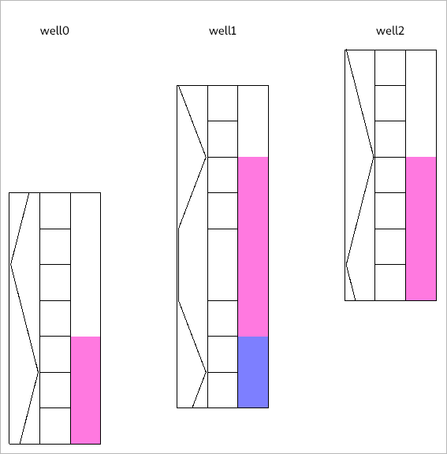

First Pass:

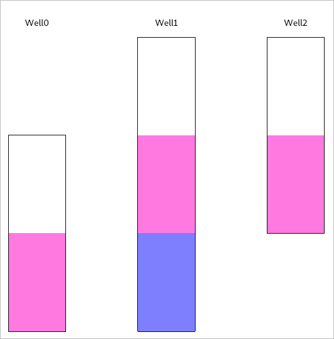

2 results (scenario):

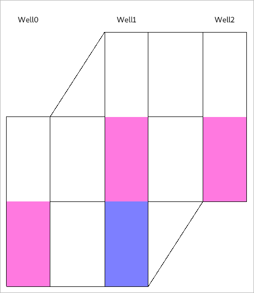

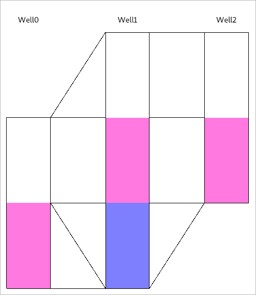

scenario 1 part 1

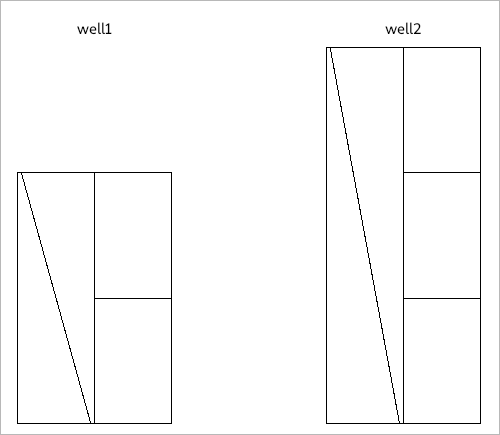

3 results :

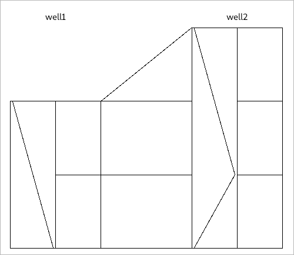

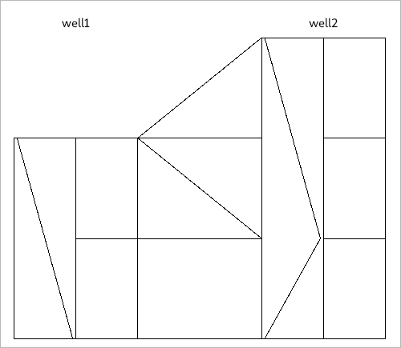

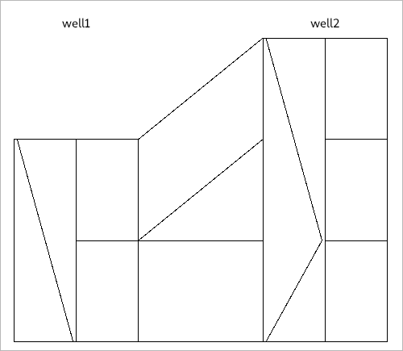

scenario 1 part 2

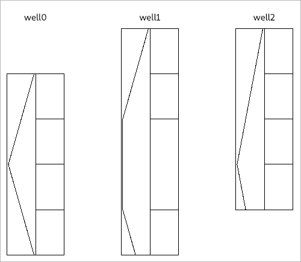

scenario 1 part 3

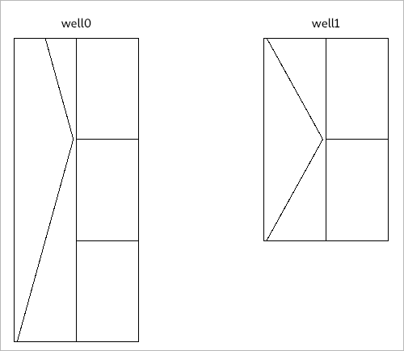

scenario 2

part 1 and 2 like scenario 1

scenario 2 part 3

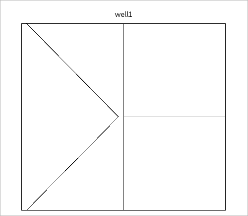

scenario 2 part 4

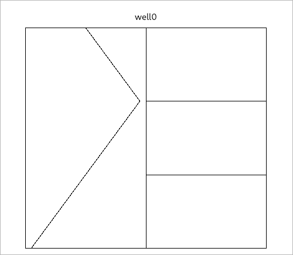

Result

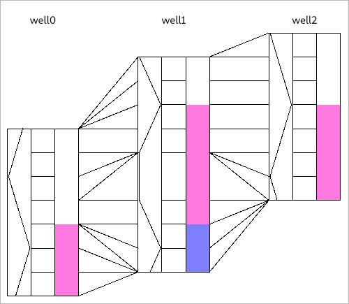

