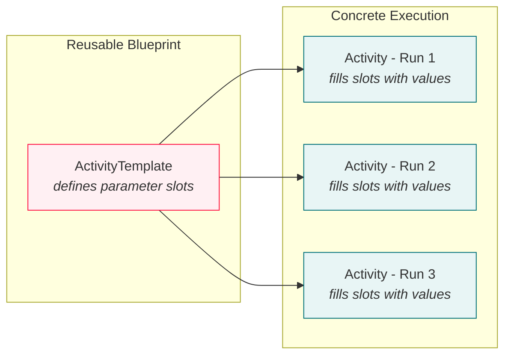
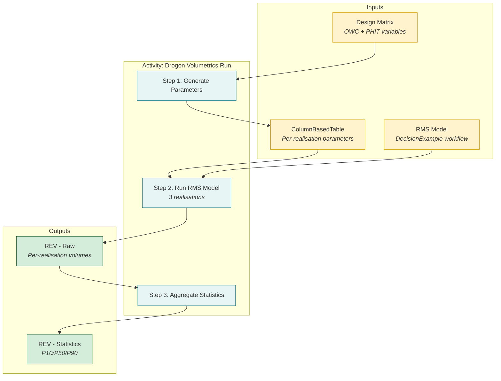
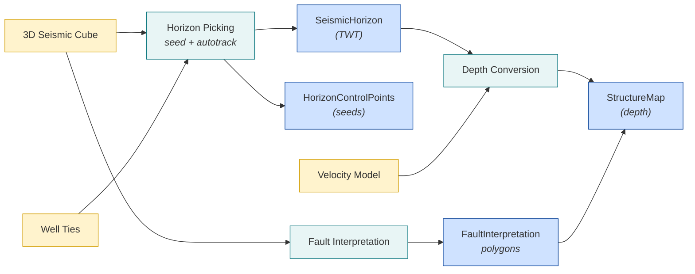
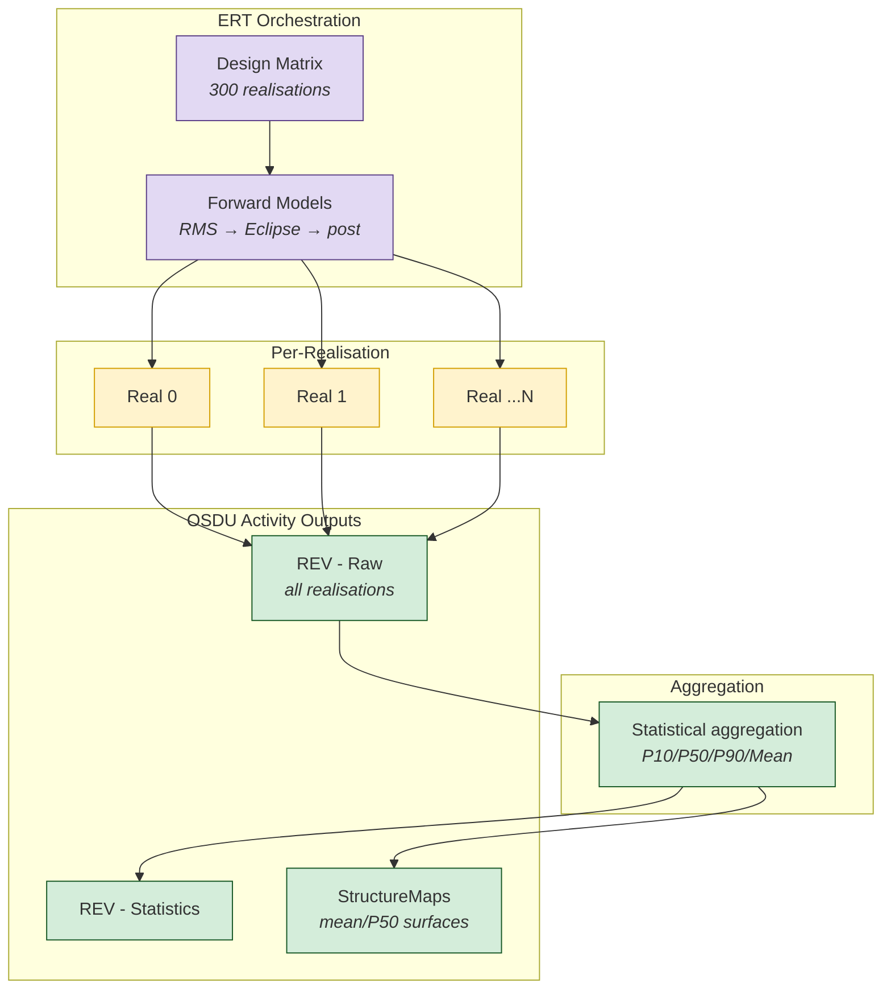
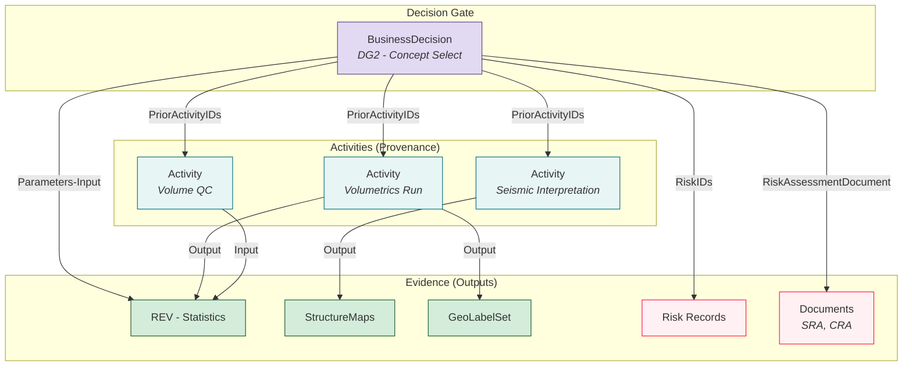
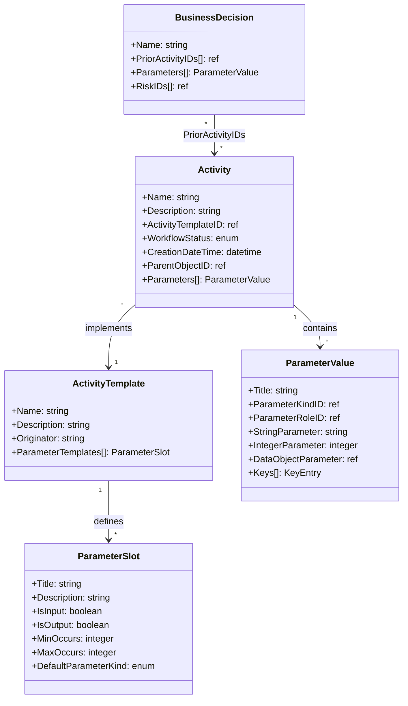

# Activity & ActivityTemplate - Data Model & Implementation Guide

> **Scope:** Detailed guide for OSDU `Activity` and `ActivityTemplate` records - how to capture workflow provenance, link inputs/outputs, and connect activities to `BusinessDecision` gates. Covers reservoir simulation, seismic interpretation, QC, and FMU workflows.
>
> **Related guides**: [BusinessDecision](BusinessDecision.md) · [BD Demo](BdDemo.md) · [Uncertainty](Uncertainty.md) · [FMU-OSDU](FmuOsdu.md) · [SeisInt](SeisInt.md) · [Volumes](Volumes.md) · [Risk](Risk.md)
>
> **Web UI**: The ORES [Create Record → Activity](/add-dg) tab lets you create both ActivityTemplates and Activity records interactively - including preset scaffolds for common workflow types.

---

## Table of Contents

1. [Purpose & Concept](#1-purpose--concept)
2. [OSDU Schema Overview](#2-osdu-schema-overview)
3. [Template vs Activity](#3-template-vs-activity)
4. [Parameter Model](#4-parameter-model)
5. [Worked Example: Reservoir Simulation (Drogon)](#5-worked-example-reservoir-simulation-drogon)
6. [Worked Example: Seismic Interpretation](#6-worked-example-seismic-interpretation)
7. [Worked Example: QC / Validation](#7-worked-example-qc--validation)
8. [Worked Example: FMU / ERT Ensemble Workflow](#8-worked-example-fmu--ert-ensemble-workflow)
9. [Linking Activities to BusinessDecision](#9-linking-activities-to-businessdecision)
10. [Entity Relationship Diagrams](#10-entity-relationship-diagrams)
11. [Creating Activities via the ORES Web UI](#11-creating-activities-via-the-ores-web-ui)
12. [Creating Activities via Pipeline Scripts](#12-creating-activities-via-pipeline-scripts)
13. [Best Practices](#13-best-practices)
14. [References](#14-references)

---

## 1. Purpose & Concept

**Activities** are the OSDU mechanism for recording **provenance** - capturing *who ran what workflow, with which inputs, and what was produced*. They answer the question: "How did this data come to exist?"

Two complementary record types work together:

| Record | Kind | Role |
|--------|------|------|
| **ActivityTemplate** | `osdu:wks:work-product-component--ActivityTemplate:1.0.0` | Reusable **blueprint** - defines the parameter slots (inputs/outputs) that any execution of this workflow type should provide |
| **Activity** | `osdu:wks:work-product-component--Activity:1.0.0` | Concrete **execution record** - fills the template slots with actual values from a specific run |

Think of it like a function signature (template) vs a function call (activity):
- Template: `run_simulation(process: str, num_realisations: int, input_params: DataObject) → volumes: DataObject`
- Activity: `run_simulation("RMS DecisionExample", 3, dev:...ColumnBasedTable:...) → dev:...REV:...`

---

## 2. OSDU Schema Overview

### ActivityTemplate Schema

```json
{
  "kind": "osdu:wks:work-product-component--ActivityTemplate:1.0.0",
  "data": {
    "Name": "Reservoir Simulation Workflow",
    "Description": "Template for multi-realisation reservoir simulation",
    "Originator": "user@company.com",
    "ParameterTemplates": [
      {
        "Title": "InputParameters",
        "Description": "Input parameter table",
        "IsInput": true,
        "IsOutput": false,
        "MinOccurs": 1,
        "MaxOccurs": 1,
        "DefaultParameterKind": "DataObject"
      }
    ]
  }
}
```

### Activity Schema

```json
{
  "kind": "osdu:wks:work-product-component--Activity:1.0.0",
  "data": {
    "Name": "Drogon Simulation Run - 2025-Q1",
    "Description": "Executed 3 realisations...",
    "ActivityTemplateID": "dev:work-product-component--ActivityTemplate:...:1",
    "WorkflowStatus": "Completed",
    "CreationDateTime": "2025-03-15T14:30:00Z",
    "ParentObjectID": "dev:master-data--Reservoir:...:1",
    "Parameters": [ ... ]
  }
}
```

### Key Fields

| Field | On | Description |
|-------|----|-------------|
| `Name` | Both | Human-readable workflow / run name |
| `Description` | Both | Detailed description of what the workflow does / what was executed |
| `Originator` | Both | Email or name of the author |
| `ParameterTemplates[]` | Template | Array of parameter slot definitions |
| `ActivityTemplateID` | Activity | Reference to the template this activity implements |
| `WorkflowStatus` | Activity | `Completed`, `InProgress`, `Planned`, `Failed` |
| `CreationDateTime` | Activity | ISO 8601 timestamp of execution |
| `ParentObjectID` | Activity | Parent master-data record (e.g. Reservoir) |
| `ParentWorkProductID` | Activity | Parent WorkProduct record |
| `Parameters[]` | Activity | Array of filled parameter values |

---

## 3. Template vs Activity



**One template, many activities.** A single "Reservoir Simulation" template can be referenced by every simulation run across multiple fields, gates, and time periods. The template ensures consistency in how workflows are documented.

### When to create a new template

| Scenario | Action |
|----------|--------|
| Same workflow type, different run | Reuse existing template, create new Activity |
| Same workflow type, different field | Reuse template (field context comes from `ParentObjectID`) |
| Fundamentally different workflow | Create new template |
| Added an extra output to the workflow | Create a new template version (or update slots) |

---

## 4. Parameter Model

### Template Parameter Slots (`ParameterTemplates[]`)

Each slot defines what the activity should provide:

| Field | Type | Description |
|-------|------|-------------|
| `Title` | string | Slot name - Activities must match this exactly |
| `Description` | string | What this parameter represents |
| `IsInput` | boolean | Is this an input to the workflow? |
| `IsOutput` | boolean | Is this an output from the workflow? |
| `MinOccurs` | integer | 0 = optional, 1 = required |
| `MaxOccurs` | integer | Maximum number of values (typically 1) |
| `DefaultParameterKind` | string | Expected value type: `string`, `integer`, `DataObject` |

### Activity Parameter Values (`Parameters[]`)

Each filled parameter carries the actual value:

| Field | Type | Description |
|-------|------|-------------|
| `Title` | string | Must match a template slot title |
| `Description` | string | Contextual description of this specific value |
| `ParameterKindID` | string | Ref-data link: `ParameterKind:String`, `:Integer`, or `:DataObject` |
| `ParameterRoleID` | string | Ref-data link: `ParameterRole:Input`, `:Output`, or `:InputReference` |
| `StringParameter` | string | Value when kind = String |
| `IntegerParameter` | integer | Value when kind = Integer |
| `DataObjectParameter` | string | OSDU record ID when kind = DataObject |
| `Keys[]` | array | Optional key-value pairs for tagging (artifact type, realisation index, etc.) |

### Parameter Roles

| Role | `ParameterRoleID` suffix | Use for |
|------|--------------------------|---------|
| **Input** | `:Input:` | Data consumed by the workflow (parameter tables, models, config) |
| **Output** | `:Output:` | Data produced by the workflow (volumes, surfaces, reports) |
| **InputReference** | `:InputReference:` | Context records not directly consumed but relevant (dataspaces, reservoirs) |

---

## 5. Worked Example: Reservoir Simulation (Drogon)

The Drogon demo pipeline (`demo/drogon/gen_activity_drogon.py`) generates a complete Activity + Template pair for a multi-realisation volumetrics workflow.

### 5.1 Workflow Overview

The Drogon DG1 volumetrics workflow has three steps, captured as a single merged activity:

1. **Generate input parameters** - OWC depths + PHIT per realisation for 7 fault blocks
2. **Run RMS model** - DecisionExample workflow producing 3 realisations of volumes
3. **Aggregate statistics** - P10/P50/P90 from per-realisation results

### 5.2 Template Definition

```json
{
  "kind": "osdu:wks:work-product-component--ActivityTemplate:1.0.0",
  "data": {
    "Name": "Drogon Valysar - Volumetrics Workflow Template",
    "Description": "Covers three sequential steps: (1) generate per-realisation input parameters, (2) run RMS reservoir model, (3) aggregate into P10/P50/P90 statistics.",
    "ParameterTemplates": [
      {
        "Title": "InputParameters",
        "Description": "Input parameter table (ColumnBasedTable WPC) containing per-realisation OWC depth and PHIT values",
        "IsInput": true, "IsOutput": false,
        "MinOccurs": 0, "MaxOccurs": 1,
        "DefaultParameterKind": "DataObject"
      },
      {
        "Title": "Process",
        "Description": "Name of the RMS reservoir model / workflow",
        "IsInput": true, "IsOutput": false,
        "MinOccurs": 1, "MaxOccurs": 1,
        "DefaultParameterKind": "string"
      },
      {
        "Title": "NumberOfRealizations",
        "Description": "Total realisations executed",
        "IsInput": true, "IsOutput": false,
        "MinOccurs": 1, "MaxOccurs": 1,
        "DefaultParameterKind": "integer"
      },
      {
        "Title": "Method",
        "Description": "Uncertainty sampling method (User_Defined, Monte_Carlo)",
        "IsInput": true, "IsOutput": false,
        "MinOccurs": 0, "MaxOccurs": 1,
        "DefaultParameterKind": "string"
      },
      {
        "Title": "Variables",
        "Description": "Serialised JSON list of uncertainty variable definitions (Low/Base/High ranges)",
        "IsInput": true, "IsOutput": false,
        "MinOccurs": 0, "MaxOccurs": 1,
        "DefaultParameterKind": "string"
      },
      {
        "Title": "DesignMatrix",
        "Description": "Serialised JSON design matrix assigning scenarios per realisation",
        "IsInput": true, "IsOutput": false,
        "MinOccurs": 0, "MaxOccurs": 1,
        "DefaultParameterKind": "string"
      },
      {
        "Title": "OutputParameters",
        "Description": "Generated per-realisation input parameter table (ColumnBasedTable WPC)",
        "IsInput": false, "IsOutput": true,
        "MinOccurs": 0, "MaxOccurs": 1,
        "DefaultParameterKind": "DataObject"
      },
      {
        "Title": "OutputVolumes",
        "Description": "Per-realisation reservoir estimated volumes (RAW REV WPC)",
        "IsInput": false, "IsOutput": true,
        "MinOccurs": 1, "MaxOccurs": 1,
        "DefaultParameterKind": "DataObject"
      },
      {
        "Title": "ReportTable",
        "Description": "Statistical aggregation (STAT REV WPC: P10/P50/P90)",
        "IsInput": false, "IsOutput": true,
        "MinOccurs": 1, "MaxOccurs": 1,
        "DefaultParameterKind": "DataObject"
      }
    ]
  }
}
```

### 5.3 Activity Record

```json
{
  "kind": "osdu:wks:work-product-component--Activity:1.0.0",
  "data": {
    "Name": "Drogon Valysar - DG1 Volumetrics Workflow Run",
    "Description": "Full three-step DG1 volumetrics workflow for Valysar formation...",
    "ActivityTemplateID": "dev:work-product-component--ActivityTemplate:aa2791c8-...:1",
    "WorkflowStatus": "Completed",
    "CreationDateTime": "2026-02-13T10:21:57.365Z",
    "ParentObjectID": "dev:master-data--Reservoir:Drogon:1",
    "Parameters": [
      {
        "Title": "InputParameters",
        "ParameterKindID": "dev:reference-data--ParameterKind:DataObject:",
        "ParameterRoleID": "dev:reference-data--ParameterRole:Input:",
        "DataObjectParameter": "dev:work-product-component--ColumnBasedTable:drogon-params:1",
        "Keys": [{"ParameterKey": "artifact", "StringParameterKey": "ColumnBasedTable-params"}]
      },
      {
        "Title": "Process",
        "ParameterKindID": "dev:reference-data--ParameterKind:String:",
        "ParameterRoleID": "dev:reference-data--ParameterRole:Input:",
        "StringParameter": "RMS DecisionExample - Drogon Valysar"
      },
      {
        "Title": "NumberOfRealizations",
        "ParameterKindID": "dev:reference-data--ParameterKind:Integer:",
        "ParameterRoleID": "dev:reference-data--ParameterRole:Input:",
        "IntegerParameter": 3
      },
      {
        "Title": "OutputVolumes",
        "ParameterKindID": "dev:reference-data--ParameterKind:DataObject:",
        "ParameterRoleID": "dev:reference-data--ParameterRole:Output:",
        "DataObjectParameter": "dev:work-product-component--ReservoirEstimatedVolumes:drogon-raw:1"
      },
      {
        "Title": "ReportTable",
        "ParameterKindID": "dev:reference-data--ParameterKind:DataObject:",
        "ParameterRoleID": "dev:reference-data--ParameterRole:Output:",
        "DataObjectParameter": "dev:work-product-component--ReservoirEstimatedVolumes:drogon-stats:1"
      },
      {
        "Title": "GeoModelDataspace",
        "ParameterKindID": "dev:reference-data--ParameterKind:DataObject:",
        "ParameterRoleID": "dev:reference-data--ParameterRole:InputReference:",
        "DataObjectParameter": "dev:dataset--ETPDataspace:maap-drogon_dg:1"
      }
    ]
  }
}
```

### 5.4 Data Flow



---

## 6. Worked Example: Seismic Interpretation

A seismic interpretation workflow produces horizon picks, fault polygons, and depth-converted structure maps. Recording this as an Activity preserves the interpretation lineage.

### 6.1 Typical Workflow Steps

1. **Load seismic data** - import 3D seismic cube and well ties
2. **Pick horizons** - interpret key horizons on seismic sections (seed picks)
3. **Track horizons** - auto-track across the survey volume
4. **Interpret faults** - pick fault sticks and build fault surfaces
5. **Depth convert** - apply velocity model to convert TWT → depth
6. **Generate structure maps** - grid the depth-converted horizons

### 6.2 Template Definition

```json
{
  "kind": "osdu:wks:work-product-component--ActivityTemplate:1.0.0",
  "data": {
    "Name": "Seismic Interpretation Session",
    "Description": "Template for a complete seismic interpretation session: horizon picking, fault interpretation, depth conversion, and structure map generation.",
    "ParameterTemplates": [
      {
        "Title": "SeismicSurvey",
        "Description": "3D seismic survey / cube used for interpretation",
        "IsInput": true, "IsOutput": false,
        "MinOccurs": 1, "MaxOccurs": 1,
        "DefaultParameterKind": "DataObject"
      },
      {
        "Title": "VelocityModel",
        "Description": "Velocity model used for depth conversion (TWT→depth)",
        "IsInput": true, "IsOutput": false,
        "MinOccurs": 0, "MaxOccurs": 1,
        "DefaultParameterKind": "DataObject"
      },
      {
        "Title": "InterpreterTool",
        "Description": "Software used for interpretation (e.g. Petrel, OpenWorks, Kingdom)",
        "IsInput": true, "IsOutput": false,
        "MinOccurs": 0, "MaxOccurs": 1,
        "DefaultParameterKind": "string"
      },
      {
        "Title": "WellTies",
        "Description": "Well-to-seismic tie records used as reference",
        "IsInput": true, "IsOutput": false,
        "MinOccurs": 0, "MaxOccurs": 5,
        "DefaultParameterKind": "DataObject"
      },
      {
        "Title": "HorizonControlPoints",
        "Description": "Seed picks for horizon tracking",
        "IsInput": false, "IsOutput": true,
        "MinOccurs": 0, "MaxOccurs": 10,
        "DefaultParameterKind": "DataObject"
      },
      {
        "Title": "SeismicHorizon",
        "Description": "TWT horizon picks on the seismic survey",
        "IsInput": false, "IsOutput": true,
        "MinOccurs": 1, "MaxOccurs": 10,
        "DefaultParameterKind": "DataObject"
      },
      {
        "Title": "FaultInterpretation",
        "Description": "Interpreted fault polygons / surfaces",
        "IsInput": false, "IsOutput": true,
        "MinOccurs": 0, "MaxOccurs": 20,
        "DefaultParameterKind": "DataObject"
      },
      {
        "Title": "StructureMap",
        "Description": "Depth-converted gridded structure maps",
        "IsInput": false, "IsOutput": true,
        "MinOccurs": 1, "MaxOccurs": 10,
        "DefaultParameterKind": "DataObject"
      },
      {
        "Title": "BinGrid",
        "Description": "Grid geometry used for output surfaces",
        "IsInput": false, "IsOutput": true,
        "MinOccurs": 0, "MaxOccurs": 1,
        "DefaultParameterKind": "DataObject"
      }
    ]
  }
}
```

### 6.3 Activity Record

```json
{
  "kind": "osdu:wks:work-product-component--Activity:1.0.0",
  "data": {
    "Name": "Volantis - Seismic Interpretation Campaign 2025",
    "Description": "Full interpretation session: 4 horizons (TopVolantis, TopTherys, TopVolon, BaseCretaceous), 8 faults, depth conversion via calibrated V0-K model, and 4 structure maps on 25×25m grid.",
    "ActivityTemplateID": "dev:work-product-component--ActivityTemplate:seisint-template:1",
    "WorkflowStatus": "Completed",
    "CreationDateTime": "2025-06-10T09:15:00Z",
    "ParentObjectID": "dev:master-data--Field:Volantis:1",
    "Parameters": [
      {
        "Title": "SeismicSurvey",
        "ParameterKindID": "dev:reference-data--ParameterKind:DataObject:",
        "ParameterRoleID": "dev:reference-data--ParameterRole:Input:",
        "DataObjectParameter": "dev:work-product-component--SeismicAcquisitionSurvey:volantis-3d:1"
      },
      {
        "Title": "VelocityModel",
        "ParameterKindID": "dev:reference-data--ParameterKind:DataObject:",
        "ParameterRoleID": "dev:reference-data--ParameterRole:Input:",
        "DataObjectParameter": "dev:work-product-component--VelocityModeling:volantis-v0k:1"
      },
      {
        "Title": "InterpreterTool",
        "ParameterKindID": "dev:reference-data--ParameterKind:String:",
        "ParameterRoleID": "dev:reference-data--ParameterRole:Input:",
        "StringParameter": "Petrel 2024.1"
      },
      {
        "Title": "SeismicHorizon",
        "Description": "TopVolantis horizon in TWT domain",
        "ParameterKindID": "dev:reference-data--ParameterKind:DataObject:",
        "ParameterRoleID": "dev:reference-data--ParameterRole:Output:",
        "DataObjectParameter": "dev:work-product-component--SeismicHorizon:topvolantis-twt:1",
        "Keys": [{"ParameterKey": "horizon", "StringParameterKey": "TopVolantis"}]
      },
      {
        "Title": "FaultInterpretation",
        "Description": "Main bounding fault F1",
        "ParameterKindID": "dev:reference-data--ParameterKind:DataObject:",
        "ParameterRoleID": "dev:reference-data--ParameterRole:Output:",
        "DataObjectParameter": "dev:work-product-component--GenericRepresentation:fault-f1:1",
        "Keys": [{"ParameterKey": "fault", "StringParameterKey": "F1"}]
      },
      {
        "Title": "StructureMap",
        "Description": "TopVolantis depth structure map",
        "ParameterKindID": "dev:reference-data--ParameterKind:DataObject:",
        "ParameterRoleID": "dev:reference-data--ParameterRole:Output:",
        "DataObjectParameter": "dev:work-product-component--StructureMap:topvolantis-depth:1",
        "Keys": [{"ParameterKey": "horizon", "StringParameterKey": "TopVolantis-depth"}]
      }
    ]
  }
}
```

### 6.4 Interpretation Lineage



---

## 7. Worked Example: QC / Validation

Quality check workflows verify data integrity before it enters a decision gate.

### 7.1 Template Definition

```json
{
  "kind": "osdu:wks:work-product-component--ActivityTemplate:1.0.0",
  "data": {
    "Name": "QC / Validation Workflow",
    "Description": "Quality check and validation of subsurface data before gate submission",
    "ParameterTemplates": [
      {
        "Title": "InputData",
        "Description": "Record(s) being validated",
        "IsInput": true, "IsOutput": false,
        "MinOccurs": 1, "MaxOccurs": 10,
        "DefaultParameterKind": "DataObject"
      },
      {
        "Title": "QCMethod",
        "Description": "Validation method or script name",
        "IsInput": true, "IsOutput": false,
        "MinOccurs": 1, "MaxOccurs": 1,
        "DefaultParameterKind": "string"
      },
      {
        "Title": "AcceptanceCriteria",
        "Description": "Pass/fail criteria description",
        "IsInput": true, "IsOutput": false,
        "MinOccurs": 0, "MaxOccurs": 1,
        "DefaultParameterKind": "string"
      },
      {
        "Title": "QCResult",
        "Description": "Pass/Fail/Warning result",
        "IsInput": false, "IsOutput": true,
        "MinOccurs": 1, "MaxOccurs": 1,
        "DefaultParameterKind": "string"
      },
      {
        "Title": "QCReport",
        "Description": "Validation report document",
        "IsInput": false, "IsOutput": true,
        "MinOccurs": 0, "MaxOccurs": 1,
        "DefaultParameterKind": "DataObject"
      }
    ]
  }
}
```

### 7.2 Activity Example

```json
{
  "kind": "osdu:wks:work-product-component--Activity:1.0.0",
  "data": {
    "Name": "Drogon DG2 Volume QC",
    "Description": "Cross-check P50 STOIIP against analogue fields; verify material balance closure within 5%; check segment contributions sum to total.",
    "ActivityTemplateID": "dev:work-product-component--ActivityTemplate:qc-template:1",
    "WorkflowStatus": "Completed",
    "Parameters": [
      {
        "Title": "InputData",
        "ParameterKindID": "dev:reference-data--ParameterKind:DataObject:",
        "ParameterRoleID": "dev:reference-data--ParameterRole:Input:",
        "DataObjectParameter": "dev:work-product-component--ReservoirEstimatedVolumes:drogon-stats:1"
      },
      {
        "Title": "QCMethod",
        "ParameterKindID": "dev:reference-data--ParameterKind:String:",
        "ParameterRoleID": "dev:reference-data--ParameterRole:Input:",
        "StringParameter": "Analogue comparison + material balance + segment QC"
      },
      {
        "Title": "QCResult",
        "ParameterKindID": "dev:reference-data--ParameterKind:String:",
        "ParameterRoleID": "dev:reference-data--ParameterRole:Output:",
        "StringParameter": "Pass"
      }
    ]
  }
}
```

---

## 8. Worked Example: FMU / ERT Ensemble Workflow

FMU (Fast Model Update) workflows run through ERT, producing ensemble results across many realisations. The OSDU Activity model makes the implicit provenance chain explicit.

### 8.1 FMU → OSDU Mapping

| FMU Concept | OSDU Activity Parameter |
|-------------|-------------------------|
| ERT experiment / case | Activity `Name` + `Description` |
| Design matrix | Input: `ColumnBasedTable` WPC (DataObject) |
| Forward model chain | Input: `Process` (string) |
| Number of realisations | Input: `NumberOfRealizations` (integer) |
| `fmu.ensemble.name` | Input: `Ensemble` (string) |
| Per-realisation volumes | Output: raw `ReservoirEstimatedVolumes` (DataObject) |
| Statistical aggregation | Output: stat `ReservoirEstimatedVolumes` (DataObject) |
| Surfaces per realisation | Output: `StructureMap` / `GenericRepresentation` (DataObject) |
| Grid properties | Output: `IjkGridRepresentation` (DataObject) |

### 8.2 Template for FMU

```json
{
  "kind": "osdu:wks:work-product-component--ActivityTemplate:1.0.0",
  "data": {
    "Name": "FMU Ensemble Workflow",
    "Description": "ERT-orchestrated FMU workflow: design matrix → forward models → ensemble aggregation.",
    "ParameterTemplates": [
      {
        "Title": "DesignMatrix",
        "Description": "Parameter combinations table (per-realisation design)",
        "IsInput": true, "IsOutput": false,
        "MinOccurs": 1, "MaxOccurs": 1,
        "DefaultParameterKind": "DataObject"
      },
      {
        "Title": "ForwardModelChain",
        "Description": "Description of the ERT FORWARD_MODEL chain",
        "IsInput": true, "IsOutput": false,
        "MinOccurs": 1, "MaxOccurs": 1,
        "DefaultParameterKind": "string"
      },
      {
        "Title": "Ensemble",
        "Description": "Ensemble / iteration name",
        "IsInput": true, "IsOutput": false,
        "MinOccurs": 1, "MaxOccurs": 1,
        "DefaultParameterKind": "string"
      },
      {
        "Title": "NumberOfRealizations",
        "Description": "Total realisations in the ensemble",
        "IsInput": true, "IsOutput": false,
        "MinOccurs": 1, "MaxOccurs": 1,
        "DefaultParameterKind": "integer"
      },
      {
        "Title": "CaseCollection",
        "Description": "WorkProduct or PersistedCollection packaging the case",
        "IsInput": true, "IsOutput": false,
        "MinOccurs": 0, "MaxOccurs": 1,
        "DefaultParameterKind": "DataObject"
      },
      {
        "Title": "InplaceVolumesRaw",
        "Description": "Per-realisation in-place volumes (fmu-dataio inplace_volumes)",
        "IsInput": false, "IsOutput": true,
        "MinOccurs": 1, "MaxOccurs": 1,
        "DefaultParameterKind": "DataObject"
      },
      {
        "Title": "InplaceVolumesStats",
        "Description": "Statistical aggregation (P10/P50/P90/Mean)",
        "IsInput": false, "IsOutput": true,
        "MinOccurs": 1, "MaxOccurs": 1,
        "DefaultParameterKind": "DataObject"
      },
      {
        "Title": "Surfaces",
        "Description": "Output depth/property surfaces per realisation",
        "IsInput": false, "IsOutput": true,
        "MinOccurs": 0, "MaxOccurs": 100,
        "DefaultParameterKind": "DataObject"
      }
    ]
  }
}
```

### 8.3 Data Flow



---

## 9. Linking Activities to BusinessDecision

Activities connect to `BusinessDecision` records through two mechanisms:

### 9.1 `PriorActivityIDs`

The `BusinessDecision` schema has a built-in `PriorActivityIDs` array that directly references Activity records:

```json
{
  "kind": "osdu:wks:master-data--BusinessDecision:1.0.0",
  "data": {
    "Name": "Drogon DG2 - Concept Select",
    "PriorActivityIDs": [
      "dev:work-product-component--Activity:drogon-dg1-volumetrics:1",
      "dev:work-product-component--Activity:drogon-seisint-2025:1"
    ]
  }
}
```

### 9.2 `Parameters[]` with Activity Reference

Alternatively, reference the Activity as a `DataObject` parameter in the BD's own `Parameters[]`:

```json
{
  "Title": "Volumetrics Workflow",
  "ParameterKindID": "dev:reference-data--ParameterKind:DataObject:1",
  "ParameterRoleID": "dev:reference-data--ParameterRole:Input:1",
  "DataObjectParameter": "dev:work-product-component--Activity:drogon-volumetrics:1",
  "Keys": [{"ParameterKey": "artifact", "StringParameterKey": "Activity-volumetrics"}]
}
```

### 9.3 Complete Gate → Activity Chain



---

## 10. Entity Relationship Diagrams

### 10.1 Full Activity Data Model



---

## 11. Creating Activities via the ORES Web UI

The ORES web app provides an interactive **Activity tab** at [/add-dg](/add-dg) with two sub-tabs:

### 11.1 Create Template Sub-tab

1. **Choose a preset** or start from scratch:
   - **Reservoir Simulation** - pre-populates slots for simulation workflows
   - **Interpretation** - pre-populates slots for seismic/geo interpretation sessions
   - **QC / Validation** - pre-populates slots for quality check workflows
   - **Custom** - empty template

2. **Fill template basics**: name, description, originator

3. **Define parameter slots**: add input/output slots with title, description, expected kind, and cardinality

4. **Preview & ingest**: review the JSON payload and submit to OSDU Storage API

### 11.2 Create Activity Sub-tab

1. **Fill activity basics**: name, description, originator, workflow status, execution date

2. **Link a template**: paste the ActivityTemplate record ID and click **Load Slots** to auto-populate parameter rows from the template definition

3. **Fill parameter values**: provide actual values for each slot - strings, integers, or OSDU record IDs for DataObject parameters

4. **Add extra parameters**: add parameters beyond what the template defines if needed

5. **Preview & ingest**: review and submit

### 11.3 Quick Guide Popup

Click the **? Guide** button next to the Activity tab header to open the inline quick-reference popup. It shows:
- Template → Activity relationship diagram
- Parameter slot field reference
- Parameter value field reference
- Tips for using presets and the Load Slots feature

For this full guide, visit [/howto/activity](/howto/activity) or navigate via the HowTo documentation index.

---

## 12. Creating Activities via Pipeline Scripts

### 12.1 Generator Script Pattern

The `demo/drogon/gen_activity_drogon.py` script demonstrates the pipeline approach:

```bash
# Generate the activity manifest (no OSDU interaction needed)
python demo/drogon/gen_activity_drogon.py

# Output: demo/drogon/manifest_activity_drogon.json
# Contains: ETPDataspace + ActivityTemplate + Activity records
```

Key patterns in the script:
- **Stable UUIDs** via `uuid5` for reproducible record IDs
- **Cross-manifest references**: reads Reservoir, WPC IDs from other manifests
- **ACL/legal inheritance**: copies from the parent Reservoir record
- **Serialised scenario data**: design matrix and variables stored as JSON strings in parameters

### 12.2 Pipeline Integration

Activities are typically step 5 in a full pipeline (after volumes, before the BusinessDecision):

```text
Step 0: Reference data (PropertyTypes, FacetRoles)
Step 1: Master data (Reservoir, Segments, WorkProduct)
Step 2: Raw REV (per-realisation volumes)
Step 3: Stat REV (aggregated P10/P50/P90)
Step 4: Input parameters (ColumnBasedTable)
Step 5: Activity + ActivityTemplate     ← here
Step 6: BusinessDecision (links to Activity via PriorActivityIDs)
Step 7: GeoLabelSet (headline KPIs)
Step 8: Ingest all records to OSDU
```

```bash
# Full pipeline with activity generation
python demo/run_pipeline.py demo/drogon

# Preview pipeline steps
python demo/run_pipeline.py --show demo/drogon
```

---

## 13. Best Practices

### Naming Conventions

| Convention | Example |
|------------|---------|
| Template name | `"<Field> - <Workflow Type> Template"` |
| Activity name | `"<Field> - <Workflow> Run <date/quarter>"` |
| Parameter titles | PascalCase, matching template slots exactly |
| Keys.ParameterKey | Lowercase with hyphens: `"artifact"`, `"horizon"`, `"fault"` |

### Design Principles

1. **One template per workflow type** - reuse across fields and gates
2. **One activity per execution** - even if the workflow has multiple steps, capture them as a single activity with multiple parameters
3. **Use `ParentObjectID`** to scope the activity to a Reservoir, Field, or Well
4. **Link DataObject parameters** to actual OSDU record IDs whenever possible
5. **Serialise complex data** (design matrices, variable configurations) as JSON strings in `StringParameter` fields
6. **Tag outputs with `Keys[]`** to distinguish multiple outputs of the same type (e.g. multiple horizons, multiple fault surfaces)

### Common Pitfalls

| Pitfall | Solution |
|---------|----------|
| Parameter `Title` mismatch between template and activity | Use exact same string; Load Slots auto-populates correctly |
| Missing `ParameterKindID` / `ParameterRoleID` | Always include ref-data references; the UI generates these automatically |
| Activities without template reference | Always set `ActivityTemplateID` for queryability |
| Orphaned activities (no BD link) | Set `PriorActivityIDs` on the BusinessDecision after creating the activity |
| Ingesting Activity before its DataObject outputs exist | Ingest outputs first, then the Activity, then the BD |

---

## 14. References

| Resource | Link |
|----------|------|
| OSDU Activity schema | [ActivityTemplate.1.0.0](https://community.opengroup.org/osdu/data/data-definitions/-/blob/master/E-R/work-product-component/ActivityTemplate.1.0.0.md) |
| OSDU Activity schema | [Activity.1.0.0](https://community.opengroup.org/osdu/data/data-definitions/-/blob/master/E-R/work-product-component/Activity.1.0.0.md) |
| AbstractProjectActivity | [AbstractProjectActivity.1.2.0](https://community.opengroup.org/osdu/data/data-definitions/-/blob/master/E-R/abstract/AbstractProjectActivity.1.2.0.md) |
| Drogon Activity generator | `demo/drogon/gen_activity_drogon.py` |
| Drogon Activity manifest | `demo/drogon/manifest_activity_drogon.json` |
| ORES Activity tab | `/add-dg` → Activity tab |
| BD guide | [BusinessDecision.md](BusinessDecision.md) |
| BD Demo guide | [BdDemo.md](BdDemo.md) |
| FMU-OSDU mapping | [FmuOsdu.md](FmuOsdu.md) |
| Uncertainty guide | [Uncertainty.md](Uncertainty.md) |
| SeisInt guide | [SeisInt.md](SeisInt.md) |
