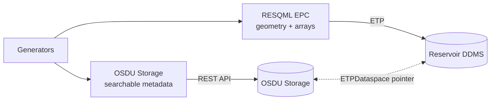

# BusinessDecision Demo - Data Model Guide

> **Scope:** Documents the data model and schema patterns for a Decision Gate 1 and 2 package. Covers OSDU schemas, relationships, activity-based provenance, and cross-gate analysis. For demo data and pipeline specifics, see `demo/drogon_dg2/`.

---

## 1. Schemas Used - Kinds and Relationships

A DG2 decision gate package typically spans **~25 records** across master-data, reference-data, work-product-components, datasets, and custom schemas.

### 1.1 OSDU Canonical Schemas (WKS)

| # | Category | OSDU Kind | Purpose |
|---|----------|-----------|---------|
| 1 | Master-data | `osdu:wks:master-data--BusinessDecision:1.0.0` | Decision record - central hub linking all evidence |
| 2 | Master-data | `osdu:wks:master-data--Reservoir:2.0.0` | Reservoir entity (shared across gates) |
| 3 | Master-data | `osdu:wks:master-data--ReservoirSegment:2.0.0` | Fault-bounded segments |
| 4 | Master-data | `osdu:wks:master-data--Risk:1.2.0` | Risk records with severity/probability ratings |
| 5 | WPC | `osdu:wks:work-product-component--ReservoirEstimatedVolumes:1.1.0` | Raw per-realisation volumes |
| 6 | WPC | `osdu:wks:work-product-component--ReservoirEstimatedVolumes:1.1.0` | Aggregated statistics (P10/P50/P90) |
| 7 | WPC | `osdu:wks:work-product-component--ColumnBasedTable:1.3.0` | Input parameters (design matrix) |
| 8 | WPC | `osdu:wks:work-product-component--ColumnBasedTable:1.3.0` | Production forecast |
| 9 | WPC | `osdu:wks:work-product-component--Activity:1.0.0` | Workflow run record |
| 10 | WPC | `osdu:wks:work-product-component--ActivityTemplate:1.0.0` | Workflow template (parameter slots) |
| 11 | WPC | `osdu:wks:work-product-component--Document:1.2.0` | Governance documents (SRA, CRA, PDO, PTR) |
| 12 | WPC | `osdu:wks:work-product-component--GeoLabelSet:1.0.0` | Headline P10/P50/P90 volumes for dashboards |
| 13 | Dataset | `osdu:wks:dataset--ETPDataspace:1.0.0` | RDDMS dataspace pointer for geomodel |
| 14–20 | Reference-data | DecisionLevel, DecisionApprovalStatus, RiskCategory, RiskSeverityScale, RiskProbabilityScale, RiskAcceptanceCriteria, Facets/PropertyTypes/UoM | Decision catalogs and volume metadata |

### 1.2 Custom Schema - DevelopmentConcept WPC

- **Kind:** `dev:wks:work-product-component--DevelopmentConcept:1.0.0`
- **Purpose:** Captures the selected development concept with structured fields that survive OSDU ingestion.
- **Why?** OSDU has no canonical `DevelopmentConcept` WPC. A registered LOCAL schema ensures fields are validated, searchable, and evolvable. See [DevConcept.md](DevConcept.md).

### 1.3 Entity Relationship Diagram

```mermaid
graph TD
    subgraph "Master Data"
        RES["Reservoir"]
        SEG["ReservoirSegment ×N"]
        RISK["Risk ×N"]
        BD["BusinessDecision DG2"]
        BD_DG1["BusinessDecision DG1"]
    end

    subgraph "Work Product Components"
        REV_RAW["REV - RAW<br/><i>per-realisation</i>"]
        REV_STAT["REV - Statistics<br/><i>P10/P50/P90</i>"]
        PARAMS["ColumnBasedTable<br/><i>Input Parameters</i>"]
        PP["ColumnBasedTable<br/><i>Production Forecast</i>"]
        GLS["GeoLabelSet<br/><i>Headline volumes</i>"]
        DEV["DevelopmentConcept<br/><i>custom schema</i>"]
        ACT["Activity<br/><i>Workflow Run</i>"]
        TMPL["ActivityTemplate"]
        DOCS["Documents<br/><i>SRA, CRA, PDO, PTR</i>"]
    end

    subgraph "Datasets"
        ETP["ETPDataspace<br/><i>RDDMS geomodel</i>"]
    end

    subgraph "Reference Data"
        DL["DecisionLevel"]
        AS["ApprovalStatus"]
        RC["RiskCategory"]
    end

    BD -->|DecisionLevelID| DL
    BD -->|ApprovalStatusID| AS
    BD -->|RiskIDs| RISK
    BD -->|RiskAssessmentDocument| DOCS
    BD -->|PriorActivityIDs| ACT
    BD -->|Parameters - Input| REV_RAW
    BD -->|Parameters - Input| REV_STAT
    BD -->|Parameters - Input| DEV
    BD -->|Parameters - InputRef| RES
    BD -->|Parameters - InputRef| BD_DG1

    ACT -->|ActivityTemplateID| TMPL
    ACT -->|Input| PARAMS
    ACT -->|Output| REV_RAW
    ACT -->|Output| REV_STAT
    ACT -->|InputRef| ETP

    RES -->|ancestry.child| SEG
    REV_RAW -->|ParentObjectID| RES
    RISK -->|CategoryID| RC

    classDef master fill:#cfe2ff,stroke:#084298,color:#222
    classDef wpc fill:#d4edda,stroke:#155724,color:#222
    classDef dataset fill:#fff3cd,stroke:#d39e00,color:#222
    classDef ref fill:#e9ecef,stroke:#6c757d,color:#222
    classDef bd fill:#e2d9f3,stroke:#5a3e85,color:#222

    class RES,SEG master
    class BD,BD_DG1 bd
    class RISK risk
    class REV_RAW,REV_STAT,PARAMS,PP,GLS,ACT,TMPL,DOCS,DEV wpc
    class ETP dataset
    class DL,AS,RC ref
```



---

## 2. BusinessDecision Metadata - Key Fields

### 2.1 Canonical Identity & Decision Fields

| Key Name | Description |
|----------|-------------|
| `Name` | Human-readable gate title |
| `ProjectName` | Project context |
| `DecisionLevelID` | Reference to `DecisionLevel` (DG1–DG4) |
| `ApprovalStatusID` | Reference to `DecisionApprovalStatus` |
| `DecisionDueDate` | Target date |
| `DecisionSummary` | Executive summary |
| `RiskAssessmentDocument` | Link to SRA document WPC |
| `RiskIDs` | Array of `master-data--Risk` references |
| `PriorActivityIDs` | Link to Activity that produced the evidence |

### 2.2 Personnel & Governance

| Key Name | Content |
|----------|---------|
| `Personnel[]` | Team members with `ProjectRoleID` |
| `DecisionOwners[]` | Decision owner(s) |
| `DecisionMakers[]` | Decision maker(s) |
| `Remarks[]` | Structured recommendations |

### 2.3 Parameters[] - Typed Evidence Links

| Role | Purpose | Example Referenced Records |
|------|---------|---------------------------|
| Input | Primary evidence artifacts | REV RAW/STAT, Input Parameters, Production Forecast, DevelopmentConcept, GeoLabelSet |
| InputReference | Context/scope references | Reservoir, ETPDataspace, Prior gate BD, Documents |

---

## 3. Master-Data vs WPC Separation

| Layer | Role | Gate behaviour |
|-------|------|----------------|
| **Master-data** (Reservoir, Segments, Risk, BD) | Identity anchors | Shared/evolving across gates |
| **WPCs** (REV, CBT, Activity, Documents) | Versioned evidence | New per gate |

The BD `Parameters[]` array bridges these: it references both master-data (as `InputReference`) and WPCs (as `Input`/`Output`).

### Query Patterns

**Find all decisions for a reservoir:**
```json
{
  "kind": "osdu:wks:master-data--BusinessDecision:1.0.0",
  "query": "\"<reservoir-uuid>\""
}
```

**Compare volumes across gates:**
For each BD, locate the REV stats WPC in `Parameters[]` → extract P10/P50/P90 totals → compute deltas.

---

## 4. Geomodel Data Residency

Gridded reservoir model data lives in **RDDMS** (ETP dataspace), not in OSDU Storage records:



The BD references the dataspace via `Parameters[]` with role `InputReference`.

---

## 5. Activity Records - Workflow Provenance

### 5.1 ActivityTemplate - Parameter Slots

| Slot | Direction | Description |
|------|-----------|-------------|
| `InputParameters` | Input | Design matrix / input parameters |
| `Process` | Input | Workflow identifier |
| `NumberOfRealizations` | Input | Ensemble size |
| `Method` | Input | Sampling method |
| `Variables` | Input | Uncertainty variable definitions |
| `DesignMatrix` | Input | Per-realisation parameter values |
| `OutputVolumes` | Output | RAW REV WPC |
| `ReportTable` | Output | STAT REV WPC (P10/P50/P90) |

### 5.2 Provenance Chain

```
BusinessDecision → PriorActivityIDs → Activity → Outputs (REV, CBT)
                                        ↑ Inputs (design matrix, parameters, dataspace)
```

Benefits:
- **Full input capture** in the Activity record
- **Reproducibility** - same inputs → equivalent results
- **Cross-gate comparison** - parameter differences are explicit

---

## 6. Risk Tracking Across Gates

### 6.1 Risk Register Pattern

Each gate has formal risks as `master-data--Risk:1.2.0` records with:
- Category, inherent/residual severity and probability (S1–S5, P1–P5)
- Status (Open, Mitigated, Closed)
- Linked mitigation documents

### 6.2 Cross-Gate Evolution

Analysis tracks: risks **added**, **reduced** (lower severity), **closed**, or **escalated** between gates.

### 6.3 Uncertainty Summary

Each BD carries a volume uncertainty summary (STOIIP P90/P50/P10, Recoverable, Recovery Factor, realisations count). Comparing across gates shows whether increased data narrows uncertainty.

---

## 7. Design Principles

1. **One BusinessDecision per gate** - links all evidence through `Parameters[]`
2. **Lossless traceability** - every reference preserved with role semantics
3. **Risk evolution is explicit** - canonical risk records tracked gate-to-gate
4. **Volumes are authoritative** - `ReservoirEstimatedVolumes` is the domain WPC; `GeoLabelSet` for dashboards
5. **Activity provides reproducibility** - captures full workflow configuration

---

## 8. Related Guides

| Document | Focus |
|----------|-------|
| [BusinessDecision.md](BusinessDecision.md) | BD implementation: linking patterns, Parameters[], payloads |
| [Risk.md](Risk.md) | Risk taxonomy, canonical Risk records |
| [Uncertainty.md](Uncertainty.md) | FMU ensemble persistence, Activity semantics |
| [Volumes.md](Volumes.md) | ReservoirEstimatedVolumes: raw vs aggregated |
| [GeoLabelSet.md](GeoLabelSet.md) | Dashboard labels: GeoLabelType, statistics facets |
| [DevConcept.md](DevConcept.md) | DevelopmentConcept custom schema |
