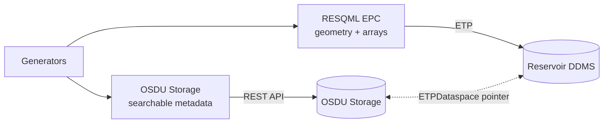

# BusinessDecision Drogon Demo - Data Model Guide

> **Scope:** Worked example of DG1 and DG2 packages using the Drogon field. For general BD concepts and linking patterns, see [BusinessDecision](/howto/business-decision). For CollaborationProject lifecycle, see [P&WS](/howto/pws).
>
> **Demo data**: `demo/drogon_dg2/`

---

## Quick Start - Using ORES with BusinessDecision Data

### Searching

Open the **Search** tab (`/search`) and query for kind `osdu:wks:master-data--BusinessDecision:*.*.*`.  
OSDU Search returns card-rendered results showing each decision gate record with its name, project, decision level, and approval status. Click a result card to inspect the full JSON, including the `Parameters[]` array that links every piece of evidence.

### Analysing Decision Gates

Open the **Analyse** tab (`/analyse`). ORES lists all `Reservoir` master-data records.  
Select a reservoir (e.g. *Drogon*) and ORES automatically finds every `BusinessDecision` linked to it, orders them by gate (DG1 → DG2 → …), and presents a side-by-side comparison:

- **Volume deltas** - STOIIP, Recoverable, Recovery Factor at P10/P50/P90
- **Risk evolution** - risks added, reduced, closed, or escalated between gates
- **Property diffs** - DevelopmentConcept fields, economics parameters
- **Charts** - overlay visualisations of how metrics change across gates

### What a Decision Gate Package Contains

Each `BusinessDecision` record is the **central hub** linking all evidence via its `Parameters[]` array. The Drogon demo uses the full pattern: REV volumes (raw + stats), design matrix, DevelopmentConcept, GeoLabelSet, Activity provenance, Risks, Documents, geomodel (ETPDataspace), PersistedCollection (evidence bundle), and CollaborationProject (cross-DG namespace).

> For the full role taxonomy (Input vs InputReference) and linking semantics, see [BusinessDecision](/howto/business-decision).

All links flow through the BD's `Parameters[]` array using canonical OSDU kinds and types - `Input` for evidence artefacts, `InputReference` for context/scope anchors (reservoir, prior-gate BD, ETP dataspace).

---

## 1. Schemas Used - Kinds and Relationships

A DG1 package spans **~15 records**; a full DG2 decision gate package spans **~100+ records** (including geomodel artefacts) across master-data, reference-data, work-product-components, datasets, and custom schemas.

### 1.1 OSDU Canonical Schemas (WKS)

#### Core (both DG1 and DG2)

| # | Category | OSDU Kind | Purpose |
|---|----------|-----------|---------|
| 1 | Master-data | `osdu:wks:master-data--BusinessDecision:1.0.0` | Decision record - central hub linking all evidence |
| 2 | Master-data | `osdu:wks:master-data--Reservoir:2.0.0` | Reservoir entity (shared across gates) |
| 3 | Master-data | `osdu:wks:master-data--ReservoirSegment:2.0.0` | Fault-bounded segments |
| 4 | Master-data | `osdu:wks:master-data--Risk:1.2.0` | Risk records with severity/probability ratings |
| 5 | WPC | `osdu:wks:work-product-component--ReservoirEstimatedVolumes:1.1.0` | Raw per-realisation volumes |
| 6 | WPC | `osdu:wks:work-product-component--ReservoirEstimatedVolumes:1.1.0` | Aggregated statistics (P10/P50/P90) |
| 7 | WPC | `osdu:wks:work-product-component--ColumnBasedTable:1.3.0` | Input parameters (design matrix) |
| 8 | WPC | `osdu:wks:work-product-component--Activity:1.0.0` | Workflow run record |
| 9 | WPC | `osdu:wks:work-product-component--ActivityTemplate:1.0.0` | Workflow template (parameter slots) |
| 10 | WPC | `osdu:wks:work-product-component--Document:1.2.0` | Governance documents - DG1: SRA, CRA, PDO; DG2 adds PTR |
| 11 | WPC | `osdu:wks:work-product-component--GeoLabelSet:1.0.0` | Headline P10/P50/P90 volumes for dashboards |
| 12 | Dataset | `osdu:wks:dataset--ETPDataspace:1.0.0` | RDDMS dataspace pointer for geomodel |
| -- | Master-data | `osdu:wks:master-data--CollaborationProject:1.0.0` | Cross-DG collaboration namespace - bridges SoE and SoR, persists across gates |
| -- | WPC | `osdu:wks:work-product-component--CollaborationProjectCollection:1.0.0` | Trusted SoR resource accumulator (ResourceIDs[] grow per gate) |

#### DG2 Additions

| # | Category | OSDU Kind | Purpose |
|---|----------|-----------|---------|
| 13 | WPC | `osdu:wks:work-product-component--ColumnBasedTable:1.3.0` | Production forecast (20-year) |
| 14 | WPC | `osdu:wks:work-product-component--IjkGridRepresentation:1.0.0` | Static grid model + per-property child grids (11 WPCs) |
| 15 | WPC | `osdu:wks:work-product-component--StructureMap:1.0.0` | Depth surfaces, amplitude maps, facies fraction maps (12 WPCs) |
| 16 | WPC | `osdu:wks:work-product-component--GenericRepresentation:1.0.0` | Property averages, APS probability cubes, polygons (44 WPCs) |
| 17 | WPC | `osdu:wks:work-product-component--ColumnBasedTable:1.3.0` | Simulator tables - relperm, PVT, summary, completions, gruptree (5 WPCs) |
| 18 | WPC | `osdu:wks:work-product-component--PersistedCollection:1.0.0` | Evidence-package bundling all DG2 artefacts (99 DataReferences) |
| 19–25 | Reference-data | DecisionLevel, DecisionApprovalStatus, RiskCategory, RiskSeverityScale, RiskProbabilityScale, RiskAcceptanceCriteria, Facets/PropertyTypes/UoM | Decision catalogs and volume metadata |

### 1.2 Custom Schema - DevelopmentConcept WPC

- **Kind:** `dev:wks:work-product-component--DevelopmentConcept:1.0.0`
- **Purpose:** Captures the selected development concept with structured fields that survive OSDU ingestion.
- **Why?** OSDU has no canonical `DevelopmentConcept` WPC. A registered LOCAL schema ensures fields are validated, searchable, and evolvable.

### 1.3 Entity Relationship Diagram

```mermaid
graph TD
    subgraph "Master Data"
        RES["Reservoir"]
        SEG["ReservoirSegment ×N"]
        RISK["Risk ×N"]
        BD["BusinessDecision DG2"]
        BD_DG1["BusinessDecision DG1"]
        CP["CollaborationProject<br/><i>cross-DG namespace</i>"]
    end

    subgraph "Work Product Components"
        REV_RAW["REV - RAW<br/><i>per-realisation</i>"]
        REV_STAT["REV - Statistics<br/><i>P10/P50/P90</i>"]
        PARAMS["ColumnBasedTable<br/><i>Input Parameters</i>"]
        PP["ColumnBasedTable<br/><i>Production Forecast</i>"]
        GLS["GeoLabelSet<br/><i>Headline volumes</i>"]
        DEV["DevelopmentConcept<br/><i>custom schema</i>"]
        ACT["Activity<br/><i>Workflow Run</i>"]
        TMPL["ActivityTemplate"]
        DOCS["Documents<br/><i>SRA, CRA, PDO, PTR</i>"]
        GRID["IjkGridRepresentation<br/><i>static grid model</i>"]
        MAPS["StructureMap + GenericRep<br/><i>surfaces, polygons</i>"]
        SIM["ColumnBasedTable<br/><i>simulator tables ×5</i>"]
        PC["PersistedCollection<br/><i>evidence package</i>"]
        CPC["CollabProjectCollection<br/><i>SoR accumulator</i>"]
    end

    subgraph "Datasets"
        ETP["ETPDataspace<br/><i>RDDMS geomodel</i>"]
    end

    subgraph "Reference Data"
        DL["DecisionLevel"]
        AS["ApprovalStatus"]
        RC["RiskCategory"]
    end

    BD -->|DecisionLevelID| DL
    BD -->|ApprovalStatusID| AS
    BD -->|RiskIDs| RISK
    BD -->|RiskAssessmentDocument| DOCS
    BD -->|PriorActivityIDs| ACT
    BD -->|Parameters - Input| REV_RAW
    BD -->|Parameters - Input| REV_STAT
    BD -->|Parameters - Input| DEV
    BD -->|Parameters - InputRef| RES
    BD -->|Parameters - InputRef| BD_DG1
    BD -->|Parameters - Input| GRID
    BD -->|Parameters - Input| MAPS
    BD -->|Parameters - Input| SIM
    BD -->|Parameters - InputRef| PC

    BD -->|ParentProjectID| CP
    BD_DG1 -->|ParentProjectID| CP
    CP -->|TrustedCollectionID| CPC
    CPC -.->|ResourceIDs| REV_RAW
    CPC -.->|ResourceIDs| GRID
    CPC -.->|ResourceIDs| RES
    CPC -.->|ResourceIDs| ETP

    PC -.->|DataReferences| REV_RAW
    PC -.->|DataReferences| GRID
    PC -.->|DataReferences| MAPS
    PC -.->|DataReferences| RISK
    PC -.->|DataReferences| DOCS
    PC -.->|DataReferences| ETP

    ACT -->|ActivityTemplateID| TMPL
    ACT -->|Input| PARAMS
    ACT -->|Output| REV_RAW
    ACT -->|Output| REV_STAT
    ACT -->|InputRef| ETP

    RES -->|ancestry.child| SEG
    REV_RAW -->|ParentObjectID| RES
    RISK -->|CategoryID| RC

    classDef master fill:#cfe2ff,stroke:#084298,color:#222
    classDef wpc fill:#d4edda,stroke:#155724,color:#222
    classDef dataset fill:#fff3cd,stroke:#d39e00,color:#222
    classDef ref fill:#e9ecef,stroke:#6c757d,color:#222
    classDef bd fill:#e2d9f3,stroke:#5a3e85,color:#222

    class RES,SEG master
    class BD,BD_DG1 bd
    class CP bd
    class RISK risk
    class REV_RAW,REV_STAT,PARAMS,PP,GLS,ACT,TMPL,DOCS,DEV,GRID,MAPS,SIM,PC,CPC wpc
    class ETP dataset
    class DL,AS,RC ref
```



---

## 2. BusinessDecision Metadata - Key Fields

### 2.1 Canonical Identity & Decision Fields

| Key Name | Description |
|----------|-------------|
| `Name` | Human-readable gate title |
| `ProjectName` | Project context |
| `DecisionLevelID` | Reference to `DecisionLevel` (DG1–DG4) |
| `ApprovalStatusID` | Reference to `DecisionApprovalStatus` |
| `DecisionDueDate` | Target date |
| `DecisionSummary` | Executive summary |
| `RiskAssessmentDocument` | Link to SRA document WPC |
| `RiskIDs` | Array of `master-data--Risk` references |
| `PriorActivityIDs` | Link to Activity that produced the evidence |

### 2.2 Personnel & Governance

| Key Name | Content |
|----------|---------|
| `Personnel[]` | Team members with `ProjectRoleID` |
| `DecisionOwners[]` | Decision owner(s) |
| `DecisionMakers[]` | Decision maker(s) |
| `Remarks[]` | Structured recommendations |

### 2.3 Parameters[] - Typed Evidence Links

| Role | Purpose | Example Referenced Records |
|------|---------|---------------------------|
| Input | Primary evidence artifacts | REV RAW/STAT, Input Parameters, Production Forecast, DevelopmentConcept, GeoLabelSet, IjkGridRepresentation, StructureMap/GenericRepresentation (maps), ColumnBasedTable (sim-tables) |
| InputReference | Context/scope references | Reservoir, ETPDataspace, Prior gate BD, Documents, PersistedCollection (evidence package), GenericRepresentation (polygons) |

> **DG1 vs DG2 scope:** DG1 BD Parameters[] links only core evidence (REV, design matrix, reservoir, ETPDataspace). DG2 extends this to 18 parameters adding grid model, maps, simulator tables, polygons, documents, production forecast, DevelopmentConcept, and the PersistedCollection evidence package.

---

## 3. Master-Data vs WPC Separation

| Layer | Role | Gate behaviour |
|-------|------|----------------|
| **Master-data** (Reservoir, Segments, Risk, BD, **CollaborationProject**) | Identity anchors | Shared/evolving across gates - CP persists from DG1 through FID |
| **WPCs** (REV, CBT, Activity, Documents, **CollabProjectCollection**) | Versioned evidence | New per gate (except CollabProjectCollection which accumulates) |

The BD `Parameters[]` array bridges these: it references both master-data (as `InputReference`) and WPCs (as `Input`/`Output`).

### Query Patterns

**Find all decisions for a reservoir:**
```json
{
  "kind": "osdu:wks:master-data--BusinessDecision:1.0.0",
  "query": "\"<reservoir-uuid>\""
}
```

**Compare volumes across gates:**
For each BD, locate the REV stats WPC in `Parameters[]` → extract P10/P50/P90 totals → compute deltas.

---

## 4. Geomodel Data Residency

Gridded reservoir model data lives in **RDDMS** (ETP dataspace), not in OSDU Storage records:



The BD references the dataspace via `Parameters[]` with role `InputReference`.

> **DatasetIDs gap:** The RDDMS manifest builder does **not** populate `DatasetIDs` on WPCs - the field that links a WPC back to its parent Dataset (ETPDataspace). After ingesting RDDMS-sourced WPCs, a post-ingest patch is needed to set `DatasetIDs: ["<ETPDataspace-record-id>"]` on each WPC. Without this, WPCs are orphaned from their dataspace in OSDU search.

---

## 5. Activity Records - Workflow Provenance

### 5.1 ActivityTemplate - Parameter Slots

| Slot | Direction | Description |
|------|-----------|-------------|
| `InputParameters` | Input | Design matrix / input parameters |
| `Process` | Input | Workflow identifier |
| `NumberOfRealizations` | Input | Ensemble size |
| `Method` | Input | Sampling method |
| `Variables` | Input | Uncertainty variable definitions |
| `DesignMatrix` | Input | Per-realisation parameter values |
| `OutputVolumes` | Output | RAW REV WPC |
| `ReportTable` | Output | STAT REV WPC (P10/P50/P90) |

### 5.2 Provenance Chain

```
BusinessDecision → PriorActivityIDs → Activity → Outputs (REV, CBT)
                                        ↑ Inputs (design matrix, parameters, dataspace)
```

Benefits:
- **Full input capture** in the Activity record
- **Reproducibility** - same inputs → equivalent results
- **Cross-gate comparison** - parameter differences are explicit

---

## 6. Risk Tracking Across Gates

### 6.1 Risk Register Pattern

Each gate has formal risks as `master-data--Risk:1.2.0` records with:
- Category, inherent/residual severity and probability (S1–S5, P1–P5)
- Status (Open, Mitigated, Closed)
- Linked mitigation documents

### 6.2 Cross-Gate Evolution

Analysis tracks: risks **added**, **reduced** (lower severity), **closed**, or **escalated** between gates.

### 6.3 Uncertainty Summary

Each BD carries a volume uncertainty summary (STOIIP P90/P50/P10, Recoverable, Recovery Factor, realisations count). Comparing across gates shows whether increased data narrows uncertainty.

---

## 7. PersistedCollection - Evidence Package

At DG2, all decision artefacts are bundled into a `PersistedCollection` WPC with `DataReferences[]` listing every record ID in the package. The Drogon DG2 collection ("Drogon DG2 - Evidence Package") contains **99 DataReferences** spanning:

| Group | Count | Example Kinds |
|-------|------:|---------------|
| IjkGridRepresentation | 11 | Parent grid + 10 property grids |
| StructureMap | 12 | 6 horizon depth surfaces + derived maps |
| GenericRepresentation (maps) | 37 | Amplitude, facies fractions, property averages, APS probability cubes |
| GenericRepresentation (polygons) | 7 | Fault lines (4 horizons), field outline, fluid-contact outlines |
| ColumnBasedTable (sim-tables) | 5 | Relperm, PVT, summary, completions, gruptree |
| REV, CBT (design matrix), DevelopmentConcept | 4 | Core evidence |
| Activity + ActivityTemplate | 2 | Provenance chain |
| ETPDataspace | 1 | RDDMS dataspace pointer |
| Risk | 6 | DG2 risk records |
| Documents | 4 | SRA, CRA, PDO, PTR |
| Reservoir + 7 Segments | 8 | Master-data scope |
| GeoLabelSet | 1 | Headline volumes |
| Well/Wellbore/Strat | ~30 | Shared well + stratigraphy records |

The BD references this collection via `Parameters[]` (`ParameterRole: InputReference`, key `PersistedCollection`).

---

## 8. Design Principles

1. **One BusinessDecision per gate** - links all evidence through `Parameters[]`
2. **CollaborationProject spans gates** - master-data namespace that bridges SoE and SoR; BDs link via `ParentProjectID`; trusted collection accumulates per gate
3. **Lossless traceability** - every reference preserved with role semantics
4. **Risk evolution is explicit** - canonical risk records tracked gate-to-gate
5. **Volumes are authoritative** - `ReservoirEstimatedVolumes` is the domain WPC; `GeoLabelSet` for dashboards
6. **Activity provides reproducibility** - captures full workflow configuration
7. **PersistedCollection snapshots one gate** - DG2+ packages all artefacts into a single searchable collection
8. **CollaborationProjectCollection accumulates across gates** - the SoR grows; PersistedCollection freezes


