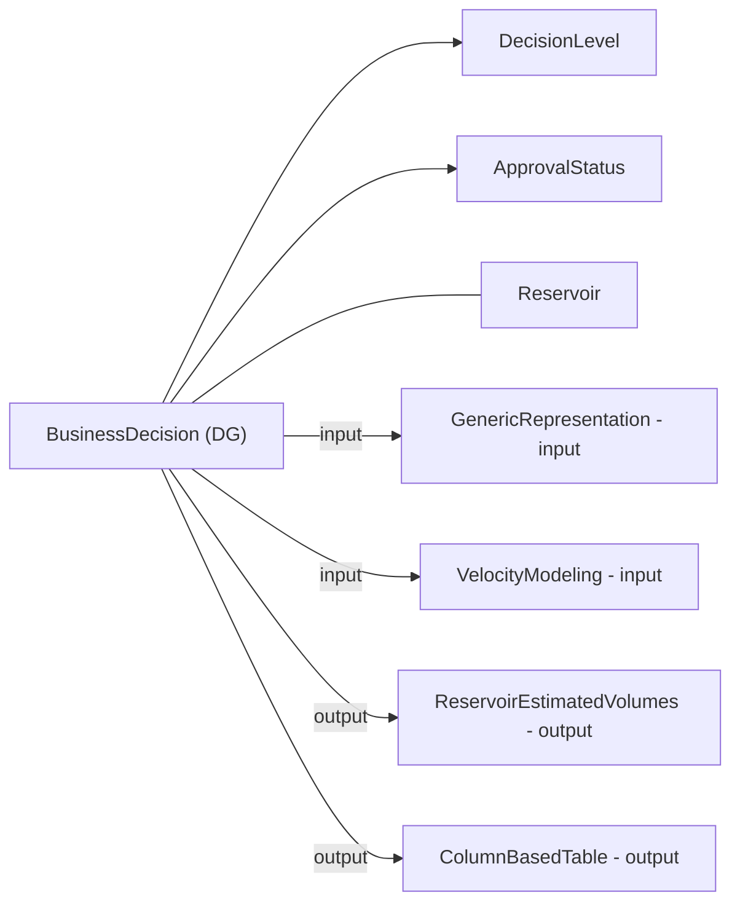
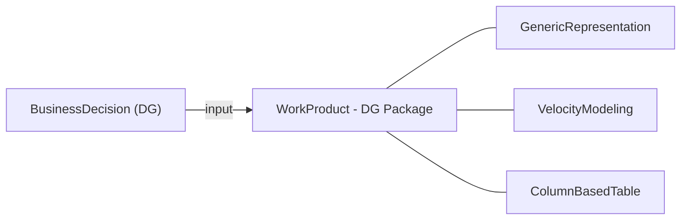

# OSDU Decision Gates with `BusinessDecision` - Implementation Guide

> **Scope:** Model DG1…DG4 decisions as `osdu:wks:master-data--BusinessDecision:1.0.0` records, linking inputs and outputs using **activity parameters** and/or **persisted collections**. This guide summarizes options, pros/cons, and provides example payloads and diagrams.

---

## 1. What `BusinessDecision` is designed for

`BusinessDecision` records a technical/business decision and **inherits** `AbstractProjectActivity`, which provides the `Parameters[]` mechanism to express **inputs/outputs/context** relationships. It also defines typed properties for **DecisionLevel**, **ApprovalStatus**, **Risks**, and **Risk documents**.

- Schema: [BusinessDecision.1.0.0](https://community.opengroup.org/osdu/data/data-definitions/-/blob/master/Authoring/master-data/BusinessDecision.1.0.0.json)
- Activity semantics: [AbstractProjectActivity](https://community.opengroup.org/osdu/data/data-definitions/-/blob/master/E-R/abstract/AbstractProjectActivity.1.2.0.md)
- Decision catalogs: [DecisionLevel.1.0.0](https://community.opengroup.org/osdu/data/data-definitions/-/blob/master/E-R/reference-data/DecisionLevel.1.0.0.md), [DecisionApprovalStatus.1.0.0](https://community.opengroup.org/osdu/data/data-definitions/-/blob/master/Examples/reference-data/DecisionApprovalStatus.1.0.0.json)

---

## 2. Ways to link master-data and WPCs to a decision gate

Four complementary patterns - mix as needed:

### A) `Parameters[]` (from `AbstractProjectActivity`)

Declare **inputs**, **outputs**, and **context** objects with rich metadata (role, selection note, keys).

**Pros**: Semantically precise, template-friendly, supports multiple values and keys.
**Cons**: Nested arrays make queries heavier; requires consistent conventions.

### B) Explicit `BusinessDecision` relationships

Built-in properties: `DecisionLevelID`, `ApprovalStatusID`, `RiskIDs`, `RiskAssessmentDocument`, `PriorActivityIDs`.

**Pros**: Strong validation; easy filtering (e.g., "Approved DG2").
**Cons**: Not meant to enumerate full input/output sets.

### C) Persisted collections: `WorkProduct` and `PersistedCollection`

Bundle WPCs into a **versioned container** and reference it as a single parameter.

- `WorkProduct` - deliverable bundle: [ER doc](https://community.opengroup.org/osdu/data/data-definitions/-/blob/master/E-R/work-product/WorkProduct.1.0.0.md)
- `PersistedCollection` - curated evidence set: [ER doc](https://community.opengroup.org/osdu/data/data-definitions/-/blob/master/E-R/work-product-component/PersistedCollection.1.0.0.md)

**Pros**: One ID represents the gate package; simpler governance.
**Cons**: Extra objects; still use `Parameters[]` for role semantics.

### D) Rely on WPC→master-data links

Many WPCs natively reference reservoir entities (e.g., `ReservoirEstimatedVolumes` → `Reservoir`). Navigate via WPC without duplicating relationships.

---

## 3. Recommended pattern for DG1…DG4

1. **One `BusinessDecision` per gate**: set `DecisionLevelID`, `ApprovalStatusID`, dates, owners, summary.
2. **Anchor the primary artifact** via `PriorActivityIDs`.
3. **List inputs and outputs** in `Parameters[]` with `ParameterRole` = `input`/`output`/`context`.
4. **Optionally** package artifacts into a **WorkProduct** or **PersistedCollection**.
5. **Risks & docs**: link via `RiskIDs` and `RiskAssessmentDocument`.

**Typical kinds at decision gates:**
- Inputs: `Well`, `GenericRepresentation`, `VelocityModeling`, `ColumnBasedTable`, `ProductionValues`
- Outputs: `GenericRepresentation`, `ReservoirEstimatedVolumes`, `ColumnBasedTable`

---

## 4. Mermaid diagrams

### 4.1 DG modeled with `Parameters[]`


### 4.2 DG with a persisted collection


---

## 5. Example payload

### `BusinessDecision` with `Parameters[]`
```json
{
  "kind": "osdu:wks:master-data--BusinessDecision:1.0.0",
  "data": {
    "Name": "Project X - Decision Gate 2",
    "DecisionLevelID": "osdu:reference-data--DecisionLevel:DG2:1.0.0",
    "ApprovalStatusID": "osdu:reference-data--DecisionApprovalStatus:Approved:1.0.0",
    "DecisionDate": "2025-12-10",
    "DecisionSummary": "Approve concept select based on aggregated segment volumes.",
    "RiskAssessmentDocument": "dev:work-product-component--Document:RiskAssessment_DG2:1",
    "RiskIDs": [ "dev:master-data--Risk:DepthConversionTopReservoir:1" ],
    "PriorActivityIDs": [ "dev:work-product-component--ReservoirEstimatedVolumes:<uuid>:1" ],
    "Parameters": [
      {
        "Title": "Volumes WPC",
        "ParameterRole": "input",
        "ObjectParameterKey": "dev:work-product-component--ReservoirEstimatedVolumes:<uuid>:1"
      },
      {
        "Title": "Velocity model",
        "ParameterRole": "input",
        "ObjectParameterKey": "dev:work-product-component--VelocityModeling:<uuid>:1"
      },
      {
        "Title": "Output map",
        "ParameterRole": "output",
        "ObjectParameterKey": "dev:work-product-component--GenericRepresentation:<uuid>:1"
      },
      {
        "Title": "Context Reservoir",
        "ParameterRole": "context",
        "ObjectParameterKey": "dev:master-data--Reservoir:<uuid>:1"
      }
    ]
  }
}
```

---

## 6. Choosing between `Parameters[]` vs. persisted collections

| Option | Best for | Pros | Cons |
|---|---|---|---|
| `Parameters[]` | Precise workflow/provenance | Rich semantics; multi-values, keys | Heavier nested queries |
| `WorkProduct` | Stable, versioned DG package | One ID; easier ACL/legal | Extra object to manage |
| `PersistedCollection` | Evidence package / curated set | One ID for DG artifacts | Extra object to manage |
| Explicit fields | Gate filters & governance | Simple queries | Not a substitute for full input/output lists |

**Recommendation:** Use **both**: typed decision fields for gate metadata **and** `Parameters[]` for inputs/outputs/context.

---

## 7. References

- `BusinessDecision` schema: [Community examples](https://community.opengroup.org/osdu/data/data-definitions/-/blob/master/Examples/master-data/BusinessDecision.1.0.0.json)
- `AbstractProjectActivity`: [ER doc](https://community.opengroup.org/osdu/data/data-definitions/-/blob/master/E-R/abstract/AbstractProjectActivity.1.2.0.md)
- Decision catalogs: [DecisionLevel](https://community.opengroup.org/osdu/data/data-definitions/-/blob/master/E-R/reference-data/DecisionLevel.1.0.0.md)
- WPCs: [VelocityModeling](https://community.opengroup.org/osdu/data/data-definitions/-/blob/master/E-R/work-product-component/VelocityModeling.1.3.0.md), [GenericRepresentation](https://community.opengroup.org/osdu/data/data-definitions/-/blob/master/Examples/work-product-component/GenericRepresentation.1.0.0.json)
- WorkProduct / PersistedCollection: [PersistedCollection ER](https://community.opengroup.org/osdu/data/data-definitions/-/blob/master/E-R/work-product-component/PersistedCollection.1.0.0.md)

---

## 8. Related guides

- [Volumes](Volumes.md) - ReservoirEstimatedVolumes WPC, raw vs aggregated
- [Uncertainty](Uncertainty.md) - FMU ensemble inputs & outputs in OSDU, Activity provenance
- [Risk](Risk.md) - Risk master-data, mitigation documents, risk catalogs
- [BdDemo](BdDemo.md) - DG2 data model guide with full entity-relationship view
