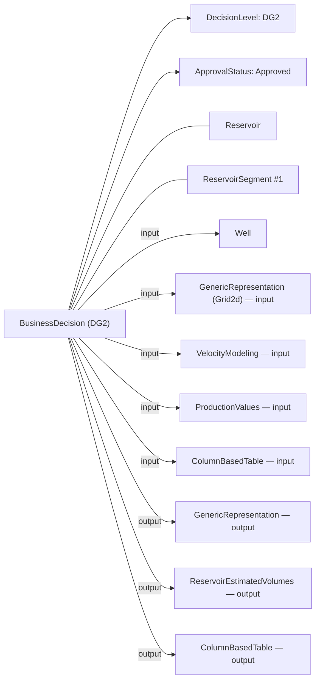
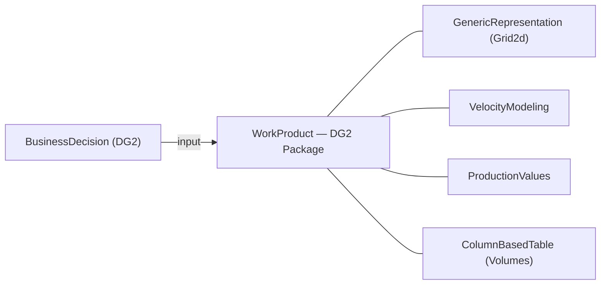

# OSDU Decision Gates with `BusinessDecision` — Implementation Guide

> **Scope:** Model DG1…DG4 decisions as `osdu:wks:master-data--BusinessDecision:1.0.0` records, linking inputs (e.g., Wells, Grid maps, Velocity models, Production tables) and outputs (e.g., GenericRepresentation, ReservoirEstimatedVolumes, ColumnBasedTable) using **activity parameters** and/or **persisted collections** (WorkProduct / PersistedCollection). This guide summarizes options, pros/cons, and gives example payloads and diagrams.

---

## 1. What `BusinessDecision` is designed for

`BusinessDecision` records a technical/business decision and **inherits** `AbstractProjectActivity`, which provides the `Parameters[]` mechanism to express **inputs/outputs/context** relationships for a workflow step (your decision gate). It also defines typed properties for **DecisionLevel**, **ApprovalStatus**, **Risks**, and **Risk documents**.

- Schema authoring and description: [BusinessDecision.1.0.0.json (Authoring)](https://github.com/jonslo/osdu-data-data-definitions/blob/master/Authoring/master-data/BusinessDecision.1.0.0.json) and [Community repo](https://community.opengroup.org/osdu/data/data-definitions/-/blob/master/Authoring/master-data/BusinessDecision.1.0.0.json).
- Activity semantics: [AbstractProjectActivity](https://community.opengroup.org/osdu/data/data-definitions/-/blob/master/E-R/abstract/AbstractProjectActivity.1.2.0.md) and its migration notes / parameter roles: [Migration (M18)](https://github.com/jonslo/osdu/osdu-data-data-definitions/blob/master/Guides/MigrationGuides/M18/AbstractProjectActivity.1.1.0.md).
- Decision level & approval catalogs: [DecisionLevel.1.0.0](https://github.com/jonslo/osdu-data-data-definitions/blob/master/E-R/reference-data/DecisionLevel.1.0.0.md) / [Example](https://community.opengroup.org/osdu/data/data-definitions/-/blob/master/Examples/reference-data/DecisionLevel.1.0.0.json), and [DecisionApprovalStatus.1.0.0](https://github.com/jonslo/osdu/osdu-data-data-definitions/blob/master/Examples/reference-data/DecisionApprovalStatus.1.0.0.json).

> **Why this matters:** Using `Parameters[]` keeps your decision gate aligned with OSDU’s workflow semantics, while the typed fields enable simple filters like “Approved DG2 decisions”.

---

## 2. Ways to link master-data and WPCs to a decision gateSRA/CRA

You have **four** complementary patterns. Mix them as needed.

### A) `Parameters[]` (from `AbstractProjectActivity`)
Use `Parameters[]` to declare **inputs**, **outputs**, and **context** objects with rich metadata (role, selection note, index, keys, time index).

**Pros**
- Semantically precise (input/output/context) and template-friendly.
- Supports multiple values, arrays, and keys (`ParameterKey`, `ObjectParameterKey`, etc.).

**Cons**
- Nested arrays make queries heavier; requires consistent conventions (`ParameterRole`, keys).

**References:** [AbstractProjectActivity](https://community.opengroup.org/osdu/data/data-definitions/-/blob/master/E-R/abstract/AbstractProjectActivity.1.2.0.md), [Migration notes](https://github.com/jonslo/osdu/osdu-data-data-definitions/blob/master/Guides/MigrationGuides/M18/AbstractProjectActivity.1.1.0.md).

---

### B) Explicit `BusinessDecision` relationships
Use built-in properties for decision metadata and key relationships:
- `DecisionLevelID` (DG1…DG4) → `reference-data--DecisionLevel`.
- `ApprovalStatusID` (Approved, etc.) → `reference-data--DecisionApprovalStatus`.
- `RiskIDs` → `master-data--Risk` and `RiskAssessmentDocument` → `work-product-component--Document`.
- `PriorActivityIDs` → id of the preceding primary artifact or activity.

**Pros**
- Strong validation with kind patterns; **easy filtering** (e.g., Approved DG2).

**Cons**
- Scope-limited: not meant to enumerate full input/output sets (that’s `Parameters[]`).

**References:** [BusinessDecision.1.0.0](https://github.com/jonslo/osdu/osdu-data-data-definitions/blob/master/Authoring/master-data/BusinessDecision.1.0.0.json), [Document WPC](https://community.opengroup.org/osdu/data/data-definitions/-/blob/master/Examples/work-product-component/Document.1.2.0.json).

---

### C) Persisted collections: `WorkProduct` and `PersistedCollection`
Bundle a set of WPCs into a **versioned container** and link that single id as an input/context parameter.

- `work-product--WorkProduct` (deliverable bundle) — [ER doc](https://github.com/jonslo/osdu/osdu-data-data-definitions/blob/master/E-R/work-product/WorkProduct.1.0.0.md).
- `work-product-component--PersistedCollection` (evidence package / curated set) — [ER doc](https://community.opengroup.org/osdu/data/data-definitions/-/blob/master/E-R/work-product-component/PersistedCollection.1.0.0.md).

**Pros**
- One id represents **“the DG package”**; simpler governance and versioning.

**Cons**
- Extra objects to author/maintain; still use `Parameters[]` for role semantics.

---

### D) Rely on WPC→master-data links
Many WPCs natively reference reservoir entities (e.g., `ReservoirEstimatedVolumes` link to `Reservoir` / `ReservoirSegment`). Navigate via WPC to master-data without duplicating relationships.

**Reference:** Reservoir Management worked examples (links between WPC and Reservoir/Segments) — [README](https://github.com/jonslo/osdu/osdu-data-data-definitions/blob/master/Examples/WorkedExamples/ReservoirManagement/README.md);
`ColumnBasedTable` usage — [README](https://github.com/jonslo/osdu/osdu-data-data-definitions/blob/master/Examples/WorkedExamples/Reservoir%20Data/ColumnBasedTable/README.md).

---

## 3. Recommended pattern for DG1…DG4

1. **One `BusinessDecision` per gate**: set `DecisionLevelID`, `ApprovalStatusID`, dates, owners, summary.
2. **Anchor the primary artifact** via `PriorActivityIDs` (e.g., consolidated volumes WPC).
3. **List all key inputs and outputs** in `Parameters[]` with `ParameterRole` = `input`/`output`.
4. **Optionally** package many artifacts into a **WorkProduct** or **PersistedCollection** and reference the container as a single parameter (keep 1–2 critical objects individually for drill‑down).
5. **Risks & docs**: link via `RiskIDs` and `RiskAssessmentDocument`.

**DG content mapping** (typical kinds):
- Inputs: `work-product-component--Well`, `GenericRepresentation` (e.g., Grid2d), `VelocityModeling`, `ProductionValues`, `ColumnBasedTable` (volumes), `IjkGridRepresentation` (DG3/4), `WellboreTrajectory` (DG3/4 planned wells).
- Outputs: `GenericRepresentation`, `ReservoirEstimatedVolumes`, `ColumnBasedTable`.

**References:** WPC catalogs and docs — [VelocityModeling](https://github.com/jonslo/osdu/osdu-data-data-definitions/blob/master/E-R/work-product-component/VelocityModeling.1.3.0.md), [ProductionValues](https://github.com/jonslo/osdu/osdu-data-data-definitions/blob/master/E-R/work-product-component/ProductionValues.1.0.0.md), [GenericRepresentation](https://community.opengroup.org/osdu/data/data-definitions/-/blob/master/Examples/work-product-component/GenericRepresentation.1.0.0.json).

---

## 4. Learnings from the GRAND DG2 manifest (example)

Your `manifest_dgv2.json` demonstrates good practice:
- `DecisionLevelID = DG2`, `ApprovalStatusID = Approved`, dates, summary.
- `RiskIDs` + `RiskAssessmentDocument` capture governance.
- `PriorActivityIDs` anchors the main volumes input.
- `Parameters[]` link both **WPC inputs** (ReservoirEstimatedVolumes) and **context** (Reservoir, ReservoirSegments) via `ObjectParameterKey` and a simple `role` key.

**Optional improvements:**
- Add explicit `ParameterRole` (`input`, `output`, `context`) to each parameter for clearer analytics (supported per migration notes). 
- Group many inputs into a `WorkProduct` when a gate has a broad artifact set; reference it as one parameter while retaining 1–2 critical inputs individually.

**References:** [BusinessDecision authoring file](https://github.com/jonslo/osdu/osdu-data-data-definitions/blob/master/Authoring/master-data/BusinessDecision.1.0.0.json), [AbstractProjectActivity parameters](https://community.opengroup.org/osdu/data/data-definitions/-/blob/master/E-R/abstract/AbstractProjectActivity.1.2.0.md).

---

## 5. Mermaid diagrams

### 5.1 DG2 modeled with `Parameters[]`


### 5.2 DG2 with a persisted collection


---

## 6. Example payloads

### 6.1 `BusinessDecision` with `Parameters[]` (inputs, outputs, context)
```json
{
  "kind": "osdu:wks:master-data--BusinessDecision:1.0.0",
  "id": "dev:master-data--BusinessDecision:PROJECTX-DG2:1",
  "acl": { "owners": ["data.default.owners@dev.dataservices.energy"], "viewers": ["data.office.global.viewers@dev.dataservices.energy"] },
  "legal": { "legaltags": ["dev-equinor-private-default"], "otherRelevantDataCountries": ["NO"] },
  "data": {
    "Name": "PROJECT X — Decision Gate 2",
    "DecisionLevelID": "osdu:reference-data--DecisionLevel:DG2:1.0.0",
    "ApprovalStatusID": "osdu:reference-data--DecisionApprovalStatus:Approved:1.0.0",
    "DecisionDate": "2025-12-10",
    "DecisionSummary": "Approve concept select based on aggregated segment volumes and velocity model v3.",
    "RiskAssessmentDocument": "dev:work-product-component--Document:RiskAssessment_DG2.pdf:1",
    "RiskIDs": [ "dev:master-data--Risk:DepthConversionTopReservoir:1" ],
    "PriorActivityIDs": [ "dev:work-product-component--ReservoirEstimatedVolumes:5033c9e2-b1cf-424a-86c9-76b846942cf8:1" ],
    "Parameters": [
      {
        "Title": "Volumes WPC",
        "Selection": "DG2 inputs: aggregated estimated volumes by segment & zone",
        "ParameterRole": "input",
        "Keys": [{ "ParameterKey": "role", "StringParameterKey": "input" }],
        "ObjectParameterKey": "dev:work-product-component--ReservoirEstimatedVolumes:5033c9e2-b1cf-424a-86c9-76b846942cf8:1"
      },
      {
        "Title": "Velocity model",
        "ParameterRole": "input",
        "ObjectParameterKey": "dev:work-product-component--VelocityModeling:abcd-1234:1"
      },
      {
        "Title": "Grid2d map",
        "ParameterRole": "output",
        "ObjectParameterKey": "dev:work-product-component--GenericRepresentation:gr-5678:1"
      },
      {
        "Title": "Reservoir volumes table",
        "ParameterRole": "output",
        "ObjectParameterKey": "dev:work-product-component--ColumnBasedTable:cbt-9999:1"
      },
      {
        "Title": "Context Reservoir",
        "ParameterRole": "context",
        "ObjectParameterKey": "dev:master-data--Reservoir:f9585655-83d8-4549-ae3e-2dffc2cd5937:1"
      },
      {
        "Title": "Context ReservoirSegment",
        "Index": 1,
        "ParameterRole": "context",
        "ObjectParameterKey": "dev:master-data--ReservoirSegment:32fb46f2-fe6f-45a0-9f9d-43af174d8de9:1"
      }
    ]
  }
}
```

**Notes:**
- `ParameterRole` aligns with activity semantics (input/output/context); `Keys[].ParameterKey` can carry additional internal keys.
- The WPC kinds used here are documented under the WPC ER and examples (VelocityModeling, GenericRepresentation, ColumnBasedTable, ProductionValues). See references in sections 3–4.

### 6.2 Using a `WorkProduct` to bundle DG artifacts
```json
{
  "kind": "osdu:wks:work-product--WorkProduct:1.0.0",
  "id": "dev:work-product--WorkProduct:PROJECTX-DG2-PACKAGE:1",
  "data": {
    "Name": "PROJECT X DG2 Package",
    "Components": [
      "dev:work-product-component--GenericRepresentation:gr-5678:1",
      "dev:work-product-component--VelocityModeling:abcd-1234:1",
      "dev:work-product-component--ProductionValues:pv-7777:1",
      "dev:work-product-component--ColumnBasedTable:cbt-9999:1"
    ]
  }
}
```
Then reference this WorkProduct from `BusinessDecision.Parameters[]` as a **single** `input` or `context`.

### 6.3 `PersistedCollection` (evidence package)
```json
{
  "kind": "osdu:wks:work-product-component--PersistedCollection:1.0.0",
  "id": "dev:work-product-component--PersistedCollection:PROJECTX-DG2-EvidencePackage:1",
  "data": {
    "Name": "PROJECT X DG2 Evidence Package",
    "Description": "PersistedCollection bundling all artifacts for the DG2 Concept Select decision.",
    "DataReferences": [
      "dev:work-product-component--GenericRepresentation:gr-5678:1",
      "dev:work-product-component--VelocityModeling:abcd-1234:1",
      "dev:work-product-component--ProductionValues:pv-7777:1",
      "dev:work-product-component--ColumnBasedTable:cbt-9999:1"
    ]
  }
}
```

---

## 7. Choosing between `Parameters[]` vs. persisted collections

| Option | Best for | Pros | Cons |
|---|---|---|---|
| `Parameters[]` (input/output/context) | Precise workflow/provenance at object level | Rich semantics; supports multi‑values, time index, keys | Heavier nested queries; requires conventions |
| `WorkProduct` | Stable, versioned **DG package** | One id; easier ACL/legal; re‑use | Extra object to manage; still need parameters for roles |
| `PersistedCollection` | Evidence package / curated set | One id for the DG package; `DataReferences[]` lists all artifacts | Extra object to manage; still need parameters for roles |
| Explicit fields (`DecisionLevelID`, `ApprovalStatusID`, `Risk…`, `PriorActivityIDs`) | Gate filters & governance | Simple queries; clear domain | Not a substitute for full input/output lists |

**Practical recommendation:** Use **both**: typed decision fields for gate metadata **and** `Parameters[]` for all gate inputs/outputs/context. If the artifact set is large, **also create** a PersistedCollection (or WorkProduct) and reference it; still list 1–2 critical artifacts individually.

---

## 8. Additional references
- `BusinessDecision` schema (authoring & examples): [GitHub authoring](https://github.com/jonslo/osdu/osdu-data-data-definitions/blob/master/Authoring/master-data/BusinessDecision.1.0.0.json), [Community examples](https://community.opengroup.org/osdu/data/data-definitions/-/blob/master/Examples/master-data/BusinessDecision.1.0.0.json).
- `AbstractProjectActivity` (parameters and roles): [ER doc](https://community.opengroup.org/osdu/data/data-definitions/-/blob/master/E-R/abstract/AbstractProjectActivity.1.2.0.md), [Migration notes](https://github.com/jonslo/osdu/osdu-data-data-definitions/blob/master/Guides/MigrationGuides/M18/AbstractProjectActivity.1.1.0.md).
- Decision catalogs: [DecisionLevel](https://github.com/jonslo/osdu/osdu-data-data-definitions/blob/master/E-R/reference-data/DecisionLevel.1.0.0.md), [DecisionApprovalStatus example](https://github.com/jonslo/osdu/osdu-data-data-definitions/blob/master/Examples/reference-data/DecisionApprovalStatus.1.0.0.json).
- WPCs used at gates: [VelocityModeling](https://github.com/jonslo/osdu/osdu-data-data-definitions/blob/master/E-R/work-product-component/VelocityModeling.1.3.0.md), [ProductionValues](https://github.com/jonslo/osdu/osdu-data-data-definitions/blob/master/E-R/work-product-component/ProductionValues.1.0.0.md), [GenericRepresentation example](https://community.opengroup.org/osdu/data/data-definitions/-/blob/master/Examples/work-product-component/GenericRepresentation.1.0.0.json), [ColumnBasedTable usage](https://github.com/jonslo/osdu/osdu-data-data-definitions/blob/master/Examples/WorkedExamples/Reservoir%20Data/ColumnBasedTable/README.md).
- WorkProduct / PersistedCollection: [WorkProduct ER](https://github.com/jonslo/osdu/osdu-data-data-definitions/blob/master/E-R/work-product/WorkProduct.1.0.0.md), [PersistedCollection ER](https://community.opengroup.org/osdu/data/data-definitions/-/blob/master/E-R/work-product-component/PersistedCollection.1.0.0.md).

---

## 9. Related guides

- [Volumes](Volumes.md) — ReservoirEstimatedVolumes WPC, raw vs aggregated, fmu-dataio column mapping
- [Uncertainty](Uncertainty.md) — FMU ensemble/Monte Carlo inputs & outputs in OSDU, Activity provenance
- [Risk](Risk.md) — Risk master-data, mitigation documents, risk catalogs
- [Drogon DG2 Demo](BdDemo.md) — Full worked example: BusinessDecision + all evidence artifacts

---
