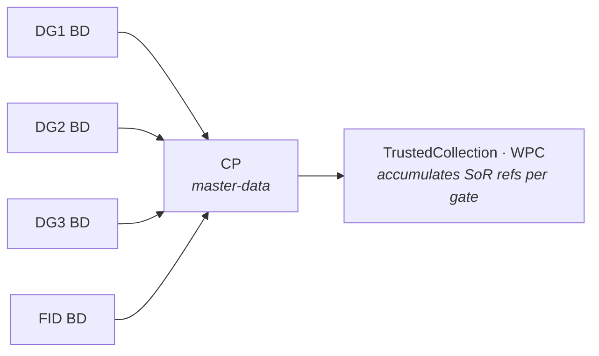
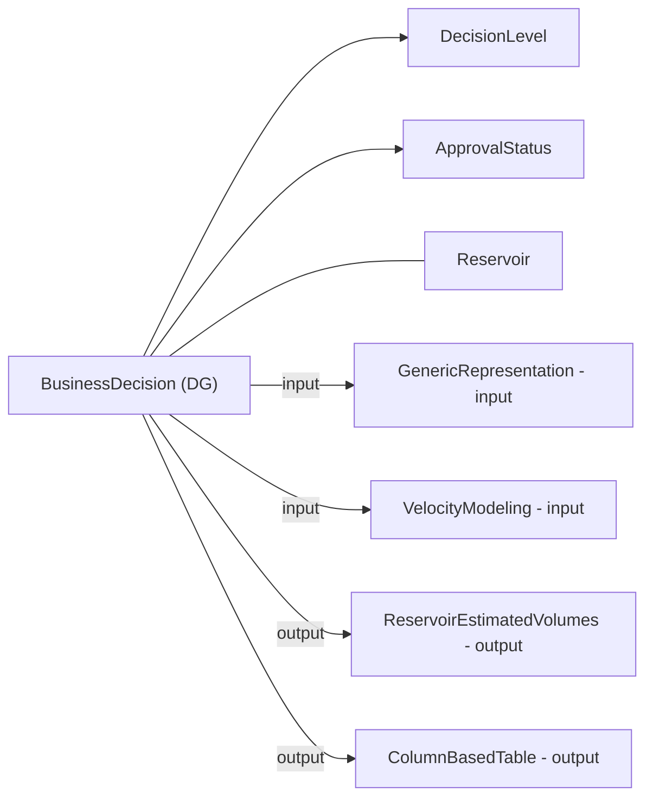
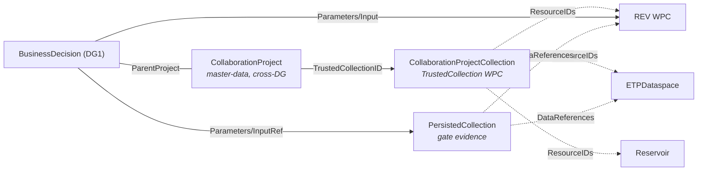

# OSDU Decision Gates with `BusinessDecision` - Implementation Guide

> **Scope:** Model DG1…DG4 decisions as `osdu:wks:master-data--BusinessDecision:1.0.0` records, linking inputs and outputs using **activity parameters** and/or **persisted collections**. Use `CollaborationProject` as the cross-gate master-data namespace bridging System of Engagement (SoE) and System of Record (SoR). This guide summarizes options, pros/cons, and provides example payloads and diagrams.

---

## 1. What `BusinessDecision` is designed for

`BusinessDecision` records a technical/business decision and **inherits** `AbstractProjectActivity`, which provides the `Parameters[]` mechanism to express **inputs/outputs/context** relationships. It also defines typed properties for **DecisionLevel**, **ApprovalStatus**, **Risks**, and **Risk documents**.

- Schema: [BusinessDecision.1.0.0](https://community.opengroup.org/osdu/data/data-definitions/-/blob/master/Authoring/master-data/BusinessDecision.1.0.0.json)
- Activity semantics: [AbstractProjectActivity](https://community.opengroup.org/osdu/data/data-definitions/-/blob/master/E-R/abstract/AbstractProjectActivity.1.2.0.md)
- Decision catalogs: [DecisionLevel.1.0.0](https://community.opengroup.org/osdu/data/data-definitions/-/blob/master/E-R/reference-data/DecisionLevel.1.0.0.md), [DecisionApprovalStatus.1.0.0](https://community.opengroup.org/osdu/data/data-definitions/-/blob/master/Examples/reference-data/DecisionApprovalStatus.1.0.0.json)

---

## 2. Ways to link master-data and WPCs to a decision gate

Four complementary patterns - mix as needed:

### A) `Parameters[]` (from `AbstractProjectActivity`)

Declare **inputs**, **outputs**, and **context** objects with rich metadata (role, selection note, keys).

**Pros**: Semantically precise, template-friendly, supports multiple values and keys.
**Cons**: Nested arrays make queries heavier; requires consistent conventions.

### B) Explicit `BusinessDecision` relationships

Built-in properties: `DecisionLevelID`, `ApprovalStatusID`, `RiskIDs`, `RiskAssessmentDocument`, `PriorActivityIDs`.

**Pros**: Strong validation; easy filtering (e.g., "Approved DG2").
**Cons**: Not meant to enumerate full input/output sets.

### C) CollaborationProject - Cross-DG Namespace (SoE ↔ SoR bridge)

A `master-data--CollaborationProject` record provides a **persistent identity** that outlives any single decision gate. It acts as a contextualising namespace:

- **SoE side** - teams collaborate on work-in-progress iterations (geomodels, volumes, parameters)
- **SoR side** - a `CollaborationProjectCollection` WPC accumulates curated, trusted references across gates
- **Lifecycle** - the CP begins at DG1 and persists through DG2, DG3, FID; its `ActivityStates[]` track the cross-gate timeline
- **ParentProjectID** - links back to the originating `BusinessDecision`

The CP's `Parameters[]` reference the same data objects as the BD, but scoped for the ongoing collaboration rather than a single gate vote.

**Pros**: Stable master-data identity across gates; clean SoE/SoR separation; TrustedCollection grows incrementally.
**Cons**: Additional record to maintain; relationship to BD needs clear convention.

### D) PersistedCollection - Gate Evidence Package

Bundle WPCs into a **versioned evidence set** for a specific gate and reference it from the BD.

- `PersistedCollection` - curated evidence set: [ER doc](https://community.opengroup.org/osdu/data/data-definitions/-/blob/master/E-R/work-product-component/PersistedCollection.1.0.0.md)

**Pros**: One ID represents the gate package; simpler governance.
**Cons**: WPC, not master-data - scoped to one gate; still uses `Parameters[]` for role semantics.

> **CP vs PersistedCollection**: CP is master-data (long-lived, cross-DG); PersistedCollection is a WPC (versioned, gate-scoped). CP's TrustedCollection references accumulate over time; a PersistedCollection snapshots one gate's evidence.

### E) Rely on WPC→master-data links

Many WPCs natively reference reservoir entities (e.g., `ReservoirEstimatedVolumes` → `Reservoir`). Navigate via WPC without duplicating relationships.

---

## 3. Recommended pattern for DG1…DG4

1. **One `BusinessDecision` per gate**: set `DecisionLevelID`, `ApprovalStatusID`, dates, owners, summary.
2. **One `CollaborationProject` per modelling discipline**: persists across gates as the SoE↔SoR namespace. Its `TrustedCollectionID` points to a `CollaborationProjectCollection` WPC that accumulates curated references.
3. **Anchor the primary artifact** via `PriorActivityIDs`.
4. **List inputs and outputs** in `Parameters[]` with `ParameterRole` = `input`/`output`/`context`.
5. **Package gate evidence** into a `PersistedCollection` (DG2+).
6. **Risks & docs**: link via `RiskIDs` and `RiskAssessmentDocument`.

**Cross-DG lifecycle:**


**Typical kinds at decision gates:**
- Inputs: `Well`, `GenericRepresentation`, `VelocityModeling`, `ColumnBasedTable`, `ProductionValues`
- Outputs: `GenericRepresentation`, `ReservoirEstimatedVolumes`, `ColumnBasedTable`

---

## 4. Mermaid diagrams

### 4.1 DG modeled with `Parameters[]`


### 4.2 DG with CollaborationProject and persisted collection


---

## 5. Example payload

### `BusinessDecision` with `Parameters[]`
```json
{
  "kind": "osdu:wks:master-data--BusinessDecision:1.0.0",
  "data": {
    "Name": "Project X - Decision Gate 2",
    "DecisionLevelID": "osdu:reference-data--DecisionLevel:DG2:1.0.0",
    "ApprovalStatusID": "osdu:reference-data--DecisionApprovalStatus:Approved:1.0.0",
    "DecisionDate": "2025-12-10",
    "DecisionSummary": "Approve concept select based on aggregated segment volumes.",
    "RiskAssessmentDocument": "dev:work-product-component--Document:RiskAssessment_DG2:1",
    "RiskIDs": [ "dev:master-data--Risk:DepthConversionTopReservoir:1" ],
    "PriorActivityIDs": [ "dev:work-product-component--ReservoirEstimatedVolumes:<uuid>:1" ],
    "Parameters": [
      {
        "Title": "Volumes WPC",
        "ParameterRole": "input",
        "ObjectParameterKey": "dev:work-product-component--ReservoirEstimatedVolumes:<uuid>:1"
      },
      {
        "Title": "Velocity model",
        "ParameterRole": "input",
        "ObjectParameterKey": "dev:work-product-component--VelocityModeling:<uuid>:1"
      },
      {
        "Title": "Output map",
        "ParameterRole": "output",
        "ObjectParameterKey": "dev:work-product-component--GenericRepresentation:<uuid>:1"
      },
      {
        "Title": "Context Reservoir",
        "ParameterRole": "context",
        "ObjectParameterKey": "dev:master-data--Reservoir:<uuid>:1"
      }
    ]
  }
}
```

---

## 6. Choosing between patterns

| Pattern | Best for | Identity | Lifecycle |
|---|---|---|---|
| `Parameters[]` | Precise workflow/provenance per gate | Embedded in BD | Per gate |
| `CollaborationProject` (master-data) | Cross-DG namespace, SoE↔SoR bridge | Own master-data record | Persists across gates |
| `CollaborationProjectCollection` (WPC) | Accumulating trusted SoR references | WPC linked from CP | Grows per gate |
| `PersistedCollection` (WPC) | Gate-scoped evidence snapshot | WPC linked from BD | Per gate |
| Explicit BD fields | Gate filters & governance | Built-in properties | Per gate |

**Recommendation:** Use **all three layers**:
- `BusinessDecision` per gate (with `Parameters[]` for inputs/outputs)
- `CollaborationProject` as the long-lived namespace (with `TrustedCollectionID` → growing SoR)
- `PersistedCollection` per gate (DG2+) for evidence snapshots

---

## 7. References

- `BusinessDecision` schema: [Community examples](https://community.opengroup.org/osdu/data/data-definitions/-/blob/master/Examples/master-data/BusinessDecision.1.0.0.json)
- `CollaborationProject` schema: [ER doc](https://community.opengroup.org/osdu/data/data-definitions/-/blob/master/E-R/master-data/CollaborationProject.1.0.0.md)
- `CollaborationProjectCollection` schema: [ER doc](https://community.opengroup.org/osdu/data/data-definitions/-/blob/master/E-R/work-product-component/CollaborationProjectCollection.1.0.0.md)
- `AbstractProjectActivity`: [ER doc](https://community.opengroup.org/osdu/data/data-definitions/-/blob/master/E-R/abstract/AbstractProjectActivity.1.2.0.md)
- Decision catalogs: [DecisionLevel](https://community.opengroup.org/osdu/data/data-definitions/-/blob/master/E-R/reference-data/DecisionLevel.1.0.0.md)
- `PersistedCollection`: [ER doc](https://community.opengroup.org/osdu/data/data-definitions/-/blob/master/E-R/work-product-component/PersistedCollection.1.0.0.md)

---

## 8. Related guides

- [Volumes](/howto/volumes) - ReservoirEstimatedVolumes WPC, raw vs aggregated
- [Uncertainty](/howto/uncertainty) - FMU ensemble inputs & outputs in OSDU, Activity provenance
- [Risk](/howto/risk) - Risk master-data, mitigation documents, risk catalogs
- [Drogon Demo](/howto/bd-demo) - DG package data model guide with full entity-relationship view
