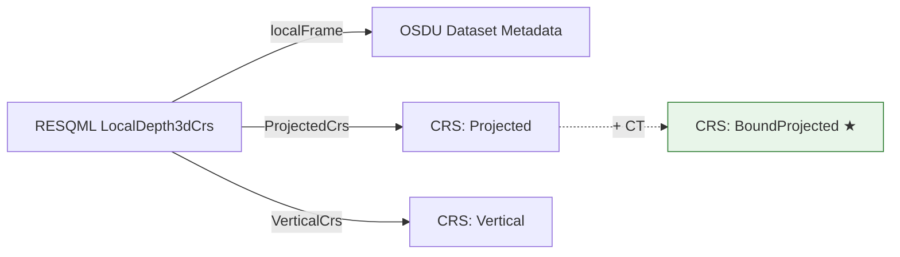

# RESQML / RDDMS ⇄ OSDU CRS Mapping Guide

Practical mapping between **RESQML 2.0.1 / 2.2** CRS usage (as stored in **RDDMS**) and **OSDU** CRS best practice.  
Key takeaway: **OSDU prefers Bound CRS** - a projected CRS pinned to an explicit datum transformation.

---

## 1) How CRS works in RESQML (the RDDMS model)

RESQML uses a two-level design:

| Level | Object | What it holds |
|-------|--------|---------------|
| **Global** | Projected 2D CRS | Geodetic reference for the whole dataspace/EPC (e.g. EPSG:23031 ED50/UTM 31N). One per dataspace. |
| **Local** | `LocalDepth3dCrs` or `LocalTime3dCrs` | XY/Z offsets, areal rotation, axis order, units, Z direction. References the global Projected CRS + a Vertical CRS. |

Every geometry object (grids, surfaces, point sets) references a **Local 3D CRS**, which in turn references the global CRS. This keeps coordinates numerically stable in a local frame while preserving full geodetic traceability.

**RESQML 2.0.1 vs 2.2** - CRS semantics are identical. 2.2 uses EnergyML Common v2.3 (JSON support, better WKT handling) but the local/global split and CRS identification are unchanged.

**CRS identification forms** (EnergyML Common):

| Form | Projected class | Vertical class | When to use |
|------|----------------|----------------|-------------|
| EPSG | `ProjectedEpsgCrs` | `VerticalEpsgCrs` | **Preferred** - well-known code |
| WKT | `ProjectedWktCrs` | `VerticalWktCrs` | Custom or non-EPSG definitions |
| GML | `ProjectedGmlCrs` | `VerticalGmlCrs` | Rare; ISO GML encoding |
| LocalAuthority | `ProjectedLocalAuthorityCrs` | `VerticalLocalAuthorityCrs` | Operator-specific (e.g. NPD codes) |
| Unknown | `ProjectedUnknownCrs` | `VerticalUnknownCrs` | Legacy; axis/units must be on local CRS |

---

## 2) How CRS works in OSDU (the target model)

OSDU stores CRS as **reference-data records**. Three kinds matter:

| OSDU CRS kind | ID pattern | Purpose |
|---------------|------------|---------|
| **Projected** | `...:Projected:EPSG::25832` | 2D projected system |
| **Vertical** | `...:Vertical:EPSG::5714` | Vertical datum |
| **BoundProjected** | `...:BoundProjected:EPSG::23031_EPSG::1612` | Projected CRS + explicit datum transformation (CT) |

**OSDU best practice → use BoundProjected CRS.** A Bound CRS removes datum-shift ambiguity by coupling the base projected CRS with a specific Coordinate Transformation (CT). The CRS Convert v3 service consumes these IDs directly.

> **Key difference from RESQML**: OSDU CRS records are pure reference. All local-frame parameters (offsets, rotation, axis order, units, Z direction) belong to the **dataset metadata**, not the CRS record.



---

## 3) The mapping - RESQML/RDDMS → OSDU

### 3.1 Core mapping rules

| RESQML source | Maps to in OSDU | Notes |
|---------------|-----------------|-------|
| `LocalDepth3dCrs` / `LocalTime3dCrs` | **Dataset metadata → `localFrame`** | Offsets, rotation, axis order, units, Z direction - all stay with the data |
| `ProjectedCrs` (EPSG code) | CRS record `Projected:EPSG::<code>` | Direct 1:1 - but consider if Bound CRS is more appropriate |
| `ProjectedCrs` (WKT/GML/LocalAuthority) | CRS record `Projected:LocalAuthority::<code>` | Register in CRS Catalog with definition |
| `VerticalCrs` (EPSG code) | CRS record `Vertical:EPSG::<code>` | Direct 1:1 |
| `VerticalCrs` (Unknown) | `verticalCRSID: null` | Keep uom/direction in `localFrame` |
| Projected + known datum shift | **CRS record `BoundProjected:EPSG::<proj>_EPSG::<ct>`** | **★ Recommended OSDU path** |

### 3.2 Bound CRS - the OSDU recommended approach

RESQML has no explicit Bound CRS class. The datum transformation is either:
- Embedded in a WKT `TOWGS84[...]` clause, or
- Implied by context (e.g. ED50 with a known regional shift)

In OSDU you make this **explicit** by creating or referencing a **BoundProjected** CRS record:

```
Base CRS :  EPSG:23031  (ED50 / UTM 31N)
CT       :  EPSG:1612   (ED50 → WGS84, 7-param)
OSDU ID  :  ...:BoundProjected:EPSG::23031_EPSG::1612
```

This is the preferred approach for any legacy or regional CRS where the datum shift matters. CRS Convert v3 uses this ID to perform unambiguous transformations.

> **When you don't need Bound CRS**: ETRS89-based data (EPSG:25831–25836) is already WGS84-aligned - a plain Projected CRS is sufficient.

### 3.3 OSDU dataset metadata structure

```json
{
  "coordinateReferenceSystemID": "opendes:reference-data--CoordinateReferenceSystem:BoundProjected:EPSG::23031_EPSG::1612",
  "verticalCRSID": "opendes:reference-data--CoordinateReferenceSystem:Vertical:EPSG::5714",
  "localFrame": {
    "xOffset": 420000.0,
    "yOffset": 6470000.0,
    "zOffset": 0.0,
    "arealRotation": 0.0,
    "projectedAxisOrder": "easting northing",
    "uomXY": "m",
    "uomZ": "m",
    "zIncreasingDownward": true
  }
}
```

---

## 4) Examples - RESQML JSON (RDDMS) → OSDU

### 4.1 Typical NCS model - ETRS89, no datum shift needed

**RESQML (RDDMS)**
```json
{
  "$type": "resqml20.obj_LocalDepth3dCrs",
  "XOffset": 400000.0, "YOffset": 6500000.0, "ZOffset": 0.0,
  "ArealRotation": 0.0,
  "ProjectedAxisOrder": "easting northing",
  "ProjectedUom": "m", "VerticalUom": "m",
  "ZIncreasingDownward": true,
  "ProjectedCrs": { "ProjectedEpsgCrs": 25832 },
  "VerticalCrs": { "VerticalUnknownCrs": {} }
}
```

**OSDU** - plain Projected is enough (ETRS89 ≈ WGS84)
```json
{
  "coordinateReferenceSystemID": "opendes:reference-data--CoordinateReferenceSystem:Projected:EPSG::25832",
  "verticalCRSID": null,
  "localFrame": {
    "xOffset": 400000.0, "yOffset": 6500000.0, "zOffset": 0.0,
    "arealRotation": 0.0, "projectedAxisOrder": "easting northing",
    "uomXY": "m", "uomZ": "m", "zIncreasingDownward": true
  }
}
```

### 4.2 Legacy ED50 model - needs Bound CRS

**RESQML (RDDMS)** - WKT with TOWGS84
```json
{
  "$type": "resqml20.obj_LocalDepth3dCrs",
  "ProjectedCrs": {
    "ProjectedWktCrs": "PROJCS[\"UTM Zone 31N\", GEOGCS[\"ED50\", DATUM[\"ED50\", SPHEROID[\"International 1924\",6378388,297], TOWGS84[-87,-98,-121,0,0,0,0]], ...]]"
  },
  "VerticalCrs": { "VerticalUnknownCrs": {} }
}
```

**OSDU** - use BoundProjected (extract TOWGS84 → match EPSG CT)
```json
{
  "coordinateReferenceSystemID": "opendes:reference-data--CoordinateReferenceSystem:BoundProjected:EPSG::23031_EPSG::1612",
  "verticalCRSID": null,
  "localFrame": { "..." }
}
```

### 4.3 Full CRS pair - projected + vertical (both EPSG)

**RESQML (RDDMS)**
```json
{
  "$type": "resqml20.obj_LocalDepth3dCrs",
  "XOffset": 420000.0, "YOffset": 6470000.0, "ZOffset": 0.0,
  "ArealRotation": { "_": 0, "$type": "eml20.PlaneAngleMeasure", "Uom": "rad" },
  "ProjectedCrs": { "$type": "eml20.ProjectedCrsEpsgCode", "EpsgCode": 23031 },
  "VerticalCrs": { "$type": "eml20.VerticalCrsEpsgCode", "EpsgCode": 6230 }
}
```

**OSDU** - BoundProjected for ED50, plus vertical
```json
{
  "coordinateReferenceSystemID": "opendes:reference-data--CoordinateReferenceSystem:BoundProjected:EPSG::23031_EPSG::1612",
  "verticalCRSID": "opendes:reference-data--CoordinateReferenceSystem:Vertical:EPSG::6230",
  "localFrame": {
    "xOffset": 420000.0, "yOffset": 6470000.0, "zOffset": 0.0,
    "arealRotation": 0.0, "projectedAxisOrder": "easting northing",
    "uomXY": "m", "uomZ": "m", "zIncreasingDownward": true
  }
}
```

> **Unit note**: `ArealRotation` in RESQML can be a measure with unit (rad/deg); OSDU `arealRotation` is unitless in **radians**.

### 4.4 Non-EPSG / operator CRS

If RESQML uses `ProjectedLocalAuthorityCrs` or `ProjectedWktCrs` with no EPSG equivalent:

1. Register a CRS record in OSDU CRS Catalog as `Projected:LocalAuthority::<your-code>`
2. Include the WKT definition in the record
3. Reference that ID in dataset metadata

```json
{
  "id": "opendes:reference-data--CoordinateReferenceSystem:Projected:LocalAuthority::NPD-BaS-32",
  "data": {
    "definition": { "format": "WKT2", "wkt": "PROJCRS[...]" },
    "authority": { "name": "LocalAuthority", "code": "NPD-BaS-32" }
  }
}
```

---

## 5) Ingestion workflow - RDDMS dataspace → OSDU

```
1. Read LocalDepth3dCrs / LocalTime3dCrs from RDDMS dataspace
2. Extract: ProjectedCrs code/WKT, VerticalCrs code/WKT, local frame params
3. Resolve CRS:
   ├─ EPSG projected → check if datum shift needed
   │   ├─ ETRS89-based (25831–25836) → Projected CRS is enough
   │   └─ ED50/WGS72/other → BoundProjected with CT
   ├─ WKT with TOWGS84 → extract shift → match EPSG CT → BoundProjected
   └─ LocalAuthority/Unknown → register in CRS Catalog
4. Build OSDU metadata: coordinateReferenceSystemID, verticalCRSID, localFrame
5. Convert if needed → CRS Convert v3 with record IDs
```

---

## 6) Common NCS CRS mappings (quick reference)

| RESQML CRS | Typical usage | OSDU CRS ID | Bound? |
|-------------|---------------|-------------|--------|
| EPSG:25831 | ETRS89 / UTM 31N | `Projected:EPSG::25831` | No |
| EPSG:25832 | ETRS89 / UTM 32N | `Projected:EPSG::25832` | No |
| EPSG:23031 | ED50 / UTM 31N | `BoundProjected:EPSG::23031_EPSG::1612` | **Yes** |
| EPSG:23032 | ED50 / UTM 32N | `BoundProjected:EPSG::23032_EPSG::1612` | **Yes** |
| EPSG:5714 | MSL height (Norway) | `Vertical:EPSG::5714` | - |
| EPSG:6230 | ED50 ellipsoidal height | `Vertical:EPSG::6230` | - |
| WKT ED50 + TOWGS84 | Legacy WKT | → map to BoundProjected | **Yes** |
| Unknown vertical | Old models | `verticalCRSID: null` | - |

---

## 7) Pitfalls

| Issue | Consequence | Prevention |
|-------|-------------|------------|
| Missing datum shift (plain Projected instead of Bound) | Coordinates off by 50–200 m for ED50 | Always use BoundProjected for non-ETRS89 data |
| Axis order mismatch (EN vs NE) | X/Y swapped | Check `ProjectedAxisOrder`; normalize to `easting northing` |
| Z direction ambiguity | Depths inverted | Preserve `ZIncreasingDownward` in localFrame |
| Multiple projected CRSs in one dataspace | Undefined local frames | One projected CRS per RDDMS dataspace |
| Local frame in CRS record | OSDU rejects or misinterprets | Offsets/rotation go in dataset metadata only |
| `ArealRotation` unit mismatch | Rotation wrong | RESQML may use deg or rad; OSDU expects rad |

---

## 8) References

- [RESQML CRS overview][r-crs] - one-projected-2D-CRS-per-dataspace rule
- [AbstractLocal3dCrs attributes][r-abs] - offsets, rotation, axis order, Z
- [EnergyML Common CRS classes][c-crs] - EPSG/GML/WKT/LocalAuthority/Unknown
- [RESQML 2.2 overview][r-22] - Common v2.3, JSON support
- [OSDU CRS Catalog service][os-cat] - register & search CRS/CT records
- [OSDU CRS Convert v3][os-conv] - transformation using record IDs (Apache SIS)
- [OSDU ADR: dynamic CRS/CT][os-adr] - BoundProjected pattern
- [resqpy CRS tutorial][rq-tut] - practical Python examples

[r-crs]: https://docs.energistics.org/RESQML/RESQML_TOPICS/RESQML-000-066-0-C-sv2010.html
[r-abs]: https://docs.energistics.org/RESQML/RESQML_TOPICS/RESQML-500-010-0-R-sv2010.html
[c-crs]: https://docs.energistics.org/COM/COM_TOPICS/COM-000-106-0-R-sv2100.html
[r-22]: https://energistics.org/resqml-developers-users
[os-cat]: https://community.opengroup.org/osdu/platform/system/reference/crs-catalog-service
[os-conv]: https://community.opengroup.org/osdu/platform/system/reference/crs-conversion-service/-/blob/0b2c76d50eb32302f70ce870a82d54f8d43228d8/docs/v3/tutorial/CRS_Convert_Service_howto.md
[os-adr]: https://community.opengroup.org/osdu/platform/system/home/-/issues/94
[rq-tut]: https://resqpy.readthedocs.io/en/latest/tutorial/working_with_coord.html
