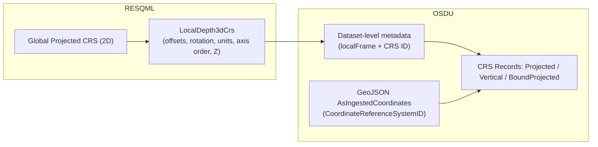
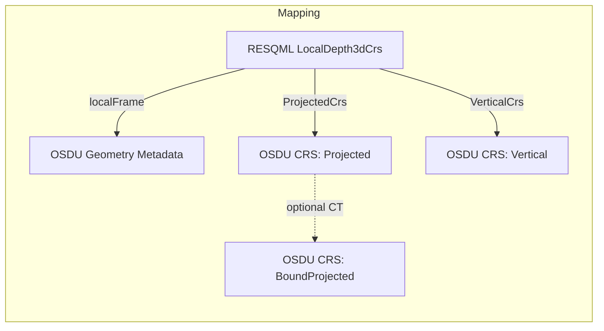

# RESQML 2.0.1 / 2.2 ⇄ OSDU CRS — Conceptual & Technical Guide

## Table of Contents
- [RESQML 2.0.1 / 2.2 ⇄ OSDU CRS — Conceptual \& Technical Guide](#resqml201--22--osdu-crs--conceptual--technical-guide)
  - [Table of Contents](#table-of-contents)
  - [1) CRS in RESQML 2.x — Conceptual model](#1-crs-in-resqml-2x--conceptual-model)
  - [2) Local vs Global CRS — how they combine](#2-local-vs-global-crs--how-they-combine)
  - [3) EnergyML Common CRS forms (what you’ll see in files \& bindings)](#3-energyml-common-crs-forms-what-youll-see-in-files--bindings)
  - [4) OSDU model — reference CRSs + services](#4-osdu-model--reference-crss--services)
  - [5) Type‑by‑type mapping (RESQML ⇄ OSDU) — background + rules](#5-typebytype-mapping-resqmlosdu--background--rules)
  - [6) Examples by CRS Type (RESQML JSON vs OSDU schema)](#6-examples-by-crs-type-resqml-json-vs-osdu-schema)
    - [Examples by CRS Type](#examples-by-crs-type)
    - [6.1 Local 3D CRS (Depth, EPSG Projected + Unknown Vertical) — RESQML JSON vs OSDU schema](#61-local-3d-crs-depth-epsg-projected--unknown-vertical--resqml-json-vs-osdu-schema)
    - [6.2 Local 3D CRS (Time, EPSG Projected + Unknown Vertical) — RESQML JSON vs OSDU schema](#62-local-3d-crs-time-epsg-projected--unknown-vertical--resqml-json-vs-osdu-schema)
    - [6.3 Vertical CRS (EPSG) — RESQML JSON vs OSDU schema](#63-vertical-crs-epsg--resqml-json-vs-osdu-schema)
    - [6.4 Bound CRS (EPSG base + CT) — RESQML JSON vs OSDU schema](#64-bound-crs-epsg-base--ct--resqml-json-vs-osdu-schema)
    - [6.5 Non‑EPSG (WKT Projected + WKT Vertical) — RESQML JSON vs OSDU schema](#65-nonepsg-wkt-projected--wkt-vertical--resqml-json-vs-osdu-schema)
    - [6.6 LocalAuthority (Projected) — RESQML JSON vs OSDU schema](#66-localauthority-projected--resqml-json-vs-osdu-schema)
    - [6.7 Non‑EPSG (ED50/UTM31N WKT1) — RESQML JSON (Open‑ETP‑Client) vs OSDU schema](#67-nonepsg-ed50utm31n-wkt1--resqml-json-openetpclient-vs-osdu-schema)
    - [6.8 EPSG Projected + EPSG Vertical, with Representation referencing Local CRS — RESQML JSON vs OSDU schema (Working example)](#68-epsg-projected--epsg-vertical-with-representation-referencing-local-crs--resqml-json-vs-osdu-schema-working-example)
  - [7) Bound CRSs \& Coordinate Transformations](#7-bound-crss--coordinate-transformations)
  - [8) Coordinate system references — how to map (EPSG, GML, WKT, LocalAuthority, Unknown)](#8-coordinate-system-references--how-to-map-epsg-gml-wkt-localauthority-unknown)
  - [9) Ingestion workflow RESQML Dataspace (or EPC) → OSDU — recommended](#9-ingestion-workflow-resqml-dataspace-or-epc--osdu--recommended)
  - [10) Pitfalls, ambiguities \& tests](#10-pitfalls-ambiguities--tests)
  - [11) References](#11-references)


--- 


**Purpose and scope.** A how‑to for using Coordinate Reference Systems (CRS) in **RESQML 2.x** and mapping them to **OSDU** reference data and services. Includes side‑by‑side mapping, local vs global usage, Bound CRS & transformations, examples, diagrams, workflows, pitfalls, validation, and migration tips.
This guide synthesizes publicly available Energistics documentation (RESQML 2.0.1 & 2.2 and EnergyML Common), practical tutorials (resqpy), and OSDU CRS Catalog/Convert v3 docs and ADRs. (See: [RESQML CRS overview][r-crs] · [AbstractLocal3dCrs attributes][r-abs] · [Common v2.1/2.3 CRS classes][c-crs] [c-axis] · [RESQML 2.2 overview][r-22] · [OSDU CRS Catalog][os-cat] · [OSDU Convert v3][os-conv] · [OSDU ADR dynamic CRS/CT][os-adr] · [resqpy tutorial][rq-tut] · [OSDU ref‑data issue][os-issue]).

---

## 1) CRS in RESQML 2.x — Conceptual model

**Two‑level design.** A RESQML package carries **one global projected 2D CRS** and **one or more local 3D CRSs** that every geometry object must reference. Local CRSs are defined by **XY translation (offset)**, optional **areal rotation**, **axis order**, **units**, and **Z orientation** (depth/elevation or time) and they reference the projected 2D CRS and a vertical 1D CRS. This model ensures geodetic rigor while allowing numerically stable local frames.  
*Evidence:* Energistics explicitly mandates **one projected 2D CRS per Dataspace (recommended) or RESQML EPC file**, requires **at least one local 3D CRS**, and details local attributes on `AbstractLocal3dCrs`.  
[citations: [r-crs], [r-abs]]

**Reference forms.** The referenced projected/vertical CRS can be identified as **EPSG**, **GML**, **WKT (ISO 19162)**, **LocalAuthority**, or **Unknown**; axis order and vertical direction are standardized enumerations.  
[citations: [c-crs], [c-axis]]

**Version note.** RESQML 2.0.1 uses Common v2.0 (XML), whereas RESQML 2.2 uses Common v2.3, adds JSON schemas and adopts ETP 1.2. CRS semantics are unchanged, but interoperability around WKT/GML and packaging improves.  
[citations: [r-22], [r-201], [eo]]

---

## 2) Local vs Global CRS — how they combine

- **Global projected 2D CRS** (e.g., EPSG:25832 ETRS89/UTM 32N) georeferences the package.  
  *Only one per Dataspace (recommended) or EPC file.* [r-crs]
- **Local 3D CRS** per geometry adds: `XOffset`, `YOffset`, `ZOffset`, `ArealRotation`, `ProjectedAxisOrder`, `ProjectedUom`, `VerticalUom`, `ZIncreasingDownward`, plus references to **ProjectedCrs** and **VerticalCrs**.  
  *Local frames are Cartesian; projected axes must be orthogonal; vertical axis orthogonal to projected plane.* [r-abs]
- **Position composition (planar)**:

```text
Given local point (x_l, y_l) and areal rotation θ:  
X_global = X_offset +  x_l cosθ + y_l sinθ  
Y_global = Y_offset + -x_l sinθ + y_l cosθ
Z_global = Z_offset +  z_l   (respecting Z sign convention)
```

**Why local?** Local frames mitigate precision loss and simplify operations without redefining the global CRS; this is a standard geomodeling practice encoded by RESQML.  
[citations: [r-crs], [r-abs], [rq-tut]]



---

## 3) EnergyML Common CRS forms (what you’ll see in files & bindings)

| Family | Common class examples | Typical content | Notes |
|---|---|---|---|
| Projected | `ProjectedEpsgCrs`, `ProjectedGmlCrs`, `ProjectedWktCrs`, `ProjectedLocalAuthorityCrs`, `ProjectedUnknownCrs` | Code or full CRS def; axis order; units | Prefer EPSG; WKT/GML must be ISO 19162 compliant; Unknown requires explicit axis/uom on the local CRS. |  
| Vertical | `VerticalEpsgCrs`, `VerticalGmlCrs`, `VerticalWktCrs`, `VerticalLocalAuthorityCrs`, `VerticalUnknownCrs` | Code/definition; direction | Use EPSG where possible; else document direction & uom on local CRS. |

[citations: [c-crs], [c-axis]]

---

## 4) OSDU model — reference CRSs + services

- **CRS as reference‑data records** (kinds like `...CoordinateReferenceSystem:Projected|Vertical|BoundProjected|BoundGeographic2D`).  
- **CRS Catalog v3**: browse/search CRS/CT; **CRS Convert v3**: transforms using **CRS/CT record IDs**—no bulky embedded WKT. Engine: **Apache SIS**.  
[citations: [os-cat], [os-conv], [os-adr]]

> **Principle:** OSDU CRS records are **pure reference**. All **local frame** parameters from RESQML (offsets/rotation/axis order/units/Z sign) stay with the **geometry dataset metadata**, not in the CRS record.  
[citations: [r-abs], [os-conv]]



---

## 5) Type‑by‑type mapping (RESQML ⇄ OSDU) — background + rules

| Concept | RESQML element(s) | What it contains | OSDU artifact | Mapping & rationale |
|---|---|---|---|---|
| **Local 3D CRS (Depth)** | `LocalDepth3dCrs` (via `AbstractLocal3dCrs`) | `X/Y/Z` offsets, `ArealRotation`, `ProjectedAxisOrder`, `ProjectedUom`, `VerticalUom`, `ZIncreasingDownward`; references to **ProjectedCrs** and **VerticalCrs** | **No direct CRS record**; keep in **geometry metadata** | Local frame is *not* a CRS definition—preserve verbatim with the representation; reference projected/vertical CRSs separately. [r-abs], [r-crs] |
| **Local 3D CRS (Time)** | `LocalTime3dCrs` | As above, with Z=time | — | Same rule; use time uom; conversions concern plan view unless time transformations are needed. [r-crs] |
| **Global projected CRS** | `Projected*` (EPSG/GML/WKT/LocalAuthority/Unknown) | Definition/identifier of 2D CRS | `...CoordinateReferenceSystem:Projected:*` | **EPSG** → 1:1 OSDU ID; **GML/WKT** → publish record with identical definition. [c-crs], [os-cat] |
| **Vertical CRS** | `Vertical*` (EPSG/GML/WKT/LocalAuthority/Unknown) | Vertical datum/axis direction | `...CoordinateReferenceSystem:Vertical:*` | Prefer **EPSG**; else WKT/LocalAuthority record; for Unknown keep uom & direction on local frame. [c-crs], [c-axis] |
| **Bound CRS** | *(implicit in RESQML; not a separate class)* | Base CRS + specific **Coordinate Transformation** | `...CoordinateReferenceSystem:BoundProjected:EPSG::<base>_EPSG::<ct>` | Needed when datum shift choice affects results; OSDU treats as first‑class record and Convert v3 consumes the ID. [os-adr], [os-conv] |

**Why this mapping?** RESQML cleanly separates **reference CRSs** (Common objects) from **local frames** (offset/rotation/Z semantics). OSDU wants only *reference* information in CRS records and expects *local* frame to stay with the geometry—hence the split.  
[citations: [r-abs], [os-conv]]

---


## 6) Examples by CRS Type (RESQML JSON vs OSDU schema)

> **Serializer profile used for RESQML JSON:** All RESQML JSON snippets below follow the **Open‑ETP‑Client** `simpleJson()` style: keys are **PascalCase**, Energistics handler keys are removed, and `xsi:type` (if present) is mapped to **`$type`** with domain qualifiers like `resqml20.obj_…` or `eml20.…`. The **OSDU** side shows the corresponding **schema objects** (reference‑data CRS records and/or dataset metadata).  

### Examples by CRS Type

| Example # | CRS Type / Scenario                                | RESQML Class(es)                  | OSDU Artifact(s)                                  |
|-----------|----------------------------------------------------|-----------------------------------|---------------------------------------------------|
| **6.1**   | Local 3D CRS (Depth) + EPSG Projected             | `LocalDepth3dCrs`                | Dataset metadata (`localFrame`) + Projected CRS ID |
| **6.2**   | Local 3D CRS (Time) + EPSG Projected              | `LocalTime3dCrs`                 | Dataset metadata (`localFrame`) + Projected CRS ID |
| **6.3**   | Vertical CRS (EPSG)                               | `VerticalEpsgCrs`                | OSDU CRS record (Vertical)                       |
| **6.4**   | Bound CRS (EPSG base + CT)                        | *(implicit in RESQML)*           | OSDU CRS record (BoundProjected) + dataset metadata |
| **6.5**   | Non-EPSG (WKT Projected + WKT Vertical)           | `LocalDepth3dCrs` + WKT CRS refs | OSDU CRS records (LocalAuthority + WKT) + dataset metadata |
| **6.6**   | LocalAuthority (Projected)                        | `LocalDepth3dCrs` + LocalAuthority| OSDU CRS record (LocalAuthority) + dataset metadata |
| **6.7**   | Non-EPSG ED50/UTM31N (WKT1)                       | `LocalDepth3dCrs`                | OSDU CRS record (LocalAuthority + WKT1) + dataset metadata |
| **6.8**   | EPSG Projected + EPSG Vertical + Representation   | `LocalDepth3dCrs` + `PointSetRepresentation` | OSDU CRS records (Projected + Vertical) + dataset metadata |

---

### 6.1 Local 3D CRS (Depth, EPSG Projected + Unknown Vertical) — RESQML JSON vs OSDU schema
**RESQML JSON (Open‑ETP‑Client style)**
```json
{
  "$type": "resqml20.obj_LocalDepth3dCrs",
  "XOffset": 400000.0,
  "YOffset": 6500000.0,
  "ZOffset": 0.0,
  "ArealRotation": 0.0,
  "ProjectedAxisOrder": "easting northing",
  "ProjectedUom": "m",
  "VerticalUom": "m",
  "ZIncreasingDownward": true,
  "ProjectedCrs": { "ProjectedEpsgCrs": 25832 },
  "VerticalCrs": { "VerticalUnknownCrs": {} }
}
```
**OSDU dataset metadata**
```json
{
  "coordinateReferenceSystemID": "opendes:reference-data--CoordinateReferenceSystem:Projected:EPSG::25832",
  "verticalCRSID": null,
  "localFrame": {
    "xOffset": 400000.0,
    "yOffset": 6500000.0,
    "zOffset": 0.0,
    "arealRotation": 0.0,
    "projectedAxisOrder": "easting northing",
    "uomXY": "m",
    "uomZ": "m",
    "zIncreasingDownward": true
  }
}
```

---

### 6.2 Local 3D CRS (Time, EPSG Projected + Unknown Vertical) — RESQML JSON vs OSDU schema
**RESQML JSON**
```json
{
  "$type": "resqml20.obj_LocalTime3dCrs",
  "XOffset": 400000.0,
  "YOffset": 6500000.0,
  "ZOffset": 0.0,
  "ArealRotation": 0.0,
  "ProjectedAxisOrder": "easting northing",
  "ProjectedUom": "m",
  "VerticalUom": "ms",
  "ZIncreasingDownward": true,
  "ProjectedCrs": { "ProjectedEpsgCrs": 25832 },
  "VerticalCrs": { "VerticalUnknownCrs": {} }
}
```
**OSDU dataset metadata**
```json
{
  "coordinateReferenceSystemID": "opendes:reference-data--CoordinateReferenceSystem:Projected:EPSG::25832",
  "verticalCRSID": null,
  "localFrame": {
    "xOffset": 400000.0,
    "yOffset": 6500000.0,
    "zOffset": 0.0,
    "arealRotation": 0.0,
    "projectedAxisOrder": "easting northing",
    "uomXY": "m",
    "uomZ": "ms",
    "zIncreasingDownward": true
  }
}
```

---

### 6.3 Vertical CRS (EPSG) — RESQML JSON vs OSDU schema
**RESQML JSON (vertical only)**
```json
{
  "$type": "eml20.VerticalEpsgCrs",
  "VerticalEpsgCrs": 5700
}
```
**OSDU reference‑data record (Vertical)**
```json
{
  "id": "opendes:reference-data--CoordinateReferenceSystem:Vertical:EPSG::5700",
  "kind": "opendes:reference-data--CoordinateReferenceSystem:Vertical:1.0.0",
  "data": {
    "displayName": "MSL height",
    "authority": { "name": "EPSG", "code": "5700" }
  }
}
```

---

### 6.4 Bound CRS (EPSG base + CT) — RESQML JSON vs OSDU schema
> RESQML has no separate Bound CRS class; boundness is an OSDU reference‑data concept (base CRS + explicit transformation).  
**OSDU dataset metadata (using BoundProjected ID)**
```json
{
  "coordinateReferenceSystemID": "opendes:reference-data--CoordinateReferenceSystem:BoundProjected:EPSG::23032_EPSG::1612",
  "verticalCRSID": null,
  "localFrame": {
    "xOffset": 400000.0,
    "yOffset": 6500000.0,
    "zOffset": 0.0,
    "arealRotation": 0.0,
    "projectedAxisOrder": "easting northing",
    "uomXY": "m",
    "uomZ": "m",
    "zIncreasingDownward": true
  }
}
```

---

### 6.5 Non‑EPSG (WKT Projected + WKT Vertical) — RESQML JSON vs OSDU schema
**RESQML JSON**
```json
{
  "$type": "resqml20.obj_LocalDepth3dCrs",
  "XOffset": 402000.0,
  "YOffset": 6498000.0,
  "ZOffset": 0.0,
  "ArealRotation": 0.0,
  "ProjectedAxisOrder": "easting northing",
  "ProjectedUom": "m",
  "VerticalUom": "m",
  "ZIncreasingDownward": true,
  "ProjectedCrs": {
    "ProjectedWktCrs": "PROJCRS[\"MC-TM32\",BASEGEOGCRS[\"ETRS89\"],CONVERSION[...],CS[Cartesian,2],AXIS[\"E\",east],AXIS[\"N\",north],LENGTHUNIT[\"metre\",1]]"
  },
  "VerticalCrs": {
    "VerticalWktCrs": "VERTCRS[\"MC-MSL-2015\",VDATUM[\"Mean Sea Level (MC 2015)\"],CS[vertical,1],AXIS[\"H\",up],LENGTHUNIT[\"metre\",1]]"
  }
}
```
**OSDU CRS reference‑data records (LocalAuthority + WKT)**
```json
{
  "id": "opendes:reference-data--CoordinateReferenceSystem:Projected:LocalAuthority::MC-TM32",
  "kind": "opendes:reference-data--CoordinateReferenceSystem:Projected:1.0.0",
  "data": { "definition": { "format": "WKT2", "wkt": "PROJCRS[...]" }, "authority": { "name": "LocalAuthority", "code": "MC-TM32" } }
}
{
  "id": "opendes:reference-data--CoordinateReferenceSystem:Vertical:LocalAuthority::MC-MSL-2015",
  "kind": "opendes:reference-data--CoordinateReferenceSystem:Vertical:1.0.0",
  "data": { "definition": { "format": "WKT2", "wkt": "VERTCRS[...]" }, "authority": { "name": "LocalAuthority", "code": "MC-MSL-2015" } }
}
```
**OSDU dataset metadata**
```json
{
  "coordinateReferenceSystemID": "opendes:reference-data--CoordinateReferenceSystem:Projected:LocalAuthority::MC-TM32",
  "verticalCRSID": "opendes:reference-data--CoordinateReferenceSystem:Vertical:LocalAuthority::MC-MSL-2015",
  "localFrame": {
    "xOffset": 402000.0,
    "yOffset": 6498000.0,
    "zOffset": 0.0,
    "arealRotation": 0.0,
    "projectedAxisOrder": "easting northing",
    "uomXY": "m",
    "uomZ": "m",
    "zIncreasingDownward": true
  }
}
```

---

### 6.6 LocalAuthority (Projected) — RESQML JSON vs OSDU schema
**RESQML JSON**
```json
{
  "$type": "resqml20.obj_LocalDepth3dCrs",
  "XOffset": 500000.0,
  "YOffset": 6500000.0,
  "ZOffset": 0.0,
  "ArealRotation": 2.0,
  "ProjectedAxisOrder": "easting northing",
  "ProjectedUom": "m",
  "VerticalUom": "m",
  "ZIncreasingDownward": true,
  "ProjectedCrs": { "ProjectedLocalAuthorityCrs": { "CodeSpace": "NPD", "Code": "NPD-BaS-32" } },
  "VerticalCrs": { "VerticalUnknownCrs": {} }
}
```
**OSDU CRS record + dataset metadata**
```json
{
  "id": "opendes:reference-data--CoordinateReferenceSystem:Projected:LocalAuthority::NPD-BaS-32",
  "kind": "opendes:reference-data--CoordinateReferenceSystem:Projected:1.0.0",
  "data": { "definition": { "format": "WKT2", "wkt": "PROJCRS[... authoritative WKT ...]" }, "authority": { "name": "LocalAuthority", "code": "NPD-BaS-32" } }
}
```
```json
{
  "coordinateReferenceSystemID": "opendes:reference-data--CoordinateReferenceSystem:Projected:LocalAuthority::NPD-BaS-32",
  "verticalCRSID": null,
  "localFrame": {
    "xOffset": 500000.0,
    "yOffset": 6500000.0,
    "zOffset": 0.0,
    "arealRotation": 2.0,
    "projectedAxisOrder": "easting northing",
    "uomXY": "m",
    "uomZ": "m",
    "zIncreasingDownward": true
  }
}
```

---

### 6.7 Non‑EPSG (ED50/UTM31N WKT1) — RESQML JSON (Open‑ETP‑Client) vs OSDU schema
**RESQML JSON** *(from your uploaded XML, WKT1)*
```json
{
  "$type": "resqml20.obj_LocalDepth3dCrs",
  "XOffset": 0.0,
  "YOffset": 0.0,
  "ZOffset": 0.0,
  "ArealRotation": 0.0,
  "ProjectedAxisOrder": "easting northing",
  "ProjectedUom": "m",
  "VerticalUom": "m",
  "ZIncreasingDownward": true,
  "ProjectedCrs": {
    "ProjectedWktCrs": "PROJCS[\"UTM Zone 31, Northern Hemisphere\", GEOGCS[\"OW_European_Datum_1950\", DATUM[\"OW_European_Datum_1950\", SPHEROID[\"Spheroid\",6378388,297.0000000000014], TOWGS84[-87,-98,-121,0,0,0,0]], PRIMEM[\"Greenwich\",0], UNIT[\"degree\",0.0174532925199433]], PROJECTION[\"Transverse_Mercator\"], PARAMETER[\"latitude_of_origin\",0], PARAMETER[\"central_meridian\",3], PARAMETER[\"scale_factor\",0.9996], PARAMETER[\"false_easting\",500000], PARAMETER[\"false_northing\",0], UNIT[\"Meter\",1]]"
  },
  "VerticalCrs": { "VerticalUnknownCrs": {} }
}
```
**OSDU reference‑data (LocalAuthority + WKT) + dataset metadata**
```json
{
  "id": "opendes:reference-data--CoordinateReferenceSystem:Projected:LocalAuthority::ED50-UTM31N-TOWGS84-87_98_121",
  "kind": "opendes:reference-data--CoordinateReferenceSystem:Projected:1.0.0",
  "data": { "definition": { "format": "WKT1", "wkt": "PROJCS[...]" }, "authority": { "name": "LocalAuthority", "code": "ED50-UTM31N-TOWGS84-87_98_121" } }
}
```
```json
{
  "coordinateReferenceSystemID": "opendes:reference-data--CoordinateReferenceSystem:Projected:LocalAuthority::ED50-UTM31N-TOWGS84-87_98_121",
  "verticalCRSID": null,
  "localFrame": {
    "xOffset": 0.0,
    "yOffset": 0.0,
    "zOffset": 0.0,
    "arealRotation": 0.0,
    "projectedAxisOrder": "easting northing",
    "uomXY": "m",
    "uomZ": "m",
    "zIncreasingDownward": true
  }
}
```
> *Tip:* prefer **WKT2** where practicable when registering LocalAuthority CRS in CRS Catalog; keep WKT1 if your legacy reference explicitly requires it.

---

### 6.8 EPSG Projected + EPSG Vertical, with Representation referencing Local CRS — RESQML JSON vs OSDU schema (Working example)
**RESQML JSON — LocalDepth3dCrs**
```json
{
  "$type": "resqml20.obj_LocalDepth3dCrs",
  "Citation": { "Title": "CustomTestCrs", "Originator": "dalsaab", "Creation": "2021-09-02T07:57:28.000Z" },
  "XOffset": 420000.0,
  "YOffset": 6470000.0,
  "ZOffset": 0.0,
  "ArealRotation": { "_": 0, "$type": "eml20.PlaneAngleMeasure", "Uom": "rad" },
  "ProjectedAxisOrder": "easting northing",
  "ProjectedUom": "m",
  "VerticalUom": "m",
  "ZIncreasingDownward": true,
  "VerticalCrs": { "$type": "eml20.VerticalCrsEpsgCode", "EpsgCode": 6230 },
  "ProjectedCrs": { "$type": "eml20.ProjectedCrsEpsgCode", "EpsgCode": 23031 },
  "SchemaVersion": "2.0",
  "Uuid": "7c7d7987-b7b9-4215-9014-cb7d6fb62173"
}
```
**RESQML JSON — PointSetRepresentation referencing Local CRS**
```json
{
  "$type": "resqml20.obj_PointSetRepresentation",
  "Citation": { "$type": "eml20.Citation", "Title": "Pointset 1", "Originator": "user1" },
  "NodePatch": [
    {
      "PatchIndex": 0,
      "Count": 6,
      "Geometry": {
        "$type": "resqml20.PointGeometry",
        "LocalCrs": {
          "$type": "eml20.DataObjectReference",
          "ContentType": "application/x-resqml+xml;version=2.0;type=obj_LocalDepth3dCrs",
          "Title": "CustomTestCrs",
          "UUID": "7c7d7987-b7b9-4215-9014-cb7d6fb62173"
        },
        "Points": {
          "$type": "resqml20.Point3dHdf5Array",
          "Coordinates": {
            "$type": "eml20.Hdf5Dataset",
            "PathInHdfFile": "/RESQML/5d27775e-5c7f-4786-a048-9a303fa1165a/points_patch0",
            "HdfProxy": {
              "$type": "eml20.DataObjectReference",
              "ContentType": "application/x-resqml+xml;version=2.0;type=obj_EpcExternalPartReference",
              "UUID": "68f2a7d4-f7c1-4a75-95e9-3c6a7029fb23"
            }
          }
        }
      }
    }
  ],
  "SchemaVersion": "2.0.0.20140822",
  "Uuid": "5d27775e-5c7f-4786-a048-9a303fa1165a"
}
```
**OSDU reference‑data + dataset metadata**
```json
{
  "coordinateReferenceSystemID": "opendes:reference-data--CoordinateReferenceSystem:Projected:EPSG::23031",
  "verticalCRSID": "opendes:reference-data--CoordinateReferenceSystem:Vertical:EPSG::6230",
  "localFrame": {
    "xOffset": 420000.0,
    "yOffset": 6470000.0,
    "zOffset": 0.0,
    "arealRotation": 0.0,
    "projectedAxisOrder": "easting northing",
    "uomXY": "m",
    "uomZ": "m",
    "zIncreasingDownward": true
  }
}
```
> *Note:* `ArealRotation` in RESQML can be expressed as a **measure** with unit (here 0 **rad**); OSDU uses a unitless numeric **radians** convention for `arealRotation`. Keep this consistent during ingestion/egress.

---

*References:*  
- Open‑ETP‑Client (RESQML XML→JSON utilities & Typescript type checkers)  
- OSDU CRS Catalog Service tutorial (register/search CRS & CT records)  
- OSDU Data‑Definitions example `LocalModelCompoundCrs.1.2.0.json` (WPC pattern with localFrame + CRS IDs)


## 7) Bound CRSs & Coordinate Transformations

**Concept.** A Bound CRS explicitly couples a **base CRS** with a named **Coordinate Transformation (CT)** so the datum shift is unambiguous and reproducible.  
**RESQML 2.0.1 vs 2.2.** The local/global split and CRS references are the same; 2.2’s use of Common v2.3 and JSON support makes WKT/GML exchange more robust, but there is no semantic change to local/global CRS rules.  
**OSDU practice.** Use Bound CRS IDs when mapping legacy regional data (e.g., ED50→WGS84) and pass these IDs to **CRS Convert v3**.  
[citations: [r-22], [r-crs], [os-adr], [os-conv]]

**Example.**
```text
Base CRS : EPSG:23032 (ED50 / UTM 32N)  
CT       : EPSG:1612  (ED50 → WGS84 operation)  
OSDU ID  : ...CoordinateReferenceSystem:BoundProjected:EPSG::23032_EPSG::1612
```

---

## 8) Coordinate system references — how to map (EPSG, GML, WKT, LocalAuthority, Unknown)

- **EPSG**: map directly to OSDU CRS IDs (`Projected:EPSG::<code>`, `Vertical:EPSG::<code>`).  
- **GML/WKT**: register a CRS record in OSDU carrying the same definition; reference by ID.  
- **LocalAuthority**: register a code space and publish CRS record with authoritative WKT; reference by ID.  
- **Unknown**: capture axis order and units on the local frame; avoid cross‑tool transforms or declare a Bound CRS in OSDU.  
[citations: [c-crs], [os-cat], [os-conv]]

---

## 9) Ingestion workflow RESQML Dataspace (or EPC) → OSDU — recommended

1. **Parse RESQML**: read `LocalDepth3dCrs/LocalTime3dCrs`, collect local frame + referenced Projected/Vertical CRSs.  
   [r-abs], [rq-tut]
2. **Resolve reference CRSs**: prefer EPSG; else create **Projected/Vertical** OSDU records (WKT/GML/LocalAuthority).  
   [c-crs], [os-cat]
3. **Decide on Bound CRS** where datum shift matters; register if needed.  
   [os-adr]
4. **Write dataset**: tag `coordinateReferenceSystemID` (+ `verticalCRSID`), embed `localFrame` with offsets/rotation/axis/units/Z.  
   [os-conv]
5. **Conversions**: call **CRS Convert v3** with record IDs (CRS/Bound CRS).  
   [os-conv]
6. **Validate**: axis order, Z sign, vertical semantics, area‑of‑use polygon sanity in your reference catalog.  
   [c-axis], [os-issue]

---

## 10) Pitfalls, ambiguities & tests

- **Single global projected CRS rule**: do not mix multiple projected CRSs in one Dataspace (recommended) or EPC file; use multiple local CRSs instead.  
  *Test*: enforce one ProjectedCrs per Dataspace in QC.  
  [r-crs]
- **Axis order mismatches** (`easting northing` vs `northing easting`): software may assume `EN`; verify or normalize consistently.  
  *Test*: round‑trip sample points; assert deltas < tolerance.  
  [c-axis], [r-abs]
- **Z orientation** (`ZIncreasingDownward`): depth vs elevation must be explicit; don’t invert silently.  
  *Test*: assert Z sign against vertical CRS or documented semantics.  
  [r-abs]
- **Vertical CRS missing**: keep semantics in metadata; avoid cross‑tool operations or define LocalAuthority/Bound CRS.  
  [c-crs]
- **Area‑of‑use polygons in catalog**: invalid polygons can break indexing/search.  
  *Test*: validate GeoJSON (self‑intersection, antimeridian).  
  [os-issue]
- **Embedding local frame into CRS record**: don’t—OSDU CRS records are reference‑only.  
  [os-conv]

---

## 11) References
- **RESQML**: Coordinate Reference System overview and one‑projected‑2D‑CRS rule — [docs.energistics.org][r-crs].  
- **RESQML**: `AbstractLocal3dCrs` attributes & constraints — [docs.energistics.org][r-abs].  
- **EnergyML Common**: CRS classes (EPSG/GML/WKT/LocalAuthority/Unknown) and axis/direction enums — [docs.energistics.org][c-crs], [c-axis].  
- **RESQML 2.2 overview** (uses Common v2.3) — [energistics.org][r-22].  
- **RESQML 2.0.1 online docs** (Common v2.0) — [docs.energistics.org][r-201], [docs portal][eo].  
- **OSDU CRS Catalog** and **CRS Convert v3** (record‑ID usage; Apache SIS) — [GitLab docs][os-cat], [os-conv].  
- **OSDU ADR** (dynamic CRS/CT via reference‑data record IDs) — [GitLab issue][os-adr].  
- **resqpy tutorial** (practical RESQML CRS explanation) — [ReadTheDocs][rq-tut].  
- **OSDU reference‑data polygon issue** (AoU validation) — [GitLab issue][os-issue].

[r-crs]: https://docs.energistics.org/RESQML/RESQML_TOPICS/RESQML-000-066-0-C-sv2010.html
[r-abs]: https://docs.energistics.org/RESQML/RESQML_TOPICS/RESQML-500-010-0-R-sv2010.html
[c-crs]: https://docs.energistics.org/COM/COM_TOPICS/COM-000-106-0-R-sv2100.html
[c-axis]: https://energistics.org/sites/default/files/energyML/data/common/v2.1/doc/schema/CRS.html
[r-22]: https://energistics.org/resqml-developers-users
[r-201]: https://docs.energistics.org/RESQML/RESQML_TOPICS/RESQML-000-000-titlepage.html
[eo]: https://docs.energistics.org/
[os-cat]: https://community.opengroup.org/osdu/platform/system/reference/crs-catalog-service
[os-conv]: https://community.opengroup.org/osdu/platform/system/reference/crs-conversion-service/-/blob/0b2c76d50eb32302f70ce870a82d54f8d43228d8/docs/v3/tutorial/CRS_Convert_Service_howto.md
[os-adr]: https://community.opengroup.org/osdu/platform/system/home/-/issues/94
[rq-tut]: https://resqpy.readthedocs.io/en/latest/tutorial/working_with_coord.html
[os-issue]: https://community.opengroup.org/osdu/data/data-definitions/-/issues/108