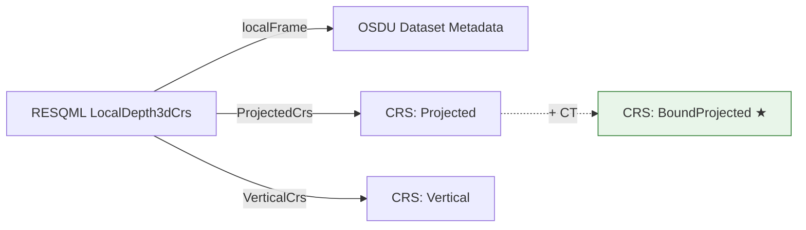

# CRS Mapping Guide: RESQML / RDDMS ⇄ OSDU

Practical guide for mapping coordinate reference systems between **RESQML** (as stored in **RDDMS**) and **OSDU** metadata.

**Key takeaway:** OSDU prefers **Bound CRS** — a projected CRS pinned to an explicit datum transformation. RESQML stores local-frame parameters (offsets, rotation) on the CRS object; OSDU puts them on dataset metadata.

---

## When Do You Need This?

| Scenario | What to do |
|----------|-----------|
| Ingesting RESQML data from RDDMS into OSDU | Map CRS → OSDU CRS ID + extract localFrame |
| Exporting from OSDU back to RESQML | Reconstruct `LocalDepth3dCrs` from metadata |
| Verifying CRS on a dataset | Check projected + vertical + localFrame are consistent |
| Converting between datums | Use BoundProjected CRS with CRS Convert v3 |

---

## Quick Reference: NCS CRS Mappings

| RESQML CRS | Usage | OSDU CRS ID | Bound? |
|-------------|-------|-------------|--------|
| EPSG:25831 | ETRS89 / UTM 31N | `Projected:EPSG::25831` | No |
| EPSG:25832 | ETRS89 / UTM 32N | `Projected:EPSG::25832` | No |
| EPSG:23031 | ED50 / UTM 31N | `BoundProjected:EPSG::23031_EPSG::1612` | **Yes** |
| EPSG:23032 | ED50 / UTM 32N | `BoundProjected:EPSG::23032_EPSG::1612` | **Yes** |
| EPSG:5714 | MSL height (Norway) | `Vertical:EPSG::5714` | — |
| EPSG:6230 | ED50 ellipsoidal height | `Vertical:EPSG::6230` | — |
| WKT ED50 + TOWGS84 | Legacy WKT | → map to BoundProjected | **Yes** |
| Unknown vertical | Old models | `verticalCRSID: null` | — |

> **Rule of thumb:** ETRS89-based CRS (25831–25836) needs no datum shift. Everything else (ED50, WGS72, local) should use BoundProjected.

---

## How CRS Works in RESQML (the RDDMS model)

### Two-level design

| Level | Object | What it holds |
|-------|--------|---------------|
| **Global** | Projected 2D CRS | Geodetic reference for the dataspace (e.g. EPSG:23031). One per dataspace. |
| **Local** | `LocalDepth3dCrs` / `LocalTime3dCrs` | XY/Z offsets, areal rotation, axis order, units, Z direction. References the global Projected CRS + a Vertical CRS. |

Every geometry object (grids, surfaces, point sets) references a **Local 3D CRS**, which in turn references the global CRS. This keeps coordinates numerically stable in a local frame while preserving full geodetic traceability.

### CRS identification forms (EnergyML Common)

| Form | Projected class | Vertical class | When to use |
|------|----------------|----------------|-------------|
| EPSG | `ProjectedEpsgCrs` | `VerticalEpsgCrs` | **Preferred** — well-known code |
| WKT | `ProjectedWktCrs` | `VerticalWktCrs` | Custom or non-EPSG definitions |
| GML | `ProjectedGmlCrs` | `VerticalGmlCrs` | Rare; ISO GML encoding |
| LocalAuthority | `ProjectedLocalAuthorityCrs` | `VerticalLocalAuthorityCrs` | Operator-specific (e.g. NPD codes) |
| Unknown | `ProjectedUnknownCrs` | `VerticalUnknownCrs` | Legacy; may contain WKT in Unknown field |

### RESQML 2.0.1 vs 2.2 — CRS differences

| Aspect | RESQML 2.0.1 (EML 2.0) | RESQML 2.2 (EML 2.3) |
|--------|------------------------|----------------------|
| CRS object | `resqml20.obj_LocalDepth3dCrs` | `eml23.LocalEngineeringCompoundCrs` |
| Projected CRS location | Inline on CRS object (`ProjectedCrs` field) | Separate `LocalEngineering2dCrs` object (resolved via DOR) |
| Offsets | `XOffset`, `YOffset`, `ZOffset` on CRS | `OriginProjectedCoordinate1`, `OriginProjectedCoordinate2` on `LocalEngineering2dCrs` |
| Rotation | `ArealRotation` with `Uom` (dega/rad) | On `LocalEngineering2dCrs` azimuth |
| Vertical CRS | Inline `VerticalCrs` field | Separate `VerticalAxis` reference |
| JSON support | XML only | Full JSON support (Common v2.3) |
| RDDMS crsVersion | `"eml20"` | `"eml23"` |

The RDDMS ETP client handles both versions and normalizes them into the same OSDU output structure.

---

## How CRS Works in OSDU (the target model)

OSDU stores CRS as **reference-data records**. Three kinds matter:

| OSDU CRS kind | ID pattern | Purpose |
|---------------|------------|---------|
| **Projected** | `...:Projected:EPSG::25832` | 2D projected system |
| **Vertical** | `...:Vertical:EPSG::5714` | Vertical datum |
| **BoundProjected** | `...:BoundProjected:EPSG::23031_EPSG::1612` | Projected CRS + explicit datum transformation (CT) |

**OSDU best practice → use BoundProjected CRS.** A Bound CRS removes datum-shift ambiguity by coupling the base projected CRS with a specific Coordinate Transformation (CT). The CRS Convert v3 service consumes these IDs directly.

> **Key difference from RESQML:** OSDU CRS records are pure reference. All local-frame parameters (offsets, rotation, axis order, units, Z direction) belong to the **dataset metadata**, not the CRS record.



---

## The Mapping — RESQML/RDDMS → OSDU

### Core mapping rules

| RESQML source | Maps to in OSDU | Notes |
|---------------|-----------------|-------|
| `LocalDepth3dCrs` / `LocalTime3dCrs` | **Dataset metadata → `localFrame`** | Offsets, rotation, axis order, units, Z direction — all stay with the data |
| `ProjectedCrs` (EPSG code) | CRS record `Projected:EPSG::<code>` | Direct 1:1 — but consider if Bound CRS is more appropriate |
| `ProjectedCrs` (WKT/GML/LocalAuthority) | CRS record `Projected:LocalAuthority::<code>` | Register in CRS Catalog with definition |
| `VerticalCrs` (EPSG code) | CRS record `Vertical:EPSG::<code>` | Direct 1:1 |
| `VerticalCrs` (Unknown) | `verticalCRSID: null` | Keep uom/direction in `localFrame` |
| Projected + known datum shift | **CRS record `BoundProjected:EPSG::<proj>_EPSG::<ct>`** | **★ Recommended OSDU path** |

### RDDMS localFrame keys (as produced by ETP client)

When RDDMS ingests data into OSDU, it stores local-frame metadata under namespaced keys:

| OSDU metadata key | Source (v2.0.1) | Source (v2.2) | Type |
|-------------------|-----------------|---------------|------|
| `rddms/localFrame/xOffset` | `XOffset` | `OriginProjectedCoordinate1` | number |
| `rddms/localFrame/yOffset` | `YOffset` | `OriginProjectedCoordinate2` | number |
| `rddms/localFrame/zOffset` | `ZOffset` | `OriginVerticalCoordinate` | number |
| `rddms/localFrame/arealRotationDeg` | `ArealRotation` (converted to deg) | Azimuth (deg) | number |
| `rddms/localFrame/projectedAxisOrder` | `ProjectedAxisOrder` | — | string |
| `rddms/localFrame/projectedUom` | `ProjectedUom` | — | string |
| `rddms/localFrame/verticalUom` | `VerticalUom` | — | string |
| `rddms/localFrame/zIncreasingDownward` | `ZIncreasingDownward` | — | boolean |
| `rddms/localFrame/crsVersion` | `"eml20"` | `"eml23"` | string |

These keys enable **lossless round-trip** — reconstruct the RESQML CRS from OSDU metadata without data loss.

### Bound CRS — the OSDU recommended approach

RESQML has no explicit Bound CRS class. The datum transformation is either:
- Embedded in a WKT `TOWGS84[...]` clause, or
- Implied by context (e.g. ED50 with a known regional shift)

In OSDU you make this **explicit** by creating or referencing a **BoundProjected** CRS record:

```
Base CRS :  EPSG:23031  (ED50 / UTM 31N)
CT       :  EPSG:1612   (ED50 → WGS84, 7-param)
OSDU ID  :  ...:BoundProjected:EPSG::23031_EPSG::1612
```

> **When you don't need Bound CRS:** ETRS89-based data (EPSG:25831–25836) is already WGS84-aligned — a plain Projected CRS is sufficient.

---

## Examples — RESQML JSON (RDDMS) → OSDU

### Typical NCS model — ETRS89, no datum shift needed

**RESQML (v2.0.1)**
```json
{
  "$type": "resqml20.obj_LocalDepth3dCrs",
  "XOffset": 400000.0, "YOffset": 6500000.0, "ZOffset": 0.0,
  "ArealRotation": 0.0,
  "ProjectedAxisOrder": "easting northing",
  "ProjectedUom": "m", "VerticalUom": "m",
  "ZIncreasingDownward": true,
  "ProjectedCrs": { "ProjectedEpsgCrs": 25832 },
  "VerticalCrs": { "VerticalUnknownCrs": {} }
}
```

**OSDU** — plain Projected is enough (ETRS89 ≈ WGS84)
```json
{
  "coordinateReferenceSystemID": "opendes:reference-data--CoordinateReferenceSystem:Projected:EPSG::25832",
  "verticalCRSID": null,
  "rddms/localFrame/xOffset": 400000.0,
  "rddms/localFrame/yOffset": 6500000.0,
  "rddms/localFrame/zOffset": 0.0,
  "rddms/localFrame/arealRotationDeg": 0.0,
  "rddms/localFrame/projectedAxisOrder": "easting northing",
  "rddms/localFrame/projectedUom": "m",
  "rddms/localFrame/verticalUom": "m",
  "rddms/localFrame/zIncreasingDownward": true,
  "rddms/localFrame/crsVersion": "eml20"
}
```

### Legacy ED50 model — needs Bound CRS

**RESQML (v2.0.1)** — WKT with TOWGS84
```json
{
  "$type": "resqml20.obj_LocalDepth3dCrs",
  "ProjectedCrs": {
    "ProjectedWktCrs": "PROJCS[\"UTM Zone 31N\", GEOGCS[\"ED50\", DATUM[\"ED50\", SPHEROID[\"International 1924\",6378388,297], TOWGS84[-87,-98,-121,0,0,0,0]], ...]]"
  },
  "VerticalCrs": { "VerticalUnknownCrs": {} }
}
```

**OSDU** — use BoundProjected (extract TOWGS84 → match EPSG CT)
```json
{
  "coordinateReferenceSystemID": "opendes:reference-data--CoordinateReferenceSystem:BoundProjected:EPSG::23031_EPSG::1612",
  "verticalCRSID": null
}
```

### RESQML 2.2 (EML 2.3) — LocalEngineeringCompoundCrs

**RESQML (v2.2)** — CRS references a separate `LocalEngineering2dCrs` object
```json
{
  "$type": "eml23.LocalEngineeringCompoundCrs",
  "LocalEngineering2dCrs": {
    "$type": "eml23.DataObjectReference",
    "ContentType": "application/x-eml+xml;version=2.3;type=LocalEngineering2dCrs",
    "Title": "Drogon Local CRS",
    "UUID": "abc123..."
  },
  "VerticalCrs": { "..." }
}
```

The referenced `LocalEngineering2dCrs`:
```json
{
  "$type": "eml23.LocalEngineering2dCrs",
  "OriginProjectedCoordinate1": 420000.0,
  "OriginProjectedCoordinate2": 6470000.0,
  "OriginProjectedCrs": {
    "AbstractProjectedCrs": { "$type": "eml23.ProjectedEpsgCrs", "EpsgCode": 23031 }
  }
}
```

**OSDU** — same output regardless of RESQML version:
```json
{
  "coordinateReferenceSystemID": "opendes:reference-data--CoordinateReferenceSystem:BoundProjected:EPSG::23031_EPSG::1612",
  "rddms/localFrame/xOffset": 420000.0,
  "rddms/localFrame/yOffset": 6470000.0,
  "rddms/localFrame/crsVersion": "eml23"
}
```

### Full CRS pair — projected + vertical (both EPSG)

**RESQML (v2.0.1)**
```json
{
  "$type": "resqml20.obj_LocalDepth3dCrs",
  "XOffset": 420000.0, "YOffset": 6470000.0, "ZOffset": 0.0,
  "ArealRotation": { "_": 0, "$type": "eml20.PlaneAngleMeasure", "Uom": "rad" },
  "ProjectedCrs": { "$type": "eml20.ProjectedCrsEpsgCode", "EpsgCode": 23031 },
  "VerticalCrs": { "$type": "eml20.VerticalCrsEpsgCode", "EpsgCode": 5714 }
}
```

**OSDU**
```json
{
  "coordinateReferenceSystemID": "opendes:reference-data--CoordinateReferenceSystem:BoundProjected:EPSG::23031_EPSG::1612",
  "verticalCRSID": "opendes:reference-data--CoordinateReferenceSystem:Vertical:EPSG::5714"
}
```

### WKT in Unknown field (detected by RDDMS heuristic)

The RDDMS ETP client detects WKT strings in `ProjectedUnknownCrs.Unknown` using the pattern `/^PROJC(RS|S)\[/`:

```json
{
  "ProjectedCrs": {
    "$type": "eml20.ProjectedUnknownCrs",
    "Unknown": "PROJCS[\"ED50 / UTM zone 31N\", GEOGCS[...]]"
  }
}
```

This produces `coordinateReferenceSystemID: "ProjectedCRS:WKT:<title>"` with the WKT in `persistableReferenceCrs`. Non-WKT strings in the Unknown field are safely ignored.

### Non-EPSG / operator CRS

If RESQML uses `ProjectedLocalAuthorityCrs` with no EPSG equivalent:

1. Register a CRS record in OSDU CRS Catalog as `Projected:LocalAuthority::<your-code>`
2. Include the WKT definition in the record
3. Reference that ID in dataset metadata

```json
{
  "id": "opendes:reference-data--CoordinateReferenceSystem:Projected:LocalAuthority::NPD-BaS-32",
  "data": {
    "definition": { "format": "WKT2", "wkt": "PROJCRS[...]" },
    "authority": { "name": "LocalAuthority", "code": "NPD-BaS-32" }
  }
}
```

---

## Ingestion Workflow — RDDMS Dataspace → OSDU

```
1. Read LocalDepth3dCrs / LocalTime3dCrs / LocalEngineeringCompoundCrs from RDDMS
2. Extract: ProjectedCrs code/WKT, VerticalCrs code/WKT, local frame params
3. Resolve CRS:
   ├─ EPSG projected → check if datum shift needed
   │   ├─ ETRS89-based (25831–25836) → Projected CRS is enough
   │   └─ ED50/WGS72/other → BoundProjected with CT
   ├─ WKT with TOWGS84 → extract shift → match EPSG CT → BoundProjected
   ├─ WKT in Unknown field → detected by /^PROJC(RS|S)\[/ heuristic
   └─ LocalAuthority/Unknown → register in CRS Catalog
4. Build OSDU metadata: coordinateReferenceSystemID, verticalCRSID, rddms/localFrame/*
5. Compute spatial: apply rotation matrix + offset → GeoJSON polygon/point
6. Convert if needed → CRS Convert v3 with record IDs
```

### Coordinate transform (rotation + offset)

The RDDMS ETP client applies ArealRotation as a standard 2D rotation matrix:

```
x_global = XOffset + x_local × cos(θ) + y_local × sin(θ)
y_global = YOffset - x_local × sin(θ) + y_local × cos(θ)
```

Where θ is ArealRotation converted to **radians** (RESQML may store as `dega` or `rad`).

---

## Pitfalls

| Issue | Consequence | Prevention |
|-------|-------------|------------|
| Missing datum shift (plain Projected instead of Bound) | Coordinates off by 50–200 m for ED50 | Always use BoundProjected for non-ETRS89 data |
| Axis order mismatch (EN vs NE) | X/Y swapped | Check `ProjectedAxisOrder`; normalize to `easting northing` |
| Z direction ambiguity | Depths inverted | Preserve `ZIncreasingDownward` in localFrame |
| Multiple projected CRSs in one dataspace | Undefined local frames | One projected CRS per RDDMS dataspace |
| Local frame in CRS record | OSDU rejects or misinterprets | Offsets/rotation go in dataset metadata only |
| `ArealRotation` unit mismatch | Rotation wrong | RESQML may use deg or rad; RDDMS normalizes to degrees in `arealRotationDeg` |
| v2.2 CRS not resolved | Missing offsets | `LocalEngineering2dCrs` is a separate object — must be fetched via DOR |

---

## References

- [RESQML CRS overview][r-crs] — one-projected-2D-CRS-per-dataspace rule
- [AbstractLocal3dCrs attributes][r-abs] — offsets, rotation, axis order, Z
- [EnergyML Common CRS classes][c-crs] — EPSG/GML/WKT/LocalAuthority/Unknown
- [RESQML 2.2 overview][r-22] — Common v2.3, JSON support
- [OSDU CRS Catalog service][os-cat] — register & search CRS/CT records
- [OSDU CRS Convert v3][os-conv] — transformation using record IDs (Apache SIS)
- [OSDU ADR: dynamic CRS/CT][os-adr] — BoundProjected pattern
- [resqpy CRS tutorial][rq-tut] — practical Python examples

[r-crs]: https://docs.energistics.org/RESQML/RESQML_TOPICS/RESQML-000-066-0-C-sv2010.html
[r-abs]: https://docs.energistics.org/RESQML/RESQML_TOPICS/RESQML-500-010-0-R-sv2010.html
[c-crs]: https://docs.energistics.org/COM/COM_TOPICS/COM-000-106-0-R-sv2100.html
[r-22]: https://energistics.org/resqml-developers-users
[os-cat]: https://community.opengroup.org/osdu/platform/system/reference/crs-catalog-service
[os-conv]: https://community.opengroup.org/osdu/platform/system/reference/crs-conversion-service/-/blob/0b2c76d50eb32302f70ce870a82d54f8d43228d8/docs/v3/tutorial/CRS_Convert_Service_howto.md
[os-adr]: https://community.opengroup.org/osdu/platform/system/home/-/issues/94
[rq-tut]: https://resqpy.readthedocs.io/en/latest/tutorial/working_with_coord.html
