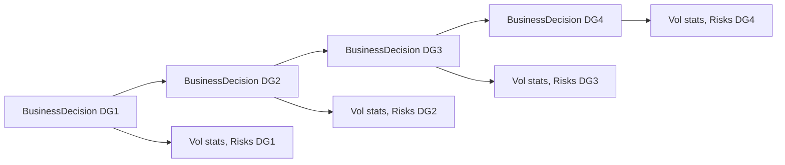
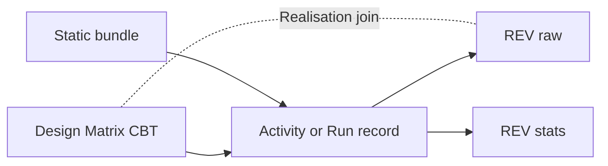
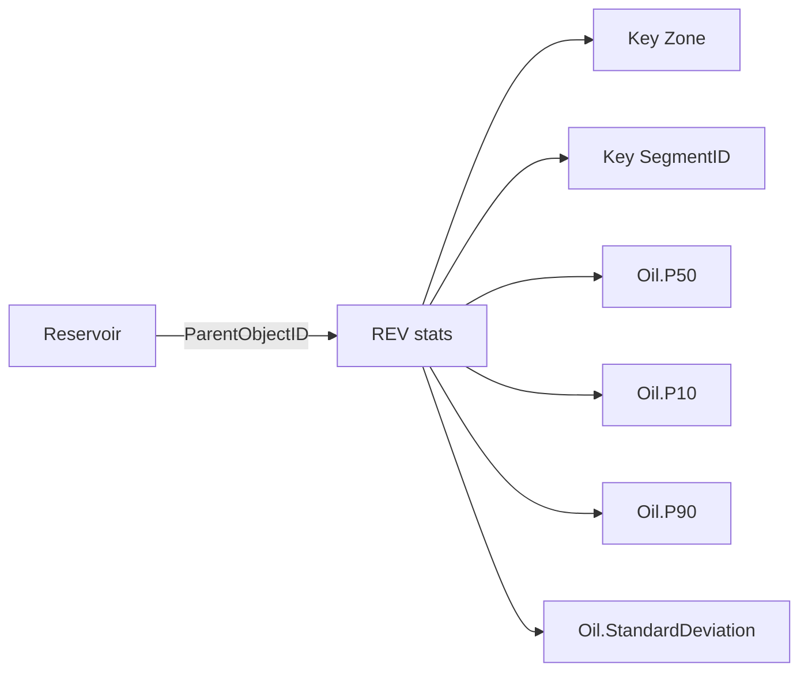
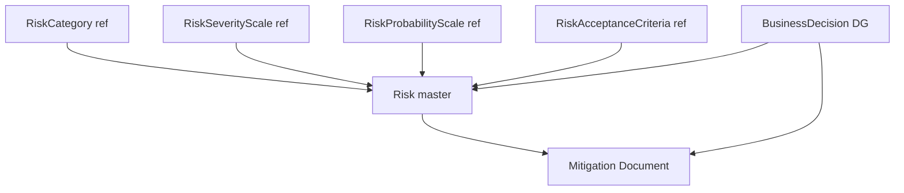
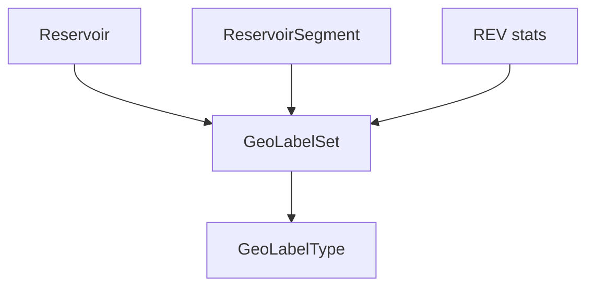
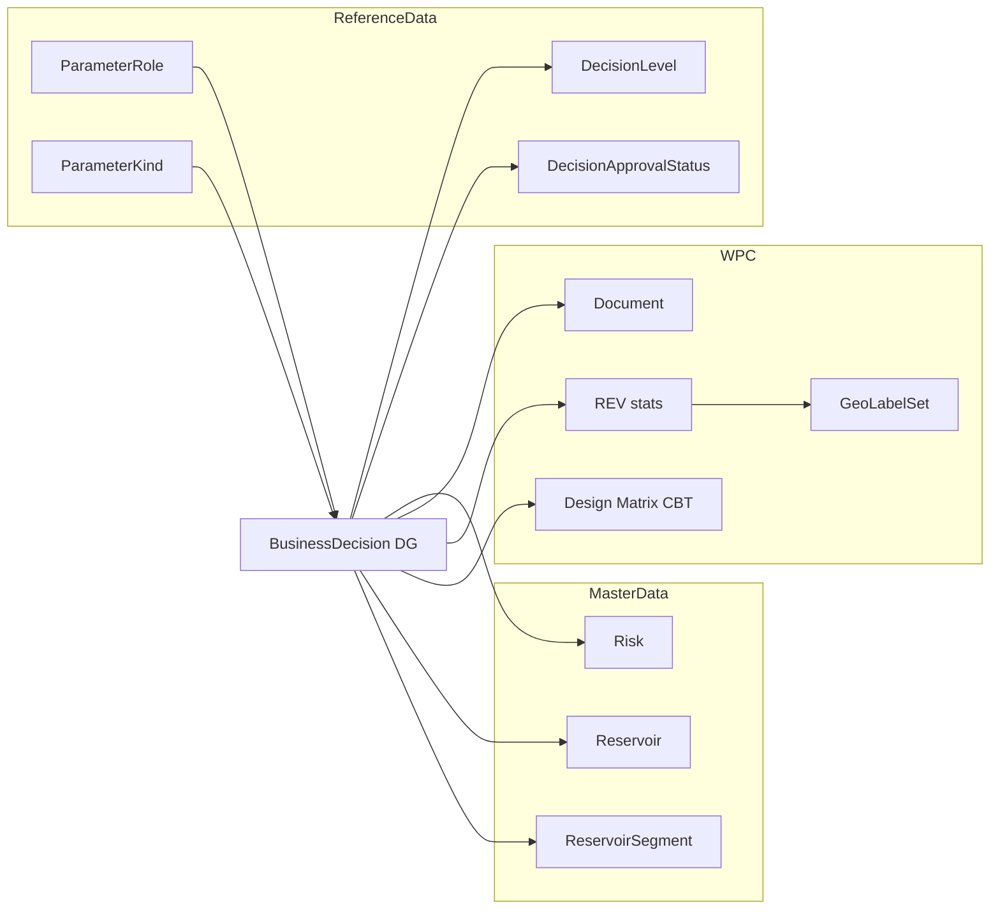

# Equinor Subsurface Uncertainty, Risk & Decision Gates in OSDU

**Purpose**: Provide a single coherent reference that maps Equinor decision-gate workflows (DG1–DG4) into OSDU canonical objects, enabling **traceable decisions**, **consistent risk management**, and **measurable improvement of uncertainty inputs** by linking inputs ↔ outputs through **BusinessDecision**.

---

## 1) Executive overview (what we are standardizing and why)

### 1.1 The business problem
Between DG1 and DG4, subsurface teams iterate rapidly (static models, ensembles, volumetrics, risk/assurance), but the artefacts often remain as files or siloed databases, making it hard to:
- Compare *what changed* between gates,
- Explain *why it changed* (input assumptions vs model evolution), and
- Demonstrate *how risks were mitigated* and what residual risk was accepted.

### 1.2 The OSDU strategy
We standardize on a small set of canonical objects:
- **BusinessDecision** (one per DG) as the decision record and provenance container.
- **ReservoirEstimatedVolumes (REV)** for authoritative volumes (raw and aggregated statistics).
- **ColumnBasedTable (CBT)** for design matrices and flexible tables.
- **Risk** for canonical risk records (with Equinor extensions).
- **Document** WPC for mitigation, risk assessment and assurance evidence.
- **GeoLabelSet** for dashboard-friendly “headline values” and fast discovery tied to master data objects.

### 1.3 Core principle: lossless traceability
The mechanism that keeps the mapping lossless is:
- **`BusinessDecision.Parameters[]`** (activity semantics) with **`ParameterRoleID`** and **`ParameterKindID`**, plus **Keys[]** for joins (e.g., `realisation-index`).

---

## 2) Naming, IDs and versioning conventions (avoid the common traps)

### 2.1 `kind` vs record `id`
- **`kind`** is always the schema identifier (e.g., `osdu:wks:master-data--BusinessDecision:1.0.0`).
- **record IDs** are partition-scoped (e.g., `dev:master-data--BusinessDecision:GRAND-DG2-ConceptSelect:1`).

### 2.2 Relationship fields use record IDs (with integer record-version)
Fields such as `DecisionLevelID`, `ApprovalStatusID`, `ParameterRoleID`, `ParameterKindID` should reference record IDs with a **record version suffix** like `:1`.

### 2.3 “Total” convention
For aggregate rows (zone totals, segment totals, portfolio totals), use the literal **`Total`** consistently.
- Example: `Zone = Total`, `SegmentID = Total`.

---

## 3) Canonical building blocks (what to use for what)

### 3.1 Master-data anchors (scope)
- **Reservoir** is the primary anchor for a study/decision.
- **ReservoirSegment** represents compartments/segments that are used for segmentation and analytics.

### 3.2 Reference-data (vocabulary)
Use reference-data for consistent semantics:
- Units of measure (`m3`, etc.)
- Statistics facets (P10/P50/P90, ArithmeticMean, Minimum, Maximum, StandardDeviation)
- Volume property types (Bulk, Net, Pore, HydrocarbonPore, Oil, AssociatedGas)
- Decision catalogs (DecisionLevel DG0–DG4; DecisionApprovalStatus Approved/Rejected/ApprovedWithChanges)
- Activity catalogs (ParameterKind, ParameterRole)
- Risk catalogs (Equinor LOCAL categories, scales, RAC)

### 3.3 Work-product components (content)
- **ColumnBasedTable**: design matrix, KPIs, risk registers (tabular).
- **ReservoirEstimatedVolumes**: authoritative volumes; discoverable and domain-specific.
- **Document**: mitigation actions, SRA/CRA, assurance.
- **GeoLabelSet**: published labels for fast UI/portal consumption.

### 3.4 Collections (packaging)
- **WorkProduct**: curated package for a DG decision (stable, versioned).
- **CollaborationProjectCollection**: working set during iteration.

---

## 4) DG1–DG4 as `BusinessDecision` (the spine of the workflow)

### 4.1 One BusinessDecision per gate
For each decision gate (DG1, DG2, DG3, DG4):
- Create **one** `BusinessDecision` record.
- Set:
  - `DecisionLevelID` (DGx)
  - `ApprovalStatusID` (Approved / ApprovedWithChanges / Rejected)
  - `DecisionDate`, `DecisionDueDate`
  - `DecisionSummary`
- Link governance:
  - `RiskIDs` (canonical Risk records)
  - `RiskAssessmentDocument` (Document WPC)
- Anchor the main evidence:
  - `PriorActivityIDs` (typically the aggregated REV WPC ID)

### 4.2 Parameters define provenance (use `ParameterRoleID` consistently)
Use `BusinessDecision.Parameters[]` to enumerate *what was used* for this decision.
- Use the role catalog you already have:
  - `ParameterRoleID = ...ParameterRole:Input:1` for evidence inputs
  - `ParameterRoleID = ...ParameterRole:Output:1` for outputs produced by the activity (optional for BusinessDecision)
  - `ParameterRoleID = ...ParameterRole:InputReference:1` for context anchors (Reservoir, SRA, CRA, WorkProduct packages)
- For object references use:
  - `ParameterKindID = ...ParameterKind:DataObject:1`

#### Minimal example snippet (schematic)
```json
{
  "kind": "osdu:wks:master-data--BusinessDecision:1.0.0",
  "id": "dev:master-data--BusinessDecision:PROJECT-DG2:1",
  "acl": {"owners": ["..."], "viewers": ["..."]},
  "legal": {"legaltags": ["..."], "otherRelevantDataCountries": ["NO"]},
  "data": {
    "Name": "PROJECT DG2 Concept Select",
    "DecisionLevelID": "dev:reference-data--DecisionLevel:DG2:1",
    "ApprovalStatusID": "dev:reference-data--DecisionApprovalStatus:Approved:1",
    "DecisionDate": "2026-01-10",
    "DecisionSummary": "Approve concept based on updated REV P50 and closed critical risks.",
    "RiskIDs": ["dev:master-data--Risk:...:1"],
    "PriorActivityIDs": ["dev:work-product-component--ReservoirEstimatedVolumes:...:1"],
    "Parameters": [
      {
        "Title": "Volumes evidence",
        "ParameterKindID": "dev:reference-data--ParameterKind:DataObject:1",
        "ParameterRoleID": "dev:reference-data--ParameterRole:Input:1",
        "DataObjectParameter": "dev:work-product-component--ReservoirEstimatedVolumes:...:1",
        "Keys": [{"ParameterKey": "artifact", "StringParameterKey": "REV-stats"}]
      },
      {
        "Title": "Reservoir context",
        "ParameterKindID": "dev:reference-data--ParameterKind:DataObject:1",
        "ParameterRoleID": "dev:reference-data--ParameterRole:InputReference:1",
        "DataObjectParameter": "dev:master-data--Reservoir:...:1"
      }
    ]
  }
}
```

### 4.3 DG-specific guidance (what to include)
- **DG1**: baseline volumes and uncertainty assumptions; initial risk register; key static inputs.
- **DG2**: authoritative volumes and chosen concept; link SRA/CRA and assurance; risk mitigations and residual risk.
- **DG3**: execution readiness; updated models/grids; updated risk closure; revised volumes.
- **DG4**: operations; KPI tables and updates; reconciliation vs expected outcomes.



---

## 5) Input uncertainties (FMU ensembles) — how to persist inputs and keep joins

### 5.1 Design matrix in ColumnBasedTable
Persist the FMU design matrix as CBT:
- Key columns: `CaseID`, `Realisation`, optional `Seed`
- Value columns: parameter vector (e.g., NTG shift, permeability multipliers)

### 5.2 Static bundle packaging
Store static inputs (grids, properties, velocity models) as WPCs and package per scenario:
- Working set: CollaborationProjectCollection
- Gate package: WorkProduct

### 5.3 Join rule: Realisation
Maintain the “lossless” join between inputs and outputs:
- DesignMatrix `Realisation` ↔ Raw REV `Realisation`
- In Activities/BusinessDecision parameters, repeat the join key in `Keys[]` using `ParameterKey = realisation-index`.



---

## 6) Output volumes — `ReservoirEstimatedVolumes` (raw and aggregated)

### 6.1 Why REV is authoritative
REV is the domain WPC intended for in-place/technical recoverable volumes, scoped by `ParentObjectID` to Reservoir/Segment.

### 6.2 Raw realizations
Use REV raw to store each realisation:
- Keys: `Realisation`, `Zone`, `SegmentID`
- Value columns: Bulk, Net, Pore, HydrocarbonPore, Oil, AssociatedGas

### 6.3 Aggregated statistics
Use REV stats for gate reporting:
- Keys: `Zone`, `SegmentID`
- Columns: dot notation `Oil.P50`, `Bulk.P10`, `AssociatedGas.StandardDeviation`
- Use statistics facets for each column
- Use `Total` consistently for aggregate rows



---

## 7) Risks — Equinor taxonomies + canonical `Risk` + mitigation evidence

### 7.1 Equinor risk catalogs as LOCAL reference-data
Persist Equinor’s risk vocabulary as LOCAL reference-data:
- Category, severity scale, probability scale, RAC

### 7.2 Canonical Risk master-data
Create canonical `Risk` records:
- `TypeID` points to the fixed RiskType value
- Equinor-specific ratings and catalog references go into `data.ext.equinor`
- Mitigation actions link to Document WPCs

### 7.3 Link risks to decisions
At each gate:
- `BusinessDecision.RiskIDs` links to the set of applicable risks
- `RiskAssessmentDocument` links to the governing document (SRA/CRA/assurance)



---

## 8) Relationships to master-data and governance packaging

### 8.1 Reservoir and segments
- All volume outputs and labels must be anchored to Reservoir (and segments when used).
- Segment keys must align with ReservoirSegment record IDs (or documented segment identifiers).

### 8.2 WorkProduct as a decision package
When a decision includes many artefacts:
- Create a WorkProduct representing the DG package
- Reference it from BusinessDecision parameters using `ParameterRoleID = InputReference`

### 8.3 Legal/ACL propagation
- Apply partition-standard ACL/legal tags consistently.
- Use ancestry links for derivatives when you need legal tag propagation.

---

## 9) GeoLabelSet — fast discovery and dashboard consumption

### 9.1 When to use GeoLabelSet
GeoLabelSet is ideal for publishing “headline” values:
- Segment and Total P50 values for dashboards
- Screening metrics for quick search

### 9.2 How it complements REV
- REV remains the authoritative store for analysis.
- GeoLabelSet provides fast discovery and simple portal views.

### 9.3 Recommended linkage
- Use `LabelledEntityID` (Reservoir/Segment) for unambiguous linkage.
- Add scenario facets if you need case separation.



---

## 10) Query patterns (how analytics and UI retrieve the story)

### 10.1 Find decisions by gate
Query `BusinessDecision` by:
- `DecisionLevelID = dev:reference-data--DecisionLevel:DG2:1`
- `ApprovalStatusID = dev:reference-data--DecisionApprovalStatus:Approved:1`

### 10.2 Pull the decision package
- Follow `PriorActivityIDs` (main evidence artefact)
- Follow `Parameters[].DataObjectParameter` for all supporting inputs/outputs/context

### 10.3 Retrieve volumes and compare gates
- For each gate BusinessDecision, locate the REV stats referenced in `PriorActivityIDs` or parameters.
- Compare P50 by segment and total between DG1, DG2, DG3, DG4.

### 10.4 Find GeoLabelSets for a reservoir
Search GeoLabelSet by `LabelledEntityID` (preferred) or ancestry.

---

## Appendix A — Mermaid overview: “decision spine” with inputs, outputs and risk


