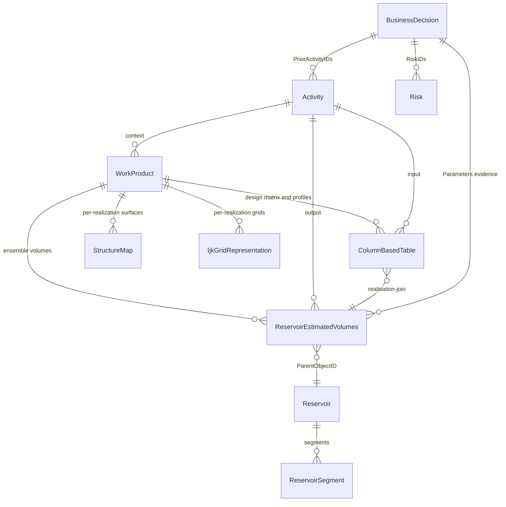
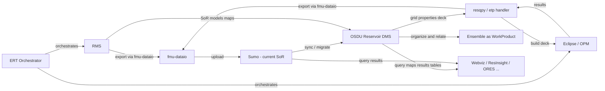
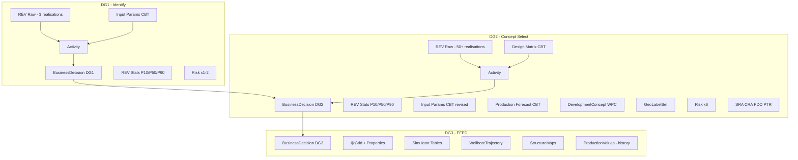
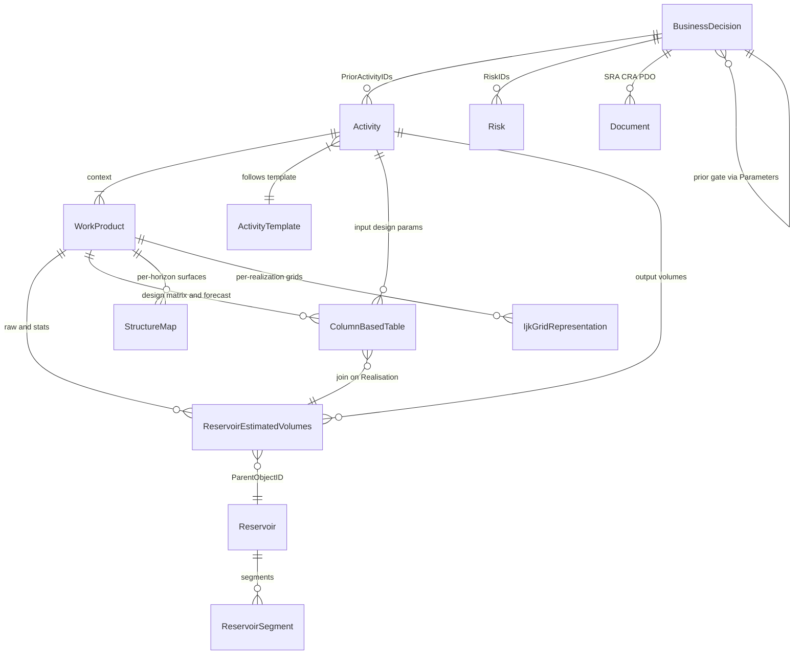

## **OSDU Support for FMU Data Handling – System of Record**

> **Reference links**:
> - [fmu-dataio](https://github.com/equinor/fmu-dataio) — FMU data standard & metadata export library (v2.26, schema v0.21.0)
> - [fmu-dataio data model](https://fmu-dataio.readthedocs.io/en/latest/datamodel/index.html) — FMU results metadata schema (denormalized, parent/child)
> - [fmu-dataio simple exports](https://fmu-dataio.readthedocs.io/en/latest/simple_exports/index.html) — Standard result export functions
> - [fmu-sumo](https://github.com/equinor/fmu-sumo) — Interaction with Sumo (current SoR for FMU results)
> - [fmu-drogon](https://github.com/equinor/fmu-drogon) — Public Drogon reference case
> - [ERT](https://github.com/equinor/ert) — Ensemble-based Reservoir Tool (workflow orchestrator)
> - [Sumo / Webviz](https://github.com/equinor) — Cloud SoR, visualization, and aggregation
> - **Internal**: [Reservoir Modelling & Simulation Wiki](https://statoilsrm.sharepoint.com/sites/SubsurfaceCommunityHUB2/SitePages/Reservoir-Modelling-and-Simulation.aspx) — Equinor FMU practice, templates, and governance
>
> **Related guides in this repo**: [BusinessDecision](BusinessDecision.md) · [Volumes](Volumes.md) · [Uncertainty](Uncertainty.md) · [Risk](Risk.md) · [BdDemo](BdDemo.md) · [DevConcept](DevConcept.md) · [SeisInt](SeisInt.md) · [StratColumn](StratColumn.md)

***

### **1. Purpose**

This document describes how **OSDU** can serve as a **structured data management layer** for **FMU** (Fast Model Update) workflows — both as a persistent System of Record and as an enabler for better input provisioning, output management, and decision support across decision gates (DG1→DG4).

Three complementary objectives:

1. **System of Record** — OSDU as persistent SoR for FMU results, complementing/replacing Sumo. Structured, governed, version-controlled storage with OSDU data model semantics.
2. **Input provisioning** — OSDU as an organized source of input data for FMU workflows: master data (reservoir, segments, stratigraphy), reference data (fluid contacts, uncertainties), surfaces, grids, well data.
3. **Decision support** — OSDU `BusinessDecision` records as the backbone for DG1→DG4 tracking, linking ensemble results (volumes, maps, production profiles, uncertainties) to gates with full provenance.

Additionally, enable round-trip fidelity between FMU Eclipse/OPM decks and OSDU Reservoir DMS:
* Lossless, in-memory RESQML IJK grid and property handling (`resqpy`)
* Efficient, file-less data transfer (`pyetp`)
* Metadata preservation end-to-end for traceability and reproducibility
* Bonus: Nexus, Intersect support via RESQML ETP API

### **1.1 Current FMU Data Landscape**

FMU is Equinor's primary system for creating, maintaining, and using 3D predictive numerical models for the subsurface. It combines off-the-shelf software (RMS, Eclipse/OPM) with in-house components (ERT, fmu-dataio). FMU data currently flows through the **Sumo** cloud storage platform as the primary System of Record:

1. **ERT** orchestrates the FMU workflow — defines cases, iterations/ensembles, realizations, and FORWARD_MODELs (RMS → Eclipse/OPM → post-processing)
2. **fmu-dataio** exports data from within FORWARD_MODELs with rich metadata sidecars (denormalized YAML/JSON, one per file). Standard results (simple exports) enforce column conventions and validation.
3. **Sumo** receives and indexes the exported data for querying, visualization (Webviz), and consumption by downstream clients
4. **OSDU** can complement or replace Sumo as the persistent SoR, with structured data management, Activity provenance, and BusinessDecision support

The fmu-dataio metadata schema (currently v0.21.0) defines a **denormalized parent/child data model**: `case → ensemble → realization → files`. Each exported file has a metadata sidecar containing:
- `fmu.case` — case identity (name, uuid, user, model template)
- `fmu.ensemble` — ensemble/iteration identity (name, uuid)
- `fmu.realization` — realization identity (id, uuid, is_reference)
- `fmu.ert` — ERT experiment context (experiment.id, simulation_mode)
- `data.content` — content type (volumes, surfaces, grids, tables, cubes, polygons, etc.)
- `data.standard_result` — standardized result name (e.g., `inplace_volumes`, `structure_depth_surface`, `grid_model_static`)
- `data.property` — property attribute and discreteness for grid properties
- `masterdata` — field/country references (SMDA)
- `access` — classification and security

**Standard results** (fmu-dataio v2.26 simple exports) are the recommended export path:

| Standard result | Export function | Output format |
|---|---|---|
| Initial inplace volumes | `export_inplace_volumes` | Parquet (FLUID, ZONE, REGION, FACIES, LICENSE, BULK, NET, PORV, HCPV, STOIIP, GIIP, ASSOCIATEDGAS, ASSOCIATEDOIL) |
| Structure depth surfaces | `export_structure_depth_surfaces` | irap_binary (.gri) per horizon |
| Structure time surfaces | `export_structure_time_surfaces` | irap_binary (.gri) per horizon |
| Structure depth isochores | `export_structure_depth_isochores` | irap_binary (.gri) |
| Structure depth fault lines | `export_structure_depth_fault_lines` | — |
| Structure depth fault surfaces | `export_structure_depth_fault_surfaces` | — |
| Grid extracted depth surfaces | `export_grid_extracted_depth_surfaces` | irap_binary (.gri) |
| Grid model static | `export_grid_model_static` | ROFF (.roff) — grid + properties (porosity, perm, Sw, facies, NTG, Vsh, bulk volumes, fluid indicator, zonation, regions) |
| Field outline | `export_field_outline` | — |
| Fluid contact outlines | `export_fluid_contact_outlines` | — |
| Fluid contact surfaces | `export_fluid_contact_surfaces` | — |
| Simulator FIP regions mapping | `export_simulator_fipregions_mapping` | — |

Custom exports cover additional content types: `well_completions`, `production_network`, `pvt`, `relperm`, `rft`, `timeseries`, `lift_curves`, `observations`, `fault_surface`, `seismic`, `fluid_contact`, `field_outline`, `mapping`, and more.

***

### **2. Ground Rules**

* **No breaking changes to FMU** workflow design and functionality, governance, ERT and other component roles: focus is on data handling, storage, metadata support, query.
* **Respect fmu-dataio as the metadata standard**: All FMU exports use fmu-dataio for metadata generation. OSDU mapping must preserve the fmu-dataio metadata structure and be able to reconstruct it on round-trip.
* **One identity per artifact**: Each grid, property, map, and deck has a stable `UUID/SRN` and `version`.
* **Lossless provenance**: Every output carries ancestry back to the exact input WPCs and FMU run.
* **CRS & units are first-class**: CRS definition, axis order, rotation, and UOM travel with the data.
* **Round-trip fidelity**: Data exported from Eclipse can be fully recovered from OSDU with identical identity and metadata.
* **Gate alignment**: OSDU data model usage must support the decision-gate lifecycle (DG1→DG4) with increasing data richness at each stage.

***

### **3. Canonical Data Model — FMU ↔ OSDU Mapping**

The FMU data model (fmu-dataio) is denormalized and file-centric. The OSDU data model is normalized and record-centric. The mapping between them:

| FMU concept (fmu-dataio) | OSDU concept | Notes |
|---|---|---|
| `fmu.case` (name, uuid, model) | **WorkProduct** or **Dataspace** | Case = versioned package + partition boundary for ACL/legal |
| `fmu.ensemble` (name, uuid) | **WorkProduct** or **PersistedCollection** | Ensemble package, one per iteration |
| `fmu.realization` (id, uuid) | Key column in WPC tables, or per-realization WPC | Realization index as key in REV/CBT, or separate WPCs for large artifacts |
| `data.content = volumes` | `ReservoirEstimatedVolumes` WPC | Standard result: `inplace_volumes` |
| `data.content = surface` | `StructureMap` / `GenericRepresentation` WPC | Depth/time surfaces, isochores, fault surfaces |
| `data.content = property` | Grid Property WPC (`IjkGridRepresentation`) | PORO, PERMX, SW, NTG, facies, etc. |
| `data.content = grid` | `IjkGridRepresentation` WPC | Static grid model geometry |
| `data.content = table` | `ColumnBasedTable` WPC | Design matrix, timeseries, production profiles, simulator tables |
| `data.content = polygons` | `GenericRepresentation` WPC | Field outlines, fault lines, fluid contact outlines |
| `data.content = seismic` | Seismic WPCs | Cubes, attribute maps |
| `data.standard_result.name` | WPC kind + PropertyTypeID | Canonical column/naming conventions |
| `masterdata.smda.field` | `master-data--Reservoir` | |
| `masterdata.smda.country` | `master-data--Country` | |
| `fmu.ert.experiment` | `Activity` / `ActivityTemplate` | ERT experiment → OSDU Activity provenance |
| Design matrix (ERT parameters) | `ColumnBasedTable` WPC | Keys: CaseID, Realisation, Seed; Columns: parameter vector |
| Aggregated statistics | `ReservoirEstimatedVolumes` with FacetIDs | P10/P50/P90/Mean via `FacetType:statistics` + `FacetRole` |

#### OSDU types used

| OSDU type | Role in FMU context |
|---|---|
| **Dataspace** | Partition boundary for ACL and legal tags |
| **WorkProduct** | Versioned case/ensemble package — groups WPCs into a deliverable |
| **Work Product Component (WPC)** | Atomic datasets: grids, properties, maps, tables, documents, volumes |
| **PersistedCollection** | Evidence package for a gate — curated set of WPCs |
| **Activity / ActivityTemplate** | Workflow provenance — links inputs, outputs, and context with `Parameters[]` |
| **BusinessDecision** | Decision gate record — DG1→DG4 with risks, approvals, evidence links |
| **Reservoir / ReservoirSegment** | Master-data anchors for volumes scoping |
| **GeoLabelSet** | Headline KPI labels (P10/P50/P90 per segment) for dashboards |
| **Document** | SRA, CRA, PDO, PTR — governance documents linked to BD |
| **Risk** | Risk records with severity/probability, linked to BD |

***

#### **Grid (IJK, Corner-Point)**

* **Identity**: `grid_uuid`, `osdu_srn`, `version`
* **Geometry**: `ni, nj, nk`, `k_direction`, `handedness`
* **CRS**: Type (LocalDepth3d/Global), origin, rotation, axis order, units (XY/Z)
* **Governance**: `legalTags`, `acl`, `data.ancestry.inputs`, timestamps
* **Standard result**: `grid_model_static` — exports grid + standard properties as ROFF

#### **Property (Cell-Sized)**

* **Identity**: `property_uuid`, `osdu_srn`, `version`
* **Mapping**: Eclipse keyword (PORO, PERMX, SW, NTG, FACIES, etc.), indexable element (cells), UOM, discrete/continuous
* **Ties**: `supported_by_uuid` (grid UUID), property set/title
* **Standard properties** (from `export_grid_model_static`): zonation, regions, porosity, permeability, saturation_water, fluid_indicator, bulk_volume_oil/gas, facies, net_to_gross, volume_shale, permeability_vertical

#### **2D Grid / Surface / Map**

* Identity + grid reference (surface grid or parent 3D grid + layer/slice), units, CRS
* Standard results: `structure_depth_surface`, `structure_time_surface`, `structure_depth_isochore`, `grid_extracted_depth_surface`
* OSDU: `StructureMap` WPC (RDDMS Grid2dRepresentation for Z-values) or `GenericRepresentation`

#### **Table (CSV/Parquet)**

* Identity + schema (columns & UOM), run scope (case/realization/time)
* Standard results: `inplace_volumes` (Parquet), simulator tables (relperm, pvt, rft, well_completions, timeseries, lift_curves, production_network)
* OSDU: `ColumnBasedTable` WPC with KeyColumns/Columns schema

#### **Deck Artifacts (Eclipse/OPM)**

* **Identity**: `deck_id` (stable identifier for produced deck bundle)
* **Components**: `GRID.grdecl`, `PORO.grdecl`, `.DATA/.EGRID`
* **Binding**: `grid_uuid` + list of `property_uuid`s
* **Manifest**: JSON sidecar stored on disk and as metadata/attachment on Deck WPC

***

### **4. BusinessDecision Alignment with FMU Gates**

FMU is used from DG1 onwards in Equinor's capital value process. Each decision gate has increasing data requirements. The OSDU `BusinessDecision` record serves as the **hub** linking all gate evidence.

#### 4.1 Gate data progression

| Gate | FMU scope | Key OSDU artifacts |
|---|---|---|
| **DG1** — Identify & Assess | Screening: few realizations (3–10), simple design matrix, limited uncertainty variables, regional data | Reservoir, Segments, REV (raw + stats), input params CBT, 1–2 Risks, Activity, BD |
| **DG2** — Concept Select | Full ensemble: 50–250 realizations (one-by-one / Latin Hypercube), 30+ uncertainty variables, production forecast, development concept evaluation. Drogon ref: 250 realizations, 92×146×69 geogrid, 10 cell properties, 49 maps, 30+ design params | All DG1 + IjkGridRepresentation + 10 property WPCs, StructureMap (6 horizons), GenericRepresentation (maps: amplitude, facies frac, averages), Risks ×6, Documents (SRA, CRA, PDO, PTR), DevelopmentConcept, GeoLabelSet, production forecast CBT, design matrix CBT (30+ cols), simulator tables (relperm, PVT), polygon WPCs (faults, outlines), PersistedCollection |
| **DG3** — FEED / Plan for Execution | Dynamic simulation: history matching (if brownfield), flow simulation grid (IJK), SCHEDULE, PVT, relperm, well trajectories, drainage strategy | All DG2 + IjkGridRepresentation, grid properties, WellboreTrajectory, simulator tables (relperm, PVT), ProductionValues, StructureMaps |
| **DG4** — FID / Execute | Full-field simulation & optimization: 100–1000+ realizations, history match quality, production optimization, detailed well plans | All DG3 + history match metrics, updated forecasts, field development plan, updated risks |

#### 4.2 BD as FMU evidence hub

The `BusinessDecision` record uses `Parameters[]` (from `AbstractProjectActivity`) with `ParameterRole = input|output|context` to link all gate evidence:

```
BusinessDecision (DG2 example)
  ├─ DecisionLevelID → reference-data--DecisionLevel:DG2
  ├─ ApprovalStatusID → reference-data--DecisionApprovalStatus:Approved
  ├─ RiskIDs → Risk records (porosity, fault, HSE, schedule, OWC, recovery)
  ├─ RiskAssessmentDocument → Document WPC (SRA)
  ├─ PriorActivityIDs → Activity (the workflow that produced evidence)
  ├─ Parameters[]:
  │    ├─ [input]  REV-raw → ReservoirEstimatedVolumes (per-realisation)
  │    ├─ [input]  REV-stats → ReservoirEstimatedVolumes (P10/P50/P90)
  │    ├─ [input]  InputParams → ColumnBasedTable (design matrix: 30+ params — OWC, KVKH, relperm, facies prob, …)
  │    ├─ [input]  GeoModelDataspace → ETPDataspace (RDDMS pointer)
  │    ├─ [input]  GridModel → IjkGridRepresentation (92×146×69 geogrid + 10 properties)
  │    ├─ [input]  DepthSurfaces → StructureMap WPCs (6 horizons)
  │    ├─ [output] ProductionForecast → ColumnBasedTable (per-well + field-level)
  │    ├─ [output] DevelopmentConcept → custom WPC
  │    ├─ [output] GeoLabelSet → headline P10/P50/P90 per segment
  │    ├─ [output] DerivedMaps → GenericRepresentation (amplitude, facies fractions, averages)
  │    ├─ [output] SimulatorTables → ColumnBasedTable WPCs (relperm, PVT, VFP, completions)
  │    ├─ [context] Reservoir → master-data--Reservoir
  │    ├─ [context] Prior gate → BD DG1 (cross-gate linkage)
  │    └─ [context] Documents → SRA, CRA, PDO, PTR
  ├─ Personnel[] → team members with ProjectRoleIDs
  ├─ ext.equinor.Alternatives[] → ranked concept alternatives
  └─ ext.equinor.UncertaintySummary → P10/P50/P90 range + method
```

#### 4.3 Adapting the BD model for FMU

**Current strengths:**
- `Parameters[]` with `ParameterRole` provides semantic input/output/context linking — well suited for FMU's input→workflow→output provenance
- `PriorActivityIDs` chains to the Activity record that represents the FMU workflow execution
- `RiskIDs` + governance documents capture the risk dimension required at each gate
- Cross-gate navigation (DG1→DG2→DG3→DG4) via `Parameters[]` back-references

**Improvements for better FMU alignment:**

1. **Standardize parameter keys**: Define a controlled vocabulary for `Parameters[].Title` / key strings used across gates. Current keys (`"REV-raw"`, `"DevelopmentConcept"`, `"GeoLabelSet"`, `"ProductionForecast"`) are ad-hoc. Propose a registry: `fmu-rev-raw`, `fmu-rev-stats`, `fmu-design-matrix`, `fmu-production-forecast`, `fmu-development-concept`, `fmu-geolabelset`, `fmu-geomodel-dataspace`.

2. **Ensemble metadata on BD**: The BD should carry ensemble summary metadata: number of realizations, sampling method (User_Defined / Latin_Hypercube / Monte_Carlo), number of uncertainty variables. Currently encoded as JSON strings in Activity parameters — consider promoting to `ext.equinor` keys or a dedicated WPC.

3. **Design matrix as first-class WPC**: Currently the design matrix is serialized as JSON in Activity `Parameters[]`. It should be a proper `ColumnBasedTable` WPC (keys: `CaseID`, `Realisation`, `Seed`; columns: parameter vector). This enables direct join/query against REV without JSON parsing. See [Uncertainty guide](Uncertainty.md).

4. **Economics WPC**: At DG2+ economics (NPV, CAPEX, OPEX, IRR, breakeven) are critical. Currently stored in `ext.equinor` which can be silently dropped by manifest ingestion. Consider a dedicated `ColumnBasedTable` WPC or a custom schema (like the DevelopmentConcept pattern) to ensure persistence.

5. **Gate comparison support**: OSDU queries should support cross-gate delta analytics — e.g., volumes at DG2 vs DG1, risk evolution, parameter refinement. The BD→BD back-reference chain enables this, but requires consistent parameter keys and segment mappings across gates.

***

### **5. OSDU Benefits for FMU Input and Output Management**

#### 5.1 Input provisioning — OSDU as FMU data source

OSDU can serve as a **governed, versioned source** of input data for FMU workflows, replacing or complementing ad-hoc file shares and SMDA lookups:

| FMU input need | OSDU source | Benefit |
|---|---|---|
| **Reservoir & segments** | `master-data--Reservoir`, `ReservoirSegment` | Canonical entity IDs; consistent scoping across gates |
| **Stratigraphy** | `StratigraphicUnitInterpretation`, `StratigraphicColumnRankInterpretation` | SMDA-aligned zones and horizons for FMU model template |
| **Structural surfaces** | `StructureMap` WPC (RDDMS + catalog) | Versioned depth/time surfaces; RDDMS streaming for large grids |
| **Fluid contacts** | `FluidBoundary` or `GenericRepresentation` WPC | OWC/GOC per segment — input to volume calculations |
| **Well data** | `WellboreTrajectory`, `WellLog`, `WellCompletionData` | Conditioning data for geomodels |
| **Seismic** | `SeismicHorizon`, `SeismicLineSet`, cubes | Velocity models, attribute maps |
| **Prior gate results** | `ReservoirEstimatedVolumes`, `ColumnBasedTable` | Previous ensemble results as baseline/comparison |
| **Reference data** | Units, CRS, facet types, property types | Governed catalogs for consistent metadata |

**Workflow pattern**: ERT pre-processing job queries OSDU for versioned inputs → fmu-dataio tags each export with `data.ancestry.inputs` pointing to OSDU WPC IDs → outputs carry full provenance back to governed input sources.

#### 5.2 Output management — ensemble results in OSDU

FMU produces large volumes of output across realizations. OSDU provides structured management for each category:

##### Volumes (ReservoirEstimatedVolumes)

Two flavours — see [Volumes guide](Volumes.md):

- **Raw per-realization**: Keys `Realisation/Zone/SegmentID/Facies`, columns `BULK/NET/PORV/HCPV/STOIIP/GIIP/ASSOCIATEDGAS/ASSOCIATEDOIL`. One REV WPC per ensemble with all realizations as rows.
- **Aggregated statistics**: Keys `Zone/SegmentID`, columns `Bulk.P10/Oil.P50/...` with `FacetIDs` carrying `FacetType:statistics` + `FacetRole:P10|P50|P90|ArithmeticMean|Minimum|Maximum|StandardDeviation`.

fmu-dataio column mapping: `BULK→Bulk`, `NET→Net`, `PORV→Pore`, `HCPV→HydrocarbonPore`, `STOIIP→Oil`, `GIIP→Gas`, `ASSOCIATEDGAS→AssociatedGas`, `REAL→Realisation` (key).

Note: fmu-dataio v2.26 adds `FLUID` as a standard index column (GAS/OIL/WATER), which should map to a `Fluid` key column in REV. The `LICENSE` column (optional) maps to a governance/scoping key.

##### Maps and surfaces

Structure depth surfaces, time surfaces, isochores, and grid-extracted surfaces are per-realization spatial data:

- **OSDU catalog**: `StructureMap` WPC or `GenericRepresentation` holding metadata (CRS, grid geometry, stratigraphic reference)
- **RDDMS storage**: `Grid2dRepresentation` in RESQML EPC for actual Z-values (streamed via ETP)
- **Ensemble handling**: Per-realization surfaces can be individual WPCs or bundled under a WorkProduct per ensemble. Aggregated surfaces (mean, P10, P90 maps) are separate WPCs with facet annotation.
- **Standard results**: `structure_depth_surface`, `structure_time_surface`, `structure_depth_isochore`

##### Production profiles

- **Forecast** (DG2+): `ColumnBasedTable` WPC with columns `Year/OilRate_Sm3d/GasRate_Sm3d/WaterRate_Sm3d/CumOil_MSm3`, optionally per realization
- **History** (DG3/DG4, brownfield): `ProductionValues` WPC for observed/historical data
- **Ensemble profiles**: Per-realization production tables enable P10/P50/P90 forecast uncertainty bands

##### Uncertainty parameters and design matrix

See [Uncertainty guide](Uncertainty.md):

- **Design matrix**: `ColumnBasedTable` WPC — keys `CaseID/Realisation/Seed`, columns represent parameter vector (e.g., `KxMultiplier`, `RelPermFamily`, `NTG_Shift`, OWC contacts per segment)
- **Provenance**: Activity `Parameters[]` link design matrix row → static bundle → raw REV output, joined on `Realisation` key
- **Variable metadata**: Number of variables, distributions, correlations, sampling method — stored in Activity or as metadata on the design matrix CBT

##### Simulator tables (DG3/DG4)

| fmu-dataio content | OSDU WPC type | Notes |
|---|---|---|
| `relperm` | `ColumnBasedTable` | Relative permeability curves per facies/SATNUM |
| `pvt` | `ColumnBasedTable` | PVT data per PVT region |
| `rft` | `ColumnBasedTable` | Repeat formation test data |
| `well_completions` | `ColumnBasedTable` | Well completion schedules |
| `timeseries` | `ColumnBasedTable` | Simulator summary vectors (FOPT, WBHP, etc.) |
| `lift_curves` | `ColumnBasedTable` | Artificial lift performance curves |
| `production_network` | `ColumnBasedTable` | Network model data |

#### 5.3 Ensemble modelling relationships in OSDU

The core challenge: FMU produces **N realizations × M artifact types** per ensemble. OSDU needs to represent the relationships:



**Key patterns:**
1. **WorkProduct per ensemble** — groups all WPCs for one iteration (design matrix + static bundle + all output types)
2. **Realisation as key column** — not as separate WPC per artifact per realization (avoids record explosion for 200+ realizations)
3. **Activity as workflow record** — one Activity per ensemble execution, linking design matrix → static inputs → output WPCs
4. **BusinessDecision as gate record** — one BD per gate, linking Activities, Risks, Documents, and evidence WPCs via `Parameters[]`
5. **Cross-gate evolution** — BD at DG(n+1) references BD at DG(n) as context parameter, enabling delta tracking

#### 5.4 Drogon DG2 — Concrete Artifact Inventory and OSDU Mapping

The public [fmu-drogon](https://github.com/equinor/fmu-drogon) reference case (250 realizations, one-by-one design matrix) produces the following artifacts from a full DG2 ensemble run. This section maps every real output category to OSDU record types and identifies the gap between the current ORES demo (which covers decision-support records only) and a production-scale DG2 in OSDU.

> **Source**: `fmu-drogon` v26.0.0, FORWARD_MODEL chain: `RMS → FLOW → export_tables → export_maps → export_ecl_roff → RFT → sim2seis`

##### 5.4.1 Grid and grid properties

The static geomodel is a single corner-point grid with 10 cell properties:

| Artifact | File | Dimensions | OSDU record type | Notes |
|---|---|---|---|---|
| **Geogrid geometry** | `geogrid.roff` | 92 × 146 × 69 (3 zones) | `IjkGridRepresentation` WPC + RDDMS | Zones: Valysar (k 0–19), Therys (k 20–53), Volon (k 54–68) |
| Porosity (PHIT) | `geogrid--phit.roff` | cell property, continuous | Grid property WPC | `data.content: property`, `data.property.attribute: porosity` |
| Log permeability (KLOGH) | `geogrid--klogh.roff` | cell property, continuous | Grid property WPC | `data.property.attribute: permeability` (log10 scale) |
| Vertical permeability (KV) | `geogrid--kv.roff` | cell property, continuous | Grid property WPC | Derived: Kv = f(Kh, Kv/Kh ratio) |
| Water saturation (SW) | `geogrid--sw.roff` | cell property, continuous | Grid property WPC | Initial Sw from saturation function |
| Water saturation lower (SWL) | `geogrid--swl.roff` | cell property, continuous | Grid property WPC | Connate water saturation |
| Gas saturation (SG) | `geogrid--sg.roff` | cell property, continuous | Grid property WPC | Initial Sg |
| Volume of shale (VSH) | `geogrid--vsh.roff` | cell property, continuous | Grid property WPC | Shale volume indicator |
| Facies | `geogrid--facies.roff` | cell property, **discrete** | Grid property WPC | 8+ codes (Floodplain, Channel, Crevasse, …) |
| Region | `geogrid--region.roff` | cell property, **discrete** | Grid property WPC | 7 regions: WestLowland, CentralSouth, CentralNorth, NorthHorst, CentralRamp, CentralHorst, EastLowland |
| Zone | `geogrid--zone.roff` | cell property, **discrete** | Grid property WPC | 3 zones: Valysar, Therys, Volon |

**OSDU pattern**: One `IjkGridRepresentation` WPC for the geometry (RDDMS for array storage). One property WPC per property, each with `supported_by_uuid` → grid WPC. Discrete properties carry code-to-label mapping. All properties in a single `WorkProduct` per realization (or per ensemble for post-processed / reference realization). The `standard_result: grid_model_static` tag identifies the canonical property bundle.

**Demo gap**: The DG2 demo currently references grid and property files only as string paths in the Activity `OutputGridProperties` parameter. No `IjkGridRepresentation` or property WPCs are generated.

##### 5.4.2 Maps and surfaces

49 map files produced per realization, covering 5 categories:

| Category | Count | Example file | Content | OSDU record type |
|---|---|---|---|---|
| **Depth surface extracts** | 12 | `topvolon--ds_extract_geogrid.gri` | Grid-extracted horizon depths (6 horizons × 2 sources: `ds_extract_geogrid`, `ds_extract_postprocess`) | `StructureMap` WPC |
| **Amplitude maps** | 10 | `topvolantis--amplitude_near_2018.gri` | Seismic amplitude extraction near/far per horizon (5 horizons × 2 attributes) | `GenericRepresentation` WPC |
| **Facies fraction maps** | 12 | `therys--facies_fraction_channel.gri` | Per-zone percentage of each facies type (3 zones × 3–4 facies) | `GenericRepresentation` WPC |
| **Average property maps** | 6 | `valysar--klogh_average.gri` | Zone-averaged porosity and log-permeability (3 zones × 2 properties) | `GenericRepresentation` WPC |
| **Probability cube maps** | 9 | `therys--aps_probability_channel.gri` | APS facies probability per zone (3 zones × 3 facies) | `GenericRepresentation` WPC |

Surface metadata from fmu-dataio sidecars (example: `valysar--klogh_average.gri.yml`):
- Grid: 280 × 440 nodes, 25 m increment, irap_binary format
- CRS: ST_WGS84_UTM37N_P32637 (from `_masterdata.yml`)
- Content: `property`, attribute: `permeability` (or `porosity`, `amplitude`, `facies_fraction`, etc.)
- Stratigraphic reference: horizon/zone name from `_stratigraphy.yml`

**OSDU pattern**: `StructureMap` WPC for depth surfaces (RDDMS `Grid2dRepresentation` for Z-values). `GenericRepresentation` for derived attribute maps (amplitude, facies fraction, averages, probability). Each surface carries CRS, stratigraphic reference, and content type. Aggregated surfaces (mean, P10, P90 across realizations) are separate WPCs with `FacetType:statistics` annotation.

**Ensemble scale**: 250 realizations × 49 maps = 12,250 surface files per ensemble. Recommended strategy: store only **aggregated** (P10/P50/P90/mean) surfaces in OSDU; raw realizations stay in Sumo/blob storage with OSDU catalog pointers. Alternatively, bulk RDDMS upload with thin catalog WPCs.

**Demo gap**: No surface or map WPCs generated. Activity parameter `OutputMaps` lists file paths only.

##### 5.4.3 Volumes

The canonical FMU volume output:

| Artifact | File | Format | OSDU record type | Standard result |
|---|---|---|---|---|
| **Inplace volumes (static)** | `geogrid--vol.parquet` | Parquet | `ReservoirEstimatedVolumes` | `inplace_volumes` ✓ |
| **Simulator volumes** | `simgrid--vol.csv` | CSV | `ReservoirEstimatedVolumes` | — |

The `inplace_volumes` standard result has 12 columns: `FLUID`, `ZONE`, `REGION`, `FACIES`, `BULK`, `NET`, `PORV`, `HCPV`, `STOIIP`, `GIIP`, `ASSOCIATEDGAS`, `ASSOCIATEDOIL` (504 rows per realization: 2 fluids × 7 regions × 3 zones × ~4 facies × rollups).

**Demo status**: ✅ Covered — the DG2 demo generates both raw and statistical REV WPCs. Current demo uses 3 realizations × 7 segments × 4 facies = 84 rows; a real DG2 would have 250 × 504 rows consolidated.

##### 5.4.4 Simulator tables and export data

The FORWARD_MODEL chain `export_tables → export_ecl_roff` produces:

| FMU content | File(s) | Format | OSDU record type | Notes |
|---|---|---|---|---|
| **Eclipse summary** | `summary.arrow` | Apache Arrow | `ColumnBasedTable` WPC | Rate/cumulative vectors (FOPR, FGPR, FWPR, FOPT, FPR, FWCT …); per-well and field-level |
| **Relative permeability** | `relperm.csv` | CSV | `ColumnBasedTable` WPC | Saturation functions per SATNUM region |
| **PVT data** | `pvt.csv` | CSV | `ColumnBasedTable` WPC | BO, RS, BG, RV per PVT region (7 regions with distinct fluid properties) |
| **VFP tables** | `vfp*.arrow` | Arrow | `ColumnBasedTable` WPC | Vertical flow performance per well |
| **Well completions** | `wellcompletiondata.arrow` | Arrow | `ColumnBasedTable` WPC | Completion intervals, skin, connection factors |
| **Group tree** | `gruptree.csv` | CSV | `ColumnBasedTable` WPC | Eclipse group/well hierarchy per timestep |
| **Well picks** | `well_picks.csv` | CSV | `ColumnBasedTable` WPC | Picks per well per horizon |
| **Formation data** | `formations.csv` | CSV | `ColumnBasedTable` WPC | Zone depths per well |
| **Grid property statistics** | `grid_property_statistics/*.parquet` | Parquet | `ColumnBasedTable` WPC | Summary stats per property |
| **FIP regions mapping** | `simulator_fipregions_mapping/*.parquet` | Parquet | `ColumnBasedTable` WPC | `standard_result: simulator_fipregions_mapping` |

**Demo status**: Only the field-level production forecast is covered (31 monthly timesteps from realization-0). All other simulator tables exist only as file-path references in the Activity.

##### 5.4.5 Polygons

| Artifact | File pattern | OSDU record type |
|---|---|---|
| **Fault lines** | `topvolantis--faultlines.csv` (4 horizons) | `GenericRepresentation` WPC |
| **Field outline** | `field_outline.csv` | `GenericRepresentation` WPC |
| **Fluid contact outlines** | `fluid_contact_outline_goc.csv`, `fluid_contact_outline_fwl.csv` | `GenericRepresentation` WPC |

**Demo gap**: Not generated. Polygons are input/context data critical for visualization and QC.

##### 5.4.6 Design matrix and uncertainty parameters

The Drogon one-by-one design matrix (`design_matrix_one_by_one.xlsx`) defines 30+ uncertainty variables:

| Variable group | Parameters | Distribution | OSDU representation |
|---|---|---|---|
| **Fluid contacts** | FWL per segment, GOC per segment | UNIFORM (1650–1690 m / 1230–1260 m) | Key columns in design matrix CBT |
| **Kv/Kh ratios** | KVKH_CHANNEL, KVKH_CREVASSE, KVKH_US, KVKH_CALC | LOGUNIF (0.06–0.6 / 0.001–0.5) | Value columns |
| **Fault properties** | FAULT_SEAL_SCALING | UNIFORM (0.1–0.5) | Value column |
| **Relative permeability** | RELPERM_INT_OIL, RELPERM_INT_GAS | UNIFORM (−0.5…0.5 / 0.5…1.5) | Value columns |
| **Reference petrophysics** | PERMREF_*, POROREF_* per facies | CONST (fixed values: PHIT 0.14–0.33, KLOGH 1.5–9.0) | Value columns (constants) |
| **Trend weights** | ISOTREND_WEIGHT_Valysar/Therys/Volon | UNIFORM (0.6–0.9) | Value columns |
| **Facies probabilities** | APS_*_PROB_CHANNEL, APS_*_PROB_CREVASSE | UNIFORM (0.3–0.7 / 0.05–0.55) | Value columns |
| **Model switches** | FACIES_MODEL, PETRO_MODEL | Constants (2, 1) | Value columns |

**OSDU target**: `ColumnBasedTable` WPC with `KeyColumns: [CaseID, Realisation, Seed]` and one value column per parameter. This enables:
- Direct join REV on `Realisation` key → correlate volume outcomes with input uncertainty parameters
- Statistical analysis of parameter sensitivity (tornado plots, scatter pairs)
- Provenance: Activity links design matrix row → static bundle → workflow output

**Demo status**: ✅ Covered — the DG2 demo generates a params CBT with OWC and porosity columns. A real DG2 would have 30+ columns.

##### 5.4.7 Master data and stratigraphy

The Drogon model carries master data (`_masterdata.yml`) and stratigraphy (`_stratigraphy.yml`):

**Stratigraphy** (6 horizons, 3 zones):

| Horizon | SMDA equivalent | Type |
|---|---|---|
| MSL | Mean sea level | Reference |
| TopVolantis (VOLANTIS GP. Top) | Top reservoir | Horizon |
| TopTherys | Intra-reservoir | Horizon |
| TopVolon | Intra-reservoir | Horizon |
| BaseVolon | Base Volon Fm. | Horizon |
| BaseVolantis | Base reservoir | Horizon |

| Zone | Formation | Depth range (k-layers) |
|---|---|---|
| Valysar | Valysar Fm. | k 0–19 |
| Therys | Therys Fm. | k 20–53 |
| Volon | Volon Fm. | k 54–68 |

**7 reservoir segments** with per-segment fluid contacts:

| Segment | OWC (m) | GOC (m) | FWL (m) |
|---|---|---|---|
| WestLowland | 1660.0 | — | 1660.0 |
| CentralSouth | 1677.0 | 1234.0 | 1677.0 |
| CentralNorth | 1660.0 | 1236.0 | 1660.0 |
| NorthHorst | 1650.0 | 1230.0 | 1650.0 |
| CentralRamp | 1690.0 | 1256.0 | 1690.0 |
| CentralHorst | 1660.0 | 1250.0 | 1660.0 |
| EastLowland | 1670.0 | — | 1670.0 |

**OSDU mapping**:
- Horizons/zones → `StratigraphicUnitInterpretation` / `StratigraphicColumnRankInterpretation` (see [StratColumn guide](StratColumn.md))
- Segments → `ReservoirSegment` (one per segment with `SegmentTypeID`, scoping for volumes)
- Fluid contacts → `FluidBoundary` or `GenericRepresentation` WPC per segment
- CRS → `CoordinateReferenceSystem` record (ST_WGS84_UTM37N_P32637)

##### 5.4.8 DG2 demo coverage summary

| Artifact category | Real Drogon output | ORES demo DG2 status | Priority |
|---|---|---|---|
| Business Decision | ✓ BD with gate evidence | ✅ Generated | — |
| Activity / provenance | ✓ 22-step FORWARD_MODEL chain | ✅ Generated (rich) | — |
| Volumes (REV raw + stats) | ✓ 504 rows × 250 realisations | ✅ Generated (3 realisations) | — |
| Design matrix / input params | ✓ 30+ uncertainty variables | ✅ Generated (10 columns) | Extend |
| Production forecast | ✓ Per-well + field-level | ✅ Generated (field P50 only) | Extend |
| Risks | ✓ Multiple risk categories | ✅ Generated (6 risks) | — |
| Documents | ✓ SRA, CRA, PDO, PTR | ✅ Generated (4 stubs) | — |
| Development concept | ✓ Facility + well plan | ✅ Generated | — |
| GeoLabelSet | ✓ Headline KPIs | ✅ Generated | — |
| **Grid (IjkGridRepresentation)** | ✓ 92×146×69 ROFF | ❌ **Not generated** | **High** |
| **Grid properties (10)** | ✓ PHIT, KLOGH, KV, SW, … | ❌ **Not generated** | **High** |
| **Maps / surfaces (49)** | ✓ Depth, amplitude, facies frac | ❌ **Not generated** | **High** |
| **Simulator tables** | ✓ Relperm, PVT, VFP, compl. | ❌ **Not generated** | Medium |
| **Polygons** | ✓ Fault lines, outlines | ❌ **Not generated** | Medium |
| **Well data** | ✓ Picks, formations, RFT | ❌ **Not generated** | Medium |
| Stratigraphy / master data | ✓ 6 horizons, 7 segments | ⚠️ Partial (Reservoir exists) | Low |

> **Key takeaway**: The DG2 demo fully covers the **decision-support layer** (BD, Activity, Risks, Documents, Volumes, Economics). The gap is in **spatial/reservoir-engineering artifacts** — grids, properties, maps, simulator tables, and polygons — which represent the bulk of a real FMU ensemble's output volume.

***

### **6. Deck Manifest (Eclipse ⇄ OSDU Round-Trip)**

A small sidecar (JSON/YAML) accompanying every deck export and OSDU write-back:

* **Identity**: `deck_id`, `case`, `realization`
* **Grid**: `grid_uuid`, `osdu_srn`, `dims`, `crs`
* **Properties[]**: `property_uuid`, `title`, `ecl_keyword`, `uom`, `discrete`
* **Files**: List of produced artifacts (paths/names)
* **Ancestry Inputs**: `[<wpc-id-grid>, <wpc-id-poro>, …]`
* **Provenance**: Timestamp, tool version, conversion notes

> Stored both on disk and as metadata/attachment on the OSDU WPC.
> Enables Eclipse → OSDU → Eclipse identity continuity.

#### Round-trip identity rules

1. **Grid Lock** — Deck's grid always referenced by `grid_uuid`. Re-publishing increments `deck_id`; `grid_uuid` remains unless topology changes.
2. **Property Lock** — Each property retains original `property_uuid`, Eclipse keyword, and UOM. Renames in Eclipse don't overwrite OSDU identity.
3. **CRS/UOM Lock** — Manifest must include CRS type, origin/rotation, axis order, and UOM. Mismatches trigger validation warnings.
4. **Ancestry Chain** — All outputs must set `data.ancestry.inputs` to exact input WPC IDs. Collections capture ensemble structure.

***

### **7. Flow & Functionality**

* **Discovery**: Query OSDU for grid + properties by `supported_by_uuid`, surfaces by stratigraphic reference, volumes by reservoir/segment scope.
* **Conversion**: `resqpy` writes GRDECL/EGRID/ROFF using grid's CRS/UOM; `xtgeo`/`resdata` for ROFF/GRDECL/EGRID validation. Manifest records included items.
* **FMU Run**: Consumes deck as-is; metadata manifest ties run back to OSDU input WPC IDs.
* **Write-back**: Outputs become WPCs with ancestry to manifest inputs, linked into correct WorkProduct/Collection.
* **Round-trip**: Re-fetching Deck Artifact WPC + manifest allows deck reconstruction.
* **Aggregation**: Post-processing across realizations produces statistical summaries (P10/P50/P90) stored as faceted REV WPCs.

***

### **8. Minimal Responsibilities per Component**

| Component | Responsibility |
|---|---|
| **ERT** | Orchestrate FMU workflows — cases, ensembles, realizations, FORWARD_MODELs, design matrix. Owner of case definitions and experiment identity. |
| **fmu-dataio** | Export data with rich metadata (denormalized sidecar per file). Enforces FMU data standard (schema v0.21.0). Provides standard results for validated exports. |
| **Sumo (fmu-sumo)** | Current cloud SoR — receives exports, indexes metadata, serves queries for Webviz/clients. |
| **pyetp** | Discover WPCs (grid + properties), stream arrays, respect dataspace/ACL. |
| **resqpy** | Build in-memory RESQML model, convert to GRDECL/EGRID, emit Deck Manifest. |
| **xtgeo (resdata)** | ROFF/GRDECL/EGRID conversion/validation, surface I/O. |
| **OSDU** | Persist WPCs with `legalTags`, `acl`, `version`, `ancestry`, Collections. Structured query, Activity provenance, BusinessDecision support. |
| **FMU workflow** | Consume decks as-is; echo `deck_id` and realization in run metadata via fmu-dataio exports. |

***

### **9. Lightweight Acceptance**

* **Identity**: `grid_uuid` in manifest matches WPC; all `property_uuid`s present and correct.
* **CRS/UOM**: Manifest CRS fields complete; property UOMs consistent.
* **Ancestry**: Output WPCs list all inputs; Collection structure matches ensemble layout.
* **Round-trip**: Deck Artifact WPC + manifest sufficient to reconstruct runnable deck.
* **Gate linkage**: BD record has valid `DecisionLevelID`, `Parameters[]` link to evidence WPCs, `RiskIDs` populated, `PriorActivityIDs` chain to Activity.

***

### **10. TODO — Open Items and Next Steps**

> Informed by the Drogon DG2 artifact inventory (§5.4) and demo coverage gap analysis (§5.4.8).

#### 10.1 High priority — DG2 geomodel artifacts

- [ ] **Grid + property WPC generator** (`gen_grid_dg2.py`): Generate `IjkGridRepresentation` WPC (92×146×69, 3 zones) and 10 grid property WPCs (PHIT, KLOGH, KV, SW, SWL, SG, VSH, FACIES, REGION, ZONE) with `supported_by_uuid` linkage and correct `data.property.attribute`/`is_discrete` flags. Map from Drogon `geogrid.roff` + `geogrid--*.roff` sidecars. RDDMS integration for array storage is optional initially (catalog WPC with file reference is sufficient for demo).
- [ ] **Surface / map WPC generator** (`gen_maps_dg2.py`): Generate `StructureMap` WPCs for depth surface extracts (6 horizons) and `GenericRepresentation` WPCs for derived maps (amplitude, facies fractions, property averages). Use fmu-dataio sidecar metadata (grid dims, CRS, content type, stratigraphic ref) to populate WPC fields. Start with aggregated (P50) surfaces; per-realization at scale is deferred (§10.2).
- [ ] **Automated fmu-dataio → OSDU converter**: Build a converter that reads fmu-dataio metadata sidecars (YAML/JSON) and produces OSDU manifests or Storage API payloads. This is the key enabler for production-scale FMU→OSDU sync. The Drogon sidecar format (§5.4) provides the reference schema. Evaluate as fmu-dataio plugin or standalone tool.
- [ ] **Extend design matrix CBT to 30+ columns**: Current demo has 10 columns (OWC + porosity). Extend to match real Drogon: KVKH (4), FWL/GOC contacts (7), FAULT_SEAL_SCALING, RELPERM_INT (2), ISOTREND_WEIGHT (3), APS facies probabilities (4+), model switches. Enables realistic sensitivity/tornado analysis.
- [ ] **Standardize BD parameter keys**: Define a controlled vocabulary for `Parameters[].Title` keys used in BusinessDecision records across gates. Publish as reference data or convention guide. Add new keys for spatial artifacts: `fmu-grid-model`, `fmu-depth-surfaces`, `fmu-amplitude-maps`, `fmu-fault-lines`.

#### 10.2 Medium priority — ensemble completeness

- [ ] **Simulator table WPCs** (`gen_simtables_dg2.py`): Generate `ColumnBasedTable` WPCs for relperm (per SATNUM), PVT (per PVT region — Drogon has 7 regions with distinct BO/RS/BG/RV), well completions, and group tree data. These are critical at DG3 but should be prototyped at DG2 for the demo.
- [ ] **Polygon WPCs** (`gen_polygons_dg2.py`): Generate `GenericRepresentation` WPCs for fault lines (4 horizons), field outline, and fluid contact outlines (GOC, FWL). These support visualization and QC of the geomodel.
- [ ] **Per-realization surface handling at scale**: Define the packaging strategy for 250 realizations × 49 maps = 12,250 surfaces. Options: (a) aggregated surfaces only in OSDU with raw in Sumo, (b) thin catalog WPCs in OSDU pointing to Sumo/blob storage, (c) bulk RDDMS upload. Recommend option (a) for demo/near-term.
- [ ] **Production profile ensemble WPC**: Extend production forecast from field-level P50 to per-realization `ColumnBasedTable` (keys: `Realisation/Date`, columns: rates/cumulatives) enabling P10/P50/P90 forecast bands. Drogon's `summary.arrow` has per-well vectors for all 250 realizations.
- [ ] **Sumo ↔ OSDU sync pipeline**: Implement automated or semi-automated sync from Sumo to OSDU. Options: (a) event-driven on Sumo upload, (b) batch after ensemble completion, (c) selective (standard results only). The fmu-dataio sidecar provides all metadata needed for OSDU record construction.
- [ ] **Economics WPC**: Design a dedicated economics WPC (or custom schema) for NPV, CAPEX, OPEX, IRR, breakeven. Currently in `ext.equinor` which is fragile under manifest ingestion.

#### 10.3 Medium priority — master data alignment

- [ ] **Stratigraphy records**: Generate `StratigraphicUnitInterpretation` and `StratigraphicColumnRankInterpretation` for the Drogon column (MSL, TopVolantis, TopTherys, TopVolon, BaseVolon, BaseVolantis; zones: Valysar, Therys, Volon). Currently only `Reservoir` master-data exists; horizon/zone records would enable structured stratigraphic queries.
- [ ] **Segment-level fluid contacts**: Generate `FluidBoundary` or `GenericRepresentation` WPCs per segment (7 segments × OWC/GOC/FWL values). Currently contacts are only embedded in design matrix parameters.
- [ ] **Well data integration**: Link `WellboreTrajectory`, well picks, and formations from the Drogon well data to the BD and Activity. Drogon has `well_picks.csv` and `formations.csv` ready for mapping.

#### 10.4 Lower priority / exploratory

- [ ] **DG3/DG4 demo pipeline**: Extend the Drogon demo to DG3 (FEED) and DG4 (FID) with dynamic simulation artifacts: history match data, updated well trajectories, production history (`ProductionValues` WPC for observed data), and updated forecasts.
- [ ] **OSDU as SoE (System of Engagement)**: Evaluate OSDU workflow services for orchestrating parts of the FMU pipeline — e.g., triggering post-processing, aggregation, or gate assembly after ensemble completion. Keep ERT as orchestrator; OSDU handles data lifecycle.
- [ ] **Cross-gate analytics API**: Build query patterns for cross-gate delta analysis: volumes DG2 vs DG1, risk evolution, parameter refinement history. Requires consistent parameter keys and segment mappings.
- [ ] **Ensemble lineage visualization**: Render the full provenance chain (design matrix row → static inputs → workflow → per-realization outputs → aggregation → gate evidence) as a navigable graph in the ORES analysis UI.
- [ ] **fmu-dataio schema v0.21.0+ alignment**: Track fmu-dataio schema changes (new content types: `observations`, `mapping`; new standard results for PVT, relperm, timeseries, lift curves, production network) and update OSDU mappings accordingly.
- [ ] **Custom schema registry**: Evaluate registering additional custom schemas (like `DevelopmentConcept`) for FMU-specific concepts that OSDU canonical schemas do not cover — e.g., `EnsembleSummary`, `HistoryMatchQuality`, `UncertaintyReport`.
- [ ] **Seismic data pipeline**: Integrate seismic interpretation chain (Feature → Interpretation → ControlPoints → SeismicHorizon → StructureMap) per the [SeisInt](SeisInt.md) design.
- [ ] **RESQML Activity round-trip**: Evaluate whether RESQML Activity can be the single source of truth for workflow provenance, with OSDU Activity as a derived view.

***

## Diagrams

### Data flow — FMU to OSDU SoR



### Decision gate lifecycle — FMU artifacts in OSDU



### Ensemble data relationships


