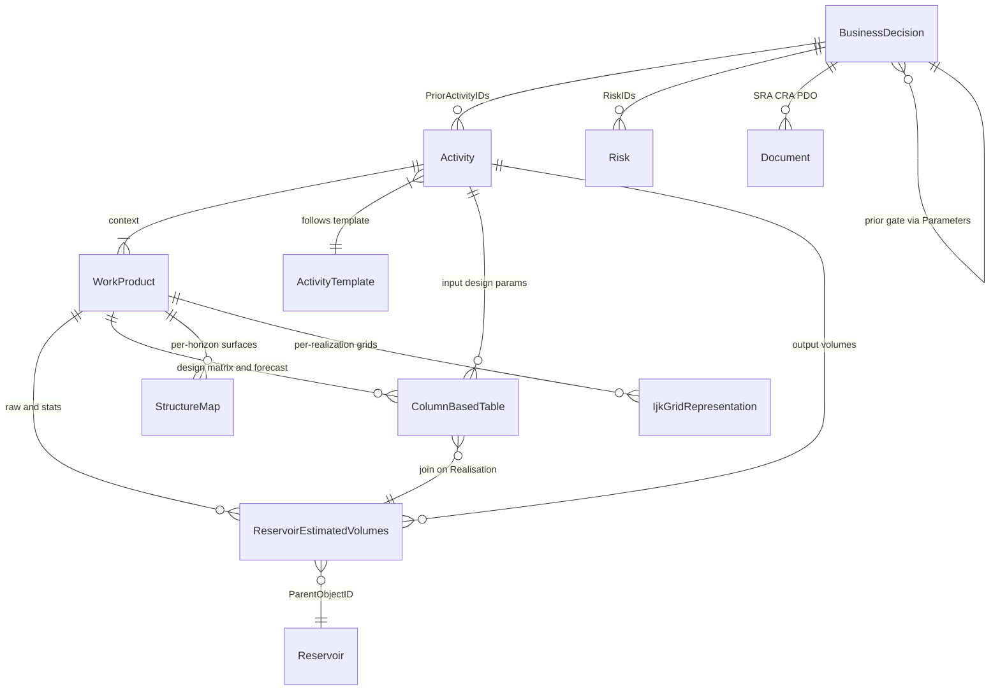
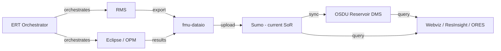

## OSDU Support for FMU Data Handling

> **Reference links**:
> - [fmu-dataio](https://github.com/equinor/fmu-dataio) - FMU data standard & metadata export library
> - [fmu-dataio data model](https://fmu-dataio.readthedocs.io/en/latest/datamodel/index.html) - FMU results metadata schema
> - [fmu-dataio simple exports](https://fmu-dataio.readthedocs.io/en/latest/simple_exports/index.html) - Standard result export functions
> - [fmu-sumo](https://github.com/equinor/fmu-sumo) - Interaction with Sumo (current SoR for FMU results)
> - [ERT](https://github.com/equinor/ert) - Ensemble-based Reservoir Tool (workflow orchestrator)
>
> **Related guides**: [BusinessDecision](/howto/business-decision) · [Volumes](/howto/volumes) · [Uncertainty](/howto/uncertainty) · [Risk](/howto/risk) · [SeisInt](/howto/seismic-interp) · [StratColumn](/howto/strat-column)

---

### 1. Purpose

This document describes how **OSDU** can serve as a **structured data management layer** for **FMU** (Fast Model Update) workflows - as a persistent System of Record and enabler for input provisioning, output management, and decision support across decision gates (DG1→DG4).

Three complementary objectives:

1. **System of Record** - OSDU as persistent SoR for FMU results. Structured, governed, version-controlled storage with OSDU data model semantics.
2. **Input provisioning** - OSDU as an organized source of input data: master data (reservoir, segments, stratigraphy), reference data (fluid contacts, uncertainties), surfaces, grids, well data.
3. **Decision support** - OSDU `BusinessDecision` records linking ensemble results to gates with full provenance.

---

### 2. Ground Rules

* **No breaking changes to FMU** workflow design, governance, or component roles.
* **Respect fmu-dataio as the metadata standard**: OSDU mapping preserves the fmu-dataio structure and supports round-trip.
* **One identity per artifact**: Each grid, property, map, and deck has a stable `UUID/SRN` and `version`.
* **Lossless provenance**: Every output carries ancestry back to exact input WPCs and FMU run.
* **CRS & units are first-class**: CRS definition, axis order, rotation, and UOM travel with the data.
* **Round-trip fidelity**: Data exported from Eclipse/OPM can be fully recovered from OSDU.
* **Gate alignment**: OSDU data model supports decision-gate lifecycle (DG1→DG4).

---

### 3. FMU ↔ OSDU Data Model Mapping

| FMU concept (fmu-dataio) | OSDU concept | Notes |
|---|---|---|
| `fmu.case` (name, uuid, model) | **WorkProduct** or **Dataspace** | Case = versioned package + partition boundary |
| `fmu.ensemble` (name, uuid) | **WorkProduct** or **PersistedCollection** | Ensemble package, one per iteration |
| `fmu.realization` (id, uuid) | Key column in WPC tables | Realization index as key in REV/CBT |
| `data.content = volumes` | `ReservoirEstimatedVolumes` WPC | Standard result: `inplace_volumes` |
| `data.content = surface` | `StructureMap` / `GenericRepresentation` WPC | Depth/time surfaces, isochores |
| `data.content = property` | Grid Property WPC (`IjkGridRepresentation`) | PORO, PERMX, SW, NTG, facies |
| `data.content = grid` | `IjkGridRepresentation` WPC | Static grid model geometry |
| `data.content = table` | `ColumnBasedTable` WPC | Design matrix, timeseries, production profiles |
| `data.content = polygons` | `GenericRepresentation` WPC | Outlines, fault lines |
| `data.content = seismic` | Seismic WPCs | Cubes, attribute maps |
| `fmu.ert.experiment` | `Activity` / `ActivityTemplate` | ERT experiment → OSDU Activity provenance |
| Design matrix (ERT parameters) | `ColumnBasedTable` WPC | Keys: CaseID, Realisation, Seed |
| Aggregated statistics | `ReservoirEstimatedVolumes` with FacetIDs | P10/P50/P90/Mean via `FacetType:statistics` |

#### OSDU types used

| OSDU type | Role in FMU context |
|---|---|
| **WorkProduct** | Versioned case/ensemble package |
| **WPC** | Atomic datasets: grids, properties, maps, tables, volumes |
| **PersistedCollection** | Evidence package for a gate |
| **Activity / ActivityTemplate** | Workflow provenance with `Parameters[]` |
| **BusinessDecision** | Decision gate record (DG1→DG4) |
| **Reservoir / ReservoirSegment** | Master-data anchors for volumes scoping |
| **GeoLabelSet** | Headline KPI labels for dashboards |

---

### 4. FMU Standard Results → OSDU Mapping

| Standard result | fmu-dataio export | OSDU record type |
|---|---|---|
| `inplace_volumes` | `export_inplace_volumes` (Parquet) | `ReservoirEstimatedVolumes` |
| `structure_depth_surface` | `export_structure_depth_surfaces` (.gri) | `StructureMap` WPC |
| `structure_time_surface` | `export_structure_time_surfaces` (.gri) | `StructureMap` / `GenericRepresentation` |
| `grid_model_static` | `export_grid_model_static` (.roff) | `IjkGridRepresentation` + property WPCs |
| Simulator tables (relperm, PVT, etc.) | Custom exports (CSV/Arrow) | `ColumnBasedTable` WPC |
| Polygons (faults, outlines) | Custom exports | `GenericRepresentation` WPC |

#### fmu-dataio → OSDU volume column mapping

> See [Volumes § 3](/howto/volumes) for the full column mapping table (`BULK`→Bulk, `STOIIP`→Oil, etc.) and JSON examples for both raw-realisation and aggregated-statistics REV records.

---

### 5. BusinessDecision Alignment with FMU Gates

| Gate | FMU scope | Key OSDU artifacts |
|---|---|---|
| **DG1** | Screening: few realizations, simple design matrix | Reservoir, Segments, REV, input params CBT, Risks, Activity, BD |
| **DG2** | Full ensemble (50–250 realizations), 30+ uncertainty variables | All DG1 + IjkGrid, StructureMaps, DevelopmentConcept, GeoLabelSet, production forecast, simulator tables |
| **DG3** | Dynamic simulation, history matching, well trajectories | All DG2 + WellboreTrajectory, ProductionValues |
| **DG4** | Full-field optimization, 100–1000+ realizations | All DG3 + history match metrics, updated forecasts |

The BD uses `Parameters[]` with `ParameterRole = input|output|context` to link all gate evidence.

---

### 6. Ensemble Data Relationships

Key patterns:
1. **WorkProduct per ensemble** - groups all WPCs for one iteration
2. **Realisation as key column** - avoids record explosion for many realizations
3. **Activity as workflow record** - links design matrix → static inputs → output WPCs
4. **BusinessDecision as gate record** - links Activities, Risks, Documents, and evidence
5. **Cross-gate evolution** - BD at DG(n+1) references BD at DG(n) as context parameter

---

### 7. Data Flow

---

### 8. Deck Round-Trip (Eclipse ⇄ OSDU)

A sidecar manifest accompanies every deck export:
* **Identity**: `deck_id`, `case`, `realization`
* **Grid**: `grid_uuid`, `osdu_srn`, `dims`, `crs`
* **Properties[]**: `property_uuid`, `title`, `ecl_keyword`, `uom`, `discrete`
* **Ancestry Inputs**: `[<wpc-id-grid>, <wpc-id-poro>, …]`

Round-trip rules:
1. **Grid Lock** - `grid_uuid` persists unless topology changes
2. **Property Lock** - each property retains `property_uuid` and Eclipse keyword
3. **CRS/UOM Lock** - manifest includes CRS type, origin, axis order, UOM
4. **Ancestry Chain** - outputs set `data.ancestry.inputs` to exact input WPC IDs

---

### 9. Component Responsibilities

| Component | Responsibility |
|---|---|
| **ERT** | Orchestrate FMU workflows - cases, ensembles, realizations, design matrix |
| **fmu-dataio** | Export data with rich metadata. Enforces data standard. |
| **Sumo** | Current cloud SoR - receives exports, indexes, serves queries |
| **pyetp / resqpy** | Stream arrays from OSDU RDDMS, build decks, convert formats |
| **OSDU** | Persist WPCs with governance, provenance, Collections, BusinessDecision |
| **FMU workflow** | Consume decks; echo `deck_id` in run metadata |

---

### 10. Open Items

#### High priority
- [ ] Grid + property WPC generators (IjkGridRepresentation + 10 properties)
- [ ] Surface / map WPC generators (StructureMap for depth, GenericRepresentation for derived maps)
- [ ] Automated fmu-dataio → OSDU converter (reads sidecars, produces manifests)
- [ ] Extend design matrix CBT to full parameter set
- [ ] Standardize BD parameter keys across gates

#### Medium priority
- [ ] Simulator table WPCs (relperm, PVT, completions)
- [ ] Polygon WPCs (fault lines, field outline)
- [ ] Per-realization surface handling at scale (aggregated vs raw strategy)
- [ ] Production profile ensemble WPC (per-realization rates)
- [ ] Sumo ↔ OSDU sync pipeline
- [ ] Economics WPC (dedicated schema or CBT)

#### Lower priority
- [ ] DG3/DG4 demo pipeline extension
- [ ] Cross-gate analytics API
- [ ] Ensemble lineage visualization
- [ ] Custom schema registry for FMU-specific concepts

---

### 11. References

| Topic | Link |
|---|---|
| fmu-dataio docs | [fmu-dataio.readthedocs.io](https://fmu-dataio.readthedocs.io/en/latest/) |
| Standard results | [Simple exports](https://fmu-dataio.readthedocs.io/en/latest/simple_exports/index.html) |
| ERT | [github.com/equinor/ert](https://github.com/equinor/ert) |
| Sumo | [github.com/equinor/fmu-sumo](https://github.com/equinor/fmu-sumo) |
| REV schema (OSDU) | [OSDU Data Definitions](https://community.opengroup.org/osdu/data/data-definitions) |
| Activity semantics | [AbstractProjectActivity](https://community.opengroup.org/osdu/data/data-definitions) |
| Volume guide | [Volumes](/howto/volumes) |
| Uncertainty guide | [Uncertainty](/howto/uncertainty) |
