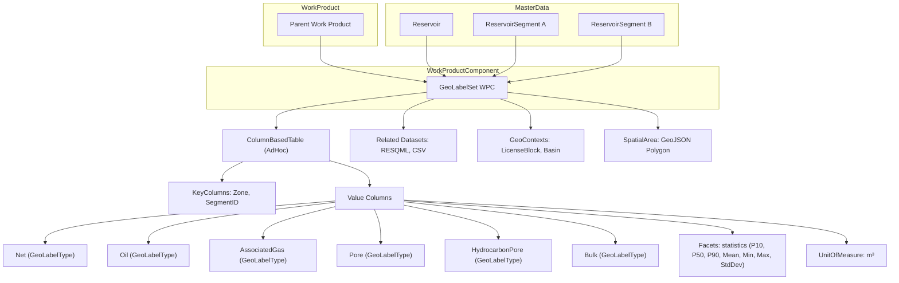

# GeoLabelSet for Reservoir Volumes & Statistics — README (Aligned & Expanded)

> **Scope:** This guide explains **how to use the `work-product-component--GeoLabelSet` manifest** to publish consolidated **volumetrics** and **volume statistics** (e.g., Net, Oil, Associated Gas, Pore, Hydrocarbon Pore, Bulk with **P10/P50/P90**, **ArithmeticMean**, **Minimum**, **Maximum**, **StandardDeviation**) for a **Reservoir** and its **ReservoirSegments** in OSDU. It preserves the **background**, **use cases**, and **options** from the original README and updates all sections to match your **actual example** with **reference-data values**.

> **References:**
> • GeoLabelSet WPC definition and schema — [OSDU Data Definitions — GeoLabelSet][ref-geolabelset-md] · [Shared schema JSON][ref-geolabelset-json]
> • GeoLabelType & Facets usage (statistics facets, unit quantity) — [GeoLabelType 1.0.x][ref-geolabeltype] · Worked Examples (GeoLabels README)[ref-worked-examples]
> • ColumnBasedTableType & ColumnBasedTable usage — [ColumnBasedTableType 1.1.0][ref-columntype-md] · Example record[ref-columntype-json]
> • OSDU platform docs and schema usage guide — [Platform Documentation][ref-platform] · [Data Definitions overview][ref-overview]

---

## 1. What GeoLabelSet is (background)
**GeoLabelSet** is an OSDU **Work‑Product Component (WPC)** intended to publish a **set of geological labels and values** for a targeted entity (Reservoir, ReservoirSegment, Field, Prospect, Well/Wellbore). It is ideal for **derived, consolidated properties** such as volumetrics and uncertainty bands, rather than raw arrays/grids.

The pattern used is **ColumnBasedTable** to store a dense matrix of **statistics by `Zone` and `SegmentID`**, with value columns like `Net.P10`, `Oil.P50`, `AssociatedGas.ArithmeticMean`, etc. Each **value column** binds to:
- a **GeoLabelType** (e.g., `Net`, `Oil`, `AssociatedGas`, `Pore`, `HydrocarbonPore`, `Bulk`),
- one or more **FacetIDs** (e.g., statistics roles `P10`, `P50`, `P90`, `ArithmeticMean`, `Minimum`, `Maximum`, `StandardDeviation`),
- a **UnitOfMeasureID** (e.g., `m3`).

> Avoid GeoLabelSet if you need to store **raw arrays/grids** or **document narratives** — use **RESQML representation datasets** or **Document WPC** instead.

---

## 2. When to use GeoLabelSet (use cases)
Use **GeoLabelSet** when you want to:
- **Publish volumetrics & statistics** as a consumable table for **dashboards**, **screening**, **reporting**, or **benchmarking** (e.g., P10/P50/P90, mean, min/max, stdev).
- **Label** a **Reservoir** or **ReservoirSegment(s)** with results from modeling or evaluation.
- **Attach scenario/context facets** (e.g., `statistics:P50`, `scenario:BASE/LOW/HIGH`) to enable robust filtering and comparisons.
- **Provide spatial/geopolitical context** (`SpatialArea` GeoJSON, `GeoContexts`) for map‑based discovery and queries.
- **Link provenance** to inputs (`RelatedDatasets` — RESQML grid properties, CSV summaries, simulation outputs).

**Do not use** GeoLabelSet as a replacement for raw subsurface data — use Energistics/RESQML datasets for arrays/grids.

---

## 3. Inputs you should have ready
1. **Labelled entity IDs**  
   The **Reservoir** and/or **ReservoirSegment** SRNs you are labeling (e.g., `dev:master-data--Reservoir:<uuid>:1`, `dev:master-data--ReservoirSegment:<uuid>:1`).
2. **Volumetrics table**  
   - Keys: `Zone`, `SegmentID` (match your segmentation scheme).  
   - Value columns: for each property (**Net**, **Oil**, **AssociatedGas**, **Pore**, **HydrocarbonPore**, **Bulk**) include statistics (**P10**, **P50**, **P90**, **ArithmeticMean**, **Minimum**, **Maximum**, **StandardDeviation**).  
   - Units: explicit `UnitOfMeasureID` per column (e.g., `m3`).
3. **Facet references**  
   - `FacetType=statistics` with roles like `P10`, `P50`, `P90`, `ArithmeticMean`, `Minimum`, `Maximum`, `StandardDeviation`.  
   - *(Optional)* `FacetType=scenario` with roles like `BASE`, `LOW`, `HIGH`, `BASE_2025Q3`, etc.
4. **Governance**  
   - `acl` (owners/viewers) and `legal.legaltags` set for your dataspace; `otherRelevantDataCountries` if applicable.
5. **Provenance (recommended)**  
   - `RelatedDatasets[]` linking to inputs (RESQML grid properties, CSV summaries, etc.).
6. **Spatial & context (optional but helpful)**  
   - `data.SpatialArea.Wgs84Coordinates` (GeoJSON polygon) and `data.GeoContexts[]` (e.g., LicenseBlock, Basin).

---

## 4. Data model — aligned to your example

### 4.1 Core identity & governance
- **Kind**: `osdu:wks:work-product-component--GeoLabelSet:1.0.0`
- **ACL & legal**: Owners/viewers groups and `legaltags` present (e.g., `dev-equinor-private-default`).
- **Work product & ancestry**: `data.ParentWorkProductID` references the study; `data.ancestry.parents` and `data.ancestry.children` link to Reservoir and its segments.

```json
{
  "id": "dev:work-product-component--GeoLabelSet:d92d1630-1c61-40f3-af65-8e799ca061d0:1",
  "kind": "osdu:wks:work-product-component--GeoLabelSet:1.0.0",
  "acl": {
    "owners": ["data.default.owners@dev.dataservices.energy"],
    "viewers": ["data.office.global.viewers@dev.dataservices.energy"]
  },
  "legal": {
    "legaltags": ["dev-equinor-private-default"],
    "otherRelevantDataCountries": ["NO"]
  },
  "data": {
    "Name": "GeoLabelSet",
    "Description": "GeoLabelSet derived from statistics manifest",
    "ParentWorkProductID": "dev:work-product:5c3ed75a-1b0d-45ac-b1f4-4b55d735eb4c:1",
    "ancestry": {
      "parents": [
        "dev:master-data--Reservoir:f9585655-83d8-4549-ae3e-2dffc2cd5937:1"
      ],
      "children": [
        "dev:master-data--ReservoirSegment:32fb46f2-fe6f-45a0-9f9d-43af174d8de9:1",
        "dev:master-data--ReservoirSegment:6cf0458b-0163-4fab-938a-501c00f565f6:1",
        "dev:master-data--ReservoirSegment:25061b6b-dcac-4efe-af9f-3da45de43ecf:1"
      ]
    }
  }
}
```

> *Optional improvement:* Add `data.LabelledEntityID` to explicitly strengthen the link per schema guidance:
```json
{
  "LabelledEntityID": "dev:master-data--Reservoir:f9585655-83d8-4549-ae3e-2dffc2cd5937:1"
}
```

### 4.2 ColumnBasedTable (dense statistics)
- `ColumnBasedTableTypeID`: `dev:reference-data--ColumnBasedTableType:AdHoc`
- `KeyColumns`: `Zone` (string), `SegmentID` (string)
- `Columns`: for each metric/statistic combination define:
  - `ColumnName` (e.g., `Net.P50`)
  - `GeoLabelTypeID` (e.g., `dev:reference-data--GeoLabelType:Net`)
  - `FacetIDs`: `FacetType=statistics`, `FacetRole=P50` (and optional scenario facet)
  - `UnitOfMeasureID` (e.g., `dev:reference-data--UnitOfMeasure:m3`)

```json
{
  "ColumnName": "Net.P50",
  "ColumnRole": "Value",
  "ValueType": "number",
  "GeoLabelTypeID": "dev:reference-data--GeoLabelType:Net",
  "UnitOfMeasureID": "dev:reference-data--UnitOfMeasure:m3",
  "FacetIDs": [
    {
      "FacetTypeID": "dev:reference-data--FacetType:statistics",
      "FacetRoleID": "dev:reference-data--FacetRole:P50"
    }
  ]
}
```

### 4.3 Facets (statistics & scenarios)
- **Statistics facet (required per value column):** `FacetType=statistics` with roles `P10`, `P50`, `P90`, `ArithmeticMean`, `Minimum`, `Maximum`, `StandardDeviation`.
- **Scenario facet (optional):** add `FacetType=scenario` with roles (e.g., `BASE`, `LOW`, `HIGH`) to distinguish model cases and enable filtering.

```json
{
  "FacetIDs": [
    { "FacetTypeID": "dev:reference-data--FacetType:statistics",
      "FacetRoleID": "dev:reference-data--FacetRole:P50" },
    { "FacetTypeID": "dev:reference-data--FacetType:scenario",
      "FacetRoleID": "dev:reference-data--FacetRole:BASE" }
  ]
}
```

### 4.4 Units & quantities
- **UnitQuantity** is defined by **GeoLabelType**; the **actual unit** is declared **per column/value** (e.g., `m3`). This avoids constraining all instances to a single unit.

### 4.5 Context & provenance
- **Provenance**: Use `RelatedDatasets[]` to link inputs (RESQML grids, CSV summaries).  
- **GeoContexts & SpatialArea**: optional but helpful for spatial/geopolitical discovery.

```json
{
  "RelatedDatasets": [
    "dev:dataset--RESQML:<uuid>:1",
    "dev:dataset--CSV:<uuid>:1"
  ],
  "GeoContexts": ["LicenseBlock:Block42", "Basin:NorthSea"],
  "SpatialArea": { "Wgs84Coordinates": { "type": "Polygon", "coordinates": [[[5.0, 59.0], [5.2, 59.0], [5.2, 59.2], [5.0, 59.2], [5.0, 59.0]]] } }
}
```



---

## 5. How to author & ingest (step‑by‑step)
1. **Collect inputs** (keys, values, units, facet roles, labelled entity IDs, work product ID, spatial context, datasets).  
2. **Map properties** to **GeoLabelTypes** (Net, Oil, AssociatedGas, Pore, HydrocarbonPore, Bulk).  
3. **Assign statistics facets** to each value column (`FacetType=statistics`, roles as needed).  
4. **(Optional) Add scenario facets** to distinguish model cases (BASE/LOW/HIGH or vintage).  
5. **Declare units per column/value** (`UnitOfMeasureID`, consistent across the column).  
6. **Build the ColumnBasedTable**: define `KeyColumns` (Zone, SegmentID); define `Columns` (each metric×stat pairing); populate `ColumnValues` rows (include aggregate rows such as `Zone="TOTAL"`).  
7. **Link provenance** via `RelatedDatasets[]`.  
8. **Add LabelledEntityID**, `GeoContexts`, and `SpatialArea` if applicable.  
9. **Validate and ingest** via your OSDU Manifest ingestion workflow.

---

## 6. Querying & consumption patterns

### 6.1 Find GeoLabelSets for a Reservoir/Segment
Search filtered by **kind** and **ancestry**:
```json
{
  "kind": "osdu:wks:work-product-component--GeoLabelSet:1.0.0",
  "query": "data.ancestry.parents:\"dev:master-data--Reservoir:f9585655-83d8-4549-ae3e-2dffc2cd5937:1\"",
  "returnedFields": ["id", "data.Name", "data.ParentWorkProductID", "data.ancestry.parents"]
}
```
```json
{
  "kind": "osdu:wks:work-product-component--GeoLabelSet:1.0.0",
  "query": "data.ancestry.children:\"dev:master-data--ReservoirSegment:32fb46f2-fe6f-45a0-9f9d-43af174d8de9:1\"",
  "returnedFields": ["id", "data.Name", "data.ancestry.children"]
}
```

### 6.2 Filter by Work Product
```json
{
  "kind": "osdu:wks:work-product-component--GeoLabelSet:1.0.0",
  "query": "data.ParentWorkProductID:\"dev:work-product:5c3ed75a-1b0d-45ac-b1f4-4b55d735eb4c:1\"",
  "returnedFields": ["id", "data.Name", "data.ParentWorkProductID"]
}
```

### 6.3 If using `LabelledEntityID`
```json
{
  "kind": "osdu:wks:work-product-component--GeoLabelSet:1.0.0",
  "query": "data.LabelledEntityID:\"dev:master-data--Reservoir:f9585655-83d8-4549-ae3e-2dffc2cd5937:1\""
}
```

### 6.4 Facet-based filtering (optional scenarios)
When scenario facets are present:
```json
{
  "kind": "osdu:wks:work-product-component--GeoLabelSet:1.0.0",
  "query": "data.GeoLabels.Columns.FacetIDs.FacetRoleID:\"dev:reference-data--FacetRole:BASE\""
}
```

---

## 7. Options & design choices (from original README + example)
- **Scenario support**: add `FacetType=scenario` with roles for CASE or vintage separation (e.g., `BASE`, `LOW`, `HIGH`, `2025Q3_BASE`).
- **Segmentation strategy**: keys can be `Zone` + `SegmentID`, or alternative keys like `Layer`, `WellGroup`, `Block`, `Compartment` — choose what matches your reservoir architecture.
- **Metrics extension**: beyond the example metrics (Net, Oil, AssociatedGas, Pore, HydrocarbonPore, Bulk), add `Water`, `GasCap`, `RecoveryFactor`, etc., each with **GeoLabelType**, **FacetIDs**, and **UnitOfMeasure**.
- **Units per column**: the example uses `m3`; you can mix units (e.g., `bbl` for Oil, `Sm3` for gas) if each column declares its unit explicitly.
- **Totals/aggregates**: include `Zone="TOTAL"` (and `SegmentID="Totals"`) for portfolio roll‑ups.
- **Spatial & GeoContexts**: provide `SpatialArea` polygons and `GeoContexts` to facilitate geopolitics/licensing queries.
- **Lineage**: always link `RelatedDatasets` for reproducibility and audit trails.
- **Governance**: ensure ACLs and legal tags follow the target partition policy.

---

## 8. Validation checklist (pre‑ingest)
- ✅ **Reference-data SRNs exist**:
  - `dev:reference-data--ColumnBasedTableType:AdHoc`
  - `dev:reference-data--FacetType:statistics`
  - `dev:reference-data--FacetRole:P10|P50|P90|ArithmeticMean|Minimum|Maximum|StandardDeviation`
  - `dev:reference-data--GeoLabelType:Net|Oil|AssociatedGas|Pore|HydrocarbonPore|Bulk`
  - `dev:reference-data--UnitOfMeasure:m3` (and any additional units you plan to use)
- ✅ **Governance** correct: ACL owners/viewers, legal tags, `otherRelevantDataCountries`.
- ✅ **Linkage** correct: `ParentWorkProductID`, `ancestry.parents/children` (and optional `LabelledEntityID`).
- ✅ **Table completeness**: `KeyColumns` present; full metric×stat `Columns`; `ColumnValues` rows include required keys & values; aggregates consistent.
- ✅ **Optional context**: `RelatedDatasets`, `GeoContexts`, `SpatialArea` provided when useful.

---

## 9. Minimal template (guided by the example)
```json
{
  "kind": "osdu:wks:work-product-component--GeoLabelSet:1.0.0",
  "acl": { "owners": ["<owners>"], "viewers": ["<viewers>"] },
  "legal": { "legaltags": ["<tag>"], "otherRelevantDataCountries": ["NO"] },
  "data": {
    "Name": "GeoLabelSet",
    "ParentWorkProductID": "<work-product-srn>",
    "ancestry": { "parents": ["<reservoir-srn>"], "children": ["<segment-srn>"] },
    "LabelledEntityID": "<optional-main-entity-srn>",
    "GeoLabels": {
      "ColumnBasedTableTypeID": "dev:reference-data--ColumnBasedTableType:AdHoc",
      "KeyColumns": [
        { "ColumnName": "Zone", "ColumnRole": "Key", "ValueType": "string" },
        { "ColumnName": "SegmentID", "ColumnRole": "Key", "ValueType": "string" }
      ],
      "Columns": [
        {
          "ColumnName": "Net.P50",
          "ColumnRole": "Value",
          "ValueType": "number",
          "GeoLabelTypeID": "dev:reference-data--GeoLabelType:Net",
          "UnitOfMeasureID": "dev:reference-data--UnitOfMeasure:m3",
          "FacetIDs": [
            { "FacetTypeID": "dev:reference-data--FacetType:statistics", "FacetRoleID": "dev:reference-data--FacetRole:P50" }
          ]
        }
        /* repeat for Oil, AssociatedGas, Pore, HydrocarbonPore, Bulk and other statistics */
      ],
      "ColumnValues": [
        { "Zone": "TOTAL", "SegmentID": "Totals", "Net.P50": 0.0 /* ... more metric×stat values */ }
      ]
    }
  }
}
```

---

## 10. Example value rows (abbrev.)
```json
{
  "Zone": "Heimdal",
  "SegmentID": "2",
  "Net.P50": 198326110.1,
  "Oil.P50": 48677709.51,
  "AssociatedGas.P50": 1289959302.0,
  "Pore.P50": 65675557.11,
  "HydrocarbonPore.P50": 53496801.46,
  "Bulk.P50": 201145181.9
}
```
```json
{
  "Zone": "TOTAL",
  "SegmentID": "Totals",
  "Net.P50": 468972003.8,
  "Oil.P50": 118131933.5,
  "AssociatedGas.P50": 2794402073.0,
  "Pore.P50": 157143920.6,
  "HydrocarbonPore.P50": 132101323.8,
  "Bulk.P50": 723229193.3
}
```

---

## 11. Reference-data catalogue used in the example (DEV partition)
- **ColumnBasedTableType:** `dev:reference-data--ColumnBasedTableType:AdHoc`
- **FacetType (statistics):** `dev:reference-data--FacetType:statistics`
- **FacetRole (statistics):** `dev:reference-data--FacetRole:P10|P50|P90|ArithmeticMean|Minimum|Maximum|StandardDeviation`
- **GeoLabelType:** `dev:reference-data--GeoLabelType:Net|Oil|AssociatedGas|Pore|HydrocarbonPore|Bulk`
- **UnitOfMeasure:** `dev:reference-data--UnitOfMeasure:m3`

---

## 12. Notes & alignment
- This README is aligned with your **DEV** example (Equinor DEV partition SRNs and groups). For non‑DEV, replace **groups**, **legal tags**, and **SRN prefixes** accordingly.
- The example **does not** include `LabelledEntityID`; it is **recommended** for explicit linkage and easier querying.
- Scenario facets are **optional**; include only if you need case/vintage separation.

---

[ref-geolabelset-md]: https://community.opengroup.org/osdu/data/data-definitions
[ref-geolabelset-json]: https://community.opengroup.org/osdu/data/data-definitions
[ref-geolabeltype]: https://community.opengroup.org/osdu/data/data-definitions
[ref-worked-examples]: https://community.opengroup.org/osdu/data/data-definitions
[ref-columntype-md]: https://community.opengroup.org/osdu/data/data-definitions
[ref-columntype-json]: https://community.opengroup.org/osdu/data/data-definitions
[ref-platform]: https://community.opengroup.org/osdu/platform
[ref-overview]: https://community.opengroup.org/osdu
