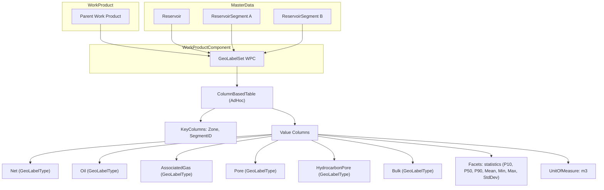

# GeoLabelSet for Reservoir Volumes & Statistics

> **Scope:** How to use the `work-product-component--GeoLabelSet` manifest to publish consolidated **volumetrics** and **volume statistics** (P10/P50/P90, ArithmeticMean, Minimum, Maximum, StandardDeviation) for a **Reservoir** and its **ReservoirSegments** in OSDU.

> **References:**
> - [GeoLabelSet WPC schema](https://community.opengroup.org/osdu/data/data-definitions/-/blob/master/Shared/WorkProductComponent/GeoLabelSet.1.0.0.md) · [JSON schema](https://community.opengroup.org/osdu/data/data-definitions/-/blob/master/Shared/WorkProductComponent/GeoLabelSet.1.0.0.json)
> - [GeoLabelType 1.0.x](https://community.opengroup.org/osdu/data/data-definitions/-/blob/master/Shared/ReferenceData/GeoLabelType.1.0.0.md)
> - [ColumnBasedTableType 1.1.0](https://community.opengroup.org/osdu/data/data-definitions/-/blob/master/Shared/WorkProductComponent/ColumnBasedTableType.1.1.0.md)
> - [OSDU Data Definitions overview](https://community.opengroup.org/osdu/data/data-definitions/-/blob/master/README.md)

---

## 1. What GeoLabelSet Is

**GeoLabelSet** is an OSDU **Work-Product Component (WPC)** for publishing a **set of geological labels and values** for a targeted entity (Reservoir, ReservoirSegment, Field, Prospect, Well/Wellbore). Ideal for **derived, consolidated properties** such as volumetrics and uncertainty bands.

The pattern uses **ColumnBasedTable** to store a dense matrix of **statistics by Zone and SegmentID**, with value columns binding to:
- a **GeoLabelType** (e.g., `Net`, `Oil`, `AssociatedGas`, `Pore`, `HydrocarbonPore`, `Bulk`),
- one or more **FacetIDs** (e.g., `P10`, `P50`, `P90`, `ArithmeticMean`, `Minimum`, `Maximum`, `StandardDeviation`),
- a **UnitOfMeasureID** (e.g., `m3`).

> Avoid GeoLabelSet for **raw arrays/grids** - use RESQML representation datasets or Document WPC instead.

---

## 2. When to Use GeoLabelSet

- **Publish volumetrics & statistics** as a consumable table for dashboards, screening, reporting, or benchmarking.
- **Label** a Reservoir or ReservoirSegment(s) with results from modelling or evaluation.
- **Attach scenario/context facets** (`statistics:P50`, `scenario:BASE/LOW/HIGH`) for filtering and comparison.
- **Provide spatial/geopolitical context** (GeoJSON, `GeoContexts`) for map-based discovery.
- **Link provenance** to inputs (`RelatedDatasets` - RESQML grid properties, CSV summaries, simulation outputs).

---

## 3. Inputs You Should Have Ready

1. **Labelled entity IDs** - Reservoir and/or ReservoirSegment SRNs.
2. **Volumetrics table** - Keys: `Zone`, `SegmentID`. Value columns per property (Net, Oil, AssociatedGas, Pore, HydrocarbonPore, Bulk) with statistics. Units per column.
3. **Facet references** - `FacetType=statistics` with roles. Optionally `FacetType=scenario`.
4. **Governance** - ACL owners/viewers and `legaltags`.
5. **Provenance (recommended)** - `RelatedDatasets[]` linking to inputs.
6. **Spatial & context (optional)** - `data.SpatialArea.Wgs84Coordinates` and `data.GeoContexts[]`.

---

## 4. Data Model

### 4.1 Core Identity & Governance

- **Kind**: `osdu:wks:work-product-component--GeoLabelSet:1.0.0`
- **ACL & legal**: Owners/viewers groups and `legaltags`.
- **Work product & ancestry**: `data.ParentWorkProductID` references the study; `data.ancestry.parents/children` link to Reservoir and segments.

```json
{
  "id": "<partition>:work-product-component--GeoLabelSet:<uuid>:1",
  "kind": "osdu:wks:work-product-component--GeoLabelSet:1.0.0",
  "acl": {
    "owners": ["data.default.owners@<partition>.dataservices.energy"],
    "viewers": ["data.default.viewers@<partition>.dataservices.energy"]
  },
  "legal": { "legaltags": ["<partition>-private-default"], "otherRelevantDataCountries": ["NO"] },
  "data": {
    "Name": "GeoLabelSet",
    "Description": "Volumetric statistics for reservoir segments",
    "ParentWorkProductID": "<partition>:work-product:<uuid>:1",
    "ancestry": {
      "parents": ["<partition>:master-data--Reservoir:<uuid>:1"],
      "children": [
        "<partition>:master-data--ReservoirSegment:<uuid-1>:1",
        "<partition>:master-data--ReservoirSegment:<uuid-2>:1"
      ]
    }
  }
}
```

> *Optional*: Add `data.LabelledEntityID` to explicitly strengthen the link per schema guidance.

### 4.2 ColumnBasedTable (Dense Statistics)

- `ColumnBasedTableTypeID`: `<partition>:reference-data--ColumnBasedTableType:AdHoc`
- `KeyColumns`: `Zone` (string), `SegmentID` (string)
- `Columns`: for each metric/statistic combination:
  - `ColumnName` (e.g., `Net.P50`)
  - `GeoLabelTypeID` (e.g., `<partition>:reference-data--GeoLabelType:Net`)
  - `FacetIDs`: `FacetType=statistics`, `FacetRole=P50`
  - `UnitOfMeasureID` (e.g., `<partition>:reference-data--UnitOfMeasure:m3`)

```json
{
  "ColumnName": "Net.P50",
  "ColumnRole": "Value",
  "ValueType": "number",
  "GeoLabelTypeID": "<partition>:reference-data--GeoLabelType:Net",
  "UnitOfMeasureID": "<partition>:reference-data--UnitOfMeasure:m3",
  "FacetIDs": [
    { "FacetTypeID": "<partition>:reference-data--FacetType:statistics",
      "FacetRoleID": "<partition>:reference-data--FacetRole:P50" }
  ]
}
```

### 4.3 Facets (Statistics & Scenarios)

- **Statistics facet (required per value column):** `FacetType=statistics` with roles `P10`, `P50`, `P90`, `ArithmeticMean`, `Minimum`, `Maximum`, `StandardDeviation`.
- **Scenario facet (optional):** `FacetType=scenario` with roles (e.g., `BASE`, `LOW`, `HIGH`) for model-case separation.

```json
{
  "FacetIDs": [
    { "FacetTypeID": "<partition>:reference-data--FacetType:statistics",
      "FacetRoleID": "<partition>:reference-data--FacetRole:P50" },
    { "FacetTypeID": "<partition>:reference-data--FacetType:scenario",
      "FacetRoleID": "<partition>:reference-data--FacetRole:BASE" }
  ]
}
```

### 4.4 Units & Quantities

**UnitQuantity** is defined by GeoLabelType; the actual unit is declared per column (e.g., `m3`). This avoids constraining all instances to a single unit.

### 4.5 Context & Provenance

```json
{
  "RelatedDatasets": ["<partition>:dataset--RESQML:<uuid>:1"],
  "GeoContexts": ["LicenseBlock:Block42", "Basin:NorthSea"],
  "SpatialArea": { "Wgs84Coordinates": { "type": "Polygon", "coordinates": [[[5.0, 59.0], [5.2, 59.0], [5.2, 59.2], [5.0, 59.2], [5.0, 59.0]]] } }
}
```



---

## 5. How to Author & Ingest

1. **Collect inputs** (keys, values, units, facet roles, labelled entity IDs, work product ID).
2. **Map properties** to GeoLabelTypes (Net, Oil, AssociatedGas, Pore, HydrocarbonPore, Bulk).
3. **Assign statistics facets** to each value column.
4. **(Optional) Add scenario facets** for model-case separation.
5. **Declare units** per column (`UnitOfMeasureID`).
6. **Build the ColumnBasedTable**: define KeyColumns (Zone, SegmentID); define Columns (metric×stat); populate ColumnValues. Include aggregate rows (e.g., `Zone="TOTAL"`).
7. **Link provenance** via `RelatedDatasets[]`.
8. **Add LabelledEntityID**, `GeoContexts`, and `SpatialArea` if applicable.
9. **Validate and ingest** via OSDU Manifest ingestion workflow.

---

## 6. Querying & Consumption Patterns

### 6.1 Find GeoLabelSets for a Reservoir/Segment

```json
{
  "kind": "osdu:wks:work-product-component--GeoLabelSet:1.0.0",
  "query": "data.ancestry.parents:\"<partition>:master-data--Reservoir:<uuid>:1\"",
  "returnedFields": ["id", "data.Name", "data.ParentWorkProductID"]
}
```

### 6.2 Filter by Work Product

```json
{
  "kind": "osdu:wks:work-product-component--GeoLabelSet:1.0.0",
  "query": "data.ParentWorkProductID:\"<partition>:work-product:<uuid>:1\""
}
```

### 6.3 LabelledEntityID Query

```json
{
  "kind": "osdu:wks:work-product-component--GeoLabelSet:1.0.0",
  "query": "data.LabelledEntityID:\"<partition>:master-data--Reservoir:<uuid>:1\""
}
```

### 6.4 Facet-Based Filtering (Scenarios)

```json
{
  "kind": "osdu:wks:work-product-component--GeoLabelSet:1.0.0",
  "query": "data.GeoLabels.Columns.FacetIDs.FacetRoleID:\"<partition>:reference-data--FacetRole:BASE\""
}
```

---

## 7. Design Choices

- **Scenario support**: add `FacetType=scenario` for CASE/vintage separation.
- **Segmentation strategy**: keys can be Zone + SegmentID, or alternative keys (Layer, WellGroup, Compartment).
- **Metrics extension**: beyond core 6 (Net, Oil, AssociatedGas, Pore, HydrocarbonPore, Bulk), add Water, GasCap, RecoveryFactor - each with GeoLabelType, FacetIDs, and UnitOfMeasure.
- **Units per column**: mix units (e.g., bbl for Oil, Sm3 for gas) if each column declares its unit.
- **Totals/aggregates**: include `Zone="TOTAL"` for portfolio roll-ups.
- **Lineage**: always link `RelatedDatasets` for reproducibility and audit trails.

---

## 8. Validation Checklist (Pre-Ingest)

- Reference-data SRNs exist: ColumnBasedTableType, FacetType, FacetRole(s), GeoLabelType(s), UnitOfMeasure
- Governance correct: ACL owners/viewers, legal tags
- Linkage correct: `ParentWorkProductID`, `ancestry.parents/children`, optional `LabelledEntityID`
- Table completeness: KeyColumns present; full metric×stat Columns; ColumnValues include aggregates
- Optional context: `RelatedDatasets`, `GeoContexts`, `SpatialArea` provided when useful

---

## 9. Minimal Template

```json
{
  "kind": "osdu:wks:work-product-component--GeoLabelSet:1.0.0",
  "acl": { "owners": ["<owners>"], "viewers": ["<viewers>"] },
  "legal": { "legaltags": ["<tag>"], "otherRelevantDataCountries": ["NO"] },
  "data": {
    "Name": "GeoLabelSet",
    "ParentWorkProductID": "<work-product-srn>",
    "ancestry": { "parents": ["<reservoir-srn>"], "children": ["<segment-srn>"] },
    "LabelledEntityID": "<optional-main-entity-srn>",
    "GeoLabels": {
      "ColumnBasedTableTypeID": "<partition>:reference-data--ColumnBasedTableType:AdHoc",
      "KeyColumns": [
        { "ColumnName": "Zone", "ColumnRole": "Key", "ValueType": "string" },
        { "ColumnName": "SegmentID", "ColumnRole": "Key", "ValueType": "string" }
      ],
      "Columns": [
        {
          "ColumnName": "Net.P50",
          "ColumnRole": "Value",
          "ValueType": "number",
          "GeoLabelTypeID": "<partition>:reference-data--GeoLabelType:Net",
          "UnitOfMeasureID": "<partition>:reference-data--UnitOfMeasure:m3",
          "FacetIDs": [
            { "FacetTypeID": "<partition>:reference-data--FacetType:statistics",
              "FacetRoleID": "<partition>:reference-data--FacetRole:P50" }
          ]
        }
      ],
      "ColumnValues": [
        { "Zone": "TOTAL", "SegmentID": "Totals", "Net.P50": 0.0 }
      ]
    }
  }
}
```

---

## 10. References

- [GeoLabelSet WPC](https://community.opengroup.org/osdu/data/data-definitions/-/blob/master/Shared/WorkProductComponent/GeoLabelSet.1.0.0.md)
- [GeoLabelType](https://community.opengroup.org/osdu/data/data-definitions/-/blob/master/Shared/ReferenceData/GeoLabelType.1.0.0.md)
- [ColumnBasedTableType](https://community.opengroup.org/osdu/data/data-definitions/-/blob/master/Shared/WorkProductComponent/ColumnBasedTableType.1.1.0.md)
- [Worked Examples - GeoLabels](https://community.opengroup.org/osdu/data/data-definitions/-/tree/master/WorkedExamples/GeoLabels)
- [OSDU Ingestion Workflow](https://community.opengroup.org/osdu/platform/data-flow/ingestion/ingestion-workflow)
