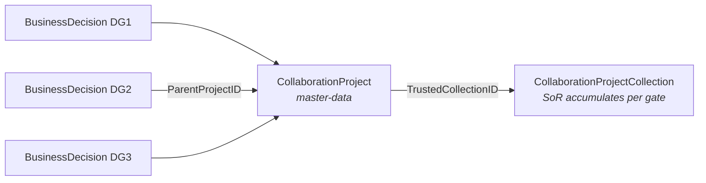
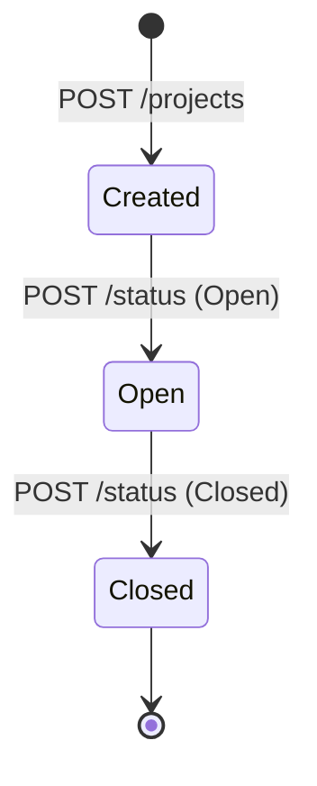
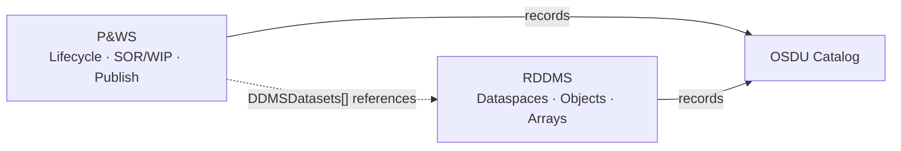
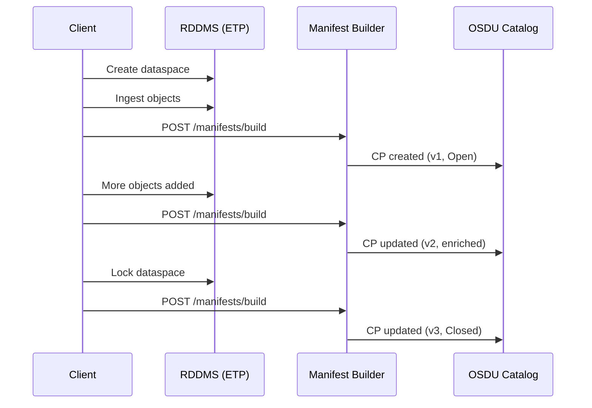
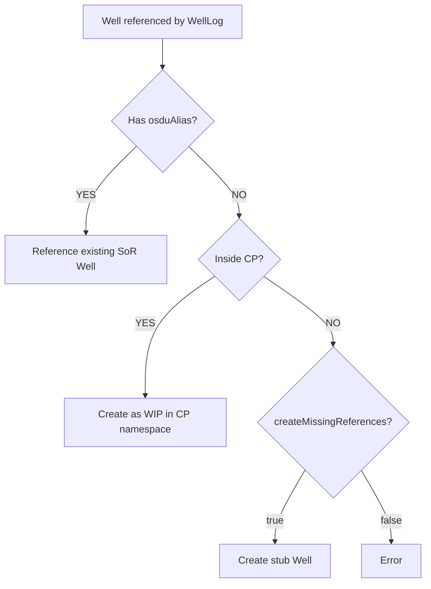
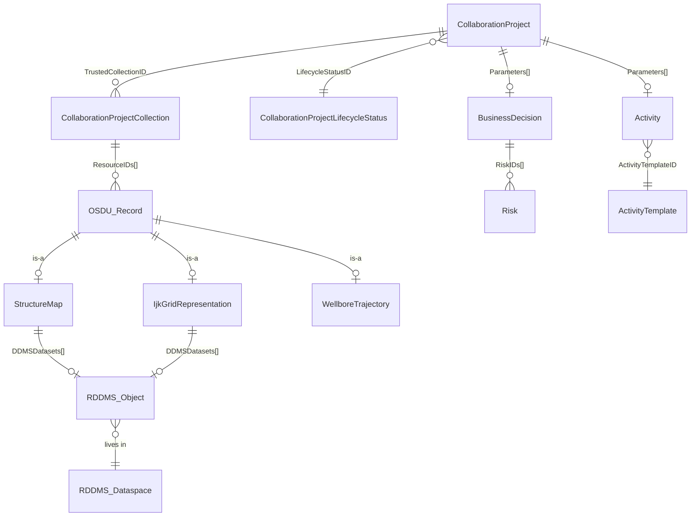

# Project & Workflow Service (P&WS)

> **Base path**: `/api/pws/v1` · **Kind**: `osdu:wks:master-data--CollaborationProject:1.0.0`  
> **Related**: [Activity](/howto/activity) · [BusinessDecision](/howto/business-decision) · [Volumes](/howto/volumes) · [Risk](/howto/risk) · [Query](/howto/query-guide)

> [!IMPORTANT]
> **Availability (June 2026)**: P&WS exists as an AWS provider (`provider/pws-aws`) but is **not deployed on Azure ADME**. The schemas are defined in OSDU Data Definitions and work today via the Storage API on any platform. This guide covers both the P&WS API (for when it ships) and **preparation patterns** using existing OSDU + RDDMS capabilities.

---

## 1. What Is a CollaborationProject?

A `CollaborationProject` is **master-data** — a persistent namespace that bridges the System of Engagement (SoE: WIP collaboration) and System of Record (SoR: curated artefacts). It persists across decision gates (DG1 → DG2 → DG3 → FID), accumulating trusted data at each gate.



| Concept | Kind | Role |
|---------|------|------|
| **CollaborationProject** | `master-data` | Persistent cross-DG namespace |
| **CollaborationProjectCollection** | `work-product-component` | Versioned SoR accumulator (ResourceIDs[]) |
| **CollaborationProjectLifecycleStatus** | `reference-data` | Open / Closed |
| **BusinessDecision** | `master-data` | Per-gate decision hub, links via ParentProjectID |

---

## 2. Schema: Key Fields

| Field | Type | Description |
|-------|------|-------------|
| `ProjectID` | string | Short identifier |
| `ProjectName` | string | Display name |
| `Purpose` | string | Objectives |
| `ProjectBeginDate` / `ProjectEndDate` | ISO 8601 | Schedule window |
| `Namespace` | UUID | WIP isolation namespace |
| `LifecycleStatusID` | ref-data ID | Open or Closed |
| `TrustedCollectionID` | WPC ID | → CollaborationProjectCollection with SOR resource IDs |
| `DefaultWIPACL` | object | ACL applied to WIP resources |
| `ProjectContributorACL` | object | Who can contribute |
| `Personnel[]` | array | Team members with name, role |
| `Parameters[]` | array | Links to dataspaces, reservoirs, collections |
| `LifecycleEvents[]` | array | Journal: EventID, Name, DateTime, Remark |

---

## 3. API Reference

All endpoints require `Authorization: Bearer <token>`, `data-partition-id`, and `Content-Type: application/json`.

| Method | Endpoint | Description |
|--------|----------|-------------|
| `POST` | `/projects` | Create project |
| `GET` | `/projects` | List projects (limit, offset) |
| `GET` | `/projects/{id}` | Get project |
| `POST` | `/projects/{id}/status` | Set status: `{"status": "Open"\|"Closed"}` |
| `GET` | `/projects/{id}/resources` | List trusted SOR resource IDs |
| `POST` | `/projects/{id}/resources` | Add SOR records (body = array of IDs) |
| `DELETE` | `/projects/{id}/resources` | Remove from trusted set |
| `GET` | `/projects/{id}/wip-resources` | List WIP resource IDs |
| `POST` | `/projects/{id}/wip-resources/publishing` | Publish WIP → SOR (409 on conflict) |
| `GET` | `/projects/{id}/lifecycleevents` | List lifecycle events |
| `POST` | `/projects/{id}/lifecycleevents` | Add event: `{"Name": "...", "Remark": "..."}` |

---

## 4. Project Lifecycle



**Typical flow:**

1. `POST /projects` → Created
2. `POST /status` → Open
3. `POST /resources` → add trusted SOR baseline (wells, grids, surfaces)
4. Ingest WIP records via Storage API into project namespace
5. `POST /wip-resources/publishing` → promote to SOR (409 = conflict)
6. `POST /status` → Closed

Auto-logged events: `Created`, `Open`, `SOR Resources added`, `WIP Resources published`, `Closed`.

---

## 5. SOR & WIP

| Layer | What | How |
|-------|------|-----|
| **SOR (Trusted)** | Existing OSDU records selected as project baseline | `POST /resources` appends IDs to TrustedCollectionID |
| **WIP** | New/modified records in project Namespace | Ingest via Storage API; tracked by `/wip-resources` |
| **Publish** | Promote WIP → SOR | `POST /wip-resources/publishing`; returns 409 on conflict |

---

## 6. Use Cases

### Reservoir Study (DG2/DG3)
Create CP scoped to target reservoir. Assemble trusted baseline (wells, trajectories, seismic horizons). Each discipline works in WIP. Publish after QC. Project persists across gates — `BusinessDecision` references it via `ParentProjectID`.

### FMU Ensemble
Link CP to FMU case and design matrix. Ingest volumes/surfaces as WIP. Review in ORES/Webviz. Publish P10/P50/P90 to SOR. Activity records capture provenance.

### Well Planning
Add existing wells + geomodel as trusted SOR. Design new trajectories as WIP. Iterate, run collision checks. Publish approved trajectories; discard rejected at closure.

### RESQML Data Package
Reference RDDMS dataspace via `Parameters[GeoModelDataspace]`. Register OSDU catalog records as trusted SOR. Import modified objects as WIP. Use GraphQL deep-search to compare. Publish approved records.

### Cross-Asset Data Sharing
Restrict `ProjectContributorACL` to partner users. Trusted resources = "data room". Partner contributes WIP. Joint review → publish agreed records. Closure = audit trail.

---

## 7. RDDMS Integration

P&WS governs **project lifecycle**; RDDMS stores **domain data** (grids, properties, surfaces, arrays). They connect through OSDU catalog records containing `DDMSDatasets[]` URIs.



### How Namespaces Map to Dataspaces

| Approach | Description |
|----------|-------------|
| **Layered** (recommended) | `<project>/sor` (locked) + `<project>/wip` (unlocked). Publishing = copy objects from WIP to SOR dataspace |
| **1:1** | One dedicated dataspace per project |
| **Shared** | Multiple projects share dataspaces (simpler but weaker isolation) |

### RDDMS Endpoints for Collaboration

| Endpoint | Method | Purpose |
|----------|--------|---------|
| `/dataspaces` | `POST` | Create project dataspaces |
| `/dataspaces/:id/clone` | `POST` | Fork SOR → WIP snapshot |
| `/dataspaces/:id/lock` | `POST` | Freeze SOR baseline (read-only) |
| `/dataspaces/:id/lock` | `DELETE` | Re-open for edits |
| `/dataspaces/:id` | `DELETE` | Cleanup at project closure |
| `/resources/:dataspaceId` | `PUT` | Write objects to WIP |
| `/query/graph/search` | `POST` | Discover relationships |

ETP protocol additionally supports `CopyDataspacesContent` (bulk WIP→SOR) and `CopyToDataspace` (selective publish).

### ORES Integration Points

| Feature | How it works |
|---------|-------------|
| **Add DG tab** | Creates CP linked to RDDMS dataspace via `Parameters[GeoModelDataspace]` |
| **3D viewer** | Renders RDDMS objects for QC within project context |
| **GraphQL deep-search** | Compare WIP vs SOR by property filter and array stats |
| **Dataspace admin** | Create, lock, unlock, delete dataspaces (aligns with lifecycle) |

> See [Query Guide](/howto/query-guide) for GraphQL syntax and property filtering.

---

## 8. Working Today (Without P&WS API)

These patterns work now and are forward-compatible with P&WS when it ships.

### Dataspace Convention

```
<project-id>/sor    → locked baseline
<project-id>/wip    → unlocked working area
<project-id>/review → cloned from wip, locked for QC
```

### Create a CollaborationProject Record (Storage API)

```json
{
  "kind": "osdu:wks:master-data--CollaborationProject:1.0.0",
  "data": {
    "ProjectID": "DG2-Nordfjord-2025",
    "ProjectName": "Nordfjord DG2 Concept Select",
    "Purpose": "Evaluate development concepts for Nordfjord field",
    "ProjectBeginDate": "2025-01-15",
    "LifecycleStatusID": "osdu:reference-data--CollaborationProjectLifecycleStatus:Open:",
    "Personnel": [
      {"PersonName": "Alice Geologist", "ProjectRoleID": "Lead"},
      {"PersonName": "Bob Engineer", "ProjectRoleID": "Contributor"}
    ],
    "Parameters": [
      {"ParameterID": "GeoModelDataspace", "DataObjectParameter": "eml:///dataspace('dg2-nordfjord/sor')"},
      {"ParameterID": "WIPDataspace", "DataObjectParameter": "eml:///dataspace('dg2-nordfjord/wip')"},
      {"ParameterID": "TargetReservoir", "DataObjectParameter": "osdu:master-data--Reservoir:nordfjord:"}
    ],
    "LifecycleEvents": [
      {"EventID": "1", "Name": "Created", "DateTime": "2025-01-15T09:00:00Z", "Remark": "Initial setup"}
    ]
  }
}
```

### Trusted Collection Record

```json
{
  "kind": "osdu:wks:work-product-component--CollaborationProjectCollection:1.0.0",
  "data": {
    "ResourceIDs": [
      "osdu:work-product-component--WellboreTrajectory:traj-1:",
      "osdu:work-product-component--StructureMap:surf-topReservoir:",
      "osdu:work-product-component--IjkGridRepresentation:grid-main:"
    ]
  }
}
```

Reference from `CollaborationProject.TrustedCollectionID`. Update version to add resources.

### Manual Lifecycle Journaling

Append entries to `LifecycleEvents[]` on each project milestone:

| Event | When |
|-------|------|
| `SOR Dataspace Locked` | After `POST /dataspaces/:id/lock` |
| `WIP Dataspace Created` | After clone |
| `RESQML Import` | After writing objects to WIP |
| `QC Review` | Reviewer sign-off |
| `Published to SOR` | After WIP→SOR copy |
| `Closed` | Final |

### Migration to P&WS

When the service deploys on your platform, existing records are already schema-compatible. P&WS will recognize your `CollaborationProject` records, continue the lifecycle journal, and use your `CollaborationProjectCollection` as `TrustedCollectionID` targets.

---

## 9. Technical Design: RDDMS ↔ CollaborationProject

> [!NOTE]
> The RDDMS manifest builder automatically generates CP records from ETP dataspaces. Available on **AWS OSDU** (M27+). On Azure ADME, ingest CP records via Storage API directly. Schema requires M27; on M26 register kind manually via Schema Service.

### Dataspace → CP Mapping

| ETP Dataspace | CollaborationProject Field | Notes |
|---|---|---|
| `path` | `data.Namespace` / `data.ProjectName` | WIP namespace + display name |
| `storeCreated` | `data.CreationDateTime` | When created |
| ACL (customData) | `data.DefaultWIPACL` / `data.ProjectContributorACL` | Access control |
| Lock state | `data.LifecycleStatusID` | Open (unlocked) / Closed (locked) |
| UUID v5(path) | `id` | Deterministic, stable |

### Consistency Model

The manifest build is the **sync point**. Between builds, OSDU may be stale.

| Guaranteed | Not Guaranteed |
|-----------|---------------|
| Deterministic identity (UUID v5) | Real-time sync |
| Version tracking (bumps on update) | Lock propagation to OSDU |
| Idempotent (repeatable builds) | Cross-DDMS coordination |
| Additive updates (never deletes) | Deletion cascade |



### Multi-Domain Collaboration

Use the `x-collaboration` header to tie multiple DDMS instances to the same CP:

```
Reservoir DDMS:  dataspace 'project-alpha/reservoir'
Seismic DDMS:    dataspace 'project-alpha/seismic'
Well DDMS:       dataspace 'project-alpha/wells'
```

With `x-collaboration: {"id": "shared-cp-uuid"}`, all manifest builds reference the same CollaborationProject.

### Wells Strategy

Wells are master-data (SoR-owned) but WellLogs must reference them. RDDMS resolves this at manifest time:



**User guidance:**
- Well exists in OSDU → use `osduAlias` or `x-collaboration` header
- New field study → CollaborationProject dataspace (wells are WIP until published)
- Production → let MDM own Well creation; reference via alias

### Manifest Output

The manifest build produces:
- **MasterData[]**: CollaborationProject + Wells + Wellbores
- **Data.Datasets[]**: ETPDataspace record
- **Data.WorkProductComponents[]**: WellLog, Grid, Surface, etc.

---

## 10. Entity Relationships



---

## 11. References

| Topic | Link |
|-------|------|
| P&WS repo | [community.opengroup.org/.../project-and-workflow](https://community.opengroup.org/osdu/platform/system/project-and-workflow) |
| OpenAPI spec | [openapi.yaml](https://community.opengroup.org/osdu/platform/system/project-and-workflow/-/blob/main/docs/api/openapi.yaml) |
| CollaborationProject schema | [OSDU Data Definitions](https://community.opengroup.org/osdu/data/data-definitions/-/blob/master/E-R/master-data/CollaborationProject.1.0.0.md) |
| MVP1 notebook | [mvp1.ipynb](https://community.opengroup.org/osdu/platform/system/project-and-workflow/-/blob/main/docs/notebook/mvp1.ipynb) |
| Query guide | [Query](/howto/query-guide) |
| Activity & provenance | [Activity](/howto/activity) |
| BusinessDecision | [BusinessDecision](/howto/business-decision) |
