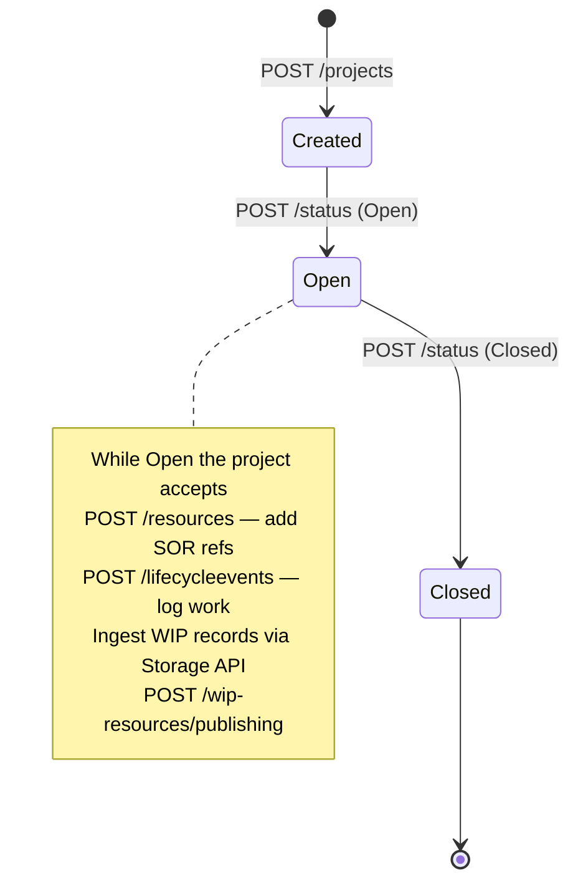
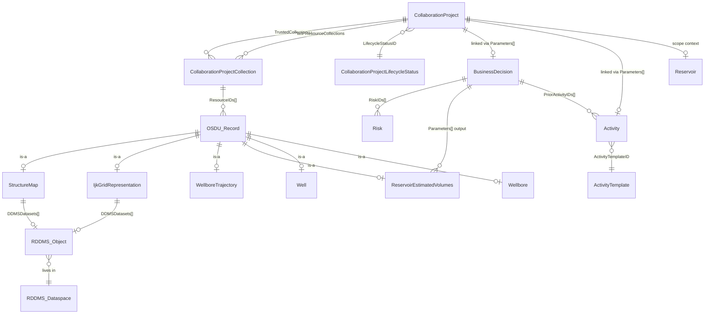

# Project & Workflow Service (P&WS) - Summary & RDDMS Integration

> **Service version**: 0.30.0-SNAPSHOT  
> **Base path**: `/api/pws/v1`  
> **Repo**: [community.opengroup.org/osdu/platform/system/project-and-workflow](https://community.opengroup.org/osdu/platform/system/project-and-workflow)   
> **Related guides**: [Activity](Activity.md) · [BusinessDecision](BusinessDecision.md) · [DevConcept](DevConcept.md) · [Volumes](Volumes.md) · [Risk](Risk.md) · [Query](Query.md) · [FmuOsdu](FmuOsdu.md) · [Uncertainty](Uncertainty.md)

---

## Table of Contents

1. [Overview](#1-overview)
2. [OSDU Schemas](#2-osdu-schemas)
3. [API Reference](#3-api-reference)
4. [Project Lifecycle](#4-project-lifecycle)
5. [SOR & WIP Resource Management](#5-sor--wip-resource-management)
6. [Detailed Use Cases](#6-detailed-use-cases)
7. [Reservoir DDMS Impact & Collaboration](#7-reservoir-ddms-impact--collaboration)
8. [RDDMS Interface Points](#8-rddms-interface-points)
9. [RDDMS Opportunities](#9-rddms-opportunities)
10. [Improvement Requirements](#10-improvement-requirements)
11. [Entity Relationship Diagram](#11-entity-relationship-diagram)
12. [References](#12-references)

---

## 1. Overview

The **Project & Workflow Service (P&WS)** provides a structured project collaboration layer on top of OSDU. It manages the lifecycle of multi-user subsurface projects where teams assemble trusted data references, work in isolated namespaces (WIP), and publish back to the System of Record (SOR) with full event auditing.

Key capabilities:
- **Collaboration Projects** - named containers with purpose, dates, personnel, ACLs, and lifecycle status
- **Trusted SOR resources** - curated list of existing OSDU records the project uses as baseline input
- **WIP (Work In Progress) namespaces** - isolated workspaces where contributors modify data without affecting the SOR
- **WIP → SOR publishing** - controlled promotion of WIP records back into the shared data fabric with conflict detection
- **Lifecycle event journal** - chronological log of every project action (creation, opening, resource additions, publications, closure)

### Where P&WS fits in the OSDU stack

```
┌──────────────────────────────────────────────────────────┐
│  Applications: ORES, Petrel, ResInsight, Webviz          │
├──────────────────────────────────────────────────────────┤
│  P&WS Service              │  Reservoir DDMS (RDDMS)    │
│  ─ Project lifecycle       │  ─ RESQML dataspaces        │
│  ─ SOR/WIP resource mgmt   │  ─ Grids, properties, maps │
│  ─ Publish & conflict      │  ─ ETP streaming            │
├──────────────────────────────────────────────────────────┤
│  Core OSDU Services                                      │
│  Storage · Search · Schema · Entitlements · Legal        │
└──────────────────────────────────────────────────────────┘
```

---

## 2. OSDU Schemas

| Schema | Kind | Role |
|--------|------|------|
| **CollaborationProject** | `osdu:wks:master-data--CollaborationProject:1.0.0` | The project record itself - name, purpose, dates, personnel, lifecycle status, namespace, contributor ACLs, trusted collection reference, lifecycle events journal |
| **CollaborationProjectCollection** | `osdu:wks:work-product-component--CollaborationProjectCollection:1.0.0` | A versioned list of `ResourceIDs[]` - used for both trusted (SOR) and WIP resource snapshots |
| **CollaborationProjectLifecycleStatus** | `osdu:wks:reference-data--CollaborationProjectLifecycleStatus:1.0.0` | Enumeration of status values: `Open`, `Closed` |

### CollaborationProject Key Fields

| Field | Type | Description |
|-------|------|-------------|
| `ProjectID` | string | Short identifier |
| `ProjectName` | string | Display name |
| `Purpose` | string | Project objectives |
| `ProjectBeginDate` / `ProjectEndDate` | ISO 8601 | Schedule window |
| `Namespace` | UUID | Isolation namespace for WIP records |
| `LifecycleStatusID` | ref-data ID | Current status (→ `CollaborationProjectLifecycleStatus`) |
| `LifecycleEvents[]` | array | Journal of all lifecycle events with `EventID`, `Name`, `DateTime`, `Remark`, and optional `ResourceCollectionID` / `WIPResourceCollectionID` |
| `TrustedCollectionID` | WPC ID | → `CollaborationProjectCollection` holding the aggregated list of trusted SOR resource IDs |
| `ProjectContributorACL` | object | ACL for project contributors (separate from OSDU record ACL) |
| `DefaultWIPACL` | object | Default ACL applied to WIP resources |
| `Personnel[]` | array | Team members with `PersonName`, `CompanyOrganisationID`, `ProjectRoleID` |
| `Parameters[]` | array | Inherited from `AbstractProjectActivity` - links to dataspaces, reservoirs, collections, activities |

---

## 3. API Reference

### Projects

| Method | Endpoint | Description |
|--------|----------|-------------|
| `GET` | `/projects` | List all collaboration projects (`limit`, `offset` query params) |
| `POST` | `/projects` | Create a new project (JSON body = `CollaborationProject` record) |
| `GET` | `/projects/{id}` | Get a single project by record ID |

### Project Status

| Method | Endpoint | Description |
|--------|----------|-------------|
| `POST` | `/projects/{id}/status` | Change status (`{"status": "Open"}` or `{"status": "Closed"}`) |

### Trusted SOR Resources

| Method | Endpoint | Description |
|--------|----------|-------------|
| `GET` | `/projects/{id}/resources` | List all trusted SOR resource IDs |
| `POST` | `/projects/{id}/resources` | Add SOR records to the trusted set (body = JSON array of record IDs) |
| `DELETE` | `/projects/{id}/resources` | Remove records from the trusted set |

### WIP Resources

| Method | Endpoint | Description |
|--------|----------|-------------|
| `GET` | `/projects/{id}/wip-resources` | List all WIP resource IDs in the project namespace |
| `POST` | `/projects/{id}/wip-resources/publishing` | Publish WIP records to SOR. Body: `{"ids": [...]}`. Returns 200 on success or 409 on conflict |

### Lifecycle Events

| Method | Endpoint | Description |
|--------|----------|-------------|
| `GET` | `/projects/{id}/lifecycleevents` | List all lifecycle events |
| `POST` | `/projects/{id}/lifecycleevents` | Add a custom event (`{"Name": "...", "Remark": "..."}`) |
| `DELETE` | `/projects/{id}/lifecycleevents/{eventId}` | Remove a lifecycle event |

### Headers Required

| Header | Value |
|--------|-------|
| `Authorization` | `Bearer <access_token>` |
| `data-partition-id` | OSDU partition `dev` |
| `Content-Type` | `application/json` |

---

## 4. Project Lifecycle



### Typical Flow

1. **Create** - `POST /projects` → project record with `LifecycleStatusID = Created`
2. **Open** - `POST /projects/{id}/status` with `{"status": "Open"}`
3. **Add trusted SOR resources** - `POST /projects/{id}/resources` with arrays of existing OSDU record IDs (wells, wellbores, trajectories, datasets, grids, etc.)
4. **Log lifecycle events** - `POST /projects/{id}/lifecycleevents` for working sessions, reviews, milestones
5. **Create WIP records** - Ingest new or modified records via the Storage API into the project namespace
6. **Publish WIP → SOR** - `POST /projects/{id}/wip-resources/publishing` with `{"ids": [...]}`. Conflict detection returns 409 if records already exist in SOR with the same ID
7. **Close** - `POST /projects/{id}/status` with `{"status": "Closed"}`

### Auto-logged Events

The service automatically journals lifecycle events for: `Created`, `Open`, `SOR Resources added`, `WIP Resources published`, and `Closed`. Custom events can be added for working sessions, reviews, or any ad-hoc milestone.

---

## 5. SOR & WIP Resource Management

### System of Record (Trusted Resources)

Trusted resources are existing OSDU records selected as the project's input baseline. Adding resources:
- Appends IDs to the project's `TrustedCollectionID` (a `CollaborationProjectCollection` WPC)
- Logs an `SOR Resources added` lifecycle event with a `ResourceCollectionID` snapshot

Multiple portions can be added incrementally - each addition is individually journaled.

### Work In Progress (WIP)

WIP resources live in the project's `Namespace` (UUID-based isolation). They are ingested through normal OSDU Storage API calls and tracked via the `wip-resources` endpoint. Publishing WIP to SOR:
- Copies WIP records into the main namespace
- Returns 200 on success with the published record IDs
- Returns **409** if a WIP record's ID conflicts with an existing SOR record of the same version
- Conflict reports list the conflicting record IDs and versions for resolution

---

## 6. Detailed Use Cases

### 6.1 Multi-Discipline Reservoir Study (DG2/DG3)

**Scenario**: A subsurface team prepares a concept-select decision gate. Geologists, geophysicists, and reservoir engineers collaborate on a shared dataset spanning wells, seismic interpretations, geomodels, and simulation results.

**P&WS Flow**:
1. Project manager creates a `CollaborationProject` scoped to the target reservoir and decision gate
2. Trusted SOR resources are assembled: existing wells, wellbores, trajectories, seismic horizons, stratigraphic column
3. Each discipline works in WIP: geologist adds new horizon interpretations, engineer adds simulation inputs
4. Geomodel grids and properties are ingested as WIP records linked to the project namespace
5. After QC and review, WIP records are published to SOR in controlled batches (wells first, then dependent WPCs)
6. `BusinessDecision` record is created referencing the project's published artifacts as `Parameters[]` inputs
7. Project is closed, preserving the full lifecycle journal as decision audit trail

**Data types involved**: `Well`, `Wellbore`, `WellboreTrajectory`, `WellboreMarkerSet`, `HorizonInterpretation`, `StructureMap`, `IjkGridRepresentation`, `ReservoirEstimatedVolumes`, `ColumnBasedTable`, `BusinessDecision`, `Risk`

### 6.2 FMU Ensemble Collaboration

**Scenario**: An FMU workflow produces hundreds of realizations. The team wants to review, select representative cases, and publish curated results as decision evidence.

**P&WS Flow**:
1. Create project linked to the FMU case `WorkProduct` and the target `Reservoir`
2. Register the design matrix `ColumnBasedTable` and existing base-case grids as trusted SOR resources
3. FMU outputs (raw `ReservoirEstimatedVolumes`, aggregated statistics, ensemble surfaces) are ingested as WIP
4. Team reviews results in ORES/Webviz, adds lifecycle events documenting review sessions
5. Selected representative cases (P10/P50/P90 realizations) are published to SOR
6. Aggregated `GeoLabelSet` with headline KPIs is published for dashboard consumption
7. `Activity` records capture provenance: design matrix → ERT run → volumes output
8. `BusinessDecision` at the relevant gate references the published volumes, risks, and DevelopmentConcept

**Data types involved**: `ColumnBasedTable`, `ReservoirEstimatedVolumes`, `GeoLabelSet`, `IjkGridRepresentation`, `StructureMap`, `Activity`, `ActivityTemplate`, `WorkProduct`, `BusinessDecision`

### 6.3 Well Planning & Trajectory Design

**Scenario**: Drilling engineering team designs new well trajectories using existing geomodel context, wants to iterate on designs without affecting the SOR until approved.

**P&WS Flow**:
1. Create project referencing the geomodel dataspace and target reservoir
2. Add existing wells, wellbores, and the reference trajectory set as trusted SOR
3. Design new WellboreTrajectory records as WIP - iterate on inclination, azimuth, target points
4. Run collision checks and pore-pressure analysis against trusted SOR trajectories + WIP candidates
5. Log review sessions as lifecycle events
6. Approved trajectories are published to SOR; rejected ones remain as WIP (or are discarded at project closure)

**Data types involved**: `Well`, `Wellbore`, `WellboreTrajectory`, `WellboreMarkerSet`, `StructureMap`, `IjkGridRepresentation`

### 6.4 Seismic Interpretation Integration

**Scenario**: Seismic interpreters produce new horizon picks that need to be reconciled with the existing stratigraphic framework before being used as input to geomodeling.

**P&WS Flow**:
1. Create project linking to the seismic survey dataspaces and the master stratigraphic column
2. Register existing `SeismicHorizon`, `HorizonInterpretation`, and `StratigraphicColumn` as trusted SOR
3. Interpreter creates new `HorizonControlPoints` and updated `StructureMap` WPCs as WIP
4. QC sessions compare WIP surfaces against trusted SOR horizons using ORES 3D viewer
5. New surfaces replace or augment the existing horizon set upon SOR publication
6. Lifecycle events document the interpretation workflow, QC outcomes and review gates

**Data types involved**: `SeismicHorizon`, `HorizonInterpretation`, `HorizonControlPoints`, `StructureMap`, `GenericBinGrid`, `StratigraphicColumn`, `StratigraphicUnitInterpretation`

### 6.5 Cross-Asset Data Sharing

**Scenario**: A producing field's subsurface model needs to be shared with a neighboring license partner for unitization evaluation, with strict access control.

**P&WS Flow**:
1. Create project with restricted `ProjectContributorACL` scoped to partner users
2. Add relevant SOR resources (reservoir segments, volumes, key wells) as trusted - these become the "data room"
3. Partner contributes their own data as WIP (e.g., adjusted OWC, new segment interpretations)
4. Joint review sessions documented as lifecycle events
5. Agreed-upon records are published to SOR; disputed ones remain as WIP for further iteration
6. Project closure captures the full negotiation and data-exchange audit trail

### 6.6 RESQML Data Package Collaboration

**Scenario**: A team works with RESQML data packages (EPC files) managed by the Reservoir DDMS. They need to assemble, modify, and publish curated RESQML objects within a governed project context.

**P&WS Flow**:
1. Create project referencing the RDDMS dataspace URI via `Parameters[]` (`GeoModelDataspace`)
2. Register OSDU catalog records for existing RESQML objects (grids, properties, surfaces) as trusted SOR
3. Import new/modified RESQML objects into RDDMS under the project namespace as WIP
4. Use ORES GraphQL deep-search to compare WIP vs SOR objects by UUID, property filters, and array statistics
5. Publish catalog records for approved RESQML objects to SOR (RDDMS data remains in the dataspace)
6. Log lifecycle events capturing the import, QC, and approval workflow

---

## 7. Reservoir DDMS Impact & Collaboration

### 7.1 Dual-Layer Architecture

P&WS and RDDMS operate on complementary layers of the OSDU data fabric:

| Aspect | P&WS | RDDMS |
|--------|------|-------|
| **Scope** | Project lifecycle, resource governance, SOR/WIP flow | RESQML domain data: grids, properties, surfaces, arrays |
| **Record types** | `CollaborationProject`, `CollaborationProjectCollection` | RESQML objects via `DDMSDatasets[]` URIs |
| **Data storage** | OSDU Storage API (metadata + references) | RESQML dataspaces (actual array data, geometry, CRS) |
| **Access** | REST API at `/api/pws/v1` | REST API + ETP WebSocket + GraphQL |
| **Isolation** | Namespace-based WIP isolation | Dataspace-based isolation (lock/unlock) |
| **Versioning** | Record versions via OSDU Storage | Dataspace versioning + object CITATIONs |

### 7.2 RDDMS as Data Backend for P&WS Projects

When a P&WS project references RDDMS data, the relationship works through **OSDU catalog records** that contain `DDMSDatasets[]` URIs pointing to RESQML objects in dataspaces:

```mermaid
flowchart TB
    subgraph PWS["P&WS Project"]
        CP[CollaborationProject]
        SOR[Trusted SOR Resources]
        WIP[WIP Resources]
    end

    subgraph OSDU["OSDU Catalog"]
        SM[StructureMap WPC]
        IJK[IjkGridRepresentation WPC]
        GR[GenericRepresentation WPC]
    end

    subgraph RDDMS["Reservoir DDMS"]
        DS1["Dataspace: project/geomodel"]
        G2D[Grid2dRepresentation<br/>Z-values, CRS]
        GRID[IjkGrid3d<br/>Pillars, cells]
        PROP[ContinuousProperty<br/>PORO, PERMX, SW]
    end

    CP --> SOR
    CP --> WIP
    SOR --> SM
    SOR --> IJK
    WIP --> GR
    SM -- "DDMSDatasets[]" --> G2D
    IJK -- "DDMSDatasets[]" --> GRID
    GRID --> PROP
    G2D --> DS1
    GRID --> DS1
```



### 7.3 Namespace ↔ Dataspace Alignment

A critical design question is how P&WS WIP **namespaces** map to RDDMS **dataspaces**:

| Approach | Description | Pros | Cons |
|----------|-------------|------|------|
| **1:1 mapping** | Each P&WS project creates a dedicated RDDMS dataspace for WIP | Clean isolation; straightforward publish | Extra dataspace lifecycle overhead |
| **Shared dataspace** | WIP records reference objects in existing dataspaces | Simpler setup; fewer dataspaces | Harder isolation; risk of cross-project contamination |
| **Layered** | SOR dataspace (locked) + WIP dataspace (unlocked) per project | Matches P&WS SOR/WIP semantics | Adds complexity; requires WIP → SOR dataspace copy |

**Recommendation**: The layered approach best mirrors P&WS semantics. The SOR dataspace should be locked; the WIP dataspace is the project's working area. Publishing WIP records copies objects from WIP dataspace to SOR dataspace (analogous to P&WS `wip-resources/publishing`).

---

## 8. RDDMS Interface Points

### 8.1 Current Touchpoints (ORES Implementation)

The ORES web app already integrates P&WS concepts with RDDMS:

| Feature | Integration |
|---------|------------|
| **CollaborationProject creation** (Add DG tab) | Links to RDDMS dataspaces via `Parameters[]` → `GeoModelDataspace` with `DataObjectParameter` = `ETPDataspace` ID |
| **Reservoir scope** | Parameters link to `master-data--Reservoir` - the same entity RDDMS WPCs reference via `ParentObjectID` |
| **PersistedCollection** | Evidence packages that bundle RDDMS-hosted WPCs (grids, surfaces, properties) with their catalog records |
| **GraphQL deep-search** | Queries across RDDMS dataspaces to find objects by property filter, array statistics, and UUID - used to discover and validate project resources |
| **3D visualization** | ORES Resqml3D viewer renders RDDMS objects (grids, surfaces, wellbore trajectories) for QC within project context |
| **Dataspace admin** | ORES ResDdmsAdmin page manages RDDMS dataspaces (create, lock, unlock, delete, import) - aligns with project lifecycle |

### 8.2 API-Level Interfaces

```
┌──────────────┐     ┌─────────────────┐     ┌──────────────────┐
│   P&WS API   │────►│  OSDU Storage   │◄────│   RDDMS REST     │
│              │     │   & Search      │     │   & ETP          │
│ /projects    │     │                 │     │                  │
│ /resources   │     │  CollabProject  │     │ /dataspaces      │
│ /wip-*       │     │  Collections    │     │ /types           │
│ /status      │     │  All WPCs       │     │ /resources       │
│ /lifecycle   │     │                 │     │ /arrays          │
└──────────────┘     └─────────────────┘     └──────────────────┘
         │                    │                        │
         └──────── Project resources reference ────────┘
                  OSDU catalog records with
                  DDMSDatasets[] → RDDMS objects
```

### 8.3 Data Flow for RDDMS-Backed Projects

1. **Discovery**: Search OSDU catalog for RDDMS-backed WPCs (StructureMaps, Grids) → read `DDMSDatasets[]` URIs
2. **Registration**: Add discovered WPC IDs to P&WS project as trusted SOR resources
3. **WIP creation**: Import new RESQML objects into RDDMS WIP dataspace + create corresponding OSDU catalog records in WIP namespace
4. **Validation**: Use GraphQL deep-search to compare WIP vs SOR objects (array statistics, property coverage, CRS consistency)
5. **Publishing**: Promote WIP catalog records to SOR via P&WS + copy RESQML objects from WIP dataspace to SOR dataspace via RDDMS import
6. **Audit**: Lifecycle events document which RESQML objects were added, reviewed, and published

---

## 9. RDDMS Opportunities

### 9.1 Project-Scoped Dataspaces

P&WS projects could **automatically provision RDDMS dataspaces** aligned with project lifecycle:
- `POST /projects` → creates a locked SOR dataspace + unlocked WIP dataspace
- `POST /status {"status": "Closed"}` → locks the WIP dataspace
- Dataspace names follow a convention: `<project-id>/sor`, `<project-id>/wip`

### 9.2 RESQML-Aware WIP Publishing

Extend WIP publishing to understand RESQML object graphs. When publishing a grid property, automatically include the parent grid and its CRS. When publishing a surface, include the referenced interpretation and bin grid. This prevents orphaned references in SOR.

### 9.3 Array-Level Conflict Detection

Current P&WS conflict detection works at the record ID level. RDDMS could enable **array-level** conflict detection:
- Compare Z-value arrays between WIP and SOR versions of a surface
- Show property value differences between WIP and SOR grid properties
- Provide delta statistics (RMSE, max diff, histogram) for reviewer decision support

### 9.4 Deep-Search Project Dashboard

Combine P&WS project resources with RDDMS deep-search to build a **project dashboard** showing:
- All trusted SOR objects with types, counts, and array statistics
- All WIP objects with modification dates and delta from SOR baseline
- Object relationship graph (targets/sources) within the project scope
- Property coverage matrix: which zones / reservoir segments have which properties

### 9.5 ETP Streaming for WIP Sync

Use ETP WebSocket for efficient WIP data transfer:
- Bulk import of RESQML objects from Petrel/ResInsight into the project WIP dataspace
- Real-time notifications when WIP objects change (for multi-user collaboration)
- Streaming array data for large grids and properties without full EPC file round-trips

### 9.6 Activity Provenance Integration

Link RDDMS operations to OSDU Activity records:
- RESQML import → `Activity` with input = EPC file, output = list of imported WPC IDs
- Grid property computation → `Activity` linking input grid + computation parameters to output property
- Ensemble grid variations → multiple `Activity` records keyed by `Realisation`

### 9.7 Cross-Dataspace Federation

Enable P&WS projects to reference resources across multiple RDDMS dataspaces (e.g., base geomodel in one dataspace, seismic reprocessing in another). The GraphQL federated-search already supports multi-dataspace queries - extending this to P&WS project context would enable cross-domain collaboration.

### 9.8 Version Comparison & Merge

Extend RDDMS with version-aware operations for P&WS:
- **Compare**: Side-by-side diff of two versions of a grid, surface, or property (visual + statistical)
- **Merge**: Combine changes from multiple WIP contributors into a single SOR version (analogous to git merge for subsurface data)
- **Revert**: Restore a previous version from the lifecycle event journal

---

## 10. Improvement Requirements

### 10.1 P&WS Service Improvements

| Area | Requirement | Priority |
|------|-------------|----------|
| **Azure availability** | Deploy P&WS on Azure ADME (currently AWS-only) | High |
| **RDDMS-aware publishing** | Extend WIP publishing to handle RESQML object graphs (dependencies, parent objects) | High |
| **Conflict resolution UX** | When 409 conflict occurs, provide a merge/override workflow rather than just a report | High |
| **Bulk operations** | Support batch creation of projects and batch resource registration | Medium |
| **Project templates** | Pre-configured project structures for common workflows (DG study, well planning, seismic reprocessing) | Medium |
| **Notifications** | Webhook or event-driven notifications for lifecycle events (project opened, WIP published, etc.) | Medium |
| **Search integration** | Searchable project metadata - find projects by reservoir, purpose, date range, personnel | Medium |
| **Role-based access** | Finer-grained roles beyond owner/viewer (e.g., reviewer, contributor, observer) | Low |

### 10.2 RDDMS Improvements for P&WS Collaboration

| Area | Requirement | Priority |
|------|-------------|----------|
| **Dataspace lifecycle API** | Programmatic create/lock/unlock/delete aligned with P&WS project status changes | High |
| **Cross-dataspace copy** | Efficient bulk copy of RESQML objects between dataspaces (WIP → SOR promotion) | High |
| **Object-graph-aware operations** | When copying/publishing a RESQML object, automatically include all referenced objects (CRS, grids, interpretations) | High |
| **Array differencing** | REST/GraphQL endpoint to compute and return differences between two versions of an array (delta surface, delta property) | Medium |
| **Dataspace ACLs** | Per-dataspace access control that can be synchronized with P&WS `ProjectContributorACL` | Medium |
| **ETP project channels** | ETP notification channels scoped to a P&WS project - broadcast changes to all project participants | Medium |
| **Object provenance** | Track which P&WS project and lifecycle event caused each RESQML object to be created/modified | Medium |
| **Concurrent edit detection** | Optimistic locking for RESQML objects within a shared WIP dataspace | Low |

### 10.3 ORES Client Improvements

| Area | Requirement | Priority |
|------|-------------|----------|
| **P&WS integration page** | Dedicated UI for browsing P&WS projects, viewing lifecycle journal, managing SOR/WIP resources | High |
| **WIP diff viewer** | Visual comparison of WIP vs SOR objects using 3D viewer (overlay surfaces, highlight property differences) | High |
| **Project-scoped search** | Filter Search/GraphQL results to only resources within a specific P&WS project | Medium |
| **Lifecycle timeline** | Interactive timeline visualization of project events (created → opened → resources added → published → closed) | Medium |
| **Publish workflow wizard** | Guided multi-step wizard for WIP → SOR publishing with dependency checking and conflict resolution | Medium |
| **Dataspace ↔ project linking** | Auto-create RDDMS dataspaces when creating a P&WS project from the Add DG tab | Low |

### 10.4 Schema & Data Model Gaps

| Gap | Description | Impact |
|-----|-------------|--------|
| **No P&WS ↔ RDDMS schema link** | `CollaborationProject` has no native field for RDDMS dataspace references - currently modeled as `Parameters[]` | Fragile; depends on convention (`GeoModelDataspace` key) |
| **Missing project-resource relationship type** | No OSDU relationship type for "resource is trusted by project" or "resource is WIP in project" | Limits search and graph queries |
| **No WIP status on WPC** | Individual WPC records don't indicate whether they are SOR or WIP | Consumers must query P&WS to determine status |
| **CollaborationProjectCollection limits** | Large projects with thousands of resources may hit collection size limits | Need pagination or hierarchical collections |
| **No standard lifecycle event types** | Event names are convention-based strings (`SOR Resources added`, `WIP Resources published`) - not reference-data | Limits machine processing and reporting |
| **No cross-project lineage** | When a WPC is published from project A and registered in project B, there is no formal lineage link | Limits multi-project provenance tracking |

---

## 11. Entity Relationship Diagram



---

## 12. References

| Topic | Link |
|-------|------|
| P&WS repository | [community.opengroup.org/osdu/platform/system/project-and-workflow](https://community.opengroup.org/osdu/platform/system/project-and-workflow) |
| P&WS OpenAPI spec | [docs/api/openapi.yaml](https://community.opengroup.org/osdu/platform/system/project-and-workflow/-/blob/main/docs/api/openapi.yaml) |
| MVP1 Jupyter notebook | [docs/notebook/mvp1.ipynb](https://community.opengroup.org/osdu/platform/system/project-and-workflow/-/blob/main/docs/notebook/mvp1.ipynb) |
| CollaborationProject schema | [OSDU Data Definitions](https://community.opengroup.org/osdu/data/data-definitions/-/blob/master/E-R/master-data/CollaborationProject.1.0.0.md) |
| MVP1 test notes | [PWS-MVP1-notebook-M25-test.md](PWS-MVP1-notebook-M25-test.md) |
| RDDMS query guide | [Query.md](Query.md) |
| Seismic interpretation (RDDMS) | [SeisInt.md](SeisInt.md) |
| Activity & provenance | [Activity.md](Activity.md) |
| BusinessDecision guide | [BusinessDecision.md](BusinessDecision.md) |
| FMU ↔ OSDU mapping | [FmuOsdu.md](FmuOsdu.md) |
| Volumes | [Volumes.md](Volumes.md) |
| Uncertainty | [Uncertainty.md](Uncertainty.md) |
| Risk management | [Risk.md](Risk.md) |
| DevelopmentConcept | [DevConcept.md](DevConcept.md) |
| Stratigraphy | [StratColumn.md](StratColumn.md) |
