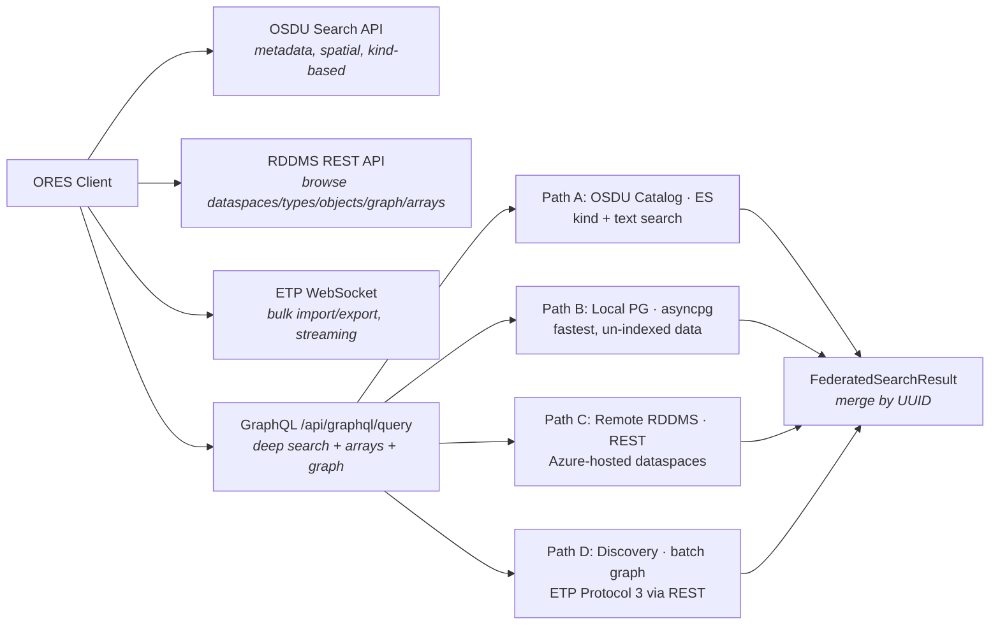

# Querying OSDU & Reservoir Data

ORES provides multiple ways to search and explore reservoir data — from a visual point-and-click builder to raw GraphQL queries. This guide starts with common tasks and works down to technical details.

---

## Choosing the Right Approach

| I want to… | Recommended path |
|------------|-----------------|
| Search without writing code | [Easy Mode](#easy-mode--visual-query-builder) on the `/keys` page |
| Find OSDU records by keyword or area | [OSDU Search](#osdu-search) |
| Browse dataspaces, list objects | [GraphQL Browse](#browsing--exploration) |
| Find grids/wells by property value (e.g. porosity > 0.25) | [Deep Search](#deep-search--property-filtering) |
| Traverse relationships between objects | [Graph Traversal](#relationships-graph-traversal) |
| Search across multiple dataspaces at once | [Multi-dataspace Search](#deep-search--multiple-dataspaces) |
| Search OSDU catalog + RDDMS together | [Federated Search](#federated-search-osdu--rddms) |
| Inspect array data (depths, values, stats) | [Array Statistics](#array-statistics--samples) |
| Get full XML of a single object | [RDDMS REST](#rddms-rest-api) |
| Bulk import/export EPC files | ETP CLI |

> **Rule of thumb:** Use GraphQL for anything involving filtering, relations, or multiple objects. Use OSDU Search for metadata/spatial lookups. Use REST only when you need raw XML.

---

## Easy Mode – Visual Query Builder

The `/keys` page offers an **Easy Mode** tab that builds GraphQL queries without writing raw syntax.

### How it works

1. Select **Query type** (Deep Search, Browse, Relations, Federated)
2. Pick an **Object type** from categorized dropdown (Grid, Well, Surface, Property, …)
3. Optionally enter a **Property** name/alias (e.g. `poro`, `sw`, `perm`)
4. Set an **operator + threshold** filter (e.g. `> 0.25`)
5. Toggle **Statistics**, **Relations**, **Sample values**
6. Click **▶ Run Query**

Results render as **colored cards** with type-category badges, sparkline statistics bars, and matching-cell percentages.

### Query types in Easy Mode

| Action | What it does | Use case |
|--------|--------------|----------|
| Deep Search | Filter objects by type + numerical property | "Show grids with porosity > 0.25" |
| Browse | List objects of a type (no filter) | "What IjkGrids exist in this dataspace?" |
| Relations | Graph traversal from a specific UUID | "What references this grid?" |
| Federated | Search OSDU catalog + RDDMS simultaneously | "Find all Drogon objects everywhere" |

### Match modes

| Mode | Behaviour |
|------|-----------|
| **Loose** (default) | Substring match — `poro` finds "PORO", "porosity_v1", etc. |
| **Strict** | Exact match on canonical RESQML property kind |

Click **"Show generated GraphQL"** to see the raw query and switch to Advanced Mode for tweaking.

---

## Common Use Cases

### Browsing & Exploration

Start here to understand what data is available:

```graphql
{ status }                                          # Check backend connectivity
{ dataspaces { path uri } }                         # List all dataspaces
{ resqmlCategories { name count } }                 # What type groups exist?
{ resourceTypes(dataspace: "maap/drogon") { name count } }  # Types in a dataspace
```

```graphql
# List objects of a specific type
{
  resqmlObjects(
    dataspace: "maap/drogon"
    typeName: "resqml20.obj_IjkGridRepresentation"
    limit: 10
  ) { uuid title typeName }
}
```

> **Tip:** Use `category` to search all related types at once — e.g. `category: "well"` covers WellboreFeature, Trajectory, Frame, MarkerFrame, DeviationSurvey, BlockedWellbore (10 types).

---

### Deep Search – Property Filtering

Find objects where a numerical property meets a threshold:

```graphql
# Grids where porosity > 0.25
{
  deepSearch(
    dataspace: "maap/drogon"
    typeName: "resqml20.obj_IjkGridRepresentation"
    propertyFilter: {
      titleContains: "PORO"
      arrayFilter: { threshold: 0.25, operator: GT }
    }
    includeStatistics: true
    limit: 5
  ) {
    backend totalScanned totalMatched queryDescription
    objects {
      uuid title
      properties {
        title kind uom
        statistics { count minValue maxValue mean }
        matchingCells { count total fraction }
      }
    }
  }
}
```

**Common filter recipes** (same query structure — swap `titleContains`, `threshold`, `operator`):

| Use case | titleContains | threshold | operator |
|----------|--------------|-----------|----------|
| High porosity zones | `"PORO"` | 0.25 | GT |
| High-perm streaks | `"PERMX"` | 500.0 | GT |
| Hydrocarbon zones (low Sw) | `"SWATINIT"` | 0.3 | LT |
| Tight zones (low perm) | `"PERMX"` | 1.0 | LT |
| Net-to-gross cutoff | `"ntg_pem"` | 0.5 | GT |
| Well log porosity | `"PHIT"` | 0.25 | GT |
| Well log permeability | `"KLOGH"` | 100.0 | GT |

For **well logs**, use `typeName: "resqml20.obj_WellboreFrameRepresentation"` with the same pattern.

```graphql
# Browse ALL properties on grids (omit propertyFilter)
{
  deepSearch(
    dataspace: "maap/drogon"
    typeName: "resqml20.obj_IjkGridRepresentation"
    includeStatistics: true
    limit: 2
  ) {
    objects { uuid title properties { title kind uom statistics { count minValue maxValue mean } } }
  }
}
```

```graphql
# Search by category — find all structural objects with relations
{
  deepSearch(
    dataspace: "demo/drogon"
    category: "structural"
    includeRelations: true
    limit: 10
  ) {
    backend totalScanned totalMatched
    objects {
      title typeName
      relations { name typeName direction }
    }
  }
}
```

---

### Deep Search – Multiple Dataspaces

```graphql
# Search wells across two dataspaces
{
  deepSearch(
    dataspaces: ["demo/drogon", "maap/weco"]
    category: "well"
    includeStatistics: true
    limit: 10
  ) {
    backend totalScanned totalMatched queryDescription
    objects { title typeName properties { title kind statistics { count minValue maxValue } } }
  }
}
```

```graphql
# Porosity comparison across dataspaces
{
  deepSearch(
    dataspaces: ["maap/drogon", "maap/volve"]
    typeName: "resqml20.obj_IjkGridRepresentation"
    propertyFilter: { titleContains: "PORO", arrayFilter: { threshold: 0.2, operator: GT } }
    includeStatistics: true
    limit: 10
  ) {
    backend totalScanned totalMatched queryDescription
    objects { uuid title properties { title statistics { minValue maxValue } matchingCells { count total fraction } } }
  }
}
```

---

### Relationships (Graph Traversal)

Every RESQML object has typed links to other objects. Use `objectRelations` to traverse:

```graphql
# Forward refs (targets): what does this grid reference?
{
  objectRelations(
    dataspace: "maap/drogon"
    typeName: "resqml20.obj_IjkGridRepresentation"
    uuid: "2c6de928-7e08-4601-b979-34048bd68c02"
    direction: "targets"
  ) { uuid name typeName direction contentType }
}
```

```graphql
# Reverse refs (sources): what properties/representations point to this object?
{
  objectRelations(
    dataspace: "maap/drogon"
    typeName: "resqml20.obj_IjkGridRepresentation"
    uuid: "2c6de928-7e08-4601-b979-34048bd68c02"
    direction: "sources"
  ) { uuid name typeName direction contentType }
}
```

**Common traversal patterns** (swap `typeName`, `uuid`, `direction`):

| Pattern | typeName | direction | What you get |
|---------|----------|-----------|--------------|
| Grid → CRS + StratColumn | `obj_IjkGridRepresentation` | targets | Referenced objects |
| Grid → all properties | `obj_IjkGridRepresentation` | sources | Attached ContinuousProperty/DiscreteProperty |
| Well Feature → Interp → Traj | `obj_WellboreFeature` | sources | Chain of representations |
| Horizon → surfaces | `obj_HorizonInterpretation` | sources | Grid2D representations |
| Surface → horizon | `obj_Grid2dRepresentation` | targets | Which horizon it represents |
| Well frame → log curves | `obj_WellboreFrameRepresentation` | both | All attached properties |

---

### Federated Search (OSDU + RDDMS)

Search the OSDU catalog and RDDMS simultaneously — results are merged by UUID:

```graphql
# Search both catalog and RDDMS for "grid"
{
  federatedSearch(
    text: "grid"
    searchCatalog: true
    searchRddms: true
    dataspaces: ["maap/drogon"]
    limit: 10
  ) {
    totalCatalog totalRddms totalMerged sources queryDescription
    hits {
      uuid title typeName dataspace
      foundInCatalog foundInRddms
      osduId osduKind
    }
  }
}
```

```graphql
# RDDMS-only with enrichment (relations + property statistics)
{
  federatedSearch(
    text: "Geogrid"
    searchCatalog: false
    searchRddms: true
    dataspaces: ["maap/drogon"]
    includeRelations: true
    includeProperties: true
    includeStatistics: true
    limit: 5
  ) {
    totalRddms totalMerged
    hits {
      uuid title typeName dataspace
      relations { uuid name typeName direction }
      properties {
        uuid title kind
        statistics { count minValue maxValue mean }
      }
    }
  }
}
```

```graphql
# Catalog-only — search by OSDU kind
{
  federatedSearch(
    text: "Drogon"
    kind: "osdu:wks:work-product-component--GenericRepresentation:*"
    searchCatalog: true
    searchRddms: false
    limit: 20
  ) {
    totalCatalog
    hits { uuid title typeName dataspace osduId osduKind foundInCatalog }
  }
}
```

**When to use which mode:**

| Scenario | Settings |
|----------|----------|
| Browse local un-indexed data (fast, offline) | `searchRddms:true`, others `false` |
| Check what's in the OSDU catalog | `searchCatalog:true`, others `false` |
| Verify catalog records exist in RDDMS | All three `true`, compare flags |
| Search remote + local RDDMS together | `searchRddms:true, searchRemoteRddms:true`, catalog off |
| Full discovery across everything | All three `true` (default) |
| Enrich results with relations/properties | Add `includeRelations`, `includeProperties`, `includeStatistics` |

---

### OSDU Search

For metadata lookups, spatial queries, and kind-based searches:

```json
{
  "kind": "osdu:wks:work-product-component--BusinessDecision:*",
  "query": "Drogon AND DG2",
  "limit": 50
}
```

```json
{
  "kind": "osdu:wks:work-product-component--SeismicHorizon:*",
  "spatialFilter": {
    "field": "data.SpatialArea.Wgs84Coordinates",
    "byBoundingBox": {
      "topLeft": { "latitude": 62.0, "longitude": 1.5 },
      "bottomRight": { "latitude": 58.0, "longitude": 3.5 }
    }
  }
}
```

---

### Array Statistics & Samples

```graphql
# Get array metadata, statistics, and sample values for any object
{
  objectArrays(
    dataspace: "maap/drogon"
    typeName: "resqml20.obj_Grid2dRepresentation"
    uuid: "02a9d0b6-1f7c-4553-994b-5060cd725d6d"
    includeStatistics: true
    includeSampleValues: true
    sampleSize: 10
  ) { path dataType dimensions totalElements statistics { count minValue maxValue mean stdDev } sampleValues }
}
```

Works with any object type — swap `typeName` + `uuid` for IjkGrids, WellboreFrames, etc.

---

## Property Aliases

You can use shorthand names instead of full RESQML property kinds. ORES resolves them automatically.

| Canonical name | Aliases | Unit |
|---|---|---|
| porosity | poro, phit, phi, nphi | v/v |
| permeability | perm, permx, permy, permz, kh | mD |
| water saturation | sw, swat, swatinit | v/v |
| oil saturation | so, soil | v/v |
| gas saturation | sg, sgas | v/v |
| net-to-gross | ntg, n2g | ratio |
| depth | tvd, tvdss, z | m |
| pressure | pres, pressure, bhp | bar |
| temperature | temp | °C |
| bulk density | rhob, den | g/cm³ |
| gamma ray | gr, gamma | API |
| resistivity | rt, res, ild | ohm·m |
| acoustic impedance | ai, imp | (m/s)·(g/cm³) |
| velocity | vp, vs, vel | m/s |
| facies | facies, lith, litho | - |
| zone | zone, region, segment | - |
| thickness | thick, dz, isochore | m |
| volume | vol, bulk_vol, bv | m³ |
| age | age, chrono | Ma |
| displacement | throw, heave | m |

Use the resolve endpoint to check an alias: `GET /api/graphql/resolve-alias?term=poro`

---

---

# Technical Appendix

---

## A. Architecture



| Path | Best for | Speed |
|------|----------|-------|
| OSDU Search | Records by kind, metadata keywords, spatial | Fast (metadata only) |
| RDDMS REST | Browse dataspaces, single objects, full XML | Medium |
| ETP WebSocket | Bulk EPC import/export, streaming | Fast |
| GraphQL (PG) | Deep filtering, array predicates, multi-dataspace | Fastest (10–50× vs REST) |
| GraphQL (Discovery) | Deep search on ADME/remote without PG access | Fast (1 call vs N+1) |
| GraphQL federated | OSDU + RDDMS simultaneously, UUID dedup | Fast (parallel) |

### Backend Selection Order

`deep_search_impl` tries backends in this order (first success wins):

```
1. Discovery  (RDDMS_DISCOVERY=1)  →  POST /query/graph/search  (1 batch call)
   ↓ fallback if endpoint unavailable
2. PostgreSQL (GRAPHQL_PG_CONN_STRING set)  →  SQL JOINs  (fastest, local only)
   ↓ fallback if dataspace not in PG
3. REST       (always available)  →  N+1 individual calls  (M26 compatible)
```

The `backend` field in `DeepSearchResult` tells you which path was used:
`"Discovery"`, `"PostgreSQL"`, or `"REST"`.

---

## B. RDDMS REST API

| Endpoint | Purpose |
|----------|---------|
| `GET /dataspaces` | List all dataspaces |
| `GET /dataspaces/{ds}/types` | Types with counts |
| `GET /dataspaces/{ds}/types/{type}/resources` | List objects |
| `GET /dataspaces/{ds}/types/{type}/resources/{uuid}` | Single object |
| `GET .../resources/{uuid}/targets` | Forward references |
| `GET .../resources/{uuid}/sources` | Reverse references |
| `GET .../resources/{uuid}/arrays` | List arrays |
| `GET .../resources/{uuid}/arrays/{path}` | Read array data |

> **Performance note:** Each REST call carries ~40–100 ms overhead (TLS, Azure gateway, JSON serialization). Deep queries that touch N objects × M properties × K arrays result in (N+M+K) serial HTTP calls — the _N+1 problem_. Prefer GraphQL+PG when available.

---

## C. GraphQL Query Reference

### All Available Queries

| Query | Purpose |
|-------|---------|
| `status` | Backend check (PG version or REST info) |
| `dataspaces { path uri }` | List dataspaces |
| `resqmlCategories { name count }` | List type categories (grid, well, surface, …) |
| `resourceTypes(dataspace)` | Types + counts |
| `resqmlObjects(dataspace, typeName)` | Browse objects |
| `objectRelations(dataspace, typeName, uuid, direction)` | Graph traversal |
| `objectArrays(dataspace, typeName, uuid)` | Arrays + statistics |
| `deepSearch(dataspace, typeName, propertyFilter)` | Combined filter |
| `deepSearch(dataspaces: [...])` | Multi-dataspace |
| `deepSearch(category: "well")` | Search by category (all types in group) |
| `federatedSearch(text, dataspaces, kind)` | OSDU catalog + RDDMS dual-path |

### PropertyFilter Fields

| Field | Type | Example |
|-------|------|---------|
| `kind` | String | `"General continuous"` |
| `titleContains` | String | `"PORO"`, `"PERMX"` |
| `arrayFilter.threshold` | Float | `0.25`, `500.0` |
| `arrayFilter.operator` | Enum | `GT`, `LT`, `GTE`, `LTE`, `EQ` |

### Federated Search Parameters

| Parameter | Type | Default | Description |
|-----------|------|---------|-------------|
| `text` | String | `"*"` | Free-text filter (title match for RDDMS, query string for catalog) |
| `kind` | String | `*:*` | OSDU kind filter (catalog path only) |
| `typeName` | String | - | RESQML type filter (RDDMS paths only) |
| `dataspaces` | [String] | auto-discover | Which dataspaces to search |
| `searchCatalog` | Boolean | true | Enable OSDU catalog path |
| `searchRddms` | Boolean | true | Enable local PG path |
| `searchRemoteRddms` | Boolean | true | Enable remote RDDMS REST path |
| `includeRelations` | Boolean | false | Enrich hits with graph edges |
| `includeProperties` | Boolean | false | Enrich hits with attached properties |
| `includeStatistics` | Boolean | false | Compute array min/max/mean for properties |
| `propertyFilter` | PropertyFilter | - | Filter results by property name/threshold |
| `limit` | Int | 30 | Max results returned |

### How Federated Routing Works

1. Selected dataspaces are classified as _local_ (present in PG) or _remote_ (only on OSDU RDDMS).
2. Local dataspaces are queried via direct PostgreSQL; remote ones go through the REST API.
3. The OSDU catalog is searched independently (by `kind` + free-text).
4. Results are **merged by UUID** — if the same object appears in multiple sources, flags indicate where it was found: `foundInCatalog`, `foundInLocalRddms`, `foundInRemoteRddms`.

---

## D. RESQML Type Categories

| Category | Example types | GraphQL `category` |
|---|---|---|
| Grid | IjkGrid, UnstructuredGrid, Grid2d, GridConnectionSet | `"grid"` |
| Surface | TriangulatedSet, PolylineSet, PointSet, Grid2d | `"surface"` |
| Well | WellboreFeature, Trajectory, Frame, MarkerFrame, DeviationSurvey, BlockedWellbore | `"well"` |
| Structural | FaultInterpretation, HorizonInterpretation, GeobodyBoundary, BoundaryFeature, TectonicBoundary | `"structural"` |
| Stratigraphic | StratigraphicColumn, ColumnRankInterp, UnitInterp, OccurrenceInterp | `"stratigraphic"` |
| Property | ContinuousProperty, DiscreteProperty, CategoricalProperty, PointsProperty | `"property"` |
| Seismic | SeismicLatticeFeature, SeismicLineFeature | `"seismic"` |
| CRS | LocalDepth3dCrs, LocalTime3dCrs | `"crs"` |
| Representation | IjkGrid, UnstructuredGrid, Grid2d, TriangulatedSet, PolylineSet, PointSet, Trajectory, Frame | `"representation"` |
| Provenance | Activity, ActivityTemplate | — |
| Container | EpcExternalPartReference | — |

> `typeName` also accepts wildcards: `"*Grid*"` matches all grid types.

---

## E. Reference Data Endpoints

### `/api/graphql/reference`

Returns the full reference dataset used by Easy Mode:

```json
{
  "propertyKinds": [
    { "name": "porosity", "aliases": ["poro", "phit", "phi", "nphi"],
      "description": "Fraction of void space in rock", "uom": "v/v" },
    ...
  ],
  "resqmlTypes": [
    { "name": "resqml20.obj_IjkGridRepresentation", "short": "IjkGrid",
      "category": "Grid", "description": "3D geocellular grid (corner-point or parametric)" },
    ...
  ],
  "operators": [
    { "value": "GT", "label": "> (greater than)", "symbol": ">" },
    ...
  ],
  "aliasMap": { "poro": "porosity", "sw": "water saturation", "perm": "permeability", ... }
}
```

**Counts:** 20 property kinds, 29 RESQML types (9 categories), 5 operators, 90 alias entries.

### `/api/graphql/resolve-alias?term=<term>`

```bash
# Exact match
curl /api/graphql/resolve-alias?term=poro
# → { "matches": [{ "name": "porosity", "aliases": [...], "uom": "v/v" }], "mode": "exact" }

# Fuzzy match (multiple candidates)
curl /api/graphql/resolve-alias?term=sat
# → { "matches": [{ "name": "water saturation" }, { "name": "oil saturation" }, ...], "mode": "fuzzy" }
```

---

## F. Performance

_Measured on `maap/drogon` data (swedev). ETP values are reasoned estimates._

### Benchmark Summary

| Operation | REST API | Discovery | GraphQL + PG | ETP (est.) |
|-----------|----------|-----------|-------------|------------|
| **Simple listing** (50 objects) | 80–200 ms | 60–150 ms | **5–15 ms** | 10–30 ms |
| **Object + relations + arrays** | 300–600 ms | 100–200 ms | **10–30 ms** | 15–50 ms |
| **Deep search** (10 grids, PORO > 0.25) | 5–15 s | **0.3–1 s** | **0.1–0.3 s** | 0.1–0.4 s |
| **Large array read** (500K float64) | 1–3 s | 1–3 s | **0.1–0.3 s** | 0.05–0.2 s |
| **Setup complexity** | None (just URL) | `RDDMS_DISCOVERY=1` | PG access needed | ETP client |
| **Portability** | Any OSDU | Any OSDU (MR 271+) | Co-located only | Any ETP server |
| **Standard** | RDDMS REST v2 | ETP Discovery via REST | Internal | Energistics ETP 1.2 |

### Why PG is 10–50× Faster

| Factor | REST | GraphQL + PG |
|--------|------|-------------|
| **N+1 queries** | Deep search = `O(G × P × A)` serial HTTP calls | `O(1)` — batch SQL with `ANY($1::int[])` on the `rel` adjacency table |
| **Array transfer** | JSON text (`[0.123, …]`) ~1.5 MB per 100K floats | Binary `bytea` ~800 KB, decoded via `struct.unpack` in ~5 ms |
| **Network hops** | 2–3 (TLS → Azure Front Door → NestJS → PG) | 0 (co-located asyncpg → PG, binary wire protocol) |
| **Per-call overhead** | ~40–100 ms (TLS amortised, gateway, JSON serialization) | ~1–5 ms (binary protocol, connection pool) |

### Performance Tips

1. **Always prefer GraphQL + PG** when `GRAPHQL_PG_CONN_STRING` is set — the resolver auto-selects the fastest backend.
2. **Enable Discovery** (`RDDMS_DISCOVERY=1`) on ADME/remote deployments where PG is not available — it replaces N+1 REST calls with a single batch graph call.
3. **Use `category` for broad searches** — `category: "well"` searches all 10 well-related types in one query.
4. **Avoid REST for deep queries** — 10 grids × 3 properties = ~80 serial HTTP calls (~5 s). Discovery: ~0.5 s. PG: ~0.2 s.
5. **Batch optimization (PG):** Deep search of 20 objects with properties requires ~6 SQL round-trips instead of ~80.
6. **Batch optimization (Discovery):** `POST /query/graph/search` sends all candidate URIs in a single ETP session — no N+1.
7. **Concurrent REST:** The REST fallback fetches sources for up to 10 objects in parallel via `asyncio.gather`.
8. **Schema cache:** Dataspace→schema lookups are cached in-memory. Use `limit` and `dataspaces:[...]` instead of per-object loops.
9. **Large arrays:** PG binary transfer is 5–10× faster than JSON. Avoid reading arrays > 100K elements in tight loops via REST.
10. **Federated search** runs sources in parallel — enable only the ones you need to cut latency.
11. **Connection pooling** is automatic: `httpx.AsyncClient` for REST/Discovery, `asyncpg` pool (min=2, max=10) for PG.

---

## G. Setup – Local PostgreSQL

```bash
# 1. Start Docker (PG on 5433, ETP on 9002)
cd demo/drogonresqml && docker compose up -d

# 2. Import Drogon
./demo/drogonresqml/ingest.sh

# 3. Set env var (add to ~/.bashrc)
export GRAPHQL_PG_CONN_STRING="host=localhost port=5433 dbname=rddms user=foo password=bar"

# 4. Start ORES
ores   # or: uvicorn app.main:app --reload --port 8000

# 5. Verify
curl http://localhost:8000/api/graphql/info
curl -X POST http://localhost:8000/api/graphql/query \
  -H 'Content-Type: application/json' \
  -d '{"query":"{ status dataspaces { path } }"}'
```

| Environment | PG conn string location | Target |
|-------------|-------------------------|--------|
| Local dev | `~/.bashrc` export | Docker PG (`localhost:5433`) |
| k8s | `k8s/secret.yaml` | Azure PG (`rddms-pg.database.azure.com`) |

### PostgreSQL Schema (openkv)

| Table | Content |
|-------|---------|
| `res` | Resource metadata (obj_id, guid, name) |
| `obj` | XML content |
| `rel` | Relationship edges |
| `ary` | Array metadata (path, type, dimensions) |
| `bin` | Array binary data (chunks) |
| `typ` | Type registry |

---

## H. Links

| Resource | URL |
|----------|-----|
| OSDU Search | [community.opengroup.org](https://community.opengroup.org/osdu/platform/system/search-service) |
| RDDMS / OpenETPServer | [community.opengroup.org](https://community.opengroup.org/osdu/platform/domain-data-mgmt-services/reservoir/open-etp-server) |
| ETP 1.2 Spec | [energistics.org](https://www.energistics.org/energistics-transfer-protocol/) |
| RESQML 2.0/2.2 | [energistics.org](https://www.energistics.org/resqml/) |
| Strawberry GraphQL | [strawberry.rocks](https://strawberry.rocks/) |
| GraphQL language reference | [graphql.org/learn](https://graphql.org/learn/) |
| ORES GraphQL module | `app/graphql_router.py` |
| ORES source & issues | [github.com/equinor/ores](https://github.com/equinor/ores) |
