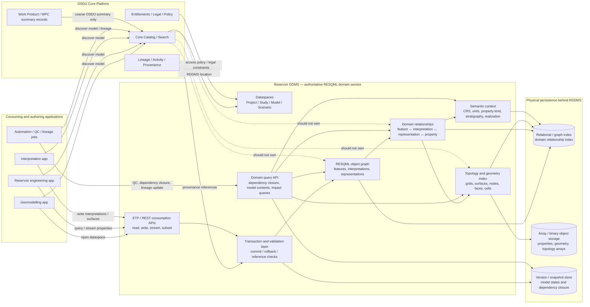
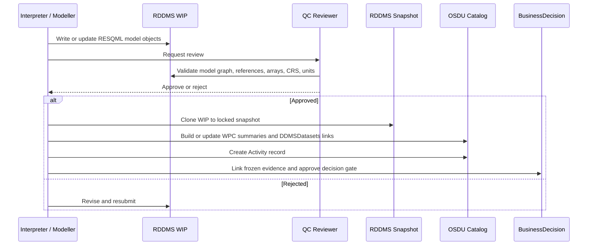

# Reservoir DDMS as a DDMS for RESQML versus pure Array store

## 1. Summary

This document explains why Reservoir DDMS, or RDDMS, should not be reduced to an array store while RESQML objects are broken out into OSDU WKS records in the core catalog.

The main paradigm is:

> **Catalog should discover reservoir models. RDDMS should manage and serve reservoir model content.**

RDDMS should act as a domain-aware consumption and collaboration zone for reservoir modelling data: RESQML objects, relationships, topology, geometry, semantic context, arrays, validation, transactions, model snapshots, and dependency closure.

At the same time, RDDMS must not become a duplicate enterprise master-data store for wells, logs, trajectories, stratigraphy, CRS, units, or other objects already owned by SDMA, Wellbore DDMS, Seismic DDMS, reference-data services, or the OSDU core catalog.

Each DDMS deals with different data types, resulting in adequate optimized designs. The pattern followed by other DDMS would for the RDDMS be analogous to:

- store only large numeric arrays in RDDMS;
- express RESQML objects as OSDU WKS records in the core catalog;
- rely on global catalog/search for discovery and object-level query.

That split is problematic for reservoir modelling.

RESQML is not simply “metadata plus arrays.” It is a domain object graph. The scientific meaning of the values is carried by linked RESQML objects: features, interpretations, representations, topology, geometry, properties, CRS, units, stratigraphy, realization context, structural frameworks, and modelling dependencies.

If arrays are in RDDMS but RESQML objects are decomposed into catalog records, the model is split across service boundaries. That separates values from meaning, weakens reproducibility, makes applications responsible for reassembling the graph, and turns the global catalog into an accidental reservoir model database.

The recommended separation is:

- **Core catalog:** global discovery, high-level WPCs, governance, lineage links, lifecycle state.
- **RDDMS:** authoritative RESQML model graph, model-specific objects, arrays, relationships, query, validation, transactions, dataspaces, snapshots, and consumption APIs.
- **Other DDMSs / enterprise systems:** authoritative ownership of their own master and reference data.

---

## 2. Design Principles

| # | Principle | Rationale |
|---|---|---|
| 1 | **Catalog discovers; RDDMS serves** | Core catalog should locate reservoir models. RDDMS should serve the internal model graph and arrays. |
| 2 | **RESQML should not be broken apart unnecessarily** | RESQML objects, arrays, topology, geometry, and semantic context form a connected model graph. |
| 3 | **Values require context** | A property array is meaningful only with its representation, grid, indexing, CRS, unit, property kind, and realization context. |
| 4 | **RDDMS owns model state, not all subsurface data** | RDDMS owns reservoir-model-specific content, not enterprise wells, logs, trajectories, CRS, or units. |
| 5 | **Master data is sacred** | Wells, wellbores, reservoirs, stratigraphy, CRS, units, and official reference values remain authoritative in their owning SoR. |
| 6 | **Reference first, snapshot when required** | RDDMS should reference external master data by stable IDs and versions; snapshot only for reproducibility. |
| 7 | **Derived model objects belong in RDDMS** | Blocked wells, grid/well intersections, upscaled logs, grid properties, and simulation-ready connections are model-derived content. |
| 8 | **WIP is isolated** | Project and discipline work should happen in mutable WIP dataspaces. |
| 9 | **Published model state is locked** | Gate snapshots and approved model versions should be immutable. |
| 10 | **Transactions matter** | Reservoir model updates often require multiple objects and arrays to be committed consistently. |
| 11 | **Copies are explicit and traceable** | Any copy across SoR/SoE or partner boundaries must carry source IDs, source versions, lineage, and Activity provenance. |
| 12 | **ACL defines data-room boundaries** | Sharing should normally be via governed access to dataspaces, not uncontrolled replication. |
| 13 | **Identity is deterministic** | Catalog records derived from RDDMS should use stable IDs so repeated manifest builds are idempotent. |

---

## 3 Why “Arrays in RDDMS, RESQML Objects in Catalog” Is Not Enough

### 3.1 It separates values from meaning

A numeric array is rarely meaningful by itself.

Examples:

- a grid property needs the grid, topology, indexing convention, property kind, units, and realization;
- a surface needs its interpretation, feature, CRS, domain, and relationship to horizons or faults;
- categorical values need lookup semantics;
- topology arrays need the representation that defines how nodes, faces, cells, columns, or layers are interpreted.

If arrays are stored in RDDMS and the RESQML objects that give those arrays meaning are stored as WKS records elsewhere, every consumer must reconstruct the model graph across services.

That makes consumption slower, more fragile, and less reproducible.

---

### 3.2 It breaks the RESQML object graph

RESQML objects are designed to reference each other as a graph:

```text
Feature
  → Interpretation
    → Representation
      → Geometry / Topology
      → Property
        → PropertyKind / Unit / Realization
```

For reservoir models, this graph may include:

- horizon and fault features;
- interpretations;
- point sets, polylines, surfaces, grids;
- structural frameworks;
- sealed models;
- grid geometry and topology;
- continuous, discrete, and categorical properties;
- CRS and units;
- stratigraphic organization;
- property kinds;
- realization or scenario context.

This is not a flat catalog problem. It is a domain graph problem.

---

### 3.3 Catalog search is not a reservoir model query engine

Core catalog/search is appropriate for questions such as:

- what reservoir models exist?
- which asset, project, or study do they belong to?
- who owns them?
- what legal tags apply?
- where is the authoritative RDDMS location?

RDDMS should answer questions such as:

- which properties belong to this grid?
- which surfaces define this structural framework?
- which objects are required to reproduce this model?
- which trajectories or logs were used to create these blocked wells?
- which property arrays belong to this realization?
- which model objects are affected if this interpretation changes?
- what is the dependency closure of this locked snapshot?

Those require RESQML-aware indexing, relationship traversal, and domain validation.

---

### 3.4 It weakens transactions and consistency

Reservoir model updates often involve coordinated writes:

- representation object;
- geometry arrays;
- topology arrays;
- property objects;
- property arrays;
- property kind;
- units;
- CRS;
- stratigraphic context;
- relationships;
- provenance.

If arrays are written to RDDMS while object records are written separately to catalog, consistency depends on distributed coordination.

Possible failure modes:

- array exists but object record is missing;
- object record exists but array is missing;
- object relationship points to stale array identity;
- catalog index is temporarily inconsistent;
- dependency graph is incomplete;
- partial model versions become discoverable.

RDDMS should provide transaction boundaries so that model updates are committed as coherent units.

---

### 3.5 It weakens reproducibility

A model version is reproducible only if the complete dependency context can be restored:

- input interpretations;
- structural framework;
- grids;
- topology;
- geometry;
- properties;
- property kinds;
- units;
- CRS;
- stratigraphy;
- external source references;
- snapshots where needed;
- provenance;
- version or gate context.

If RESQML objects live as catalog records and arrays live in RDDMS, reproducibility requires reassembling many pieces across service boundaries.

A proper RDDMS dataspace should be able to answer:

> “What complete set of model objects, arrays, references, snapshots, and dependencies are required to consume or reproduce this model version?”

---

## 4. What a Proper RDDMS Should Own

RDDMS should own the authoritative reservoir model state.

### 4.1 RESQML model graph

RDDMS should manage:

- features;
- interpretations;
- representations;
- grids;
- surfaces;
- point sets;
- curves;
- properties;
- property kinds;
- structural organization;
- stratigraphic organization;
- sealed model or framework objects;
- model-specific CRS and unit references;
- relationships between those objects.

---

### 4.2 Arrays and binary payloads

RDDMS should manage or provide access to:

- geometry arrays;
- topology arrays;
- grid pillar/corner arrays;
- nodes, faces, cells, columns, layers;
- continuous property arrays;
- discrete property arrays;
- categorical property arrays;
- active cell masks;
- realization-dependent arrays.

The important point is not that every byte must physically live in the same database. The important point is that RDDMS owns the domain relationship between objects, arrays, and meaning.

---

### 4.3 Topology and relational structures

RDDMS should index and query structures such as:

- cell-to-face relationships;
- face-to-node relationships;
- grid column/layer indexing;
- split coordinate lines;
- surface patch topology;
- fault/horizon relationships;
- representation-to-interpretation references;
- property-to-representation references;
- model organization membership.

This is where a relational or graph-style backend, for example PostgreSQL-style indexing, is materially more appropriate than relying only on global search.

---

### 4.4 Semantic context

RDDMS should preserve model-specific semantic context:

- property kind;
- unit;
- CRS;
- stratigraphic interval;
- feature/interpretation distinction;
- realization;
- scenario;
- contact or fluid context;
- modelling activity;
- source dependencies.

---

## 5. What RDDMS Should Not Own by Default

RDDMS should not become a second authoritative store for shared enterprise or cross-domain master data.

By default, RDDMS should not own:

- enterprise well identity;
- wellbore identity;
- official well trajectories;
- raw or governed well logs;
- official well markers where owned by Wellbore DDMS;
- enterprise stratigraphic columns;
- CRS definitions;
- units of measure;
- official reservoir or field master data;
- enterprise reference value sets;
- authoritative seismic volumes;
- raw FMU ensemble result stores.

Those should remain authoritative in SDMA, Wellbore DDMS, Seismic DDMS, reference-data services, Sumo/results stores, or core OSDU depending on the data type.

RDDMS should reference, snapshot, derive, or copy these objects according to explicit rules.

---

## 6. Responsibility Model Across Systems

| Layer | Responsibility | Examples | Ownership rule |
|---|---|---|---|
| Enterprise SoR / SDMA | Authoritative master data | Wells, wellbores, reservoirs, stratigraphy | Projects reference, never fork |
| Wellbore DDMS | Authoritative wellbore technical data | Trajectories, logs, markers, checkshots | RDDMS references or snapshots |
| Seismic DDMS | Authoritative seismic storage | Seismic volumes, bin grids | RDDMS references seismic context |
| Reference-data services | Authoritative reference data | CRS, units, reference values | RDDMS references |
| RDDMS | Authoritative reservoir model state | RESQML graph, grids, properties, frameworks, derived objects | RDDMS owns model content |
| OSDU catalog | Discovery and governance metadata | WPC summaries, DDMSDatasets, Activity, BusinessDecision, CollaborationProject | Catalog points to authority |
| SoE tools | Work-in-progress authoring | OpenWorks, DecisionSpace, Petrel, RMS, FMU/ERT | Write to WIP and promote |

---

## 7. Reference, Snapshot, Derive, Copy, or Cache

### 7.1 Reference only

Use for master and reference data that should remain authoritative elsewhere.

Examples:

- well;
- wellbore;
- official trajectory;
- official log;
- stratigraphic column;
- CRS;
- units;
- reference values.

RDDMS stores:

- stable OSDU ID;
- DDMS URI;
- source-system alias;
- version identifier where available;
- optional resolved display attributes.

---

### 7.2 Snapshot at model time

Use when a model must be reproducible exactly as built.

Examples:

- trajectory version used for blocked wells;
- log version used for upscaling;
- stratigraphic version used for layering;
- contact table used in a model decision;
- interpretation set used to build a grid.

RDDMS stores:

- source reference;
- source version;
- timestamp of resolution;
- frozen copy or materialized representation if required;
- provenance Activity;
- clear marker that this is a snapshot, not the master.

---

### 7.3 Derived-object ownership

Use when the project creates reservoir-model-specific derived objects.

Examples:

- blocked-wellbore representation;
- grid/well intersection;
- sampled log along model layers;
- upscaled NTG, porosity, permeability;
- simulation-ready well connections;
- model-specific contacts;
- property realizations;
- grid properties derived from logs or FMU outputs.

RDDMS owns these because they are part of the reservoir model, not the original source data.

---

### 7.4 Controlled copy

Use only for explicit data-room, partner, publication, or regulatory boundaries.

Rules:

- copy must be explicit;
- source IDs and source versions must be retained;
- legal tags and ACLs must be validated;
- ancestry and Activity provenance must be recorded;
- copied objects must not be confused with enterprise master records.

---

### 8.5 Non-authoritative cache

Use only for convenience or performance.

Examples:

- well name;
- UWI;
- field name;
- stratigraphic unit name;
- CRS display name;
- log mnemonic.

Rules:

- cached values are non-authoritative;
- source ID and source version must remain available;
- refresh or invalidation policy is required.

---

## 9. Internal RDDMS Service Architecture



---

## 10. Data-Flow Summary

| From | To | Pattern | Ownership rule |
|---|---|---|---|
| SDMA | RDDMS | Reference only | SDMA as current SoR |
| Wellbore DDMS | RDDMS | Reference or snapshot | Wellbore DDMS remains SoR |
| Enterprise reference data | RDDMS | Reference only | Enterprise catalog remains SoR |
| Seismic DDMS | RDDMS | Reference seismic context | Seismic DDMS remains SoR |
| OpenWorks / DecisionSpace | RDDMS WIP | Export model-specific interpretation content | RDDMS owns model copy or derived state |
| Petrel / RMS | RDDMS WIP | Write grids, properties, frameworks | RDDMS owns model state |
| FMU / ERT | Sumo/results store | Raw ensemble output | Results store owns raw ensemble set |
| FMU / ERT | RDDMS | Selected static model or realization content | RDDMS owns promoted model content |
| RDDMS WIP | RDDMS snapshot | Clone and lock | Snapshot is immutable model version |
| RDDMS snapshot | OSDU catalog | WPC summaries and `DDMSDatasets[]` | Catalog discovers; RDDMS remains authority |
| RDDMS / OSDU | BusinessDecision | Gate evidence | Decision references frozen evidence |

---

## 11. Operating Model

### 11.1 WIP dataspaces

Project teams work in isolated mutable RDDMS dataspaces.

Examples:

```text
project-x/wip
project-x/geo-wip
project-x/gph-wip
project-x/res-wip
project-x/fmu-wip
```

WIP dataspaces contain:

- draft RESQML model objects;
- interpretations;
- surfaces;
- grids;
- properties;
- local derived objects;
- references to SDMA, Wellbore DDMS, Seismic DDMS, reference data, and OSDU catalog records;
- Activity provenance for significant changes.

They should not create new authoritative wells, official trajectories, enterprise stratigraphy, CRS, or units.

---

### 11.2 Locked snapshots

At project gates or major modelling milestones, WIP content is cloned or copied into immutable snapshots.

Examples:

```text
project-x/v1
project-x/v2
project-x/dg2
project-x/fmu-v3
```

Snapshots contain:

- locked model state;
- dependency references;
- frozen snapshots of selected dependencies where required;
- derived model objects;
- immutable gate evidence;
- catalog links from WPCs through `DDMSDatasets[]`.

---

### 11.3 Model SoR dataspaces

Approved model content can be promoted to curated model SoR dataspaces.

Examples:

```text
project-x/sor
enterprise-model-sor-field-a-v3
```

These are not enterprise master-data stores for wells or logs. They are curated reservoir model states.

---

### 11.4 OSDU catalog

The OSDU catalog should contain:

- Work Product and WPC summaries;
- `DDMSDatasets[]` links to RDDMS dataspaces or resources;
- `CollaborationProject`;
- `CollaborationProjectCollection`;
- `PersistedCollection` for frozen gate evidence;
- `Activity` records for provenance and version proxy;
- `BusinessDecision` records for gate decisions.

The catalog should not become the authoritative store for the internal RESQML graph.

---

## 12. Versioning Strategy

RDDMS dataspaces may be mutable and may not provide native version history in the way a source-control system would. A practical versioning strategy combines locked dataspaces, Activity records, lifecycle events, and persisted gate collections.

### 13.1 Dataspace snapshots

| Step | Action | Effect |
|---|---|---|
| 1 | Create WIP dataspace | Mutable working area |
| 2 | Iterate and QC | Objects evolve in-place |
| 3 | Clone WIP to snapshot | Point-in-time model state |
| 4 | Lock snapshot | Immutable version |
| 5 | Continue work in WIP | Next iteration starts |
| 6 | Repeat at next gate | New frozen version |

Example naming:

```text
project-x/wip
project-x/v1
project-x/v2
project-x/v3
```

---

### 12.2 Activity as version record

Each significant model update should create an Activity record acting as a version and provenance record.

Example content:

```json
{
  "kind": "osdu:wks:work-product-component--Activity:1.0.0",
  "data": {
    "Name": "Geomodel v3 - post-well-tie update",
    "WorkflowStatus": "Completed",
    "CreationDateTime": "2026-03-15T10:00:00Z",
    "Parameters": [
      {
        "Title": "InputDataspace",
        "ParameterRoleID": "Input",
        "StringParameter": "eml:///dataspace('project-x/v2')"
      },
      {
        "Title": "OutputDataspace",
        "ParameterRoleID": "Output",
        "StringParameter": "eml:///dataspace('project-x/v3')"
      },
      {
        "Title": "ChangeDescription",
        "ParameterRoleID": "Input",
        "StringParameter": "Incorporated new wells and updated Top Reservoir interpretation"
      }
    ]
  }
}
```

---

### 12.3 CollaborationProject lifecycle events

Lifecycle events provide a human-readable changelog.

```json
{
  "LifecycleEvents": [
    {
      "EventID": "1",
      "Name": "Created",
      "DateTime": "2026-01-15T09:00:00Z",
      "Remark": "Initial project workspace created"
    },
    {
      "EventID": "2",
      "Name": "v1 Snapshot",
      "DateTime": "2026-02-01T14:00:00Z",
      "Remark": "Pre-DG1 structural model"
    },
    {
      "EventID": "3",
      "Name": "v2 Snapshot",
      "DateTime": "2026-03-10T11:00:00Z",
      "Remark": "Post well-tie update"
    },
    {
      "EventID": "4",
      "Name": "Published to SoR",
      "DateTime": "2026-04-20T09:30:00Z",
      "Remark": "DG2 approved model promoted"
    }
  ]
}
```

---

### 12.4 Gate evidence snapshots

A `CollaborationProjectCollection` can represent a living trusted set. For a decision gate, use a `PersistedCollection` to freeze the exact evidence used for the decision.

| Item | CollaborationProjectCollection | PersistedCollection |
|---|---|---|
| Scope | Cross-gate trusted set | Single gate evidence |
| Mutability | Can grow over time | Frozen |
| Purpose | Current trusted project context | Reproducible decision basis |
| Referenced by | CollaborationProject | BusinessDecision |

Rule:

> Accumulate trusted references in the CollaborationProjectCollection. Freeze gate evidence in a PersistedCollection so a decision remains reproducible after the project moves on.

---

## 13. Publish Workflow



### Conflict handling

If concurrent edits target the same object, publish should fail rather than force-overwrite. The project should rebase on the latest accepted snapshot, reapply changes, and rerun QC.

### Rollback

Locked snapshots are immutable. Recovery means repointing catalog WPCs and project collections back to a previous locked version, then recording a rollback lifecycle event. Do not mutate a locked snapshot.

---

## 14. ACL, Legal, and Dataspace Governance

### 14.1 Dataspace and ACL pattern

| Dataspace | Lock state | Owners | Viewers |
|---|---|---|---|
| Project WIP | Unlocked | Project contributors | Project viewers |
| Project snapshot | Locked | Field or project owners | Project viewers |
| Model SoR | Locked | Asset or field owners | Enterprise or approved project viewers |
| JV/shared dataspace | Controlled | JV contributors | Partner data-room viewers |

### 14.2 Rules

- Dataspace ACL is the data-room boundary.
- Sharing should normally be access grant, not data copy.
- Copies are allowed only when the data-room, publication, or partner-delivery boundary requires it.
- Legal tags must be validated before promotion or sharing.
- WIP and published catalog records should not become more permissive than their source data.
- Cross-border or partner sharing must validate relevant data countries and legal constraints.

---

## 15. Practical Domain Rules

### 15.1 Wells and wellbores

Projects do not create authoritative wells or wellbores in RDDMS.

RDDMS may store:

- references to wells and wellbores;
- trajectory snapshot references;
- blocked-wellbore representations;
- grid/well intersections;
- simulation connection objects;
- derived well property summaries.

RDDMS should not store:

- new official well records;
- new official wellbore records;
- uncontrolled copies of raw logs;
- uncontrolled copies of official trajectories.

---

### 15.2 Logs

Raw and governed logs should remain in Wellbore DDMS or the appropriate enterprise well data store.

RDDMS may store:

- references to source logs;
- sampled values used in a model;
- upscaled log-derived properties;
- realization-specific derived properties;
- provenance linking model properties to source logs.

---

### 15.3 Stratigraphy

Enterprise stratigraphic columns should remain centrally governed.

RDDMS may reference:

- stratigraphic column;
- stratigraphic rank;
- horizon-to-unit relationships;
- model-time stratigraphic version.

Project-local stratigraphy should only exist as proposal or WIP interpretation, not as a replacement for enterprise reference data.

---

### 15.4 CRS and units

CRS and units should be referenced from enterprise reference data.

RDDMS may cache resolved CRS or unit attributes for performance, but cached values are non-authoritative.

---

### 15.5 FMU and ensembles

Raw FMU ensemble results should normally stay in a fit-for-purpose results store.

RDDMS should contain:

- selected model objects;
- static model versions;
- selected realizations where needed;
- P10/P50/P90 or promoted summaries;
- model dependencies required for consumption.

OSDU catalog should expose promoted case or ensemble summaries and link to both RDDMS and the result store where appropriate.

---

## 16. Pros and Cons

### 16.1 Arrays-only RDDMS, RESQML objects in catalog

#### Pros

- Simpler RDDMS implementation.
- Reuses OSDU WKS/catalog infrastructure.
- Easier initial alignment with generic OSDU ingestion.
- Global search can discover individual object records.
- Less domain-specific persistence logic in RDDMS.
- May be acceptable for simple array-centric use cases.

#### Cons

- Breaks up the RESQML object graph.
- Separates numerical values from domain meaning.
- Makes applications reconstruct RESQML semantics.
- Weakens transactional consistency.
- Makes dependency closure harder.
- Makes reproducibility harder.
- Uses global search for domain graph queries it is not optimized for.
- Creates duplicated logic across applications.
- Risks orphan arrays and orphan object records.
- Reduces RDDMS to a binary sidecar.
- Limits RDDMS as a consumption zone.
- Makes geomodelling workflows harder to support directly.

---

### 16.2 RDDMS as proper DDMS

#### Pros

- Keeps RESQML objects, relationships, and arrays under a domain service boundary.
- Preserves the scientific meaning of arrays.
- Supports domain-aware query.
- Supports model dependency closure.
- Enables transactional model updates.
- Improves consistency and reproducibility.
- Improves interactive application performance.
- Supports direct application read/write workflows.
- Enables RDDMS as a reservoir consumption and collaboration zone.
- Better supports complex geomodelling workflows.

#### Cons

- More complex to implement.
- Requires RESQML-aware parsing, validation, storage, and APIs.
- Requires clear boundaries with core catalog and other DDMSs.
- Requires governance around dataspace semantics.
- Requires more operational maturity.
- Requires applications to integrate with RDDMS APIs rather than only catalog/search.
- May be more than needed for simple array-only use cases.

---

## 17. When Simpler Patterns Are Acceptable

Some use cases may not require a full RDDMS consumption-zone model.

Examples:

- single interpretation arrays with limited context;
- simple grid or surface exchange;
- read-only archive cases;
- low-frequency access;
- datasets that are not combined with wells, logs, stratigraphy, grids, or FMU workflows;
- application-owned workflows where the platform only needs discovery and storage.

But for geomodelling, where values depend on topology, relationships, CRS, units, property kinds, stratigraphy, feature/interpretation semantics, and model context, RDDMS needs to manage more than arrays.

---

## 18. Risks and Mitigations

| Risk | Mitigation |
|---|---|
| RDDMS becomes duplicate Wellbore DDMS | Explicit ownership rules: reference wells/logs, derive model objects only. |
| RDDMS dataspace drift | Require Activity records, lifecycle events, and periodic manifest/catalog sync. |
| No native full versioning | Use locked snapshots, Activities, CollaborationProject lifecycle events, and PersistedCollections. |
| Stale external references | Store source version, timestamp, and dependency status; snapshot where reproducibility requires. |
| Catalog becomes accidental model database | Keep catalog to summaries and DDMS links; keep internal RESQML graph in RDDMS. |
| Orphan arrays or object records | RDDMS transaction and validation layer must check references and dependency closure. |
| ACL sprawl | Standardize dataspace and group naming; automate project setup and cleanup. |
| Legal-tag inconsistency | Validate legal tags and data countries at publish/share time. |
| Cross-tool duplicate interpretations | Use stable IDs, source aliases, interpretation IDs, and lineage links. |
| Locked snapshots accumulate indefinitely | Define retention policy; never delete snapshots referenced by BusinessDecision or gate evidence. |

---

## 19. Implementation Checklist

### Project setup

- [ ] Create CollaborationProject.
- [ ] Create project WIP RDDMS dataspace.
- [ ] Create project baseline or SoR snapshot if required.
- [ ] Set dataspace ACL groups.
- [ ] Register legal tags and relevant data countries.
- [ ] Record project namespace and authoritative RDDMS references in catalog.
- [ ] Create initial CollaborationProjectCollection.

### During work

- [ ] Write model-specific RESQML objects to RDDMS WIP.
- [ ] Reference wells, logs, trajectories, CRS, units, and stratigraphy from authoritative sources.
- [ ] Snapshot external dependencies only where reproducibility requires.
- [ ] Store derived model objects in RDDMS.
- [ ] Create Activity records for significant model updates.
- [ ] Validate object graph, arrays, CRS, units, and references.

### At decision gate

- [ ] Clone WIP to locked snapshot.
- [ ] Build or update OSDU WPC summaries.
- [ ] Store `DDMSDatasets[]` links to authoritative RDDMS content.
- [ ] Create Activity version/provenance record.
- [ ] Create PersistedCollection for frozen evidence.
- [ ] Create BusinessDecision referencing evidence and Activity.
- [ ] Promote approved model content to model SoR if applicable.

### At project close

- [ ] Lock final accepted model snapshot.
- [ ] Archive or retain gate snapshots according to policy.
- [ ] Delete abandoned WIP dataspaces where allowed.
- [ ] Keep snapshots referenced by BusinessDecision or PersistedCollection.
- [ ] Record final lifecycle event.

---

## 20. Summary

RDDMS should not be reduced to an array store.

Storing arrays in RDDMS while converting RESQML objects into WKS records in the core catalog breaks the reservoir model across service boundaries. It separates the values from the context that gives those values meaning. For simple use cases this may be acceptable, but for geomodelling it weakens performance, consistency, reproducibility, and interoperability.

At the same time, RDDMS should not become a duplicate enterprise master-data store. Wells, wellbores, logs, trajectories, stratigraphy, CRS, units, and other centrally governed objects should remain authoritative in their owning systems.

The correct pattern is:

- **reference** enterprise master and reference data;
- **snapshot** external dependencies when reproducibility requires it;
- **derive** model-specific objects inside RDDMS;
- **copy** only when data-room, publication, or partner-sharing rules explicitly require it;
- **catalog** summary and governance metadata in OSDU core;
- **serve** the actual reservoir model graph through RDDMS.

> **Catalog finds the reservoir model. RDDMS understands, validates, queries, streams, versions, and serves the reservoir model.**
