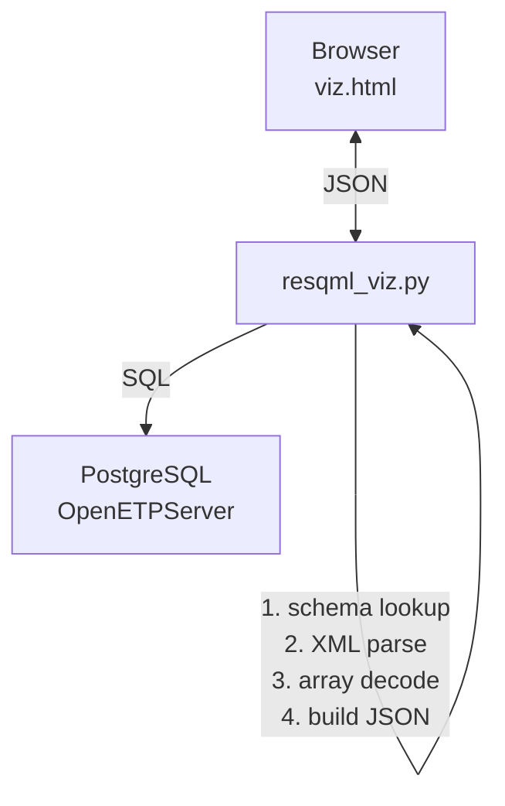

# ORES - User & Admin Guide

> What the web client does, how to use each page, authentication for users and admins,
> and the RESQML 3D data viewer.
>
> For development setup, demo pipelines, deployment, and internals see [Dev.md](Dev.md).
> For quick-start instructions see the [root readme](../readme.md).

---

## What the client can do

| Page | Purpose |
|------|---------|
| **ResDdmsAdmin** (`/`) | List and manage OSDU Dataspaces - create, lock, unlock, delete, build manifests |
| **ResDdmsQuery** (`/keys`) | Browse dataspaces, record types, individual objects; inspect table & graph data |
| **Resqml3D** (`/viz`) | Multi-object 3D viewer – render entire dataspaces or selected RESQML objects in Three.js |
| **GlobalSearch** (`/search`) | Query OSDU Search API with kind-specific cards (BusinessDecision, REV, Risk, GeoLabelSet) |
| **AnalyseDG** (`/analyse`) | Compare Business Decisions across decision gates (DG1-DG4) with volume/risk/economics deltas and charts |
| **Add DG** (`/add-dg`) | Create and ingest BusinessDecision, Activity, ActivityTemplate, CollaborationProject, PersistedCollection and generic records. See [Activity guide](/howto/activity) |
| **Stratigraphy** (`/strat`) | Preview and ingest stratigraphic column records |
| **GraphQL** (`/graphql`) | GraphiQL IDE for RESQML deep-search queries |
| **HowTo** (`/howto`) | Browse grouped markdown documentation articles |

### Key rendering features

- **BD cards** - gradient header, headline volume KPIs (three-tier fallback: stat WPC - GeoLabelSet - ext.equinor), development concept, reservoir properties, economics, schedule, production forecast chart, alternatives, risk chips, uncertainties, authors & governance.
- **REV cards** - teal-themed with P10/P50/P90 headlines, metadata highlights, full volume table.
- **Analyse comparison** - gate timeline, side-by-side metric deltas (STOIIP, NPV, CAPEX, etc.), risk diff chips, property diffs, Chart.js overlay charts.
- **Mermaid relationship graphs** - interactive record-relationship diagrams with ancestry, data references, type-based styling.

---

## Authentication & sessions

The auth middleware resolves an access token for every request using a **fallback chain**. Each step is tried in order; the first to succeed wins:

| Priority | Strategy | Source | When it kicks in |
|----------|----------|--------|------------------|
| 0 | **Per-user session** | User's own PKCE sign-in (session cookie → server-side tokens) | When user has an active session **for the current instance** |
| 1 | **Instance token** | `INSTANCE_<NAME>_REFRESH_TOKEN` or `_CLIENT_SECRET` | Zero-click, shared across all browser sessions |
| 2 | **Env token** | Top-level `REFRESH_TOKEN` env var | Legacy single-instance setups (migration aid) |
| 3 | **Redirect** | — | No token at all — browser gets `/login-page`, API gets `401` |

> **Instance-switch guard:** If the user's session was created for instance A but the
> active instance has since switched to B, the session token is **skipped** (wrong
> tenant / scope) and the middleware falls through to step 1.

### Per-instance flexibility

Different instances can use different credentials. The middleware doesn't care — it calls `inst.get_access_token()` which tries `refresh_token` first, then `client_credentials`.

| Instance | Secrets configured | `auth_mode` | Behaviour |
|----------|-------------------|-------------|----------|
| `eqndev` | `_CLIENT_SECRET` only | `per_user_pkce` | Every user signs in individually; `CLIENT_SECRET` is needed for the confidential-client PKCE exchange |
| `eqndeva` | `_REFRESH_TOKEN` + `_CLIENT_SECRET` | `refresh_token+client_credentials` | Zero-click via shared RT; client_credentials fallback; PKCE fallback |
| `preship` | `_CLIENT_SECRET` | `client_credentials` | Service principal only; PKCE fallback if secret expires |

> **Key point:** PKCE login is **always available** regardless of the instance's primary auth mode.
> The "Sign in with Microsoft" button appears on every page and on the login page.
> An expired client secret or refresh token doesn't lock users out — they can still sign in with their own Equinor account.

> **Confidential client:** When a `CLIENT_SECRET` is configured, it must be included in **every** OAuth2 request
> (authorize, token exchange, refresh). Omitting it causes Azure AD error `AADSTS7000218`.
> This is handled automatically by the code — just make sure the secret is set in `k8s/secret.yaml` or Radix Console.

### For admins - minting & rotating the shared refresh token

The shared refresh token gives all visitors zero-click OSDU access.
An admin mints it once via the CLI helper and stores it in `k8s/secret.yaml`:

```bash
# Step 1 - generate PKCE auth URL
python demo/mint_refresh_token.py

# Step 2 - sign in in your browser; copy the localhost:8400 callback URL
python demo/mint_refresh_token.py --callback "<callback URL>"
```

The script prints the refresh token. Update the secrets:

```yaml
# k8s/secret.yaml
INSTANCE_EQNDEV_CLIENT_ID:      "21b442a9-6c1c-4551-b234-afdf010dd3be"
INSTANCE_EQNDEV_SCOPE:          "bd0c9d90-89ad-4bb3-97bc-d787b9f69cdc/.default openid offline_access"
INSTANCE_EQNDEV_REFRESH_TOKEN:  "<token from script>"
```

> **Scope:** Use the ADME App ID scope `bd0c9d90-.../.default` for per-user delegated access.
> Do **not** use `https://energy.azure.com/.default` — that old scope only works for
> application-level grants (client_credentials / shared refresh_token) and will fail for PKCE.

For Radix deployments, set the same values in **Radix Console → ores → dev → Secrets**.

**Token rotation:** Azure AD may issue a new refresh token on every use.
The middleware auto-rotates it in memory (`auth.py` line ~82), so the original
token in `secret.yaml` becomes stale silently. If the pod restarts and the
old token no longer works, re-run `mint_refresh_token.py`.

**App registration checklist (Azure Portal → App registrations → `21b442a9-...`):**

| Setting | Value |
|---------|-------|
| Redirect URIs (Web) | `http://localhost:8400/callback` (CLI minting) |
|  | `http://localhost:8000/auth/callback` (local dev) |
|  | `https://web-ores-dev.c3.radix.equinor.com/auth/callback` (Radix dev) |
|  | `https://web-ores.c3.radix.equinor.com/auth/callback` (Radix prod) |
| Supported account types | Accounts in this organizational directory only (Equinor) |
| Allow public client flows | No — `CLIENT_SECRET` is always supplied (confidential client) |
| API permissions (delegated) | `bd0c9d90-89ad-4bb3-97bc-d787b9f69cdc` → `access_as_user` (ADME resource app) |
| Scopes | `bd0c9d90-.../.default openid offline_access` |

> **Tip:** CLI arguments `--client-id`, `--tenant`, `--scope` let you mint
> tokens for any app registration, not just the default `21b442a9` app.
>
> **ADME vs old scope:** The old `https://energy.azure.com/.default` scope only works for
> application-level grants (client_credentials). For per-user PKCE, use the ADME App ID
> `bd0c9d90-89ad-4bb3-97bc-d787b9f69cdc/.default` — admin consent must be granted for
> the `access_as_user` permission in the Enterprise Application blade.

---

### For users - signing in

End users **do not need any setup**. Authentication is fully automatic:

| Scenario | What happens |
|----------|--------------|
| Shared token is healthy (Mode 0) | Every visitor is authenticated instantly - no login required |
| Shared token expired / missing | User sees the **Sign in with Microsoft** button on the login page |
| After clicking Sign in | Browser redirects to Azure AD (Equinor tenant), user signs in |
| After Azure AD sign-in | Tokens are exchanged via PKCE, stored server-side - user lands on `/` |
| Subsequent visits (same browser) | Session cookie (30 days) re-uses stored tokens - no re-login |
| Access token expires (~1 h) | Silently refreshed from the per-user refresh token |
| Pod restart | Session cookie + SQLite lookup = seamless, no re-login |
| Session cookie expires (>30 d) | User must sign in again |
| Logout | Click **Logout** - session + stored tokens are cleared |

**Who can sign in:**

- Any Equinor employee whose Entra ID account has been granted access
  to the OSDU Energy Platform (the `energy.azure.com` API resource).
- No per-user configuration, token minting, or admin action is required.
- The app registration's audience and tenant restriction controls who
  is allowed (single-tenant: Equinor directory only).

**What users see on the login page:**

1. Instance selector (if multiple OSDU instances are configured).
2. Status badge showing whether the shared token is healthy.
3. **"Sign in with Microsoft"** button.
4. Note explaining that signing in is optional when the shared token works.

---

### Per-user PKCE login (technical detail)

When no shared instance token is configured (or it fails), the app performs an OAuth2 Authorization Code + PKCE exchange:

**Flow:**

1. User clicks "Sign in with Microsoft" → redirected to Azure AD.
2. Azure AD authenticates the user (Equinor SSO) and redirects back to `/auth/callback`.
3. App exchanges the authorization code for `access_token` + `refresh_token` + `id_token`.
4. `id_token` decoded to extract user's stable Azure AD Object-ID (`oid`) and UPN.
5. `refresh_token` persisted to local SQLite (`app/tokenstore.py`) keyed by `(oid, instance_name)`.
6. **30-day** signed session cookie set in browser - carries only `oid` + `instance_name`.

**Subsequent visits:**

- Valid session cookie + fresh AT cache → served immediately.
- Expired AT → silently refreshed from encrypted RT in SQLite.
- Server restarted → `oid` from session cookie looks up persisted RT, mints new AT (no re-login).
- Session cookie expired (>30 days) → user must log in again.

Users only re-authenticate if their Azure AD refresh token expires (90 days inactivity) or they click **Logout**.

---

## RESQML 3D Viewer (`/viz`)

The Resqml3D page renders RESQML objects from any dataspace in a shared
Three.js scene.  The backend constructs geometry JSON entirely from SQL
queries against the OpenETPServer PostgreSQL database - no REST calls in
the base case.

### Data flow: PostgreSQL → JSON

The OpenETPServer stores RESQML data in a PostgreSQL database with a
fixed schema per dataspace:

```text
admin.spaces   path, uid, dbfile  →  schema name (e.g. "ds_0001")
<schema>.res   guid, name, obj_id, typ_id          →  resource index
<schema>.obj   id, xml                              →  full RESQML XML
<schema>.typ   id, xml, uri_id                       →  type registry
<schema>.ary   obj_id, path, type, dim1..4, usize    →  array metadata
<schema>.bin   ary_id, idx, value (bytea)             →  array binary chunks
```

For **every object** the flow is:



**Step by step (example: PointSetRepresentation):**

1. **Schema lookup** - `admin.spaces` maps the dataspace path
   (e.g. `demo/Drogon`) to a PG schema name (e.g. `ds_0001`).
2. **Resource lookup** - `<schema>.res WHERE guid=$uuid` returns the
   internal `obj_id` and the object title.
3. **XML retrieval** - `<schema>.obj WHERE id=$obj_id` returns the full
   RESQML XML.  For types that encode geometry in XML (Grid2d lattice
   origin, offsets, CRS references) we parse it with `xml.etree`.
4. **Array listing** - `<schema>.ary WHERE obj_id=$obj_id` returns the
   paths and metadata for each HDF5-equivalent array
   (e.g. `points_patch0/points`, `zValues`).
5. **Binary decode** - `<schema>.bin WHERE ary_id=$id ORDER BY idx`
   returns binary chunks.  We concatenate them and `struct.unpack` into
   `float64`/`float32`/`int32` depending on `ary.type`.
6. **JSON construction** - the decoded arrays become `{kind, title,
   positions, indices, zmin, zmax, ...}` ready for Three.js.

This means: **no REST API, no HTTP overhead, no JSON roundtrips through
the RDDMS service**.  A single SQL connection reads XML metadata and raw
binary array data directly.

### Backend cascade (3 tiers)

Each viz fetch cascades through up to three backends:

| Priority | Backend | Env var | When used |
|----------|---------|---------|----------|
| 1 | Local PG | `GRAPHQL_PG_CONN_STRING` | Co-located with OpenETPServer (fastest, <50ms) |
| 2 | Remote PG | `RDDMS_PG_CONN_STRING` | Direct SQL to cloud-hosted RDDMS DB (prepared, not yet on ADME) |
| 3 | REST API | *(always available)* | Universal fallback via `/api/reservoir-ddms/v2/` |

Both PG tiers use the **same SQL helpers** (`_pg_schema_for_dataspace`,
`_pg_list_arrays`, `_pg_read_array`) - they just differ in which
`asyncpg` pool is used (local vs remote).

### Supported RESQML types

| RESQML Type | `kind` | Geometry source | Rendering |
|-------------|--------|----------------|-----------|
| Grid2dRepresentation | `surface` | XML lattice + z-value array | Triangulated mesh |
| TriangulatedSetRepresentation | `surface` | points + triangle-index arrays | Triangle mesh |
| PointSetRepresentation | `points` | points array | 3D point cloud |
| PolylineSetRepresentation | `polylines` | points + node-count arrays | Multi-polyline (faults, contours) |
| WellboreTrajectoryRepresentation | `trajectory` | control-points array | 3D polyline |
| DeviationSurveyRepresentation | `trajectory` | MD/incl/azimuth → min-curvature XYZ | 3D polyline |
| WellboreMarkerFrameRepresentation | `markers` | MD array + XML marker labels | Labelled 3D points |

### API endpoints

| Method | Path | Purpose |
|--------|------|---------|
| GET | `/viz` | Dedicated multi-object 3D viewer page |
| GET | `/keys/viz/objects.json?ds=...` | List 3D-renderable objects grouped by type |
| POST | `/keys/viz/batch.json` | Batch-fetch geometry for up to 50 objects |
| GET | `/keys/object/geometry3d.json` | Single-object geometry (used by `/keys` page) |
| GET | `/keys/object/map.png` | Grid2d depth-map PNG rendering |

### Frontend (`viz.html`)

The viewer is a self-contained page with:
- **Layer panel** - dataspace selector, objects grouped by type, per-object
  checkboxes, select-all / deselect-all, load-selected / clear-scene.
- **Three.js viewport** - shared scene for all loaded objects, orbit/pan/zoom
  controls, auto-rotation, depth-coloured surfaces, palette-coloured lines.
- **Batch loading** - objects are fetched in parallel chunks of 20 via the
  batch API to keep load times reasonable.
- **Legend + HUD** - live object count, vertex count, colour key.

---

## Documentation guides

These articles are also available in the app at `/howto`:

| Guide | Topic |
|-------|-------|
| [Activity](Activity.md) | Activity & ActivityTemplate records |
| [BdDemo](BdDemo.md) | Business Decision data model walkthrough |
| [BusinessDecision](BusinessDecision.md) | BD schema patterns (Parameters vs Collections) |
| [DevConcept](DevConcept.md) | DevelopmentConcept custom WPC schema |
| [SeisInt](SeisInt.md) | Seismic interpretation OSDU/RESQML model |
| [StratColumn](StratColumn.md) | Stratigraphic column data model |
| [CrsGuide](CrsGuide.md) | CRS mapping RESQML ↔ OSDU |
| [FmuOsdu](FmuOsdu.md) | FMU-to-OSDU workflow |
| [Risk](Risk.md) | Risk register modelling |
| [Uncertainty](Uncertainty.md) | Uncertainty & volumes workflow |
| [Volumes](Volumes.md) | ReservoirEstimatedVolumes schema |
| [GeoLabelSet](GeoLabelSet.md) | GeoLabelSet headline KPIs |
| [Query](Query.md) | Querying data: REST, ETP, GraphQL & OSDU Search |

**Developer docs:** [Dev.md](Dev.md) — environment setup, project layout, demo pipelines, deployment, caching, testing.
