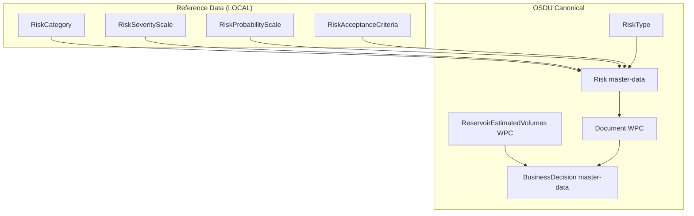
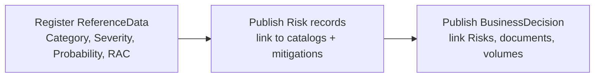

# Risk Data Management in OSDU

> **Purpose:** Documents the risk data management approach and OSDU mapping, using reference-data catalogs, canonical `Risk` master-data records, and `BusinessDecision` linkage.

---

## 1. Concept Overview

The pattern involves three layers:
1. **Reference-data catalogs** (LOCAL) - risk categories, severity/probability scales, acceptance criteria
2. **Risk master-data** - canonical `Risk:1.2.0` records with inherent→residual ratings, ownership, mitigations
3. **BusinessDecision** - links risks, governance documents, and evidence WPCs

---

## 2. Architecture

### 2.1 Entities & Relationships



### 2.2 Gate Data Flow



### 2.3 Ingestion Order

Reference-data → Master-data → WPCs. OSDU Manifest processing validates that referenced records exist.

---

## 3. OSDU Mapping

| Concept | OSDU canonical kind | How stored |
|---|---|---|
| Risk category | `reference-data--RiskCategory:1.0.0` (LOCAL) | Risk `CategoryID` |
| Severity scale | `reference-data--RiskSeverityScale:1.0.0` (LOCAL) | Risk `SeverityScaleID` + codes S1–S5 |
| Probability scale | `reference-data--RiskProbabilityScale:1.0.0` (LOCAL) | Risk `ProbabilityScaleID` + codes P1–P5 |
| Acceptance criteria | `reference-data--RiskAcceptanceCriteria:1.0.0` (LOCAL) | Risk `RiskAcceptanceCriteriaID` |
| Risk record | `master-data--Risk:1.2.0` | Canonical; `TypeID` → `RiskType:risk` |
| Mitigation docs | `work-product-component--Document` | Risk `MitigationActionIDs` |
| Static volumes | `work-product-component--ReservoirEstimatedVolumes:1.1.0` | BD links WPC |
| Decision record | `master-data--BusinessDecision:1.0.0` | Links Risks + Volumes + Documents |

---

## 4. Implementation - Manifest Patterns

### 4.1 Reference-data catalogs

```json
{
  "kind": "osdu:wks:Manifest:1.0.0",
  "ReferenceData": [
    {
      "id": "dev:reference-data--RiskCategory:Subsurface-Static",
      "kind": "osdu:wks:reference-data--RiskCategory:1.0.0",
      "data": { "Name": "Subsurface - Static", "Code": "Subsurface-Static" }
    },
    {
      "id": "dev:reference-data--RiskSeverityScale:<scale-name>",
      "kind": "osdu:wks:reference-data--RiskSeverityScale:1.0.0",
      "data": {
        "Name": "Severity scale 1-5",
        "Levels": [
          { "Code": "S1", "Name": "Insignificant" },
          { "Code": "S2", "Name": "Minor" },
          { "Code": "S3", "Name": "Moderate" },
          { "Code": "S4", "Name": "Major" },
          { "Code": "S5", "Name": "Catastrophic" }
        ]
      }
    }
  ]
}
```

### 4.2 Risk master-data

```json
{
  "id": "dev:master-data--Risk:<risk-name>:1",
  "kind": "osdu:wks:master-data--Risk:1.2.0",
  "data": {
    "Name": "Depth conversion & top reservoir uncertainty",
    "Summary": "Depth conversion uncertainty may lower structural elevation and volumes.",
    "TypeID": "osdu:reference-data--RiskType:risk:1.0.0",
    "ext": {
      "<operator>": {
        "CategoryID": "dev:reference-data--RiskCategory:Subsurface-Static",
        "SeverityScaleID": "dev:reference-data--RiskSeverityScale:<scale>",
        "ProbabilityScaleID": "dev:reference-data--RiskProbabilityScale:<scale>",
        "InherentSeverity": "S4", "InherentProbability": "P3",
        "ResidualSeverity": "S3", "ResidualProbability": "P2",
        "MitigationActionIDs": ["dev:work-product-component--Document:<doc>:1"],
        "Status": "Open"
      }
    }
  }
}
```

### 4.3 BusinessDecision linking risks

```json
{
  "id": "dev:master-data--BusinessDecision:<project>-DG2:1",
  "kind": "osdu:wks:master-data--BusinessDecision:1.0.0",
  "data": {
    "DecisionLevelID": "osdu:reference-data--DecisionLevel:DG2:1.0.0",
    "RiskAssessmentDocument": "dev:work-product-component--Document:<sra>:1",
    "RiskIDs": ["dev:master-data--Risk:<risk-1>:1", "dev:master-data--Risk:<risk-2>:1"]
  }
}
```

---

## 5. Operational Notes

- **Schema registration:** LOCAL kinds must be registered (Schema Service state PUBLISHED) before ingesting records that reference them.
- **Ingestion order:** ReferenceData → MasterData → WPCs.
- **Manifest vs Storage:** Manifests use array structure; Storage API expects single-record JSON.

---

## 6. Why this approach is compliant

- **Canonical schemas**: Risk (`master-data--Risk:1.2.0`), volumes (`ReservoirEstimatedVolumes:1.1.0`), documents, and manifest semantics from OSDU Schema Service.
- **Reference governance**: Operator taxonomies live as LOCAL catalogs per OSDU reference-data governance (FIXED/OPEN/LOCAL).
- **Auditability**: Decision lineage, mitigations linked to Document WPCs, ensemble provenance captured.

---

## 7. References

- OSDU Schema Service: https://community.opengroup.org/osdu/platform/system/schema-service
- OSDU Risk schema: https://community.opengroup.org/osdu/platform/system/schema-service/-/blob/master/deployments/shared-schemas/osdu/master-data/Risk.1.2.0.json
- OSDU Data Definitions overview: https://osduforum.org/osdu-data-definition-documentation/
- Manifest ingestion concepts: https://learn.microsoft.com/en-us/azure/energy-data-services/concepts-manifest-ingestion
- Reference data governance (FIXED/OPEN/LOCAL): https://learn.microsoft.com/en-us/azure/energy-data-services/concepts-reference-data-values
