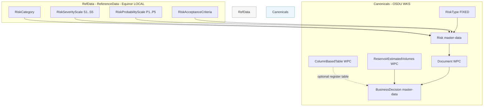
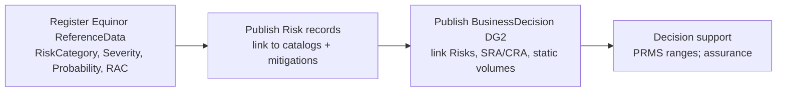
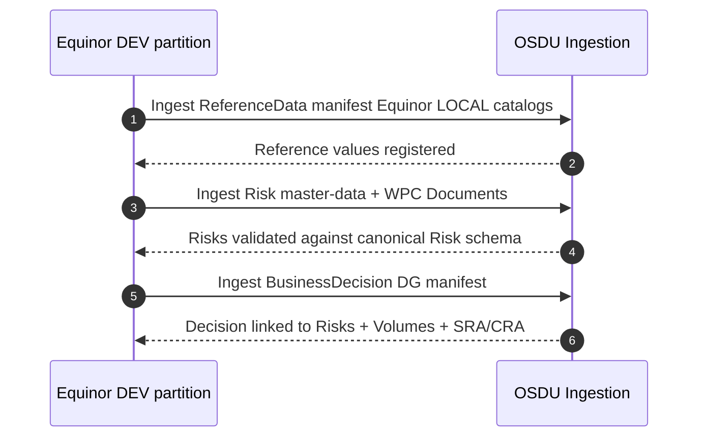

# README - Equinor Subsurface **Risk** Data Management in OSDU

> **Purpose.** This guide documents our **conceptual risk data management approach**, the **OSDU ↔ Equinor** mapping, and the **implementation** using three ingest artifacts:
>
> 1) **ReferenceData** (Equinor risk catalogs)  
> 2) **Risk** master‑data + mitigation **Document** WPCs  
> 3) **BusinessDecision** (DG2) linked to risks and static volumes

It includes **Mermaid diagrams**, sample **manifest snippets**, and **PowerShell-friendly** ingest commands and checks.

---

## 1) Concept Overview

We register **Equinor risk taxonomies** as LOCAL **ReferenceData** catalogs (categories, severity, probability, and RAC). We then publish formal **Risk** records conforming to the **OSDU canonical Risk schema**, referencing those catalogs and documenting **inherent→residual** ratings, ownership, mitigations, and status. Finally, we publish the **DG2 BusinessDecision** record, which links **Risk**, **SRA/CRA** documents, and the **static (in‑place)** volumetrics WPC, surfacing **PRMS P10/P50/P90** totals.

> **Sources (OSDU):** canonical **Risk** schema; **ReservoirEstimatedVolumes** WPC; **ColumnBasedTable** WPC; Manifest ingestion structure; Reference data governance & sync. See **References** below.

---

## 2) Architecture (Mermaid)

### 2.1 Entities & Relationships



### 2.2 Gate Data Flow (DG2)



### 2.3 Ingestion Sequence (OSDU Manifest semantics)



> **Why this order?** OSDU **Manifest** processing loads **ReferenceData → MasterData → Data (WPC, Datasets)**, and validation expects **reference values** to exist before records reference them. See references.

---

## 3) OSDU ↔ Equinor Mapping

| Equinor concept | OSDU canonical kind | How we store/reference |
|---|---|---|
| Risk subject/category (e.g., Subsurface‑Static/Dynamic, HSE) | `osdu:wks:reference-data--RiskCategory:1.0.0` (LOCAL) | Risk `data.ext.equinor.CategoryID` → `dev:reference-data--RiskCategory:*:1` |
| Severity scale S1–S5 | `osdu:wks:reference-data--RiskSeverityScale:1.0.0` (LOCAL) | Risk → `SeverityScaleID` + codes `S1..S5` |
| Probability scale P1–P5 | `osdu:wks:reference-data--RiskProbabilityScale:1.0.0` (LOCAL) | Risk → `ProbabilityScaleID` + codes `P1..P5` |
| Risk Acceptance Criteria (RAC) | `osdu:wks:reference-data--RiskAcceptanceCriteria:1.0.0` (LOCAL) | Risk → `RiskAcceptanceCriteriaID` + `AcceptanceRationale` |
| Formal Risk record | `osdu:wks:master-data--Risk:1.2.0` | Canonical Risk; `TypeID` → `osdu:reference-data--RiskType:risk:1.0.0` |
| Mitigation/assurance docs | `osdu:wks:work-product-component--Document:*` | Risk `MitigationActionIDs` → Document WPCs |
| Risk register table (optional) | `osdu:wks:work-product-component--ColumnBasedTable:*` | BusinessDecision `WorkProductComponents` include CBT |
| Static volumes (in-place) | `osdu:wks:work-product-component--ReservoirEstimatedVolumes:1.1.0` | BusinessDecision links WPC; PRMS ranges summarized |
| DG decision record | `osdu:wks:master-data--BusinessDecision:1.0.0` | Links Risks + Volumes + SRA/CRA + Assurance |

---

## 4) Implementation - Three Manifests (Snippets)

> Full files are included alongside this README in the ZIP archive.

### 4.1 ReferenceData (Equinor LOCAL catalogs) - `risk_refval_manifest.json`

```json
{
  "kind": "osdu:wks:Manifest:1.0.0",
  "ReferenceData": [
    {
      "id": "dev:reference-data--RiskCategory:Subsurface-Static",
      "kind": "osdu:wks:reference-data--RiskCategory:1.0.0",
      "acl": { "owners": ["data.default.owners@dev.dataservices.energy"], "viewers": ["data.office.global.viewers@dev.dataservices.energy"] },
      "legal": { "legaltags": ["dev-equinor-private-default"], "otherRelevantDataCountries": ["NO"] },
      "data": { "Name": "Subsurface - Static", "Code": "Subsurface-Static", "Description": "Geological/structural/NTG/in-place risks." }
    },
    {
      "id": "dev:reference-data--RiskSeverityScale:Equinor-5x5",
      "kind": "osdu:wks:reference-data--RiskSeverityScale:1.0.0",
      "acl": { "owners": ["data.default.owners@dev.dataservices.energy"], "viewers": ["data.office.global.viewers@dev.dataservices.energy"] },
      "legal": { "legaltags": ["dev-equinor-private-default"], "otherRelevantDataCountries": ["NO"] },
      "data": {
        "Name": "Equinor Severity scale 1–5",
        "Code": "S-5x5",
        "Levels": [
          { "Code": "S1", "Name": "Insignificant" },
          { "Code": "S2", "Name": "Minor" },
          { "Code": "S3", "Name": "Moderate" },
          { "Code": "S4", "Name": "Major" },
          { "Code": "S5", "Name": "Catastrophic" }
        ]
      }
    },
    {
      "id": "dev:reference-data--RiskProbabilityScale:Equinor-5x5",
      "kind": "osdu:wks:reference-data--RiskProbabilityScale:1.0.0",
      "acl": { "owners": ["data.default.owners@dev.dataservices.energy"], "viewers": ["data.office.global.viewers@dev.dataservices.energy"] },
      "legal": { "legaltags": ["dev-equinor-private-default"], "otherRelevantDataCountries": ["NO"] },
      "data": {
        "Name": "Equinor Probability scale 1–5",
        "Code": "P-5x5",
        "Levels": [
          { "Code": "P1", "Name": "Rare" },
          { "Code": "P2", "Name": "Unlikely" },
          { "Code": "P3", "Name": "Possible" },
          { "Code": "P4", "Name": "Likely" },
          { "Code": "P5", "Name": "Almost certain" }
        ]
      }
    },
    {
      "id": "dev:reference-data--RiskAcceptanceCriteria:RAC-2025-01",
      "kind": "osdu:wks:reference-data--RiskAcceptanceCriteria:1.0.0",
      "acl": { "owners": ["data.default.owners@dev.dataservices.energy"], "viewers": ["data.office.global.viewers@dev.dataservices.energy"] },
      "legal": { "legaltags": ["dev-equinor-private-default"], "otherRelevantDataCountries": ["NO"] },
      "data": {
        "Name": "Project RAC (2025) - Z-013 aligned",
        "Code": "RAC-2025-01",
        "Description": "Project-level acceptance criteria (ALARP) used at DG2/DG3.",
        "Source": "Equinor MS & NORSOK Z-013"
      }
    }
  ]
}
```

### 4.2 Risk master‑data + mitigation `Document` WPCs - `risk_manifest.json`

```json
{
  "kind": "osdu:wks:Manifest:1.0.0",
  "MasterData": [
    {
      "id": "dev:master-data--Risk:GRAND-DepthConversionTopReservoir:1",
      "kind": "osdu:wks:master-data--Risk:1.2.0",
      "acl": { "owners": ["data.default.owners@dev.dataservices.energy"], "viewers": ["data.office.global.viewers@dev.dataservices.energy"] },
      "legal": { "legaltags": ["dev-equinor-private-default"], "otherRelevantDataCountries": ["NO"] },
      "data": {
        "Name": "GRAND - Depth conversion & top reservoir uncertainty",
        "Summary": "Depth conversion uncertainty may lower structural elevation and volumes.",
        "Description": "Seismic time interpretation and time–depth conversion limitations drive static volumetric uncertainty.",
        "TypeID": "osdu:reference-data--RiskType:risk:1.0.0",
        "EffectiveDateTime": "2019-04-26T00:00:00Z",
        "ext": {
          "equinor": {
            "CategoryID": "dev:reference-data--RiskCategory:Subsurface-Static",
            "RiskAcceptanceCriteriaID": "dev:reference-data--RiskAcceptanceCriteria:RAC-2025-01",
            "SeverityScaleID": "dev:reference-data--RiskSeverityScale:Equinor-5x5",
            "ProbabilityScaleID": "dev:reference-data--RiskProbabilityScale:Equinor-5x5",
            "InherentSeverity": "S4", "InherentProbability": "P3",
            "ResidualSeverity": "S3", "ResidualProbability": "P2",
            "AcceptedAsIs": false,
            "AcceptanceRationale": "Residual risk acceptable contingent on actions MA-017 and MA-021 closed before DG3.",
            "RiskOwner": { "Name": "Subsurface Manager", "OrganisationName": "Equinor" },
            "MitigationActionIDs": [
              "dev:work-product-component--Document:MA-017-Depth-Conversion-Cal:1",
              "dev:work-product-component--Document:MA-021-Time-Depth-Joint-Inversion:1"
            ],
            "Status": "Open",
            "TargetDate": "2026-04-30",
            "InterpretationLineage": { "DecisionSpaceProject": "DSPROJ-GRAND-2025A", "OpenWorksUID": "OW-INT-000123" }
          }
        }
      }
    }
  ],
  "Data": {
    "Datasets": [],
    "WorkProductComponents": [
      {
        "id": "dev:work-product-component--Document:MA-017-Depth-Conversion-Cal:1",
        "kind": "osdu:wks:work-product-component--Document:1.0.0",
        "acl": { "owners": ["data.default.owners@dev.dataservices.energy"], "viewers": ["data.office.global.viewers@dev.dataservices.energy"] },
        "legal": { "legaltags": ["dev-equinor-private-default"], "otherRelevantDataCountries": ["NO"] },
        "data": {
          "Name": "MA-017 - Depth conversion calibration plan",
          "DocumentTypeID": "osdu:reference-data--DocumentType:Report:1.0.0",
          "FileAssociation": { "FileName": "MA-017_DepthConversionPlan.pdf" }
        }
      }
    ],
    "WorkProducts": []
  }
}
```

### 4.3 BusinessDecision (DG2) - `businessdecision_manifest.json`

```json
{
  "kind": "osdu:wks:Manifest:1.0.0",
  "MasterData": [
    {
      "id": "dev:master-data--BusinessDecision:GRAND-DG2-ConceptSelect:1",
      "kind": "osdu:wks:master-data--BusinessDecision:1.0.0",
      "acl": { "owners": ["data.default.owners@dev.dataservices.energy"], "viewers": ["data.office.global.viewers@dev.dataservices.energy"] },
      "legal": { "legaltags": ["dev-equinor-private-default"], "otherRelevantDataCountries": ["NO"] },
      "data": {
        "Name": "GRAND – Decision Gate 2 (DG2) Concept Select",
        "ProjectName": "Grane Northern Area Development (GRAND)",
        "DecisionLevelID": "osdu:reference-data--DecisionLevel:DG2:1.0.0",
        "ApprovalStatusID": "osdu:reference-data--DecisionApprovalStatus:Approved:1.0.0",
        "DecisionDueDate": "2019-04-26",
        "DecisionDate": "2019-04-26",
        "DecisionSummary": "Approve subsea tie-back to Grane; four 6-slot templates; start-up target initially June 2023.",
        "RiskAssessmentDocument": "dev:work-product-component--Document:PM398-DD-200-001_01_Final_INTERNAL.pdf:1",
        "RiskIDs": [
          "dev:master-data--Risk:GRAND-DepthConversionTopReservoir:1"
        ],
        "PriorActivityIDs": [
          "dev:work-product-component--ReservoirEstimatedVolumes:5033c9e2-b1cf-424a-86c9-76b846942cf8:1"
        ],
        "WorkProductComponents": {
          "Datasets": [
            "dev:work-product-component--ReservoirEstimatedVolumes:5033c9e2-b1cf-424a-86c9-76b846942cf8:1",
            "dev:work-product-component--Document:SRA-GRAND-DG2-Report:1",
            "dev:work-product-component--Document:CRA-GRAND-DG2-Report:1"
          ]
        },
        "ext": {
          "equinor": {
            "Alternatives": [
              { "Name": "Alt-A: Subsea to Grane", "Rank": 1, "Rationale": "Highest NPV; robust P50 volumes; acceptable residual risks." },
              { "Name": "Alt-B: FPSO", "Rank": 2, "Rationale": "Higher CAPEX & schedule risk per SRA/CRA." }
            ],
            "UncertaintySummary": {
              "Basis": "PRMS; probabilistic Monte Carlo using static volumes (in-place) from WPC 5033c9e2-...:1",
              "StaticInPlace_Oil_m3": { "P90": 120000000, "P50": 198000000, "P10": 263000000 }
            },
            "SRA": { "ReportID": "dev:work-product-component--Document:SRA-GRAND-DG2-Report:1", "RecommendedFloat_days": 60 },
            "CRA": { "ReportID": "dev:work-product-component--Document:CRA-GRAND-DG2-Report:1", "P50_CAPEX_MNOK": 9800 },
            "Assurance": { "IndependentReviewID": "dev:work-product-component--Document:Assurance-DG2-Review:1" }
          }
        }
      }
    }
  ]
}
```

---

## 5) Ingest Commands (PowerShell)

```powershell
# 1) ReferenceData first
osdu dataload ingest -p .\risk_refval_manifest.json

# 2) Risks + WPC Documents
osdu dataload ingest -p .\risk_manifest.json

# 3) BusinessDecision (DG2)
osdu dataload ingest -p .\businessdecision_manifest.json
```

**Storage route (alternative for ReferenceData):** one record per file (no arrays at top):

```powershell
osdu storage add -p .\refcat_subsurface_static.json `
                 -p .\refsev_equ5x5.json `
                 -p .\refprob_equ5x5.json `
                 -p .\rac_2025_01.json
```

> **Common pitfalls:** Don’t pass a **Manifest** to **Storage add**; Storage expects **single record** JSON objects. Avoid a **top‑level array** unless the CLI supports iterating lists.

---

## 6) Operational Checks

- **Schema registration:** Ensure LOCAL kinds are **registered** (Schema Service state **PUBLISHED**):  
  `reference-data--RiskCategory`, `--RiskSeverityScale`, `--RiskProbabilityScale`, `--RiskAcceptanceCriteria`.
- **Presence of ref values:**  
  `osdu storage get -i dev:reference-data--RiskSeverityScale:Equinor-5x5:1`
- **Risk discovery:** Search by category or status; verify `Inherent` vs `Residual` ratings.
- **Decision integrity:** Confirm DG2 links Risks + WPC docs (SRA/CRA) + static volumes; PRMS totals are surfaced.

---

## 7) Why this is compliant & future‑proof

- **Canonical schemas**: risk (`master-data--Risk:1.2.0`), volumes (`work-product-component--ReservoirEstimatedVolumes:1.1.0`), documents (`work-product-component--Document`), and manifest semantics come from OSDU’s **Schema Service** and usage guide.
- **Reference governance**: Equinor taxonomies live as **LOCAL** catalogs per OSDU **ReferenceData** governance (with FIXED/OPEN/LOCAL), enabling internal control while interoperating.
- **Auditability**: Decision lineage (interpretation IDs), assurance, and ensemble provenance are captured; mitigations link to WPC documents; optional CBT risk register provides tabular analytics.

---

## 8) References

- OSDU Schema Service (system docs): https://community.opengroup.org/osdu/platform/system/schema-service  
- OSDU **Risk** schema (shared schemas repo): https://community.opengroup.org/osdu/platform/system/schema-service/-/blob/master/deployments/shared-schemas/osdu/master-data/Risk.1.2.0.json  
- OSDU **ReservoirEstimatedVolumes** (data definitions): https://github.com/jonslo/osdu-data-data-definitions/blob/master/E-R/work-product-component/ReservoirEstimatedVolumes.1.1.0.md  
- OSDU **ColumnBasedTable** (data definitions): https://github.com/jonslo/osdu-data-data-definitions/blob/master/E-R/work-product-component/ColumnBasedTable.1.1.0.md  
- OSDU **Schema Usage Guide** & **Data Definitions** overview: https://osduforum.org/osdu-data-definition-documentation/  
- ADME **Manifest ingestion concepts**: https://learn.microsoft.com/en-us/azure/energy-data-services/concepts-manifest-ingestion  
- ADME **Reference data values & governance (FIXED/OPEN/LOCAL)**: https://learn.microsoft.com/en-us/azure/energy-data-services/concepts-reference-data-values
