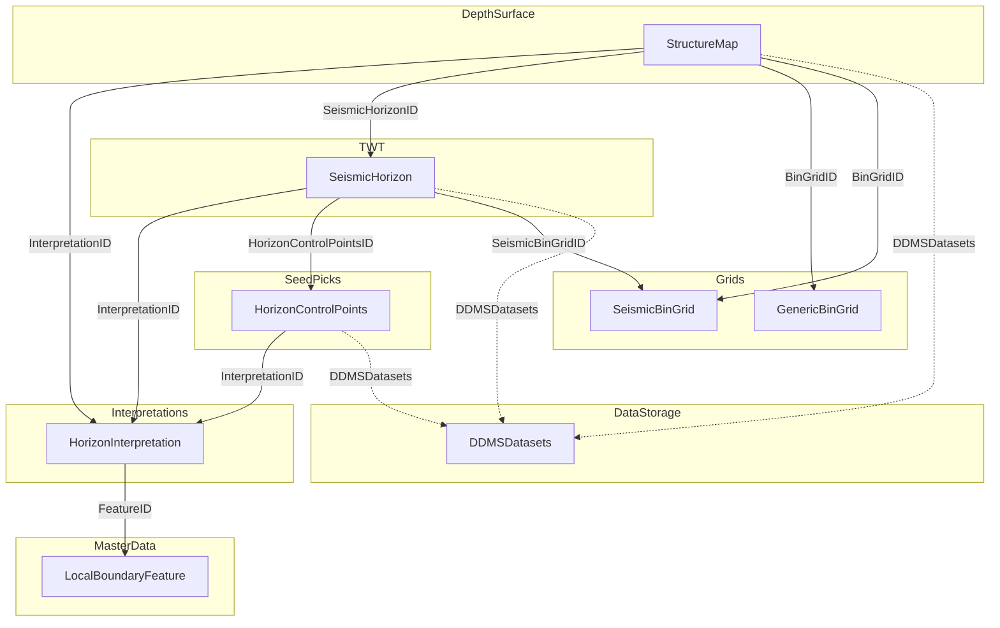

# OSDU Schemas for Seismic Interpretation — M27 Landscape & Worked Example

## Table of Contents

- [1) Executive Summary](#1-executive-summary)
- [2) M27 Official Schemas](#2-m27-official-schemas)
- [3) Schema Inheritance Architecture](#3-schema-inheritance-architecture)
- [4) Interpretation Chain — Seed to Surface](#4-interpretation-chain--seed-to-surface)
- [5) StructureMap:1.0.0 — Detailed Properties](#5-structuremap100--detailed-properties)
- [6) GenericBinGrid:1.0.0 & AbstractGenericBinGrid:1.0.0](#6-genericbingrid100--abstractgenericbingrid100)
- [7) HorizonControlPoints:1.0.0](#7-horizoncontrolpoints100)
- [8) SeismicHorizon:2.1.0](#8-seismichorizon210)
- [9) Field Alignment Across Schemas](#9-field-alignment-across-schemas)
- [10) Supplementary Proposal: SeismicInterpretationProject](#10-supplementary-proposal-seismicinterpretationproject)
- [11) Generating OSDU Records from RDDMS Content](#11-generating-osdu-records-from-rddms-content)
- [12) StructureMap in Reservoir DDMS — RESQML 2.2 Storage & Generation](#12-structuremap-in-reservoir-ddms--resqml-22-storage--generation)
- [13) Demo Implementation — Volantis Worked Example](#13-demo-implementation--volantis-worked-example)
- [14) Community Context & Open Questions](#14-community-context--open-questions)
- [15) Duplication Argument: StructureMap vs GenericRepresentation + HorizonInterpretation](#15-duplication-argument-structuremap-vs-genericrepresentation--horizoninterpretation)
- [16) References](#16-references)

---

## 1) Executive Summary

Seismic interpretation workflows produce **horizon surfaces**, **fault interpretations**, **velocity models**, and **bin grid definitions**. These objects live as RESQML content in the Reservoir DDMS (RDDMS), where they are accessed computationally. To make them **discoverable** — searchable by name, domain, spatial area, petroleum system element, interpreter — they must also be registered as OSDU catalog records (WPCs) in the search index.

### What changed with M27

The OSDU Data Definitions **M27 release** (tag v0.30.0, February 2026) shipped four new schemas that close the most critical gaps:

| New M27 Schema | What it catalogs |
|---|---|
| **`StructureMap:1.0.0`** | Depth/time gridded surfaces on a GenericBinGrid — the "depth structure map" |
| **`GenericBinGrid:1.0.0`** | Standalone reusable lattice grid, independent of seismic acquisition |
| **`HorizonControlPoints:1.0.0`** | Seed picks for horizon interpretation — the "control points" WPC |
| **`SeismicHorizon:2.1.0`** | Updated to link back to HorizonControlPoints via `HorizonControlPointsID` |

Together with the existing schemas, the M27 set provides a **complete interpretation chain**:

```
HorizonControlPoints  →  SeismicHorizon  →  StructureMap
   (seed picks)           (TWT surface)      (depth/time grid)
         │                     │                    │
         └──── all link to ────┘──── same ─────────►  HorizonInterpretation
                                                         (geologic meaning)
```

### What remains

| Gap | Status | Our Contribution |
|---|---|---|
| No project-level grouping of interpretation products | **Not yet addressed** by community | `SeismicInterpretationProject:1.0.0` proposal in [`demo/seisint/`](../demo/seisint/) |
| Worked example demonstrating the full chain | **Requested** ([Issue #31 note_100547](https://gitlab.opengroup.org/osdu/subcommittees/data-def/projects/seismic/docs/-/issues/31#note_100547): "a robust worked example would be valuable") | Volantis worked example in `demo/seisint/` |
| SeismicSurfaceGeneration activity template | **In progress** on [branch 822](https://gitlab.opengroup.org/osdu/data/data-definitions/-/tree/822) (Chris Hough + JFR) | Tracked, not implemented here |

### Existing Schemas (pre-M27)

| OSDU Schema | What it catalogs |
|---|---|
| `HorizonInterpretation:1.2.0` | Geologic meaning of a horizon (the "what") |
| `SeismicHorizon:2.0.0` | A TWT or depth surface pick on seismic geometry |
| `SeismicBinGrid:1.3.0` | Seismic acquisition lattice geometry |
| `SeismicFault:2.0.0` / `FaultInterpretation:1.1.0` | Fault picks and geologic interpretation |
| `GenericRepresentation:1.2.0` | Catch-all for any representation |
| `VelocityModeling:1.4.0` | Velocity model metadata |
| `LocalBoundaryFeature:1.1.0` | Geologic feature — the named "thing" (e.g. "Top Volantis") |

---

## 2) M27 Official Schemas

### 2.1 StructureMap:1.0.0

**Kind**: `osdu:wks:work-product-component--StructureMap:1.0.0`
**Status**: PUBLISHED — First deployed M27.0 (v0.30.0)
**Governance**: OSDU (Subsurface Geophysics domain)
**Consuming domains**: Subsurface GeologyPetrophysics, Subsurface Reservoir

**Description**: "A structure map representation is a support for properties based on a GenericBinGrid. Consequently, its type is always a Regular2DGrid. It is often associated to some Z values either in depth or time domain."

**Inherits**: `AbstractRepresentation:1.0.0` + `AbstractGenericBinGrid:1.0.0`

The dual inheritance is the key design decision — StructureMap gets **both** representation metadata (InterpretationID, CRS, DDMSDatasets) **and** inline grid geometry (Origin, Bearing, Width, NodeCount). When using an external grid, populate `BinGridID` instead of the inline AbstractGenericBinGrid properties.

**Individual properties** (beyond inherited):

| Property | Type | Target | Description |
|---|---|---|---|
| `BinGridID` | string | → GenericBinGrid:1.0.0 \| SeismicBinGrid:1.3.0 | Reference to existing bin grid. Mutually exclusive with inline grid. |
| `SeismicHorizonID` | string | → SeismicHorizon:2.1.0 | The seismic horizon from which this structure map was computed |
| `DomainTypeID` | string | → DomainType ref-data | Depth / Time / Mixed — "added to be human friendly and support search" |
| `ExtensionProperties` | object | — | Catch-all for operator-specific extensions |

### 2.2 GenericBinGrid:1.0.0

**Kind**: `osdu:wks:work-product-component--GenericBinGrid:1.0.0`
**Status**: PUBLISHED — First deployed M27.0
**Inherits**: `AbstractGenericBinGrid:1.0.0`

**Role**: Standalone, referenceable lattice grid independent of seismic acquisition. The non-seismic counterpart to `SeismicBinGrid:1.3.0`. Referenced by StructureMap via `BinGridID`.

No additional individual properties — all grid geometry comes from `AbstractGenericBinGrid:1.0.0` (see §6).

### 2.3 HorizonControlPoints:1.0.0

**Kind**: `osdu:wks:work-product-component--HorizonControlPoints:1.0.0`
**Status**: PUBLISHED — First deployed M27.0
**Inherits**: `AbstractRepresentation:1.0.0`

**Role**: Seed picks used for horizon interpretation. Links to seismic input data, well markers, and carries tabular control point data.

**Individual properties**:

| Property | Type | Description |
|---|---|---|
| `RepresentationRole` | ref-data | Role of the representation |
| `RepresentationType` | ref-data | Type (PointSet, etc.) |
| `SeismicTraceDataIDs[]` | rel → SeismicTraceData | Seismic cubes used for picking |
| `BinGridID` | rel → GenericBinGrid \| SeismicBinGrid | Grid context for picks |
| `SeismicLineGeometryIDs[]` | rel → SeismicLineGeometry | 2D line geometry refs |
| `Seismic3DInterpretationSetID` | rel → Seismic3DInterpretationSet | 3D survey context |
| `Seismic2DInterpretationSetID` | rel → Seismic2DInterpretationSet | 2D survey context |
| `DomainTypeID` | ref-data → DomainType | Depth / Time |
| `HorizontalCRSID` | rel → CoordinateReferenceSystem | CRS for pick coordinates |
| `VerticalDatum` | AbstractFacilityVerticalMeasurement | Vertical reference |
| `WellboreMarkerSetIDs[]` | rel → WellboreMarkerSet | Well tie markers |
| `HorizonControlPoints` | AbstractColumnBasedTable | Tabular pick data (I, J, X, Y, Z) |
| `ExtensionProperties` | object | Operator extensions |

### 2.4 SeismicHorizon:2.1.0

**Kind**: `osdu:wks:work-product-component--SeismicHorizon:2.1.0`
**Status**: PUBLISHED — First deployed M27.0

**Change from 2.0.0**: Added `HorizonControlPointsID` (→ HorizonControlPoints:1.0.0).

This single addition creates the **traceability link** from the interpolated surface back to the seed picks that generated it, completing the lineage chain.

---

## 3) Schema Inheritance Architecture

```
AbstractCommonResources:1.0.1          (id, kind, acl, legal, meta, tags)
    └─ AbstractWPCGroupType:1.2.0      (Datasets[], DDMSDatasets[], Artefacts[], NameAliases[])
        └─ AbstractWorkProductComponent:1.1.0  (Name, SpatialArea, SpatialPoint, GeoContexts[],
        │                                        LineageAssertions[], AuthorIDs[])
        ├─ AbstractInterpretation:1.1.0        (DomainTypeID, FeatureID, FeatureName)
        │   ├─ HorizonInterpretation:1.2.0     (StratigraphicRoleTypeID, BoundaryRelationTypeID, ...)
        │   └─ FaultInterpretation:1.1.0       (FaultThrowDescriptions[], IsListric, ...)
        │
        ├─ AbstractRepresentation:1.0.0        (InterpretationID, LocalModelCompoundCrsID,
        │   │                                    TimeSeries, RealizationIndex, IndexableElementCount[])
        │   ├─ SeismicHorizon:2.1.0            (DomainTypeID, SeismicHorizonTypeID, Interpreter, ...)
        │   ├─ SeismicFault:2.0.0              (DomainTypeID, BinGridID, Interpreter, ...)
        │   ├─ GenericRepresentation:1.2.0     (Role, Type)
        │   ├─ VelocityModeling:1.4.0          (...)
        │   ├─ HorizonControlPoints:1.0.0      (seed picks — M27)
        │   └─ StructureMap:1.0.0              (depth/time grid surface — M27)
        │       └─ also inherits AbstractGenericBinGrid:1.0.0 (dual inheritance)
        │
        ├─ AbstractBinGrid:1.1.0               (ABCDBinGridSpatialLocation)
        │   └─ SeismicBinGrid:1.3.0            (P6 properties, inline/crossline ranges)
        │
        └─ AbstractGenericBinGrid:1.0.0        (Origin, Bearing, Width, NodeCount — M27)
            └─ GenericBinGrid:1.0.0            (standalone grid entity — M27)
```

**Key design principles**:
- Schemas inheriting **AbstractInterpretation** carry geologic meaning (the "what") — no geometry data
- Schemas inheriting **AbstractRepresentation** carry surface/geometry metadata (the "how") — linked to an interpretation via `InterpretationID`
- Schemas inheriting **AbstractBinGrid** define seismic acquisition lattice geometry
- Schemas inheriting **AbstractGenericBinGrid** define non-seismic lattice geometry (new in M27)
- StructureMap has **dual inheritance**: AbstractRepresentation + AbstractGenericBinGrid (can define grid inline or reference via BinGridID)
- `DDMSDatasets[]` (from AbstractWPCGroupType) links the OSDU catalog record to the RDDMS object where the actual data lives

### AbstractGenericBinGrid vs AbstractBinGrid

M27 introduces `AbstractGenericBinGrid:1.0.0` as a **separate abstract** from the existing `AbstractBinGrid:1.1.0`. Key differences:

| Aspect | AbstractBinGrid:1.1.0 | AbstractGenericBinGrid:1.0.0 |
|---|---|---|
| Used by | SeismicBinGrid | GenericBinGrid, StructureMap |
| Direction | I & J axis via P6 vector increments | J axis bearing only (MapGridBearingOfBinGridJaxis) |
| Node counts | InlineMin/Max, CrosslineMin/Max (seismic terminology) | NodeCountOnIAxis, NodeCountOnJAxis (generic) |
| I-axis orientation | Explicit via P6BinNodeIncrementOnIaxis | Implicit: perpendicular to J, direction set by TransformationMethod (EPSG 9666 right-handed / 1049 left-handed) |
| ABCD corners | ABCDBinGridSpatialLocation | ABCDBinGridSpatialLocation (same) |
| Additional | — | ScaleFactor, TransformationMethod, BinGridName |

---

## 4) Interpretation Chain — Seed to Surface

The M27 schemas establish a complete, traceable chain from raw picks to final depth surface:



**The complete chain** for a single horizon:

```
LocalBoundaryFeature  →  HorizonInterpretation  →  HorizonControlPoints  →  SeismicHorizon (TWT)  →  StructureMap (Depth)
   "Top Volantis"          "Top Volantis"            "Top Volantis picks"     "Top Volantis TWT"       "Top Volantis Depth"
```

Each arrow represents a schema reference (FeatureID, InterpretationID, HorizonControlPointsID, SeismicHorizonID). The chain provides full provenance from named geologic feature through to the final depth map.

---

## 5) StructureMap:1.0.0 — Detailed Properties

### 5.1 Grid Sourcing Strategy

StructureMap supports two mutually exclusive approaches to grid definition:

| Approach | When to use | Properties populated |
|---|---|---|
| **Inline grid** | Surface has its own unique grid | `OriginEasting`, `OriginNorthing`, `BinWidthOnI/Jaxis`, `MapGridBearingOfBinGridJaxis`, `NodeCountOnI/JAxis`, `TransformationMethod`, `ABCDBinGridSpatialLocation` (from AbstractGenericBinGrid) |
| **External grid ref** | Multiple surfaces share a grid | `BinGridID` → GenericBinGrid:1.0.0 or SeismicBinGrid:1.3.0 |

The schema explicitly states: *"Mutually exclusive with inline bin grid definition via the AbstractGenericBinGrid properties. Only one approach should be populated."*

### 5.2 Complete Property Summary

| Source | Property | Type | Description |
|---|---|---|---|
| AbstractRepresentation | `InterpretationID` | rel → HorizonInterpretation (and others) | Geologic interpretation link |
| AbstractRepresentation | `InterpretationName` | string (derived) | Name from linked interpretation |
| AbstractRepresentation | `LocalModelCompoundCrsID` | rel → LocalModelCompoundCrs | CRS context |
| AbstractRepresentation | `TimeSeries` | object | Time-step reference for geomechanics |
| AbstractRepresentation | `RealizationIndex` | integer | Stochastic realization index |
| AbstractRepresentation | `IndexableElementCount[]` | array | Element counts |
| AbstractGenericBinGrid | `BinGridName` | string | Name of the bin grid |
| AbstractGenericBinGrid | `ABCDBinGridSpatialLocation` | AbstractSpatialLocation | ABCD corner coordinates |
| AbstractGenericBinGrid | `OriginEasting` | number | Grid origin easting |
| AbstractGenericBinGrid | `OriginNorthing` | number | Grid origin northing |
| AbstractGenericBinGrid | `ScaleFactor` | number | Scale factor (default 1) |
| AbstractGenericBinGrid | `BinWidthOnIaxis` | number | Node spacing on I axis |
| AbstractGenericBinGrid | `BinWidthOnJaxis` | number | Node spacing on J axis |
| AbstractGenericBinGrid | `MapGridBearingOfBinGridJaxis` | number (0–360°) | Clockwise from grid north to J axis |
| AbstractGenericBinGrid | `NodeCountOnIAxis` | number | Number of nodes on I axis |
| AbstractGenericBinGrid | `NodeCountOnJAxis` | number | Number of nodes on J axis |
| AbstractGenericBinGrid | `TransformationMethod` | integer | EPSG code: 9666 (right-handed) or 1049 (left-handed) |
| **Individual** | **`BinGridID`** | rel → GenericBinGrid \| SeismicBinGrid | External grid reference (mutex with inline) |
| **Individual** | **`SeismicHorizonID`** | rel → SeismicHorizon:2.1.0 | Source TWT surface |
| **Individual** | **`DomainTypeID`** | ref-data → DomainType | Depth / Time / Mixed |
| **Individual** | **`ExtensionProperties`** | object | Operator-specific extensions |

### 5.3 Design Notes

- **No Interpreter field**: Unlike SeismicHorizon:2.0.0, StructureMap does not have `Interpreter` or `Remarks[]`. This metadata can be carried in the inherited `AuthorIDs[]` (from AbstractWorkProductComponent) or in `ExtensionProperties`.
- **No RepresentationType**: The description states the type is "always Regular2DGrid", so there is no explicit property.
- **No PetroleumSystemElementTypeID**: Can be derived from the linked HorizonInterpretation / BoundaryFeature or placed in ExtensionProperties.
- **DomainTypeID note**: The schema description says it's "added to be human friendly and support search" and to "keep both properties synchronised" with HorizonInterpretation.

---

## 6) GenericBinGrid:1.0.0 & AbstractGenericBinGrid:1.0.0

### 6.1 AbstractGenericBinGrid Properties

All properties below are inherited by both `GenericBinGrid:1.0.0` and `StructureMap:1.0.0`:

| Property | Type | Description |
|---|---|---|
| `BinGridName` | string | Name of the bin grid |
| `ABCDBinGridSpatialLocation` | AbstractSpatialLocation:1.1.0 | Corner coordinates: A=(i=0,j=0), B=(i=0,j=jMax), C=(i=Imax,j=0), D=(i=Imax,j=Jmax) |
| `OriginEasting` | number | Easting of origin point (A point) |
| `OriginNorthing` | number | Northing of origin point (A point) |
| `ScaleFactor` | number | Scale factor for bin grid (default 1) |
| `BinWidthOnIaxis` | number | Distance between nodes on I axis |
| `BinWidthOnJaxis` | number | Distance between nodes on J axis |
| `MapGridBearingOfBinGridJaxis` | number (0–360°) | Clockwise angle from grid north to J axis direction |
| `NodeCountOnIAxis` | number | Count of nodes on I axis |
| `NodeCountOnJAxis` | number | Count of nodes on J axis |
| `TransformationMethod` | integer | EPSG 9666 (right-handed) or 1049 (left-handed) |

### 6.2 ABCD Corner Convention

```
A = (i=0, j=0)       origin
B = (i=0, j=jMax)    end of J axis from origin
C = (i=Imax, j=0)    end of I axis from origin  
D = (i=Imax, j=Jmax) far corner
```

**Note**: This ABCD convention differs from some earlier documents. The official schema description states: `A = (i=0, j=0), B = (i=0, j=jMax), C = (i=Imax, j=0) and D = (i=Imax, j=Jmax)`.

### 6.3 Conversion: GenericBinGrid ↔ SeismicBinGrid

Bidirectional conversion is supported (see `_shared.py` helpers):

| SeismicBinGrid | GenericBinGrid | Conversion |
|---|---|---|
| `P6BinGridOriginEasting` | `OriginEasting` | Direct copy |
| `P6BinGridOriginNorthing` | `OriginNorthing` | Direct copy |
| `P6BinNodeIncrementOnJaxis {X,Y}` | `BinWidthOnJaxis` + `MapGridBearingOfBinGridJaxis` | width = √(X²+Y²), bearing = atan2(X,Y) |
| `P6BinNodeIncrementOnIaxis {X,Y}` | computed from TransformationMethod | I-axis perpendicular to J, handedness sets direction |
| `InlineMax - InlineMin + 1` | `NodeCountOnIAxis` | Direct |
| `CrosslineMax - CrosslineMin + 1` | `NodeCountOnJAxis` | Direct |

### 6.4 TransformationMethod — Handedness

| EPSG Code | Name | I-axis relative to J-axis |
|---|---|---|
| 9666 | P6 Seismic Bin Grid Transformation (right-handed) | I-axis = J-axis bearing + 90° |
| 1049 | General polynomial transformation (left-handed) | I-axis = J-axis bearing - 90° |

Reference: IOGP Guidance Note 373-07-2 and 483-6.

---

## 7) HorizonControlPoints:1.0.0

### 7.1 Role in the Chain

HorizonControlPoints represents the **seed data** used to create an interpreted surface. This includes:
- Manual picks on seismic sections
- Auto-tracked picks
- Well markers used as tie points
- Any other control input

The `HorizonControlPoints` tabular data uses `AbstractColumnBasedTable` — a column-oriented storage format where columns can represent inline, crossline, X, Y, Z, confidence, etc.

### 7.2 Key Relationships

```
HorizonControlPoints
    ├─ InterpretationID    → HorizonInterpretation  (same geologic meaning)
    ├─ SeismicTraceDataIDs → SeismicTraceData[]      (input cubes)
    ├─ BinGridID           → GenericBinGrid | SeismicBinGrid  (grid context)
    ├─ WellboreMarkerSetIDs → WellboreMarkerSet[]    (well tie points)
    └─ Seismic3D/2DInterpretationSetID → survey context
```

### 7.3 Downstream Link

SeismicHorizon:2.1.0 references HorizonControlPoints via `HorizonControlPointsID`, creating full lineage:

```
Picks (HorizonControlPoints) → Surface (SeismicHorizon) → Depth Map (StructureMap)
```

---

## 8) SeismicHorizon:2.1.0

### 8.1 Change from 2.0.0

Only one addition:

| New Property | Type | Description |
|---|---|---|
| `HorizonControlPointsID` | rel → HorizonControlPoints:1.0.0 | Links the interpolated surface back to its seed picks |

All other properties remain the same as 2.0.0:

| Property | Type | Description |
|---|---|---|
| `DomainTypeID` | ref-data → DomainType | Depth / Time / Mixed |
| `RepresentationType` | ref-data → RepresentationType | Regular2DGrid, PolylineSet, etc. |
| `SeismicHorizonTypeID` | ref-data | Peak, Trough, Zero Crossing |
| `PetroleumSystemElementTypeID` | ref-data | Reservoir, Source, Seal |
| `Interpreter` | string | Person/team name |
| `Remarks[]` | array | Annotation remarks |
| `HorizonControlPointsID` | rel → HorizonControlPoints | **NEW in 2.1.0** — seed picks link |

### 8.2 DomainTypeID vs SeismicDomainTypeID

Issue [#12 (Seismic Domain vs Domain)](https://gitlab.opengroup.org/osdu/subcommittees/data-def/projects/seismic/home/-/issues/12) resolved the naming: `SeismicDomainTypeID` was migrated to `DomainTypeID` for consistency across all representation schemas. This was treated as a minor version bump (1.6.0 → 1.7.0 → 2.0.0) rather than a patch.

---

## 9) Field Alignment Across Schemas

### 9.1 Representation Schemas

| Field | SeismicHorizon:2.1.0 | SeismicFault:2.0.0 | StructureMap:1.0.0 | GenericRep:1.2.0 |
|---|---|---|---|---|
| `InterpretationID` | ✓ (inherited) | ✓ (inherited) | ✓ (inherited) | ✓ (inherited) |
| `DomainTypeID` | ✓ | ✓ | ✓ | ✗ |
| `RepresentationType` | ✓ | ✓ | ✗ (always Regular2DGrid) | ✓ (as `Type`) |
| `Interpreter` | ✓ | ✓ | ✗ | ✗ |
| `Remarks[]` | ✓ | ✓ | ✗ | ✗ |
| `PetroleumSystemElementTypeID` | ✓ | ✗ | ✗ | ✗ |
| `BinGridID` ref | ✗ (SeismicBinGridID) | ✓ | ✓ (GenericBinGrid \| SeismicBinGrid) | ✗ |
| `SeismicHorizonID` | ✗ | ✗ | ✓ | ✗ |
| `HorizonControlPointsID` | ✓ (M27) | ✗ | ✗ | ✗ |
| Inline grid properties | ✗ | ✗ | ✓ (AbstractGenericBinGrid) | ✗ |
| `LocalModelCompoundCrsID` | ✓ (inherited) | ✓ (inherited) | ✓ (inherited) | ✓ (inherited) |
| `DDMSDatasets[]` | ✓ (inherited) | ✓ (inherited) | ✓ (inherited) | ✓ (inherited) |
| `ExtensionProperties` | ✗ | ✗ | ✓ | ✗ |

### 9.2 Grid Schemas

| Field | SeismicBinGrid:1.3.0 | GenericBinGrid:1.0.0 | StructureMap:1.0.0 (inline mode) |
|---|---|---|---|
| `ABCDBinGridSpatialLocation` | ✓ | ✓ | ✓ |
| Origin Easting/Northing | ✓ (P6BinGridOrigin...) | ✓ (Origin...) | ✓ (Origin...) |
| Axis widths | ✓ (P6BinNodeIncrement vector) | ✓ (BinWidthOnI/Jaxis scalar) | ✓ (BinWidthOnI/Jaxis scalar) |
| Axis direction | ✓ (P6 increment vectors) | ✓ (MapGridBearingOfBinGridJaxis + TransformationMethod) | ✓ (same) |
| Node/range count | ✓ (InlineMin/Max, CrosslineMin/Max) | ✓ (NodeCountOnI/JAxis) | ✓ (NodeCountOnI/JAxis) |
| `BinGridName` | ✗ | ✓ | ✓ |
| `ScaleFactor` | ✗ | ✓ | ✓ |
| `TransformationMethod` | P6TransformationMethod | TransformationMethod (EPSG 9666/1049) | TransformationMethod |

### 9.3 Consistent Reference Data

| Ref-Data Type | Used By |
|---|---|
| `DomainType` (Depth/Time/Mixed) | HorizonInterpretation, SeismicHorizon, SeismicFault, StructureMap, HorizonControlPoints |
| `RepresentationType` | SeismicHorizon, SeismicFault, GenericRepresentation, HorizonControlPoints |
| `StratigraphicRoleType` | HorizonInterpretation |
| `BoundaryRelationType` | HorizonInterpretation |
| `PetroleumSystemElementType` | SeismicHorizon |

---

## 10) Supplementary Proposal: SeismicInterpretationProject

### 10.1 The Gap

A 2025 interpretation session produces 5 horizons, 3 faults, and a velocity model. There is no OSDU record linking them into a coherent project. Users rely on naming conventions or ad-hoc ancestry to find related objects.

The existing `Seismic3DInterpretationSet` (master-data) groups seismic **surveys** (geometry + trace data). It does not group interpretation **products** (horizons, faults, maps).

### 10.2 Proposal

**Kind**: `dev:wks:work-product-component--SeismicInterpretationProject:1.0.0`
**Inherits**: `AbstractWorkProductComponent:1.1.0` (NOT AbstractRepresentation — it's a grouping record)
**Schema**: [`demo/seisint/schema_seismicinterpretationproject.json`](../demo/seisint/schema_seismicinterpretationproject.json)

| Property | Type | Description |
|---|---|---|
| `HorizonInterpretationIDs[]` | rel → HorizonInterpretation | All horizons |
| `SeismicHorizonIDs[]` | rel → SeismicHorizon | TWT picks |
| `StructureMapIDs[]` | rel → StructureMap | Depth surfaces |
| `FaultInterpretationIDs[]` | rel → FaultInterpretation | Fault interpretations |
| `SeismicFaultIDs[]` | rel → SeismicFault | Fault representations |
| `SeismicTraceDataIDs[]` | rel → SeismicTraceData | Cubes interpreted |
| `SeismicBinGridID` | rel → SeismicBinGrid | Primary bin grid |
| `VelocityModelingID` | rel → VelocityModeling | Velocity model |
| `InterpreterName` | string | Person/team |
| `InterpretationDate` | datetime | When |
| `SoftwareUsed` | string | Application name + version |
| `ResqmlDataspaceID` | rel → ETPDataspace | RDDMS dataspace link |

---

## 11) Generating OSDU Records from RDDMS Content

OSDU catalog records are generated from RESQML content already stored in the RDDMS. This is a **metadata extraction + registration** pipeline, not a data copy.

### 11.1 Pipeline Pattern

```
RDDMS Dataspace
    │
    ├─ obj_GeneticBoundaryFeature      ──►  LocalBoundaryFeature (master-data)
    ├─ obj_HorizonInterpretation       ──►  HorizonInterpretation (WPC)
    ├─ seed picks / markers            ──►  HorizonControlPoints (WPC)       ◄── M27
    ├─ obj_Grid2dRepresentation (TWT)  ──►  SeismicHorizon (WPC)
    ├─ obj_Grid2dRepresentation (Depth)──►  StructureMap (WPC)               ◄── M27
    ├─ obj_FaultInterpretation         ──►  FaultInterpretation (WPC)
    ├─ obj_TriangulatedSetRep (fault)  ──►  SeismicFault (WPC)
    └─ (lattice geometry, non-seismic) ──►  GenericBinGrid (WPC)             ◄── M27
```

### 11.2 Key Mapping Rules

| RDDMS Source | OSDU Target | How |
|---|---|---|
| `Citation.Title` | `data.Name` | Direct copy |
| `Uuid` | `DDMSDatasets[].DatasetURI` | `eml://rddms/{dataspace}/{type}('{uuid}')` |
| `RepresentedInterpretation.UUID` | `data.InterpretationID` | Resolve to OSDU HorizonInterpretation ID |
| `LocalCrs` type (Depth3d vs Time3d) | `data.DomainTypeID` | Map to DomainType ref-data |
| `Grid2dPatch` axis counts | `NodeCountOnI/JAxis` (StructureMap inline) | Direct from RDDMS grid geometry |
| `Grid2dPatch` origin/offset | `OriginEasting/Northing` + bearing/width | Compute from RDDMS supporting representation |
| `BoundaryRelation[]` | `data.BoundaryRelationTypeID` | Map array → single most-specific value |
| `SequenceStratigraphySurface` | `data.StratigraphicRoleTypeID` | Enum → ref-data mapping |

### 11.3 DDMSDatasets[] — The RDDMS Link

Every OSDU representation WPC links to its RDDMS counterpart:

```json
{
  "DDMSDatasets": [{
    "SchemaFormatTypeID": "dev:reference-data--SchemaFormatType:RESQML20:Grid2dRepresentation:",
    "DatasetURI": "eml://rddms-1/dataspace('demo/volantis-interp')/resqml20.obj_Grid2dRepresentation('aabbccdd-1122-3344-5566-778899aabb01')"
  }]
}
```

---

## 12) StructureMap in Reservoir DDMS — RESQML 2.2 Storage & Generation

The OSDU StructureMap:1.0.0 is a **catalog record** — it provides searchable metadata. The actual depth surface data (Z values on a grid) lives in the Reservoir DDMS as RESQML content. This section documents the bidirectional mapping between OSDU StructureMap and RESQML 2.2 `Grid2dRepresentation`.

### 12.1 RESQML Native Representation

In RESQML 2.2 (and 2.0.1), a depth structure map is stored as a **`Grid2dRepresentation`** — the same type used for TWT seismic horizons. The distinction between TWT and depth is made entirely by the **LocalCrs** (Coordinate Reference System):

| Domain | CRS Property | RESQML Value |
|---|---|---|
| Time (TWT) | `LocalCrs → VerticalAxis.IsTime` | `true` |
| Depth | `LocalCrs → VerticalAxis.IsTime` | `false` |
| Mixed | Multiple patches with different CRS | — |

**There is no dedicated "StructureMap" type in RESQML** — a `Grid2dRepresentation` with `SurfaceRole: "map"` and a depth CRS **is** the structure map. No RESQML extension is required.

### 12.2 Grid Geometry — Two RESQML Patterns

RESQML offers two grid geometry strategies that map 1:1 to the OSDU StructureMap approaches (§5.1):

#### Pattern A: Inline Lattice → OSDU Inline Grid

```json
{
  "Points": {
    "$type": "resqml22.Point3dZValueArray",
    "SupportingGeometry": {
      "$type": "resqml22.Point3dLatticeArray",
      "AllDimensionsAreOrthogonal": true,
      "Origin": { "Coordinate1": 461000.0, "Coordinate2": 6782000.0, "Coordinate3": 0 },
      "Dimension": [
        { "Direction": { "Coordinate1": 0, "Coordinate2": 1, "Coordinate3": 0 },
          "Spacing": { "Value": 25.0, "Count": 199 } },
        { "Direction": { "Coordinate1": 1, "Coordinate2": 0, "Coordinate3": 0 },
          "Spacing": { "Value": 25.0, "Count": 299 } }
      ]
    },
    "ZValues": { "Values": [-2150.0, -2151.2, "..."] }
  }
}
```

| RESQML Lattice Property | OSDU StructureMap Property | Conversion |
|---|---|---|
| `Origin.Coordinate1` | `OriginEasting` | Direct (in projected CRS) |
| `Origin.Coordinate2` | `OriginNorthing` | Direct (in projected CRS) |
| `Dimension[slow].Spacing.Value` | `BinWidthOnJaxis` | Direct |
| `Dimension[fast].Spacing.Value` | `BinWidthOnIaxis` | Direct |
| `Dimension[slow].Direction` | `MapGridBearingOfBinGridJaxis` | `atan2(Coord1, Coord2)` |
| `Dimension[slow].Spacing.Count + 1` | `NodeCountOnJAxis` | RESQML count = steps; OSDU count = nodes |
| `Dimension[fast].Spacing.Count + 1` | `NodeCountOnIAxis` | Same |
| `AllDimensionsAreOrthogonal` + axis order | `TransformationMethod` | Right-handed → EPSG 9666 |

#### Pattern B: Supporting Representation → OSDU External BinGridID

```json
{
  "Points": {
    "$type": "resqml22.Point3dZValueArray",
    "SupportingGeometry": {
      "$type": "resqml22.Point3dFromRepresentationLatticeArray",
      "SupportingRepresentation": {
        "Uuid": "aa5b90f1-2eab-4fa6-8720-69dd4fd51a4d",
        "QualifiedType": "resqml22.Grid2dRepresentation",
        "Title": "Seismic BinGrid"
      },
      "NodeIndicesOnSupportingRepresentation": { "StartValue": 0, "Offset": ["..."] }
    },
    "ZValues": { "..." }
  }
}
```

| RESQML Property | OSDU StructureMap Property |
|---|---|
| `SupportingRepresentation.Uuid` | `BinGridID` → resolve UUID to OSDU GenericBinGrid or SeismicBinGrid ID |
| Inline grid properties | Empty — grid geometry comes from the referenced BinGrid |

### 12.3 Complete Property Mapping Table

| OSDU StructureMap Property | RESQML Grid2dRepresentation Property | Direction | Notes |
|---|---|---|---|
| `data.Name` | `Citation.Title` | ↔ | Direct copy |
| `InterpretationID` | `RepresentedObject.Uuid` (→ HorizonInterpretation) | ↔ | UUID ↔ OSDU ID resolution |
| `DomainTypeID` = Depth | `LocalCrs.VerticalAxis.IsTime = false` | ← RESQML | CRS-based detection |
| `DomainTypeID` = Time | `LocalCrs.VerticalAxis.IsTime = true` | ← RESQML | CRS-based detection |
| `SeismicHorizonID` | — | OSDU only | No RESQML equivalent; provenance via Activity or ExtraMetadata |
| `BinGridID` | `SupportingRepresentation.Uuid` | ↔ | Only when external grid pattern used |
| `OriginEasting/Northing` | `Point3dLatticeArray.Origin` | ↔ | Only when inline grid; needs CRS-to-projected transform |
| `BinWidthOnI/Jaxis` | `Dimension[].Spacing.Value` | ↔ | Constant spacing assumed |
| `MapGridBearingOfBinGridJaxis` | `atan2(Dim[J].Direction.Coord1, .Coord2)` | ← RESQML | Computed from direction vector |
| `NodeCountOnI/JAxis` | `FastestAxisCount` / `SlowestAxisCount` | ↔ | RESQML Spacing.Count = nodes−1 |
| `TransformationMethod` | `AllDimensionsAreOrthogonal` + axis ordering | ← RESQML | 9666 if right-handed |
| `ABCDBinGridSpatialLocation` | Computed from Origin + Dimension vectors | ← RESQML | Corner computation |
| `DDMSDatasets[].DatasetURI` | Self-reference | → OSDU | `eml://{rddms}/dataspace('...')/resqml22.Grid2dRepresentation('{uuid}')` |
| `ExtensionProperties` | `ExtraMetadata` | ↔ | Name-value pairs |

### 12.4 RESQML 2.2.1 Extension Assessment

**No formal RESQML extension is required.** RESQML 2.2 `Grid2dRepresentation` natively supports everything needed for an OSDU StructureMap:

| Requirement | RESQML 2.2 Support | Status |
|---|---|---|
| Regular depth grid with Z values | `Grid2dRepresentation` + depth CRS | ✓ Native |
| Inline grid geometry | `Point3dLatticeArray` | ✓ Native |
| External bin grid reference | `Point3dFromRepresentationLatticeArray` + `SupportingRepresentation` | ✓ Native |
| Link to interpretation | `RepresentedObject` → HorizonInterpretation | ✓ Native |
| CRS / domain type | `LocalCrs` with vertical axis configuration | ✓ Native |
| Z-value storage (HDF5, external) | `FloatingPointExternalArray` | ✓ Native |
| OSDU integration metadata | `OSDUIntegration` block + `ExtraMetadata` | ✓ Via existing EML extension point |

#### Recommended ExtraMetadata Conventions

Three OSDU-specific properties have no direct RESQML equivalent. For lossless round-tripping, store them as **`ExtraMetadata`** name-value pairs with an `osdu:` prefix:

| OSDU Property | ExtraMetadata Key | Value | Purpose |
|---|---|---|---|
| `SeismicHorizonID` | `osdu:SeismicHorizonID` | OSDU WPC ID | Provenance link to TWT source (no RESQML equivalent) |
| `DomainTypeID` | `osdu:DomainTypeID` | Ref-data ID | Redundant with CRS but enables catalog sync without CRS parsing |
| `TransformationMethod` | `osdu:TransformationMethod` | `9666` or `1049` | EPSG code — can be inferred from lattice but explicit is safer |

This approach avoids the governance overhead of a formal Energistics extension proposal while keeping the RESQML object self-documenting for OSDU round-tripping.

#### When Would an Actual Extension Be Needed?

1. RESQML needs to store **OSDU-specific typed relationships** natively (not just ExtraMetadata strings)
2. Validation tools need to enforce OSDU constraints at the RESQML level
3. The `OSDUIntegration` block needs StructureMap-specific fields beyond `OSDULineageAssertion`

None of these conditions are currently met. The ExtraMetadata convention approach is sufficient.

### 12.5 Generating StructureMap from RDDMS RESQML Content

Given RESQML objects already stored in the RDDMS, OSDU StructureMap records can be **automatically generated** via metadata extraction:

```
RDDMS Query: GET Grid2dRepresentations in dataspace
       │
       ▼
Filter: LocalCrs.VerticalAxis.IsTime == false  →  depth surfaces only
       │
       ▼
For each depth Grid2dRepresentation:
   1. Citation.Title         → data.Name
   2. RepresentedObject.Uuid → resolve to OSDU HorizonInterpretation ID
   3. Determine grid pattern:
      a. Point3dLatticeArray → inline grid → populate AbstractGenericBinGrid props
      b. Point3dFromRepresentationLatticeArray → external grid:
         - SupportingRepresentation.Uuid → resolve to OSDU GenericBinGrid/SeismicBinGrid
         - Set BinGridID
   4. Find TWT counterpart (same RepresentedObject, time CRS) → SeismicHorizonID
   5. Set DomainTypeID = Depth
   6. Build DDMSDatasets[].DatasetURI = eml://...
   7. Emit OSDU StructureMap:1.0.0 record
```

#### Finding the TWT Counterpart (SeismicHorizonID)

The `SeismicHorizonID` provenance link requires finding the TWT `Grid2dRepresentation` that shares the same `RepresentedObject` (HorizonInterpretation):

```python
# Query against RDDMS objects in the same dataspace
twt_counterpart = [
    rep for rep in grid2d_representations
    if rep.RepresentedObject.Uuid == depth_rep.RepresentedObject.Uuid
    and rep.LocalCrs.VerticalAxis.IsTime is True
]
# If found → resolve twt_counterpart.Uuid to OSDU SeismicHorizon WPC ID
# If not found → leave SeismicHorizonID empty (standalone depth surface)
```

### 12.6 Example: Reference JSON → OSDU StructureMap

Using `testHorizonEverythingIncluded.json` from `demo/seisint/references/` (a RESQML 2.2 JSON document with inline lattice geometry, depth CRS, and HorizonInterpretation):

**Input RESQML** (key properties):

```json
{
  "$type": "resqml22.Grid2dRepresentation",
  "Uuid": "030a82f6-10a7-4ecf-af03-54749e098624",
  "Citation": { "Title": "Horizon1 Interp1 Grid2dRep" },
  "RepresentedObject": {
    "Uuid": "ac12dc12-4951-459b-b585-90f48aa88a5a",
    "QualifiedType": "resqml22.HorizonInterpretation"
  },
  "SurfaceRole": "map",
  "FastestAxisCount": 4, "SlowestAxisCount": 2,
  "Geometry": {
    "Points": {
      "SupportingGeometry": {
        "$type": "resqml22.Point3dLatticeArray",
        "Origin": { "Coordinate1": 5010, "Coordinate2": 6020, "Coordinate3": 0 },
        "Dimension": [
          { "Direction": { "Coordinate1": 0, "Coordinate2": 0, "Coordinate3": 1 }, "Spacing": { "Value": 200, "Count": 1 } },
          { "Direction": { "Coordinate1": 0, "Coordinate2": 1, "Coordinate3": 0 }, "Spacing": { "Value": 250, "Count": 3 } }
        ]
      }
    }
  }
}
```

**Output OSDU StructureMap** (generated by `gen_structuremap_from_resqml.py`):

```json
{
  "kind": "osdu:wks:work-product-component--StructureMap:1.0.0",
  "data": {
    "Name": "Horizon1 Interp1 Grid2dRep",
    "DomainTypeID": "dev:reference-data--DomainType:Depth:",
    "InterpretationID": "dev:work-product-component--HorizonInterpretation:76204e5b-...:1",
    "OriginEasting": 5010,
    "OriginNorthing": 6020,
    "BinWidthOnIaxis": 200,
    "BinWidthOnJaxis": 250,
    "MapGridBearingOfBinGridJaxis": 0.0,
    "NodeCountOnIAxis": 2,
    "NodeCountOnJAxis": 4,
    "TransformationMethod": 9666,
    "DDMSDatasets": [
      "eml://rddms-1/dataspace('demo/volantis-interp')/resqml22.Grid2dRepresentation('030a82f6-...')"
    ]
  }
}
```

### 12.7 Reverse Direction: OSDU StructureMap → RESQML Storage

To store a new StructureMap in the RDDMS (e.g., from an interpretation application):

1. **Create RESQML objects**: `Grid2dRepresentation` + `LocalEngineeringCompoundCrs` (depth) + optional `HorizonInterpretation` + `BoundaryFeature`
2. **Map OSDU grid properties** to RESQML lattice geometry (see §12.3, reversed)
3. **Store Z values** in HDF5 (production) or inline XML array (small grids)
4. **Package as EPC** and upload via ETP to RDDMS
5. **Register the OSDU StructureMap** record pointing to the RDDMS object via `DDMSDatasets[]`

The key transformations for OSDU → RESQML direction:

| OSDU Property | RESQML Construction |
|---|---|
| `OriginEasting/Northing` | `Point3dLatticeArray.Origin.Coordinate1/2` |
| `MapGridBearingOfBinGridJaxis` | J-axis `Direction = (sin(bearing), cos(bearing), 0)` |
| `TransformationMethod` 9666 | I-axis `Direction = (sin(bearing+90°), cos(bearing+90°), 0)` |
| `BinWidthOnI/Jaxis` | `Spacing.Value` |
| `NodeCountOnI/JAxis` | `Spacing.Count = NodeCount - 1`, `FastestAxisCount = NodeCountI`, `SlowestAxisCount = NodeCountJ` |
| `DomainTypeID` = Depth | `LocalCrs.VerticalAxis.IsTime = false`, `Uom = "m"` |
| `SeismicHorizonID` | `ExtraMetadata: osdu:SeismicHorizonID` |
| `BinGridID` | `SupportingRepresentation` reference to bin grid Grid2dRepresentation |

### 12.8 Demo Script

The bidirectional mapping is implemented in [`demo/seisint/gen_structuremap_from_resqml.py`](../demo/seisint/gen_structuremap_from_resqml.py):

```bash
# RESQML → OSDU (from test JSON)
python gen_structuremap_from_resqml.py --from-resqml references/testHorizonEverythingIncluded.json

# OSDU → RESQML (from Volantis manifest)
python gen_structuremap_from_resqml.py --from-osdu manifest_volantis_interp.json

# Round-trip demo
python gen_structuremap_from_resqml.py --round-trip
```

Outputs:
- `structuremap_from_resqml.json` — OSDU StructureMap(s) generated from RESQML
- `resqml_from_structuremap.json` — RESQML document generated from OSDU StructureMaps
- `resqml_roundtrip.json` — Round-trip verification

---

## 13) Demo Implementation — Volantis Worked Example

Working example records and scripts are in [`demo/seisint/`](../demo/seisint/):

| File | Description |
|---|---|
| `_shared.py` | Shared helpers: deterministic UUIDs, ID builders, grid geometry, ABCD corners |
| `gen_volantis_interp.py` | Python generator script — produces the full manifest |
| `gen_structuremap_from_resqml.py` | Bidirectional RESQML ↔ OSDU StructureMap mapping (§12) |
| `manifest_volantis_interp.json` | Complete worked example: full chain for a Volantis interpretation |
| `schema_seismicinterpretationproject.json` | SeismicInterpretationProject:1.0.0 schema (supplementary proposal) |
| `references/` | Test horizon JSONs, discussion docs from OSDU GitLab |

### 13.1 Scenario

The manifest demonstrates the **Volantis 2025 Interpretation** — a synthetic scenario using realistic parameters for the Volantis field (Norwegian Sea):

| Layer | Records | Schema |
|---|---|---|
| Features | 3 (Top Volantis, Base Volantis, Top Therys) | `LocalBoundaryFeature:1.1.0` |
| Interpretations | 3 horizon interpretations | `HorizonInterpretation:1.2.0` |
| Seismic grid | 1 (Volantis3D, 12.5m × 12.5m) | `SeismicBinGrid:1.3.0` |
| TWT picks | 3 horizons | `SeismicHorizon:2.1.0` |
| Depth grid | 1 shared 25m grid | **`GenericBinGrid:1.0.0`** (M27) |
| Depth surfaces | 3 (2 on shared grid, 1 inline) | **`StructureMap:1.0.0`** (M27) |
| Project grouping | 1 | **`SeismicInterpretationProject:1.0.0`** (proposal) |
| **Total** | **~18 records** | |

### 13.2 Grid Strategy Demonstrated

The manifest shows both grid approaches:

| StructureMap Record | Grid Approach | Details |
|---|---|---|
| Top Volantis Depth Map | **External ref** → GenericBinGrid | `BinGridID` points to shared 25m grid |
| Base Volantis Depth Map | **External ref** → GenericBinGrid | Same shared grid |
| Top Therys Depth Map | **Inline grid** | Grid properties embedded directly on StructureMap |

### 13.3 Running the Generator

```bash
cd demo/seisint
python gen_volantis_interp.py
```

Output: `manifest_volantis_interp.json` — a complete OSDU manifest ready for ingestion via the Storage Service.

### 13.4 ORES Web App — Live StructureMap Generation

The ORES web app provides live StructureMap:1.0.0 generation from RDDMS content
via three REST endpoints. The implementation lives in two modules:

| Module | Purpose |
|---|---|
| [`app/structuremap.py`](../app/structuremap.py) | Reusable conversion logic: discover Grid2d surfaces, classify depth vs time, generate StructureMap:1.0.0 records |
| [`app/keys_router.py`](../app/keys_router.py) | FastAPI endpoints that expose the conversion over HTTP |

#### Endpoints

| Method | Path | Description |
|---|---|---|
| `GET` | `/keys/structuremaps/surfaces.json?ds=maap/drogon` | List & classify all Grid2dRepresentations (depth vs time) |
| `GET` | `/keys/structuremaps.json?ds=maap/drogon&prefix=dev` | Generate StructureMap:1.0.0 records for all depth surfaces |
| `POST` | `/dataspaces/manifest/structuremaps` | Build full M27 manifest from selected or all depth surfaces |

#### Pipeline Flow

```
RDDMS REST API                    ORES structuremap module         OSDU Catalog
  ┌─────────────┐                 ┌─────────────────────┐          ┌──────────┐
  │ list         │ ──resources──► │ discover_surfaces()  │          │          │
  │ Grid2dReps   │                │   classify by CRS    │          │          │
  ├─────────────┤                ├─────────────────────┤          │          │
  │ fetch each   │ ──geometry──►  │ surface_to_          │          │          │
  │ + CRS + z    │                │   structuremap()     │          │          │
  └─────────────┘                │   • bearing/width    │──smaps─►│ Ingest   │
                                  │   • ABCD corners     │          │ via      │
                                  │   • DDMSDatasets URI  │          │ Storage  │
                                  │   • InterpretationID  │          │ Service  │
                                  └─────────────────────┘          └──────────┘
```

#### Example: Generate manifest for maap/drogon

```bash
# 1. List surfaces (lightweight — no z-value fetch)
curl "$ORES_URL/keys/structuremaps/surfaces.json?ds=maap/drogon"

# 2. Generate StructureMap records for all depth surfaces
curl "$ORES_URL/keys/structuremaps.json?ds=maap/drogon&prefix=dev"

# 3. Build manifest for specific surfaces only
curl -X POST "$ORES_URL/dataspaces/manifest/structuremaps" \
  -H "Content-Type: application/json" \
  -d '{"ds": "maap/drogon", "uuids": ["aabb...", "ccdd..."]}'
```

#### Key Design Decisions

1. **Reuses `osdu.fetch_grid2d_surface()`** — same RDDMS REST calls as the existing map rendering
2. **CRS-based classification** — `LocalDepth3dCrs` → depth → StructureMap; `LocalTime3dCrs` → time → skipped
3. **Bearing/width from offset vectors** — RESQML 2.0.1 lattice `Offset[]` → compass bearing + bin width
4. **Deterministic IDs** — UUID5 from RDDMS UUID ensures same input always produces same OSDU record
5. **DDMSDatasets link** — every StructureMap links back to its RDDMS source via EML URI

---

## 14) Community Context & Open Questions

### 14.1 Key Decisions (from 2026 Meeting Minutes)

| Date | Decision |
|---|---|
| 2026-02-16 | **StructureMap, AbstractGenericBinGrid, GenericBinGrid approved for M27** |
| 2026-02-16 | **HorizonControlPoints approved for M27** with AbstractColumnBasedTable for tabular data |
| 2026-02-09 | SeismicHorizon:2.1.0 adds `HorizonControlPointsID` link |
| 2026-01-26 | Oslo F2F workshop dates confirmed: April 13–17, 2026 |

### 14.2 SeismicSurfaceGeneration Activity Template

[Issue #863](https://gitlab.opengroup.org/osdu/data/data-definitions/-/issues/863) tracks the creation of a `SeismicSurfaceGeneration` activity template on branch 822. This template defines the seed-to-surface workflow:

- **Inputs**: SeismicTraceData, SeismicBinGrid/GenericBinGrid, HorizonControlPoints, VelocityModel
- **Outputs**: SeismicHorizon, StructureMap
- **Parameters**: Grid parameterization, algorithm selection, domain type

When approved, it will provide standardized Activity records linking inputs to outputs — complementary to the schema-level references documented here.

### 14.3 Oslo F2F Workshop (April 2026)

The Oslo F2F (April 13–17, 2026) plans two MVP workshops:
- **MVP1**: Structure Map end-to-end demonstration (the [ddm_mvp1_structuremap](https://gitlab.opengroup.org/osdu/subcommittees/data-def/projects/seismic/ddm_mvp1_structuremap) repo)
- **MVP2**: Expanded scope (horizons + faults + activities)

Our Volantis worked example is positioned as a contribution to MVP1.

### 14.4 Open Questions

| Question | Status | Notes |
|---|---|---|
| Should StructureMap carry `Interpreter` / `Remarks[]`? | Open | SeismicHorizon has them; StructureMap relies on inherited AuthorIDs[] or ExtensionProperties |
| Multi-Z surfaces (structure map as 2D multi-z) | Deferred | Risk of duplicating what already exists in RESQML normalized model in the RDDMS |
| SeismicInterpretationProject as official schema | Not yet proposed | Our demo includes it; could be submitted after M27 |
| Generic Property WPCs for Z values | Under discussion | Properties on a StructureMap may be stored as separate GenericProperty WPCs |
| `VelocityModelID` not on any M27 schema | Open | No link from StructureMap to velocity model — add via ExtensionProperties now, propose for StructureMap:1.1.0 |
| `SeismicAttributeTypeID` ref-data missing | Parked | Useful for search ("show me all amplitude maps") but no ref-data defined yet |

### 14.5 Proposed Improvements for StructureMap:1.1.0

Properties that exist on SeismicHorizon but are absent from StructureMap, creating search asymmetry:

| Property | SeismicHorizon | StructureMap | Impact |
|---|---|---|---|
| `Interpreter` | ✓ | ✗ | Cannot search "depth maps by interpreter" without traversing SeismicHorizonID |
| `Remarks[]` | ✓ | ✗ | Annotations lost on depth conversion |
| `PetroleumSystemElementTypeID` | ✓ | ✗ | Cannot filter depth maps by reservoir/source/seal |

**Recommendation**: Propose `StructureMap:1.1.0` adding these as optional individual properties (non-breaking minor version bump).

### 14.6 Cross-Schema Consistency for RESQML Round-Tripping

| Field | Should Be On | Currently On | Status |
|---|---|---|---|
| `DomainTypeID` | All representations | SeismicHorizon, SeismicFault, StructureMap, HorizonControlPoints | ✓ Good |
| `InterpretationID` | All representations | All (via AbstractRepresentation) | ✓ |
| `BinGridID` | All grid-based representations | SeismicFault, StructureMap, HorizonControlPoints | SeismicHorizon uses `SeismicBinGridID` — inconsistent name |
| `Interpreter` | All representations | SeismicHorizon, SeismicFault only | **Gap** — StructureMap, HorizonControlPoints lack it |
| `DDMSDatasets[]` | All WPCs | All (via AbstractWPCGroupType) | ✓ |

HorizonInterpretation:1.2.0 also has RESQML mapping gaps worth noting:

| RESQML Property | Current OSDU | Improvement |
|---|---|---|
| `BoundaryRelation[]` (array) | `BoundaryRelationTypeID` (single) | Upgrade to `BoundaryRelationTypeIDs[]` (array) |
| `SequenceStratigraphySurface` | `StratigraphicRoleTypeID` | Need complete ref-data for RESQML enum values (`transgressive`, `maximum flooding`, etc.) |

---

## 15) Duplication Argument: StructureMap vs GenericRepresentation + HorizonInterpretation

A common counter-argument to StructureMap: *"We already have GenericRepresentation (which inherits AbstractRepresentation) and HorizonInterpretation. Can't we just store a depth map as GenericRepresentation with InterpretationID → HorizonInterpretation, and avoid creating a new schema?"*

This section evaluates the argument systematically.

### 15.1 Arguments **for** using GenericRepresentation (against StructureMap)

| # | Argument | Weight |
|---|---|---|
| 1 | **Fewer schemas to maintain** — every new schema adds governance burden, migration cost, and complexity | Strong |
| 2 | **GenericRepresentation already exists** — proven, deployed, indexed | Strong |
| 3 | **`ExtensionProperties` suffices** — any operator-specific metadata (grid params, depth range) can go in ExtensionProperties on GenericRepresentation | Medium |
| 4 | **RDDMS holds the data** — the OSDU record is just a catalog pointer, so thin metadata is acceptable | Medium |
| 5 | **Avoid proliferation** — creating StructureMap now may invite FaultMap, IsochoreMap, IsopachMap next | Medium |
| 6 | **HorizonInterpretation carries the semantics** — the "what" is already properly modeled; the representation just needs to be a pointer | Medium |

### 15.2 Arguments **for** StructureMap (against GenericRepresentation)

| # | Argument | Weight |
|---|---|---|
| 1 | **Search precision** — GenericRepresentation returns all 1D/2D representations (fault networks, arbitrary polylines, well paths). "Show me all depth maps" requires filtering by convention, not by `kind`. StructureMap gives a **type-safe search target**: `kind:*StructureMap*` | **Critical** |
| 2 | **Grid geometry as first-class data** — StructureMap inherits AbstractGenericBinGrid, giving it inline grid properties (origin, bearing, spacing, node count) or a BinGridID reference. GenericRepresentation has neither — grid context is completely opaque. | **Critical** |
| 3 | **Typed relationships** — StructureMap has `SeismicHorizonID` (provenance) and `DomainTypeID` (search). GenericRepresentation has only `Role` and `Type` (free-text-like, no ref-data enforcement) | Strong |
| 4 | **Consistent with OSDU patterns** — SeismicHorizon is a specialized representation (not GenericRepresentation). StructureMap follows the same pattern: a purpose-built schema for a specific domain object. GenericRepresentation is explicitly described as a "catch-all" — using it for a well-defined domain concept contradicts its purpose | Strong |
| 5 | **RESQML alignment** — RESQML has distinct types for Grid2dRepresentation (structure maps) vs PointSetRepresentation (picks) vs TriangulatedSetRepresentation (faults). A 1:1 mapping to distinct OSDU schemas preserves type information for round-tripping | Strong |
| 6 | **Grid reuse pattern** — StructureMap's BinGridID enables the pattern where N maps share one grid. With GenericRepresentation you'd need custom conventions for this | Medium |
| 7 | **Community consensus** — StructureMap was approved through the formal OSDU governance process (M27.0) after multi-year discussion across operators. The community explicitly chose not to use GenericRepresentation | Medium |

### 15.3 The Duplication Concern in Detail

The diagram below shows what is actually "duplicated":

```
GenericRepresentation (existing)
      inherits: AbstractRepresentation
      individual: Role (string), Type (string)
      → total individual properties: 2 (both free-text-like)

StructureMap (M27)
      inherits: AbstractRepresentation + AbstractGenericBinGrid
      individual: BinGridID, SeismicHorizonID, DomainTypeID, ExtensionProperties
      → total individual properties: 4 (all typed/referenced)
```

**What overlaps**: Both inherit `AbstractRepresentation` (InterpretationID, CRS, DDMSDatasets). This is by design — all OSDU representations share a common base. This is inheritance, not duplication.

**What does NOT overlap**:
- StructureMap adds `AbstractGenericBinGrid` (10 grid properties) — GenericRepresentation has nothing equivalent
- StructureMap adds `SeismicHorizonID` (typed provenance) — GenericRepresentation has no provenance link
- StructureMap adds `DomainTypeID` (ref-data search) — GenericRepresentation has no domain filtering
- GenericRepresentation's `Role`/`Type` are generic strings; StructureMap's type is implicit (always Regular2DGrid)

### 15.4 The HorizonInterpretation Angle

HorizonInterpretation is an **interpretation** (the "what"), not a **representation** (the "how"). The OSDU model explicitly separates these:

```
Interpretation (1) ──► Representations (N)
   "Top Volantis"        "TWT SeismicHorizon"  +  "Depth StructureMap"  +  "TriangulatedSet GenericRep"
```

HorizonInterpretation already links to StructureMap via the inherited `InterpretationID` on StructureMap. Creating StructureMap does not duplicate HorizonInterpretation — it provides the **representation-side record** that HorizonInterpretation references.

The question is whether this representation should be typed (StructureMap) or generic (GenericRepresentation). The M27 decision was: **typed**, because the additional grid geometry and typed references justify the dedicated schema.

### 15.5 Verdict

| Concern | Assessment |
|---|---|
| Schema count increases | True, but justified by search precision and grid geometry needs |
| Overlap with GenericRepresentation | Minimal — only shared AbstractRepresentation base (by design) |
| Overlap with HorizonInterpretation | None — different abstraction layer (interpretation vs representation) |
| Migration burden | Low — no existing data needs migration; StructureMap is additive |
| Future proliferation risk | Mitigated by ExtensionProperties and the StructureMap description explicitly stating "type is always Regular2DGrid" |

**Bottom line**: StructureMap is not a duplication of GenericRepresentation + HorizonInterpretation. It fills a genuine gap — **searchable, typed, grid-aware depth surface catalog records** — that the existing schemas do not provide. The community governance process validated this conclusion.

---

## 16) References

### OSDU Data Definitions — M27 Schemas

| Ref | Description |
|---|---|
| [StructureMap:1.0.0](https://community.opengroup.org/osdu/data/data-definitions/-/blob/master/E-R/work-product-component/StructureMap.1.0.0.md) | Official M27 schema |
| [GenericBinGrid:1.0.0](https://community.opengroup.org/osdu/data/data-definitions/-/blob/master/E-R/work-product-component/GenericBinGrid.1.0.0.md) | Official M27 schema |
| [AbstractGenericBinGrid:1.0.0](https://community.opengroup.org/osdu/data/data-definitions/-/blob/master/E-R/abstract/AbstractGenericBinGrid.1.0.0.md) | Official M27 abstract |
| [HorizonControlPoints:1.0.0](https://community.opengroup.org/osdu/data/data-definitions/-/blob/master/E-R/work-product-component/HorizonControlPoints.1.0.0.md) | Official M27 schema |
| [SeismicHorizon:2.1.0](https://community.opengroup.org/osdu/data/data-definitions/-/blob/master/E-R/work-product-component/SeismicHorizon.2.1.0.md) | Updated with HorizonControlPointsID |

### OSDU Data Definitions — Existing Schemas

| Ref | Description |
|---|---|
| [HorizonInterpretation:1.2.0](https://community.opengroup.org/osdu/data/data-definitions/-/blob/master/E-R/work-product-component/HorizonInterpretation.1.2.0.md) | Geologic meaning |
| [SeismicBinGrid:1.3.0](https://community.opengroup.org/osdu/data/data-definitions/-/blob/master/E-R/work-product-component/SeismicBinGrid.1.3.0.md) | Acquisition grid |
| [GenericRepresentation:1.2.0](https://community.opengroup.org/osdu/data/data-definitions/-/blob/master/E-R/work-product-component/GenericRepresentation.1.2.0.md) | Catch-all |
| [SeismicFault:2.0.0](https://community.opengroup.org/osdu/data/data-definitions/-/blob/master/E-R/work-product-component/SeismicFault.2.0.0.md) | Fault representation |
| [AbstractRepresentation:1.0.0](https://community.opengroup.org/osdu/data/data-definitions/-/blob/master/E-R/abstract/AbstractRepresentation.1.0.0.md) | Shared representation abstract |

### GitLab Project Resources

| Ref | Description |
|---|---|
| [Issue #31 — Support Depth Structure Map Use Case](https://gitlab.opengroup.org/osdu/subcommittees/data-def/projects/seismic/docs/-/issues/31) | Structure Map discussion + worked example request |
| [Issue #12 — Seismic Domain vs Domain](https://gitlab.opengroup.org/osdu/subcommittees/data-def/projects/seismic/home/-/issues/12) | DomainTypeID naming resolution |
| [Issue #863 — SeismicSurfaceGeneration Activity Template](https://gitlab.opengroup.org/osdu/data/data-definitions/-/issues/863) | Activity template in progress |
| [Seismic 2.0 ReadMe](https://gitlab.opengroup.org/osdu/subcommittees/data-def/projects/seismic/docs/-/blob/main/ReadMe.md) | Three-track roadmap |
| [Horizon Discussion Wrapup (Oct 2024)](https://gitlab.opengroup.org/osdu/subcommittees/data-def/projects/seismic/docs/-/blob/main/Seismic-Horizon-discussion-wrapup-Oct2024.md) | Architectural scenarios for SeismicHorizon evolution |

### ORES Workspace

| Doc | Description |
|---|---|
| [CrsGuide.md](CrsGuide.md) | CRS mapping guide |
| [StratColumn.md](StratColumn.md) | Stratigraphic column mapping |
| [FmuOsdu.md](FmuOsdu.md) | FMU ↔ OSDU mapping |
| [`demo/seisint/`](../demo/seisint/) | Worked example, schemas, generator scripts |

---

> **Document version**: 3.0 — 2026-04-07
> **Authors**: ORES project team
> **Status**: Updated for M27 — documents official schemas + worked example
> **Previous versions**: 2.0 (pre-M27 gap analysis), 1.0 (initial RESQML comparison)
