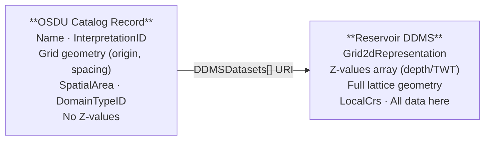
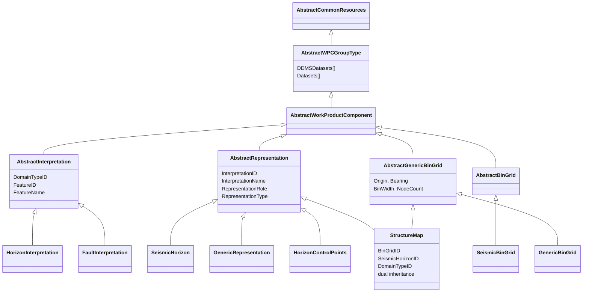
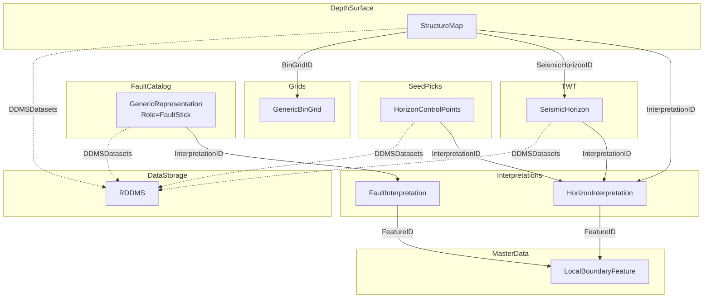
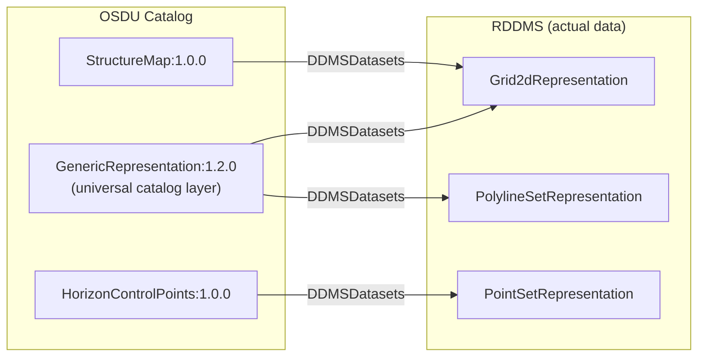
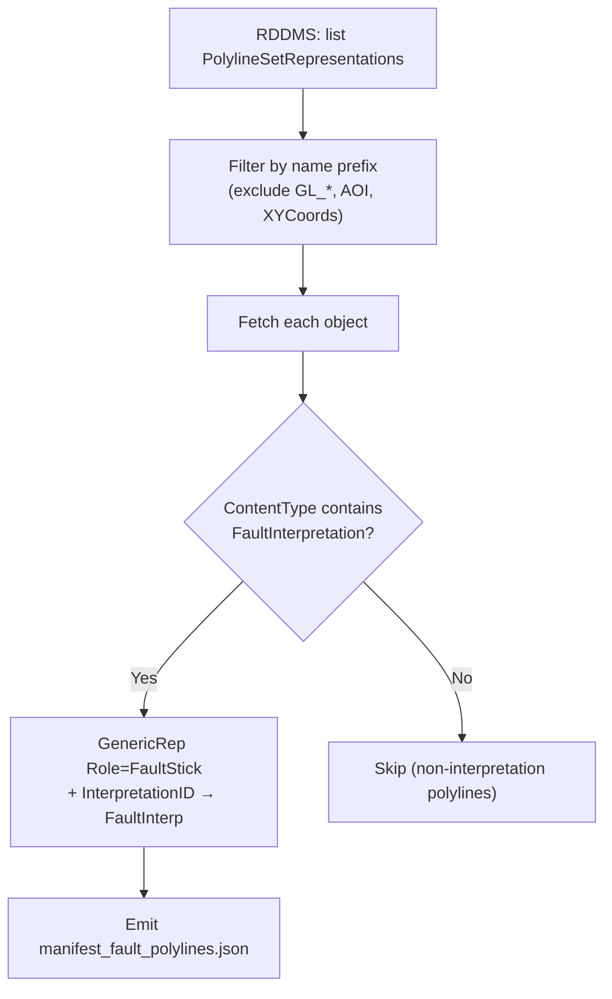
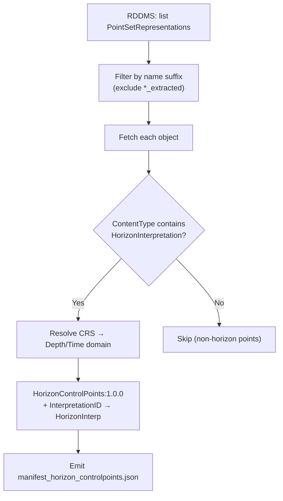
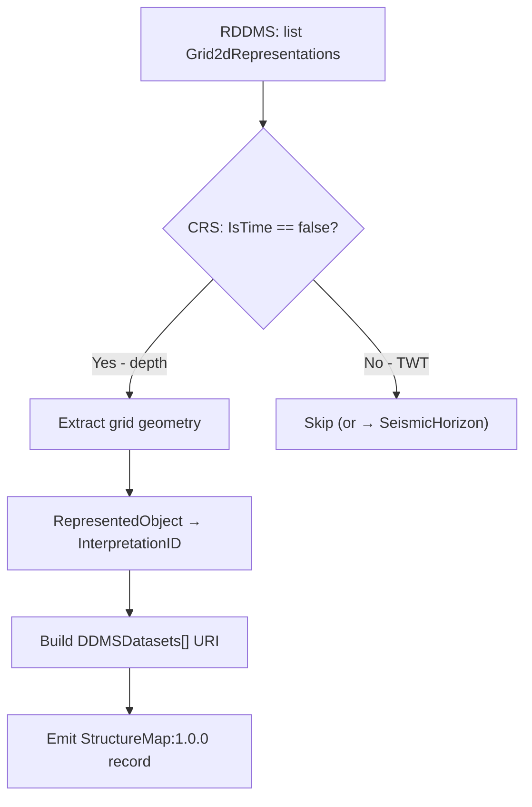
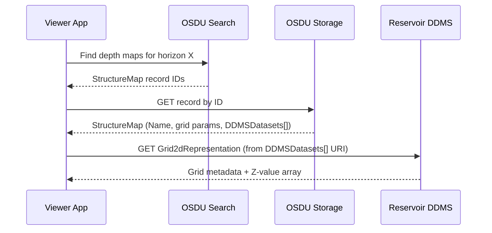

# Seismic Interpretation — Data Model & Implementation Guide

## Table of Contents

- [1) Overview — What Lives Where](#1-overview--what-lives-where)
- [2) Schema Inheritance Architecture](#2-schema-inheritance-architecture)
- [3) Interpretation Chain — Seed to Surface](#3-interpretation-chain--seed-to-surface)
- [4) Implemented Record Types](#4-implemented-record-types)
- [5) Object Naming Conventions (Drogon / Volve)](#5-object-naming-conventions-drogon--volve)
- [6) GenericBinGrid vs SeismicBinGrid](#6-genericbingrid-vs-seismicbingrid)
- [7) Grid Strategy: Pattern A vs Pattern B](#7-grid-strategy-pattern-a-vs-pattern-b)
- [8) Dual-Catalog Pattern](#8-dual-catalog-pattern)
- [9) Generation Pipeline](#9-generation-pipeline)
- [10) ORES Web App — Live StructureMap Generation](#10-ores-web-app--live-structuremap-generation)
- [11) References](#11-references)

---

## 1) Overview — What Lives Where

A structure map (or any interpretation surface) lives in **two places**:

| Layer | What is stored | Where | Access pattern |
|---|---|---|---|
| **OSDU Catalog Record** | Searchable metadata — name, interpretation link, grid geometry, CRS | OSDU Storage + Search | REST: Search API → Storage API |
| **Reservoir DDMS (RDDMS)** | Actual data — Z-value arrays, full grid geometry, CRS objects | RESQML objects in RDDMS | REST: RDDMS API |

The OSDU record **never contains Z-value arrays**. The `DDMSDatasets[]` URI links to the RDDMS object where actual data lives:



> **Key insight**: `DDMSDatasets[]` (from `AbstractWPCGroupType`) is the **only** link to actual depth/time data. All other relationship fields (`BinGridID`, `InterpretationID`, `SeismicHorizonID`) point to metadata records, not data.

### M27 Schemas Used

| Schema | Catalogs |
|---|---|
| `StructureMap:1.0.0` | Depth/time gridded surfaces on a GenericBinGrid |
| `GenericBinGrid:1.0.0` | Standalone reusable lattice grid (non-seismic) |
| `HorizonControlPoints:1.0.0` | Interpreter seed picks for horizon tracking |
| `GenericRepresentation:1.2.0` | Universal RDDMS catalog entry (polylines, surfaces) |
| `SeismicHorizon:2.1.0` | TWT horizon picks on seismic surveys |
| `HorizonInterpretation:1.2.0` | Geologic meaning of a horizon |

---

## 2) Schema Inheritance Architecture



**Design principles**:
- **AbstractInterpretation** → geologic meaning (the "what") — no geometry
- **AbstractRepresentation** → geometry metadata (the "how") — linked via `InterpretationID`
- **StructureMap** has **dual inheritance**: AbstractRepresentation + AbstractGenericBinGrid
- `DDMSDatasets[]` (from AbstractWPCGroupType) links to RDDMS — **no OSDU schema carries actual values**

---

## 3) Interpretation Chain — Seed to Surface



**Complete chain** for a single horizon:

```
LocalBoundaryFeature  →  HorizonInterpretation  →  HorizonControlPoints (picks)
                                                →  SeismicHorizon (TWT grid)
                                                →  StructureMap (Depth grid)
```

---

## 4) Implemented Record Types

### 4.1 Fault Polylines — `GenericRepresentation:1.2.0`

Catalogs RDDMS `PolylineSetRepresentation` objects that represent fault stick interpretations.

| Field | Value | Meaning |
|---|---|---|
| `Role` | `FaultStick` | Manual fault stick picks on seismic sections |
| `Type` | `PolylineSetRepresentation` | RESQML geometry class |
| `InterpretationID` | → FaultInterpretation WPC | Which fault this represents |
| `DDMSDatasets[]` | EML URI to PolylineSetRep | Link to actual geometry in RDDMS |
| `ancestry.parents[]` | FaultInterpretation + LocalBoundaryFeature | OSDU lineage |

**Classification filter**: Only objects whose `RepresentedInterpretation.ContentType` contains `FaultInterpretation` AND whose name starts with `DL_` or `TL_` (Depth/Time Lines — manual interpretation). Excludes:
- `GL_*` — algorithmic grid-line extractions from FMU reservoir models
- `AOI` — area of interest boundary polygons
- `XYCoords*` — coordinate reference geometry

**Current inventory (Drogon)**: 24 fault stick records (12 depth + 6 time + 6 truth-case)

### 4.2 Horizon Control Points — `HorizonControlPoints:1.0.0`

Catalogs RDDMS `PointSetRepresentation` objects that represent interpreter seed picks.

| Field | Value | Meaning |
|---|---|---|
| `RepresentationRole` | `Pick` | Sparse interpreter seed points |
| `RepresentationType` | `PointSet` | RESQML geometry class |
| `DomainTypeID` | `Depth` or `Time` | Determined from RDDMS CRS (LocalDepth3dCrs vs LocalTime3dCrs) |
| `InterpretationID` | → HorizonInterpretation WPC | Which horizon these picks belong to |
| `DDMSDatasets[]` | EML URI to PointSetRep | Link to XYZ data in RDDMS |

**Classification filter**: Only objects linked to `HorizonInterpretation` via ContentType. Excludes:
- `*_extracted` — points extracted from FMU model runs (model outputs, not picks)

**Current inventory (Drogon)**: 20 records across 4 horizons (TopVolantis, BaseVolantis, TopTherys, TopVolon), 16 depth + 4 time

### 4.3 Structure Maps — `StructureMap:1.0.0`

Catalogs RDDMS `Grid2dRepresentation` objects that are depth surfaces (CRS `IsTime=false`).

| Field | Value | Meaning |
|---|---|---|
| `InterpretationID` | → HorizonInterpretation WPC | Geologic meaning |
| `BinGridID` | → GenericBinGrid WPC (Pattern B) | Shared XY lattice |
| `SeismicHorizonID` | → SeismicHorizon WPC | TWT provenance |
| `DomainTypeID` | `Depth` | Always depth for StructureMap |
| Inline grid props | Origin, Bearing, BinWidth, NodeCount | Grid geometry (Pattern A) |
| `DDMSDatasets[]` | EML URI to Grid2dRep | Link to Z-values |

**Current inventory**: 18 StructureMap records (Drogon + Volve dataspaces)

---

## 5) Object Naming Conventions (Drogon / Volve)

### Drogon Dataspace — FMU Workflow Outputs

The `maap/drogon` dataspace contains objects from an FMU (Fast Model Update) uncertainty workflow. Naming follows a `<Domain><Type>_<workflow_step>` convention:

| Prefix | Meaning | Example |
|---|---|---|
| `DL_` | **D**epth **L**ines — manual fault stick interpretation | `DL_faultsticks` |
| `TL_` | **T**ime **L**ines — fault sticks in TWT | `TL_faultsticks` |
| `DP_` | **D**epth **P**oints — horizon picks | `DP_interp`, `DP_filter_post` |
| `TP_` | **T**ime **P**oints — horizon picks in TWT | `TP_interp` |
| `GL_` | **G**rid **L**ines — algorithmically extracted (NOT interpretation) | `GL_faultlines_extract_postprocess` |
| `DS_` | **D**epth **S**urface — gridded depth map | `DS_extract_postprocess` |
| `TS_` | **T**ime **S**urface — gridded TWT map | `TS_interp` |

Workflow step suffixes:
- `_interp` — initial structural interpretation
- `_filter` / `_filter_post` — after QC / outlier removal
- `_filter_from_time` — depth-converted from time domain
- `_filter_post_hum_input` — prepared as input to History Update Model
- `_gf_hum_extracted` — extracted from global-field HUM run (model output)
- `_hum_postiterate_extracted` — post-HUM iteration extraction (model output)
- `_from_truth` — from synthetic truth/reference case

**What's seismic interpretation vs what's not:**

| Category | Prefixes | Cataloged as |
|---|---|---|
| Fault interpretation | `DL_`, `TL_` | GenericRepresentation (Role=FaultStick) |
| Horizon picks | `DP_interp`, `TP_interp`, `DP_filter*`, `TP_filter*` | HorizonControlPoints |
| Depth surfaces | `DS_*` | StructureMap |
| **Excluded** — model outputs | `GL_*`, `*_extracted` | Not cataloged |
| **Excluded** — utility | `AOI`, `XYCoords*` | Not cataloged |

### Volve Dataspace — Real Field Interpretation

The `maap/volve` dataspace contains classic seismic interpretation from the Volve field:

| Object type | Naming | Meaning |
|---|---|---|
| Fault polylines | `F1_N`, `F3_W_S`, `F10_E` | Named faults (F1–F11) with compass segments |
| Horizon surfaces | `Hugin_Fm_Base`, `Top_Draupne`, `Balder_Fm` | Stratigraphic horizon names |
| Boundary | `AOI` | Study area polygon |

---

## 6) GenericBinGrid vs SeismicBinGrid

M27 introduces `AbstractGenericBinGrid:1.0.0` as a **separate abstract** from `AbstractBinGrid:1.1.0`:

| Aspect | AbstractBinGrid (SeismicBinGrid) | AbstractGenericBinGrid (GenericBinGrid, StructureMap) |
|---|---|---|
| Direction | I & J via P6 vector increments | J bearing only (`MapGridBearingOfBinGridJaxis`) |
| Node counts | InlineMin/Max, CrosslineMin/Max (seismic) | NodeCountOnIAxis / JAxis (generic) |
| I-axis orientation | Explicit via `P6BinNodeIncrementOnIaxis` | Implicit: perpendicular to J |
| Additional | — | `ScaleFactor`, `TransformationMethod`, `BinGridName` |

### Conversion: GenericBinGrid ↔ SeismicBinGrid

| SeismicBinGrid | GenericBinGrid | Conversion |
|---|---|---|
| `P6BinGridOriginEasting` | `OriginEasting` | Direct |
| `P6BinNodeIncrementOnJaxis {X,Y}` | `BinWidthOnJaxis` + `MapGridBearingOfBinGridJaxis` | width = √(X²+Y²), bearing = atan2(X,Y) |
| `InlineMax - InlineMin + 1` | `NodeCountOnIAxis` | Direct |

---

## 7) Grid Strategy: Pattern A vs Pattern B

### Pattern A: Inline Grid

```
StructureMap
  ├── InterpretationID  → HorizonInterpretation
  ├── OriginEasting, BinWidthOnIaxis, NodeCountOnIAxis  (embedded)
  └── DDMSDatasets[]    → eml://...Grid2dRep('{uuid}')   ← Z-values here
```

### Pattern B: External BinGrid Reference

```
StructureMap
  ├── InterpretationID  → HorizonInterpretation
  ├── BinGridID         → GenericBinGrid:1.0.0  (shared grid)
  └── DDMSDatasets[]    → eml://...Grid2dRep('{uuid}')   ← Z-values here
```

| Criterion | Pattern A (inline) | Pattern B (external BinGridID) |
|---|---|---|
| Self-contained | Yes | No — requires BinGrid record |
| Grid reuse | No — duplicated | Yes — one grid, many surfaces |
| When to use | Unique grid, one-off export | Multiple surfaces share a grid |

---

## 8) Dual-Catalog Pattern

Each RDDMS object should exist as **both** a GenericRepresentation (universal catalog) and a domain-specific type:



| Layer | Schema | Purpose |
|---|---|---|
| **Universal** | `GenericRepresentation:1.2.0` | "This RDDMS object exists" — discoverable by name |
| **Specialised** | `StructureMap:1.0.0` | "This is a depth map" — searchable by grid, domain |
| **Specialised** | `HorizonControlPoints:1.0.0` | "These are horizon picks" — searchable by horizon, domain |
| **Specialised** | `SeismicHorizon:2.1.0` | "This is a TWT pick" — searchable by survey |

---

## 9) Generation Pipeline

### 9.1 Fault Polylines (`gen_fault_polylines.py`)



### 9.2 Horizon Control Points (`gen_horizon_controlpoints.py`)



### 9.3 Structure Maps (`app/structuremap.py`)



### 9.4 Ingestion Flow

```
gen_*.py  →  manifest_*.json  →  manifest2records_seisint.py  →  records/  →  ingest_records_seisint.py --batch
                                  (split into individual files)                  (PUT /api/storage/v2/records)
```

---

## 10) ORES Web App — Live StructureMap Generation

| Module | Purpose |
|---|---|
| `app/structuremap.py` | Discover Grid2d surfaces, classify depth vs time, generate records |
| `app/keys_router.py` | FastAPI endpoints for interactive StructureMap generation |

| Endpoint | Description |
|---|---|
| `GET /keys/structuremaps/surfaces.json?ds=<dataspace>` | List & classify all Grid2dRepresentations |
| `GET /keys/structuremaps.json?ds=<dataspace>&prefix=<partition>` | Generate StructureMap records |
| `POST /dataspaces/manifest/structuremaps` | Build full M27 manifest from selection |

### End-to-End Retrieval



---

## 11) References

### M27 Schemas

- [StructureMap:1.0.0](https://community.opengroup.org/osdu/data/data-definitions/-/blob/master/E-R/work-product-component/StructureMap.1.0.0.md)
- [GenericBinGrid:1.0.0](https://community.opengroup.org/osdu/data/data-definitions/-/blob/master/E-R/work-product-component/GenericBinGrid.1.0.0.md)
- [HorizonControlPoints:1.0.0](https://community.opengroup.org/osdu/data/data-definitions/-/blob/master/E-R/work-product-component/HorizonControlPoints.1.0.0.md)
- [SeismicHorizon:2.1.0](https://community.opengroup.org/osdu/data/data-definitions/-/blob/master/E-R/work-product-component/SeismicHorizon.2.1.0.md)

### Existing Schemas

- [HorizonInterpretation:1.2.0](https://community.opengroup.org/osdu/data/data-definitions/-/blob/master/E-R/work-product-component/HorizonInterpretation.1.2.0.md)
- [GenericRepresentation:1.2.0](https://community.opengroup.org/osdu/data/data-definitions/-/blob/master/E-R/work-product-component/GenericRepresentation.1.2.0.md)
- [SeismicBinGrid:1.3.0](https://community.opengroup.org/osdu/data/data-definitions/-/blob/master/E-R/work-product-component/SeismicBinGrid.1.3.0.md)

### ORES Workspace

- [SeisTodo.md](SeisTodo.md) — Open questions & follow-up work (Oslo'26 DD Workshop)
- [`demo/seisint/gen_fault_polylines.py`](../demo/seisint/gen_fault_polylines.py) — Fault PolylineSet → GenericRepresentation
- [`demo/seisint/gen_horizon_controlpoints.py`](../demo/seisint/gen_horizon_controlpoints.py) — PointSet → HorizonControlPoints:1.0.0
- [`demo/seisint/build_rddms_catalog.py`](../demo/seisint/build_rddms_catalog.py) — Multi-type RDDMS discovery
- [`app/structuremap.py`](../app/structuremap.py) — Live StructureMap generation
