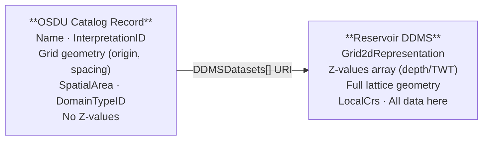
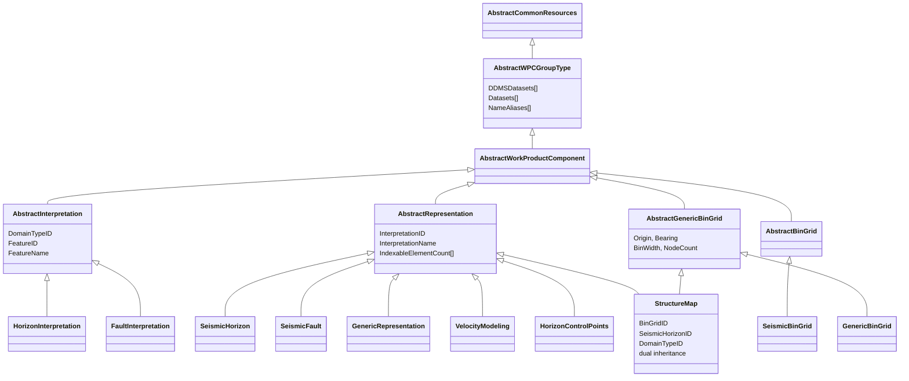
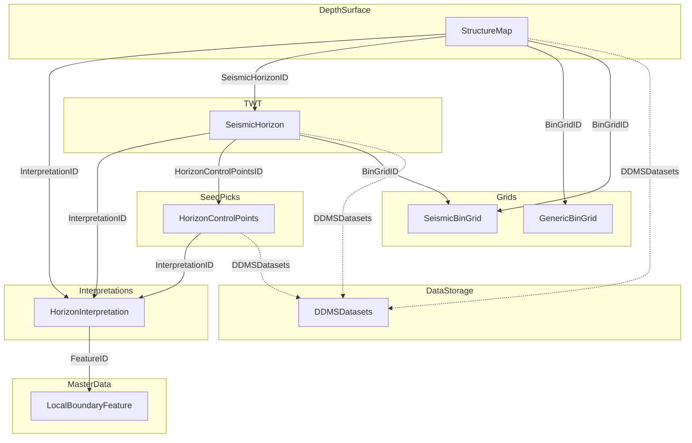
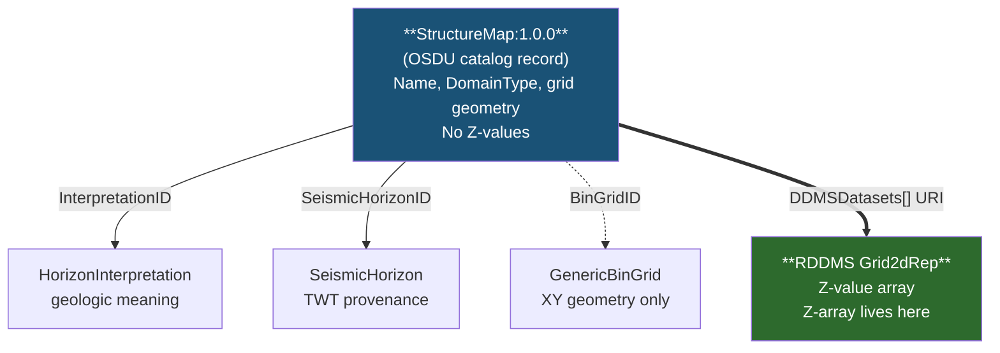
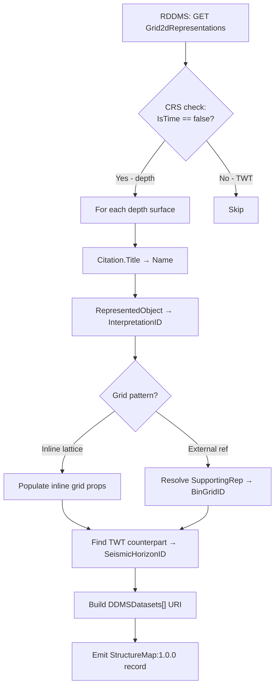
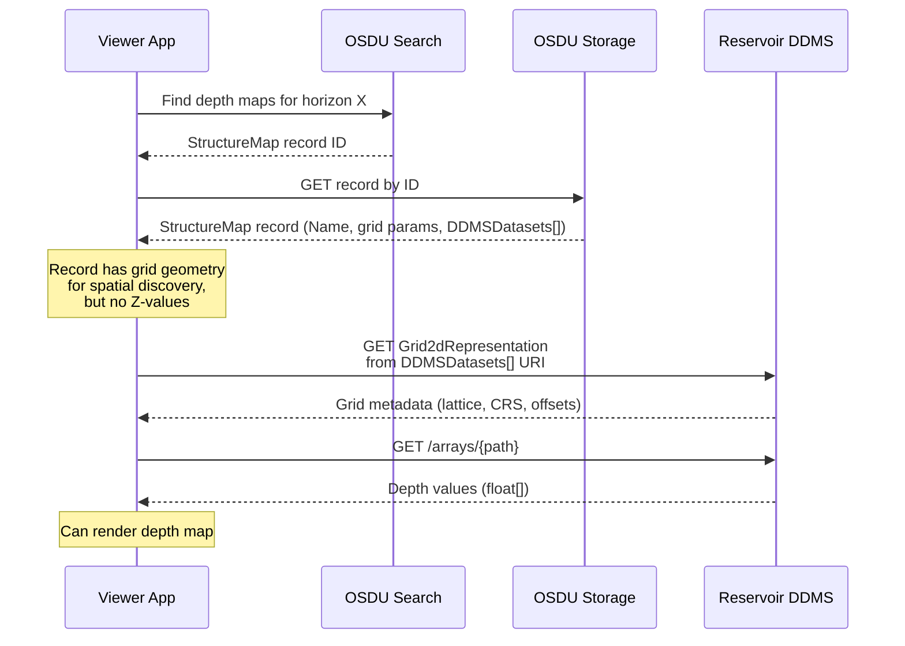
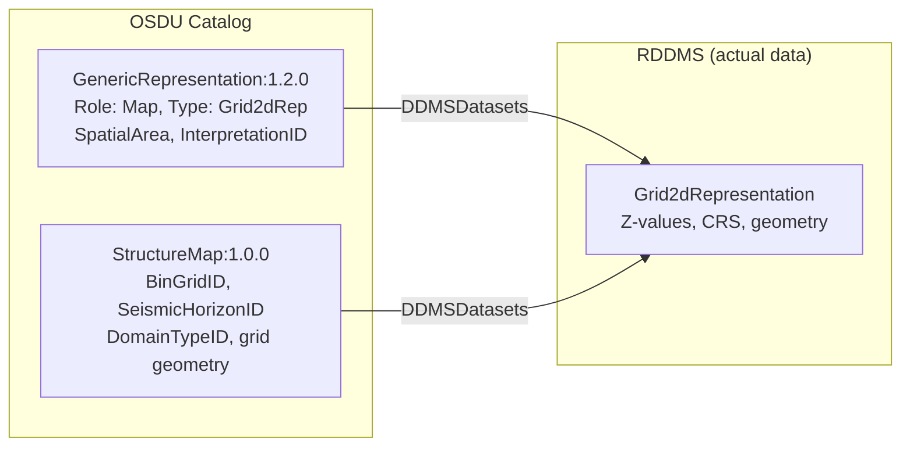
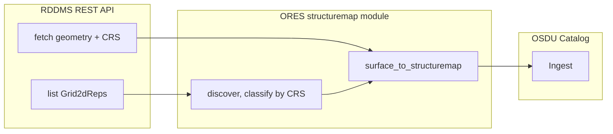

# Seismic Interpretation - Data Model & Guide

## Table of Contents

- [1) Catalog Record vs Actual Data](#1-catalog-record-vs-actual-data)
- [2) Schema Inheritance Architecture](#2-schema-inheritance-architecture)
- [3) Interpretation Chain - Seed to Surface](#3-interpretation-chain--seed-to-surface)
- [4) Where Are the Z-Values?](#4-where-are-the-z-values)
- [5) GenericBinGrid vs SeismicBinGrid](#5-genericbingrid-vs-seismicbingrid)
- [6) StructureMap in RDDMS - RESQML Storage](#6-structuremap-in-rddms--resqml-storage)
- [7) Grid Strategy: Pattern A vs Pattern B](#7-grid-strategy-pattern-a-vs-pattern-b)
- [8) Dual-Catalog Pattern](#8-dual-catalog-pattern)
- [9) ORES Web App - Live StructureMap Generation](#9-ores-web-app--live-structuremap-generation)
- [10) Open Questions & Roadmap](#10-open-questions--roadmap)
- [11) References](#11-references)

---

## 1) Catalog Record vs Actual Data

A structure map (or any interpretation surface) lives in **two places**:

| Layer | What is stored | Where | Access pattern |
|---|---|---|---|
| **OSDU Catalog Record** (e.g. StructureMap:1.0.0) | Searchable metadata — name, interpretation link, grid geometry parameters, CRS, spatial area | OSDU Storage + Search index | REST: Search API → Storage API |
| **Reservoir DDMS (RDDMS)** | Actual surface data — Z-value arrays, full grid geometry, CRS objects | RESQML objects in the Reservoir DDMS | REST: RDDMS API → `Grid2dRepresentation` |

The OSDU record **never contains the Z-value arrays**. It duplicates only grid geometry parameters (origin, bearing, spacing, node counts) for spatial discovery. The `DDMSDatasets[]` URI on the record points to the RDDMS object where the actual data lives:



There is **no dedicated "StructureMap" type in RESQML** — a `Grid2dRepresentation` with a depth CRS **is** the structure map. The distinction between depth and TWT is made entirely by the CRS (`VerticalAxis.IsTime = false` for depth, `true` for TWT).

> **Key insight**: The StructureMap record has **no typed relationship field** pointing to the RDDMS depth surface. `BinGridID` → grid geometry (XY only), `SeismicHorizonID` → TWT source, `InterpretationID` → geologic meaning. The **only** link to the actual depth Z-values is `DDMSDatasets[]` — a generic URI array inherited from `AbstractWPCGroupType`.

### M27 New Schemas

| New M27 Schema | What it catalogs |
|---|---|
| **`StructureMap:1.0.0`** | Depth/time gridded surfaces on a GenericBinGrid |
| **`GenericBinGrid:1.0.0`** | Standalone reusable lattice grid, independent of seismic acquisition |
| **`HorizonControlPoints:1.0.0`** | Seed picks for horizon interpretation |
| **`SeismicHorizon:2.1.0`** | Updated: `BinGridID` (renamed), `HorizonControlPointsID` link, structured `Remark[]` |

Key breaking changes from pre-release drafts:
- **`CrsID` removed** from `AbstractRepresentation` — CRS now lives inside `ABCDBinGridSpatialLocation.AsIngestedCoordinates.CoordinateReferenceSystemID`
- **`SeismicBinGridID` → `BinGridID`** — unified naming across StructureMap/SeismicHorizon/SeismicFault
- **`Remarks[]` → `Remark[]`** — from string array to structured `AbstractRemark` objects

---

## 2) Schema Inheritance Architecture



**Key design principles**:
- **AbstractInterpretation** → geologic meaning (the "what") — no geometry
- **AbstractRepresentation** → surface/geometry metadata (the "how") — linked via `InterpretationID`
- **AbstractBinGrid** → seismic acquisition lattice geometry
- **AbstractGenericBinGrid** → non-seismic lattice geometry (new M27)
- **StructureMap** has **dual inheritance**: AbstractRepresentation + AbstractGenericBinGrid — can define grid inline or via `BinGridID`
- `DDMSDatasets[]` (from AbstractWPCGroupType) links to the RDDMS — **no OSDU schema carries actual depth/time values**

---

## 3) Interpretation Chain - Seed to Surface



**Complete chain** for a single horizon:

```
LocalBoundaryFeature  →  HorizonInterpretation  →  HorizonControlPoints  →  SeismicHorizon (TWT)  →  StructureMap (Depth)
```

---

## 4) Where Are the Z-Values?

| Relationship Field | Points To | Carries Z-Values? |
|---|---|---|
| `InterpretationID` | HorizonInterpretation | No (geologic meaning) |
| `SeismicHorizonID` | SeismicHorizon | No (TWT provenance) |
| `BinGridID` | GenericBinGrid / SeismicBinGrid | No (XY geometry only) |
| Inline grid props | (embedded on record) | No (same XY geometry) |
| **`DDMSDatasets[]`** | **RDDMS Grid2dRepresentation** | **Yes — only here** |

`DDMSDatasets[]` is inherited from `AbstractWPCGroupType`. It contains an EML URI:

```
eml://rddms-1/dataspace('<dataspace>')/resqml20.obj_Grid2dRepresentation('<uuid>')
```



---

## 5) GenericBinGrid vs SeismicBinGrid

M27 introduces `AbstractGenericBinGrid:1.0.0` as a **separate abstract** from `AbstractBinGrid:1.1.0`:

| Aspect | AbstractBinGrid (SeismicBinGrid) | AbstractGenericBinGrid (GenericBinGrid, StructureMap) |
|---|---|---|
| Direction | I & J via P6 vector increments | J bearing only (`MapGridBearingOfBinGridJaxis`) |
| Node counts | InlineMin/Max, CrosslineMin/Max (seismic) | NodeCountOnIAxis / JAxis (generic) |
| I-axis orientation | Explicit via `P6BinNodeIncrementOnIaxis` | Implicit: perpendicular to J, handedness via `TransformationMethod` |
| Additional | — | `ScaleFactor`, `TransformationMethod`, `BinGridName` |

### ABCD Corner Convention

```
A = (i=0, j=0)       origin
B = (i=0, j=jMax)    end of J axis from origin
C = (i=Imax, j=0)    end of I axis from origin
D = (i=Imax, j=Jmax) far corner
```

### TransformationMethod — Handedness

| EPSG Code | Name | I-axis relative to J |
|---|---|---|
| 9666 | P6 Seismic Bin Grid (right-handed) | J bearing + 90 deg |
| 1049 | General polynomial (left-handed) | J bearing - 90 deg |

### Conversion: GenericBinGrid ↔ SeismicBinGrid

| SeismicBinGrid | GenericBinGrid | Conversion |
|---|---|---|
| `P6BinGridOriginEasting` | `OriginEasting` | Direct |
| `P6BinNodeIncrementOnJaxis {X,Y}` | `BinWidthOnJaxis` + `MapGridBearingOfBinGridJaxis` | width = sqrt(X²+Y²), bearing = atan2(X,Y) |
| `InlineMax - InlineMin + 1` | `NodeCountOnIAxis` | Direct |

---

## 6) StructureMap in RDDMS — RESQML Storage

### 6.1 RESQML Grid Geometry — Two Patterns

#### Pattern A: Inline Lattice → OSDU Inline Grid

RESQML uses `Point3dLatticeArray` with origin and direction vectors. The OSDU StructureMap embeds the same grid geometry as properties (`OriginEasting/Northing`, `BinWidthOnI/Jaxis`, `MapGridBearingOfBinGridJaxis`, `NodeCountOnI/JAxis`).

#### Pattern B: Supporting Representation → OSDU External BinGridID

RESQML uses `SupportingRepresentation` pointing to a shared `Grid2dRepresentation`. The OSDU StructureMap references a `GenericBinGrid:1.0.0` or `SeismicBinGrid:1.3.0` via `BinGridID`.

### 6.2 No RESQML Extension Required

| Requirement | RESQML 2.2 Support |
|---|---|
| Regular depth grid with Z values | `Grid2dRepresentation` + depth CRS |
| Inline grid geometry | `Point3dLatticeArray` |
| External bin grid reference | `SupportingRepresentation` |
| Link to interpretation | `RepresentedObject` → HorizonInterpretation |
| CRS / domain type | `LocalCrs` with vertical axis |
| OSDU integration metadata | `ExtraMetadata` with `osdu:` prefix |

#### Recommended ExtraMetadata for Round-Tripping

| OSDU Property | ExtraMetadata Key | Purpose |
|---|---|---|
| `SeismicHorizonID` | `osdu:SeismicHorizonID` | Provenance (no RESQML equivalent) |
| `DomainTypeID` | `osdu:DomainTypeID` | Redundant with CRS but enables catalog sync |
| `TransformationMethod` | `osdu:TransformationMethod` | Inferable from lattice but explicit is safer |

### 6.3 Generation Pipeline



### 6.4 End-to-End Retrieval Flow



> **Note**: The RDDMS abstracts away internal storage — Z-values are served as a flat JSON float array over HTTP, not as HDF5 files.

---

## 7) Grid Strategy: Pattern A vs Pattern B

### Pattern A: Inline Grid

```
StructureMap
  ├── InterpretationID  → HorizonInterpretation
  ├── SeismicHorizonID  → SeismicHorizon (TWT)
  ├── OriginEasting:     <value>
  ├── BinWidthOnIaxis:   <value>
  ├── NodeCountOnIAxis:  <value>
  └── DDMSDatasets[]    → eml://...Grid2dRep('{uuid}')   ← Z-values here
```

Grid geometry **embedded** on the StructureMap. No separate BinGrid record. RESQML counterpart: `Point3dLatticeArray`.

### Pattern B: External BinGrid Reference

```
StructureMap
  ├── InterpretationID  → HorizonInterpretation
  ├── SeismicHorizonID  → SeismicHorizon (TWT)
  ├── BinGridID         → GenericBinGrid:1.0.0
  └── DDMSDatasets[]    → eml://...Grid2dRep('{uuid}')   ← Z-values here

GenericBinGrid (shared, referenced by multiple StructureMaps)
  ├── OriginEasting:     <value>
  ├── BinWidthOnIaxis:   <value>
  └── NodeCountOnIAxis:  <value>
```

### Comparison

| Criterion | Pattern A (inline) | Pattern B (external BinGridID) |
|---|---|---|
| **Self-contained** | Yes — one record has everything | No — requires BinGrid record |
| **Grid reuse** | No — grid duplicated on each record | Yes — one grid, many surfaces |
| **Record count** | Fewer | More (+1 GenericBinGrid per shared grid) |
| **Search by grid** | Must compare field-by-field | `BinGridID` gives exact identity |
| **Consistency** | Risk of drift if grid copied | Single source of truth |
| **RESQML mapping** | `Point3dLatticeArray` — direct | `SupportingRepresentation` — UUID resolution |
| **When to use** | Unique grid or one-off export | Multiple surfaces share a grid |

**Recommendation**: Use Pattern B for multi-horizon projects sharing a grid. Use Pattern A for one-off surfaces with unique grids.

---

## 8) Dual-Catalog Pattern

Each RDDMS Grid2dRepresentation should also exist as a **GenericRepresentation:1.2.0** WPC — the universal RDDMS catalog layer.



| Catalog Layer | Schema | Purpose |
|---|---|---|
| **Universal** | `GenericRepresentation:1.2.0` | "This RDDMS object exists" — discoverable by name, spatial area |
| **Specialised** | `StructureMap:1.0.0` | "This is a depth map on a known grid" — searchable by grid, domain, horizon |
| **Specialised** | `SeismicHorizon:2.1.0` | "This is a TWT pick" — searchable by seismic survey |

Two records are **complementary, not redundant**: GenericRepresentation is the baseline (automatic); StructureMap/SeismicHorizon adds domain-specific search precision.

---

## 9) ORES Web App — Live StructureMap Generation

The ORES web app provides live StructureMap:1.0.0 generation from RDDMS content:

| Module | Purpose |
|---|---|
| `app/structuremap.py` | Conversion logic: discover Grid2d surfaces, classify depth vs time, generate records |
| `app/keys_router.py` | FastAPI endpoints exposing conversion over HTTP |

| Endpoint | Description |
|---|---|
| `GET /keys/structuremaps/surfaces.json?ds=<dataspace>` | List & classify all Grid2dRepresentations |
| `GET /keys/structuremaps.json?ds=<dataspace>&prefix=<partition>` | Generate StructureMap records for all depth surfaces |
| `POST /dataspaces/manifest/structuremaps` | Build full M27 manifest from selected surfaces |



---

## 10) Open Questions & Roadmap

> See [SeisTodo.md](SeisTodo.md) for detailed follow-up work derived from the Oslo'26 DD Workshop.

| Question | Status | Source |
|---|---|---|
| Should StructureMap carry `Interpreter` / `Remark[]`? | Open — uses inherited `AuthorIDs[]` | Pre-workshop |
| `VelocityModelID` not on any M27 schema | Open — use `ExtensionProperties` | Pre-workshop |
| SeismicSurfaceGeneration Activity Template (~85% complete) | In progress | Oslo'26 Slide 13 |
| MVP2: horizons + faults + activities | **Partial** — fault catalog + HCP generator done; Activity records pending | Oslo'26 Charter |
| **Fault polylines via GenericRepresentation** | **Done** — `gen_fault_polylines.py` emits GenericRep with Role=FaultStick (interim per Oslo'26 Slide 51). Tested: 24 faults (12 unique FaultInterpretations) from 44 polylines in maap/drogon | Oslo'26 Slides 30-31, 51 |
| **HorizonControlPoints from PointSetRepresentation** | **Done** — `gen_horizon_controlpoints.py` emits HorizonControlPoints:1.0.0. Tested: 28 horizon picks (6 unique HorizonInterpretations, 24 depth + 4 time) from 48 PointSets | M27 schema |
| **AbstractBinGrid longer-term deprecation** | Planned — GenericBinGrid is interim; AbstractBinGrid to be fully replaced | Oslo'26 Slide 15-16 |
| **SeismicLatticeFeature → OSDU mapping ambiguity** | No agreed strategy — SeismicBinGrid? Seismic3DInterpretationSet? | Oslo'26 Slides 32-33, 40 |
| **Master-data cannot hold DDMSDatasets[]** | Structural gap — Seismic3DInterpretationSet has no RDDMS link | Oslo'26 Slide 50 |
| **Cross-domain provenance (Seismic → Earth Model)** | Proposals exist; needs formal schema link | Oslo'26 Slides 42, 44-45 |
| **Catalog WPC pattern for polylines outside RDDMS** | No approved pattern yet | Oslo'26 Slide 50 |

---

## 11) References

### M27 Schemas

- [StructureMap:1.0.0](https://community.opengroup.org/osdu/data/data-definitions/-/blob/master/E-R/work-product-component/StructureMap.1.0.0.md)
- [GenericBinGrid:1.0.0](https://community.opengroup.org/osdu/data/data-definitions/-/blob/master/E-R/work-product-component/GenericBinGrid.1.0.0.md)
- [AbstractGenericBinGrid:1.0.0](https://community.opengroup.org/osdu/data/data-definitions/-/blob/master/E-R/abstract/AbstractGenericBinGrid.1.0.0.md)
- [HorizonControlPoints:1.0.0](https://community.opengroup.org/osdu/data/data-definitions/-/blob/master/E-R/work-product-component/HorizonControlPoints.1.0.0.md)
- [SeismicHorizon:2.1.0](https://community.opengroup.org/osdu/data/data-definitions/-/blob/master/E-R/work-product-component/SeismicHorizon.2.1.0.md)

### Existing Schemas

- [HorizonInterpretation:1.2.0](https://community.opengroup.org/osdu/data/data-definitions/-/blob/master/E-R/work-product-component/HorizonInterpretation.1.2.0.md)
- [SeismicBinGrid:1.3.0](https://community.opengroup.org/osdu/data/data-definitions/-/blob/master/E-R/work-product-component/SeismicBinGrid.1.3.0.md)
- [GenericRepresentation:1.2.0](https://community.opengroup.org/osdu/data/data-definitions/-/blob/master/E-R/work-product-component/GenericRepresentation.1.2.0.md)

### OSDU Community

- [Issue #31 - Support Depth Structure Map](https://gitlab.opengroup.org/osdu/subcommittees/data-def/projects/seismic/docs/-/issues/31)
- [Issue #863 - SeismicSurfaceGeneration Activity](https://gitlab.opengroup.org/osdu/data/data-definitions/-/issues/863)

### ORES Workspace

- [CrsGuide.md](CrsGuide.md) — CRS mapping guide
- [StratColumn.md](StratColumn.md) — Stratigraphic column mapping
- [SeisTodo.md](SeisTodo.md) — Follow-up work from Oslo'26 DD Workshop
- [`demo/seisint/`](../demo/seisint/) — Generator scripts and schemas
- [`demo/seisint/gen_fault_polylines.py`](../demo/seisint/gen_fault_polylines.py) — Fault PolylineSet → GenericRepresentation catalog
- [`demo/seisint/gen_horizon_controlpoints.py`](../demo/seisint/gen_horizon_controlpoints.py) — PointSet → HorizonControlPoints:1.0.0
- [`demo/seisint/build_rddms_catalog.py`](../demo/seisint/build_rddms_catalog.py) — Dynamic multi-type RDDMS discovery + manifests/build
