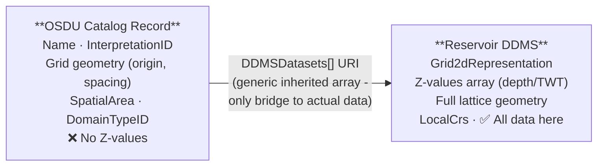
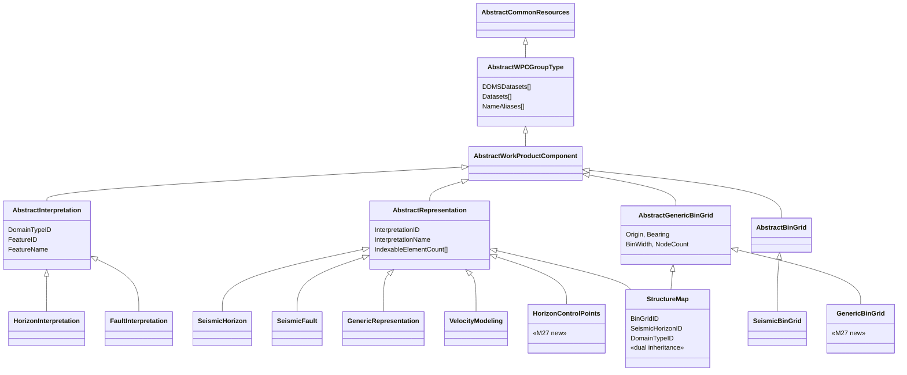
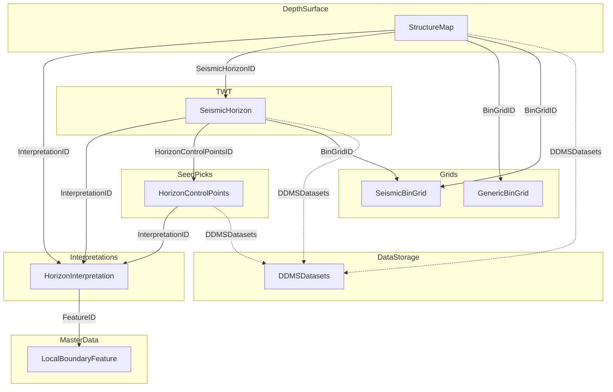
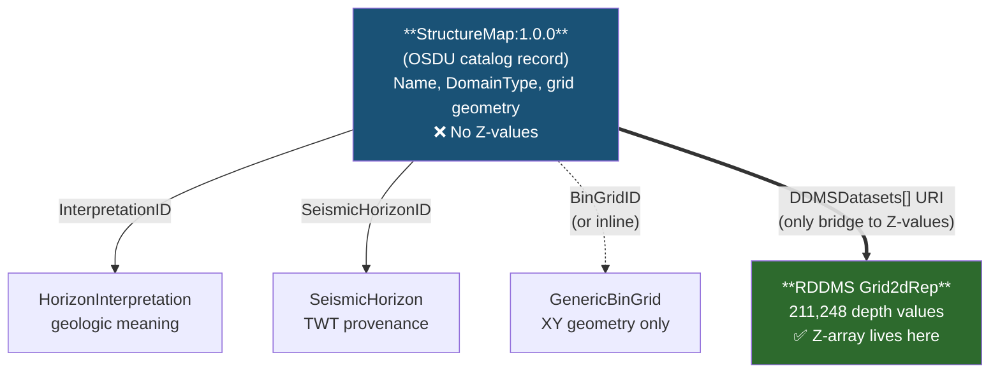
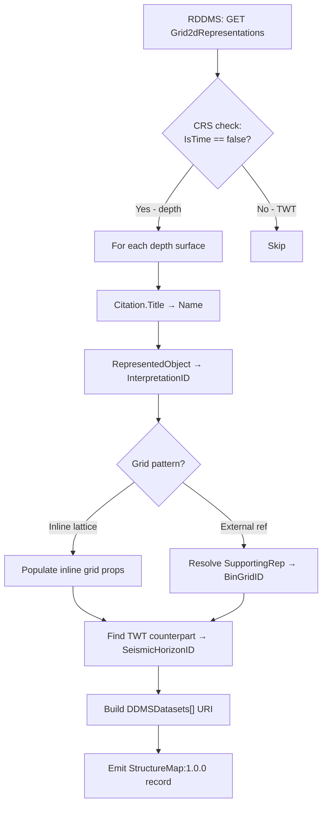
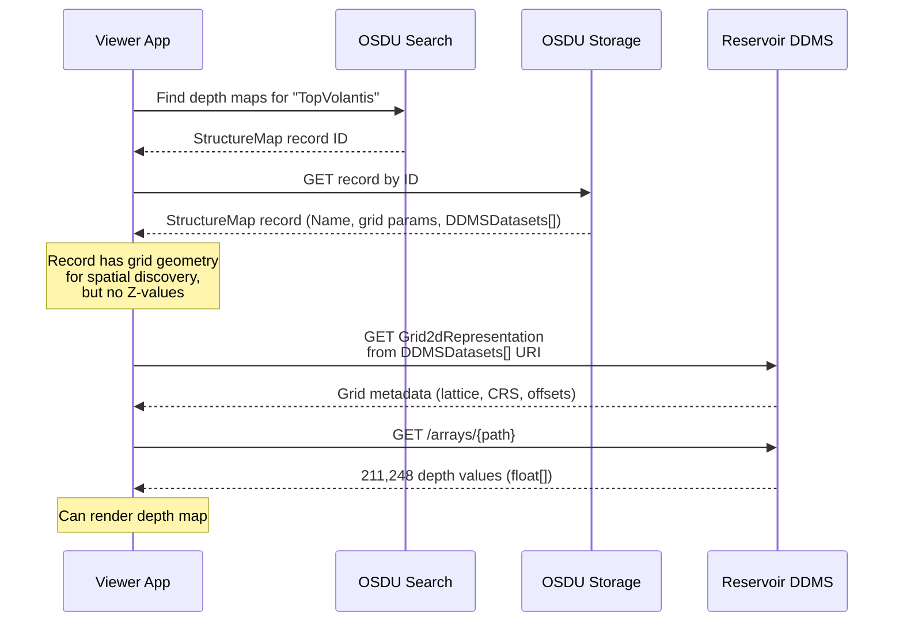
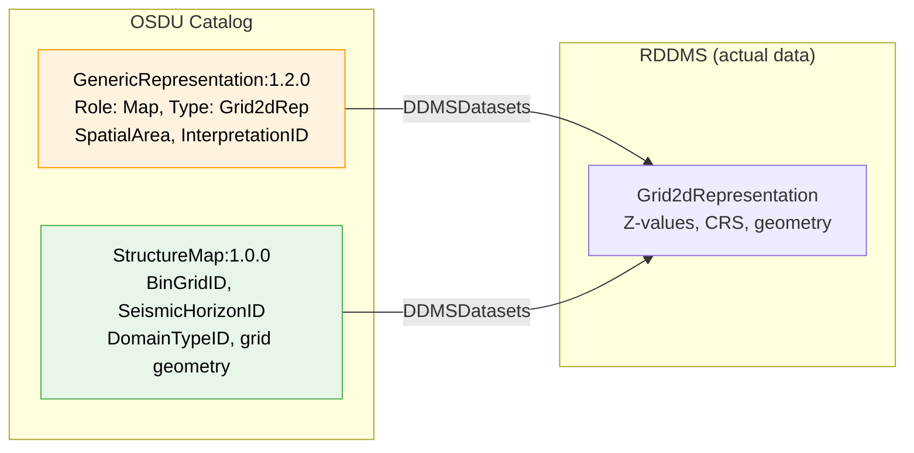
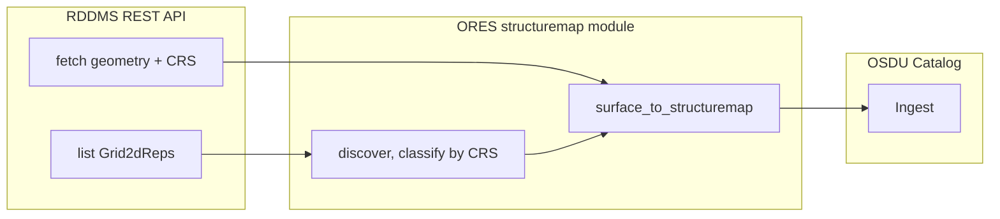

# Seismic Interpretation - Data Model & Demo Guide

## Table of Contents

- [1) Catalog Record vs Actual Data](#1-catalog-record-vs-actual-data)
- [2) Schema Inheritance Architecture](#2-schema-inheritance-architecture)
- [3) Interpretation Chain - Seed to Surface](#3-interpretation-chain--seed-to-surface)
- [4) Where Are the Z-Values?](#4-where-are-the-z-values)
- [5) GenericBinGrid vs SeismicBinGrid](#5-genericbingrid-vs-seismicbingrid)
- [6) StructureMap in RDDMS - RESQML Storage](#6-structuremap-in-rddms--resqml-storage)
  - [6.4 Live RDDMS Data](#64-live-rddms-data--maapdrogon)
- [7) Demo - Volantis Worked Example](#7-demo--volantis-worked-example)
- [8) Grid Strategy: Pattern A vs Pattern B](#8-grid-strategy-pattern-a-vs-pattern-b)
- [9) Dual-Catalog Pattern - GenericRepresentation + Specialised WPCs](#9-dual-catalog-pattern)
- [10) ORES Web App - Live StructureMap Generation](#10-ores-web-app--live-structuremap-generation)
- [11) Open Questions & Roadmap](#11-open-questions--roadmap)
- [12) References](#12-references)

---

## 1) Catalog Record vs Actual Data

A structure map (or any interpretation surface) lives in **two places**:

| Layer | What is stored | Where | Access pattern |
|---|---|---|---|
| **OSDU Catalog Record** (e.g. StructureMap:1.0.0) | Searchable metadata - name, interpretation link, grid geometry parameters, CRS, spatial area | OSDU Storage + Search index | REST: Search API → Storage API |
| **Reservoir DDMS (RDDMS)** | Actual surface data - Z-value arrays, full grid geometry, CRS objects | RESQML objects in the Reservoir DDMS | REST: RDDMS API → `Grid2dRepresentation` |

The OSDU record **never contains the Z-value arrays**. It duplicates only grid geometry parameters (origin, bearing, spacing, node counts) for spatial discovery. The `DDMSDatasets[]` URI on the record points to the RDDMS object where the actual data lives:



There is **no dedicated "StructureMap" type in RESQML** - a `Grid2dRepresentation` with a depth CRS **is** the structure map. The distinction between depth and TWT is made entirely by the CRS (`VerticalAxis.IsTime = false` for depth, `true` for TWT).

> **Key insight**: The StructureMap record has **no typed relationship field** pointing to the RDDMS depth surface.  `BinGridID` → grid geometry (XY only), `SeismicHorizonID` → TWT source, `InterpretationID` → geologic meaning.  The **only** link to the actual depth Z-values is `DDMSDatasets[]` - a generic URI array inherited from `AbstractWPCGroupType`.

### M27 New Schemas

| New M27 Schema | What it catalogs |
|---|---|
| **`StructureMap:1.0.0`** | Depth/time gridded surfaces on a GenericBinGrid |
| **`GenericBinGrid:1.0.0`** | Standalone reusable lattice grid, independent of seismic acquisition |
| **`HorizonControlPoints:1.0.0`** | Seed picks for horizon interpretation |
| **`SeismicHorizon:2.1.0`** | Updated: `BinGridID` (renamed), `HorizonControlPointsID` link, structured `Remark[]` |

Key breaking changes from pre-release drafts:
- **`CrsID` removed** from `AbstractRepresentation` - CRS now lives inside `ABCDBinGridSpatialLocation.AsIngestedCoordinates.CoordinateReferenceSystemID`
- **`SeismicBinGridID` → `BinGridID`** - unified naming across StructureMap/SeismicHorizon/SeismicFault
- **`Remarks[]` → `Remark[]`** - changed from string array to structured `AbstractRemark` objects

---

## 2) Schema Inheritance Architecture



> 🟢 StructureMap, HorizonControlPoints, GenericBinGrid = **new M27**. 🟠 SeismicHorizon = **updated in M27**.

**Key design principles**:
- **AbstractInterpretation** → geologic meaning (the "what") - no geometry
- **AbstractRepresentation** → surface/geometry metadata (the "how") - linked via `InterpretationID`
- **AbstractBinGrid** → seismic acquisition lattice geometry
- **AbstractGenericBinGrid** → non-seismic lattice geometry (new M27)
- **StructureMap** has **dual inheritance**: AbstractRepresentation + AbstractGenericBinGrid - can define grid inline or via `BinGridID`
- `DDMSDatasets[]` (from AbstractWPCGroupType) links to the RDDMS - **no OSDU schema carries actual depth/time values**

---

## 3) Interpretation Chain - Seed to Surface



**Solid arrows** = OSDU record-to-record references (metadata).
**Dashed arrows** = `DDMSDatasets[]` links to the RDDMS where Z-value arrays live.

**Complete chain** for a single horizon:

```
LocalBoundaryFeature  →  HorizonInterpretation  →  HorizonControlPoints  →  SeismicHorizon (TWT)  →  StructureMap (Depth)
   "Top Volantis"          "Top Volantis"            "Top Volantis picks"     "Top Volantis TWT"       "Top Volantis Depth"
```

---

## 4) Where Are the Z-Values?

| Relationship Field | Points To | Carries Z-Values? |
|---|---|---|
| `InterpretationID` | HorizonInterpretation | ❌ No (geologic meaning) |
| `SeismicHorizonID` | SeismicHorizon | ❌ No (TWT provenance) |
| `BinGridID` | GenericBinGrid / SeismicBinGrid | ❌ No (XY geometry only) |
| Inline grid props | (embedded on record) | ❌ No (same XY geometry) |
| **`DDMSDatasets[]`** | **RDDMS Grid2dRepresentation** | ✅ **Yes - only here** |

`DDMSDatasets[]` is inherited from `AbstractWPCGroupType` (shared by all WPCs). It contains an EML URI:

```
eml://rddms-1/dataspace('maap/drogon')/resqml20.obj_Grid2dRepresentation('f857c36c-...')
```



---

## 5) GenericBinGrid vs SeismicBinGrid

M27 introduces `AbstractGenericBinGrid:1.0.0` as a **separate abstract** from `AbstractBinGrid:1.1.0`:

| Aspect | AbstractBinGrid (SeismicBinGrid) | AbstractGenericBinGrid (GenericBinGrid, StructureMap) |
|---|---|---|
| Direction | I & J via P6 vector increments | J bearing only (`MapGridBearingOfBinGridJaxis`) |
| Node counts | InlineMin/Max, CrosslineMin/Max (seismic) | NodeCountOnIAxis / JAxis (generic) |
| I-axis orientation | Explicit via `P6BinNodeIncrementOnIaxis` | Implicit: ⊥ to J, handedness via `TransformationMethod` |
| Additional | - | `ScaleFactor`, `TransformationMethod`, `BinGridName` |

### ABCD Corner Convention

```
A = (i=0, j=0)       origin
B = (i=0, j=jMax)    end of J axis from origin
C = (i=Imax, j=0)    end of I axis from origin
D = (i=Imax, j=Jmax) far corner
```

### TransformationMethod - Handedness

| EPSG Code | Name | I-axis relative to J |
|---|---|---|
| 9666 | P6 Seismic Bin Grid (right-handed) | J bearing + 90° |
| 1049 | General polynomial (left-handed) | J bearing − 90° |

### Conversion: GenericBinGrid ↔ SeismicBinGrid

Bidirectional conversion is supported (see `_shared.py` helpers):

| SeismicBinGrid | GenericBinGrid | Conversion |
|---|---|---|
| `P6BinGridOriginEasting` | `OriginEasting` | Direct |
| `P6BinNodeIncrementOnJaxis {X,Y}` | `BinWidthOnJaxis` + `MapGridBearingOfBinGridJaxis` | width = √(X²+Y²), bearing = atan2(X,Y) |
| `InlineMax − InlineMin + 1` | `NodeCountOnIAxis` | Direct |

---

## 6) StructureMap in RDDMS - RESQML Storage

### 6.1 RESQML Grid Geometry - Two Patterns

RESQML offers two grid geometry strategies that map 1:1 to the OSDU StructureMap approaches:

#### Pattern A: Inline Lattice → OSDU Inline Grid

RESQML uses `Point3dLatticeArray` with origin and direction vectors. The OSDU StructureMap embeds the same grid geometry as properties (`OriginEasting/Northing`, `BinWidthOnI/Jaxis`, `MapGridBearingOfBinGridJaxis`, `NodeCountOnI/JAxis`).

#### Pattern B: Supporting Representation → OSDU External BinGridID

RESQML uses `SupportingRepresentation` pointing to a shared `Grid2dRepresentation`. The OSDU StructureMap references a `GenericBinGrid:1.0.0` or `SeismicBinGrid:1.3.0` via `BinGridID`.

### 6.2 No RESQML Extension Required

| Requirement | RESQML 2.2 Support |
|---|---|
| Regular depth grid with Z values | `Grid2dRepresentation` + depth CRS ✓ |
| Inline grid geometry | `Point3dLatticeArray` ✓ |
| External bin grid reference | `SupportingRepresentation` ✓ |
| Link to interpretation | `RepresentedObject` → HorizonInterpretation ✓ |
| CRS / domain type | `LocalCrs` with vertical axis ✓ |
| OSDU integration metadata | `ExtraMetadata` with `osdu:` prefix ✓ |

#### Recommended ExtraMetadata for Round-Tripping

| OSDU Property | ExtraMetadata Key | Purpose |
|---|---|---|
| `SeismicHorizonID` | `osdu:SeismicHorizonID` | Provenance (no RESQML equivalent) |
| `DomainTypeID` | `osdu:DomainTypeID` | Redundant with CRS but enables catalog sync |
| `TransformationMethod` | `osdu:TransformationMethod` | Inferable from lattice but explicit is safer |

### 6.3 Generation Pipeline



### 6.4 Live RDDMS Data - `maap/drogon`

The `maap/drogon` dataspace contains **51 Grid2dRepresentation** objects. Here's what the TopVolantis depth surface looks like in the RDDMS:

```json
{
  "$type": "resqml20.obj_Grid2dRepresentation",
  "Uuid": "f857c36c-3939-4ff3-9125-a11cf2af105c",
  "Citation": { "Title": "TopVolantis", "Originator": "maap", "Format": "Aspen SKUA V15" },
  "Grid2dPatch": {
    "FastestAxisCount": 432,
    "SlowestAxisCount": 489,
    "Geometry": {
      "Points": {
        "SupportingGeometry": {
          "Origin": { "Coordinate1": 6421.15, "Coordinate2": -3119.98, "Coordinate3": 0 },
          "Offset": [
            { "Offset": { "Coordinate1": 0, "Coordinate2": 1 }, "Spacing": { "Value": 25, "Count": 489 } },
            { "Offset": { "Coordinate1": 1, "Coordinate2": 0 }, "Spacing": { "Value": 25, "Count": 432 } }
          ]
        },
        "ZValues": { "Values": { "PathInResource": "/RESQML/f857c36c-.../points_patch0" } }
      },
      "LocalCrs": {
        "ContentType": "application/x-resqml+xml;version=2.0;type=obj_LocalDepth3dCrs",
        "_data": { "VerticalUom": "m", "XOffset": 450000, "YOffset": 5930000 }
      }
    }
  }
}
```

> **Note - no HDF5 on the wire.** The RESQML 2.0 object metadata contains a `PathInResource` pointer to the Z-value array (historically called `PathInHdfFile` in RESQML 2.0.1). The RDDMS **abstracts away the internal storage** - you never fetch an HDF5 file. Instead, you call a separate REST endpoint:
>
> ```
> GET .../resqml20.obj_Grid2dRepresentation/{uuid}/arrays/{pathInResource}
> ```
>
> This returns a **flat JSON float array** over HTTP - e.g. `[1669.63, 1669.62, ...]`. The `peek_rddms_grid2d.py` and `app/osdu.py` scripts both use this pattern.

**Z-Value Array**: 211,248 depth values (489 × 432 nodes) served as a JSON float array.

| Statistic | Value |
|---|---|
| Total nodes | 211,248 |
| Min depth | 1,560.85 m |
| Max depth | 1,935.68 m |
| Mean depth | 1,717.38 m |

Grid origin in projected space: **(456421 E, 5926880 N)** in ED50/UTM31N - matching the OSDU `OriginEasting/Northing`.

#### End-to-End Retrieval Flow



---

## 7) Demo - Volantis Worked Example

Working example in [`demo/seisint/`](../demo/seisint/):

| Layer | Records | Schema |
|---|---|---|
| Features | 3 (Top Volantis, Base Volantis, Top Therys) | `LocalBoundaryFeature:1.1.0` |
| Interpretations | 3 | `HorizonInterpretation:1.2.0` |
| Seismic grid | 1 (Volantis3D, 12.5 m) | `SeismicBinGrid:1.3.0` |
| Depth grids | 2 (25 m + 20 m) | **`GenericBinGrid:1.0.0`** (M27) |
| TWT picks | 3 | `SeismicHorizon:2.1.0` |
| Depth surfaces - Pattern B | 3 (shared + own grid) | **`StructureMap:1.0.0`** (M27) |
| Depth surfaces - Pattern A | 2 (inline grid) | **`StructureMap:1.0.0`** (M27) |
| RDDMS catalog | 5 (3 depth + 2 TWT) | `GenericRepresentation:1.2.0` |
| **Total** | **22 records** | |

All `DDMSDatasets[]` links point to **real** RESQML objects in the RDDMS dataspace `maap/drogon`.

---

## 8) Grid Strategy: Pattern A vs Pattern B

The demo ingests **both** patterns for TopVolantis and BaseVolantis - direct comparison:

### Pattern A: Inline Grid

```
StructureMap
  ├── InterpretationID  → HorizonInterpretation
  ├── SeismicHorizonID  → SeismicHorizon (TWT)
  ├── OriginEasting:     461000.0
  ├── BinWidthOnIaxis:   25.0
  ├── NodeCountOnIAxis:  300
  └── DDMSDatasets[]    → eml://...Grid2dRep('{uuid}')   ← Z-values here
```

Grid geometry **embedded** on the StructureMap. No separate BinGrid record. RESQML counterpart: `Point3dLatticeArray`.

### Pattern B: External BinGrid Reference

```
StructureMap
  ├── InterpretationID  → HorizonInterpretation
  ├── SeismicHorizonID  → SeismicHorizon (TWT)
  ├── BinGridID         → GenericBinGrid:1.0.0
  └── DDMSDatasets[]    → eml://...Grid2dRep('{uuid}')   ← Z-values here

GenericBinGrid (shared, referenced by multiple StructureMaps)
  ├── OriginEasting:     461000.0
  ├── BinWidthOnIaxis:   25.0
  └── NodeCountOnIAxis:  300
```

Grid geometry on a **separate GenericBinGrid** record. RESQML counterpart: `SupportingRepresentation`.

### Comparison

| Criterion | Pattern A (inline) | Pattern B (external BinGridID) |
|---|---|---|
| **Self-contained** | ✓ One record has everything | ✗ Requires BinGrid record |
| **Grid reuse** | ✗ Grid duplicated on each record | ✓ One grid, many surfaces |
| **Record count** | Fewer | More (+1 GenericBinGrid per shared grid) |
| **Search by grid** | Must compare field-by-field | `BinGridID` gives exact identity |
| **Consistency** | Risk of drift if grid copied | Single source of truth |
| **RESQML mapping** | `Point3dLatticeArray` - direct | `SupportingRepresentation` - UUID resolution |
| **When to use** | Unique grid or one-off export | Multiple surfaces share a grid |

**Recommendation**: Use **Pattern B** for multi-horizon projects sharing a grid. Use **Pattern A** for one-off surfaces with unique grids.

---

## 9) Dual-Catalog Pattern

Each RDDMS Grid2dRepresentation should also exist as a **GenericRepresentation:1.2.0** WPC - the universal RDDMS catalog layer.



| Catalog Layer | Schema | Purpose |
|---|---|---|
| **Universal** | `GenericRepresentation:1.2.0` | "This RDDMS object exists" - discoverable by name, spatial area |
| **Specialised** | `StructureMap:1.0.0` | "This is a depth map on a known grid" - searchable by grid, domain, horizon |
| **Specialised** | `SeismicHorizon:2.1.0` | "This is a TWT pick" - searchable by seismic survey |

Two records are **complementary, not redundant**: GenericRepresentation is the baseline (automatic); StructureMap/SeismicHorizon adds domain-specific search precision.

| Scenario | Records Needed |
|---|---|
| Bulk RDDMS catalog (hundreds of surfaces) | `build_rddms_catalog.py` → GenericRepresentation only |
| Curated interpretation project | `gen_volantis_interp.py` → StructureMap + SeismicHorizon + GenericBinGrid |
| Full dual-layer catalog | Both scripts |

---

## 10) ORES Web App - Live StructureMap Generation

The ORES web app provides live StructureMap:1.0.0 generation from RDDMS content:

| Module | Purpose |
|---|---|
| [`app/structuremap.py`](../app/structuremap.py) | Conversion logic: discover Grid2d surfaces, classify depth vs time, generate records |
| [`app/keys_router.py`](../app/keys_router.py) | FastAPI endpoints exposing conversion over HTTP |

| Endpoint | Description |
|---|---|
| `GET /keys/structuremaps/surfaces.json?ds=maap/drogon` | List & classify all Grid2dRepresentations |
| `GET /keys/structuremaps.json?ds=maap/drogon&prefix=dev` | Generate StructureMap records for all depth surfaces |
| `POST /dataspaces/manifest/structuremaps` | Build full M27 manifest from selected surfaces |



---

## 11) Open Questions & Roadmap

| Question | Status |
|---|---|
| Should StructureMap carry `Interpreter` / `Remark[]`? | Open - SeismicHorizon has them; StructureMap uses inherited `AuthorIDs[]` |
| `VelocityModelID` not on any M27 schema | Open - use `ExtensionProperties` for now |
| SeismicSurfaceGeneration activity template | In progress on [branch 822](https://gitlab.opengroup.org/osdu/data/data-definitions/-/tree/822) |
| Oslo F2F Workshop (April 2026) | MVP1: Structure Map end-to-end; MVP2: horizons + faults + activities |

---

## 12) References

### M27 Schemas

- [StructureMap:1.0.0](https://community.opengroup.org/osdu/data/data-definitions/-/blob/master/E-R/work-product-component/StructureMap.1.0.0.md)
- [GenericBinGrid:1.0.0](https://community.opengroup.org/osdu/data/data-definitions/-/blob/master/E-R/work-product-component/GenericBinGrid.1.0.0.md)
- [AbstractGenericBinGrid:1.0.0](https://community.opengroup.org/osdu/data/data-definitions/-/blob/master/E-R/abstract/AbstractGenericBinGrid.1.0.0.md)
- [HorizonControlPoints:1.0.0](https://community.opengroup.org/osdu/data/data-definitions/-/blob/master/E-R/work-product-component/HorizonControlPoints.1.0.0.md)
- [SeismicHorizon:2.1.0](https://community.opengroup.org/osdu/data/data-definitions/-/blob/master/E-R/work-product-component/SeismicHorizon.2.1.0.md)

### Existing Schemas

- [HorizonInterpretation:1.2.0](https://community.opengroup.org/osdu/data/data-definitions/-/blob/master/E-R/work-product-component/HorizonInterpretation.1.2.0.md)
- [SeismicBinGrid:1.3.0](https://community.opengroup.org/osdu/data/data-definitions/-/blob/master/E-R/work-product-component/SeismicBinGrid.1.3.0.md)
- [GenericRepresentation:1.2.0](https://community.opengroup.org/osdu/data/data-definitions/-/blob/master/E-R/work-product-component/GenericRepresentation.1.2.0.md)

### GitLab

- [Issue #31 - Support Depth Structure Map](https://gitlab.opengroup.org/osdu/subcommittees/data-def/projects/seismic/docs/-/issues/31)
- [Issue #863 - SeismicSurfaceGeneration Activity](https://gitlab.opengroup.org/osdu/data/data-definitions/-/issues/863)

### ORES Workspace

- [CrsGuide.md](CrsGuide.md) - CRS mapping guide
- [StratColumn.md](StratColumn.md) - Stratigraphic column mapping
- [`demo/seisint/`](../demo/seisint/) - Worked example, schemas, generator scripts

---

> **Document version**: 1.0 - 2026-04-14
> **Based on**: SeisInt.md v4.0 (condensed for demo & data-model focus)
