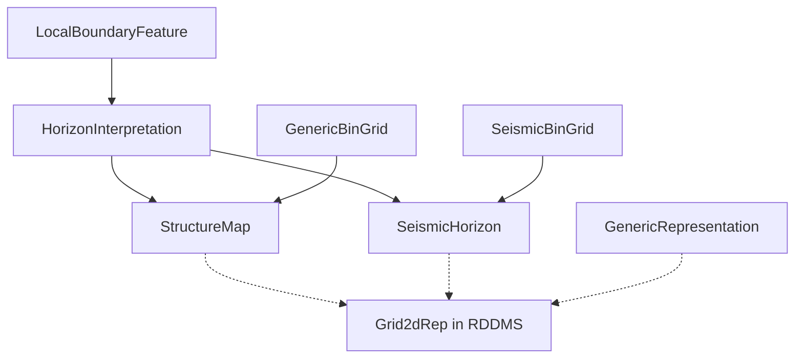
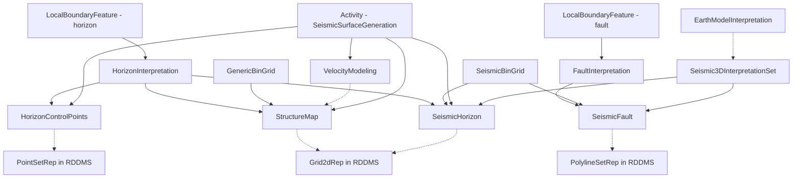

# Seismic Interpretation — Follow-Up Work & Schema Challenges

This document captures **gaps, divergence points, and improvement opportunities** for seismic interpretation schemas, RESQML ↔ OSDU mapping, and the ORES demo pipeline.

---

## 1. Context — What the Workshop Confirmed

ORES demo (StructureMap + GenericBinGrid + SeismicHorizon + dual-catalog pattern) aligns well with the **MVP1 scope**: end-to-end depth structure map exchange. The interoperability group validated:

- StructureMap:1.0.0 as the correct catalog record for depth surfaces
- GenericBinGrid:1.0.0 as the decoupled, non-seismic lattice abstraction
- DDMSDatasets[] as the only bridge to Z-values in the RDDMS
- Pattern A (inline) vs Pattern B (external BinGridID) as complementary strategies
- Dual-catalog (GenericRepresentation + StructureMap) as the recommended approach

---

## 2. Identified Gaps & Schema Challenges

### 2.1 AbstractBinGrid: Seismic Leakage in a "Generic" Abstraction

| Problem | Detail |
|---------|--------|
| **P6 prefix contamination** | Almost all attributes carry `P6` prefix (a seismic exchange format convention) |
| **SeismicBinGridType** | `BinGridTypeID` references `SeismicBinGridType` even in non-seismic contexts |
| **SeismicTraceData mention** | Documentation on `P6BinNodeIncrementOnI/Jaxis` references seismic traces |

**Current interim fix (M27)**: `AbstractGenericBinGrid` created as a clean abstraction without seismic terminology. GenericBinGrid:1.0.0 inherits from it.

**Longer-term target**: Deprecate `AbstractBinGrid` entirely. Migrate `SeismicBinGrid` to inherit from `AbstractGenericBinGrid` (adding only seismic-specific attributes like `BinGridTypeID` and trace-data references). Delete `AbstractBinGrid`.

**Impact on ORES demo**: Our demo already uses GenericBinGrid (`make_generic_bin_grid()` + `make_generic_bin_grid_therys()` in gen_volantis_interp.py, producing records 007 and 008). No immediate action needed, but we should track when SeismicBinGrid is migrated — our conversion table (§5 in SeisInt.md) will need updating.

---

### 2.2 Fault Representation — Conflicting Mapping Guidance

| RESQML entity | OSDU WKS option A | OSDU WKS option B | When to use which |
|---|---|---|---|
| `PolylineSetRepresentation` (fault sticks) | `SeismicFault` | `GenericRepresentation` | **Use SeismicFault** when tied to `FaultInterpretation` on a seismic support |
| `PolylineSetRepresentation` (non-fault lines: contours, depositional) | — | `GenericRepresentation` with constrained `RepresentationRole` / `RepresentationType` | Default for non-fault polylines |
| `TriangulatedSetRepresentation` (fault planes) | `SeismicFault`? | `GenericRepresentation`? | **No approved pattern yet** |

**Interim decision (Oslo'26 Slide 51)**:
- Map `PolylineSetRepresentation` → `SeismicFault` when tied to `FaultInterpretation`
- Non-fault polylines → `GenericRepresentation` with constrained role/type
- Label as time-boxed & non-normative pending formal workshop decision

**What's missing for ORES demo** (verified — zero fault code in repo):
- [ ] `SeismicFault` WPC generator (analogous to our StructureMap generator) — *no schema, no generator, no records*
- [ ] Fault polyline storage: catalog WPC only vs dual-catalog (WPC + RDDMS) — *`build_rddms_catalog.py` only handles Grid2d*
- [ ] `FaultInterpretation` → `LocalBoundaryFeature (TectonicBoundaryFeature)` chain — *AbstractRepresentation schema already allows FaultInterpretation in InterpretationID pattern, so schema support exists*
- [ ] Role/type constrained `GenericRepresentation` for non-fault polylines — *our GenericRepresentation records use Role=Map, Type=Grid2dRepresentation only*

---

### 2.3 SeismicLatticeFeature — No Agreed OSDU Mapping

RESQML's `SeismicLatticeFeature` represents the seismic acquisition lattice as a technical feature. Multiple OSDU entities could map to it:

| Candidate | Pros | Cons |
|---|---|---|
| `SeismicBinGrid` (WPC) | Has geometry attributes; used by SeismicHorizon/SeismicFault via BinGridID | Doesn't carry `DDMSDatasets[]` in the "feature" sense — it IS the grid, not a reference to it |
| `Seismic3DInterpretationSet` (master-data) | Logically represents a survey; horizons/faults are "within" it | **No `DDMSDatasets[]`** — master-data cannot reference RDDMS objects |
| `SeismicAcquisitionSurvey` (master-data) | Represents the physical survey | Wrong semantic level (acquisition ≠ interpretation lattice) |

**Workshop position**: Keep `SeismicLatticeFeature` + `GenericFeatureInterpretation` as RESQML-only entities for now. Don't force an OSDU mapping until the target model is agreed.

**Impact on ORES demo**: Our demo skips `SeismicLatticeFeature` entirely (we only care about Grid2dRepresentation geometry). No action needed, but we should note this as a known limitation in our RDDMS → OSDU pipeline.

---

### 2.4 Master-Data ↔ DDMS Traceability Gap

| Entity | Group Type | Has DDMSDatasets[]? | Problem |
|---|---|---|---|
| `Seismic3DInterpretationSet` | master-data | **No** | Cannot point to the RDDMS SeismicLatticeFeature |
| `SeismicBinGrid` | WPC | Yes (via AbstractWPCGroupType) | But semantically it IS the grid, not a reference to a survey |
| `SeismicAcquisitionSurvey` | master-data | **No** | Same structural limitation |

**Root cause**: `DDMSDatasets[]` is inherited from `AbstractWPCGroupType` — only WPCs get it. Master-data entities structurally cannot reference RDDMS objects.

**Proposed solutions** (from Oslo'26):
1. Add a `DDMSReferences[]` array to selected master-data schemas (breaking change — unlikely short-term)
2. Intermediate WPC that bridges: master-data → WPC (with DDMSDatasets[]) → RDDMS
3. Use `ExtensionProperties` or `NameAliases` as a workaround (fragile, not queryable)

**Impact on ORES demo**: We use `GenericRepresentation` as the universal RDDMS catalog layer — which already serves as this bridging WPC. Our dual-catalog pattern (verified: records 012-016 = StructureMap, records 017-021 = GenericRepresentation, both pointing to same 5 Grid2d UUIDs) is the de facto solution to this gap.

---

### 2.5 Cross-Domain Provenance (Seismic → Earth Model)

The workshop identified that there's no standard way to link from the reservoir/earth-modelling domain back to the seismic interpretation that produced the structural framework.

**Proposed links** (JFR, Slide 44-45):

```
EarthModelInterpretation / StructuralOrganizationInterpretation
   └── (new link) → Seismic3DInterpretationSet
```

This would allow an earth model to declare "I was built from this seismic interpretation set" — essential for provenance across discipline boundaries.

**Two options proposed**:
1. `StructureMap.BinGridID` → `GenericBinGrid` (current M27 — geometry only, no survey provenance)
2. `StructureMap` → `Seismic3DInterpretationSet` via a new `SeismicSourceID` field (full provenance)

**Impact on ORES demo**: Not directly needed for structure map generation, but relevant if we add Activity-based provenance chains. (Verified: zero Activity generators or records in demo/seisint/.)

---

### 2.6 HorizonControlPoints — Provenance from Picks to Surface

`HorizonControlPoints:1.0.0` (M27 new) captures interpreter seed picks. The provenance chain:

```
HorizonControlPoints → SeismicHorizon (via HorizonControlPointsID) → StructureMap (via SeismicHorizonID)
```

**What's implemented**: Our SeisInt.md documents this chain. Our demo generates SeismicHorizon records.

**What's missing** (verified — `HorizonControlPoints.1.0.0.json` schema exists in `schemas/` but no generator or records):
- [ ] HorizonControlPoints WPC generator from RDDMS PointSetRepresentation objects — *schema has `ColumnValues` (AbstractColumnBasedTable) for inline data + `DDMSDatasets[]` via AbstractRepresentation*
- [ ] End-to-end lineage: picks → autotracking → gridded horizon → depth surface
- [ ] ML/AI training data use case (HorizonControlPoints as labelled training sets)

---

### 2.7 SeismicSurfaceGeneration Activity Template

~85% complete at the time of the workshop. This Activity Template defines:
- **Inputs**: HorizonControlPoints, SeismicHorizon (TWT), VelocityModeling, SeismicBinGrid
- **Outputs**: StructureMap (depth), SeismicHorizon (new version)
- **Parameters**: gridding algorithm, smoothing, search radius, well-tie constraints

**Impact on ORES demo** (verified: `app/structuremap.py` only discovers `resqml20.obj_Grid2dRepresentation`, does not query PolylineSets):
- [ ] Generate Activity records that reference our StructureMap outputs
- [ ] Link Activities to the SeismicSurfaceGeneration template once published
- [ ] Display provenance chain in the ORES search/keys UI

---

### 2.8 Velocity Model / Time-to-Depth Conversion

The workshop workflow (Slide 23) shows:
```
SeismicHorizon (TWT) + VelocityModeling → Process (T2D) → StructureMap (Depth)
```

`VelocityModeling` WPC exists but `VelocityModelID` is **not** on any M27 schema (StructureMap, SeismicHorizon, etc.). Workaround: `ExtensionProperties`.

**What's missing for ORES demo** (verified: no velocity objects in our RDDMS dataspace, no VelocityModeling generator):
- [ ] VelocityModeling WPC generator (from RDDMS velocity cubes)
- [ ] T2D Activity Template linking VelocityModeling + SeismicHorizon → StructureMap
- [ ] `osdu:VelocityModelID` in ExtraMetadata on RDDMS objects

---

### 2.9 RESQML 2.0.1 Metadata Loss in OSDU Mapping

The current pipeline discards or under-maps several RESQML 2.0.1 metadata fields that could enrich OSDU records:

| RESQML field | Available value (Drogon) | OSDU target | Status |
|---|---|---|---|
| `Citation.Originator` | `knutm` (interpreter) | `ResourceCreator` or `ExtensionProperties.Originator` | Not mapped |
| `Citation.Editor` | `dalsaab` (last editor) | `ExtensionProperties.LastEditor` | Not mapped |
| `Citation.Creation` | `2024-11-11T12:08:00Z` | `ResourceCreationDateTime` | Not mapped |
| `Citation.LastUpdate` | `2024-11-27T10:48:41Z` | `ResourceModificationDateTime` | Not mapped |
| `Citation.Format` | `Aspen SKUA V15 Alpha 1…` | `ResourceFormatDescription` | Not mapped |
| `ExtraMetadata[pdgm/dx/gocad/kindType]` | `NormalFaultFeatureClass` | Could validate Role/Type | Not used |
| `ExtraMetadata[pdgm/dx/gocad/ScenarioName]` | `F3`, `TopVolantis` | cross-check InterpretationName | Not used |
| `ExtraMetadata[pdgm/dx/pdgm/InterpretationColor]` | `0.098 0.8 0.87` | Visualisation hint | Not mapped |
| `FaultInterpretation._data.Domain` | `depth` | Could validate DomainTypeID | Not used |

**Actions:**
- [ ] Map `Citation.Originator` → `ExtensionProperties.Interpreter` on all generated records
- [ ] Map `Citation.Creation` / `LastUpdate` → `ResourceCreationDateTime` / `ResourceModificationDateTime`
- [ ] Map `Citation.Format` → `ExtensionProperties.AuthoringSoftware`
- [ ] Preserve `ExtraMetadata` as `ExtensionProperties.ResqmlExtraMetadata` (selectively, not blind copy)
- [ ] Use `pdgm/dx/gocad/kindType` as validation cross-check during classification

---

### 2.10 RESQML 2.2 — Future-Proofing for OSDU Alignment

RESQML 2.2 (officially released 2023) is significantly better aligned with OSDU metadata needs. Current RDDMS data uses **2.0.1** (`SchemaVersion: "2.0"`), but future datasets will likely use 2.2.

**Key improvements for OSDU mapping:**

| Feature | 2.0.1 limitation | 2.2 improvement | OSDU benefit |
|---|---|---|---|
| Domain flag | Must chase CRS ContentType | Explicit `Domain` enum on representations | Direct `DomainTypeID` without CRS resolution |
| Description | Not in Citation | Added to `eml23.Citation` | Direct `data.Description` mapping |
| Activity model | Basic, rarely populated | Typed `DataObjectParameter` inputs/outputs | 1:1 mapping to OSDU Activity WPC |
| PropertyKind | Local string-based registry | Formal `PropertyKindDictionary` with URIs | Maps to OSDU `PropertyType` reference-data |
| Timestamps | Only Citation.Creation | `VersionDate` on DataObject | Reliable `ResourceModificationDateTime` |
| Metadata typing | Flat `NameValuePair` strings | Typed `CustomData` (XML any) | Richer `ExtensionProperties` |
| Interpretation confidence | Not native | Optional confidence field | Quality/uncertainty metadata |

---

## 3. ORES Demo — Concrete Follow-Up Tasks

### 3.1 High Priority (MVP2 scope)
- [ ] **Activity provenance**: Emit `Activity` records for each StructureMap generation, linking inputs (SeismicHorizon, GenericBinGrid) and outputs (StructureMap)

### 3.2 Medium Priority

- [ ] **VelocityModeling catalog**: Generate VelocityModeling WPC records from RDDMS velocity objects
- [ ] **Non-fault polylines**: GenericRepresentation with `RepresentationRole=outline` / `RepresentationType=PolylineSet` for contours, fault polygons, field boundaries
- [ ] **Well-tie workflow**: Demonstrate updated horizon (tied to well tops) as a new version of StructureMap
- [ ] **Cross-domain link demo**: Show how an EarthModelInterpretation or StructuralOrganizationInterpretation references back to Seismic3DInterpretationSet

### 3.3 Lower Priority (Pending Workshop Decisions)

- [ ] **SeismicLatticeFeature mapping**: Once agreed, implement the canonical OSDU representation
- [ ] **Master-data → DDMS bridge pattern**: Formalize the bridging WPC approach we already use
- [ ] **AbstractBinGrid deprecation migration**: Update conversion tables when SeismicBinGrid moves to AbstractGenericBinGrid
- [ ] **SeismicSurfaceGeneration Activity Template integration**: When published, generate conformant Activity records
- [ ] **4D / time-lapse**: Schema readiness for 4D seismic use cases (TimeLapseAssociations on SeismicTraceData:1.6.0)

---

## 4. Schema Improvement Recommendations

Based on the workshop discussions, these schema improvements would better serve E2E workflows:

### 4.1 OSDU WKS Improvements Needed

| Schema | Improvement | Rationale |
|---|---|---|
| `StructureMap:1.0.0` | Add optional `VelocityModelID` | T2D provenance; currently requires ExtensionProperties |
| `StructureMap:1.0.0` | Add optional `Remark[]` / `Interpreter` | Parity with SeismicHorizon:2.1.0 |
| `SeismicFault` | Formalize mapping guidance to `PolylineSetRepresentation` | Conflicting documentation resolved in MR#95 but needs schema-level clarity |
| `Seismic3DInterpretationSet` | Consider adding `DDMSReferences[]` or an external link | Master-data → RDDMS traceability gap |
| New: `FaultSurface` or similar | Catalog WPC for triangulated fault planes | Currently no WKS for fault planes outside RDDMS |
| `AbstractBinGrid` | Deprecate; migrate SeismicBinGrid to AbstractGenericBinGrid | Remove P6/seismic terminology leakage |
| `GenericRepresentation` | Publish constrained role/type value lists for polylines | Enable discoverable non-fault polylines |

### 4.2 RESQML Improvements / Clarifications Needed

| Area | Issue | Proposed Action |
|---|---|---|
| `SeismicLatticeFeature` | Removed in RESQML 2.2 (`GenericFeatureInterpretation` optional) — but no clear OSDU counterpart | Document the gap; propose bridging pattern |
| `PolylineSetRepresentation` | Used for both fault sticks AND non-fault lines (contours, horizons-2D) | WKS mapping context-dependent — needs decision tree |
| Grid2dRepresentation | No native "I am a depth surface" flag — depends entirely on CRS | Recommend `osdu:DomainTypeID` in ExtraMetadata for round-trip safety |
| Cross-object ancestry | RESQML `RepresentedObject` links interpretation → feature but not survey → interpretation set | Consider adding survey provenance in ExtraMetadata |

### 4.3 RDDMS Interoperability Improvements

| Gap | Current State | Desired State |
|---|---|---|
| Fault discovery | No standard query for "all fault polylines in dataspace" | RDDMS catalog endpoint or type-filtered list |
| Content negotiation | Z-values as JSON float array only | Support binary (Apache Arrow, Parquet) for large arrays |
| Activity model in RDDMS | No native provenance objects | Either RESQML Activity objects or links back to OSDU Activities |

---

## 5. Relationship Map — Current vs Target

### 5.1 What We Have (MVP1 — implemented)



### 5.2 Target (MVP2+ — to implement)



---

## 6. References

| Topic | Link |
|---|---|
| SeisInt demo guide | [SeisInt.md](SeisInt.md) |
| RDDMS mapping fix (MR#95) | [community.opengroup.org](https://community.opengroup.org/osdu/platform/domain-data-mgmt-services/reservoir/home/-/merge_requests/95) |
| Issue #31 - Structure Map | [GitLab](https://gitlab.opengroup.org/osdu/subcommittees/data-def/projects/seismic/docs/-/issues/31) |
| Issue #863 - Activity Template | [GitLab](https://gitlab.opengroup.org/osdu/data/data-definitions/-/issues/863) |
| GenericBinGrid schema | [E-R](https://community.opengroup.org/osdu/data/data-definitions/-/blob/master/E-R/work-product-component/GenericBinGrid.1.0.0.md) |
| SeismicFault schema | [E-R](https://community.opengroup.org/osdu/data/data-definitions/-/blob/master/E-R/work-product-component/SeismicFault.2.0.0.md) |
| HorizonControlPoints schema | [E-R](https://community.opengroup.org/osdu/data/data-definitions/-/blob/master/E-R/work-product-component/HorizonControlPoints.1.0.0.md) |
