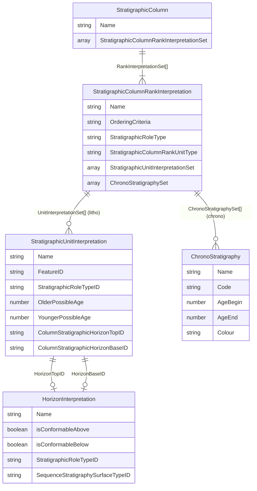
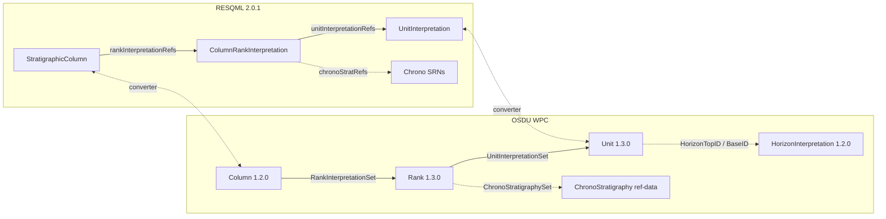
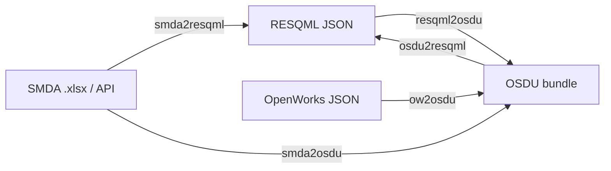

# Stratigraphy - Data Model, Tooling & Workflow

> Reference for the **OSDU Stratigraphic Column** data model, its relationship to **RESQML 2.0.1**, **SMDA**, and **OpenWorks** source systems, and the tools that ship with this repository.
>
> | Tool | Location | Purpose |
> |------|----------|---------|
> | **Strat Column Viewer** | `app/templates/strat.html` | Interactive browser UI - search, render, inspect & push columns to RDDMS |
> | **Strat Column Converter** | `demo/strat/stratcolumnhandler.py` | CLI - round-trip SMDA ↔ RESQML ↔ OSDU bundles |
> | **Build Pipeline** | `demo/strat/genrec/` | Generate & deploy ICS chrono manifests end-to-end |

---

## Table of Contents

1. [OSDU Stratigraphic Column Data Model](#1-osdu-stratigraphic-column-data-model)
2. [Units vs Horizons](#2-units-vs-horizons)
3. [Chronostratigraphy vs Lithostratigraphy](#3-chronostratigraphy-vs-lithostratigraphy)
4. [Hierarchical Composition & Age](#4-hierarchical-composition--age)
5. [Source-System Mapping (SMDA / OW → OSDU)](#5-source-system-mapping)
6. [Tool A - Strat Column Viewer](#6-tool-a--strat-column-viewer)
7. [Tool B - Strat Column Converter (CLI)](#7-tool-b--strat-column-converter-cli)
8. [Reproducible Build Workflow](#8-reproducible-build-workflow)
9. [Gap-Fill Algorithm](#9-gap-fill-algorithm)
10. [RDDMS RESQML Ingest](#10-rddms-resqml-ingest)
11. [Schema Links & References](#11-schema-links--references)

---

## 1) OSDU Stratigraphic Column Data Model

### 1.1 Core Entities

| Entity (OSDU kind) | Version | Semantic role |
|---------------------|---------|---------------|
| `work-product-component--StratigraphicColumn` | 1.2.0 | The column itself - ordered list of Rank references |
| `work-product-component--StratigraphicColumnRankInterpretation` | 1.3.0 | One rank level (e.g. "System", "Group") - owns **either** units **or** chrono refs |
| `work-product-component--StratigraphicUnitInterpretation` | 1.3.0 | A rock-body **interval** with age range, lithology, colour, optional horizon boundaries |
| `work-product-component--HorizonInterpretation` | 1.2.0 | A **boundary surface** between units (conformability, sequence-strat surface type) |
| `reference-data--ChronoStratigraphy` | 1.0.0 / 1.1.0 | ICS time-scale entry: Code, AgeBegin (Ma), AgeEnd (Ma), Colour, hierarchy via Code path |

### 1.2 Relationship Diagram



### 1.3 Rank XOR Constraint

> **CRITICAL**: The Rank schema enforces a mutual exclusion -
> *"Only one of `ChronoStratigraphySet` or `StratigraphicUnitInterpretationSet` must be populated, never both."*

A single Rank is either **chrono** (pointing to `reference-data--ChronoStratigraphy` SRNs) or **litho/bio** (pointing to `StratigraphicUnitInterpretation` WPC records). A column can contain both kinds of Ranks.

---

## 2) Units vs Horizons

Units and Horizons are **complementary** - they represent the same stratigraphy from two viewpoints:

| Aspect | StratigraphicUnitInterpretation | HorizonInterpretation |
|--------|--------------------------------|----------------------|
| **Geometry** | Volume / interval (rock body) | Surface / boundary |
| **Time** | Age range: `OlderPossibleAge` → `YoungerPossibleAge` | Single age point |
| **Feature reference** | `FeatureID` → `RockVolumeFeature` | `FeatureID` → `BoundaryFeature` |
| **Properties** | Thickness, lithology, depositional env | Conformability (above/below), seq-strat surface type |
| **Rank relationship** | Listed in `StratigraphicUnitInterpretationSet[]` on the Rank | **Not listed on the Rank** - linked FROM Units via `HorizonTopID` / `BaseID` |
| **RESQML type** | `resqml20.obj_StratigraphicUnitInterpretation` | `resqml20.obj_HorizonInterpretation` |

> **Key insight**: the Rank schema has **no** `HorizonInterpretationSet`. Horizons are optional denormalized boundary references attached to individual Units.

---

## 3) Chronostratigraphy vs Lithostratigraphy

| Dimension | Chronostratigraphy | Lithostratigraphy |
|-----------|-------------------|-------------------|
| **Classified by** | Time (geological age) | Rock character (lithology) |
| **Rank hierarchy** | Eonothem → Erathem → System → Series → Stage → Sub-Stage | Supergroup → Group → Formation → Member → Bed |
| **OSDU rank content** | `ChronoStratigraphySet[]` → `reference-data` SRNs | `StratigraphicUnitInterpretationSet[]` → WPC records |
| **Age source** | `data.AgeBegin` / `data.AgeEnd` (Ma) on chrono ref-data | `data.OlderPossibleAge` / `data.YoungerPossibleAge` (Ma) on Unit WPC |
| **Hierarchy encoded in** | `Code` path (e.g. `Ph.Mz.K.UK.Ma`) - depth = rank level | Parent/child naming or `strat_unit_level` |
| **Colour** | Official ICS `Colour` hex on chrono record | Custom `color_html` on unit |
| **Scope** | Global reference scheme (ICS) | Local to a field / basin |

### 3.1 Age Semantics

```
Older (bigger Ma)  ←───  top_age / AgeBegin / OlderPossibleAge
                         ↕   duration of the unit / interval
Younger (smaller Ma) ←──  base_age / AgeEnd / YoungerPossibleAge
```

All ages in **Ma** (millions of years ago), positive values.
Convention: `OlderPossibleAge >= YoungerPossibleAge` (equivalently `AgeBegin >= AgeEnd`).

The **viewer** tries multiple field paths in priority order:

| Priority | Chrono record fields | Unit record fields |
|----------|---------------------|--------------------|
| 1 | `data.AgeBegin` / `data.AgeEnd` | `data.OlderPossibleAge` / `data.YoungerPossibleAge` |
| 2 | `data.TopMa` / `data.BaseMa` | `data.TimeRange.TopAgeMa` / `data.TimeRange.BaseAgeMa` |
| 3 | `data.AgeBeginMa` / `data.AgeEndMa` | `data.TopMa` / `data.BaseMa` |
| 4 | - | `data.VendorMetadata.Raw.TopAgeMa` / `.BaseAgeMa` |
| 5 | - | `data.VendorMetadata.Raw.top_age` / `.base_age` |

### 3.2 Colour Resolution

| Priority | Source |
|----------|--------|
| 1 | Chrono `data.Colour` or `data.Color` (ICS hex) |
| 2 | Unit `data.Rendering.ColorHtml` |
| 3 | Unit `data.VendorMetadata.Raw.ColorHtml` |
| 4 | Unit `data.VendorMetadata.Raw.color_html` |
| 5 | Rank palette fallback (HSL gradient) |

---

## 4) Hierarchical Composition & Age

### 4.1 Column → Rank → Unit / Chrono

```
StratigraphicColumn "ICS Chrono 2017"
  ├── Rank "Eonothem"  (chrono)  →  [Phanerozoic, Proterozoic, Archean, Hadean]
  ├── Rank "Erathem"   (chrono)  →  [Cenozoic, Mesozoic, Paleozoic, ...]
  ├── Rank "System"    (chrono)  →  [Quaternary, Neogene, ..., Cambrian]
  ├── Rank "Series"    (chrono)  →  [Holocene, Pleistocene, ..., Terreneuvian]
  └── Rank "Stage"     (chrono)  →  [Meghalayan, Northgrippian, ..., Fortunian]

StratigraphicColumn "Field Lithostratigraphy"
  ├── Rank "Group"     (litho)   →  [Nordland Gp, Rogaland Gp, Shetland Gp, ...]
  └── Rank "Formation" (litho)   →  [Utsira Fm, Lista Fm, Sele Fm, ...]
```

### 4.2 RESQML ↔ OSDU Structural Alignment



---

## 5) Source-System Mapping

### 5.1 SMDA / OW → OSDU Field Mapping

| Source field (SMDA / OW) | OSDU target path | Notes |
|--------------------------------------|-----------------|-------|
| `strat_column_identifier` / `Name` | `StratigraphicColumn.data.Name` | Column display name |
| `strat_unit_level` | Determines which **Rank** the row belongs to | Groups rows: 1 = Group, 2 = Formation, etc. |
| `strat_column_type` / `Type` | Rank `kind` (chrono vs litho) | Contains "chronostrat" → chrono rank |
| `identifier` | `StratigraphicUnitInterpretation.data.Name` | Unit display name |
| `top_age` (Ma) | `data.TimeRange.TopAgeMa` | Older boundary |
| `base_age` (Ma) | `data.TimeRange.BaseAgeMa` | Younger boundary |
| `strat_unit_parent` | `data.ParentName` | Hierarchy link |
| `color_html` | `data.Rendering.ColorHtml` | Display colour |
| `source` | `data.VendorMetadata.Raw.Source` | Provenance |

### 5.2 Vendor Metadata Strategy

All source fields from SMDA / OW are preserved in `data.VendorMetadata.Raw`, ensuring full round-trip fidelity. A `--vendor-map` JSON option additionally copies selected fields into structured OSDU paths.

---

## 6) Tool A - Strat Column Viewer

**Location**: `app/templates/strat.html` (backend: `app/strat.py`)

### 6.1 Architecture


### 6.2 Visualization Algorithm

The viewer renders a **hierarchy-based table** where each stratigraphic rank becomes a separate column and rows are defined by the finest-rank (leaf) units in their natural order. Higher-rank cells span multiple leaf rows via containment mapping.

**Mapping strategies** (tried in order):

| # | Strategy | Match rule |
|---|----------|------------|
| 1 | **Age containment** | Parent age range fully contains child age range (0.5 Ma tolerance) |
| 2 | **Code prefix** | Child code is a prefix-extension of parent code |
| 3 | **ParentName chain** | Child's `data.ParentName` matches parent unit's `Name` |
| 4 | **Positional fallback** | Unassigned nodes render in their own rank column |

### 6.3 Features

- **Hierarchy-based rendering**: rows defined by leaf units - works for both chrono and litho columns
- **Boundary annotations**: age (Ma) and/or horizon names shown at cell edges
- **Synthetic horizon labels**: generates "Top X" / "Base X" when real HorizonInterpretation records are absent
- **Gap-fill**: backend inserts synthetic placeholder units for missing intervals (see §9)
- **RDDMS push**: push loaded column to Reservoir DDMS as RESQML 2.0.1
- **Rank toggle**: legend items are clickable - hide/show any rank
- **Trailing-colon resilience**: handles OSDU references with/without trailing `:`
- **Missing-rank diagnostics**: 404 rank records reported in `missingRanks` array

---

## 7) Tool B - Strat Column Converter (CLI)

**Location**: `demo/strat/stratcolumnhandler.py`

### 7.1 Supported Conversions



### 7.2 CLI Usage

```bash
# SMDA → OSDU WPC bundle
python stratcolumnhandler.py smda2osdu --xlsx smda.xlsx -o strat.osdu.json

# SMDA API → OSDU
python stratcolumnhandler.py smdaapi2osdu --column "NCS Lithostratigraphy" -o strat.osdu.json

# OSDU → RESQML
python stratcolumnhandler.py osdu2resqml --manifest strat.osdu.json -o strat.resqml.json

# RESQML → OSDU
python stratcolumnhandler.py resqml2osdu --resqml-json strat.resqml.json -o strat.osdu.json
```

### 7.3 Validation Rules

| Rule | Enforcement |
|------|------------|
| **Rank XOR** | Each rank has `ChronoStratigraphySet` OR `StratigraphicUnitInterpretationSet`, never both |
| **Ordering** | Units sorted older → younger by `(top_age, base_age, name)` |
| **Deduplication** | Duplicate unit IDs within a rank are removed |
| **Round-trip** | All source fields preserved in `VendorMetadata.Raw` (OSDU) / `extraMetadata.vendor` (RESQML) |

---

## 8) Reproducible Build Workflow

### 8.1 Pipeline

```text
Source chrono data
      │
      ▼
[7genchronostratics.py]  →  manifest_chronostratics.json  (ref-data)
      │
      ▼
[7genstratcolumn.py]     →  manifest_stratcolumn.json    (column + ranks + units)
      │
      ▼
[10genhorizons.py]       →  manifest_stratcolumn.json    (+ horizons + ages on units)
      │
      ▼
[7manifest2records.py]   →  individual record files       (for deployment)
      │
      ▼
[9deploy_chronostratics.py] → OSDU platform (chrono)
[8deploy_stratcolumn.py]    → OSDU platform (column + units + horizons)
```

### 8.2 Script Reference

| # | Script | Purpose |
|---|--------|---------|
| 7 | `7genchronostratics.py` | Generate chrono ref-data manifest |
| 7 | `7genstratcolumn.py` | Generate strat column manifest |
| 7 | `7manifest2records.py` | Split manifest into individual records |
| 8 | `8deploy_stratcolumn.py` | Deploy strat column to OSDU |
| 9 | `9deploy_chronostratics.py` | Deploy chrono records to OSDU |
| 10 | `10genhorizons.py` | Generate horizons from chrono ages |
| - | `_consistency_check.py` | Cross-manifest validation |

### 8.3 Adapting for a Different Column

| Parameter | Where | Default |
|---|---|---|
| Partition / namespace | All scripts `--partition` | `dev` |
| Column token | `7genstratcolumn.py` `--column-token` | `ChronoStratigraphicScheme-ICS2017` |
| ACL owners/viewers | All scripts `--owners` / `--viewers` | Partition defaults |
| Legal tag | All scripts `--legaltag` | `<partition>-osdu-reference-default` |

---

## 9) Gap-Fill Algorithm

### 9.1 Problem

When rendering hierarchical columns, **white/undefined cells** appear where a parent rank has no children at the next rank, leaving undeclared gaps.

### 9.2 Root Causes

| Cause | Example | Impact |
|-------|---------|--------|
| **Missing intermediate ranks** | Parent at rank *i* has children only at rank *i+2* | White column in intermediate rank |
| **Age gaps between siblings** | child1.baseMa != child2.topMa (gap > 0.5 Ma) | White row segment |
| **Orphan nodes** | Deep-rank nodes with no parent at coarser ranks | Isolated cells |

### 9.3 Solution - Backend Synthetic Gap-Fill

Implemented in `app/strat.py`. For each consecutive pair of ranks:

1. **Find real children**: for each parent unit at rank N, identify children at rank N+1 whose age range is contained within the parent (0.5 Ma tolerance)
2. **Detect gaps**: sort real children older-first, check for top gap, inter-sibling gaps, and base gap
3. **Insert synthetic placeholders**: for each gap > 0.5 Ma, create a synthetic unit with `_synthetic = True`
4. **Cascade propagation**: synthetic placeholders cascade through subsequent ranks
5. **Clean labels**: tracks `_originalName` to avoid nested label ugliness
6. **Deduplication**: overlapping synthetic age ranges deduplicated by `(topMa, baseMa)`

### 9.4 Frontend Rendering

- CSS class `sc-synthetic`: diagonal hatched pattern, italic grey text, dashed borders
- `fillGaps(node)`: extends children leftward via `effectiveCol` and `colSpan`
- Orphan roots moved to `rankIdx = 0` for full-width colSpan

---

## 10) RDDMS RESQML Ingest

### 10.1 Conversion Pipeline

```
OSDU WPC Records                    RESQML 2.0.1 Objects (RDDMS)
─────────────────                    ────────────────────────────
StratigraphicColumn          →  resqml20.obj_StratigraphicColumn
  ├─ Rank (chrono/litho)     →  resqml20.obj_StratigraphicColumnRankInterpretation
  │   ├─ Unit                →  resqml20.obj_StratigraphicUnitInterpretation
  │   │   └─ (feature)       →  resqml20.obj_RockVolumeFeature
  │   └─ (org feature)       →  resqml20.obj_OrganizationFeature
  └─ ...
```

### 10.2 Key Design Decisions

- **Deterministic UUIDs**: UUID5 from OSDU record ID ensures idempotent re-push
- **Ages in ExtraMetadata**: RESQML has no native age fields on StratigraphicUnitInterpretation
- **Synthetic units skipped**: gap-fill placeholders are not pushed to RDDMS
- **PUT order**: features → interpretations → column (referential dependency order)

### 10.3 API Endpoints

| Method | Path | Purpose |
|--------|------|---------|
| POST | `/api/strat/ingest/rddms` | Convert OSDU column → RESQML and PUT to RDDMS |
| GET | `/api/strat/dataspaces.json` | List available RDDMS dataspaces |

---

## 11) Schema Links & References

### 11.1 OSDU Schema Documentation

| Entity | Link |
|--------|----------|
| StratigraphicColumn 1.2.0 | [E-R doc](https://community.opengroup.org/osdu/data/data-definitions/-/blob/master/E-R/work-product-component/StratigraphicColumn.1.2.0.md) |
| StratigraphicColumnRankInterpretation 1.3.0 | [E-R doc](https://community.opengroup.org/osdu/data/data-definitions/-/blob/master/E-R/work-product-component/StratigraphicColumnRankInterpretation.1.3.0.md) |
| StratigraphicUnitInterpretation 1.3.0 | [E-R doc](https://community.opengroup.org/osdu/data/data-definitions/-/blob/master/E-R/work-product-component/StratigraphicUnitInterpretation.1.3.0.md) |
| HorizonInterpretation 1.2.0 | [E-R doc](https://community.opengroup.org/osdu/data/data-definitions/-/blob/master/E-R/work-product-component/HorizonInterpretation.1.2.0.md) |
| ChronoStratigraphy 1.0.0 | [E-R doc](https://community.opengroup.org/osdu/data/data-definitions/-/blob/master/E-R/reference-data/ChronoStratigraphy.1.0.0.md) |

### 11.2 Repository Files

| File | Purpose |
|------|---------|
| `app/strat.py` | FastAPI backend - search, batch-fetch, gap-fill, RESQML conversion, RDDMS ingest |
| `app/templates/strat.html` | Frontend viewer - hierarchy rendering, RDDMS push UI |
| `demo/strat/stratcolumnhandler.py` | CLI converter - SMDA ↔ RESQML ↔ OSDU round-trip |
| `demo/strat/genrec/` | Build pipeline scripts (generate, split, deploy) |

### 11.3 Energistics RESQML

| Resource | Link |
|----------|------|
| RESQML 2.0.1 Overview | [Energistics](https://docs.energistics.org/RESQML/RESQML_TOPICS/RESQML-000-000-titlepage.html) |
