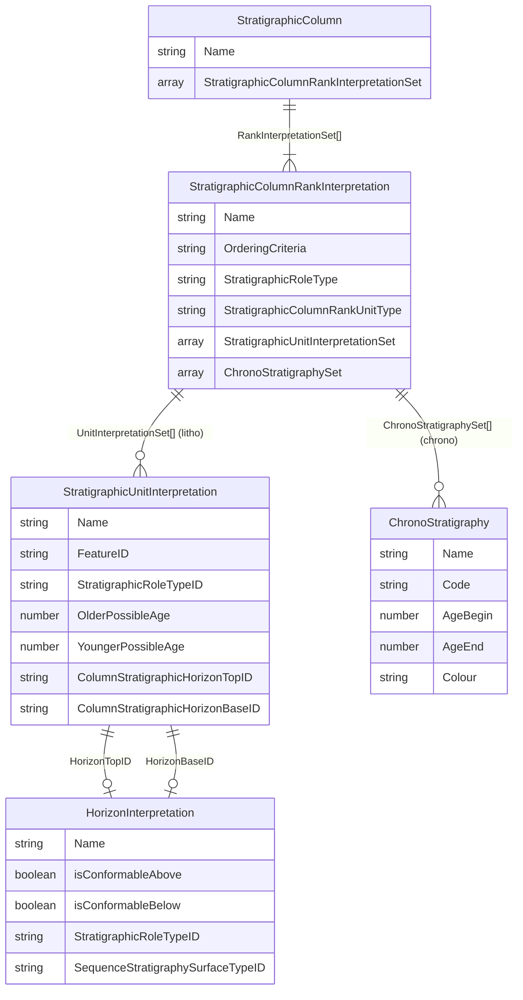
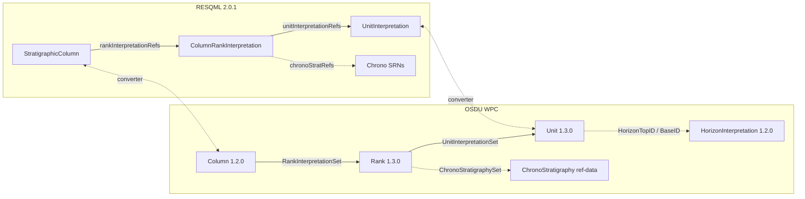

# Stratigraphy - Data Model & Workflow

> Reference for the **OSDU Stratigraphic Column** data model, its relationship to **RESQML 2.0.1**, **SMDA**, and **OpenWorks** source systems.

---

## Table of Contents

1. [OSDU Stratigraphic Column Data Model](#1-osdu-stratigraphic-column-data-model)
2. [Units vs Horizons](#2-units-vs-horizons)
3. [Chronostratigraphy vs Lithostratigraphy](#3-chronostratigraphy-vs-lithostratigraphy)
4. [Hierarchical Composition & Age](#4-hierarchical-composition--age)
5. [Source-System Mapping (SMDA / OW -> OSDU)](#5-source-system-mapping)
6. [RDDMS RESQML Ingest](#6-rddms-resqml-ingest)
7. [Schema Links & References](#7-schema-links--references)

---

## 1) OSDU Stratigraphic Column Data Model

### 1.1 Core Entities

| Entity (OSDU kind) | Version | Semantic role |
|---------------------|---------|---------------|
| `work-product-component--StratigraphicColumn` | 1.2.0 | The column itself - ordered list of Rank references |
| `work-product-component--StratigraphicColumnRankInterpretation` | 1.3.0 | One rank level (e.g. "System", "Group") - owns **either** units **or** chrono refs |
| `work-product-component--StratigraphicUnitInterpretation` | 1.3.0 | A rock-body **interval** with age range, lithology, colour, optional horizon boundaries |
| `work-product-component--HorizonInterpretation` | 1.2.0 | A **boundary surface** between units (conformability, sequence-strat surface type) |
| `reference-data--ChronoStratigraphy` | 1.0.0 / 1.1.0 | ICS time-scale entry: Code, AgeBegin (Ma), AgeEnd (Ma), Colour, hierarchy via Code path |

### 1.2 Relationship Diagram



### 1.3 Rank XOR Constraint

> **CRITICAL**: The Rank schema enforces a mutual exclusion -
> *"Only one of `ChronoStratigraphySet` or `StratigraphicUnitInterpretationSet` must be populated, never both."*

A single Rank is either **chrono** (pointing to `reference-data--ChronoStratigraphy` SRNs) or **litho/bio** (pointing to `StratigraphicUnitInterpretation` WPC records). A column can contain both kinds of Ranks.

---

## 2) Units vs Horizons

Units and Horizons are **complementary** - they represent the same stratigraphy from two viewpoints:

| Aspect | StratigraphicUnitInterpretation | HorizonInterpretation |
|--------|--------------------------------|----------------------|
| **Geometry** | Volume / interval (rock body) | Surface / boundary |
| **Time** | Age range: `OlderPossibleAge` -> `YoungerPossibleAge` | Single age point |
| **Feature reference** | `FeatureID` -> `RockVolumeFeature` | `FeatureID` -> `BoundaryFeature` |
| **Properties** | Thickness, lithology, depositional env | Conformability (above/below), seq-strat surface type |
| **Rank relationship** | Listed in `StratigraphicUnitInterpretationSet[]` on the Rank | **Not listed on the Rank** - linked FROM Units via `HorizonTopID` / `BaseID` |
| **RESQML type** | `resqml20.obj_StratigraphicUnitInterpretation` | `resqml20.obj_HorizonInterpretation` |

> **Key insight**: the Rank schema has **no** `HorizonInterpretationSet`. Horizons are optional denormalized boundary references attached to individual Units.

---

## 3) Chronostratigraphy vs Lithostratigraphy

| Dimension | Chronostratigraphy | Lithostratigraphy |
|-----------|-------------------|-------------------|
| **Classified by** | Time (geological age) | Rock character (lithology) |
| **Rank hierarchy** | Eonothem -> Erathem -> System -> Series -> Stage -> Sub-Stage | Supergroup -> Group -> Formation -> Member -> Bed |
| **OSDU rank content** | `ChronoStratigraphySet[]` -> `reference-data` SRNs | `StratigraphicUnitInterpretationSet[]` -> WPC records |
| **Age source** | `data.AgeBegin` / `data.AgeEnd` (Ma) on chrono ref-data | `data.OlderPossibleAge` / `data.YoungerPossibleAge` (Ma) on Unit WPC |
| **Hierarchy encoded in** | `Code` path (e.g. `Ph.Mz.K.UK.Ma`) - depth = rank level | Parent/child naming or `strat_unit_level` |
| **Colour** | Official ICS `Colour` hex on chrono record | Custom `color_html` on unit |
| **Scope** | Global reference scheme (ICS) | Local to a field / basin |

### 3.1 Age Semantics

```
Older (bigger Ma)  <---  top_age / AgeBegin / OlderPossibleAge
                         |   duration of the unit / interval
Younger (smaller Ma) <--  base_age / AgeEnd / YoungerPossibleAge
```

All ages in **Ma** (millions of years ago), positive values.
Convention: `OlderPossibleAge >= YoungerPossibleAge` (equivalently `AgeBegin >= AgeEnd`).

Age fields are found on different schema paths depending on entity type:

| Priority | Chrono record fields | Unit record fields |
|----------|---------------------|--------------------|
| 1 | `data.AgeBegin` / `data.AgeEnd` | `data.OlderPossibleAge` / `data.YoungerPossibleAge` |
| 2 | `data.TopMa` / `data.BaseMa` | `data.TimeRange.TopAgeMa` / `data.TimeRange.BaseAgeMa` |
| 3 | `data.AgeBeginMa` / `data.AgeEndMa` | `data.TopMa` / `data.BaseMa` |
| 4 | - | `data.VendorMetadata.Raw.TopAgeMa` / `.BaseAgeMa` |
| 5 | - | `data.VendorMetadata.Raw.top_age` / `.base_age` |

---

## 4) Hierarchical Composition & Age

### 4.1 Column -> Rank -> Unit / Chrono

```
StratigraphicColumn "ICS Chrono 2017"
  +-- Rank "Eonothem"  (chrono)  ->  [Phanerozoic, Proterozoic, Archean, Hadean]
  +-- Rank "Erathem"   (chrono)  ->  [Cenozoic, Mesozoic, Paleozoic, ...]
  +-- Rank "System"    (chrono)  ->  [Quaternary, Neogene, ..., Cambrian]
  +-- Rank "Series"    (chrono)  ->  [Holocene, Pleistocene, ..., Terreneuvian]
  +-- Rank "Stage"     (chrono)  ->  [Meghalayan, Northgrippian, ..., Fortunian]

StratigraphicColumn "Field Lithostratigraphy"
  +-- Rank "Group"     (litho)   ->  [Nordland Gp, Rogaland Gp, Shetland Gp, ...]
  +-- Rank "Formation" (litho)   ->  [Utsira Fm, Lista Fm, Sele Fm, ...]
```

### 4.2 RESQML <-> OSDU Structural Alignment



---

## 5) Source-System Mapping

### 5.1 SMDA / OW -> OSDU Field Mapping

| Source field (SMDA / OW) | OSDU target path | Notes |
|--------------------------------------|-----------------|-------|
| `strat_column_identifier` / `Name` | `StratigraphicColumn.data.Name` | Column display name |
| `strat_unit_level` | Determines which **Rank** the row belongs to | Groups rows: 1 = Group, 2 = Formation, etc. |
| `strat_column_type` / `Type` | Rank `kind` (chrono vs litho) | Contains "chronostrat" -> chrono rank |
| `identifier` | `StratigraphicUnitInterpretation.data.Name` | Unit display name |
| `top_age` (Ma) | `data.TimeRange.TopAgeMa` | Older boundary |
| `base_age` (Ma) | `data.TimeRange.BaseAgeMa` | Younger boundary |
| `strat_unit_parent` | `data.ParentName` | Hierarchy link |
| `color_html` | `data.Rendering.ColorHtml` | Display colour |
| `source` | `data.VendorMetadata.Raw.Source` | Provenance |

### 5.2 Vendor Metadata Strategy

All source fields from SMDA / OW are preserved in `data.VendorMetadata.Raw`, ensuring full round-trip fidelity. A `--vendor-map` JSON option additionally copies selected fields into structured OSDU paths.

---

## 6) RDDMS RESQML Ingest

### 6.1 Conversion Pipeline

```
OSDU WPC Records                    RESQML 2.0.1 Objects (RDDMS)
-----------------                    ----------------------------
StratigraphicColumn          ->  resqml20.obj_StratigraphicColumn
  +- Rank (chrono/litho)     ->  resqml20.obj_StratigraphicColumnRankInterpretation
  |   +- Unit                ->  resqml20.obj_StratigraphicUnitInterpretation
  |   |   +- (feature)       ->  resqml20.obj_RockVolumeFeature
  |   +- (org feature)       ->  resqml20.obj_OrganizationFeature
  +- ...
```

### 6.2 Key Design Decisions

- **Deterministic UUIDs**: UUID5 from OSDU record ID ensures idempotent re-push
- **Ages in ExtraMetadata**: RESQML has no native age fields on StratigraphicUnitInterpretation
- **Synthetic units skipped**: gap-fill placeholders are not pushed to RDDMS
- **PUT order**: features -> interpretations -> column (referential dependency order)

### 6.3 API Endpoints

| Method | Path | Purpose |
|--------|------|---------|
| POST | `/api/strat/ingest/rddms` | Convert OSDU column -> RESQML and PUT to RDDMS |
| GET | `/api/strat/dataspaces.json` | List available RDDMS dataspaces |

---

## 7) Schema Links & References

### 7.1 OSDU Schema Documentation

| Entity | Link |
|--------|----------|
| StratigraphicColumn 1.2.0 | [E-R doc](https://community.opengroup.org/osdu/data/data-definitions/-/blob/master/E-R/work-product-component/StratigraphicColumn.1.2.0.md) |
| StratigraphicColumnRankInterpretation 1.3.0 | [E-R doc](https://community.opengroup.org/osdu/data/data-definitions/-/blob/master/E-R/work-product-component/StratigraphicColumnRankInterpretation.1.3.0.md) |
| StratigraphicUnitInterpretation 1.3.0 | [E-R doc](https://community.opengroup.org/osdu/data/data-definitions/-/blob/master/E-R/work-product-component/StratigraphicUnitInterpretation.1.3.0.md) |
| HorizonInterpretation 1.2.0 | [E-R doc](https://community.opengroup.org/osdu/data/data-definitions/-/blob/master/E-R/work-product-component/HorizonInterpretation.1.2.0.md) |
| ChronoStratigraphy 1.0.0 | [E-R doc](https://community.opengroup.org/osdu/data/data-definitions/-/blob/master/E-R/reference-data/ChronoStratigraphy.1.0.0.md) |

### 7.2 Energistics RESQML

| Resource | Link |
|----------|------|
| RESQML 2.0.1 Overview | [Energistics](https://docs.energistics.org/RESQML/RESQML_TOPICS/RESQML-000-000-titlepage.html) |
