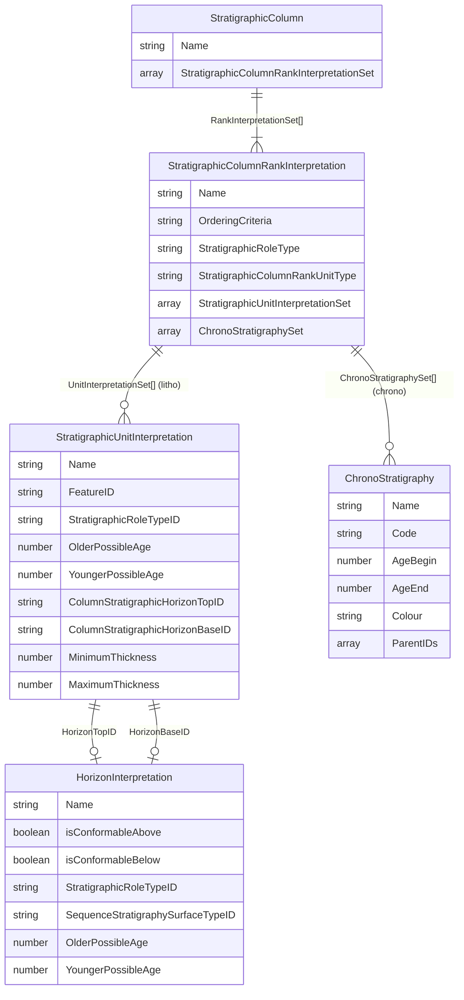
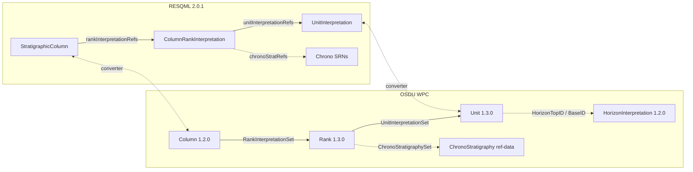
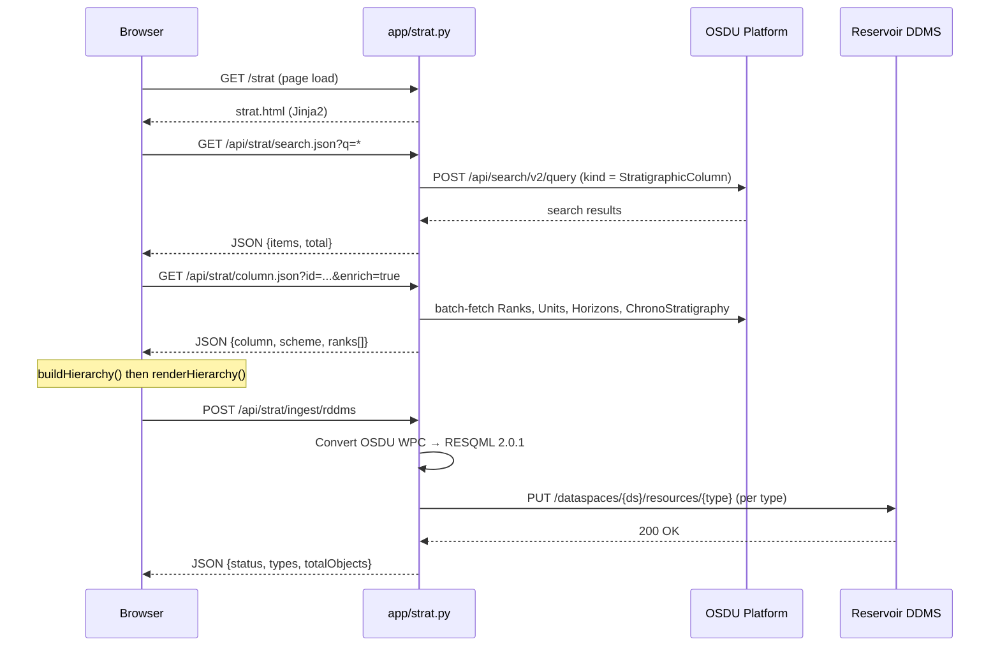
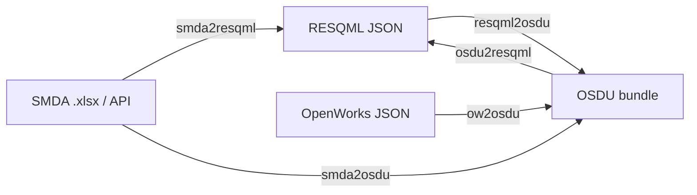

# Stratigraphic Column — Data Model, Tooling & Workflow

> Comprehensive reference for the **OSDU Stratigraphic Column** data model, its relationship to **RESQML 2.0.1**, **SMDA**, and **OpenWorks** source systems, and the tools that ship with this repository.
>
> | Tool | Location | Purpose |
> |------|----------|---------|
> | **Strat Column Viewer** | `app/templates/strat.html` | Interactive browser UI — search, render, inspect & push columns to RDDMS |
> | **Strat Column Converter** | `demo/strat/stratcolumnhandler.py` | CLI — round‑trip SMDA ↔ RESQML ↔ OSDU bundles |
> | **Build Pipeline** | `demo/strat/genrec/` | Generate & deploy ICS chrono manifests end‑to‑end |

---

## Table of Contents

1. [OSDU Stratigraphic Column Data Model](#1-osdu-stratigraphic-column-data-model)
2. [Units vs Horizons — Complementary Views](#2-units-vs-horizons)
3. [Chronostratigraphy vs Lithostratigraphy](#3-chronostratigraphy-vs-lithostratigraphy)
4. [Hierarchical Composition & Age](#4-hierarchical-composition--age)
5. [Source‑System Mapping (SMDA / OW → OSDU)](#5-source-system-mapping)
6. [Tool A — Strat Column Viewer](#6-tool-a--strat-column-viewer)
7. [Tool B — Strat Column Converter (CLI)](#7-tool-b--strat-column-converter-cli)
8. [Reproducible Build Workflow](#8-reproducible-build-workflow)
9. [Gap‑Fill Investigation & Solution](#9-gap-fill-investigation--solution)
10. [RDDMS RESQML Ingest](#10-rddms-resqml-ingest)
11. [Schema Links & References](#11-schema-links--references)

---

## 1) OSDU Stratigraphic Column Data Model

### 1.1 Core Entities

The OSDU Stratigraphy model is a **three‑level hierarchy**: a *Column* owns an ordered set of *Ranks*, and each Rank owns an ordered set of either *Units* (litho / bio) or *Chrono reference‑data items* (chrono).

| Entity (OSDU kind) | Version | Semantic role |
|---------------------|---------|---------------|
| `work-product-component--StratigraphicColumn` | 1.2.0 | The column itself — ordered list of Rank references |
| `work-product-component--StratigraphicColumnRankInterpretation` | 1.3.0 | One rank level (e.g. "System", "Group") — owns **either** units **or** chrono refs |
| `work-product-component--StratigraphicUnitInterpretation` | 1.3.0 | A rock‑body **interval** with age range, lithology, colour, optional horizon boundaries |
| `work-product-component--HorizonInterpretation` | 1.2.0 | A **boundary surface** between units (conformability, sequence‑strat surface type) |
| `reference-data--ChronoStratigraphy` | 1.0.0 / 1.1.0 | ICS time‑scale entry: Code, AgeBegin (Ma), AgeEnd (Ma), Colour, hierarchy via Code path |

### 1.2 Relationship Diagram



### 1.3 Rank XOR Constraint

> **CRITICAL**: The Rank schema enforces a mutual exclusion —
> *"Only one of `ChronoStratigraphySet` or `StratigraphicUnitInterpretationSet` must be populated, **never both**."*
> — OSDU E‑R StratigraphicColumnRankInterpretation.1.3.0

This means a single Rank is either **chrono** (pointing to `reference-data--ChronoStratigraphy` SRNs) or **litho/bio** (pointing to `StratigraphicUnitInterpretation` WPC records). A column can contain both kinds of Ranks.

### 1.4 Example — Hierarchical Chrono Column as Coloured Table

Below is a simplified **ICS Chronostratigraphic** column (Phanerozoic excerpt) —
the same layout the viewer produces from OSDU data.
Higher‑rank cells span multiple rows; each cell carries the ICS official colour.

| Age (Ma) | Eonothem | Erathem | System | Series | Stage |
|----------|----------|---------|--------|--------|-------|
| 538.8 | 🟦 Phanerozoic | 🟫 Paleozoic | 🟩 Cambrian | Terreneuvian | Fortunian |
| 529 | ↕ | ↕ | ↕ | ↕ | Stage 2 |
| 521 | ↕ | ↕ | ↕ | Stage 2 | Stage 3 |
| 514 | ↕ | ↕ | ↕ | ↕ | Stage 4 |
| 509 | ↕ | ↕ | ↕ | Miaolingian | Wuliuan |
| 504.5 | ↕ | ↕ | ↕ | ↕ | Drumian |
| 500.5 | ↕ | ↕ | ↕ | ↕ | Guzhangian |
| 497 | ↕ | ↕ | ↕ | Furongian | Paibian |
| 494 | ↕ | ↕ | ↕ | ↕ | Jiangshanian |
| 489.5 | ↕ | ↕ | ↕ | ↕ | Stage 10 |
| 485.4 | ↕ | ↕ | 🟦 Ordovician | Lower | Tremadocian |

> **↕** = cell spans multiple rows (HTML `rowspan`).
> In the browser each cell is filled with the actual ICS hex colour from the `Colour` field of the ChronoStratigraphy record.

---

## 2) Units vs Horizons

Units and Horizons are **complementary** — they represent the same stratigraphy from two viewpoints:

| Aspect | StratigraphicUnitInterpretation | HorizonInterpretation |
|--------|--------------------------------|----------------------|
| **Geometry** | Volume / interval (rock body) | Surface / boundary |
| **Time** | Age **range**: `OlderPossibleAge` → `YoungerPossibleAge` | Single age point: `MeanPossibleAge` |
| **Feature reference** | `FeatureID` → `RockVolumeFeature` | `FeatureID` → `BoundaryFeature` |
| **Properties** | Thickness, lithology, depositional env | Conformability (above / below), seq‑strat surface type |
| **Domain question** | "What rock exists in this interval?" | "What event happened at this boundary?" |
| **Rank relationship** | Listed in `StratigraphicUnitInterpretationSet[]` on the Rank | **Not listed on the Rank** — linked FROM individual Units via `ColumnStratigraphicHorizonTopID` / `BaseID` |
| **RESQML type** | `resqml20.obj_StratigraphicUnitInterpretation` | `resqml20.obj_HorizonInterpretation` |

> **Key insight**: the Rank schema has **no** `HorizonInterpretationSet`.
> Horizons are not independently organized at the rank level — they are optional denormalized boundary references attached to individual Units.

### 2.1 When to Use Which

| Use case | Data source |
|----------|-------------|
| Column **block chart** visualization | Units (intervals with rowspan, coloured blocks) |
| Well‑marker correlation | Horizons (boundary picks at surfaces) |
| Sequence stratigraphy events | Horizons (`SequenceStratigraphySurfaceTypeID`: flooding, ravinement, MFS) |
| Combined view | Units = blocks; horizons = conformability / unconformity lines between blocks |

### 2.2 Implementation Status

| Feature | strat.html viewer | stratcolumnhandler.py converter | 10genhorizons.py generator |
|---------|-------------------|--------------------------------|----------------------------|
| Unit interval rendering | ✅ Rowspan‑merged coloured blocks | ✅ Round‑trips units through all formats | — |
| Horizon boundary overlay | ✅ Synthetic "Top X" / "Base X" labels at row edges | ❌ Does not emit/consume `HorizonInterpretation` | ✅ Generates `HorizonInterpretation` WPCs |
| `ColumnStratigraphicHorizonTopID` / `BaseID` | ✅ Read and displayed (real or synthetic) | ❌ Not populated | ✅ Sets both fields on every unit |
| `OlderPossibleAge` / `YoungerPossibleAge` on units | ✅ Read via multi‑field fallback | ❌ Not populated | ✅ Copies from linked ChronoStratigraphy ages |

---

## 3) Chronostratigraphy vs Lithostratigraphy

| Dimension | Chronostratigraphy | Lithostratigraphy |
|-----------|-------------------|-------------------|
| **Classified by** | Time (geological age) | Rock character (lithology) |
| **Rank hierarchy** | Eonothem → Erathem → System → Series → Stage → Sub‑Stage | Supergroup → Group → Formation → Member → Bed |
| **OSDU rank content** | `ChronoStratigraphySet[]` → `reference-data` SRNs | `StratigraphicUnitInterpretationSet[]` → WPC records |
| **Age source** | `data.AgeBegin` / `data.AgeEnd` (Ma) on chrono ref‑data | `data.OlderPossibleAge` / `data.YoungerPossibleAge` (Ma) on Unit WPC |
| **Hierarchy encoded in** | `Code` path (e.g. `Ph.Mz.K.UK.Ma`) — depth = rank level | `strat_unit_level` (SMDA) or parent/child naming |
| **Colour** | Official ICS `Colour` hex on chrono record | Custom `color_html` on unit (via VendorMetadata) |
| **Scope** | Global reference scheme (ICS) | Local to a field / basin |

### 3.1 Age Semantics

```
Older (bigger Ma)  ←───  top_age / AgeBegin / OlderPossibleAge
                         ↕   duration of the unit / interval
Younger (smaller Ma) ←──  base_age / AgeEnd / YoungerPossibleAge
```

All ages in **Ma** (millions of years ago), positive values.
Convention: `OlderPossibleAge ≥ YoungerPossibleAge` (equivalently `AgeBegin ≥ AgeEnd`).

The **viewer** (`strat.html`) tries multiple field paths in priority order:

| Priority | Chrono record fields | Unit record fields |
|----------|---------------------|--------------------|
| 1 | `data.AgeBegin` / `data.AgeEnd` | `data.OlderPossibleAge` / `data.YoungerPossibleAge` |
| 2 | `data.TopMa` / `data.BaseMa` | `data.TimeRange.TopAgeMa` / `data.TimeRange.BaseAgeMa` |
| 3 | `data.AgeBeginMa` / `data.AgeEndMa` | `data.TopMa` / `data.BaseMa` |
| 4 | — | `data.VendorMetadata.Raw.TopAgeMa` / `.BaseAgeMa` |
| 5 | — | `data.VendorMetadata.Raw.top_age` / `.base_age` |

### 3.2 Colour Resolution

| Priority | Source |
|----------|--------|
| 1 | Chrono `data.Colour` (ICS hex, e.g. `#67C5CA`) |
| 2 | Unit `data.Rendering.ColorHtml` |
| 3 | Unit `data.VendorMetadata.Raw.ColorHtml` |
| 4 | Unit `data.VendorMetadata.Raw.color_html` |
| 5 | Rank palette fallback (pastel blue/orange/green/…) |

---

## 4) Hierarchical Composition & Age

### 4.1 Column → Rank → Unit / Chrono

```
StratigraphicColumn "ICS Chrono 2017"
  ├── Rank "Eonothem"  (chrono)  →  [Phanerozoic, Proterozoic, Archean, Hadean]
  ├── Rank "Erathem"   (chrono)  →  [Cenozoic, Mesozoic, Paleozoic, ...]
  ├── Rank "System"    (chrono)  →  [Quaternary, Neogene, ..., Cambrian]
  ├── Rank "Series"    (chrono)  →  [Holocene, Pleistocene, ..., Terreneuvian]
  └── Rank "Stage"     (chrono)  →  [Meghalayan, Northgrippian, ..., Fortunian]

StratigraphicColumn "Johan Sverdrup 2015"
  ├── Rank "Group"     (litho)   →  [Nordland Gp, Rogaland Gp, Shetland Gp, ...]
  └── Rank "Formation" (litho)   →  [Utsira Fm, Lista Fm, Sele Fm, ...]
```

### 4.2 Auto‑Decomposition of Flat Ranks

The ICS chronostratigraphy in OSDU often has a **single rank** with **all** chrono records (Eonothems through Stages mixed together). The viewer backend (`app/strat.py`) detects this when a rank has >10 units and splits it into **virtual sub‑ranks** based on the `Code` path depth:

| Code depth | Virtual rank name | Example Code |
|-----------|-----------|-------------|
| 1 | Eonothem | `Ph` (Phanerozoic) |
| 2 | Erathem | `Ph.Mz` (Mesozoic) |
| 3 | System | `Ph.Mz.K` (Cretaceous) |
| 4 | Series | `Ph.Mz.K.UK` (Upper Cretaceous) |
| 5 | Stage | `Ph.Mz.K.UK.Ma` (Maastrichtian) |
| 6 | Sub‑Stage | `Ph.Mz.K.UK.Ma.l` |

### 4.3 RESQML ↔ OSDU Structural Alignment



---

## 5) Source‑System Mapping

### 5.1 SMDA / OW → OSDU Field Mapping Table

| Source field (SMDA .xlsx / OW JSON) | OSDU target path | Notes |
|--------------------------------------|-----------------|-------|
| `strat_column_identifier` / `StratColumn.Name` | `StratigraphicColumn.data.Name` | Column display name |
| `strat_unit_level` | Determines which **Rank** the row belongs to | Groups rows: 1 = Group, 2 = Formation, etc. |
| `strat_column_type` / `StratColumn.Type` | Rank `kind` (chrono vs litho) | Contains "chronostrat" → chrono rank |
| `identifier` | `StratigraphicUnitInterpretation.data.Name` | Unit display name |
| `uuid` | Used in WPC record `id` construction | Optional; auto‑generated if absent |
| `top_age` (Ma) | `data.TimeRange.TopAgeMa` | Older boundary |
| `base_age` (Ma) | `data.TimeRange.BaseAgeMa` | Younger boundary |
| `strat_unit_parent` | `data.ParentName` | Hierarchy link |
| `color_html` | `data.Rendering.ColorHtml` | Display colour |
| `source` | `data.VendorMetadata.Raw.Source` | Provenance |

### 5.2 Mapping Configuration File

The converter supports a `--vendor-map` JSON file to control where vendor fields land.
Default file: `demo/strat/ow2osdu.map.json`

### 5.3 Vendor Metadata Strategy

All source fields from SMDA / OW are **always** preserved in `data.VendorMetadata.Raw`, ensuring full round‑trip fidelity. The `--vendor-map` option **additionally** copies selected fields into structured OSDU paths.

### 5.4 ID Construction

```
{partition}:work-product-component--{EntityType}:{SanitizedNameOrUUID}:
```

---

## 6) Tool A — Strat Column Viewer

**Location**: `app/templates/strat.html` (backend: `app/strat.py`)

### 6.1 Architecture



### 6.2 Visualization Algorithm

The viewer renders a **hierarchy‑based table** where each stratigraphic rank becomes a separate
table column and rows are defined by the **finest‑rank (leaf) units** in their natural order.
Higher‑rank cells span multiple leaf rows when the mapping shows they own those leaf units.

**Mapping strategies** (tried in order):

| # | Strategy | Match rule |
|---|----------|------------|
| 1 | **Code prefix** | Leaf `Ph.Mz.K.UK.Ma` → parent whose `Code` is a prefix → `Ph.Mz.K.UK` (Series) |
| 2 | **ParentName chain** | Walk `ParentName` links up through intermediate ranks until match |
| 3 | **Age containment** | Parent age range fully contains leaf age range (0.5 Ma tolerance) |
| 4 | **Positional fallback** | Distribute unassigned leaf units proportionally |

### 6.3 Key JavaScript Functions

| Function | Purpose |
|----------|---------|
| `buildHierarchy(model)` | Tree from rank units — leaf‑rank rows, higher ranks via Code/ParentName/age/position |
| `renderHierarchy(hierarchy)` | Emit `<table>` with Boundary column, `rowSpan` cells, colours |
| `fillGaps(node)` | Extend children leftward via `effectiveCol` to cover parent gaps |
| `populateStartMap(node)` | Build start-map using effectiveCol so gap-filled nodes render correctly |
| `loadColumnById(id)` | Fetch column JSON, detect `missingRanks`, call buildHierarchy → renderHierarchy |
| `doSearch()` | Search columns via `/api/strat/search.json` |

### 6.4 Features

- **Hierarchy‑based rendering**: rows defined by leaf units, not by age intervals — works for both chrono and litho columns, even without age data
- **Boundary annotations**: age (Ma) and/or horizon names shown at cell edges when available
- **Synthetic horizon labels**: when real `HorizonInterpretation` records are not deployed, synthesizes "Top X" / "Base X" from unit/chrono names
- **Gap‑fill**: backend inserts synthetic placeholder units with diagonal hatched pattern for missing intervals (see §9)
- **RDDMS push**: after loading a column, push it to a Reservoir DDMS dataspace as RESQML 2.0.1 (see §10)
- **Search**: full‑text or field query via OSDU Search API (default limit 100)
- **Auto‑decomposition**: flat chrono ranks with >10 units split into virtual hierarchical sub‑ranks by `Code` depth
- **Trailing‑colon resilience**: OSDU references often end with `:` — `_storage_fetch_many` retries with/without
- **Missing‑rank diagnostics**: 404 rank records reported in `missingRanks` array; UI shows warning

---

## 7) Tool B — Strat Column Converter (CLI)

**Location**: `demo/strat/stratcolumnhandler.py`

### 7.1 In‑Memory Model

```python
@dataclass
class StratUnit:
    name: str; uuid: str; level: Optional[int]
    top_age_ma: Optional[float]; base_age_ma: Optional[float]
    parent_name: Optional[str]; color_html: Optional[str]
    vendor: Dict[str, Any]

@dataclass
class StratRank:
    name: str; kind: str  # 'litho' | 'chrono'
    level: Optional[int]; ordering: str
    units: List[StratUnit]; chrono_names: List[str]

@dataclass
class StratColumn:
    name: str; ranks: List[StratRank]
    horizons: List[StratHorizon]; vendor: Dict[str, Any]
```

### 7.2 Supported Conversions



### 7.3 CLI Usage

```bash
# SMDA → OSDU WPC bundle
python stratcolumnhandler.py smda2osdu --xlsx smda.xlsx -o strat.osdu.json

# SMDA API → OSDU (list + fetch)
python stratcolumnhandler.py smdaapi-list
python stratcolumnhandler.py smdaapi2osdu --column "NCS Lithostratigraphy" -o strat.osdu.json

# OSDU → RESQML
python stratcolumnhandler.py osdu2resqml --manifest strat.osdu.json -o strat.resqml.json

# RESQML → OSDU
python stratcolumnhandler.py resqml2osdu --resqml-json strat.resqml.json -o strat.osdu.json
```

### 7.4 Validation Rules

| Rule | Enforcement |
|------|------------|
| **Rank XOR** | Each rank has `ChronoStratigraphySet` OR `StratigraphicUnitInterpretationSet`, never both |
| **Ordering** | Units sorted older → younger by `(top_age, base_age, name)` |
| **Deduplication** | Duplicate unit IDs within a rank are removed |
| **Round‑trip** | All source fields preserved: `VendorMetadata.Raw` (OSDU) / `extraMetadata.vendor` (RESQML) |

---

## 8) Reproducible Build Workflow

### 8.1 Prerequisites

| Requirement | Notes |
|---|---|
| Python 3.10+ | `python3 --version` |
| `osducli` | Only for deploy steps |
| Source data | Chrono JSON in `demo/strat/` (e.g. `ChronoStratigraphy.1.json`) |

### 8.2 Pipeline at a Glance

```text
Source chrono data
      │
      ▼
[7genchronostratics.py]  →  manifest_chronostratics.json  (ref-data)
      │
      ▼
[7genstratcolumn.py]     →  manifest_stratcolumn.json    (column + ranks + units)
      │
      ▼
[10genhorizons.py]       →  manifest_stratcolumn.json    (+ horizons + ages on units)
      │
      ▼
[7manifest2records.py]   →  individual record files       (for osducli)
      │
      ▼
[9deploy_chronostratics.py] → OSDU platform (chrono)
[8deploy_stratcolumn.py]    → OSDU platform (column + units + horizons)
```

### 8.3 Step-by-Step

**Step 0 — Verify source data**

```bash
# Ensure ChronoStratigraphy.1.json exists
ls demo/strat/ChronoStratigraphy.1.json
```

**Step 1 — Generate chrono reference-data manifest**

```bash
python demo/strat/genrec/7genchronostratics.py --verbose
# Output: demo/strat/manifest_chronostratics.json (~1372 records)
```

**Step 2 — Generate strat column manifest (units + ranks)**

```bash
python demo/strat/genrec/7genstratcolumn.py --verbose
# Output: demo/strat/manifest_stratcolumn.json (179 units + 5 ranks + 1 column)
```

**Step 3 — Generate horizons and backfill ages**

```bash
python demo/strat/genrec/10genhorizons.py --verbose
# Output: Updated manifest_stratcolumn.json (+118 HorizonInterpretation WPCs)
```

**Step 4 — Split manifests to individual record files**

```bash
python demo/strat/genrec/7manifest2records.py \
    --in demo/strat/manifest_chronostratics.json \
    --outdir demo/strat/chronostrat_records --namespace dev

python demo/strat/genrec/7manifest2records.py \
    --in demo/strat/manifest_stratcolumn.json \
    --outdir demo/strat/stratcolumn_records --namespace dev
```

**Step 5 — Consistency check**

```bash
python demo/strat/genrec/_consistency_check.py
```

**Step 6 — Deploy to OSDU**

```bash
# Deploy chrono reference data FIRST
python demo/strat/genrec/9deploy_chronostratics.py --verbose

# Then deploy strat column
python demo/strat/genrec/8deploy_stratcolumn.py --verbose
```

### 8.4 Script Reference

| # | Script | Purpose | Output |
|---|--------|---------|--------|
| 7 | `7genchronostratics.py` | Generate chrono ref-data manifest | `manifest_chronostratics.json` |
| 7 | `7genstratcolumn.py` | Generate strat column manifest | `manifest_stratcolumn.json` |
| 7 | `7manifest2records.py` | Split manifest into individual records | `*_records/` |
| 8 | `8deploy_stratcolumn.py` | Deploy strat column to OSDU | 303 files |
| 9 | `9deploy_chronostratics.py` | Deploy chrono records to OSDU | ~1372 files |
| 10 | `10genhorizons.py` | Generate horizons from chrono ages | +118 horizons |
| — | `_consistency_check.py` | Cross-manifest validation | report |

### 8.5 Adapting for a Different Column

| Parameter | Where | Default |
|---|---|---|
| Partition / namespace | All scripts `--partition` | `dev` |
| Column token | `7genstratcolumn.py` `--column-token` | `ChronoStratigraphicScheme-ICS2017` |
| ACL owners/viewers | All scripts `--owners` / `--viewers` | Equinor dev defaults |
| Legal tag | All scripts `--legaltag` | `dev-equinor-osdu-reference-default` |

---

## 9) Gap‑Fill Investigation & Solution

### 9.1 Problem Statement

When rendering the ICS 2017 Chronostratigraphic Column, **white/undefined cells** appeared in the hierarchical table. These represented positions where a parent rank (e.g. Eonothem) had no children at the next rank (e.g. Erathem), leaving an undeclared gap.

### 9.2 Root Causes

Investigation of the ICS2017 data (5 ranks, 179 units, 1371 chrono records) identified three causes:

| Cause | Example | Impact |
|-------|---------|--------|
| **Missing intermediate ranks** | Parent at rank *i* has children only at rank *i+2*, skipping rank *i+1* | White column in intermediate rank |
| **Age gaps between siblings** | At the same rank, child₁.baseMa ≠ child₂.topMa (gap > 0.5 Ma) | White row segment between consecutive children |
| **Orphan nodes** | Deep-rank nodes (e.g. Series "Pennsylvanian") with no parent at coarser ranks | Isolated cells with white space to their left |

### 9.3 Solution — Backend Synthetic Gap‑Fill

The fix is implemented in `app/strat.py` (step 8 of the column assembly). For each consecutive pair of ranks, the algorithm:

1. **Finds real children**: for each parent unit at rank N, identifies all children at rank N+1 whose age range is contained within the parent (0.5 Ma tolerance via `_is_contained()`)

2. **Detects gaps**: sorts real children older-first, then checks for:
   - **Top gap**: parent.topMa → first child.topMa
   - **Inter-sibling gaps**: child₁.baseMa → child₂.topMa
   - **Base gap**: last child.baseMa → parent.baseMa

3. **Inserts synthetic placeholders**: for each gap > 0.5 Ma, creates a synthetic unit:
   ```python
   {"name": "(not defined, 4567–2500 Ma)", "_synthetic": True, "topMa": 4567, "baseMa": 2500, ...}
   ```

4. **Cascade propagation**: synthetic placeholders themselves cascade through subsequent ranks. If Eonothem "Hadean" has no Erathem children, the synthetic Erathem entry propagates to System, Series, Stage — ensuring every table cell is accounted for.

5. **Clean labels via `_originalName`**: to avoid nested label ugliness like `"((Hadean — undifferentiated) — undifferentiated)"`, the algorithm tracks the original ancestor name and uses it for all descendant synthetics.

6. **Deduplication**: overlapping synthetic age ranges (from umbrella units like "Precambrian" that overlap real Eonothems) are deduplicated by `(topMa, baseMa)`.

### 9.4 Frontend Rendering

- **CSS class `sc-synthetic`**: diagonal hatched pattern (`repeating-linear-gradient`), italic grey text, dashed borders — visually distinguishes "not defined" intervals from real data
- **`fillGaps(node)`**: extends children leftward via `effectiveCol` and `colSpan` to cover any remaining white cells where a parent has no children at the intermediate rank
- **`populateStartMap(node)`**: uses `effectiveCol` (not `rankIdx`) for rendering so gap-filled nodes are positioned correctly
- **Orphan root extension**: orphan roots at deeper ranks are moved to `rankIdx = 0` before layout so their `colSpan` fills the full table width

### 9.5 Key Code References

| File | Function/Section | Purpose |
|------|-----------------|---------|
| `app/strat.py` | Step 8 (`_is_contained`, gap-fill loop) | Backend synthetic placeholder insertion |
| `app/strat.py` | `_fmt_ma()` | Format ages for synthetic labels |
| `app/templates/strat.html` | `fillGaps()` | Frontend leftward extension (effectiveCol) |
| `app/templates/strat.html` | `.sc-synthetic` CSS | Visual styling for synthetic intervals |
| `app/templates/strat.html` | `buildHierarchy()` | Passes `_synthetic` flag to tree nodes |

---

## 10) RDDMS RESQML Ingest

### 10.1 Overview

The strat viewer can push a loaded StratigraphicColumn from OSDU Storage into a **Reservoir DDMS v2 dataspace** as native RESQML 2.0.1 objects. This enables:

- Viewing the column through ETP-connected applications
- Combining strat data with other RESQML objects (Grid2d, Well, etc.) in the same dataspace
- Round-trip fidelity between OSDU WPC metadata and RDDMS RESQML storage

### 10.2 Conversion Pipeline

```
OSDU WPC Records                    RESQML 2.0.1 Objects (RDDMS)
─────────────────                    ────────────────────────────
StratigraphicColumn          →  resqml20.obj_StratigraphicColumn
  ├─ Rank (chrono/litho)     →  resqml20.obj_StratigraphicColumnRankInterpretation
  │   ├─ Unit                →  resqml20.obj_StratigraphicUnitInterpretation
  │   │   └─ (feature)       →  resqml20.obj_RockVolumeFeature
  │   └─ (org feature)       →  resqml20.obj_OrganizationFeature
  └─ ...
```

### 10.3 RESQML Object Structure

Each object follows the RESQML 2.0.1 JSON schema expected by the RDDMS v2 REST API:

```json
{
  "Uuid": "<deterministic UUID5>",
  "Citation": {
    "Title": "Nordland Gp",
    "Originator": "ORES Strat Column Converter",
    "Creation": "2026-03-24T12:00:00Z",
    "Format": "ORES [strat-to-rddms v1.0]"
  },
  "Domain": "depth",
  "InterpretedFeature": {
    "ContentType": "application/x-resqml+xml;version=2.0;type=obj_RockVolumeFeature",
    "UUID": "<feature-uuid>",
    "Title": "Nordland Gp"
  },
  "ExtraMetadata": [
    {"Name": "OlderPossibleAge_Ma", "Value": "2.5"},
    {"Name": "YoungerPossibleAge_Ma", "Value": "65.0"},
    {"Name": "Colour", "Value": "#AABBCC"}
  ]
}
```

Key design decisions:
- **Deterministic UUIDs**: UUID5 from OSDU record ID ensures idempotent re-push
- **Ages in ExtraMetadata**: RESQML StratigraphicUnitInterpretation has no native age fields; stored as ExtraMetadata
- **Synthetic units skipped**: gap-fill placeholders are not pushed to RDDMS
- **PUT order**: features → interpretations → column (referential dependency order)

### 10.4 API Endpoints

| Method | Path | Purpose |
|--------|------|---------|
| POST | `/api/strat/ingest/rddms` | Convert OSDU column → RESQML and PUT to RDDMS |
| GET | `/api/strat/dataspaces.json` | List available RDDMS dataspaces |

**POST body**:
```json
{
  "columnId": "dev:work-product-component--StratigraphicColumn:Gudrun:",
  "dataspace": "maap/strat",
  "createDataspace": true
}
```

### 10.5 UI

After loading a column in the viewer, a **"Push to Reservoir DDMS as RESQML"** panel appears below the matrix. The user can:
1. Enter or select a target dataspace (default: `maap/strat`)
2. Optionally check "Create dataspace if not exists"
3. Click **Push to RDDMS**
4. View per-type result counts and any errors

---

## 11) Schema Links & References

### 11.1 OSDU Schema Documentation (E‑R)

| Entity | E‑R link |
|--------|----------|
| StratigraphicColumn 1.2.0 | [E‑R doc](https://github.com/jonslo/osdu-data-data-definitions/blob/master/E-R/work-product-component/StratigraphicColumn.1.2.0.md) |
| StratigraphicColumnRankInterpretation 1.3.0 | [E‑R doc](https://github.com/jonslo/osdu-data-data-definitions/blob/master/E-R/work-product-component/StratigraphicColumnRankInterpretation.1.3.0.md) |
| StratigraphicUnitInterpretation 1.3.0 | [E‑R doc](https://github.com/jonslo/osdu-data-data-definitions/blob/master/E-R/work-product-component/StratigraphicUnitInterpretation.1.3.0.md) |
| HorizonInterpretation 1.2.0 | [E‑R doc](https://github.com/jonslo/osdu-data-data-definitions/blob/master/E-R/work-product-component/HorizonInterpretation.1.2.0.md) |
| ChronoStratigraphy 1.0.0 | [E‑R doc](https://github.com/jonslo/osdu-data-data-definitions/blob/master/E-R/reference-data/ChronoStratigraphy.1.0.0.md) |

### 11.2 Repository Files

| File | Purpose |
|------|---------|
| `app/strat.py` | FastAPI backend — search, batch‑fetch, gap‑fill, RESQML conversion, RDDMS ingest |
| `app/templates/strat.html` | Frontend viewer — hierarchy rendering, RDDMS push UI |
| `demo/strat/stratcolumnhandler.py` | CLI converter — SMDA ↔ RESQML ↔ OSDU round‑trip |
| `demo/strat/ow2osdu.map.json` | Vendor → OSDU field mapping config |
| `demo/strat/manifest_stratcolumn.json` | StratigraphicColumn manifest (ICS 2017) |
| `demo/strat/manifest_chronostratics.json` | ChronoStratigraphy reference bundle |
| `demo/strat/genrec/7genchronostratics.py` | Generator — chrono reference records |
| `demo/strat/genrec/7genstratcolumn.py` | Generator — column manifest |
| `demo/strat/genrec/10genhorizons.py` | Generator — horizon WPCs |
| `demo/strat/genrec/8deploy_stratcolumn.py` | Deploy — strat column records |
| `demo/strat/genrec/9deploy_chronostratics.py` | Deploy — chrono records |

### 11.3 Energistics RESQML

| Resource | Link |
|----------|------|
| RESQML 2.0.1 Overview | [Energistics](https://docs.energistics.org/RESQML/RESQML_TOPICS/RESQML-000-000-titlepage.html) |

---

## Appendix A — Code Issues Found & Fixed

### A.1 Backend (`app/strat.py`)

| # | Issue | Fix |
|---|-------|-----|
| 1 | `import asyncio` placed mid‑file | Moved to top‑level imports |
| 2 | `_ids()` defined twice; second silently shadowed first | Removed duplicate |
| 3 | `httpx.AsyncClient(http2=True)` crashes without `h2` | Graceful probe fallback |
| 4 | SMDA API calls failed with SSL error | Added `verify_ssl=False` passthrough |

### A.2 Frontend (`app/templates/strat.html`)

| # | Issue | Fix |
|---|-------|-----|
| 5 | `readLithoAges()` missed `TimeRange.TopAgeMa`, `VendorMetadata.Raw.*` | Full fallback chain |
| 6 | Litho unit colour ignored | Added colour fallback chain |
| 7 | White gaps in chrono columns | Gap-fill algorithm (§9) |

### A.3 Architecture

| # | Scope | Change |
|---|-------|--------|
| 8 | `strat.py` | Backend fetches `HorizonInterpretation` records, attaches to units |
| 9 | `strat.html` | Hierarchy-based `buildMatrix()` — rows = leaf units, not age intervals |
| 10 | `strat.py` | Trailing-colon resilience (`_storage_fetch_many`) |
| 11 | `strat.py` | Rank sorting by unit count ascending (coarsest → finest) |
| 12 | `strat.html` | Post-leaf mapping for sub-ranks |
| 13 | `strat.py` | Gap-fill cascade with `_originalName` tracking |
| 14 | `strat.py` | RESQML conversion + RDDMS ingest route |
| 15 | `app/osdu.py` | `put_resources()` for RDDMS v2 PUT |
