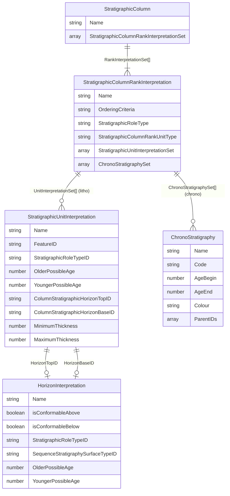
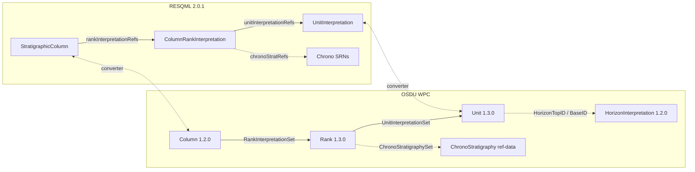
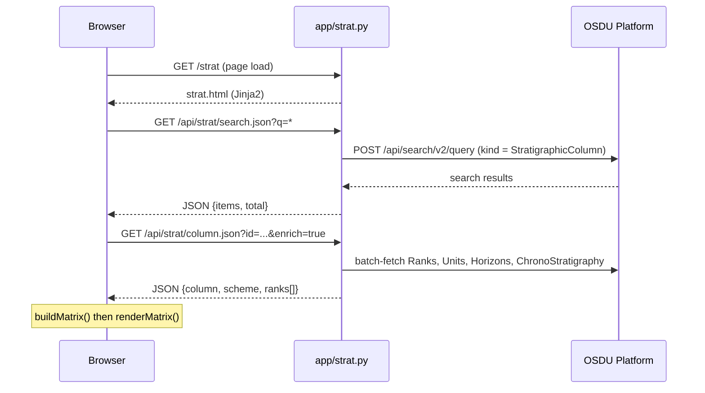
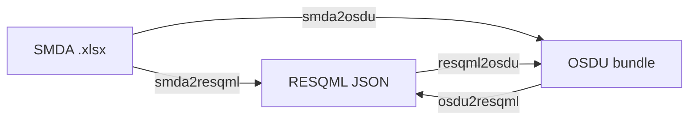

# Stratigraphic Column — Data Model, Mapping & Tooling

> Comprehensive reference for the **OSDU Stratigraphic Column** data model, how it relates to **RESQML 2.0.1**, **SMDA**, and **OpenWorks** source systems, and how to use the two tools that ship with this repository:
>
> | Tool | Location | Purpose |
> |------|----------|---------|
> | **Strat Column Viewer** | `app/templates/strat.html` | Interactive browser UI — search, render & inspect columns live from OSDU |
> | **Strat Column Converter** | `demo/strat/stratcolumnhandler.py` | CLI — round‑trip SMDA ↔ RESQML ↔ OSDU bundles |

---

## Table of Contents

1. [OSDU Stratigraphic Column Data Model](#1-osdu-stratigraphic-column-data-model)
2. [Units vs Horizons — Complementary Views](#2-units-vs-horizons)
3. [Chronostratigraphy vs Lithostratigraphy](#3-chronostratigraphy-vs-lithostratigraphy)
4. [Hierarchical Composition & Age](#4-hierarchical-composition--age)
5. [Source‑System Mapping (SMDA / OW → OSDU)](#5-source-system-mapping)
6. [Tool A — Strat Column Viewer (`strat.html`)](#6-tool-a--strat-column-viewer)
7. [Tool B — Strat Column Converter (CLI)](#7-tool-b--strat-column-converter-cli)
8. [Schema Links & References](#8-schema-links--references)

---

## 1) OSDU Stratigraphic Column Data Model

### 1.1 Core Entities

The OSDU Stratigraphy model is a **three‑level hierarchy**: a *Column* owns an ordered set of *Ranks*, and each Rank owns an ordered set of either *Units* (litho / bio) or *Chrono reference‑data items* (chrono).

| Entity (OSDU kind) | Version | Semantic role |
|---------------------|---------|---------------|
| `work-product-component--StratigraphicColumn` | 1.2.0 | The column itself — ordered list of Rank references |
| `work-product-component--StratigraphicColumnRankInterpretation` | 1.3.0 | One rank level (e.g. "System", "Group") — owns **either** units **or** chrono refs |
| `work-product-component--StratigraphicUnitInterpretation` | 1.3.0 | A rock‑body **interval** with age range, lithology, colour, optional horizon boundaries |
| `work-product-component--HorizonInterpretation` | 1.2.0 | A **boundary surface** between units (conformability, sequence‑strat surface type) |
| `reference-data--ChronoStratigraphy` | 1.0.0 / 1.1.0 | ICS time‑scale entry: Code, AgeBegin (Ma), AgeEnd (Ma), Colour, hierarchy via Code path |

### 1.2 Relationship Diagram



### 1.3 Rank XOR Constraint

> **CRITICAL**: The Rank schema enforces a mutual exclusion —
> *"Only one of `ChronoStratigraphySet` or `StratigraphicUnitInterpretationSet` must be populated, **never both**."*
> — OSDU E‑R StratigraphicColumnRankInterpretation.1.3.0

This means a single Rank is either **chrono** (pointing to `reference-data--ChronoStratigraphy` SRNs) or **litho/bio** (pointing to `StratigraphicUnitInterpretation` WPC records). A column can contain both kinds of Ranks.

### 1.4 Example — Hierarchical Chrono Column as Coloured Table

Below is a simplified **ICS Chronostratigraphic** column (Phanerozoic excerpt) —
the same layout the viewer produces from OSDU data.
Higher‑rank cells span multiple rows; each cell carries the ICS official colour.

| Age (Ma) | Eonothem | Erathem | System | Series | Stage |
|----------|----------|---------|--------|--------|-------|
| 538.8 | 🟦 Phanerozoic | 🟫 Paleozoic | 🟩 Cambrian | Terreneuvian | Fortunian |
| 529 | ↕ | ↕ | ↕ | ↕ | Stage 2 |
| 521 | ↕ | ↕ | ↕ | Stage 2 | Stage 3 |
| 514 | ↕ | ↕ | ↕ | ↕ | Stage 4 |
| 509 | ↕ | ↕ | ↕ | Miaolingian | Wuliuan |
| 504.5 | ↕ | ↕ | ↕ | ↕ | Drumian |
| 500.5 | ↕ | ↕ | ↕ | ↕ | Guzhangian |
| 497 | ↕ | ↕ | ↕ | Furongian | Paibian |
| 494 | ↕ | ↕ | ↕ | ↕ | Jiangshanian |
| 489.5 | ↕ | ↕ | ↕ | ↕ | Stage 10 |
| 485.4 | ↕ | ↕ | 🟦 Ordovician | Lower | Tremadocian |

> **↕** = cell spans multiple rows (HTML `rowspan`).
> In the browser each cell is filled with the actual ICS hex colour from the `Colour` field of the ChronoStratigraphy record.

---

## 2) Units vs Horizons

Units and Horizons are **complementary** — they represent the same stratigraphy from two viewpoints:

| Aspect | StratigraphicUnitInterpretation | HorizonInterpretation |
|--------|--------------------------------|----------------------|
| **Geometry** | Volume / interval (rock body) | Surface / boundary |
| **Time** | Age **range**: `OlderPossibleAge` → `YoungerPossibleAge` | Single age point: `MeanPossibleAge` |
| **Feature reference** | `FeatureID` → `RockVolumeFeature` | `FeatureID` → `BoundaryFeature` |
| **Properties** | Thickness, lithology, depositional env | Conformability (above / below), seq‑strat surface type |
| **Domain question** | "What rock exists in this interval?" | "What event happened at this boundary?" |
| **Rank relationship** | Listed in `StratigraphicUnitInterpretationSet[]` on the Rank | **Not listed on the Rank** — linked FROM individual Units via `ColumnStratigraphicHorizonTopID` / `BaseID` |
| **RESQML type** | `resqml20.obj_StratigraphicUnitInterpretation` | `resqml20.obj_HorizonInterpretation` |

> **Key insight**: the Rank schema has **no** `HorizonInterpretationSet`.
> Horizons are not independently organized at the rank level — they are optional denormalized boundary references attached to individual Units.

### 2.1 When to Use Which

| Use case | Data source |
|----------|-------------|
| Column **block chart** visualization | Units (intervals with rowspan, coloured blocks) |
| Well‑marker correlation | Horizons (boundary picks at surfaces) |
| Sequence stratigraphy events | Horizons (`SequenceStratigraphySurfaceTypeID`: flooding, ravinement, MFS) |
| Combined view | Units = blocks; horizons = conformability / unconformity lines between blocks |

### 2.2 Implementation Status

| Feature | strat.html viewer | stratcolumnhandler.py converter | 10genhorizons.py generator |
|---------|-------------------|--------------------------------|----------------------------|
| Unit interval rendering | ✅ Rowspan‑merged coloured blocks | ✅ Round‑trips units through all formats | — |
| Horizon boundary overlay | ✅ Synthetic "Top X" / "Base X" labels at row edges | ❌ Does not emit/consume `HorizonInterpretation` | ✅ Generates `HorizonInterpretation` WPCs |
| `ColumnStratigraphicHorizonTopID` / `BaseID` | ✅ Read and displayed (real or synthetic) | ❌ Not populated | ✅ Sets both fields on every unit |
| `OlderPossibleAge` / `YoungerPossibleAge` on units | ✅ Read via multi‑field fallback | ❌ Not populated | ✅ Copies from linked ChronoStratigraphy ages |

> **Synthetic horizon labels**: When real `HorizonInterpretation` records are not deployed, the viewer synthesizes boundary labels from unit/chrono names (e.g. "Top Maastrichtian", "Base Cenozoic"). These carry a `_synth: true` marker client‑side.

---

## 3) Chronostratigraphy vs Lithostratigraphy

| Dimension | Chronostratigraphy | Lithostratigraphy |
|-----------|-------------------|-------------------|
| **Classified by** | Time (geological age) | Rock character (lithology) |
| **Rank hierarchy** | Eonothem → Erathem → System → Series → Stage → Sub‑Stage | Supergroup → Group → Formation → Member → Bed |
| **OSDU rank content** | `ChronoStratigraphySet[]` → `reference-data` SRNs | `StratigraphicUnitInterpretationSet[]` → WPC records |
| **Age source** | `data.AgeBegin` / `data.AgeEnd` (Ma) on chrono ref‑data | `data.OlderPossibleAge` / `data.YoungerPossibleAge` (Ma) on Unit WPC |
| **Hierarchy encoded in** | `Code` path (e.g. `Ph.Mz.K.UK.Ma`) — depth = rank level | `strat_unit_level` (SMDA) or parent/child naming |
| **Colour** | Official ICS `Colour` hex on chrono record | Custom `color_html` on unit (via VendorMetadata) |
| **Scope** | Global reference scheme (ICS) | Local to a field / basin |
| **Viewer behaviour** | Auto‑decomposition of flat rank by Code depth | One rank per `strat_unit_level`; colours from unit metadata |

### 3.1 Age Semantics

```
Older (bigger Ma)  ←───  top_age / AgeBegin / OlderPossibleAge
                         ↕   duration of the unit / interval
Younger (smaller Ma) ←──  base_age / AgeEnd / YoungerPossibleAge
```

All ages in **Ma** (millions of years ago), positive values.
Convention: `OlderPossibleAge ≥ YoungerPossibleAge` (equivalently `AgeBegin ≥ AgeEnd`).

The **viewer** (`strat.html`) tries multiple field paths in priority order:

| Priority | Chrono record fields | Unit record fields |
|----------|---------------------|--------------------|
| 1 | `data.AgeBegin` / `data.AgeEnd` | `data.OlderPossibleAge` / `data.YoungerPossibleAge` |
| 2 | `data.TopMa` / `data.BaseMa` | `data.TimeRange.TopAgeMa` / `data.TimeRange.BaseAgeMa` |
| 3 | `data.AgeBeginMa` / `data.AgeEndMa` | `data.TopMa` / `data.BaseMa` |
| 4 | — | `data.VendorMetadata.Raw.TopAgeMa` / `.BaseAgeMa` |
| 5 | — | `data.VendorMetadata.Raw.top_age` / `.base_age` |

### 3.2 Colour Resolution

| Priority | Source |
|----------|--------|
| 1 | Chrono `data.Colour` (ICS hex, e.g. `#67C5CA`) |
| 2 | Unit `data.Rendering.ColorHtml` |
| 3 | Unit `data.VendorMetadata.Raw.ColorHtml` |
| 4 | Unit `data.VendorMetadata.Raw.color_html` |
| 5 | Rank palette fallback (pastel blue/orange/green/…) |

---

## 4) Hierarchical Composition & Age

### 4.1 Column → Rank → Unit / Chrono

```
StratigraphicColumn "ICS Chrono 2017"
  ├── Rank "Eonothem"  (chrono)  →  [Phanerozoic, Proterozoic, Archean, Hadean]
  ├── Rank "Erathem"   (chrono)  →  [Cenozoic, Mesozoic, Paleozoic, ...]
  ├── Rank "System"    (chrono)  →  [Quaternary, Neogene, ..., Cambrian]
  ├── Rank "Series"    (chrono)  →  [Holocene, Pleistocene, ..., Terreneuvian]
  └── Rank "Stage"     (chrono)  →  [Meghalayan, Northgrippian, ..., Fortunian]

StratigraphicColumn "Johan Sverdrup 2015"
  ├── Rank "Group"     (litho)   →  [Nordland Gp, Rogaland Gp, Shetland Gp, ...]
  └── Rank "Formation" (litho)   →  [Utsira Fm, Lista Fm, Sele Fm, ...]
```

### 4.2 Auto‑Decomposition of Flat Ranks

The ICS chronostratigraphy in OSDU often has a **single rank** with **all** chrono records (Eonothems through Stages mixed together). The viewer backend (`app/strat.py`) detects this when a rank has >10 units and splits it into **virtual sub‑ranks** based on the `Code` path depth:

| Code depth | Virtual rank name | Example Code |
|-----------|-----------|-------------|
| 1 | Eonothem | `Ph` (Phanerozoic) |
| 2 | Erathem | `Ph.Mz` (Mesozoic) |
| 3 | System | `Ph.Mz.K` (Cretaceous) |
| 4 | Series | `Ph.Mz.K.UK` (Upper Cretaceous) |
| 5 | Stage | `Ph.Mz.K.UK.Ma` (Maastrichtian) |
| 6 | Sub‑Stage | `Ph.Mz.K.UK.Ma.l` |

### 4.3 RESQML ↔ OSDU Structural Alignment



---

## 5) Source‑System Mapping

### 5.1 SMDA / OW → OSDU Field Mapping Table

| Source field (SMDA .xlsx / OW JSON) | OSDU target path | Notes |
|--------------------------------------|-----------------|-------|
| `strat_column_identifier` / `StratColumn.Name` | `StratigraphicColumn.data.Name` | Column display name |
| `strat_unit_level` | Determines which **Rank** the row belongs to | Groups rows: 1 = Group, 2 = Formation, etc. |
| `strat_column_type` / `StratColumn.Type` | Rank `kind` (chrono vs litho) | Contains "chronostrat" → chrono rank |
| `identifier` | `StratigraphicUnitInterpretation.data.Name` | Unit display name |
| `uuid` | Used in WPC record `id` construction | Optional; auto‑generated if absent |
| `top_age` (Ma) | `data.TimeRange.TopAgeMa` | Older boundary |
| `base_age` (Ma) | `data.TimeRange.BaseAgeMa` | Younger boundary |
| `strat_unit_parent` | `data.ParentName` | Hierarchy link |
| `color_html` | `data.Rendering.ColorHtml` | Display colour |
| `source` | `data.VendorMetadata.Raw.Source` | Provenance |
| `update_date` / `update_user` | `data.VendorMetadata.Raw.UpdateDate` / `.UpdateUser` | Audit trail |
| `insert_date` / `insert_user` | `data.VendorMetadata.Raw.InsertDate` / `.InsertUser` | Audit trail |

### 5.2 Mapping Configuration File

The converter supports a `--vendor-map` JSON file to control where vendor fields land.
Default file: `demo/strat/ow2osdu.map.json`

```json
{
  "$comment": "Vendor-to-OSDU field mapping for SMDA strat units.",
  "strat_unit_type": "data.StratigraphicRoleTypeID",
  "top_age":         "data.TimeRange.TopAgeMa",
  "base_age":        "data.TimeRange.BaseAgeMa",
  "color_html":      "data.Rendering.ColorHtml",
  "strat_unit_parent": "data.Relationships.Parent.Name",
  "source":          "data.Source",
  "uuid":            "data.Identifiers.UUID",
  "update_date":     "data.VendorMetadata.Raw.UpdateDate",
  "update_user":     "data.VendorMetadata.Raw.UpdateUser",
  "insert_date":     "data.VendorMetadata.Raw.InsertDate",
  "insert_user":     "data.VendorMetadata.Raw.InsertUser"
}
```

### 5.3 Vendor Metadata Strategy

All source fields from SMDA / OW are **always** preserved in `data.VendorMetadata.Raw` (or legacy `data.VendorMetadata.OW`), ensuring full round‑trip fidelity. The `--vendor-map` option **additionally** copies selected fields into structured OSDU paths:

```
SMDA row
  ├─→ data.VendorMetadata.Raw.*  (always: full copy of every source field)
  └─→ data.TimeRange.TopAgeMa    (via --vendor-map: structured copy)
```

### 5.4 ID Construction

Record IDs follow the OSDU pattern:

```
{partition}:work-product-component--{EntityType}:{SanitizedNameOrUUID}:
```

| Entity | Example ID |
|--------|-----------|
| Column | `data:work-product-component--StratigraphicColumn:JOHAN_SVERDRUP_2015:` |
| Rank | `data:work-product-component--StratigraphicColumnRankInterpretation:Formation:` |
| Unit | `data:work-product-component--StratigraphicUnitInterpretation:a8737968-86e7-...:` |

---

## 6) Tool A — Strat Column Viewer

**Location**: `app/templates/strat.html` (backend: `app/strat.py`)

### 6.1 Architecture



### 6.2 Visualization Algorithm

The viewer renders a **hierarchy‑based table** where each stratigraphic rank becomes a separate
table column and rows are defined by the **finest‑rank (leaf) units** in their natural order.
Higher‑rank cells span multiple leaf rows when the mapping shows they own those leaf units.
Age is annotated at row **boundaries** (not as the row axis), and horizon names are shown too.

**Mapping strategies** (tried in order):

**For ranks *before* the leaf** (coarser → leaf):

| # | Strategy | Applies when | Match rule |
|---|----------|--------------|------------|
| 1 | **Code prefix** | Chrono ranks with `Code` paths | Leaf `Ph.Mz.K.UK.Ma` → parent whose `Code` is a prefix → `Ph.Mz.K.UK` (Series) |
| 2 | **ParentName chain** | Litho ranks with `ParentName` on units | Walk `ParentName` links up through intermediate ranks until a match is found |
| 3 | **Age containment** | Both leaf and parent have age data | Parent age range fully contains leaf age range |
| 4 | **Positional fallback** | No other strategy matched | Distribute unassigned leaf units proportionally |

**For ranks *after* the leaf** (finer or misplaced — safety net):

| # | Strategy | Match rule |
|---|----------|------------|
| A | **Code prefix (child)** | Child's `Code` starts with leaf's `Code` |
| B | **Age containment (child)** | Child's age range fits within leaf's age range |
| C | **ParentName** | Child's `parentName` equals leaf unit's name |

**Steps:**

1. **Parse & deduplicate** — each rank's units, reading names, ages, Code, ParentName, colours, horizons
2. **Sort ranks** — backend sorts by unit count ascending (coarsest → finest); leaf = last rank
3. **Identify leaf rank** — last rank = finest granularity (most units); one row per leaf unit
4. **Map higher ranks** — for each rank above the leaf, assign each leaf row to a parent unit (strategies 1–4)
5. **Map lower ranks** — for any ranks after the leaf, assign child units (strategies A–C)
6. **Compute rowspan** — consecutive leaf rows with the same parent get merged (`rowSpan`)
7. **Render** — `<table>` with Boundary column + one column per rank; boundary column shows age (Ma) and/or horizon name at the top edge of each row

This algorithm works for **all column types**: chrono (ICS), litho (Group → Formation → Member), mixed, columns from SMDA/SCE with UUID‑based IDs, and columns lacking age data entirely.

**Resulting layout** (Phanerozoic chrono excerpt):

```
┌──────────┬────────────┬──────────┬──────────┬───────────┬──────────────┐
│ Boundary │ Eonothem   │ Erathem  │ System   │ Series    │ Stage        │
├──────────┼────────────┼──────────┼──────────┼───────────┼──────────────┤
│ 538.8 Ma │            │          │ Cambrian │Terreneuvian│ Fortunian    │
│ 529 Ma   │            │          │    ↕     │     ↕     │ Stage 2      │
│ 521 Ma   │            │          │    ↕     │ Stage 2   │ Stage 3      │
│ 514 Ma   │ Phanerozoic│ Paleozoic│    ↕     │     ↕     │ Stage 4      │
│ 509 Ma   │     ↕      │    ↕     │    ↕     │Miaolingian│ Wuliuan      │
│ 504.5 Ma │     ↕      │    ↕     │    ↕     │     ↕     │ Drumian      │
│ 500.5 Ma │     ↕      │    ↕     │    ↕     │     ↕     │ Guzhangian   │
│ 497 Ma   │     ↕      │    ↕     │    ↕     │ Furongian │ Paibian      │
│ 494 Ma   │     ↕      │    ↕     │    ↕     │     ↕     │ Jiangshanian │
│ 489.5 Ma │     ↕      │    ↕     │    ↕     │     ↕     │ Stage 10     │
│ 485.4 Ma │     ↕      │    ↕     │Ordovician│ Lower     │ Tremadocian  │
│ 477.7 Ma │     ↕      │    ↕     │    ↕     │     ↕     │ Floian       │
└──────────┴────────────┴──────────┴──────────┴───────────┴──────────────┘
```

**Lithostratigraphic layout** (no numeric ages — hierarchy via ParentName):

```
┌──────────┬─────────────────┬────────────────────┐
│ Boundary │ Group            │ Formation           │
├──────────┼─────────────────┼────────────────────┤
│          │                 │ Utsira Fm           │
│          │ Nordland Gp     │ Hordaland Fm        │
│          │       ↕         │ Balder Fm           │
│          │ Rogaland Gp     │ Sele Fm             │
│          │       ↕         │ Lista Fm            │
│          │ Shetland Gp     │ Ekofisk Fm          │
│          │       ↕         │ Tor Fm              │
└──────────┴─────────────────┴────────────────────┘
```

> **↕** = cell merged via `rowSpan`.
> Boundary column is empty when ages are unavailable — the table still renders correctly.

### 6.3 Key JavaScript Functions

| Function | Purpose |
|----------|---------|
| `readChronoAges(cd)` | Extract `AgeEnd`→top, `AgeBegin`→base from chrono record (with fallbacks) |
| `readLithoAges(ud)` | Extract ages from unit — `YoungerPossibleAge`→top, `OlderPossibleAge`→base — full fallback chain through `TimeRange`, `VendorMetadata.Raw` |
| `agesFor(unit, chrono, horizonTop, horizonBase)` | Merge chrono + litho + horizon ages (chrono preferred when both present) |
| `buildMatrix(model)` | Hierarchy‑based: leaf‑rank rows, higher ranks mapped via Code/ParentName/age/position; also maps ranks after the leaf via child strategies; synthetic horizon labels |
| `renderMatrix(matrix)` | Emit `<table>` with Boundary column (age + horizon), `rowSpan` cells, colours |
| `renderLegend(ranks)` | Colour legend per rank |
| `loadColumnById(id)` | Fetch column JSON, detect `missingRanks`, show diagnostics, call buildMatrix→renderMatrix |
| `doSearch()` | Search for columns via `/api/strat/search.json?q=...&limit=100` |

### 6.4 Features

- **Hierarchy‑based rendering**: rows defined by leaf units, not by age intervals — works for both chrono and litho columns, even without age data
- **Boundary annotations**: age (Ma) and/or horizon names shown at cell edges when available
- **Synthetic horizon labels**: when real `HorizonInterpretation` records are not deployed, the frontend synthesizes "Top X" / "Base X" labels from unit/chrono names
- **Search**: full‑text or field query (`data.Name:Gudrun`, `*`) via OSDU Search API (default limit 100)
- **Enrich toggle**: fetch `ChronoStratigraphy` details (names, ages, colours) or view raw references only
- **Horizon support**: backend fetches `HorizonInterpretation` records referenced by `ColumnStratigraphicHorizonTopID`/`BaseID` on units
- **Auto‑decomposition**: flat chrono ranks with >10 units split into virtual hierarchical sub‑ranks by `Code` depth
- **Rank sorting**: final ranks sorted by unit count ascending (coarsest → finest) ensuring the leaf is always last
- **Post‑leaf mapping**: ranks appearing after the leaf (finer or misplaced) get mapped via child‑code, age‑containment, and ParentName strategies
- **Deduplication**: duplicate chrono/unit refs (common in ICS schemes) are filtered
- **Colour cascade**: ICS hex → unit `Rendering.ColorHtml` → `VendorMetadata.Raw` → rank palette
- **Metadata panel**: filterable, sortable key/value table of all record metadata
- **Tooltips**: hover any cell → unit name, age range, record IDs
- **Trailing‑colon resilience**: OSDU references often end with `:` (latest‑version marker). `_storage_fetch_many` automatically retries with/without the trailing colon when a record returns 404, and aliases both forms in results
- **Missing‑rank diagnostics**: when rank records are 404 (common with SMDA/SCE 3rd‑party columns), the API returns a `missingRanks` array and the UI shows a warning message

### 6.5 Generation & Deployment Pipeline

The ICS 2017 Chronostratigraphic Column is built and deployed through a chain of Python scripts. Each step is idempotent and can be re-run safely.

```mermaid
graph LR
    A["7genchronostratics.py"] -->|manifest_chronostratics.json| B["7genstratcolumn.py"]
    B -->|manifest_stratcolumn.json| C["10genhorizons.py"]
    C -->|manifest_stratcolumn.json<br>(updated in-place)| D["8deploy_stratcolumn.py"]
    A -->|manifest_chronostratics.json| E["9deploy_chronostratics.py"]
    D -->|stratcolumn_records/| F["OSDU Storage"]
    E -->|chronostrat_records/| F
```

**Step-by-step:**

```powershell
# 1. Generate ChronoStratigraphy reference-data manifest
#    Downloads ICS ChronoStratigraphy.1.json from GitHub, deduplicates, emits manifest
py .\demo\py\7genchronostratics.py --include-scheme --verbose

# 2. Build Stratigraphic Column manifest (units + ranks + column)
#    Reads manifest_chronostratics.json, groups by rank, emits WPC manifest
py .\demo\py\7genstratcolumn.py `
    --in-manifest .\demo\strat\manifest_chronostratics.json `
    --out .\demo\strat\manifest_stratcolumn.json `
    --include-scheme --verbose

# 3. Generate HorizonInterpretation records and enrich units
#    Reads both manifests, creates 118 horizons, updates units with ages + horizon refs
py .\demo\py\10genhorizons.py --verbose

# 4. Deploy chrono reference-data to OSDU (dependency-ordered)
py .\demo\py\9deploy_chronostratics.py --ingest --verbose

# 5. Deploy strat column records to OSDU
py .\demo\py\8deploy_stratcolumn.py --ingest --verbose
```

| Script | Input | Output | Records |
|--------|-------|--------|---------|
| `7genchronostratics.py` | ChronoStratigraphy.1.json (remote/local) | `manifest_chronostratics.json` | ~1372 ChronoStratigraphy ref-data |
| `7genstratcolumn.py` | `manifest_chronostratics.json` | `manifest_stratcolumn.json` | 179 units + 5 ranks + 1 column |
| `10genhorizons.py` | Both manifests | Updates `manifest_stratcolumn.json` in-place | +118 HorizonInterpretation WPCs |
| `8deploy_stratcolumn.py` | `manifest_stratcolumn.json` | `stratcolumn_records/` (one JSON per record) | 303 files |
| `9deploy_chronostratics.py` | `manifest_chronostratics.json` | `chronostrat_records/` (one JSON per record) | ~1372 files |

---

## 7) Tool B — Strat Column Converter (CLI)

**Location**: `demo/strat/stratcolumnhandler.py`

### 7.1 In‑Memory Model

```python
@dataclass
class StratUnit:
    name: str                          # display name
    uuid: str                          # stable identifier
    level: Optional[int]               # rank grouping key (from SMDA)
    top_age_ma: Optional[float]        # older boundary (Ma)
    base_age_ma: Optional[float]       # younger boundary (Ma)
    parent_name: Optional[str]         # parent unit name (hierarchy)
    color_html: Optional[str]          # display colour (#RRGGBB)
    vendor: Dict[str, Any]             # all raw vendor fields (round‑trip safe)

@dataclass
class StratRank:
    name: str                          # rank label ("Formation", "System", …)
    kind: str                          # 'litho' | 'chrono'
    level: Optional[int]
    ordering: str                      # "OlderToYounger" (default)
    units: List[StratUnit]             # for litho ranks
    chrono_names: List[str]            # for chrono ranks (names or SRNs)

@dataclass
class StratColumn:
    name: str
    ranks: List[StratRank]
    vendor: Dict[str, Any]
```

### 7.2 Supported Conversions



### 7.3 CLI Usage

```bash
# 1) SMDA → RESQML JSON graph
python stratcolumnhandler.py smda2resqml \
    --xlsx smda-api_strat-units.xlsx --sheet ApiStratUnit \
    -o strat.resqml.json \
    --chrono-refdata chrono_catalog.json

# 2) SMDA → OSDU WPC bundle
python stratcolumnhandler.py smda2osdu \
    --xlsx smda-api_strat-units.xlsx --sheet ApiStratUnit \
    --partition data \
    -o strat.osdu.json \
    --vendor-map ow2osdu.map.json \
    --chrono-refdata chrono_catalog.json

# 3) RESQML → OSDU
python stratcolumnhandler.py resqml2osdu \
    --resqml-json strat.resqml.json \
    --partition data \
    -o strat.osdu.json

# 4) OSDU → RESQML
python stratcolumnhandler.py osdu2resqml \
    --manifest strat.osdu.json \
    -o roundtrip.resqml.json
```

### 7.4 Input Formats

| Format | Reader method | Expected shape |
|--------|--------------|----------------|
| SMDA .xlsx | `StratColumn.from_smda_xlsx()` | Sheet `ApiStratUnit` with columns: `identifier`, `uuid`, `strat_unit_level`, `top_age`, `base_age`, `color_html`, `strat_column_type`, `strat_column_identifier` |
| OW JSON | Pipeline from SMDA reader | `{"StratColumn": {"Name":…, "Type":…}, "Units": [{…}]}` |
| RESQML JSON | `StratColumn.from_resqml_json()` | Array of `{resqmlType, uuid, title, …}` objects |
| OSDU bundle | `StratColumn.from_osdu_bundle()` | `{"records": [{id, kind, data}]}` |

### 7.5 Output — OSDU Bundle Example (litho)

```json
{
  "records": [
    {
      "id": "data:work-product-component--StratigraphicUnitInterpretation:Roedby_Fm.:",
      "kind": "osdu:wks:work-product-component--StratigraphicUnitInterpretation:1.3.0",
      "data": {
        "Name": "Roedby Fm.",
        "TimeRange": { "TopAgeMa": 95.0, "BaseAgeMa": 110.0 },
        "ParentName": "CROMER KNOLL GP.",
        "Rendering": { "ColorHtml": "#006dff" },
        "VendorMetadata": { "SourceSystem": "SMDA", "Raw": { "source": "SCE" } }
      }
    },
    {
      "id": "data:work-product-component--StratigraphicColumnRankInterpretation:Formation:",
      "kind": "osdu:wks:work-product-component--StratigraphicColumnRankInterpretation:1.3.0",
      "data": {
        "Name": "Formation",
        "OrderingCriteria": "OlderToYounger",
        "StratigraphicUnitInterpretationSet": [
          "data:work-product-component--StratigraphicUnitInterpretation:Roedby_Fm.:"
        ]
      }
    },
    {
      "id": "data:work-product-component--StratigraphicColumn:JOHAN_SVERDRUP_2015:",
      "kind": "osdu:wks:work-product-component--StratigraphicColumn:1.2.0",
      "data": {
        "Name": "JOHAN SVERDRUP 2015",
        "StratigraphicColumnRankInterpretationSet": [
          "data:work-product-component--StratigraphicColumnRankInterpretation:Group:",
          "data:work-product-component--StratigraphicColumnRankInterpretation:Formation:"
        ]
      }
    }
  ]
}
```

### 7.6 Output — RESQML JSON Graph Example

```json
[
  {
    "resqmlType": "resqml20:StratigraphicUnitInterpretation",
    "uuid": "a8737968-86e7-495e-82c8-84049c2e80e7",
    "title": "Roedby Fm.",
    "topAgeMa": 95,
    "baseAgeMa": 110,
    "parentName": "CROMER KNOLL GP.",
    "colorHtml": "#006dff",
    "extraMetadata": { "vendor": { "source": "SCE" } }
  },
  {
    "resqmlType": "resqml20:StratigraphicColumnRankInterpretation",
    "uuid": "Formation",
    "title": "Formation",
    "orderingCriteria": "OlderToYounger",
    "unitInterpretationRefs": [
      { "uuid": "a8737968-...", "contentType": "resqml20:StratigraphicUnitInterpretation" }
    ]
  },
  {
    "resqmlType": "resqml20:StratigraphicColumn",
    "uuid": "JOHAN_SVERDRUP_2015",
    "title": "JOHAN SVERDRUP 2015",
    "rankInterpretationRefs": [
      { "uuid": "Group", "contentType": "resqml20:StratigraphicColumnRankInterpretation" },
      { "uuid": "Formation", "contentType": "resqml20:StratigraphicColumnRankInterpretation" }
    ]
  }
]
```

### 7.7 Validation Rules

| Rule | Enforcement |
|------|------------|
| **Rank XOR** | Each rank has `ChronoStratigraphySet` OR `StratigraphicUnitInterpretationSet`, never both |
| **Chrono resolution** | Unresolved names fail fast unless `--chrono-refdata` is provided |
| **Ordering** | Units sorted older → younger by `(top_age, base_age, name)` |
| **Deduplication** | Duplicate unit IDs within a rank are removed (import and export) |
| **Round‑trip** | All source fields preserved: `VendorMetadata.Raw` (OSDU) / `extraMetadata.vendor` (RESQML) |

### 7.8 Common Error Messages

| Message | Resolution |
|---------|-----------|
| `Chrono name '…' requires --chrono-refdata` | Supply ChronoStratigraphy reference bundle(s) |
| `OpenWorks JSON must contain 'StratColumn' and 'Units'` | Input shape mismatch |
| `Unsupported OSDU payload shape` | Input must be a bundle, single WPC, or bare `data` |
| `No data rows in SMDA sheet` | Empty or incorrect sheet / columns |

---

## 8) Schema Links & References

### 8.1 OSDU Schema Documentation (E‑R)

| Entity | E‑R link |
|--------|----------|
| StratigraphicColumn 1.2.0 | [E‑R doc](https://github.com/jonslo/osdu-data-data-definitions/blob/master/E-R/work-product-component/StratigraphicColumn.1.2.0.md) |
| StratigraphicColumnRankInterpretation 1.3.0 | [E‑R doc](https://github.com/jonslo/osdu-data-data-definitions/blob/master/E-R/work-product-component/StratigraphicColumnRankInterpretation.1.3.0.md) |
| StratigraphicUnitInterpretation 1.3.0 | [E‑R doc](https://github.com/jonslo/osdu-data-data-definitions/blob/master/E-R/work-product-component/StratigraphicUnitInterpretation.1.3.0.md) |
| HorizonInterpretation 1.2.0 | [E‑R doc](https://github.com/jonslo/osdu-data-data-definitions/blob/master/E-R/work-product-component/HorizonInterpretation.1.2.0.md) |
| ChronoStratigraphy 1.0.0 | [E‑R doc](https://github.com/jonslo/osdu-data-data-definitions/blob/master/E-R/reference-data/ChronoStratigraphy.1.0.0.md) |

### 8.2 OSDU Worked Examples

| Example | Link |
|---------|------|
| Stratigraphy README | [Worked Example](https://community.opengroup.org/osdu/data/data-definitions/-/blob/v0.14.0/Examples/WorkedExamples/Reservoir%20Data/Stratigraphy/README.md) |
| ChronoStratigraphySets (System rank) | [JSON](https://github.com/jonslo/osdu-data-data-definitions/blob/master/Examples/WorkedExamples/Reservoir%20Data/Stratigraphy/ChronoStratigraphySets/ColumnRankInterpretationSystem.json) |

### 8.3 Energistics RESQML

| Resource | Link |
|----------|------|
| RESQML 2.0.1 Overview | [Energistics](https://docs.energistics.org/RESQML/RESQML_TOPICS/RESQML-000-000-titlepage.html) |

### 8.4 Repository Files

| File | Purpose |
|------|---------|
| `app/strat.py` | FastAPI backend — search, batch‑fetch, trailing‑colon handling, decompose, rank sort, serve column JSON |
| `app/templates/strat.html` | Frontend viewer — hierarchy‑based rendering, synthetic horizons, post‑leaf mapping, missing‑rank diagnostics |
| `demo/strat/stratcolumnhandler.py` | CLI converter — SMDA ↔ RESQML ↔ OSDU round‑trip |
| `demo/strat/ow2osdu.map.json` | Vendor → OSDU field mapping config |
| `demo/strat/manifest_stratcolumn.json` | StratigraphicColumn manifest (179 units + 118 horizons + 5 ranks + 1 column) |
| `demo/strat/manifest_chronostratics.json` | ChronoStratigraphy reference bundle (1372 records) |
| `demo/py/7genchronostratics.py` | Generator — downloads/filters ChronoStratigraphy reference records, emits manifest |
| `demo/py/7genstratcolumn.py` | Generator — builds column manifest (units + ranks + column) from chrono manifest |
| `demo/py/10genhorizons.py` | Generator — creates `HorizonInterpretation` WPCs from unit boundaries; updates unit records with ages + horizon refs |
| `demo/py/8deploy_stratcolumn.py` | Deploy — splits strat column manifest into individual records, optionally ingests via osducli |
| `demo/py/9deploy_chronostratics.py` | Deploy — splits chrono manifest into individual records in dependency order, optionally ingests |
| `demo/py/7manifest2records.py` | Utility — extracts individual record JSON files from any manifest |
| `demo/strat/stratcolumn_records/` | Pre‑generated OSDU WPC records (ICS 2017) |
| `demo/strat/stratref_records/` | Pre‑generated ChronoStratigraphy reference records |

---

## Appendix A — Code Issues Found & Fixed

### A.1 `app/strat.py` — Fixed in this session

| # | Issue | Severity | Fix |
|---|-------|----------|-----|
| 1 | `import asyncio` placed mid‑file (line 125) with stale comment | Minor | Moved to top‑level imports |
| 2 | `_ids()` defined **twice** (line 56 and line 128); second silently shadowed first | Moderate | Removed duplicate; kept original using `_as_id()` helper |
| 3 | `httpx.AsyncClient(http2=True)` crashes without `h2` package | Moderate | Added graceful probe — falls back to HTTP/1.1 |

### A.2 `app/templates/strat.html` — Fixed in this session

| # | Issue | Severity | Fix |
|---|-------|----------|-----|
| 4 | `readLithoAges()` missed `TimeRange.TopAgeMa`, `VendorMetadata.Raw.*` fields | Moderate | Added full fallback chain matching converter output paths |
| 5 | Litho unit **colour** ignored (`Rendering.ColorHtml`, `VendorMetadata.Raw.ColorHtml`, `color_html`) | Moderate | Added colour fallback chain after chrono `Colour` |

### A.3 Redesign — hierarchy‑based rendering

| # | Scope | Change |
|---|-------|--------|
| 6 | `strat.py` | Backend now fetches `HorizonInterpretation` records linked from units (`ColumnStratigraphicHorizonTopID`/`BaseID`), attaches them to unit entries |
| 7 | `strat.html` `buildMatrix()` | **Rewritten**: rows = leaf‑rank units (not age intervals); higher ranks mapped via Code prefix → ParentName chain → age containment → positional fallback |
| 8 | `strat.html` `renderMatrix()` | **Rewritten**: Boundary column shows age (Ma) + horizon names at row edges; works for litho columns without ages |

### A.4 Trailing‑colon fix & rank ordering

| # | Scope | Change |
|---|-------|--------|
| 27 | `strat.py` `_storage_fetch_many()` | **Trailing‑colon resilience**: OSDU references end with `:` (latest‑version marker) but some stored record IDs omit it, and vice versa. After each fetch round (batch or GET), aliases both `id` and `id:` forms in results. On 404, retries with the toggled variant. This fixed all 36 columns (was previously only working for ICS2017). |
| 28 | `strat.py` | **Rank sorting**: after merge/decomposition, ranks sorted by unit count ascending (coarsest → finest), ensuring the leaf is always the last rank |
| 29 | `strat.html` `buildMatrix()` | **Post‑leaf mapping**: added mapping for ranks after the leaf index using child‑code prefix, age containment, and ParentName strategies — fixes Sub‑Stage, Series, SubSystem being empty |
| 30 | `strat.py` | `missingRanks` field added to API response when rank records return 404; frontend shows warning |
| 31 | `strat.html` | **Synthetic horizon labels**: when no real `HorizonInterpretation` records exist, synthesizes "Top X" / "Base X" from unit/chrono names with `_synth: true` marker |
| 32 | `strat.py` | Search default limit changed from 20 to 100 |
| 33 | `strat.py` | Debug endpoint `/api/strat/record.json` for single‑record inspection (encoded + plain URL) |

### A.5 New generator scripts

| # | Script | Purpose |
|---|--------|---------|
| 34 | `demo/py/10genhorizons.py` | Generates 118 `HorizonInterpretation` WPC records from ICS2017 unit boundaries. Updates unit records in‑place with `OlderPossibleAge`, `YoungerPossibleAge`, `ColumnStratigraphicHorizonTopID`, `ColumnStratigraphicHorizonBaseID`. |
| 35 | `demo/py/8deploy_stratcolumn.py` | Splits `manifest_stratcolumn.json` into individual record files in `stratcolumn_records/`, optionally ingests via `osducli storage add` |
| 36 | `demo/py/9deploy_chronostratics.py` | Splits `manifest_chronostratics.json` in dependency order (scheme → roots → children → WPC), optionally ingests |

### A.6 Previously Fixed (prior session)

| # | Scope | Summary |
|---|-------|---------|
| 9–22 | `stratcolumnhandler.py` | 14 issues fixed (2 critical round‑trip age loss, 4 moderate, 8 minor) |
| 23 | `ow2osdu.map.json` | Added `$comment`, audit fields; deleted duplicate file |
| 24 | `7genstratcolumn.py` | Added deduplication on chrono input and unit output |
| 25 | `strat.py` (backend) | Added `seen_uids` dedup + auto‑decomposition of flat ranks |
| 26 | `strat.html` (frontend) | Original `buildMatrix`/`renderMatrix` with age‑based rowspan merging and ICS colours |
