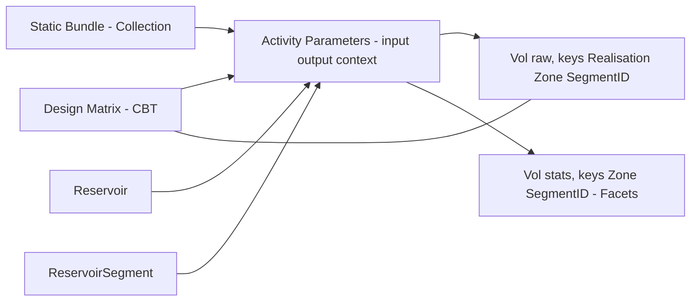
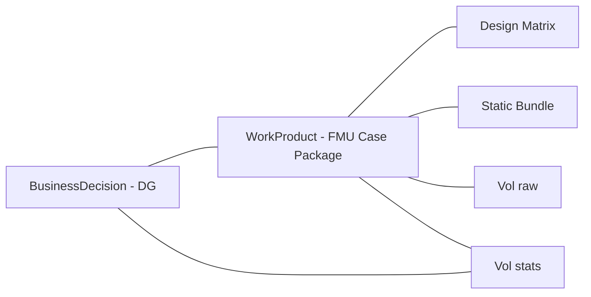
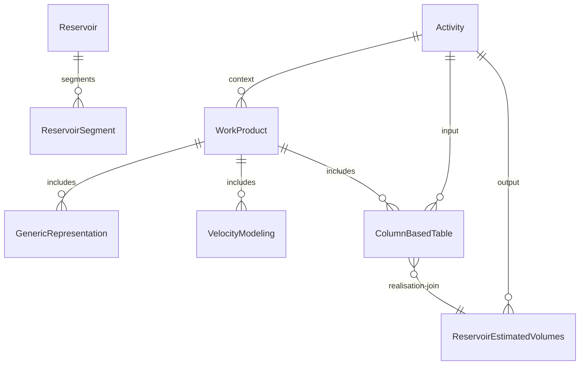

# Uncertainty (FMU) in OSDU

> **Purpose**: Persist FMU ensemble / Monte Carlo **inputs**, **scenarios**, and **outputs** in OSDU; link **input design and static bundles** to **output volumes** by **Realisation**; use **Activity semantics** and **persisted collections** for robust provenance across DG1…DG4.
>
> **Prerequisites**: [FMU → OSDU strategy](/howto/fmu-osdu) (ERT/fmu-dataio/Sumo context and data model mapping) · [Volumes](/howto/volumes) (REV schema, column mapping, JSON examples)

---

## 1. OSDU data model building blocks

### 1.1 Master‑data (anchors for scope)
- `master-data--Reservoir` - the reservoir entity of interest.  
- `master-data--ReservoirSegment` - segments or compartments under the reservoir.  
*Why:* `ReservoirEstimatedVolumes` is scoped by `ParentObjectID` to Field/Reservoir/ReservoirSegment.

### 1.2 Reference‑data (governed catalogs)
- **Units**: `reference-data--UnitOfMeasure` (e.g., `m3`, `Mm3`).  
- **Statistics facets**: `reference-data--FacetType:statistics`, `reference-data--FacetRole:{P10,P50,P90,ArithmeticMean,Minimum,Maximum,StandardDeviation}`.  
- **Canonical volume property types**: `reference-data--ReservoirEstimatedVolumePropertyType:{Bulk,Net,Pore,HydrocarbonPore,Oil,AssociatedGas}`.

### 1.3 Work‑product components (WPCs)
- **Design Matrix** - `work-product-component--ColumnBasedTable` (CBT).  
- **Static bundles** - grids, properties, velocity as WPCs (e.g., `GenericRepresentation`, `VelocityModeling`).  
- **Output volumes** - `work-product-component--ReservoirEstimatedVolumes` (REV), raw per‑realisation and aggregated statistics.  
- **Optional KPIs** - `work-product-component--ColumnBasedTable` for generic KPI/time series.

### 1.4 Collections for scenarios/cases
- **WorkProduct** - versioned case package (design + static bundle + chosen outputs).  
- **CollaborationProjectCollection** - curated working set while iterating.

### 1.5 Activity semantics (`AbstractProjectActivity`)
Use `Parameters[]` with `ParameterRole = input|output|context` and `ObjectParameterKey` to enumerate run inputs/outputs and context. Keys (e.g., `realisation-index`, `seed`) keep the mapping explicit.

---

## 2. Inputs - Design & static state

### 2.1 Design Matrix (CBT)
**Recommended schema pattern**:
- **KeyColumns**: `CaseID:string`, `Realisation:integer`, `Seed:integer` (optional).  
- **Columns**: parameter vector per row (e.g., `KxMultiplier:number`, `RelPermFamily:string`, `NTG_Shift:number`, …); use UCUM units in column metadata where relevant.  
- **Linkage**: referenced from Activities (run records) and joined to raw REV on `Realisation`.

**Example (excerpt)**:
```json
{
  "kind": "osdu:wks:work-product-component--ColumnBasedTable:1.3.0",
  "data": {
    "Name": "FMU Design Matrix - Case A",
    "KeyColumns": [
      {"ColumnName": "CaseID", "ColumnRole": "Key", "ValueType": "string"},
      {"ColumnName": "Realisation", "ColumnRole": "Key", "ValueType": "integer"},
      {"ColumnName": "Seed", "ColumnRole": "Key", "ValueType": "integer"}
    ],
    "Columns": [
      {"ColumnName": "KxMultiplier", "ValueType": "number"},
      {"ColumnName": "RelPermFamily", "ValueType": "string"}
    ]
  }
}
```

### 2.2 Static inputs (grids, properties, velocity)
Represent each artifact as a WPC and group the choice for a scenario into **one id**:
- **WorkProduct** = stable case package for DG usage.  
- **CollaborationProjectCollection** = flexible working set during model development.

---

## 3. Run bookkeeping with Activity parameters
For each run/iteration, create an Activity (or reuse `BusinessDecision` parameters if the run feeds a gate):
- **Parameters[] / input**: Design Matrix row (`realisation-index`), static bundle (WorkProduct/Collection), simulator deck/model.  
- **Parameters[] / output**: raw REV (this realisation), aggregate REV (per zone/segment).  
- **Parameters[] / context**: reservoir and segments; case collection.

**Example (schematic)**:
```json
{
  "Parameters": [
    {"Title": "Design row", "ParameterRole": "input",
     "Keys": [{"ParameterKey": "realisation-index", "StringParameterKey": "42"}],
     "ObjectParameterKey": "dev:work-product-component--ColumnBasedTable:design-matrix:1"},
    {"Title": "Static bundle", "ParameterRole": "input",
     "ObjectParameterKey": "dev:work-product--WorkProduct:caseA-static:3"},
    {"Title": "Raw volumes", "ParameterRole": "output",
     "Keys": [{"ParameterKey": "realisation-index", "StringParameterKey": "42"}],
     "ObjectParameterKey": "dev:work-product-component--ReservoirEstimatedVolumes:raw-42:1"},
    {"Title": "Aggregate volumes", "ParameterRole": "output",
     "ObjectParameterKey": "dev:work-product-component--ReservoirEstimatedVolumes:stats:5"}
  ]
}
```

**Naming keys**: use `realisation-index`, `seed`, `case-id` consistently; prefer camelCase or kebab‑case; avoid spaces.

---

## 4. Outputs - Volumes

### 4.1 Raw per‑realisation (REV)
Keys: `Realisation`, `Zone`, `SegmentID` (with `KindID = master-data--ReservoirSegment:2.0.0`).  
Columns: `Bulk`, `Net`, `Pore`, `HydrocarbonPore`, `Oil`, `AssociatedGas` — each with `PropertyTypeID` and `UnitOfMeasureID: m3`.

### 4.2 Aggregated statistics (REV)
Keys: `Zone`, `SegmentID` (no Realisation — aggregated across runs).  
Columns: dot notation `<Property>.<Statistic>` — e.g. `Bulk.P10`, `Oil.ArithmeticMean`.  
Each column carries `FacetIDs` with `FacetType:statistics` + `FacetRole:<P10|P50|P90|ArithmeticMean|...>`.

> See [Volumes](/howto/volumes) for full JSON examples of both raw and aggregated REV records, column mapping from fmu-dataio, and naming conventions.

---

## 5. Realisation mapping - keeping provenance tight
- **Join on keys**: raw REV `Realisation` ↔ Design Matrix row `Realisation`.  
- **Activity link**: the run Activity carries both the **design row** and the **raw REV output** with the same `realisation-index` key in `Parameters[]`.  
- **Case binding**: WorkProduct/Collection id referenced as `context` to bind the scenario.

---

## 6. Mermaid diagrams - no parentheses in labels

### 6.1 Data flow


### 6.2 Case packaging and DG alignment


### 6.3 Entities and relations


---

## 7. Conventions and tips
- **Column names**: use dot notation for statistics; avoid spaces and parentheses in labels.  
- **Keys**: always include `Realisation` in raw outputs; keep `SegmentID` aligned to `ReservoirSegment` ids.  
- **Units**: prefer `m3` unless business rules require `Mm3`; carry units in `UnitOfMeasureID`.  
- **Facet roles**: use `ArithmeticMean` and `StandardDeviation` (not Average/StDev) for consistency.  
- **Legal/ACL**: apply appropriate partition tags on all records; group artefacts under a WorkProduct per DG when promoting.

---

## 8. Where to read more

| Topic | Link |
|---|---|
| FMU results data model | [fmu-dataio data model](https://fmu-dataio.readthedocs.io/en/latest/datamodel/index.html) |
| fmu-dataio documentation | [fmu-dataio.readthedocs.io](https://fmu-dataio.readthedocs.io/en/latest/) |
| Standard results (volumes) | [Simple exports](https://fmu-dataio.readthedocs.io/en/latest/simple_exports/index.html) |
| ERT (orchestrator) | [github.com/equinor/ert](https://github.com/equinor/ert) |
| Sumo (current SoR) | [github.com/equinor/fmu-sumo](https://github.com/equinor/fmu-sumo) |
| Drogon reference case | [github.com/equinor/fmu-drogon](https://github.com/equinor/fmu-drogon) |
| REV schema (OSDU) | [OSDU Data Definitions - ReservoirEstimatedVolumes](https://community.opengroup.org/osdu/data/data-definitions) |
| ColumnBasedTable (OSDU) | [OSDU Data Definitions - ColumnBasedTable](https://community.opengroup.org/osdu/data/data-definitions) |
| Activity semantics (OSDU) | [OSDU Data Definitions - AbstractProjectActivity](https://community.opengroup.org/osdu/data/data-definitions) |
| Volume schemas (this repo) | [Volumes](/howto/volumes) |

