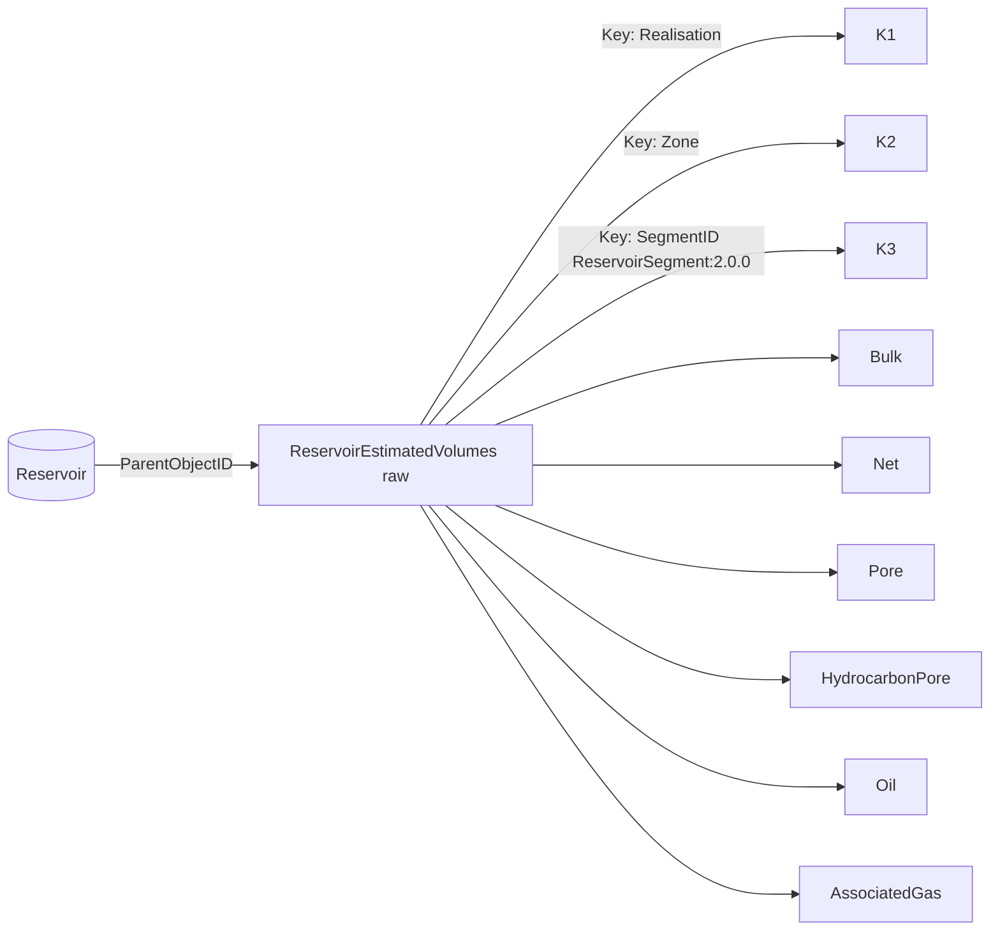
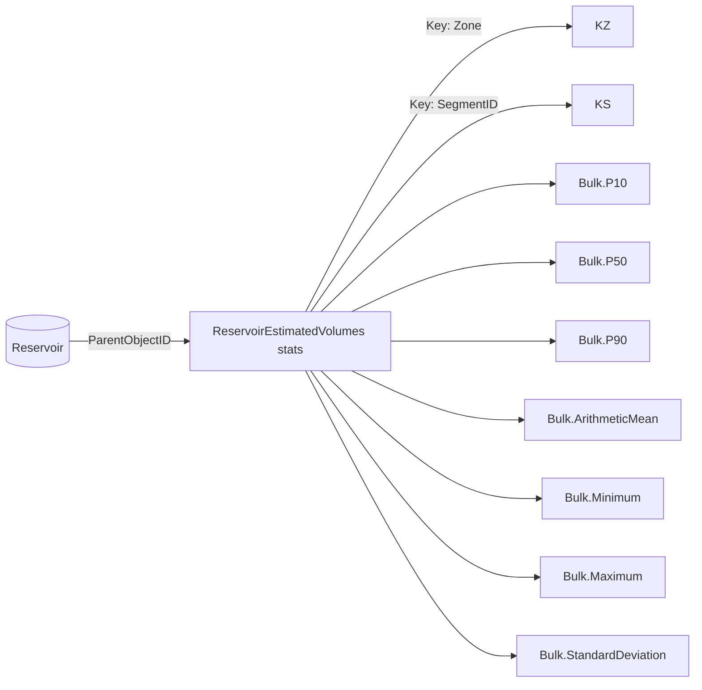

# Reservoir Estimated Volumes — Raw & Aggregated in OSDU

> **FMU context**: In fmu-dataio, in-place volumes are exported as a **standard result** via [`export_inplace_volumes`](https://fmu-dataio.readthedocs.io/en/latest/simple_exports/index.html). This produces Parquet tables with validated column conventions (BULK, NET, PORV, HCPV, STOIIP, GIIP, etc. keyed by ZONE, REGION, FACIES, REAL). The OSDU mapping below uses `ReservoirEstimatedVolumes` WPC to persist these same volumes with domain semantics.
>
> **Links**: [fmu-dataio docs](https://fmu-dataio.readthedocs.io/en/latest/) · [fmu-drogon](https://github.com/equinor/fmu-drogon) · [OSDU Data Definitions](https://community.opengroup.org/osdu/data/data-definitions) · [Uncertainty guide](Uncertainty.md) · [FMU ↔ OSDU](FmuOsdu.md)

This note covers the volume representation using OSDU's **ReservoirEstimatedVolumes** WPC, aligned with the fmu-dataio standard result column conventions. We also outline **alternative approaches** (pure `ColumnBasedTable` vs `ReservoirEstimatedVolumes`) and list **improvements** for search and governance.

- **Raw realizations**: `work-product-component--ReservoirEstimatedVolumes:1.1.0` with a `Volumes` block keyed by `Realisation`, `Zone`, and `SegmentID`.
- **Aggregated statistics**: `work-product-component--ReservoirEstimatedVolumes:1.1.0` with `Volumes` columns carrying Facets for P10/P50/P90, Minimum/Maximum, ArithmeticMean, StandardDeviation.

`ReservoirEstimatedVolumes` is the *domain* WPC intended for in-place or technically recoverable volumes at the **Reservoir or ReservoirSegment** scope and is the recommended fit for this use case. citeturn3search51turn3search54turn3search48

> **Why not only ColumnBasedTable?** CBT is excellent as a generic tabular store, but `ReservoirEstimatedVolumes` adds domain semantics (property typing, reservoir links) and clearer discoverability in Reservoir Management. Use CBT when flexibility outweighs domain structure. citeturn1search28turn3search52

---

## 1) Canonical structure & naming

### 1.1 Keys and scope
- **Raw** (`manifest_wpcraw.json`):
  - `KeyColumns`: `Realisation:int`, `Zone:string`, `SegmentID:string` with `KindID = osdu:wks:master-data--ReservoirSegment:2.0.0` — this ties each row to a segment. citeturn3search2
- **Aggregated** (`manifest_wpcstat.json`):
  - `KeyColumns`: `Zone:string`, `SegmentID:string` (no `Realisation` because we aggregate across realizations). 
- **ParentObject**: both records reference the Reservoir in `ParentObjectID`; children point to `ReservoirSegment` where relevant. citeturn3search2turn3search1

> The `ReservoirEstimatedVolumes` kind is explicitly scoped to Field/Reservoir/ReservoirSegment via `ParentObjectID`, which matches these manifests. citeturn3search51

### 1.2 Property types (canonical)
Use the **reference catalog** `reference-data--ReservoirEstimatedVolumePropertyType` for canonical property types:
- `Bulk`, `Net`, `Pore`, `HydrocarbonPore`, `Oil`, `AssociatedGas` (as in your manifests). This ensures consistent semantics across datasets. citeturn3search1turn3search2

> In OSDU, reference data values provide the allowed codes for typed fields and are commonly synced and validated across tenants. citeturn1search20

### 1.3 Units of measure
- Columns consistently use `UnitOfMeasureID = ...:m3` — alternatively switch specific metrics to `Mm3` if we want million cubic meters in the column payloads. 

### 1.4 Column naming for aggregated statistics
- Use **dot notation**: `<Property>.<Statistic>` — e.g., `Bulk.P10`, `Oil.P50`, `AssociatedGas.StandardDeviation`.
- **Canonical facet roles**: Prefer `ArithmeticMean` (not `Average`), and `StandardDeviation` (not `StDev`), matching your `FacetRoleID`s. 

### 1.5 Facets for statistics
Each statistic column should attach a `FacetIDs` array with:
- `FacetTypeID = ...:FacetType:statistics`
- `FacetRoleID = ...:FacetRole:<Role>` (`P10`, `P50`, `P90`, `ArithmeticMean`, `Minimum`, `Maximum`, `StandardDeviation`). 

### 1.6 fmu-dataio standard result → OSDU REV column mapping

| fmu-dataio column (standard result) | OSDU REV PropertyType | Notes |
|---|---|---|
| `BULK` | `ReservoirEstimatedVolumePropertyType:Bulk` | Bulk rock volume |
| `NET` | `ReservoirEstimatedVolumePropertyType:Net` | Net rock volume |
| `PORV` | `ReservoirEstimatedVolumePropertyType:Pore` | Pore volume |
| `HCPV` | `ReservoirEstimatedVolumePropertyType:HydrocarbonPore` | HC pore volume |
| `STOIIP` | `ReservoirEstimatedVolumePropertyType:Oil` | Stock tank oil in place |
| `GIIP` | `ReservoirEstimatedVolumePropertyType:Gas` | Gas initially in place |
| `ASSOCIATEDGAS` | `ReservoirEstimatedVolumePropertyType:AssociatedGas` | Associated gas |
| `ASSOCIATEDOIL` | `ReservoirEstimatedVolumePropertyType:AssociatedOil` | Associated oil |
| `REAL` (key) | `Realisation` KeyColumn | fmu.realization.id |
| `ZONE` (key) | `Zone` KeyColumn | Stratigraphic zone |
| `REGION` / `FACIES` (key) | `SegmentID` KeyColumn | Maps to ReservoirSegment | 

---

## 2) Snippets that mirror the two manifests

### 2.1 Raw realizations (excerpt)
```json
{
  "kind": "osdu:wks:work-product-component--ReservoirEstimatedVolumes:1.1.0",
  "data": {
    "ParentObjectID": "dev:master-data--Reservoir:...:1",
    "Volumes": {
      "KeyColumns": [
        {"ColumnName": "Realisation", "ColumnRole": "Key", "ValueType": "integer"},
        {"ColumnName": "Zone", "ColumnRole": "Key", "ValueType": "string"},
        {"ColumnName": "SegmentID", "ColumnRole": "Key", "ValueType": "string",
         "KindID": "osdu:wks:master-data--ReservoirSegment:2.0.0"}
      ],
      "Columns": [
        {"ColumnName": "Bulk", "ValueType": "number",
         "PropertyTypeID": "dev:reference-data--ReservoirEstimatedVolumePropertyType:Bulk:",
         "UnitOfMeasureID": "dev:reference-data--UnitOfMeasure:m3"},
        {"ColumnName": "Net",  "ValueType": "number",
         "PropertyTypeID": "dev:reference-data--ReservoirEstimatedVolumePropertyType:Net:",
         "UnitOfMeasureID": "dev:reference-data--UnitOfMeasure:m3"}
        // ... Pore, HydrocarbonPore, Oil, AssociatedGas
      ]
    }
  }
}
```
*Matches:* `Realisation/Zone/SegmentID` keys and property‑typed numeric columns with `m3`. citeturn3search2

### 2.2 Aggregated statistics (excerpt)
```json
{
  "kind": "osdu:wks:work-product-component--ReservoirEstimatedVolumes:1.1.0",
  "data": {
    "ParentObjectID": "dev:master-data--Reservoir:...:1",
    "Volumes": {
      "KeyColumns": [
        {"ColumnName": "Zone", "ColumnRole": "Key", "ValueType": "string"},
        {"ColumnName": "SegmentID", "ColumnRole": "Key", "ValueType": "string",
         "KindID": "osdu:wks:master-data--ReservoirSegment:2.0.0"}
      ],
      "Columns": [
        {"ColumnName": "Bulk.P10", "ValueType": "number",
         "PropertyTypeID": "dev:reference-data--ReservoirEstimatedVolumePropertyType:Bulk:",
         "UnitOfMeasureID": "dev:reference-data--UnitOfMeasure:m3",
         "FacetIDs": [{
            "FacetTypeID": "dev:reference-data--FacetType:statistics",
            "FacetRoleID": "dev:reference-data--FacetRole:P10"}]},
        {"ColumnName": "Bulk.ArithmeticMean", "ValueType": "number",
         "PropertyTypeID": "dev:reference-data--ReservoirEstimatedVolumePropertyType:Bulk:",
         "UnitOfMeasureID": "dev:reference-data--UnitOfMeasure:m3",
         "FacetIDs": [{
            "FacetTypeID": "dev:reference-data--FacetType:statistics",
            "FacetRoleID": "dev:reference-data--FacetRole:ArithmeticMean"}]}
        // ... Net.*, Pore.*, HydrocarbonPore.*, Oil.*, AssociatedGas.* for P10/P50/P90/Minimum/Maximum/StandardDeviation
      ]
    }
  }
}
```
*Matches:* dot‑notation columns plus `FacetIDs` for statistics roles. 

---

## 3) Mermaid views

### 3.1 Raw realizations


### 3.2 Aggregated statistics


---

## 4) Alternatives & improvements

### 4.1 `ReservoirEstimatedVolumes` **vs** `ColumnBasedTable`
**ReservoirEstimatedVolumes (current approach)**
- **Pros**: Domain semantics (explicit *estimated volumes*), clear link to Reservoir/Segment via `ParentObjectID`, **property typing** via `ReservoirEstimatedVolumePropertyType`, and a well‑documented, discoverable WPC. Ideal for DG analytics and cross‑app interoperability. citeturn3search51turn3search54
- **Cons**: Less free‑form; schema expects canonical properties and structure.

**ColumnBasedTable (generic)**
- **Pros**: Max flexibility for ad‑hoc columns (e.g., experimental knobs, non‑standard outputs); great for intermediate analysis tables. citeturn1search28
- **Cons**: You must enforce semantics yourself (property types, units, relationships); discoverability is weaker than a domain WPC.

**Pragmatic hybrid**: Keep `ReservoirEstimatedVolumes` as the **authoritative** volumes store; optionally retain a CBT for *raw intermediate* or *wide* tables and link it via lineage. citeturn1search28turn3search48

### 4.2 GeoLabelSet for fast search (optional)
Expose selected metrics (usually **P50**) per segment as `GeoLabelSet` labels to accelerate search and filtering, while deep numbers remain in REV. This improves user experience in portals while preserving analytical depth. citeturn3search52

### 4.3 Canonical roles and naming checklist
- Use `ArithmeticMean` (not Average), `StandardDeviation` (not StDev).
- Prefer `m3` unless a business rule demands `Mm3` — keep units consistent per column.
- Keep **dot‑notation** for stats columns; avoid embedding units in names (use `UnitOfMeasureID`). 

### 4.4 Partition governance
- Continue using Equinor DEV ACL and legal tags; keep **WorkProduct** ids in `ParentWorkProductID` to bundle DG artifacts. Consider a dedicated WorkProduct per DG step. citeturn3search1turn3search2

---

## 5) Where this fits in OSDU
- `ReservoirEstimatedVolumes` is part of the **Reservoir Management** worked examples; it links to Reservoir/Segments and complements other reservoir WPCs. citeturn3search48
- `ColumnBasedTable` is the canonical generic table WPC and is widely used in reservoir data worked examples. citeturn1search28

---

## 6) Quick differences (at a glance)

| Aspect | Raw `ReservoirEstimatedVolumes` | Aggregated `ReservoirEstimatedVolumes` |
|---|---|---|
| Keys | `Realisation`, `Zone`, `SegmentID (KindID: ReservoirSegment:2.0.0)` | `Zone`, `SegmentID (KindID: ReservoirSegment:2.0.0)` |
| Columns | `Bulk, Net, Pore, HydrocarbonPore, Oil, AssociatedGas` with `PropertyTypeID` + `m3` | Dot‑notation columns (`Bulk.P10`, `Oil.ArithmeticMean`, etc.) with `FacetIDs` (statistics) |
| Scope | Each realization row | Aggregates across realizations |
| Pros | Full variability preserved | Compact for decision reporting |
| Typical Use | Monte Carlo/raw runs | DG, dashboards |
