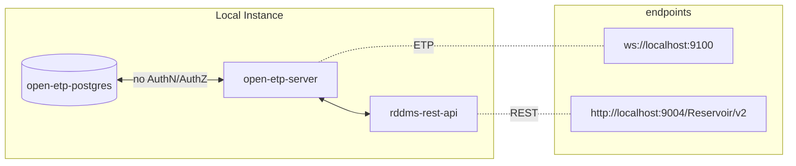
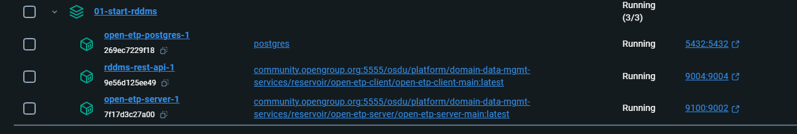
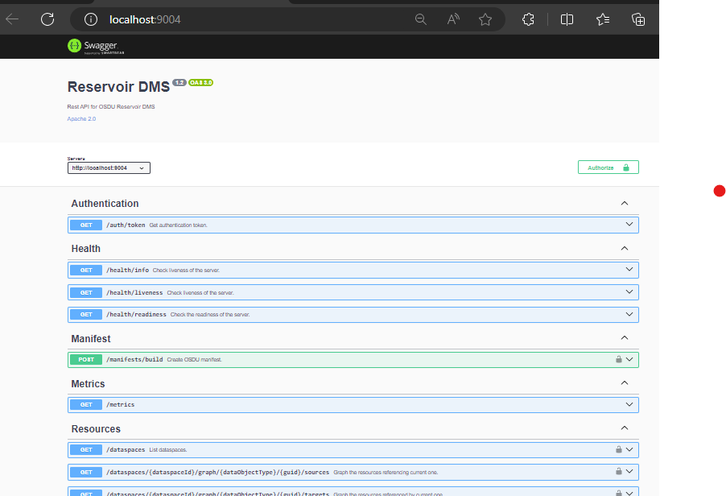

# Prerequisites

Ensure you have Docker Desktop set up and running on your Windows machine.

This documentation utilizes [Mermaid Diagrams](https://mermaid.js.org/).<br>
If you are using Visual Studio Code for visualization, you can install a Mermaid extension to preview the diagrams.<br>Recommended extension:
- [Markdown Mermaid](https://marketplace.visualstudio.com/items?itemName=bierner.markdown-mermaid)

# Getting Started

The code snippets from this file will require you to run the commands from inside the `01-Start-local-rddms` directory in a PowerShell terminal:
  ```powershell
  cd 01-Start-local-rddms
  ```

To set up the environment on your local machine, use Docker Compose:

```powershell
docker compose up -d
```

This command pulls three Docker images and starts the following containers:

- `open-etp-postgres`: Postgres container (the underlying database for OSDU RDDMS)
- `open-etp-server`: Core OSDU RDDMS container from the OSDU Docker registry (OpenETPServer)
- `rddms-rest-api`: Container from the OSDU Docker registry exposing a REST API for the OSDU RDDMS



The `open-etp-server` is central to the RDDMS.<br>
Its primary function is to expose a WebSocket API using the public domain Energistic Transfers Protocol (ETP) and manage data persistence with the Postgres database.

The `rddms-rest-api` provides a REST API wrapper around the RDDMS server, allowing interaction with various programming languages.<br>
It utilizes a TypeScript ETP client to communicate to the 'open-etp-server' via ETP protocol.

Details on using this REST API will be covered in the next section,
We will cover this rest API in the next section `03-REST-api` call the REST API from Python.

To interact with the ETP server directly, you can also use an ETP client. This tutorial covers three clients:
- Two open-source clients: `02-ETP-OSDU-etp-client` and `05-ETP-Pyetp-client`
- One embedded in the AspenTech RMS application: `04-ETP-RMS-Python-API`

Note: The ETP server is started without authentication and authorization in this tutorial. Authentication and authorization will be discussed in section `06-ADV-Auth`.


# Quick checks

Verify the setup using one of the following methods:

- **Docker Command:**
  ```powershell
  docker container ls --filter name=01-start-rddms
  ```
  You should see three containers running.

- **Docker Desktop:**


- **REST API Service:**<br>
  Open http://localhost:9004/Reservoir/v2 to view the REST API Swagger documentation.
  


# Shuting down the Services

 To shut down all running services and the database, use the following command.
```powershell
docker compose down
```
Note: Since no persistent volume is created for the Postgres database, when using the `down` method, all data will be lost.

Alternatively, if you simply want to stop the services while preserving the database and data spaces for later use, you can use the `stop` and `start` options of Docker Compose.

```powershell
docker compose stop

docker compose start
```
